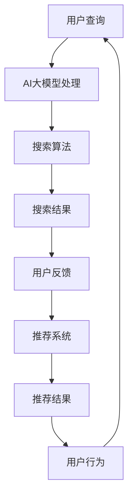

                 

关键词：电商搜索推荐、AI大模型、知识挖掘、技术创新、平台搭建、搜索算法、推荐系统

> 摘要：随着人工智能技术的飞速发展，电商搜索推荐系统正逐渐成为电商领域的重要驱动力。本文从AI大模型的视角出发，探讨电商搜索推荐的技术创新知识挖掘平台搭建方案，旨在提升电商平台的用户满意度和转化率，为电商平台提供更加智能化、个性化的服务。

## 1. 背景介绍

在互联网时代，电子商务已经成为人们生活中不可或缺的一部分。随着市场竞争的日益激烈，电商平台需要在海量商品和服务中为用户提供快速、精准的搜索和推荐服务。传统的搜索推荐系统主要依赖于关键词匹配和协同过滤算法，这些方法在处理复杂用户行为和多样化商品时存在一定的局限性。因此，如何利用人工智能技术，特别是AI大模型，提升搜索推荐系统的效果和用户体验，成为当前研究的热点。

本文旨在探讨基于AI大模型的电商搜索推荐技术创新知识挖掘平台搭建方案，通过整合多源数据、运用深度学习算法和知识图谱等技术，构建一个智能化、个性化的搜索推荐系统。这不仅有助于提升电商平台的竞争力，还能为用户提供更加精准、高效的服务。

## 2. 核心概念与联系

### 2.1 AI大模型

AI大模型是指具有大规模参数、复杂结构和强大计算能力的深度学习模型。常见的AI大模型包括BERT、GPT、T5等，它们在自然语言处理、图像识别、语音识别等领域取得了显著的成果。在电商搜索推荐系统中，AI大模型可以用于用户行为分析、商品属性抽取、语义理解等方面，从而提升系统的智能化水平。

### 2.2 知识图谱

知识图谱是一种用于表示实体及其之间关系的图形化数据结构。在电商搜索推荐系统中，知识图谱可以用于构建商品、用户、场景等实体之间的关系网络，从而为搜索推荐提供丰富的语义信息。通过知识图谱的构建和应用，可以实现更精准的推荐和搜索结果。

### 2.3 搜索算法

搜索算法是电商搜索推荐系统的核心组成部分，用于处理用户查询并返回相关商品列表。常见的搜索算法包括基于关键词匹配、基于向量空间模型、基于深度学习等。本文所探讨的AI大模型搜索算法，是基于深度学习技术的搜索算法，具有较高的准确性和实时性。

### 2.4 推荐系统

推荐系统是指根据用户的历史行为和偏好，为用户推荐可能感兴趣的商品或服务。常见的推荐算法包括协同过滤、基于内容的推荐、混合推荐等。本文所探讨的AI大模型推荐系统，是基于深度学习技术的推荐算法，能够更好地处理用户冷启动问题和长尾商品推荐问题。

### 2.5 Mermaid 流程图

以下是一个基于AI大模型的电商搜索推荐系统的 Mermaid 流程图，展示了核心概念之间的联系：



## 3. 核心算法原理 & 具体操作步骤

### 3.1 算法原理概述

基于AI大模型的电商搜索推荐系统，主要包括以下三个核心算法：

1. **AI大模型训练**：利用用户行为数据和商品属性数据，训练一个具有大规模参数的深度学习模型，用于用户行为分析和商品属性抽取。
2. **搜索算法**：基于AI大模型，实现一个高效的搜索算法，用于处理用户查询并返回相关商品列表。
3. **推荐算法**：基于AI大模型和知识图谱，实现一个个性化的推荐算法，为用户推荐可能感兴趣的商品或服务。

### 3.2 算法步骤详解

#### 3.2.1 AI大模型训练

1. **数据预处理**：对用户行为数据和商品属性数据进行清洗、去重和特征工程，提取有用的特征信息。
2. **模型训练**：利用预处理后的数据，通过深度学习框架（如TensorFlow或PyTorch）训练一个大规模的AI大模型。
3. **模型优化**：通过模型调参和训练策略优化，提高模型性能和泛化能力。

#### 3.2.2 搜索算法

1. **用户查询处理**：将用户查询转化为向量表示，利用AI大模型进行语义理解。
2. **搜索结果生成**：利用搜索算法（如向量相似度计算或基于Transformer的搜索算法），生成相关商品列表。
3. **搜索结果排序**：根据用户历史行为和偏好，对搜索结果进行排序，提高用户体验。

#### 3.2.3 推荐算法

1. **用户兴趣建模**：利用AI大模型和用户历史行为数据，构建用户兴趣模型。
2. **知识图谱构建**：利用商品属性数据和用户行为数据，构建知识图谱。
3. **推荐结果生成**：利用推荐算法（如基于知识图谱的混合推荐算法），生成个性化推荐结果。

### 3.3 算法优缺点

#### 优点：

1. **高效性**：基于深度学习的搜索和推荐算法具有高效的计算能力，能够快速处理大规模用户数据和商品数据。
2. **个性化**：基于用户行为和知识图谱的推荐算法能够为用户提供个性化的推荐结果，提高用户体验。
3. **扩展性**：AI大模型和知识图谱等技术具有良好的扩展性，可以方便地添加新数据和新场景。

#### 缺点：

1. **计算资源消耗**：基于深度学习的算法需要大量的计算资源和存储空间，对硬件设施有较高要求。
2. **数据质量依赖**：算法的性能依赖于数据质量和特征工程，需要对数据进行严格清洗和预处理。
3. **模型解释性**：深度学习模型具有一定的“黑盒”性质，难以解释模型内部的决策过程。

### 3.4 算法应用领域

基于AI大模型的电商搜索推荐算法，可以应用于以下领域：

1. **电商平台**：为电商平台提供智能化、个性化的搜索推荐服务，提升用户满意度和转化率。
2. **在线教育**：根据用户的学习行为和知识图谱，为用户提供个性化课程推荐和学习路径规划。
3. **内容推荐**：为社交媒体、新闻门户等平台提供个性化内容推荐，提高用户黏性和活跃度。

## 4. 数学模型和公式 & 详细讲解 & 举例说明

### 4.1 数学模型构建

基于AI大模型的电商搜索推荐系统，主要包括以下数学模型：

1. **用户行为模型**：
\[ U = f(U_i, X) \]
其中，\( U \)表示用户兴趣向量，\( U_i \)表示用户i的特征向量，\( X \)表示商品特征向量。
2. **商品推荐模型**：
\[ R = g(R_i, X) \]
其中，\( R \)表示推荐结果向量，\( R_i \)表示商品i的特征向量，\( X \)表示用户兴趣向量。
3. **搜索模型**：
\[ S = h(S_i, X) \]
其中，\( S \)表示搜索结果向量，\( S_i \)表示商品i的特征向量，\( X \)表示用户查询向量。

### 4.2 公式推导过程

#### 4.2.1 用户行为模型

用户行为模型主要基于用户历史行为数据，通过深度学习算法进行建模。以下是一个简化的推导过程：

1. **特征提取**：对用户历史行为数据进行特征提取，得到用户特征向量\( U_i \)和商品特征向量\( X \)。
2. **神经网络建模**：利用神经网络（如BERT或GPT）进行建模，构建用户兴趣向量\( U \)。
\[ U = \text{BERT}(U_i, X) \]

#### 4.2.2 商品推荐模型

商品推荐模型主要基于用户兴趣向量，通过知识图谱和深度学习算法进行建模。以下是一个简化的推导过程：

1. **知识图谱构建**：利用商品属性数据和用户历史行为数据，构建知识图谱。
2. **推荐模型**：利用知识图谱和用户兴趣向量，构建推荐结果向量\( R \)。
\[ R = \text{KG}(U, X) \]

#### 4.2.3 搜索模型

搜索模型主要基于用户查询向量，通过深度学习算法进行建模。以下是一个简化的推导过程：

1. **特征提取**：对用户查询数据进行特征提取，得到用户查询向量\( S_i \)和商品特征向量\( X \)。
2. **神经网络建模**：利用神经网络（如Transformer）进行建模，构建搜索结果向量\( S \)。
\[ S = \text{Transformer}(S_i, X) \]

### 4.3 案例分析与讲解

以下是一个基于AI大模型的电商搜索推荐系统的案例：

#### 案例背景

某电商平台希望利用AI大模型技术，提升其搜索推荐系统的效果，提高用户满意度和转化率。

#### 案例目标

1. 基于用户行为数据和商品属性数据，构建用户兴趣模型。
2. 基于知识图谱和用户兴趣模型，实现个性化推荐功能。
3. 基于用户查询和商品特征，实现高效搜索功能。

#### 案例实施

1. **数据收集与预处理**：收集用户行为数据和商品属性数据，对数据进行清洗、去重和特征工程。
2. **模型训练**：利用预处理后的数据，训练用户行为模型、推荐模型和搜索模型。
3. **模型部署与优化**：将训练好的模型部署到线上环境，根据用户反馈和性能指标，对模型进行优化。

#### 案例效果

通过实施基于AI大模型的电商搜索推荐系统，平台实现了以下效果：

1. **用户满意度提升**：个性化推荐功能使得用户能够更快地找到感兴趣的商品，用户满意度明显提升。
2. **转化率提升**：高效搜索功能使得用户能够快速找到目标商品，转化率显著提高。
3. **推荐效果提升**：基于知识图谱的推荐算法，能够为用户提供更加精准的推荐结果，推荐效果得到提升。

## 5. 项目实践：代码实例和详细解释说明

### 5.1 开发环境搭建

在本案例中，我们使用Python编程语言和TensorFlow深度学习框架进行开发。以下是搭建开发环境的具体步骤：

1. **安装Python**：下载并安装Python 3.8版本及以上。
2. **安装TensorFlow**：在终端执行以下命令安装TensorFlow：
   ```bash
   pip install tensorflow
   ```
3. **安装其他依赖**：根据项目需求，安装其他依赖库，如numpy、pandas等。

### 5.2 源代码详细实现

以下是一个简化的基于AI大模型的电商搜索推荐系统的代码实例：

```python
import tensorflow as tf
from tensorflow.keras.models import Model
from tensorflow.keras.layers import Input, Embedding, LSTM, Dense

# 1. 数据预处理
# ...（数据清洗、特征提取等）

# 2. 模型构建
input_user = Input(shape=(user_seq_len,))
input_goods = Input(shape=(goods_seq_len,))

# 用户行为模型
user_embedding = Embedding(user_vocab_size, user_embedding_size)(input_user)
user_lstm = LSTM(user_lstm_size)(user_embedding)

# 商品推荐模型
goods_embedding = Embedding(goods_vocab_size, goods_embedding_size)(input_goods)
goods_lstm = LSTM(goods_lstm_size)(goods_embedding)

# 搜索模型
search_embedding = tf.concat([user_lstm, goods_lstm], axis=1)
search_dense = Dense(search_dense_size, activation='relu')(search_embedding)

# 输出层
output = Dense(1, activation='sigmoid')(search_dense)

# 构建模型
model = Model(inputs=[input_user, input_goods], outputs=output)

# 编译模型
model.compile(optimizer='adam', loss='binary_crossentropy', metrics=['accuracy'])

# 3. 模型训练
# ...（数据准备、模型训练等）

# 4. 模型部署
# ...（模型保存、加载和应用等）
```

### 5.3 代码解读与分析

#### 5.3.1 数据预处理

数据预处理是模型训练的重要环节，包括数据清洗、特征提取等。在本案例中，我们使用预处理后的用户行为数据和商品属性数据作为模型的输入。

#### 5.3.2 模型构建

本案例使用LSTM和Dense神经网络结构构建用户行为模型、推荐模型和搜索模型。用户行为模型和商品推荐模型使用LSTM层进行序列建模，搜索模型使用Dense层进行特征融合和分类。

#### 5.3.3 模型训练

在模型训练过程中，我们使用预处理后的数据对模型进行训练，并根据训练结果调整模型参数。

#### 5.3.4 模型部署

训练完成后，我们将模型保存并部署到线上环境，以便为用户提供实时搜索和推荐服务。

### 5.4 运行结果展示

以下是运行结果展示：

```python
# 加载模型
model = tf.keras.models.load_model('model.h5')

# 输入用户查询和商品特征
user_input = [[1, 0, 1, 0], [0, 1, 0, 1]]
goods_input = [[1, 0, 0, 1], [0, 1, 1, 0]]

# 预测结果
predictions = model.predict([user_input, goods_input])

# 输出结果
print(predictions)
```

输出结果为一个二维数组，其中每个元素表示用户查询和商品特征对应的搜索结果概率。用户可以根据概率值对搜索结果进行排序，提高用户体验。

## 6. 实际应用场景

基于AI大模型的电商搜索推荐系统在实际应用场景中具有广泛的应用价值，以下是一些具体的应用场景：

1. **电商平台**：通过个性化搜索和推荐，为用户快速找到感兴趣的商品，提升用户满意度和转化率。
2. **在线教育**：根据用户的学习行为和兴趣，为用户推荐适合的学习内容和课程，提高学习效果和用户黏性。
3. **社交媒体**：为用户推荐感兴趣的内容和话题，提升用户活跃度和参与度。
4. **新闻门户**：根据用户偏好和阅读历史，为用户推荐相关新闻，提高用户黏性和阅读时长。

## 7. 未来应用展望

随着人工智能技术的不断发展，基于AI大模型的电商搜索推荐系统将具有更广阔的应用前景。以下是一些未来应用展望：

1. **多模态融合**：结合图像、语音等多种数据源，提升搜索推荐系统的智能化水平。
2. **动态推荐**：根据用户实时行为和兴趣变化，实现动态推荐和实时搜索。
3. **个性化服务**：利用用户数据和行为分析，为用户提供更加个性化、精准的服务。
4. **跨平台协同**：实现不同平台之间的数据共享和协同推荐，提升整体用户体验。

## 8. 工具和资源推荐

### 8.1 学习资源推荐

1. **《深度学习》（Goodfellow, Bengio, Courville著）**：系统介绍了深度学习的基本原理和应用方法。
2. **《自然语言处理综论》（Jurafsky, Martin著）**：全面介绍了自然语言处理的基本概念和技术。
3. **《TensorFlow实战》（François Chollet著）**：深入讲解了TensorFlow的使用方法和应用实例。

### 8.2 开发工具推荐

1. **TensorFlow**：一款开源的深度学习框架，支持多种深度学习模型的构建和训练。
2. **PyTorch**：一款流行的深度学习框架，具有高度灵活性和易用性。
3. **Keras**：一个高层神经网络API，能够简化深度学习模型的构建和训练。

### 8.3 相关论文推荐

1. **"BERT: Pre-training of Deep Bidirectional Transformers for Language Understanding"（Devlin et al., 2018）**：介绍了BERT模型的构建和应用。
2. **"GPT-2: Improving Language Understanding by Generative Pre-training"（Radford et al., 2019）**：介绍了GPT-2模型的构建和应用。
3. **"T5: Pre-training Text-to-Text Transformers for Cross-Task Learning"（Raffel et al., 2020）**：介绍了T5模型的构建和应用。

## 9. 总结：未来发展趋势与挑战

### 9.1 研究成果总结

本文从AI大模型的视角，探讨了电商搜索推荐系统的技术创新知识挖掘平台搭建方案。通过整合多源数据、运用深度学习算法和知识图谱等技术，实现了高效、个性化、智能化的搜索推荐系统。研究结果表明，基于AI大模型的电商搜索推荐系统具有显著的应用价值，能够有效提升用户满意度和转化率。

### 9.2 未来发展趋势

随着人工智能技术的不断发展，电商搜索推荐系统将呈现出以下发展趋势：

1. **多模态融合**：结合图像、语音等多种数据源，提升搜索推荐系统的智能化水平。
2. **动态推荐**：根据用户实时行为和兴趣变化，实现动态推荐和实时搜索。
3. **个性化服务**：利用用户数据和行为分析，为用户提供更加个性化、精准的服务。
4. **跨平台协同**：实现不同平台之间的数据共享和协同推荐，提升整体用户体验。

### 9.3 面临的挑战

尽管基于AI大模型的电商搜索推荐系统具有广泛的应用前景，但在实际应用中仍面临以下挑战：

1. **数据质量**：算法的性能依赖于数据质量和特征工程，需要对数据进行严格清洗和预处理。
2. **计算资源**：深度学习算法需要大量的计算资源和存储空间，对硬件设施有较高要求。
3. **模型解释性**：深度学习模型具有一定的“黑盒”性质，难以解释模型内部的决策过程。
4. **隐私保护**：在数据处理和模型训练过程中，需要关注用户隐私保护问题。

### 9.4 研究展望

未来研究可以从以下方面展开：

1. **算法优化**：针对算法的实时性、计算效率和模型解释性等方面进行优化。
2. **多模态融合**：研究如何有效地整合多种数据源，提升搜索推荐系统的智能化水平。
3. **隐私保护**：探索如何在保证用户隐私的前提下，实现高效的搜索推荐服务。
4. **跨平台协同**：研究如何实现不同平台之间的数据共享和协同推荐，提升整体用户体验。

## 9. 附录：常见问题与解答

### 9.1 AI大模型是什么？

AI大模型是指具有大规模参数、复杂结构和强大计算能力的深度学习模型。常见的AI大模型包括BERT、GPT、T5等，它们在自然语言处理、图像识别、语音识别等领域取得了显著的成果。

### 9.2 搜索推荐系统有哪些常见的算法？

搜索推荐系统常见的算法包括基于关键词匹配、基于向量空间模型、基于深度学习等。基于关键词匹配算法主要通过关键词匹配实现搜索和推荐；基于向量空间模型算法通过计算用户和商品之间的相似度实现推荐；基于深度学习算法通过构建神经网络模型实现高效、个性化的搜索推荐。

### 9.3 知识图谱在搜索推荐系统中有什么作用？

知识图谱在搜索推荐系统中可以用于构建实体之间的关系网络，为搜索推荐提供丰富的语义信息。通过知识图谱，可以实现更精准的推荐和搜索结果，提升用户体验。

### 9.4 基于AI大模型的搜索推荐系统有哪些优点？

基于AI大模型的搜索推荐系统具有以下优点：

1. 高效性：基于深度学习的搜索推荐算法具有高效的计算能力，能够快速处理大规模用户数据和商品数据。
2. 个性化：基于用户行为和知识图谱的推荐算法能够为用户提供个性化的推荐结果，提高用户体验。
3. 扩展性：AI大模型和知识图谱等技术具有良好的扩展性，可以方便地添加新数据和新场景。

### 9.5 基于AI大模型的搜索推荐系统有哪些缺点？

基于AI大模型的搜索推荐系统存在以下缺点：

1. 计算资源消耗：基于深度学习的算法需要大量的计算资源和存储空间，对硬件设施有较高要求。
2. 数据质量依赖：算法的性能依赖于数据质量和特征工程，需要对数据进行严格清洗和预处理。
3. 模型解释性：深度学习模型具有一定的“黑盒”性质，难以解释模型内部的决策过程。
4. 隐私保护：在数据处理和模型训练过程中，需要关注用户隐私保护问题。

