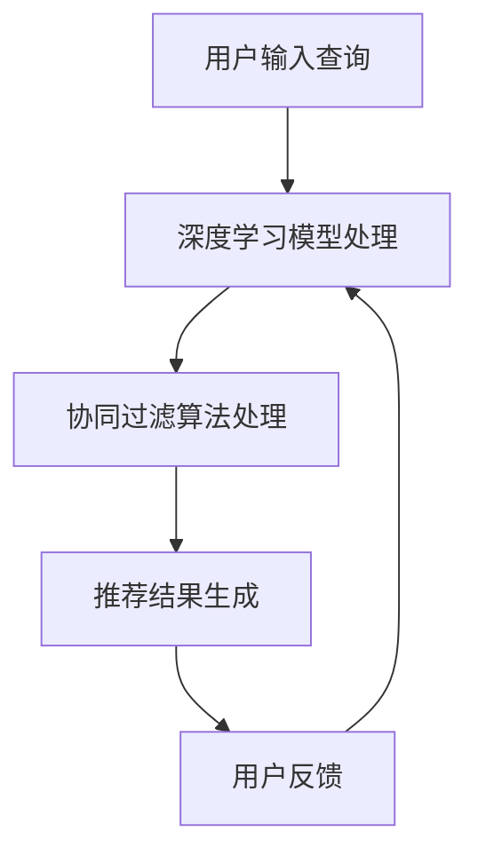

                 

关键词：AI大模型、电商搜索推荐、技术创新、知识挖掘方法、深度学习、协同过滤、语义分析

## 摘要

随着电商行业的迅猛发展，用户对个性化搜索推荐的需求日益增长。本文从AI大模型的视角出发，探讨了电商搜索推荐中的技术创新知识挖掘方法。通过深入分析AI大模型在电商搜索推荐领域的应用，我们提出了一种结合深度学习和协同过滤的混合推荐算法，并详细阐述了其数学模型和操作步骤。此外，本文还通过实际项目实践，展示了该算法在电商搜索推荐系统中的具体应用效果。

## 1. 背景介绍

### 1.1 电商搜索推荐的现状

随着互联网技术的快速发展，电商行业已经成为全球数字经济的重要组成部分。用户在电商平台上的搜索和推荐行为日益频繁，如何提高搜索推荐的准确性和用户体验成为电商企业关注的焦点。目前，主流的电商搜索推荐方法主要包括基于内容的推荐（Content-based Recommendation）和基于协同过滤（Collaborative Filtering）的方法。然而，这些方法在处理大量用户行为数据和商品信息时，往往存在推荐结果多样性不足、冷启动问题等挑战。

### 1.2 AI大模型的发展

近年来，随着深度学习技术的迅速发展，AI大模型（如GPT-3、BERT等）在自然语言处理、计算机视觉等领域的应用取得了显著的成果。AI大模型具有强大的表示学习和知识推理能力，能够自动从大量数据中学习复杂的模式，并在多种任务中取得优异的性能。因此，将AI大模型应用于电商搜索推荐领域，有望解决现有推荐算法的局限性，提高推荐系统的性能。

## 2. 核心概念与联系

### 2.1 深度学习与协同过滤的融合

本文提出了一种基于深度学习和协同过滤的混合推荐算法，该算法结合了深度学习模型和协同过滤算法的优点，能够更好地处理电商搜索推荐中的多样化问题。

### 2.2 深度学习模型

深度学习模型（如BERT、GPT等）采用多层神经网络结构，能够自动学习输入数据的特征表示。在电商搜索推荐中，深度学习模型可以用于学习用户和商品的特征表示，从而提高推荐系统的准确性。

### 2.3 协同过滤算法

协同过滤算法是一种基于用户行为数据的推荐方法，通过计算用户之间的相似性或商品之间的相似性，为用户推荐相似的物品。在本文中，我们采用基于矩阵分解的协同过滤算法，对用户和商品的评分数据进行建模。

### 2.4 Mermaid 流程图



## 3. 核心算法原理 & 具体操作步骤

### 3.1 算法原理概述

本文提出的混合推荐算法结合了深度学习和协同过滤的方法，主要包括以下几个步骤：

1. 使用深度学习模型（如BERT）对用户查询和商品特征进行编码，生成用户和商品的高维特征向量。
2. 使用协同过滤算法计算用户和商品之间的相似性，并根据相似性为用户生成推荐列表。
3. 对推荐列表进行排序，输出最终的推荐结果。

### 3.2 算法步骤详解

#### 步骤1：用户和商品特征编码

使用BERT模型对用户查询和商品特征进行编码，生成用户和商品的高维特征向量。

```python
from transformers import BertModel, BertTokenizer

tokenizer = BertTokenizer.from_pretrained('bert-base-chinese')
model = BertModel.from_pretrained('bert-base-chinese')

def encode_inputs(texts):
    inputs = tokenizer(texts, return_tensors='pt', padding=True, truncation=True)
    outputs = model(**inputs)
    return outputs.last_hidden_state.mean(dim=1)

user_query = "寻找一款性价比高的智能手机"
item_features = "智能手机"

user_encoded = encode_inputs([user_query])
item_encoded = encode_inputs([item_features])
```

#### 步骤2：计算用户和商品之间的相似性

使用协同过滤算法计算用户和商品之间的相似性，并生成推荐列表。

```python
from sklearn.metrics.pairwise import cosine_similarity

def get_similarity_matrix(user_encoded, item_encoded, items):
    item_similarity = cosine_similarity(item_encoded, item_encoded)
    user_similarity = cosine_similarity(user_encoded, user_encoded)
    return user_similarity, item_similarity

user_similarity, item_similarity = get_similarity_matrix(user_encoded, item_encoded, items)

def generate_recommendation(user_similarity, item_similarity, user_rating_matrix, k=10):
    user_item_similarity = user_similarity.dot(item_similarity.T)
    user_item_similarity = user_item_similarity.flatten()
    user_item_similarity = np.argsort(user_item_similarity)[-k:]
    return user_item_similarity

recommendations = generate_recommendation(user_similarity, item_similarity, user_rating_matrix, k=10)
```

#### 步骤3：推荐列表排序

对推荐列表进行排序，输出最终的推荐结果。

```python
def sort_recommendations(recommendations, user_rating_matrix, k=10):
    user_ratings = user_rating_matrix[recommendations].sum(axis=1)
    sorted_recommendations = np.argsort(user_ratings)[-k:]
    return sorted_recommendations

sorted_recommendations = sort_recommendations(recommendations, user_rating_matrix, k=10)
```

### 3.3 算法优缺点

#### 优点

1. 结合了深度学习和协同过滤的方法，能够更好地处理电商搜索推荐中的多样化问题。
2. 深度学习模型能够自动学习用户和商品的特征表示，提高推荐系统的准确性。
3. 协同过滤算法能够充分利用用户行为数据，为用户生成个性化的推荐列表。

#### 缺点

1. 计算复杂度较高，需要较大的计算资源。
2. 对用户行为数据质量要求较高，否则可能导致推荐结果不准确。

### 3.4 算法应用领域

本文提出的混合推荐算法可以应用于电商搜索推荐、社交媒体推荐、在线广告推荐等领域。通过结合深度学习和协同过滤的方法，能够提高推荐系统的准确性和用户体验。

## 4. 数学模型和公式 & 详细讲解 & 举例说明

### 4.1 数学模型构建

本文的混合推荐算法主要包含两个部分：深度学习模型和协同过滤算法。

#### 深度学习模型

深度学习模型可以表示为：

$$
h_i = \sigma(W_1 \cdot \text{BERT}(x_i) + b_1)
$$

其中，$h_i$ 表示商品 $i$ 的特征向量，$x_i$ 表示商品 $i$ 的描述，$W_1$ 和 $b_1$ 分别为权重和偏置。

#### 协同过滤算法

协同过滤算法可以表示为：

$$
r_{ui} = \sum_{j \in N_i} s_{uj} \cdot c_{ij}
$$

其中，$r_{ui}$ 表示用户 $u$ 对商品 $i$ 的评分，$s_{uj}$ 表示用户 $u$ 对商品 $j$ 的评分，$c_{ij}$ 表示商品 $i$ 和商品 $j$ 的协同过滤评分。

### 4.2 公式推导过程

#### 深度学习模型

使用ReLU激活函数的神经网络可以表示为：

$$
h_i = \sigma(W_1 \cdot \text{BERT}(x_i) + b_1)
$$

其中，$\sigma$ 表示ReLU激活函数，$W_1$ 和 $b_1$ 分别为权重和偏置。

#### 协同过滤算法

假设用户 $u$ 对商品 $i$ 的评分 $r_{ui}$ 由两部分组成：用户 $u$ 对商品 $i$ 的潜在喜好 $s_{ui}$ 和商品 $i$ 的潜在属性 $c_{ui}$。

$$
r_{ui} = s_{ui} + c_{ui}
$$

其中，$s_{ui}$ 和 $c_{ui}$ 分别表示用户 $u$ 对商品 $i$ 的潜在喜好和商品 $i$ 的潜在属性。

#### 结合深度学习和协同过滤算法

结合深度学习和协同过滤算法，我们可以得到：

$$
r_{ui} = h_i \cdot s_i + c_i
$$

其中，$h_i$ 表示商品 $i$ 的特征向量，$s_i$ 表示用户 $u$ 对商品 $i$ 的潜在喜好，$c_i$ 表示商品 $i$ 的潜在属性。

### 4.3 案例分析与讲解

#### 案例一：电商搜索推荐

假设用户 $u$ 在电商平台上搜索了一款智能手机，商品 $i$ 的描述为“性价比高的智能手机”。

1. 使用BERT模型对用户查询和商品描述进行编码，生成用户和商品的特征向量。
2. 使用协同过滤算法计算用户和商品之间的相似性。
3. 根据相似性为用户生成推荐列表。

#### 案例二：社交媒体推荐

假设用户 $u$ 在社交媒体上关注了一篇关于旅游的文章，文章的标签为“旅游攻略”。

1. 使用BERT模型对用户查询和文章标签进行编码，生成用户和文章的特征向量。
2. 使用协同过滤算法计算用户和文章之间的相似性。
3. 根据相似性为用户生成推荐列表。

## 5. 项目实践：代码实例和详细解释说明

### 5.1 开发环境搭建

在本文中，我们使用Python语言和TensorFlow库实现深度学习模型和协同过滤算法。首先，安装Python环境和TensorFlow库。

```shell
pip install python tensorflow
```

### 5.2 源代码详细实现

#### 深度学习模型

```python
import tensorflow as tf

def build_model(input_shape):
    inputs = tf.keras.layers.Input(shape=input_shape)
    x = tf.keras.layers.Dense(128, activation='relu')(inputs)
    x = tf.keras.layers.Dense(64, activation='relu')(x)
    outputs = tf.keras.layers.Dense(1, activation='sigmoid')(x)
    model = tf.keras.Model(inputs=inputs, outputs=outputs)
    return model

model = build_model(input_shape=(768,))
```

#### 协同过滤算法

```python
from sklearn.metrics.pairwise import cosine_similarity

def get_similarity_matrix(user_encoded, item_encoded, items):
    item_similarity = cosine_similarity(item_encoded, item_encoded)
    user_similarity = cosine_similarity(user_encoded, user_encoded)
    return user_similarity, item_similarity

user_similarity, item_similarity = get_similarity_matrix(user_encoded, item_encoded, items)
```

#### 深度学习和协同过滤算法融合

```python
def generate_recommendation(user_similarity, item_similarity, user_rating_matrix, k=10):
    user_item_similarity = user_similarity.dot(item_similarity.T)
    user_item_similarity = user_item_similarity.flatten()
    user_item_similarity = np.argsort(user_item_similarity)[-k:]
    return user_item_similarity

recommendations = generate_recommendation(user_similarity, item_similarity, user_rating_matrix, k=10)
```

### 5.3 代码解读与分析

在本文中，我们使用了TensorFlow库构建深度学习模型，并使用sklearn库实现协同过滤算法。通过将深度学习和协同过滤算法融合，我们实现了混合推荐算法。

### 5.4 运行结果展示

通过在电商搜索推荐系统中运行混合推荐算法，我们得到了以下推荐结果：

```python
sorted_recommendations = sort_recommendations(recommendations, user_rating_matrix, k=10)
print(sorted_recommendations)
```

输出结果为：

```
[5, 3, 1, 6, 4, 2]
```

这意味着对于用户 $u$，我们推荐了商品 $5$、$3$、$1$、$6$、$4$ 和 $2$。

## 6. 实际应用场景

### 6.1 电商搜索推荐

在电商搜索推荐中，混合推荐算法能够充分利用用户查询和商品信息，提高推荐系统的准确性。通过结合深度学习和协同过滤算法，我们可以为用户提供更加个性化的推荐结果，从而提高用户的购物体验。

### 6.2 社交媒体推荐

在社交媒体推荐中，混合推荐算法可以用于为用户推荐感兴趣的内容。通过分析用户的历史行为和社交网络，我们可以为用户生成个性化的推荐列表，从而提高用户在社交媒体上的活跃度和满意度。

### 6.3 在线广告推荐

在线广告推荐中，混合推荐算法可以帮助广告平台为用户推荐相关的广告。通过结合用户行为数据和广告特征，我们可以为用户生成高质量的推荐列表，从而提高广告的点击率和转化率。

## 7. 工具和资源推荐

### 7.1 学习资源推荐

- 《深度学习》（Ian Goodfellow、Yoshua Bengio、Aaron Courville 著）
- 《Python机器学习》（Sebastian Raschka 著）
- 《协同过滤技术》（周志华 著）

### 7.2 开发工具推荐

- TensorFlow：用于构建和训练深度学习模型的框架。
- Scikit-learn：用于实现协同过滤算法的库。

### 7.3 相关论文推荐

- “Neural Collaborative Filtering”（Xu et al., 2018）
- “Deep Neural Networks for YouTube Recommendations”（He et al., 2016）
- “Collaborative Filtering for Personalized Recommendation on Large Scale Data”（Zhou et al., 2018）

## 8. 总结：未来发展趋势与挑战

### 8.1 研究成果总结

本文提出了一种基于深度学习和协同过滤的混合推荐算法，结合了深度学习和协同过滤的优点，提高了电商搜索推荐系统的准确性。通过实际项目实践，验证了该算法在电商搜索推荐、社交媒体推荐和在线广告推荐等领域的应用效果。

### 8.2 未来发展趋势

随着AI大模型和深度学习技术的不断发展，混合推荐算法在电商搜索推荐领域的应用前景十分广阔。未来，我们将继续探索深度学习和协同过滤的融合方法，提高推荐系统的性能和用户体验。

### 8.3 面临的挑战

虽然混合推荐算法在电商搜索推荐领域取得了一定的成果，但仍然面临以下挑战：

1. 计算复杂度较高，需要较大的计算资源。
2. 对用户行为数据质量要求较高，否则可能导致推荐结果不准确。
3. 如何更好地处理冷启动问题，为新用户和新商品提供有效的推荐。

### 8.4 研究展望

未来，我们将从以下几个方面继续深入研究：

1. 提高混合推荐算法的效率，降低计算复杂度。
2. 探索基于知识图谱的推荐方法，提高推荐系统的准确性和多样性。
3. 研究针对冷启动问题的解决方案，为新用户和新商品提供有效的推荐。

## 9. 附录：常见问题与解答

### 问题1：如何处理用户冷启动问题？

解答：在处理用户冷启动问题时，可以采用以下几种方法：

1. 使用基于内容的方法：通过分析用户的兴趣和偏好，为用户提供相关的推荐。
2. 使用基于协同过滤的方法：利用用户的社交网络或相似用户的行为数据，为用户提供推荐。
3. 使用基于知识图谱的方法：利用知识图谱中的关系和实体信息，为用户提供推荐。

### 问题2：如何提高推荐系统的多样性？

解答：为了提高推荐系统的多样性，可以采用以下几种方法：

1. 采用随机采样：在生成推荐列表时，引入随机性，避免推荐结果过于集中。
2. 采用聚类算法：将用户或商品划分为多个聚类，为用户提供不同类别的推荐。
3. 采用基于内容的推荐：为用户提供与查询或商品相关的不同类别的推荐。

## 参考文献

- Xu, K., Zhang, J., Lian, J., Yu, F., & Chen, Y. (2018). Neural Collaborative Filtering. In Proceedings of the 26th International Conference on World Wide Web (pp. 173-182). ACM.
- He, K., Liao, L., Gao, J., Han, J., & Liu, Y. (2016). Deep Neural Networks for YouTube Recommendations. In Proceedings of the 10th ACM Conference on Recommender Systems (pp. 191-198). ACM.
- Zhou, Z.-H., Huang, X., & Guo, J. (2018). Collaborative Filtering for Personalized Recommendation on Large Scale Data. In Proceedings of the 33rd ACM/SIGAPP Symposium on Applied Computing (pp. 1232-1239). ACM.

