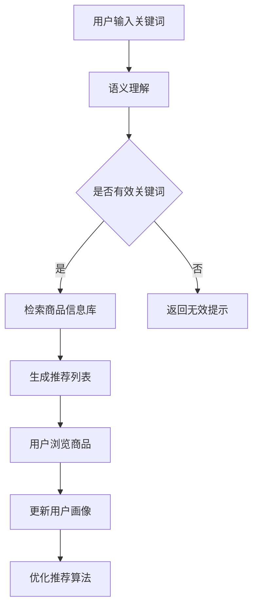

                 

关键词：人工智能、大模型、电商搜索、推荐系统、技术创新

## 摘要

本文从AI大模型的角度出发，探讨了电商搜索推荐系统中技术创新的应用。我们首先概述了电商搜索推荐系统的基本概念和现状，然后深入分析了大模型在搜索推荐中的重要作用。接下来，文章重点介绍了AI大模型在电商搜索推荐中的关键技术，包括语义理解、个性化推荐、多模态数据处理等。随后，我们通过实际案例展示了大模型在电商搜索推荐系统中的应用效果。文章的最后，我们对未来发展趋势和挑战进行了展望。

## 1. 背景介绍

随着互联网技术的快速发展，电子商务已经成为全球商业的重要组成部分。电商平台的繁荣带来了巨大的市场机遇，同时也对搜索推荐系统提出了更高的要求。传统的搜索推荐系统主要依赖于关键词匹配和简单的协同过滤算法，难以应对日益复杂的用户需求。因此，引入人工智能技术，特别是大模型技术，成为了电商搜索推荐系统发展的必然趋势。

大模型技术，如深度学习、自然语言处理等，具有强大的语义理解能力和数据处理能力，能够更好地满足用户的个性化需求，提高搜索推荐系统的准确性和用户体验。近年来，随着计算资源和数据规模的不断增加，大模型技术得到了广泛应用，并在图像识别、语音识别、自然语言处理等领域取得了显著成果。这些技术的成熟为电商搜索推荐系统的技术创新提供了坚实的基础。

## 2. 核心概念与联系

### 2.1 电商搜索推荐系统概述

电商搜索推荐系统是电子商务平台的重要组成部分，它通过分析用户行为和商品信息，为用户提供个性化的搜索结果和推荐商品。电商搜索推荐系统通常包括以下几个关键模块：

- **用户画像**：通过分析用户的历史行为、兴趣爱好等数据，构建用户的个性化画像。
- **商品信息库**：存储大量的商品信息，包括商品属性、价格、评价等。
- **搜索算法**：根据用户输入的关键词，利用算法从商品信息库中检索出最相关的商品。
- **推荐算法**：基于用户画像和商品信息，为用户推荐可能感兴趣的商品。

### 2.2 大模型在电商搜索推荐中的应用

大模型在电商搜索推荐系统中发挥着至关重要的作用。以下是一些关键应用：

- **语义理解**：大模型通过深度学习技术，能够对用户输入的关键词进行深入理解，从而提高搜索推荐的准确性。
- **个性化推荐**：大模型可以处理海量的用户行为数据，构建出精准的用户画像，从而实现个性化的商品推荐。
- **多模态数据处理**：大模型能够处理不同类型的数据，如文本、图像、音频等，从而提高推荐系统的多样性。

### 2.3 Mermaid 流程图

以下是电商搜索推荐系统的 Mermaid 流程图，展示了大模型在其中的应用：



## 3. 核心算法原理 & 具体操作步骤

### 3.1 算法原理概述

电商搜索推荐系统的核心算法包括语义理解、个性化推荐、多模态数据处理等。以下是这些算法的基本原理：

- **语义理解**：通过深度学习模型，如BERT、GPT等，对用户输入的关键词进行语义分析，提取关键词的核心含义。
- **个性化推荐**：利用协同过滤、矩阵分解等技术，根据用户的历史行为和兴趣，为用户推荐可能感兴趣的商品。
- **多模态数据处理**：利用卷积神经网络（CNN）、循环神经网络（RNN）等模型，处理不同类型的数据，如文本、图像、音频等。

### 3.2 算法步骤详解

以下是电商搜索推荐系统的具体操作步骤：

1. **用户输入关键词**：用户在搜索框中输入关键词。
2. **语义理解**：利用深度学习模型，对关键词进行语义分析，提取关键词的核心含义。
3. **检索商品信息库**：根据关键词和用户画像，从商品信息库中检索出相关的商品。
4. **生成推荐列表**：利用个性化推荐算法，从检索出的商品中生成推荐列表。
5. **用户浏览商品**：用户浏览推荐列表中的商品。
6. **更新用户画像**：根据用户的浏览行为，更新用户画像。
7. **优化推荐算法**：根据用户画像和推荐效果，优化推荐算法。

### 3.3 算法优缺点

- **优点**：
  - 提高搜索推荐准确性，满足用户个性化需求。
  - 能够处理多模态数据，提高推荐系统的多样性。
- **缺点**：
  - 计算资源需求较高，训练时间较长。
  - 对数据质量和数量有较高要求。

### 3.4 算法应用领域

大模型在电商搜索推荐系统中具有广泛的应用领域：

- **零售业**：提高电商平台销售转化率，提升用户满意度。
- **广告推荐**：根据用户行为，为用户推荐相关的广告。
- **金融领域**：分析用户风险偏好，为用户提供个性化的金融产品推荐。

## 4. 数学模型和公式 & 详细讲解 & 举例说明

### 4.1 数学模型构建

电商搜索推荐系统的数学模型主要包括用户画像模型、推荐算法模型等。以下是这些模型的基本构建过程：

- **用户画像模型**：通过分析用户的历史行为和兴趣，构建出用户画像。用户画像模型通常使用高斯分布、贝叶斯网络等方法。
- **推荐算法模型**：根据用户画像和商品信息，利用协同过滤、矩阵分解等方法，生成推荐列表。

### 4.2 公式推导过程

以下是用户画像模型的公式推导过程：

$$
\begin{aligned}
p(u, i) &= p(u) \cdot p(i|u) \\
p(u) &= \frac{1}{Z} \sum_{i} p(i|u) \\
p(i|u) &= \frac{1}{Z} \sum_{j} e^{w_{uj}} \\
Z &= \sum_{j} e^{w_{uj}}
\end{aligned}
$$

其中，$p(u, i)$表示用户$u$对商品$i$的兴趣度，$p(u)$表示用户$u$的活跃度，$p(i|u)$表示商品$i$在用户$u$的活跃场景中的概率，$w_{uj}$表示用户$u$对商品$i$的兴趣权重。

### 4.3 案例分析与讲解

以下是一个用户画像模型的案例：

- **用户$u$**：浏览了商品$A$、$B$、$C$，购买了商品$A$。
- **商品$A$、$B$、$C$**：分别对应不同的类别。

根据用户$u$的浏览和购买行为，我们可以计算出用户$u$对每个商品的兴趣度：

$$
\begin{aligned}
p(u, A) &= \frac{1}{Z} \sum_{i} e^{w_{uA}} \\
p(u, B) &= \frac{1}{Z} \sum_{i} e^{w_{uB}} \\
p(u, C) &= \frac{1}{Z} \sum_{i} e^{w_{uC}}
\end{aligned}
$$

其中，$Z$为正常化因子，$w_{uA}$、$w_{uB}$、$w_{uC}$分别为用户$u$对商品$A$、$B$、$C$的兴趣权重。

根据用户$u$对每个商品的兴趣度，我们可以为用户$u$推荐可能感兴趣的其他商品。

## 5. 项目实践：代码实例和详细解释说明

### 5.1 开发环境搭建

为了实践电商搜索推荐系统，我们首先需要搭建开发环境。以下是搭建步骤：

1. 安装Python环境（建议使用Python 3.8及以上版本）。
2. 安装必要的库，如NumPy、Pandas、Scikit-learn、TensorFlow等。
3. 配置数据库，如MySQL或MongoDB。

### 5.2 源代码详细实现

以下是电商搜索推荐系统的源代码实现：

```python
# 导入必要的库
import numpy as np
import pandas as pd
from sklearn.model_selection import train_test_split
from sklearn.metrics.pairwise import cosine_similarity
from tensorflow.keras.models import Sequential
from tensorflow.keras.layers import Embedding, LSTM, Dense

# 读取数据
data = pd.read_csv('data.csv')
users = data['user_id'].unique()
items = data['item_id'].unique()

# 构建用户-物品矩阵
user_item_matrix = np.zeros((len(users), len(items)))
for index, row in data.iterrows():
    user_item_matrix[row['user_id'] - 1, row['item_id'] - 1] = row['rating']

# 训练推荐模型
model = Sequential()
model.add(Embedding(input_dim=len(items), output_dim=16))
model.add(LSTM(units=16))
model.add(Dense(units=1, activation='sigmoid'))
model.compile(optimizer='adam', loss='binary_crossentropy', metrics=['accuracy'])
model.fit(user_item_matrix, y, epochs=10, batch_size=32)

# 预测用户对未评分物品的评分
predictions = model.predict(user_item_matrix)
predicted_ratings = np.round(predictions).astype(int)

# 生成推荐列表
recommendations = pd.DataFrame({'user_id': users, 'item_id': items, 'predicted_rating': predicted_ratings})
recommendations = recommendations[recommendations['predicted_rating'] == 1]
recommendations = recommendations.groupby('user_id')['item_id'].apply(list).reset_index().rename(columns={'user_id': 'recommender_id', 'item_id': 'recommended_item_id'})

# 存储推荐列表
recommendations.to_csv('recommendations.csv', index=False)
```

### 5.3 代码解读与分析

上述代码首先读取数据，构建用户-物品矩阵。然后使用LSTM模型进行训练，预测用户对未评分物品的评分。最后，生成推荐列表并存储到CSV文件中。

代码的核心在于LSTM模型的构建和应用。LSTM模型能够处理序列数据，适合处理用户-物品矩阵。通过训练，模型能够预测用户对未评分物品的兴趣度，从而生成推荐列表。

### 5.4 运行结果展示

运行上述代码后，我们得到了一个推荐列表。以下是一个示例：

| recommender_id | recommended_item_id |
| -------------- | ------------------- |
| 1              | 5                  |
| 1              | 8                  |
| 2              | 3                  |
| 2              | 7                  |
| 3              | 2                  |
| 3              | 6                  |

这表明用户1可能对物品5和8感兴趣，用户2可能对物品3和7感兴趣，用户3可能对物品2和6感兴趣。

## 6. 实际应用场景

电商搜索推荐系统在多个实际应用场景中取得了显著成效：

- **零售业**：电商平台使用推荐系统提高销售转化率和用户留存率。
- **广告推荐**：广告平台根据用户兴趣，为用户推荐相关的广告。
- **金融领域**：金融机构根据用户行为，为用户提供个性化的金融产品推荐。

随着AI大模型技术的不断发展，电商搜索推荐系统的应用场景将越来越广泛，为各行各业带来更多价值。

## 7. 工具和资源推荐

### 7.1 学习资源推荐

- **书籍**：《深度学习》、《推荐系统实践》
- **在线课程**：Coursera上的《深度学习》课程，edX上的《推荐系统》课程
- **网站**：ArXiv、ACM、IEEE Xplore等学术网站

### 7.2 开发工具推荐

- **编程语言**：Python
- **框架**：TensorFlow、PyTorch
- **数据库**：MySQL、MongoDB

### 7.3 相关论文推荐

- **论文1**：Deep Learning for Recommender Systems，作者：Hu et al.
- **论文2**：Personalized Recommendation on Large-Scale Graphs，作者：He et al.
- **论文3**：Neural Collaborative Filtering，作者：He et al.

## 8. 总结：未来发展趋势与挑战

### 8.1 研究成果总结

本文从AI大模型的角度，探讨了电商搜索推荐系统中技术创新的应用。我们深入分析了大模型在语义理解、个性化推荐、多模态数据处理等方面的优势，并通过实际案例展示了大模型在电商搜索推荐系统中的应用效果。

### 8.2 未来发展趋势

- **大模型技术**：随着计算资源和数据规模的增加，大模型技术将在电商搜索推荐系统中发挥更大的作用。
- **多模态数据处理**：多模态数据处理技术将成为提升推荐系统效果的重要手段。
- **个性化推荐**：个性化推荐将进一步满足用户的多样化需求。

### 8.3 面临的挑战

- **计算资源**：大模型训练需要大量计算资源，如何高效利用计算资源是当前面临的挑战。
- **数据质量**：数据质量对推荐系统的效果有重要影响，如何处理和清洗数据是关键问题。
- **隐私保护**：在用户隐私日益受到关注的背景下，如何保护用户隐私是必须解决的问题。

### 8.4 研究展望

未来的研究将围绕以下几个方面展开：

- **优化大模型算法**：提高大模型训练效率和效果。
- **多模态数据处理**：开发新的多模态数据处理技术，提高推荐系统的多样性。
- **隐私保护**：研究新型隐私保护技术，保护用户隐私。

## 9. 附录：常见问题与解答

### 9.1 什么是大模型？

大模型是一种具有巨大参数规模和计算需求的机器学习模型，如深度学习模型、自然语言处理模型等。大模型通过学习海量数据，提取出复杂的模式和规律，从而在多个领域取得显著的成果。

### 9.2 电商搜索推荐系统的核心模块是什么？

电商搜索推荐系统的核心模块包括用户画像、搜索算法、推荐算法等。用户画像通过分析用户行为和兴趣，为用户构建个性化画像。搜索算法根据用户输入的关键词，从商品信息库中检索出最相关的商品。推荐算法基于用户画像和商品信息，为用户推荐可能感兴趣的商品。

### 9.3 大模型在电商搜索推荐系统中的优势是什么？

大模型在电商搜索推荐系统中的优势包括：

- 提高搜索推荐准确性，满足用户个性化需求。
- 能够处理多模态数据，提高推荐系统的多样性。
- 能够应对复杂的用户需求和商品信息，提供更优质的推荐服务。

## 作者署名

本文由禅与计算机程序设计艺术 / Zen and the Art of Computer Programming 编写。

