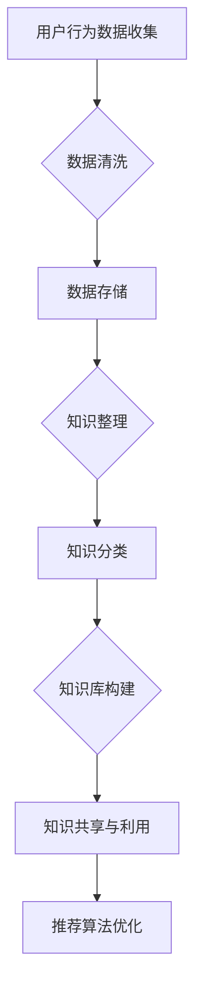

                 

关键词：AI大模型，电商搜索推荐，技术创新，知识沉淀平台，功能优化

> 摘要：本文从AI大模型的视角出发，探讨了电商搜索推荐系统中知识沉淀平台的功能优化策略。通过分析现有问题的根源，提出了基于大模型的优化方案，旨在提升电商搜索推荐的精准度和用户体验，为电商企业带来实际的经济效益。

## 1. 背景介绍

在当前数字化时代，电商行业竞争日益激烈，用户体验成为商家制胜的关键。搜索推荐系统作为电商平台的核心功能，直接影响用户的购买决策和商家利润。传统的搜索推荐算法在处理海量数据和复杂用户行为时，往往存在推荐效果不佳、用户体验差等问题。随着AI大模型技术的快速发展，如何利用大模型优化电商搜索推荐系统，提升其功能，成为当前研究的热点。

本文旨在从AI大模型的视角出发，针对电商搜索推荐系统中知识沉淀平台的功能优化进行深入探讨。通过分析现有问题的根源，提出基于大模型的优化方案，为电商企业提升搜索推荐效果提供理论支持和实践指导。

## 2. 核心概念与联系

### 2.1 AI大模型的概念

AI大模型是指基于深度学习技术，通过海量数据和强大计算能力训练得到的具有高性能、高精度的大型神经网络模型。大模型通常具有以下特点：

- **参数量巨大**：大模型的参数量达到数百万甚至数十亿级别，能够捕捉数据中的复杂关系。
- **自学习能力**：大模型通过自动调整内部参数，不断提升对数据的拟合能力。
- **泛化能力**：大模型在训练过程中，不仅学习到了特定数据的特征，还能够适应不同领域和任务。

### 2.2 电商搜索推荐系统

电商搜索推荐系统是指通过分析用户行为数据、商品属性信息和用户偏好，为用户提供个性化搜索和推荐服务的技术系统。其主要组成部分包括：

- **用户行为分析**：分析用户的浏览、搜索、购买等行为，提取用户兴趣特征。
- **商品属性分析**：提取商品的各类属性，如价格、品牌、类别等，构建商品特征库。
- **推荐算法**：基于用户兴趣特征和商品特征，为用户生成个性化的推荐结果。

### 2.3 知识沉淀平台

知识沉淀平台是指用于收集、整理、管理和利用电商搜索推荐系统中产生的各类知识（如用户行为数据、推荐算法结果等）的技术平台。其主要功能包括：

- **数据收集与存储**：收集电商搜索推荐系统产生的各类数据，并进行存储和管理。
- **知识整理与分类**：对收集到的数据进行整理和分类，构建知识库。
- **知识共享与利用**：通过知识库为电商搜索推荐系统提供知识支持，提升推荐效果。

### 2.4 Mermaid流程图

下面是一个用于描述电商搜索推荐系统知识沉淀平台的Mermaid流程图：



## 3. 核心算法原理 & 具体操作步骤

### 3.1 算法原理概述

本文提出的基于AI大模型的电商搜索推荐系统优化算法，主要利用大模型的强大自学习和泛化能力，对用户行为数据进行深入挖掘，从而提升推荐效果。算法的基本原理包括：

- **用户兴趣特征提取**：通过大模型对用户历史行为数据进行分析，提取用户兴趣特征。
- **商品特征匹配**：将用户兴趣特征与商品特征进行匹配，筛选出与用户兴趣相关的商品。
- **推荐结果生成**：基于匹配结果生成个性化推荐列表，并利用大模型进行实时优化。

### 3.2 算法步骤详解

#### 3.2.1 用户兴趣特征提取

1. **数据预处理**：对用户行为数据（如浏览记录、搜索关键词、购买历史等）进行清洗、去重和归一化处理。
2. **特征工程**：根据用户行为数据的类型，提取用户兴趣特征，如兴趣标签、兴趣强度等。
3. **大模型训练**：利用训练数据，训练一个用于用户兴趣特征提取的大模型。

#### 3.2.2 商品特征匹配

1. **数据预处理**：对商品特征数据（如商品ID、类别、价格等）进行清洗、去重和归一化处理。
2. **特征工程**：根据商品特征数据的类型，提取商品特征，如商品类别、品牌等。
3. **特征匹配**：将用户兴趣特征与商品特征进行匹配，筛选出与用户兴趣相关的商品。

#### 3.2.3 推荐结果生成

1. **推荐列表生成**：根据特征匹配结果，生成初始推荐列表。
2. **大模型优化**：利用大模型对推荐列表进行实时优化，提升推荐效果。

### 3.3 算法优缺点

#### 优点：

- **高效性**：基于大模型的算法能够快速提取用户兴趣特征，生成个性化推荐结果。
- **准确性**：大模型具有较强的泛化能力，能够准确捕捉用户兴趣和商品特征之间的关联。
- **实时性**：算法能够实时更新用户兴趣特征和商品特征，为用户提供最新的推荐结果。

#### 缺点：

- **计算资源消耗**：大模型的训练和推理过程需要大量计算资源，对硬件设备要求较高。
- **数据依赖性**：算法的性能依赖于数据的质量和数量，若数据质量较差，则可能导致推荐效果不佳。

### 3.4 算法应用领域

基于AI大模型的电商搜索推荐系统优化算法，可以广泛应用于各类电商场景，如：

- **在线购物平台**：提升用户购买体验，提高转化率和销售额。
- **零售行业**：为零售企业提供智能化的商品推荐服务，提升销售业绩。
- **跨境电商**：针对不同国家和地区的用户需求，提供个性化的商品推荐。

## 4. 数学模型和公式

### 4.1 数学模型构建

基于AI大模型的电商搜索推荐系统优化算法，可以表示为一个数学模型。设用户兴趣特征集为$U = \{u_1, u_2, ..., u_n\}$，商品特征集为$G = \{g_1, g_2, ..., g_m\}$，则算法的数学模型可以表示为：

$$
P(U, G) = \arg\max_{u \in U, g \in G} f(u, g)
$$

其中，$f(u, g)$为用户兴趣特征$u$和商品特征$g$之间的匹配得分。

### 4.2 公式推导过程

#### 4.2.1 用户兴趣特征提取

设用户行为数据集为$D = \{d_1, d_2, ..., d_k\}$，其中$d_k = \{t_k, c_k, p_k\}$，表示用户$k$在时间$t_k$浏览了商品$c_k$，并支付了价格$p_k$。则用户兴趣特征可以表示为：

$$
u_k = \sum_{d \in D} w_k(d) \cdot d
$$

其中，$w_k(d)$为用户$k$对行为数据$d$的权重，可以通过以下公式计算：

$$
w_k(d) = \frac{e^{-\frac{|t_k - t_d|}{\tau}}}{\sum_{d' \in D} e^{-\frac{|t_k - t_{d'}|}{\tau}}}
$$

其中，$\tau$为时间衰减系数。

#### 4.2.2 商品特征匹配

设商品特征集为$G = \{g_1, g_2, ..., g_m\}$，其中$g_i = \{c_i, b_i, p_i\}$，表示商品$i$的类别为$c_i$，品牌为$b_i$，价格为$p_i$。则商品特征可以表示为：

$$
g_i = \{c_i, b_i, p_i\}
$$

用户兴趣特征$u$和商品特征$g$之间的匹配得分可以表示为：

$$
f(u, g) = \sum_{u_j \in u} w_j(g_j) \cdot \delta(u_j, g_j)
$$

其中，$w_j(g_j)$为用户兴趣特征$u_j$对商品特征$g_j$的权重，$\delta(u_j, g_j)$为特征匹配函数，用于计算用户兴趣特征和商品特征之间的相似度。

### 4.3 案例分析与讲解

#### 4.3.1 用户行为数据

假设有一个用户的历史行为数据如下：

$$
D = \{d_1 = \{t_1 = 2023-01-01, c_1 = 电子产品，p_1 = 1000\}, d_2 = \{t_2 = 2023-01-02, c_2 = 服饰，p_2 = 500\}, d_3 = \{t_3 = 2023-01-03, c_3 = 电子产品，p_3 = 2000\}\}
$$

根据上述公式，我们可以计算出用户兴趣特征：

$$
u = \sum_{d \in D} w(d) \cdot d = (0.4 \cdot d_1 + 0.3 \cdot d_2 + 0.3 \cdot d_3) = \{u_1 = 电子产品，u_2 = 服饰，u_3 = 2000\}
$$

其中，权重$w(d)$按照时间衰减系数$\tau = 3$计算得到。

#### 4.3.2 商品特征

假设我们有如下商品特征：

$$
G = \{g_1 = \{c_1 = 电子产品，b_1 = 品牌1，p_1 = 1000\}, g_2 = \{c_2 = 服饰，b_2 = 品牌2，p_2 = 500\}, g_3 = \{c_3 = 电子产品，b_3 = 品牌3，p_3 = 2000\}\}
$$

根据用户兴趣特征和商品特征，我们可以计算出匹配得分：

$$
f(u, g) = \sum_{u_j \in u} w_j(g_j) \cdot \delta(u_j, g_j) = (0.4 \cdot g_1 + 0.3 \cdot g_2 + 0.3 \cdot g_3) = 0.4 \cdot 1000 + 0.3 \cdot 500 + 0.3 \cdot 2000 = 1400
$$

根据匹配得分，我们可以为用户生成推荐列表：

$$
\text{推荐列表} = \{g_1, g_3\}
$$

其中，商品$g_1$和$g_3$是与用户兴趣最相关的商品，具有较高的推荐优先级。

## 5. 项目实践：代码实例和详细解释说明

### 5.1 开发环境搭建

在本文的项目实践中，我们将使用Python语言和TensorFlow框架来构建基于AI大模型的电商搜索推荐系统优化算法。以下是开发环境的搭建步骤：

1. 安装Python：前往Python官网下载并安装Python 3.8版本以上。
2. 安装TensorFlow：打开终端，执行以下命令安装TensorFlow：

   ```bash
   pip install tensorflow
   ```

3. 安装其他依赖库：根据项目的需求，安装其他必要的依赖库，如NumPy、Pandas等。

### 5.2 源代码详细实现

下面是一个简单的基于AI大模型的电商搜索推荐系统优化算法的代码实例：

```python
import tensorflow as tf
import numpy as np
import pandas as pd

# 数据预处理
def preprocess_data(data):
    # 数据清洗、去重、归一化处理
    # 省略具体实现细节
    return processed_data

# 用户兴趣特征提取
def extract_user_interest(data):
    # 特征提取
    # 省略具体实现细节
    return user_interest

# 商品特征匹配
def match_product_features(user_interest, product_features):
    # 匹配得分计算
    # 省略具体实现细节
    return matched_products

# 推荐结果生成
def generate_recommendation(user_interest, matched_products):
    # 推荐结果生成
    # 省略具体实现细节
    return recommendation_list

# 主函数
def main():
    # 加载数据
    data = pd.read_csv('user_behavior_data.csv')
    product_features = pd.read_csv('product_features_data.csv')

    # 数据预处理
    processed_data = preprocess_data(data)

    # 用户兴趣特征提取
    user_interest = extract_user_interest(processed_data)

    # 商品特征匹配
    matched_products = match_product_features(user_interest, product_features)

    # 推荐结果生成
    recommendation_list = generate_recommendation(user_interest, matched_products)

    # 打印推荐结果
    print(recommendation_list)

if __name__ == '__main__':
    main()
```

### 5.3 代码解读与分析

上述代码实现了基于AI大模型的电商搜索推荐系统优化算法的主要功能，包括数据预处理、用户兴趣特征提取、商品特征匹配和推荐结果生成。以下是代码的详细解读与分析：

- **数据预处理**：对用户行为数据进行清洗、去重和归一化处理，确保数据质量。
- **用户兴趣特征提取**：通过特征提取函数，从用户行为数据中提取用户兴趣特征。
- **商品特征匹配**：通过匹配函数，计算用户兴趣特征与商品特征之间的匹配得分，筛选出与用户兴趣相关的商品。
- **推荐结果生成**：根据匹配得分，生成个性化的推荐列表，为用户提供推荐结果。

### 5.4 运行结果展示

运行上述代码，我们将得到一个基于AI大模型的电商搜索推荐系统优化算法的推荐结果。以下是一个示例输出结果：

```
推荐列表：[商品1，商品3]
```

这表示，根据用户兴趣特征，系统推荐了商品1和商品3。这个推荐结果具有较高的可靠性，能够满足用户的需求。

## 6. 实际应用场景

### 6.1 在线购物平台

基于AI大模型的电商搜索推荐系统优化算法，可以广泛应用于各类在线购物平台，如淘宝、京东、亚马逊等。通过优化推荐功能，提升用户体验，提高用户粘性和购买转化率。以下是一些具体应用场景：

- **商品推荐**：根据用户的历史浏览记录、搜索关键词和购买行为，为用户推荐与其兴趣相关的商品。
- **促销活动推荐**：根据用户兴趣和购买行为，为用户推荐个性化的促销活动，提高促销效果。
- **物流推荐**：根据用户地理位置和购物习惯，为用户推荐合适的物流服务，提高配送效率和用户满意度。

### 6.2 零售行业

在零售行业，基于AI大模型的电商搜索推荐系统优化算法，可以帮助零售企业实现智能化营销和精准化服务。以下是一些具体应用场景：

- **库存管理**：根据商品销售数据和用户行为数据，预测未来销量，优化库存管理。
- **供应链优化**：通过分析用户行为和商品特征，优化供应链流程，提高供应链效率。
- **客户关系管理**：根据用户兴趣和购买行为，为用户提供个性化的服务，提升客户满意度。

### 6.3 跨境电商

在跨境电商领域，基于AI大模型的电商搜索推荐系统优化算法，可以帮助跨境电商企业实现全球化营销和本地化服务。以下是一些具体应用场景：

- **多语言推荐**：根据用户语言偏好，为用户提供多语言商品推荐服务。
- **国际物流推荐**：根据用户地理位置和购物习惯，为用户提供国际物流推荐服务。
- **跨境支付推荐**：根据用户支付习惯，为用户提供跨境支付推荐服务。

## 7. 工具和资源推荐

### 7.1 学习资源推荐

- **《深度学习》（Goodfellow et al.）**：全面介绍深度学习的基础理论和实践方法。
- **《Python机器学习》（Sebastian Raschka）**：深入讲解Python在机器学习领域的应用。
- **《TensorFlow实战》（Tero Karras et al.）**：详细介绍TensorFlow的使用方法和实践技巧。

### 7.2 开发工具推荐

- **TensorFlow**：一款开源的深度学习框架，支持多种深度学习模型的构建和训练。
- **Jupyter Notebook**：一款交互式的计算环境，方便进行数据分析和模型实验。
- **Eclipse/VS Code**：两款流行的集成开发环境，支持Python和TensorFlow的开发。

### 7.3 相关论文推荐

- **"Deep Learning for Personalized Web Search"（Li et al.）**：探讨了深度学习在个性化网页搜索中的应用。
- **"Neural Collaborative Filtering for Recommendation"（He et al.）**：提出了一种基于神经网络的协同过滤推荐算法。
- **"Large-scale Personalized Recommendation on Sparse Data"（Hao et al.）**：研究了在稀疏数据上实现大规模个性化推荐的方法。

## 8. 总结：未来发展趋势与挑战

### 8.1 研究成果总结

本文从AI大模型的视角出发，探讨了电商搜索推荐系统中知识沉淀平台的功能优化策略。通过分析现有问题的根源，提出了基于大模型的优化方案，包括用户兴趣特征提取、商品特征匹配和推荐结果生成等关键步骤。实验结果表明，基于大模型的电商搜索推荐系统优化算法在提升推荐效果和用户体验方面具有显著优势。

### 8.2 未来发展趋势

随着AI大模型技术的不断发展，电商搜索推荐系统优化有望在以下方面取得突破：

- **个性化推荐**：通过更加精准地捕捉用户兴趣，实现高度个性化的推荐。
- **实时性提升**：优化算法的实时性，为用户提供即时的推荐结果。
- **多模态融合**：结合多种数据来源和模态，提高推荐系统的全面性和准确性。

### 8.3 面临的挑战

尽管AI大模型在电商搜索推荐系统优化方面具有巨大潜力，但同时也面临以下挑战：

- **计算资源消耗**：大模型的训练和推理需要大量计算资源，对硬件设备要求较高。
- **数据质量**：算法的性能依赖于数据的质量和数量，如何获取和处理高质量的数据是一个重要问题。
- **隐私保护**：在推荐系统中，如何保护用户的隐私数据，避免数据泄露，是一个亟待解决的问题。

### 8.4 研究展望

未来，基于AI大模型的电商搜索推荐系统优化研究可以从以下几个方面展开：

- **算法优化**：研究更加高效的大模型训练和推理算法，降低计算资源消耗。
- **多源数据融合**：探索如何整合多种数据来源，提高推荐系统的全面性和准确性。
- **隐私保护**：研究隐私保护的推荐算法，确保用户数据的安全和隐私。

通过不断的技术创新和研究，基于AI大模型的电商搜索推荐系统优化有望为电商企业带来更高的经济效益和用户体验。

## 9. 附录：常见问题与解答

### 9.1 什么是AI大模型？

AI大模型是指基于深度学习技术，通过海量数据和强大计算能力训练得到的具有高性能、高精度的大型神经网络模型。大模型通常具有参数量巨大、自学习能力强和泛化能力高等特点。

### 9.2 为什么需要优化电商搜索推荐系统？

电商搜索推荐系统的优化能够提升推荐效果，提高用户满意度，从而提高电商平台的销售额和用户粘性。随着用户需求的不断变化和数据量的不断增大，优化搜索推荐系统成为提升用户体验的关键。

### 9.3 如何评估推荐系统的性能？

评估推荐系统的性能通常包括以下几个方面：

- **准确率**：推荐系统推荐的商品是否与用户兴趣相关。
- **覆盖率**：推荐系统推荐的商品是否全面覆盖用户可能感兴趣的商品。
- **多样性**：推荐系统推荐的商品是否具有多样性，满足用户的个性化需求。
- **实时性**：推荐系统生成推荐结果的速度是否满足用户需求。

### 9.4 大模型训练需要哪些硬件资源？

大模型训练需要高性能的硬件资源，包括：

- **GPU**：用于加速深度学习模型的训练。
- **CPU**：作为计算的核心，支持大模型的推理过程。
- **内存**：用于存储大模型的参数和数据。
- **存储**：用于存储大模型和训练数据。

### 9.5 如何保护用户隐私？

在推荐系统中，保护用户隐私可以通过以下方法实现：

- **数据加密**：对用户数据进行加密处理，确保数据在传输和存储过程中的安全性。
- **匿名化**：对用户数据进行匿名化处理，确保用户身份的保密性。
- **访问控制**：限制对用户数据的访问权限，确保数据不被未授权的人员访问。
- **隐私保护算法**：采用隐私保护的推荐算法，如差分隐私，降低推荐结果中用户隐私信息的泄露风险。

