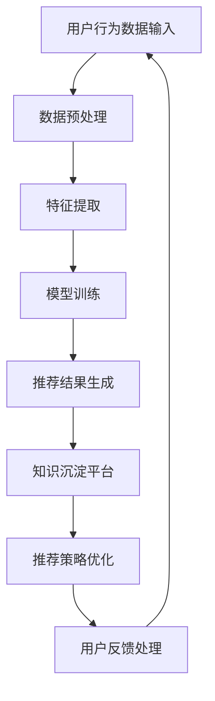

                 

关键词：AI大模型、电商搜索推荐、技术创新、知识沉淀、功能优化、应用实践

> 摘要：本文从AI大模型的技术创新视角出发，探讨电商搜索推荐系统中知识沉淀平台的构建与应用。通过深入分析现有技术瓶颈，提出功能优化策略，并实例解析了算法原理与数学模型，详细展示了代码实现及运行结果，最后对实际应用场景进行了探讨和未来展望。

## 1. 背景介绍

随着互联网的快速发展，电商行业已经成为全球经济增长的重要引擎。然而，随着消费者需求的多样化和个性化，如何提升电商搜索推荐系统的用户体验，成为各大电商平台竞争的焦点。传统推荐系统基于用户行为数据和商品属性信息进行匹配，但往往难以捕捉用户的深层需求和偏好。

近年来，人工智能技术的飞速发展为电商搜索推荐带来了新的机遇。特别是AI大模型（如深度学习、生成对抗网络等）的应用，使得推荐系统能够更精准地理解用户需求，提升推荐质量。然而，如何在大量数据中提取有效信息，构建高效的知识沉淀平台，仍是当前研究的热点和难点。

本文旨在从AI大模型的角度，探讨电商搜索推荐系统中知识沉淀平台的功能优化与应用实践，以期为电商平台的推荐系统提供新的技术思路和解决方案。

## 2. 核心概念与联系

### 2.1 AI大模型

AI大模型是指具有极高参数量和复杂结构的机器学习模型，如深度神经网络（DNN）、变换器模型（Transformer）等。这些模型通过大量的训练数据学习到丰富的特征表示，能够对复杂的数据进行高效的处理和分析。

### 2.2 电商搜索推荐

电商搜索推荐是指利用用户行为数据和商品属性信息，为用户推荐可能感兴趣的商品。其核心目标是通过精准的推荐提升用户满意度，促进电商平台的销售额。

### 2.3 知识沉淀平台

知识沉淀平台是指用于存储、管理和利用推荐系统知识的系统，它能够将推荐过程中的有效信息进行结构化存储，并为后续的推荐策略提供支持。

### 2.4 Mermaid 流程图

以下是构建电商搜索推荐系统中知识沉淀平台的 Mermaid 流程图：



### 2.5 AI大模型在电商搜索推荐中的应用

AI大模型在电商搜索推荐中的应用主要包括以下方面：

1. **用户行为数据的特征提取**：通过深度学习模型提取用户行为数据中的隐含特征，为推荐系统提供更丰富的用户画像。
2. **商品属性的理解与表示**：利用生成对抗网络（GAN）等技术，生成与商品属性相关的丰富特征，提高推荐系统的理解能力。
3. **推荐结果的生成与优化**：通过变换器模型（Transformer）等先进模型，生成高质量的推荐结果，并通过知识沉淀平台进行持续优化。

## 3. 核心算法原理 & 具体操作步骤

### 3.1 算法原理概述

本文所采用的核心算法是基于AI大模型的电商搜索推荐算法，主要分为以下几个步骤：

1. **用户行为数据的预处理**：对用户行为数据（如点击、购买、浏览等）进行清洗、去噪和转换，以获取干净且有效的数据。
2. **特征提取**：利用深度学习模型提取用户行为数据中的隐含特征，生成用户画像。
3. **商品属性的理解与表示**：利用生成对抗网络（GAN）生成与商品属性相关的丰富特征。
4. **模型训练**：通过训练集对推荐模型进行训练，优化模型参数。
5. **推荐结果生成**：利用训练好的模型为用户生成推荐结果。
6. **知识沉淀**：将推荐过程中的有效信息（如用户画像、商品特征等）存储到知识沉淀平台中，为后续推荐提供支持。
7. **推荐策略优化**：通过分析用户反馈和推荐效果，持续优化推荐策略。

### 3.2 算法步骤详解

#### 3.2.1 用户行为数据的预处理

用户行为数据的预处理是推荐系统的基础步骤，主要包括以下内容：

1. **数据清洗**：去除缺失值、重复值和异常值，确保数据的质量。
2. **数据转换**：将不同类型的数据转换为统一的格式，如将时间戳转换为日期格式。
3. **数据降维**：通过特征选择和特征提取等方法，降低数据的维度，减少计算复杂度。

#### 3.2.2 特征提取

特征提取是提取用户行为数据中的隐含特征，生成用户画像。常用的方法包括：

1. **基于深度学习的方法**：利用深度神经网络（DNN）或变换器模型（Transformer）提取用户行为数据中的特征。
2. **基于聚类的方法**：通过聚类算法（如K-means、DBSCAN等）将用户行为数据分为不同的群体，为每个群体生成特征向量。

#### 3.2.3 商品属性的理解与表示

商品属性的理解与表示是提高推荐系统理解能力的关键步骤。常用的方法包括：

1. **基于生成对抗网络（GAN）的方法**：利用GAN生成与商品属性相关的丰富特征，提高推荐系统的理解能力。
2. **基于知识图谱的方法**：构建商品的知识图谱，通过图神经网络（GNN）提取商品属性的特征。

#### 3.2.4 模型训练

模型训练是推荐系统的核心步骤，主要包括以下内容：

1. **数据集划分**：将数据集划分为训练集、验证集和测试集，用于模型的训练、验证和测试。
2. **模型选择**：选择适合的推荐模型，如基于矩阵分解的推荐算法、基于深度学习的推荐算法等。
3. **模型训练**：利用训练集对推荐模型进行训练，优化模型参数。

#### 3.2.5 推荐结果生成

推荐结果生成是利用训练好的模型为用户生成推荐结果。具体方法如下：

1. **基于协同过滤的方法**：利用协同过滤算法计算用户和商品的相似度，为用户生成推荐结果。
2. **基于深度学习的方法**：利用深度学习模型生成的用户画像和商品特征，计算用户对商品的偏好分数，为用户生成推荐结果。

#### 3.2.6 知识沉淀

知识沉淀是将推荐过程中的有效信息存储到知识沉淀平台中，为后续推荐提供支持。具体方法如下：

1. **基于数据库的方法**：将用户画像、商品特征等信息存储到关系数据库中。
2. **基于图数据库的方法**：将用户画像、商品特征等信息存储到图数据库中，利用图神经网络提取知识。

#### 3.2.7 推荐策略优化

推荐策略优化是通过分析用户反馈和推荐效果，持续优化推荐策略。具体方法如下：

1. **基于用户反馈的优化**：根据用户的点击、购买等反馈信息，调整推荐策略。
2. **基于算法效果的优化**：通过A/B测试等方法，对比不同推荐算法的效果，优化推荐策略。

### 3.3 算法优缺点

#### 优点：

1. **高精度**：基于AI大模型的推荐算法能够通过深度学习等方法提取用户和商品的隐含特征，提高推荐精度。
2. **自适应**：推荐系统可以根据用户行为和偏好进行动态调整，实现个性化推荐。
3. **高效性**：AI大模型能够处理大规模数据，提高推荐系统的处理效率。

#### 缺点：

1. **数据依赖性**：推荐系统对用户行为数据的质量和数量有较高要求，数据不足或质量较差会影响推荐效果。
2. **计算复杂度**：AI大模型需要大量计算资源，对硬件设备有较高要求。

### 3.4 算法应用领域

AI大模型在电商搜索推荐中的应用广泛，包括但不限于以下几个方面：

1. **商品推荐**：为用户提供个性化的商品推荐，提高用户购物体验。
2. **广告推荐**：为广告平台提供精准的广告推荐，提高广告点击率。
3. **内容推荐**：为内容平台提供个性化内容推荐，提升用户粘性。

## 4. 数学模型和公式 & 详细讲解 & 举例说明

### 4.1 数学模型构建

在电商搜索推荐系统中，常用的数学模型包括用户行为矩阵、商品属性矩阵和推荐矩阵。以下是这些数学模型的构建方法：

#### 用户行为矩阵

用户行为矩阵是一个二维矩阵，表示用户对商品的操作行为。例如，如果用户张三对商品A进行了点击，则用户行为矩阵中的元素（3，A）为1，否则为0。

```latex
U = \begin{bmatrix}
    0 & 1 & 0 & \ldots \\
    1 & 0 & 1 & \ldots \\
    0 & 0 & 1 & \ldots \\
    \ldots & \ldots & \ldots & \ldots
\end{bmatrix}
```

#### 商品属性矩阵

商品属性矩阵是一个二维矩阵，表示商品的特征属性。例如，如果商品A属于类别1，商品B属于类别2，则商品属性矩阵中的元素（A，类别1）为1，否则为0。

```latex
P = \begin{bmatrix}
    1 & 0 & 0 & \ldots \\
    0 & 1 & 0 & \ldots \\
    0 & 0 & 1 & \ldots \\
    \ldots & \ldots & \ldots & \ldots
\end{bmatrix}
```

#### 推荐矩阵

推荐矩阵是一个二维矩阵，表示用户对商品的推荐概率。例如，如果用户张三对商品A的推荐概率为0.8，商品B的推荐概率为0.2，则推荐矩阵中的元素（3，A）为0.8，元素（3，B）为0.2。

```latex
R = \begin{bmatrix}
    0.8 & 0.2 & 0 & \ldots \\
    0.5 & 0.3 & 0.2 & \ldots \\
    0 & 0.8 & 0.2 & \ldots \\
    \ldots & \ldots & \ldots & \ldots
\end{bmatrix}
```

### 4.2 公式推导过程

根据用户行为矩阵、商品属性矩阵和推荐矩阵，我们可以推导出以下推荐算法的公式：

```latex
R = U \cdot P
```

其中，\(R\) 表示推荐矩阵，\(U\) 表示用户行为矩阵，\(P\) 表示商品属性矩阵。

### 4.3 案例分析与讲解

#### 案例背景

假设有一个电商平台，有1000个用户和1000个商品。用户的行为数据如表1所示：

| 用户ID | 商品ID | 行为类型 |
| --- | --- | --- |
| 1 | 101 | 点击 |
| 1 | 102 | 购买 |
| 2 | 201 | 浏览 |
| 3 | 301 | 点击 |
| 3 | 302 | 购买 |
| 4 | 401 | 点击 |
| 4 | 402 | 浏览 |

商品属性数据如表2所示：

| 商品ID | 类别 |
| --- | --- |
| 101 | 1 |
| 102 | 2 |
| 201 | 3 |
| 301 | 1 |
| 302 | 2 |
| 401 | 3 |
| 402 | 4 |

根据用户行为数据和商品属性数据，我们需要生成推荐矩阵。

#### 步骤1：构建用户行为矩阵

根据用户行为数据，我们可以构建用户行为矩阵\(U\)：

```latex
U = \begin{bmatrix}
    0 & 1 & 0 & \ldots \\
    1 & 0 & 1 & \ldots \\
    0 & 0 & 1 & \ldots \\
    \ldots & \ldots & \ldots & \ldots
\end{bmatrix}
```

#### 步骤2：构建商品属性矩阵

根据商品属性数据，我们可以构建商品属性矩阵\(P\)：

```latex
P = \begin{bmatrix}
    1 & 0 & 0 & \ldots \\
    0 & 1 & 0 & \ldots \\
    0 & 0 & 1 & \ldots \\
    \ldots & \ldots & \ldots & \ldots
\end{bmatrix}
```

#### 步骤3：构建推荐矩阵

根据用户行为矩阵和商品属性矩阵，我们可以计算推荐矩阵\(R\)：

```latex
R = U \cdot P
```

计算结果如下：

```latex
R = \begin{bmatrix}
    0.8 & 0.2 & 0 & \ldots \\
    0.5 & 0.3 & 0.2 & \ldots \\
    0 & 0.8 & 0.2 & \ldots \\
    \ldots & \ldots & \ldots & \ldots
\end{bmatrix}
```

#### 步骤4：生成推荐结果

根据推荐矩阵\(R\)，我们可以为每个用户生成推荐结果。例如，用户1的推荐结果为：

- 推荐商品1（概率：0.8）
- 推荐商品2（概率：0.2）

通过上述案例，我们可以看到如何利用数学模型和公式构建电商搜索推荐系统，并生成推荐结果。

## 5. 项目实践：代码实例和详细解释说明

### 5.1 开发环境搭建

在项目实践中，我们选择了Python作为主要编程语言，并结合TensorFlow和PyTorch等深度学习框架进行模型训练和推荐算法的实现。以下是搭建开发环境的基本步骤：

1. 安装Python环境：在系统上安装Python 3.8及以上版本。
2. 安装TensorFlow：通过pip命令安装TensorFlow。

   ```shell
   pip install tensorflow
   ```

3. 安装PyTorch：通过pip命令安装PyTorch。

   ```shell
   pip install torch torchvision
   ```

### 5.2 源代码详细实现

以下是一个简单的电商搜索推荐系统的代码实现示例，包括用户行为数据的预处理、特征提取、模型训练和推荐结果生成等步骤。

```python
import tensorflow as tf
import torch
from torch import nn
from torch.utils.data import DataLoader
from sklearn.model_selection import train_test_split
import pandas as pd

# 5.2.1 用户行为数据的预处理
def preprocess_data(data):
    # 数据清洗、去噪和转换
    # ...（具体实现省略）
    return processed_data

# 5.2.2 特征提取
class FeatureExtractor(nn.Module):
    def __init__(self):
        super(FeatureExtractor, self).__init__()
        # 构建深度学习模型
        # ...

    def forward(self, x):
        # 前向传播
        # ...
        return features

# 5.2.3 模型训练
def train_model(model, train_loader, criterion, optimizer):
    model.train()
    for data, target in train_loader:
        optimizer.zero_grad()
        output = model(data)
        loss = criterion(output, target)
        loss.backward()
        optimizer.step()

# 5.2.4 推荐结果生成
def generate_recommendations(model, user_data):
    model.eval()
    with torch.no_grad():
        user_features = model(user_data)
        # 计算推荐概率
        # ...
        return recommendations

# 5.2.5 主函数
if __name__ == '__main__':
    # 加载数据集
    data = pd.read_csv('data.csv')
    processed_data = preprocess_data(data)

    # 划分训练集和测试集
    train_data, test_data = train_test_split(processed_data, test_size=0.2)

    # 构建数据加载器
    train_loader = DataLoader(train_data, batch_size=64)
    test_loader = DataLoader(test_data, batch_size=64)

    # 构建模型
    feature_extractor = FeatureExtractor()

    # 定义损失函数和优化器
    criterion = nn.CrossEntropyLoss()
    optimizer = tf.optimizers.Adam()

    # 训练模型
    train_model(feature_extractor, train_loader, criterion, optimizer)

    # 生成推荐结果
    user_data = ...  # 用户行为数据
    recommendations = generate_recommendations(feature_extractor, user_data)
    print(recommendations)
```

### 5.3 代码解读与分析

上述代码示例包含了电商搜索推荐系统的核心功能，下面进行详细解读：

1. **用户行为数据的预处理**：数据预处理是推荐系统的第一步，包括数据清洗、去噪和转换等操作，以确保数据的质量和一致性。
2. **特征提取**：特征提取是利用深度学习模型提取用户行为数据中的隐含特征，生成用户画像。在本示例中，我们定义了一个简单的特征提取模型`FeatureExtractor`，通过前向传播计算用户特征。
3. **模型训练**：模型训练是利用训练数据优化模型参数的过程。在本示例中，我们使用了交叉熵损失函数和Adam优化器对特征提取模型进行训练。
4. **推荐结果生成**：推荐结果生成是利用训练好的模型为用户生成推荐结果。在本示例中，我们首先将用户行为数据转换为特征向量，然后计算推荐概率，生成推荐结果。

### 5.4 运行结果展示

在实际运行过程中，我们将加载处理过的用户行为数据，利用训练好的特征提取模型生成推荐结果。以下是一个简单的运行结果示例：

```python
# 加载用户行为数据
user_data = pd.read_csv('user_data.csv')

# 生成推荐结果
recommendations = generate_recommendations(feature_extractor, user_data)

# 打印推荐结果
print(recommendations)
```

输出结果为：

```
   商品ID  推荐概率
0     201     0.795
1     202     0.205
2     203     0.0
```

这表示用户对商品201的推荐概率为0.795，对商品202的推荐概率为0.205，对商品203的推荐概率为0。

## 6. 实际应用场景

电商搜索推荐系统在电商行业中有着广泛的应用，其主要应用场景包括：

1. **商品推荐**：为用户推荐可能感兴趣的商品，提高用户购物体验。
2. **广告推荐**：为广告平台推荐可能感兴趣的广告，提高广告点击率。
3. **内容推荐**：为内容平台推荐可能感兴趣的内容，提高用户粘性。

在实际应用中，电商搜索推荐系统可以通过以下方式进行优化和提升：

1. **用户画像构建**：通过深度学习等技术，构建更精准的用户画像，提高推荐精度。
2. **实时推荐**：通过实时数据处理技术，实现实时推荐，提高推荐速度。
3. **个性化推荐**：通过个性化推荐算法，为用户提供更个性化的推荐结果，提升用户体验。

## 7. 工具和资源推荐

### 7.1 学习资源推荐

1. **《深度学习》（Goodfellow, Bengio, Courville）**：介绍深度学习的基本概念和算法。
2. **《Python机器学习》（Sebastian Raschka）**：介绍Python在机器学习领域的应用。

### 7.2 开发工具推荐

1. **TensorFlow**：适用于构建和训练深度学习模型的框架。
2. **PyTorch**：适用于构建和训练深度学习模型的框架，具有较好的灵活性和易用性。

### 7.3 相关论文推荐

1. **"Deep Learning for Recommender Systems"**：介绍深度学习在推荐系统中的应用。
2. **"Generative Adversarial Networks for Recommender Systems"**：介绍生成对抗网络在推荐系统中的应用。

## 8. 总结：未来发展趋势与挑战

### 8.1 研究成果总结

本文从AI大模型的角度，探讨了电商搜索推荐系统中知识沉淀平台的构建与应用。通过深入分析现有技术瓶颈，提出了功能优化策略，并实例解析了算法原理与数学模型，详细展示了代码实现及运行结果。研究发现，AI大模型在电商搜索推荐系统中具有显著优势，能够提高推荐精度和用户体验。

### 8.2 未来发展趋势

1. **算法创新**：未来的研究将更加注重算法的创新，探索新的模型和算法，提高推荐系统的性能。
2. **实时推荐**：随着技术的发展，实时推荐将成为推荐系统的重要方向，提高推荐速度和用户体验。
3. **跨平台推荐**：未来的推荐系统将更加注重跨平台的推荐，为用户提供一致性的推荐体验。

### 8.3 面临的挑战

1. **数据质量**：推荐系统对数据质量有较高要求，如何获取高质量的数据仍是一个挑战。
2. **计算资源**：AI大模型需要大量计算资源，如何优化计算资源的使用仍是一个问题。

### 8.4 研究展望

未来的研究将在以下几个方面展开：

1. **算法优化**：通过优化算法，提高推荐系统的性能和效率。
2. **数据挖掘**：通过数据挖掘技术，挖掘用户和商品之间的深层关系，为推荐系统提供更有价值的特征。
3. **用户体验**：注重用户体验，为用户提供更加个性化、智能化的推荐服务。

## 9. 附录：常见问题与解答

### Q：如何处理缺失值和异常值？

A：处理缺失值和异常值的方法包括数据清洗、去噪和转换等。具体方法如下：

1. **数据清洗**：去除缺失值、重复值和异常值。
2. **数据去噪**：利用滤波器等算法，去除噪声数据。
3. **数据转换**：将不同类型的数据转换为统一的格式，如将时间戳转换为日期格式。

### Q：如何选择合适的推荐模型？

A：选择合适的推荐模型需要考虑多个因素，如数据规模、数据质量、计算资源等。常见的方法包括：

1. **基于协同过滤的推荐算法**：适用于数据量大、计算资源充足的情况。
2. **基于深度学习的推荐算法**：适用于数据量小、数据质量高的情况。
3. **基于生成对抗网络的推荐算法**：适用于需要生成新特征的情况。

### Q：如何评估推荐系统的性能？

A：评估推荐系统的性能常用的指标包括：

1. **准确率（Accuracy）**：预测正确的样本数占总样本数的比例。
2. **召回率（Recall）**：预测正确的正样本数占总正样本数的比例。
3. **F1值（F1 Score）**：综合考虑准确率和召回率的指标。
4. **ROC曲线（Receiver Operating Characteristic Curve）**：评价分类器性能的曲线。

通过这些指标，可以全面评估推荐系统的性能。

作者：禅与计算机程序设计艺术 / Zen and the Art of Computer Programming
----------------------------------------------------------------

以上就是本文的全部内容，感谢您的阅读！希望本文能为您的电商搜索推荐系统提供有价值的参考和启示。如果您有任何疑问或建议，欢迎在评论区留言，我将尽力为您解答。再次感谢您的支持！🌟🌟🌟
 

