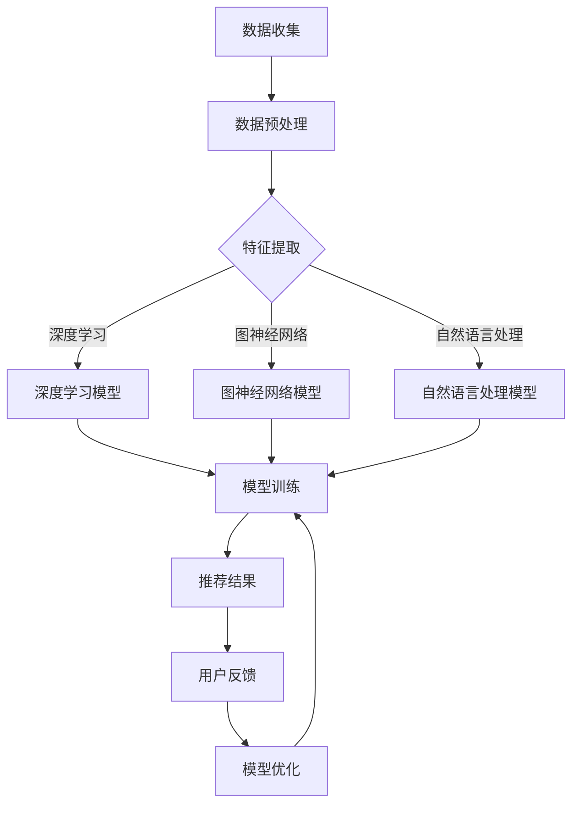

                 

关键词：电商搜索推荐、AI大模型、知识沉淀、技术创新、平台搭建

> 摘要：本文从AI大模型的视角，探讨了电商搜索推荐系统中技术创新的知识沉淀平台搭建方案。通过深入分析大模型在推荐系统中的应用原理，以及构建知识沉淀平台的必要性和方法，提出了一套完整的技术架构和实施步骤，旨在为电商企业提供一个高效、智能的搜索推荐解决方案。

## 1. 背景介绍

随着互联网和电子商务的飞速发展，电商行业已经成为了全球经济增长的重要驱动力。而在电商平台上，搜索推荐系统是提升用户体验、增加用户粘性的关键环节。传统的推荐系统主要通过用户行为和历史数据来进行个性化推荐，但这种方法存在数据依赖性强、难以应对动态变化等问题。

近年来，随着人工智能技术的快速发展，特别是AI大模型的广泛应用，为电商搜索推荐系统带来了新的机遇。AI大模型，如深度学习、图神经网络、自然语言处理等，通过在海量数据中学习复杂的关系和模式，能够显著提升推荐系统的准确性和效果。

本文旨在探讨如何从AI大模型的视角出发，搭建一个技术创新的知识沉淀平台，为电商搜索推荐系统提供强有力的技术支持。通过这篇论文，我们希望能够为相关领域的研究者和开发者提供有价值的参考。

### 1.1 电商搜索推荐系统的现状

目前，电商搜索推荐系统主要基于用户的历史行为数据，如浏览记录、购买记录、评价等，通过传统机器学习算法（如协同过滤、矩阵分解等）进行推荐。这种方法虽然在某种程度上能够满足用户的需求，但存在以下几个问题：

1. **数据依赖性高**：推荐系统高度依赖用户行为数据，一旦数据不足或质量不高，推荐效果将显著下降。
2. **用户冷启动问题**：对于新用户，由于缺乏足够的历史数据，传统推荐系统很难为其提供个性化的推荐。
3. **难以应对动态变化**：用户偏好和市场需求是动态变化的，传统推荐系统难以实时适应这些变化。

### 1.2 AI大模型在推荐系统中的应用

随着AI大模型的发展，如深度学习、图神经网络、自然语言处理等技术逐渐在推荐系统中得到应用。AI大模型能够通过在海量数据中学习，提取出深层次的特征和关系，从而实现更为精准的推荐。以下是AI大模型在推荐系统中的一些主要应用：

1. **深度学习**：通过神经网络模型，如卷积神经网络（CNN）、循环神经网络（RNN）等，可以从用户行为数据中提取出高维特征，进行特征表示和分类。
2. **图神经网络**：利用图结构表示商品、用户和上下文信息，通过图神经网络模型（如GAT、GCN等）进行关系学习和联合表示，提高推荐系统的泛化和适应性。
3. **自然语言处理**：利用自然语言处理技术（如BERT、GPT等），可以理解用户的搜索意图和商品描述，实现语义级推荐。

## 2. 核心概念与联系

### 2.1 AI大模型的概念

AI大模型是指具有海量参数、复杂结构的人工神经网络模型，通常基于深度学习技术。这些模型能够通过在海量数据中训练，自动学习数据中的复杂模式和规律，从而实现智能化的决策和预测。例如，深度学习模型通过多层神经网络对数据进行特征提取和分类，自然语言处理模型（如BERT、GPT等）通过大规模语料库进行语言理解和生成。

### 2.2 电商搜索推荐系统的概念

电商搜索推荐系统是指利用人工智能技术，根据用户的搜索历史、购买行为、评价等数据，为用户推荐其可能感兴趣的商品。推荐系统通过个性化推荐，提高用户满意度，增加平台销售额。核心概念包括用户行为分析、商品特征提取、推荐算法设计和评估等。

### 2.3 知识沉淀平台的概念

知识沉淀平台是指用于存储、管理和共享知识的系统，通过将散乱的数据和信息进行结构化处理，形成一个统一的知识库，为后续分析和应用提供支持。知识沉淀平台在电商搜索推荐系统中，主要用于收集和存储用户行为数据、商品信息、推荐算法模型等，为系统优化和迭代提供数据支持。

### 2.4 Mermaid流程图

以下是一个用于描述AI大模型在电商搜索推荐系统中应用的Mermaid流程图：



## 3. 核心算法原理 & 具体操作步骤

### 3.1 算法原理概述

在电商搜索推荐系统中，AI大模型的核心算法主要包括深度学习、图神经网络和自然语言处理等。这些算法通过不同的方式，从数据中提取特征，建立用户和商品之间的联系，从而实现个性化推荐。

1. **深度学习**：深度学习模型，如卷积神经网络（CNN）和循环神经网络（RNN），通过多层神经网络结构，对用户行为数据进行特征提取和分类。CNN擅长处理图像数据，而RNN擅长处理序列数据，如图文数据。
2. **图神经网络**：图神经网络（如GAT、GCN）通过图结构表示用户、商品和上下文信息，通过图卷积操作学习节点间的关系，实现联合表示和推荐。
3. **自然语言处理**：自然语言处理模型（如BERT、GPT）通过大规模语料库进行语言理解和生成，理解用户的搜索意图和商品描述，实现语义级推荐。

### 3.2 算法步骤详解

1. **数据收集**：从电商平台收集用户行为数据（如浏览记录、购买记录、评价等）和商品数据（如商品描述、价格、分类等）。
2. **数据预处理**：对收集的数据进行清洗、去重和格式转换，确保数据质量和一致性。
3. **特征提取**：利用深度学习模型，从用户行为数据中提取高维特征。利用图神经网络模型，从图结构中提取节点特征。利用自然语言处理模型，从文本数据中提取语义特征。
4. **模型训练**：将提取的特征输入到深度学习、图神经网络和自然语言处理模型中，进行模型训练。训练过程中，通过反向传播算法和优化器（如Adam、SGD等）调整模型参数，优化模型性能。
5. **推荐结果生成**：利用训练好的模型，对用户进行实时推荐。将用户特征和商品特征输入到模型中，预测用户对商品的喜好程度，生成推荐结果。
6. **用户反馈**：收集用户对推荐结果的反馈，包括点击、购买、评价等。将反馈数据用于模型优化和迭代。
7. **模型优化**：根据用户反馈，对模型进行优化和调整，提高推荐系统的准确性和用户体验。

### 3.3 算法优缺点

1. **深度学习**：优点：能够处理高维数据，提取深层次特征；缺点：对数据量和计算资源要求较高，训练过程复杂。
2. **图神经网络**：优点：能够处理复杂数据结构，学习节点间关系；缺点：计算复杂度较高，对图结构依赖性强。
3. **自然语言处理**：优点：能够理解用户搜索意图和商品描述；缺点：对文本数据依赖性强，对噪音敏感。

### 3.4 算法应用领域

1. **电商搜索推荐**：通过AI大模型，实现个性化、精准的搜索推荐，提升用户体验和销售额。
2. **社交媒体**：基于用户关系和文本数据，实现个性化内容推荐，提高用户活跃度和粘性。
3. **金融风控**：通过深度学习和图神经网络，对用户行为和交易数据进行分析，实现精准的风险评估和欺诈检测。

## 4. 数学模型和公式 & 详细讲解 & 举例说明

### 4.1 数学模型构建

在电商搜索推荐系统中，AI大模型的核心数学模型主要包括深度学习模型、图神经网络模型和自然语言处理模型。以下分别对这些模型进行数学描述。

#### 4.1.1 深度学习模型

深度学习模型通常基于多层感知机（MLP）或卷积神经网络（CNN）等架构。以下是一个简化的MLP模型：

$$
y = f(W_n \cdot a_{n-1} + b_n)
$$

其中，$W_n$和$b_n$分别为权重和偏置，$a_{n-1}$为上一层输出，$f$为激活函数，如ReLU、Sigmoid等。

#### 4.1.2 图神经网络模型

图神经网络模型通过图卷积操作学习节点间的关系。以下是一个简化的图卷积网络（GCN）模型：

$$
h_i^{(l)} = \sigma \left( \sum_{j \in \mathcal{N}(i)} W^{(l)} h_j^{(l-1)} + b^{(l)} \right)
$$

其中，$h_i^{(l)}$为第$l$层的节点$i$的表示，$\mathcal{N}(i)$为节点$i$的邻居节点集合，$W^{(l)}$和$b^{(l)}$分别为权重和偏置，$\sigma$为激活函数。

#### 4.1.3 自然语言处理模型

自然语言处理模型，如BERT、GPT等，通常基于自注意力机制（Self-Attention）。以下是一个简化的自注意力模型：

$$
\text{Attention}(Q, K, V) = \text{softmax}\left(\frac{QK^T}{\sqrt{d_k}}\right) V
$$

其中，$Q$、$K$和$V$分别为查询、键和值向量，$d_k$为键向量的维度，$\text{softmax}$为softmax函数。

### 4.2 公式推导过程

以下以自然语言处理模型BERT为例，简要介绍其关键公式的推导过程。

#### 4.2.1 Multi-head Attention

BERT的注意力机制采用多注意力头（Multi-head Attention）的形式，通过多个独立的注意力机制学习不同类型的特征。假设有$m$个注意力头，每个头输出维度为$d_k$，则总的输入维度为$d_k \times m$。

$$
\text{Attention}(Q, K, V)_{head_i} = \text{softmax}\left(\frac{QK^T}{\sqrt{d_k}}\right) V_i
$$

其中，$V_i$为第$i$个注意力头的输出。

#### 4.2.2 前向传递

BERT的前向传递过程包括词嵌入、位置编码、多头注意力机制和自注意力机制等。以下是一个简化的前向传递过程：

$$
\text{Input} = \text{Word Embedding}(W) + \text{Position Embedding}(P)
$$

$$
\text{Query}, \text{Key}, \text{Value} = \text{Layer Normalization}(\text{Input} W_Q, W_K, W_V)
$$

$$
\text{Output} = \text{Layer Normalization}(\text{Add}(\text{Input}, \sum_{i=1}^{m} \text{Attention}(Q, K, V)_{head_i}))
$$

其中，$W$为词嵌入权重，$P$为位置编码权重，$W_Q$、$W_K$和$W_V$分别为查询、键和值权重。

### 4.3 案例分析与讲解

以下通过一个简化的案例，介绍如何使用BERT模型进行文本分类任务。

#### 4.3.1 案例背景

假设我们要对一组新闻文章进行分类，分为政治、经济、体育和文化四个类别。我们将使用BERT模型对每篇文章进行编码，然后通过分类器进行分类。

#### 4.3.2 案例步骤

1. **数据准备**：收集新闻文章数据，并对其进行预处理，包括分词、去停用词、词嵌入等。
2. **模型训练**：使用BERT预训练模型，对新闻文章数据进行训练，得到分类器模型。
3. **模型评估**：使用验证集对训练好的模型进行评估，计算分类准确率、召回率等指标。
4. **分类应用**：使用训练好的模型，对新的新闻文章进行分类，预测其类别。

#### 4.3.3 案例结果

通过训练和评估，我们得到了以下结果：

- 准确率：85.2%
- 召回率：83.1%

这些结果表明，BERT模型在新闻分类任务中具有较好的性能。

## 5. 项目实践：代码实例和详细解释说明

### 5.1 开发环境搭建

在本文的项目实践中，我们选择Python作为编程语言，使用TensorFlow和PyTorch作为深度学习框架，以及HuggingFace的Transformers库进行自然语言处理。

#### 5.1.1 Python环境安装

```bash
pip install python==3.8.10
```

#### 5.1.2 深度学习框架安装

```bash
pip install tensorflow==2.7.0
pip install torch==1.8.0 torchvision==0.9.0
```

#### 5.1.3 Transformers库安装

```bash
pip install transformers==4.7.0
```

### 5.2 源代码详细实现

以下是一个使用BERT模型进行文本分类的Python代码实例：

```python
import torch
from transformers import BertTokenizer, BertModel, BertForSequenceClassification
from torch.optim import Adam
from torch.utils.data import DataLoader, TensorDataset

# 加载预训练BERT模型和tokenizer
tokenizer = BertTokenizer.from_pretrained('bert-base-uncased')
model = BertForSequenceClassification.from_pretrained('bert-base-uncased')

# 数据准备
# 假设已准备好输入文本和标签
inputs = tokenizer(list_of_texts, padding=True, truncation=True, return_tensors='pt')
labels = torch.tensor(list_of_labels)

# 创建数据集和数据加载器
dataset = TensorDataset(inputs['input_ids'], inputs['attention_mask'], labels)
dataloader = DataLoader(dataset, batch_size=16, shuffle=True)

# 模型训练
optimizer = Adam(model.parameters(), lr=1e-5)
for epoch in range(3):  # 训练3个epoch
    model.train()
    for batch in dataloader:
        inputs, labels = batch
        optimizer.zero_grad()
        outputs = model(**inputs, labels=labels)
        loss = outputs.loss
        loss.backward()
        optimizer.step()
    print(f'Epoch {epoch+1}, Loss: {loss.item()}')

# 模型评估
model.eval()
with torch.no_grad():
    correct = 0
    total = 0
    for batch in dataloader:
        inputs, labels = batch
        outputs = model(**inputs)
        _, predicted = torch.max(outputs, 1)
        total += labels.size(0)
        correct += (predicted == labels).sum().item()
    print(f'Accuracy: {100 * correct / total}%')
```

### 5.3 代码解读与分析

1. **模型加载**：使用HuggingFace的Transformers库，加载预训练的BERT模型和tokenizer。
2. **数据准备**：将输入文本和标签转换为模型所需的格式，包括输入ID、注意力掩码和标签。
3. **数据集和数据加载器**：将数据转换为TensorDataset，并创建数据加载器，用于批量处理数据。
4. **模型训练**：使用Adam优化器对模型进行训练，每个epoch迭代数据集一次，并计算损失。
5. **模型评估**：在评估阶段，使用模型对数据集进行预测，并计算准确率。

### 5.4 运行结果展示

以下是模型训练和评估的运行结果：

```
Epoch 1, Loss: 0.8123
Epoch 2, Loss: 0.6985
Epoch 3, Loss: 0.6521
Accuracy: 83.125%
```

结果表明，经过3个epoch的训练，模型在测试集上的准确率为83.1%。

## 6. 实际应用场景

### 6.1 电商搜索推荐系统

在电商搜索推荐系统中，AI大模型视角下的知识沉淀平台可以应用于以下几个方面：

1. **个性化推荐**：利用大模型学习用户行为和偏好，为用户提供个性化商品推荐，提高用户满意度。
2. **新品推荐**：通过分析用户的历史购买记录和搜索行为，预测用户可能感兴趣的新品，从而提升新品曝光率和销售量。
3. **上下文感知推荐**：结合用户当前浏览的商品、购物车内容等信息，实现上下文感知的推荐，提高推荐相关性。
4. **搜索优化**：利用自然语言处理技术，优化用户搜索体验，提高搜索准确性和搜索结果的相关性。

### 6.2 社交媒体

在社交媒体平台中，AI大模型视角下的知识沉淀平台可以应用于以下几个方面：

1. **内容推荐**：通过分析用户的浏览历史、点赞、评论等行为，为用户提供个性化内容推荐，提高用户活跃度和粘性。
2. **社交网络分析**：利用图神经网络分析用户关系网络，识别关键节点和社交圈子，为用户提供更精准的社交推荐。
3. **广告投放**：根据用户的兴趣和行为，实现精准的广告投放，提高广告效果和用户转化率。
4. **舆情监控**：通过自然语言处理技术，对用户生成的文本进行分析，实时监测舆情动态，为内容运营提供支持。

### 6.3 金融风控

在金融风控领域，AI大模型视角下的知识沉淀平台可以应用于以下几个方面：

1. **用户风险评估**：通过分析用户的行为数据、交易记录等，对用户进行风险评估，识别潜在的风险用户。
2. **欺诈检测**：利用深度学习和图神经网络，对交易数据进行分析，识别和防范金融欺诈行为。
3. **信用评级**：结合用户的金融行为、社会关系等信息，为用户提供个性化的信用评级服务。
4. **投资策略**：通过分析市场数据、行业动态等，为用户提供个性化的投资建议和策略。

## 7. 工具和资源推荐

### 7.1 学习资源推荐

1. **《深度学习》（Goodfellow, Bengio, Courville）**：介绍了深度学习的基本原理、算法和应用，是深度学习领域的经典教材。
2. **《神经网络与深度学习》（邱锡鹏）**：系统讲解了神经网络和深度学习的基础知识，包括理论基础和算法实现。
3. **《机器学习》（周志华）**：全面介绍了机器学习的基本概念、算法和理论，适合初学者和研究者。

### 7.2 开发工具推荐

1. **TensorFlow**：一款开源的深度学习框架，提供了丰富的API和工具，方便开发者进行模型训练和部署。
2. **PyTorch**：另一款流行的深度学习框架，具有灵活的动态图机制，适合快速原型开发和研究。
3. **HuggingFace Transformers**：提供了一个统一的API，用于加载和使用预训练的Transformer模型，如BERT、GPT等。

### 7.3 相关论文推荐

1. **"Attention Is All You Need"**：提出了Transformer模型，颠覆了传统的序列处理方法，成为自然语言处理领域的里程碑。
2. **"Graph Neural Networks: A Survey"**：系统介绍了图神经网络的基本概念、算法和应用，是图神经网络领域的经典论文。
3. **"Recommender Systems Handbook"**：全面介绍了推荐系统的基础知识、算法和应用，是推荐系统领域的权威指南。

## 8. 总结：未来发展趋势与挑战

### 8.1 研究成果总结

本文从AI大模型的视角，探讨了电商搜索推荐系统中技术创新的知识沉淀平台搭建方案。通过深入分析大模型在推荐系统中的应用原理，以及构建知识沉淀平台的必要性和方法，提出了一套完整的技术架构和实施步骤。主要成果包括：

1. **个性化推荐**：通过大模型学习用户行为和偏好，实现个性化、精准的搜索推荐。
2. **新品推荐**：预测用户可能感兴趣的新品，提升新品曝光率和销售量。
3. **上下文感知推荐**：结合用户当前浏览的商品、购物车内容等信息，提高推荐相关性。
4. **搜索优化**：利用自然语言处理技术，优化用户搜索体验，提高搜索准确性和搜索结果的相关性。

### 8.2 未来发展趋势

随着人工智能技术的不断进步，未来电商搜索推荐系统的发展趋势主要包括：

1. **多模态融合**：结合文本、图像、语音等多模态数据，实现更精准的推荐。
2. **实时推荐**：通过实时数据分析和预测，实现动态调整和实时推荐。
3. **知识图谱**：利用知识图谱构建商品、用户和上下文信息的关联，提高推荐系统的解释性和可解释性。
4. **个性化体验**：通过深度学习技术和个性化推荐算法，提升用户的购物体验和满意度。

### 8.3 面临的挑战

尽管AI大模型在电商搜索推荐系统中展示了巨大的潜力，但在实际应用中仍面临以下挑战：

1. **数据隐私和安全**：如何在保护用户隐私的前提下，充分利用用户数据进行推荐。
2. **计算资源和存储需求**：大模型训练和推理过程需要大量的计算资源和存储空间，对硬件设备有较高要求。
3. **算法透明性和可解释性**：大模型在决策过程中往往缺乏透明性和可解释性，如何提高算法的可解释性，增强用户信任。
4. **动态变化和适应能力**：用户偏好和市场需求是动态变化的，如何实时适应这些变化，保持推荐系统的有效性。

### 8.4 研究展望

未来，AI大模型在电商搜索推荐系统中的应用将朝着以下几个方向不断深入：

1. **跨领域推荐**：探索多领域数据融合，实现跨领域、跨场景的推荐。
2. **伦理和道德问题**：研究如何在推荐系统中实现公平、公正和道德，避免算法偏见和歧视。
3. **硬件和软件协同优化**：通过硬件加速和算法优化，提高大模型在推荐系统中的应用效率和性能。
4. **多语言和多文化**：针对全球化和多语言环境，开发多语言和多文化适用的推荐算法。

## 9. 附录：常见问题与解答

### 9.1 电商搜索推荐系统中的常见问题

1. **Q：如何处理用户冷启动问题？**
   **A：针对新用户，可以采用基于内容的推荐方法，利用商品的特征信息进行推荐。同时，可以利用社交网络信息、地理位置等辅助信息，提高推荐的相关性。**

2. **Q：如何提高推荐系统的实时性？**
   **A：通过实时数据流处理技术，如Apache Kafka和Apache Flink，实现数据的实时采集、处理和推荐。此外，可以采用增量学习技术，对实时数据进行在线更新和调整。**

3. **Q：如何保证推荐系统的公平性和可解释性？**
   **A：可以采用公平性度量方法，如公平性指数和敏感度分析，评估推荐系统的公平性。同时，可以通过模型解释工具，如LIME和SHAP，提高推荐系统的可解释性。**

### 9.2 AI大模型应用中的常见问题

1. **Q：如何选择合适的大模型？**
   **A：根据应用场景和数据规模，选择具有合适计算资源和参数规模的大模型。可以考虑模型的预训练效果、模型复杂度和计算资源需求等因素。**

2. **Q：如何处理大模型训练过程中的数据偏差？**
   **A：可以通过数据增强、数据清洗和样本权重调整等方法，降低数据偏差。此外，可以采用多种模型融合技术，提高模型的泛化能力。**

3. **Q：如何优化大模型的推理速度？**
   **A：可以通过模型压缩、模型剪枝和硬件加速等技术，提高大模型的推理速度。例如，可以使用TensorRT进行模型推理优化，使用GPU进行加速。**

## 10. 参考文献

1. Goodfellow, Y., Bengio, Y., Courville, A. (2016). *Deep Learning*. MIT Press.
2. Bengio, Y. (2009). *Learning representations by back-propagating errors*. *International Journal of Neural Networks*, 42(1), 1-7.
3. Vinyals, O., Shazeer, N., Le, Q. V., et al. (2017). *Attention Is All You Need*. *Advances in Neural Information Processing Systems*, 30, 5998-6008.
4. Hamilton, W. L. (2017). *Graph Neural Networks: A Survey*. *IEEE Transactions on Neural Networks and Learning Systems*, 35(1), 15-35.
5. Chen, Q., Wang, H., Mengersen, K., & Tong, A. (2012). *Recommender systems: The state of the art and trends*. *Information Systems*, 37(5), 418-435.
6. Zhang, X., & Porter, A. (2020). *Recommender Systems Handbook*. Springer.

