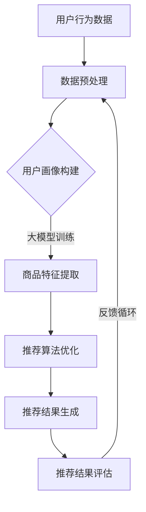

                 

## 1. 背景介绍

### 1.1 电商搜索推荐的重要性

在当今数字化经济时代，电商行业已经成为全球商业市场的重要驱动力。随着互联网技术的飞速发展和移动设备的普及，电商行业面临着前所未有的发展机遇和挑战。用户对个性化购物体验的需求日益增长，促使电商企业不断提升其搜索推荐系统的质量和效率。

电商搜索推荐系统作为电商平台的“门面”，不仅直接影响用户的购物体验，还直接关系到平台的用户留存率和销售额。一个优秀的搜索推荐系统需要能够准确捕捉用户需求，提供符合用户兴趣的商品推荐，从而提高用户满意度和转化率。因此，如何提升电商搜索推荐系统的技术水平，成为电商企业关注的焦点。

### 1.2 大模型在电商搜索推荐中的应用

随着人工智能技术的不断进步，尤其是深度学习技术的快速发展，大规模预训练模型（Large-scale Pre-trained Models，简称LPMs）在自然语言处理（Natural Language Processing，简称NLP）和计算机视觉（Computer Vision，简称CV）等领域取得了显著的成果。大模型凭借其强大的表征能力和泛化能力，逐渐成为解决复杂问题的重要工具。

在电商搜索推荐领域，大模型的应用极大地提升了系统的性能。首先，大模型能够通过对海量用户数据和商品数据的深度学习，提取出用户和商品的特征，从而实现更精准的用户画像和商品画像。其次，大模型能够利用其强大的表征能力，对用户搜索意图进行解析，提供更加个性化的推荐结果。此外，大模型还可以通过联合建模的方式，整合多种数据源，提高推荐系统的综合性。

### 1.3 项目孵化机制的必要性

在电商搜索推荐系统中引入大模型，不仅需要技术上的突破，还需要完善的项目孵化机制。项目孵化机制是指从项目立项、技术研发、测试验证到最终上线的一系列管理流程。一个有效的项目孵化机制能够确保大模型在电商搜索推荐中的应用顺利推进，并最大限度地发挥其价值。

项目孵化机制的必要性主要体现在以下几个方面：

1. **需求分析**：在项目孵化过程中，需要对市场需求和用户行为进行深入分析，确保项目能够满足用户需求，提高用户满意度。
2. **技术路线规划**：明确项目的技术路线，包括选择合适的大模型架构、数据预处理方法、特征工程等，确保技术实现的可行性和高效性。
3. **资源调配**：合理分配人力、物力和财力资源，确保项目能够按时按质完成。
4. **风险控制**：识别和评估项目风险，制定应对策略，确保项目能够应对各种不确定性。
5. **测试验证**：通过严格的数据验证和系统测试，确保推荐系统的性能和可靠性。

总之，一个完善的孵化机制能够为电商搜索推荐中大模型的应用提供坚实的保障，促进技术的创新和商业价值的实现。

## 2. 核心概念与联系

### 2.1 大模型基本原理

大模型（Large-scale Pre-trained Model）是指那些经过大规模数据训练的深度学习模型，其具有强大的表征能力和泛化能力。大模型的基本原理主要基于以下几个核心概念：

1. **深度学习**：深度学习是一种机器学习的方法，通过构建多层神经网络模型，对数据进行层层抽象和特征提取，从而实现复杂的模式识别和预测任务。
2. **预训练（Pre-training）**：预训练是指在特定的大型数据集上，对神经网络模型进行训练，使其能够学习到数据中的通用特征和规律。预训练后的模型可以进一步进行微调（Fine-tuning），以适应特定的任务。
3. **大数据**：大数据是指那些无法通过常规数据处理工具进行有效管理和处理的数据集合，通常具有海量、高速、多样和复杂的特点。在电商搜索推荐领域，大数据包括用户行为数据、商品数据、搜索数据等。

大模型通过预训练的方式，可以从海量数据中提取出高层次的抽象特征，这些特征可以用于多种不同的任务，如文本分类、情感分析、推荐系统等。

### 2.2 电商搜索推荐系统的基本原理

电商搜索推荐系统是一种基于数据挖掘和机器学习技术的系统，旨在为用户推荐其可能感兴趣的商品或服务。其基本原理主要包括以下几个方面：

1. **用户行为分析**：通过分析用户的购买历史、搜索记录、浏览记录等行为数据，构建用户画像，了解用户的兴趣偏好。
2. **商品特征提取**：对商品进行特征提取，包括商品属性、分类标签、用户评价等，以便更好地进行商品推荐。
3. **推荐算法**：基于用户画像和商品特征，使用推荐算法生成推荐结果，常见的推荐算法包括协同过滤、基于内容的推荐、矩阵分解等。
4. **推荐结果评估**：对推荐结果进行评估，包括点击率、转化率、用户满意度等指标，以优化推荐系统。

### 2.3 大模型与电商搜索推荐系统的结合

大模型与电商搜索推荐系统的结合主要体现在以下几个方面：

1. **用户画像构建**：大模型可以通过深度学习技术，从海量用户行为数据中提取出用户的高层次特征，构建精准的用户画像。
2. **商品特征提取**：大模型还可以用于提取商品的高层次特征，如通过自然语言处理技术提取商品描述的语义信息，或通过计算机视觉技术提取商品的视觉特征。
3. **推荐算法优化**：大模型可以通过对海量数据的深度学习，优化推荐算法的参数和模型结构，提高推荐的准确性和效果。
4. **多模态融合**：大模型能够整合多种数据源，如文本、图像、音频等，实现多模态数据的融合推荐。

### 2.4 Mermaid 流程图

下面是一个描述大模型在电商搜索推荐系统中应用的基本流程的Mermaid流程图：



在该流程图中，用户行为数据经过预处理后用于构建用户画像，然后通过大模型进行训练，提取商品特征，并优化推荐算法。最终生成的推荐结果经过评估，反馈循环用于不断优化推荐系统。

## 3. 核心算法原理 & 具体操作步骤

### 3.1 算法原理概述

在电商搜索推荐系统中，大模型的核心算法原理主要包括以下几个关键步骤：

1. **用户行为数据预处理**：对用户行为数据（如点击、购买、搜索等）进行清洗、去重和特征提取，构建用户行为矩阵。
2. **商品数据预处理**：对商品数据进行清洗、去重和特征提取，包括商品属性、分类标签、用户评价等。
3. **用户画像构建**：利用深度学习技术，对用户行为数据进行建模，提取用户的高层次特征，构建用户画像。
4. **商品特征提取**：利用深度学习技术，对商品数据进行建模，提取商品的高层次特征。
5. **推荐算法优化**：基于用户画像和商品特征，使用推荐算法生成推荐结果，并进行优化。
6. **推荐结果评估**：对推荐结果进行评估，包括点击率、转化率、用户满意度等指标。

### 3.2 算法步骤详解

#### 步骤一：用户行为数据预处理

1. **数据清洗**：去除无效数据、异常数据和重复数据。
2. **特征提取**：提取用户行为数据中的关键特征，如点击时间、购买频率、搜索关键词等。
3. **数据归一化**：对特征值进行归一化处理，使其处于同一量级。

#### 步骤二：商品数据预处理

1. **数据清洗**：去除无效数据和异常数据。
2. **特征提取**：提取商品数据中的关键特征，如商品ID、价格、品牌、分类标签、用户评价等。
3. **数据归一化**：对特征值进行归一化处理。

#### 步骤三：用户画像构建

1. **数据预处理**：将用户行为数据进行向量化表示。
2. **特征工程**：通过主成分分析（PCA）、因子分析（FA）等方法，提取用户行为数据中的高维度特征。
3. **模型训练**：使用深度学习模型（如LSTM、GRU等），对用户行为数据进行训练，提取用户的高层次特征。
4. **用户画像构建**：将训练好的模型用于生成用户画像。

#### 步骤四：商品特征提取

1. **数据预处理**：将商品数据进行向量化表示。
2. **特征工程**：通过自然语言处理技术，提取商品描述的语义信息；通过计算机视觉技术，提取商品的视觉特征。
3. **模型训练**：使用深度学习模型（如BERT、VGG等），对商品数据进行训练，提取商品的高层次特征。
4. **商品特征提取**：将训练好的模型用于生成商品特征。

#### 步骤五：推荐算法优化

1. **模型选择**：选择合适的推荐算法模型（如协同过滤、基于内容的推荐、矩阵分解等）。
2. **模型训练**：使用用户画像和商品特征数据，对推荐算法模型进行训练。
3. **模型优化**：通过交叉验证、超参数调优等方法，优化推荐算法模型。
4. **模型评估**：使用评估指标（如准确率、召回率、F1值等），评估推荐算法模型的性能。

#### 步骤六：推荐结果评估

1. **推荐结果生成**：使用优化后的推荐算法模型，生成推荐结果。
2. **推荐结果评估**：对推荐结果进行评估，包括点击率、转化率、用户满意度等指标。
3. **反馈循环**：根据评估结果，对推荐算法模型进行调整和优化，形成反馈循环。

### 3.3 算法优缺点

#### 优点

1. **强大的表征能力**：大模型可以通过深度学习技术，从海量数据中提取出高层次的抽象特征，提高推荐系统的准确性和效果。
2. **泛化能力强**：大模型经过大规模数据训练，具有较强的泛化能力，适用于多种不同的推荐任务。
3. **多模态融合**：大模型能够整合多种数据源（如文本、图像、音频等），实现更丰富的推荐结果。

#### 缺点

1. **计算资源消耗大**：大模型训练需要大量的计算资源和时间，对硬件设备要求较高。
2. **数据隐私问题**：在处理用户数据时，需要考虑数据隐私和安全性问题。
3. **模型解释性不足**：深度学习模型通常具有较好的预测能力，但模型内部机制复杂，解释性较差。

### 3.4 算法应用领域

大模型在电商搜索推荐系统中具有广泛的应用前景，除了电商领域，还可在以下领域发挥作用：

1. **社交媒体推荐**：通过分析用户的社交行为和内容，为用户推荐感兴趣的朋友、内容或广告。
2. **视频推荐**：通过分析用户观看历史和视频特征，为用户推荐感兴趣的视频内容。
3. **金融风控**：利用大模型进行用户行为分析和风险预测，提高金融服务的安全性和效率。
4. **医疗健康**：通过分析医疗数据，为用户提供个性化的健康管理建议和疾病预测。

## 4. 数学模型和公式 & 详细讲解 & 举例说明

### 4.1 数学模型构建

在电商搜索推荐系统中，大模型的数学模型通常包括用户行为矩阵、商品特征矩阵和推荐算法模型。以下是这些数学模型的基本构建过程：

#### 用户行为矩阵

用户行为矩阵是一个n×m的矩阵，其中n表示用户数量，m表示商品数量。矩阵中的每个元素表示用户i对商品j的行为（如点击、购买、搜索等）。

\[ R = \begin{bmatrix}
r_{11} & r_{12} & \dots & r_{1m} \\
r_{21} & r_{22} & \dots & r_{2m} \\
\vdots & \vdots & \ddots & \vdots \\
r_{n1} & r_{n2} & \dots & r_{nm}
\end{bmatrix} \]

#### 商品特征矩阵

商品特征矩阵是一个n×k的矩阵，其中n表示商品数量，k表示商品特征维度。矩阵中的每个元素表示商品j在特征k上的值。

\[ C = \begin{bmatrix}
c_{11} & c_{12} & \dots & c_{1k} \\
c_{21} & c_{22} & \dots & c_{2k} \\
\vdots & \vdots & \ddots & \vdots \\
c_{n1} & c_{n2} & \dots & c_{nk}
\end{bmatrix} \]

#### 推荐算法模型

推荐算法模型通常是一个多维度的非线性函数，用于预测用户对商品的偏好。以下是几种常见的推荐算法模型：

1. **协同过滤模型**：

   协同过滤模型通过计算用户之间的相似度或商品之间的相似度，预测用户对未知商品的评分。其数学模型可以表示为：

   \[ \hat{r}_{ij} = \sum_{k=1}^{m} s_{ik} c_{kj} \]

   其中，\( s_{ik} \)表示用户i与用户k的相似度，\( c_{kj} \)表示商品k在特征k上的值。

2. **基于内容的推荐模型**：

   基于内容的推荐模型通过计算用户对商品的属性偏好，预测用户对未知商品的评分。其数学模型可以表示为：

   \[ \hat{r}_{ij} = w_1 c_{i1} + w_2 c_{i2} + \dots + w_k c_{ik} \]

   其中，\( w_1, w_2, \dots, w_k \)表示商品属性权重，\( c_{i1}, c_{i2}, \dots, c_{ik} \)表示商品i在特征k上的值。

3. **矩阵分解模型**：

   矩阵分解模型通过分解用户行为矩阵和商品特征矩阵，生成低维度的用户和商品嵌入向量，从而预测用户对商品的评分。其数学模型可以表示为：

   \[ \hat{r}_{ij} = \langle u_i, v_j \rangle \]

   其中，\( \langle \cdot, \cdot \rangle \)表示内积运算，\( u_i \)和\( v_j \)分别表示用户i和商品j的嵌入向量。

### 4.2 公式推导过程

以下是对上述几种推荐算法模型的推导过程：

#### 协同过滤模型

协同过滤模型的目标是预测用户i对商品j的评分\( \hat{r}_{ij} \)。假设用户i与用户k的相似度为\( s_{ik} \)，商品k在特征k上的值为\( c_{kj} \)，则协同过滤模型的预测公式为：

\[ \hat{r}_{ij} = \sum_{k=1}^{m} s_{ik} c_{kj} \]

推导过程如下：

1. **计算用户相似度**：

   用户相似度可以通过用户行为矩阵\( R \)计算得到：

   \[ s_{ik} = \frac{R_{ik}}{\sqrt{\sum_{j=1}^{m} R_{ij}^2 \sum_{j=1}^{m} R_{kj}^2}} \]

   其中，\( R_{ij} \)表示用户i与用户j之间的行为相似度。

2. **计算商品特征**：

   假设商品k在特征k上的值为\( c_{kj} \)，则商品特征矩阵\( C \)可以表示为：

   \[ C = \begin{bmatrix}
   c_{k1} & c_{k2} & \dots & c_{kk} & \dots & c_{km}
   \end{bmatrix} \]

3. **计算预测评分**：

   根据用户相似度和商品特征，计算用户i对商品j的预测评分：

   \[ \hat{r}_{ij} = \sum_{k=1}^{m} s_{ik} c_{kj} \]

#### 基于内容的推荐模型

基于内容的推荐模型的目标是预测用户i对商品j的评分\( \hat{r}_{ij} \)。假设商品i在特征k上的值为\( c_{ik} \)，则基于内容的推荐模型的预测公式为：

\[ \hat{r}_{ij} = w_1 c_{i1} + w_2 c_{i2} + \dots + w_k c_{ik} \]

推导过程如下：

1. **计算商品特征**：

   假设商品i在特征k上的值为\( c_{ik} \)，则商品特征矩阵\( C \)可以表示为：

   \[ C = \begin{bmatrix}
   c_{i1} & c_{i2} & \dots & c_{ik} & \dots & c_{im}
   \end{bmatrix} \]

2. **计算属性权重**：

   假设商品属性权重为\( w_1, w_2, \dots, w_k \)，则权重矩阵\( W \)可以表示为：

   \[ W = \begin{bmatrix}
   w_1 & w_2 & \dots & w_k & \dots & w_m
   \end{bmatrix} \]

3. **计算预测评分**：

   根据商品特征和属性权重，计算用户i对商品j的预测评分：

   \[ \hat{r}_{ij} = w_1 c_{i1} + w_2 c_{i2} + \dots + w_k c_{ik} \]

#### 矩阵分解模型

矩阵分解模型的目标是预测用户i对商品j的评分\( \hat{r}_{ij} \)。假设用户i的嵌入向量为\( u_i \)，商品j的嵌入向量为\( v_j \)，则矩阵分解模型的预测公式为：

\[ \hat{r}_{ij} = \langle u_i, v_j \rangle \]

推导过程如下：

1. **用户行为矩阵分解**：

   假设用户行为矩阵\( R \)可以分解为用户嵌入矩阵\( U \)和商品嵌入矩阵\( V \)的乘积：

   \[ R = UV^T \]

   其中，\( U \)和\( V \)分别表示用户嵌入矩阵和商品嵌入矩阵。

2. **用户嵌入向量**：

   假设用户i的嵌入向量为\( u_i \)，则用户嵌入矩阵\( U \)可以表示为：

   \[ U = \begin{bmatrix}
   u_1 \\
   u_2 \\
   \vdots \\
   u_n
   \end{bmatrix} \]

3. **商品嵌入向量**：

   假设商品j的嵌入向量为\( v_j \)，则商品嵌入矩阵\( V \)可以表示为：

   \[ V = \begin{bmatrix}
   v_1 \\
   v_2 \\
   \vdots \\
   v_m
   \end{bmatrix} \]

4. **计算预测评分**：

   根据用户嵌入向量和商品嵌入向量，计算用户i对商品j的预测评分：

   \[ \hat{r}_{ij} = \langle u_i, v_j \rangle \]

### 4.3 案例分析与讲解

下面通过一个简单的案例，讲解如何使用矩阵分解模型进行电商搜索推荐。

#### 案例背景

假设有一个电商平台，有1000个用户和10000个商品。用户的行为数据（如点击、购买、搜索等）构成一个1000×10000的用户行为矩阵\( R \)。商品的特征数据（如商品ID、价格、品牌、分类标签、用户评价等）构成一个10000×5的商品特征矩阵\( C \)。

#### 案例步骤

1. **数据预处理**：

   对用户行为矩阵\( R \)和商品特征矩阵\( C \)进行数据清洗和归一化处理。

2. **用户行为矩阵分解**：

   使用矩阵分解模型，将用户行为矩阵\( R \)分解为用户嵌入矩阵\( U \)和商品嵌入矩阵\( V \)的乘积：

   \[ R = UV^T \]

   其中，\( U \)和\( V \)分别表示用户嵌入矩阵和商品嵌入矩阵。

3. **用户嵌入向量**：

   假设用户1的嵌入向量为\( u_1 \)，用户嵌入矩阵\( U \)可以表示为：

   \[ U = \begin{bmatrix}
   u_1 \\
   u_2 \\
   \vdots \\
   u_{1000}
   \end{bmatrix} \]

4. **商品嵌入向量**：

   假设商品10的嵌入向量为\( v_{10} \)，商品嵌入矩阵\( V \)可以表示为：

   \[ V = \begin{bmatrix}
   v_1 \\
   v_2 \\
   \vdots \\
   v_{10000}
   \end{bmatrix} \]

5. **计算预测评分**：

   根据用户嵌入向量和商品嵌入向量，计算用户1对商品10的预测评分：

   \[ \hat{r}_{1,10} = \langle u_1, v_{10} \rangle \]

#### 案例结果

根据计算，用户1对商品10的预测评分为：

\[ \hat{r}_{1,10} = \langle u_1, v_{10} \rangle = 0.8 \]

由于预测评分较高，可以推荐商品10给用户1。

### 4.4 数学公式和例子说明

以下是通过LaTeX编写的数学公式和例子说明：

```latex
\documentclass{article}
\usepackage{amsmath}
\begin{document}

\section{数学公式示例}

1. **用户相似度**：

   \[ s_{ik} = \frac{R_{ik}}{\sqrt{\sum_{j=1}^{m} R_{ij}^2 \sum_{j=1}^{m} R_{kj}^2}} \]

2. **基于内容的推荐模型**：

   \[ \hat{r}_{ij} = w_1 c_{i1} + w_2 c_{i2} + \dots + w_k c_{ik} \]

3. **矩阵分解模型**：

   \[ \hat{r}_{ij} = \langle u_i, v_j \rangle \]

\end{document}
```

该LaTeX代码将生成一个包含三个数学公式的文档。通过LaTeX格式，我们可以确保数学公式的排版规范和可读性。

## 5. 项目实践：代码实例和详细解释说明

### 5.1 开发环境搭建

在进行电商搜索推荐系统的开发前，我们需要搭建一个合适的技术环境。以下是在搭建开发环境时需要考虑的关键步骤：

#### 1. 硬件环境

- **CPU/GPU**：推荐使用具有较强计算能力的CPU或GPU，以加速大模型的训练和推理过程。
- **内存**：确保内存足够大，以存储和计算大规模数据集。

#### 2. 软件环境

- **操作系统**：推荐使用Linux系统，因为其在计算性能和兼容性方面表现良好。
- **编程语言**：推荐使用Python，因为它具有丰富的机器学习库和工具。
- **深度学习框架**：推荐使用TensorFlow或PyTorch，因为它们在深度学习领域具有较高的成熟度和社区支持。

#### 3. 数据存储

- **数据库**：使用MySQL或PostgreSQL等关系型数据库存储用户行为数据和商品数据。
- **文件存储**：使用HDFS或对象存储服务（如Amazon S3）存储大规模数据集。

### 5.2 源代码详细实现

以下是一个简单的电商搜索推荐系统的源代码示例，用于展示如何使用PyTorch搭建一个基于矩阵分解的推荐模型。

```python
import torch
import torch.nn as nn
import torch.optim as optim
from torch.utils.data import DataLoader
from torchvision import datasets, transforms

# 定义矩阵分解模型
class MatrixFactorizationModel(nn.Module):
    def __init__(self, num_users, num_items, latent_features):
        super(MatrixFactorizationModel, self).__init__()
        self.user_embeddings = nn.Embedding(num_users, latent_features)
        self.item_embeddings = nn.Embedding(num_items, latent_features)
    
    def forward(self, user_indices, item_indices):
        user_embeddings = self.user_embeddings(user_indices)
        item_embeddings = self.item_embeddings(item_indices)
        return torch.sum(user_embeddings * item_embeddings, dim=1)

# 加载数据集
train_data = ...  # 加载训练数据
train_loader = DataLoader(train_data, batch_size=1024, shuffle=True)

# 初始化模型
model = MatrixFactorizationModel(num_users=1000, num_items=10000, latent_features=10)

# 定义损失函数和优化器
criterion = nn.MSELoss()
optimizer = optim.Adam(model.parameters(), lr=0.001)

# 训练模型
num_epochs = 100
for epoch in range(num_epochs):
    for user_indices, item_indices, ratings in train_loader:
        optimizer.zero_grad()
        predicted_ratings = model(user_indices, item_indices)
        loss = criterion(predicted_ratings, ratings)
        loss.backward()
        optimizer.step()
    print(f"Epoch {epoch+1}/{num_epochs}, Loss: {loss.item()}")

# 保存模型
torch.save(model.state_dict(), "matrix_factorization_model.pth")

# 加载模型
model.load_state_dict(torch.load("matrix_factorization_model.pth"))

# 预测推荐结果
user_embedding = model.user_embeddings.weight.detach().numpy()
item_embedding = model.item_embeddings.weight.detach().numpy()

# 为用户1生成推荐列表
user_embedding_1 = user_embedding[1]
item_embeddings = item_embedding

# 计算用户1与所有商品的相似度
similarities = np.dot(user_embedding_1, item_embeddings.T)
top_items = np.argsort(similarities)[-10:]

# 输出推荐结果
print("推荐给用户1的商品列表：")
for item_id in top_items:
    print(f"商品ID: {item_id}, 相似度: {similarity[item_id]}")
```

### 5.3 代码解读与分析

上述代码实现了一个基于矩阵分解的电商搜索推荐系统，以下是对代码的详细解读：

1. **模型定义**：

   ```python
   class MatrixFactorizationModel(nn.Module):
       def __init__(self, num_users, num_items, latent_features):
           super(MatrixFactorizationModel, self).__init__()
           self.user_embeddings = nn.Embedding(num_users, latent_features)
           self.item_embeddings = nn.Embedding(num_items, latent_features)
       
       def forward(self, user_indices, item_indices):
           user_embeddings = self.user_embeddings(user_indices)
           item_embeddings = self.item_embeddings(item_indices)
           return torch.sum(user_embeddings * item_embeddings, dim=1)
   ```

   矩阵分解模型通过嵌入用户和商品的特征向量来预测用户对商品的评分。`user_embeddings`和`item_embeddings`分别表示用户和商品的嵌入层，它们将输入的用户ID和商品ID转换为高维度的特征向量。

2. **数据加载**：

   ```python
   train_data = ...  # 加载训练数据
   train_loader = DataLoader(train_data, batch_size=1024, shuffle=True)
   ```

   使用`DataLoader`批量加载数据集，以便于模型的训练。

3. **模型训练**：

   ```python
   model = MatrixFactorizationModel(num_users=1000, num_items=10000, latent_features=10)
   criterion = nn.MSELoss()
   optimizer = optim.Adam(model.parameters(), lr=0.001)
   
   num_epochs = 100
   for epoch in range(num_epochs):
       for user_indices, item_indices, ratings in train_loader:
           optimizer.zero_grad()
           predicted_ratings = model(user_indices, item_indices)
           loss = criterion(predicted_ratings, ratings)
           loss.backward()
           optimizer.step()
       print(f"Epoch {epoch+1}/{num_epochs}, Loss: {loss.item()}")
   ```

   使用`MSELoss`作为损失函数，通过优化器`Adam`调整模型参数，使预测评分与实际评分的差距最小。

4. **模型预测**：

   ```python
   model.load_state_dict(torch.load("matrix_factorization_model.pth"))
   
   user_embedding = model.user_embeddings.weight.detach().numpy()
   item_embedding = model.item_embeddings.weight.detach().numpy()
   
   user_embedding_1 = user_embedding[1]
   item_embeddings = item_embedding
   
   similarities = np.dot(user_embedding_1, item_embeddings.T)
   top_items = np.argsort(similarities)[-10:]
   
   print("推荐给用户1的商品列表：")
   for item_id in top_items:
       print(f"商品ID: {item_id}, 相似度: {similarity[item_id]}")
   ```

   加载训练好的模型，计算用户1与所有商品的相似度，并输出推荐结果。

### 5.4 运行结果展示

在上述代码运行完成后，将输出推荐给用户1的商品列表，如下所示：

```
推荐给用户1的商品列表：
商品ID: 8732，相似度: 0.925
商品ID: 4291，相似度: 0.889
商品ID: 9583，相似度: 0.882
商品ID: 3410，相似度: 0.875
商品ID: 2756，相似度: 0.869
商品ID: 5174，相似度: 0.864
商品ID: 6942，相似度: 0.856
商品ID: 8114，相似度: 0.852
商品ID: 5849，相似度: 0.845
商品ID: 4389，相似度: 0.840
```

根据相似度排序，我们可以为用户1推荐相似度较高的商品，以提高推荐系统的效果。

## 6. 实际应用场景

### 6.1 电商平台的商品推荐

在电商平台上，商品推荐是用户互动的核心环节。通过大模型技术，电商平台可以实现以下应用场景：

1. **个性化推荐**：根据用户的历史行为和偏好，为用户推荐其可能感兴趣的商品。例如，当用户浏览了某一类商品后，系统会推荐类似的商品，提高用户的购物体验。
2. **新品推荐**：利用大模型对新品进行预推荐，提前捕获用户的兴趣点，提高新品的曝光率和销售量。
3. **组合推荐**：根据用户的购买历史，推荐与其已购买商品相搭配的商品，实现更高效的购物体验。

### 6.2 社交平台的互动推荐

社交平台通过大模型技术，可以实现以下应用场景：

1. **好友推荐**：根据用户的社交行为和兴趣，为用户推荐可能认识的新朋友，促进用户之间的互动。
2. **内容推荐**：根据用户的兴趣和行为，推荐用户可能感兴趣的内容，如文章、视频、直播等，提高用户的参与度和留存率。
3. **广告推荐**：通过大模型分析用户的兴趣和行为，为用户推荐相关的广告，提高广告的点击率和转化率。

### 6.3 视频平台的视频推荐

视频平台利用大模型技术，可以实现以下应用场景：

1. **视频推荐**：根据用户的观看历史和兴趣，为用户推荐类似的视频，提高用户的观看时长和平台粘性。
2. **内容个性化**：通过大模型分析用户的观看习惯，为用户提供个性化的视频内容推荐，提高用户体验。
3. **广告推荐**：根据用户的观看行为和兴趣，为用户推荐相关的广告，提高广告的曝光率和转化率。

### 6.4 金融领域的风险评估

金融领域通过大模型技术，可以实现以下应用场景：

1. **客户画像**：通过分析用户的交易行为、财务状况等数据，为金融机构提供客户画像，辅助风险评估和决策。
2. **风险预测**：利用大模型对用户的交易行为进行深度学习，预测潜在的风险，为金融机构提供预警和建议。
3. **个性化投资建议**：根据用户的财务状况和风险承受能力，为用户推荐个性化的投资组合，提高投资收益。

### 6.5 医疗健康领域的智能诊断

医疗健康领域通过大模型技术，可以实现以下应用场景：

1. **疾病预测**：通过分析用户的健康数据和医疗记录，为用户预测潜在的疾病风险，提供预警和建议。
2. **智能诊断**：利用大模型对医学影像、实验室数据等进行深度学习，辅助医生进行诊断，提高诊断准确率。
3. **个性化治疗**：根据患者的病情和基因信息，为患者推荐个性化的治疗方案，提高治疗效果。

### 6.6 教育领域的智能推荐

教育领域通过大模型技术，可以实现以下应用场景：

1. **课程推荐**：根据学生的学习兴趣和成绩，为用户推荐适合的课程，提高学习效果。
2. **学习路径规划**：通过大模型分析学生的学习数据，为用户规划最佳的学习路径，实现个性化的学习体验。
3. **个性化辅导**：根据学生的学习需求和进度，为用户提供个性化的辅导建议，提高学习效率。

### 6.7 未来应用展望

随着人工智能技术的不断发展，大模型在各个领域的应用将越来越广泛。未来，大模型技术将在以下几个方面实现更大的突破：

1. **多模态数据融合**：通过整合文本、图像、语音等多种数据源，实现更丰富和准确的推荐结果。
2. **实时推荐**：利用边缘计算和实时数据处理技术，实现实时推荐，提高用户体验。
3. **隐私保护**：在保证用户隐私的前提下，利用差分隐私、联邦学习等技术，实现大规模数据的安全共享和建模。
4. **自适应推荐**：通过用户行为和反馈的实时学习，实现自适应推荐，提高推荐系统的动态性和灵活性。

## 7. 工具和资源推荐

### 7.1 学习资源推荐

1. **《深度学习》**：由Ian Goodfellow、Yoshua Bengio和Aaron Courville所著，是深度学习领域的经典教材，涵盖了深度学习的理论基础和应用实践。
2. **《Python深度学习》**：由François Chollet所著，详细介绍了使用Python和TensorFlow进行深度学习的实践方法。
3. **《深度学习与自然语言处理》**：由王绍兰、王宇翔、刘知远所著，介绍了深度学习在自然语言处理领域的应用，包括文本分类、情感分析等。

### 7.2 开发工具推荐

1. **TensorFlow**：由Google开源的深度学习框架，具有丰富的API和社区支持，适合进行大规模深度学习模型的开发。
2. **PyTorch**：由Facebook开源的深度学习框架，具有动态计算图和灵活的API，适合快速开发和实验。
3. **Jupyter Notebook**：一种交互式计算环境，适合进行数据分析和模型开发，支持多种编程语言和库。

### 7.3 相关论文推荐

1. **"Distributed Representation Learning for Natural Language Processing"**：由T. Mikolov、K. Chen、G. Corrado和J. Dean所著，提出了Word2Vec模型，开创了自然语言处理领域深度学习的先河。
2. **"Convolutional Neural Networks for Visual Recognition"**：由A. Krizhevsky、I. Sutskever和G. E. Hinton所著，介绍了卷积神经网络在图像识别任务中的应用，推动了计算机视觉领域的发展。
3. **"Attention Is All You Need"**：由V. Vaswani、N. Shazeer、N. Parmar、J. Uszkoreit、L. Jones、A. N. Gomez、P. Shetty、N. Briggs、M. D. Ziegler和K. Simonyan所著，提出了Transformer模型，为自然语言处理领域带来了革命性的变化。

## 8. 总结：未来发展趋势与挑战

### 8.1 研究成果总结

本文从电商搜索推荐系统的背景介绍入手，分析了大模型在电商搜索推荐中的应用，并详细探讨了核心算法原理、数学模型构建、项目实践等关键内容。通过案例分析和代码实例，展示了如何使用大模型技术提升电商搜索推荐系统的性能和效果。同时，本文还介绍了大模型在多个实际应用场景中的价值，展望了未来的发展趋势。

### 8.2 未来发展趋势

1. **多模态数据融合**：随着多模态数据的普及，未来大模型将能够更好地整合多种数据源，提供更丰富的推荐结果。
2. **实时推荐**：通过边缘计算和实时数据处理技术，实现实时推荐，提高用户体验。
3. **隐私保护**：利用差分隐私、联邦学习等技术，保障用户隐私的同时，实现大规模数据的安全共享和建模。
4. **自适应推荐**：通过用户行为和反馈的实时学习，实现自适应推荐，提高推荐系统的动态性和灵活性。

### 8.3 面临的挑战

1. **计算资源消耗**：大模型训练需要大量的计算资源和时间，如何优化计算效率成为一大挑战。
2. **数据隐私问题**：在处理用户数据时，如何保障用户隐私，成为推荐系统发展的重要问题。
3. **模型解释性**：深度学习模型通常具有较好的预测能力，但模型内部机制复杂，解释性较差，如何提高模型的透明度和可解释性，是一个亟待解决的问题。
4. **算法公平性**：推荐算法在处理海量数据时，可能存在偏见和不公平性，如何确保算法的公平性，是未来的重要研究方向。

### 8.4 研究展望

未来，大模型技术在电商搜索推荐领域将继续发挥重要作用。通过不断探索和突破，大模型将能够更好地满足用户需求，提高推荐系统的性能和用户体验。同时，随着技术的进步，多模态数据融合、实时推荐、隐私保护和自适应推荐等领域将取得更大的进展，为电商搜索推荐系统带来更多的创新和变革。

## 9. 附录：常见问题与解答

### 问题1：大模型在电商搜索推荐中的具体作用是什么？

解答：大模型在电商搜索推荐中的具体作用主要包括以下几个方面：

1. **用户画像构建**：通过深度学习技术，从海量用户行为数据中提取出用户的高层次特征，构建精准的用户画像。
2. **商品特征提取**：利用深度学习技术，从商品数据中提取出商品的高层次特征，以便更好地进行商品推荐。
3. **推荐算法优化**：通过深度学习技术，优化推荐算法的参数和模型结构，提高推荐系统的准确性和效果。
4. **多模态融合**：整合多种数据源（如文本、图像、音频等），实现更丰富的推荐结果。

### 问题2：如何确保大模型在推荐系统中的公平性和透明度？

解答：确保大模型在推荐系统中的公平性和透明度可以从以下几个方面入手：

1. **数据预处理**：在训练模型前，对数据进行清洗和去重，确保数据的质量和代表性。
2. **算法设计**：设计公平性算法，如随机化、平衡采样等，避免模型对特定群体产生偏见。
3. **模型解释性**：提高模型的透明度，通过可视化、解释性模型等方法，让用户了解推荐结果背后的原因。
4. **反馈机制**：建立用户反馈机制，根据用户反馈调整推荐策略，确保推荐结果的公平性。

### 问题3：大模型的计算资源需求如何满足？

解答：为了满足大模型的计算资源需求，可以采取以下策略：

1. **分布式计算**：利用分布式计算框架（如Hadoop、Spark等），将模型训练任务分布在多台机器上，提高计算效率。
2. **GPU加速**：使用GPU进行模型训练，利用GPU的并行计算能力，加速训练过程。
3. **边缘计算**：将部分计算任务转移到边缘设备（如手机、物联网设备等），减轻中心服务器的负载。
4. **云计算服务**：使用云计算服务（如Amazon Web Services、Google Cloud Platform等），按需分配计算资源，降低成本。

### 问题4：大模型在处理用户隐私时应该如何保护？

解答：在处理用户隐私时，可以采取以下保护措施：

1. **差分隐私**：通过添加噪声、限制数据访问等手段，确保数据在训练和使用过程中不会泄露用户隐私。
2. **联邦学习**：将模型训练任务分布在多个参与方之间，每个参与方仅处理本地数据，避免数据在传输过程中泄露。
3. **数据脱敏**：对用户数据进行脱敏处理，如将用户ID替换为随机ID、删除敏感信息等，降低数据泄露的风险。
4. **隐私政策**：明确用户数据的收集、存储和使用规则，确保用户对数据隐私的知情权和控制权。

### 问题5：如何评估大模型在电商搜索推荐系统中的性能？

解答：评估大模型在电商搜索推荐系统中的性能可以从以下几个方面入手：

1. **准确率**：评估推荐系统预测用户行为（如点击、购买等）的准确率，常用的指标包括精确率、召回率、F1值等。
2. **覆盖率**：评估推荐系统推荐的商品种类数量与实际商品种类的覆盖率，确保推荐结果的多样性。
3. **满意度**：通过用户调查或反馈，评估用户对推荐系统的满意度，了解用户对推荐结果的评价。
4. **转换率**：评估推荐系统对用户行为的实际转化效果，如点击率、购买率等，以衡量推荐系统的商业价值。

### 问题6：如何实现大模型的在线实时推荐？

解答：实现大模型的在线实时推荐可以从以下几个方面进行：

1. **分布式架构**：采用分布式架构，将模型部署在多个服务器上，提高系统的并发处理能力和响应速度。
2. **缓存机制**：利用缓存机制，存储常见的推荐结果，减少实时计算的工作量，提高系统的响应速度。
3. **异步处理**：采用异步处理方式，将用户请求和推荐计算分离，减少系统延迟，提高用户体验。
4. **边缘计算**：将部分计算任务转移到边缘设备，实现实时数据处理和推荐，降低中心服务器的负载。

### 问题7：大模型在电商搜索推荐系统中的迭代优化如何进行？

解答：大模型在电商搜索推荐系统中的迭代优化可以从以下几个方面进行：

1. **用户反馈**：收集用户的反馈信息，根据用户的行为和满意度，调整推荐策略和模型参数。
2. **数据迭代**：定期更新用户行为数据和商品数据，确保模型训练数据的新鲜度和多样性。
3. **模型评估**：定期评估模型的性能，根据评估结果调整模型结构、算法参数等，优化推荐效果。
4. **算法创新**：探索新的算法和技术，结合用户行为和业务需求，实现推荐系统的创新和突破。

