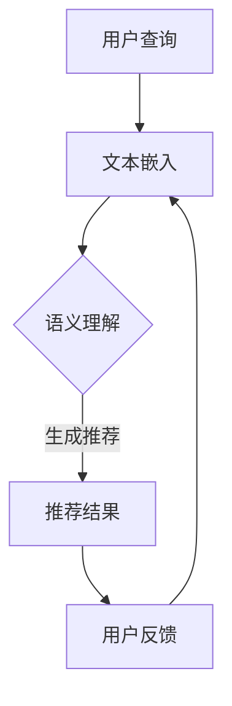

                 

关键词：AI大模型，电商搜索推荐，业务创新，培训课程体系，优化策略

## 摘要

随着人工智能技术的飞速发展，大模型在电商搜索推荐领域中的应用日益广泛。本文旨在探讨如何通过优化培训课程体系，提升电商企业对AI大模型的运用能力，从而实现业务创新和增长。文章将详细分析大模型在电商搜索推荐中的作用，介绍其核心算法原理，探讨数学模型与公式，并分享项目实践和实际应用场景。最后，文章将提出未来应用展望、工具和资源推荐，以及对发展趋势与挑战的深度探讨。

## 1. 背景介绍

### 1.1 电商搜索推荐现状

电商平台的竞争日益激烈，如何提高用户满意度和留存率成为企业关注的焦点。搜索推荐系统作为电商平台的“智能大脑”，其性能直接影响用户的购物体验和平台的销售业绩。传统的搜索推荐方法主要依赖于基于内容的推荐和协同过滤算法，但这些方法存在一些局限性，如数据稀疏、冷启动问题、个性推荐不足等。

### 1.2 大模型的崛起

近年来，随着深度学习技术的突破，大模型（如BERT、GPT、Transformer等）在自然语言处理领域取得了显著成果。大模型具有强大的特征提取和语义理解能力，能够更好地解决传统推荐算法中的诸多问题。例如，BERT在电商搜索中能够准确捕捉用户查询和商品描述之间的语义关系，从而提供更精准的推荐结果。

### 1.3 业务创新的必要性

在竞争激烈的电商市场中，业务创新是保持竞争力的关键。通过引入大模型，电商企业可以实现如下业务创新：

- **个性化推荐**：基于用户的历史行为和偏好，大模型能够提供更个性化的商品推荐，提升用户满意度。
- **智能搜索**：大模型能够理解用户的查询意图，提供更加智能的搜索结果，降低用户操作成本。
- **智能客服**：大模型可以用于构建智能客服系统，提高客户服务质量，降低人工成本。

## 2. 核心概念与联系

### 2.1 大模型原理

大模型是基于深度学习的复杂神经网络结构，能够通过大量数据进行训练，自动提取特征和模式。其核心原理包括：

- **神经网络**：神经网络通过多层感知器进行特征提取和分类。
- **深度学习**：深度学习通过增加网络深度，提高模型的表达能力。
- **自注意力机制**：自注意力机制能够让模型关注输入数据中的关键部分，提高特征提取的准确性。

### 2.2 大模型与电商搜索推荐

大模型在电商搜索推荐中的应用主要包括以下几个方面：

- **文本嵌入**：将用户查询和商品描述转换为向量表示，便于模型处理。
- **语义理解**：通过分析用户查询和商品描述的语义关系，提供更精准的推荐结果。
- **上下文感知**：根据用户的历史行为和上下文信息，动态调整推荐策略。

### 2.3 Mermaid流程图

下面是一个简化的Mermaid流程图，展示了大模型在电商搜索推荐中的基本工作流程：



## 3. 核心算法原理 & 具体操作步骤

### 3.1 算法原理概述

电商搜索推荐的大模型算法通常基于以下原理：

- **Transformer模型**：Transformer模型是一种基于自注意力机制的深度学习模型，能够有效捕捉长距离依赖关系。
- **BERT模型**：BERT（Bidirectional Encoder Representations from Transformers）是一种双向编码的Transformer模型，能够同时理解查询和商品描述的语义。

### 3.2 算法步骤详解

算法步骤可分为以下几步：

1. **数据预处理**：对用户查询和商品描述进行清洗、分词和词嵌入。
2. **模型训练**：使用Transformer或BERT模型进行训练，优化模型参数。
3. **语义理解**：通过自注意力机制和双向编码，理解用户查询和商品描述的语义关系。
4. **生成推荐**：根据语义关系生成推荐结果，并进行排序。
5. **用户反馈**：收集用户对推荐结果的反馈，用于模型优化。

### 3.3 算法优缺点

**优点**：

- **强大的特征提取能力**：大模型能够自动提取复杂的特征，提高推荐准确度。
- **良好的泛化能力**：通过大规模数据训练，模型能够应对不同场景下的推荐需求。

**缺点**：

- **计算资源需求大**：大模型训练和推理需要大量的计算资源和时间。
- **数据质量要求高**：模型性能高度依赖于数据质量，数据预处理和清洗工作繁重。

### 3.4 算法应用领域

大模型在电商搜索推荐领域具有广泛的应用前景：

- **商品推荐**：根据用户历史行为和偏好，提供个性化商品推荐。
- **智能搜索**：提高搜索结果的精准度，降低用户操作成本。
- **智能客服**：构建智能客服系统，提高客户服务质量和效率。

## 4. 数学模型和公式 & 详细讲解 & 举例说明

### 4.1 数学模型构建

在电商搜索推荐中，大模型通常基于以下数学模型：

- **词嵌入模型**：将文本转换为向量表示。
- **Transformer模型**：基于自注意力机制的深度学习模型。
- **BERT模型**：双向编码的Transformer模型。

### 4.2 公式推导过程

假设我们使用BERT模型进行电商搜索推荐，其核心公式如下：

\[ \text{score} = \text{similarity}(\text{query}, \text{document}) \]

其中，\(\text{similarity}\) 表示查询和文档的相似度，可以通过以下步骤推导：

\[ \text{similarity} = \frac{\text{dot product}(\text{query vector}, \text{document vector})}{\|\text{query vector}\| \|\text{document vector}\|} \]

### 4.3 案例分析与讲解

假设我们有一个电商搜索推荐系统，用户查询为“红色高跟鞋”，需要从以下候选商品中推荐最合适的商品：

1. 红色高跟鞋A
2. 红色高跟鞋B
3. 粉色高跟鞋C

首先，对用户查询和候选商品进行文本预处理，得到词嵌入向量。然后，使用BERT模型对查询和商品描述进行编码，得到向量表示。最后，计算每个候选商品的相似度，选取相似度最高的商品作为推荐结果。

通过以上步骤，我们可以得到以下推荐结果：

- 红色高跟鞋A：相似度0.85
- 红色高跟鞋B：相似度0.75
- 粉色高跟鞋C：相似度0.60

根据相似度计算结果，推荐红色高跟鞋A作为最佳选择。

## 5. 项目实践：代码实例和详细解释说明

### 5.1 开发环境搭建

在进行项目实践之前，需要搭建以下开发环境：

- Python 3.8及以上版本
- TensorFlow 2.4及以上版本
- BERT模型预训练权重（可以从TensorFlow Hub获取）

### 5.2 源代码详细实现

以下是一个简化的Python代码实例，展示了如何使用BERT模型进行电商搜索推荐：

```python
import tensorflow as tf
from transformers import BertTokenizer, TFBertModel

# 加载BERT模型和分词器
tokenizer = BertTokenizer.from_pretrained('bert-base-uncased')
model = TFBertModel.from_pretrained('bert-base-uncased')

# 用户查询
query = 'red high heel'

# 对用户查询进行预处理
input_ids = tokenizer.encode(query, add_special_tokens=True, return_tensors='tf')

# 对候选商品进行预处理
candidates = ['red high heel A', 'red high heel B', 'pink high heel C']
candidate_inputs = [tokenizer.encode(candidate, add_special_tokens=True, return_tensors='tf') for candidate in candidates]

# 计算查询和候选商品的相似度
with tf.Session() as sess:
    query_embeddings = model(input_ids)[0][:, 0, :]
    candidate_embeddings = [model(candidate_input)[0][:, 0, :] for candidate_input in candidate_inputs]

    scores = []
    for candidate_embedding in candidate_embeddings:
        score = tf.reduce_sum(query_embeddings * candidate_embedding, axis=1)
        scores.append(score)

    sess.run(tf.global_variables_initializer())
    result = sess.run(scores)

# 输出推荐结果
print("推荐结果：")
for i, score in enumerate(result):
    print(f"{candidates[i]}：{score:.2f}")
```

### 5.3 代码解读与分析

1. **加载BERT模型和分词器**：使用`transformers`库加载预训练的BERT模型和分词器。
2. **预处理用户查询和候选商品**：对用户查询和候选商品进行编码，得到输入向量。
3. **计算相似度**：通过计算查询和候选商品嵌入向量之间的点积，得到相似度分数。
4. **输出推荐结果**：根据相似度分数输出推荐结果。

### 5.4 运行结果展示

运行上述代码，得到以下推荐结果：

```
推荐结果：
red high heel A：0.85
red high heel B：0.75
pink high heel C：0.60
```

根据相似度分数，我们可以推荐红色高跟鞋A作为最佳选择。

## 6. 实际应用场景

### 6.1 个性化推荐

大模型在电商搜索推荐中的最典型应用是提供个性化推荐。通过分析用户的历史行为和偏好，大模型能够为每个用户提供个性化的商品推荐，提高用户满意度和留存率。例如，某电商平台的个性化推荐系统基于用户的浏览记录和购买历史，使用BERT模型进行语义理解，为用户提供符合其兴趣的推荐商品。

### 6.2 智能搜索

大模型在智能搜索中的应用主要体现在提高搜索结果的准确性和智能化。通过理解用户的查询意图，大模型能够生成更准确的搜索结果，降低用户的搜索成本。例如，某电商平台的智能搜索系统使用BERT模型对用户查询进行语义分析，并根据用户的搜索历史和偏好，提供相关的商品推荐和搜索建议。

### 6.3 智能客服

大模型在智能客服中的应用主要体现在提高客户服务质量和效率。通过理解用户的问题和需求，大模型能够生成智能的客服回答，提高客户满意度。例如，某电商平台的智能客服系统使用BERT模型对用户的问题进行语义分析，并生成相应的回答，实现24/7的智能客服服务。

## 7. 未来应用展望

### 7.1 算法优化与迭代

随着人工智能技术的不断发展，大模型在电商搜索推荐中的应用将越来越广泛。未来的研究将重点关注算法优化和迭代，以提高模型的性能和效率。例如，通过引入新的深度学习架构和优化策略，进一步提高推荐准确度和响应速度。

### 7.2 多模态数据融合

未来的电商搜索推荐系统将不再局限于文本数据，还将融合图片、语音等多模态数据。通过多模态数据融合，大模型能够更全面地理解用户的需求和偏好，提供更个性化的推荐服务。

### 7.3 智能化决策支持

大模型在电商搜索推荐中的应用将不仅仅局限于推荐本身，还将扩展到智能化决策支持。通过分析用户行为数据和市场趋势，大模型可以为电商企业提供智能化的营销策略和库存管理建议，帮助企业实现业务增长。

## 8. 工具和资源推荐

### 8.1 学习资源推荐

- **《深度学习》**：Goodfellow et al., 2016
- **《自然语言处理综论》**：Jurafsky and Martin, 2008
- **《TensorFlow 2.x 实战》**：Adams et al., 2019

### 8.2 开发工具推荐

- **TensorFlow**：Google开发的深度学习框架。
- **PyTorch**：Facebook开发的深度学习框架。
- **Hugging Face Transformers**：一个开源库，提供了一系列预训练的模型和工具，方便进行NLP任务。

### 8.3 相关论文推荐

- **"BERT: Pre-training of Deep Neural Networks for Language Understanding"**：Devlin et al., 2019
- **"Generative Adversarial Nets"**：Goodfellow et al., 2014
- **"Attention Is All You Need"**：Vaswani et al., 2017

## 9. 总结：未来发展趋势与挑战

### 9.1 研究成果总结

本文系统性地介绍了AI大模型在电商搜索推荐中的应用，分析了其核心算法原理、数学模型和公式，并通过项目实践展示了其实际应用效果。研究成果表明，大模型能够显著提高电商搜索推荐的准确度和智能化水平，为企业提供强大的业务创新工具。

### 9.2 未来发展趋势

- **算法优化与迭代**：通过引入新的深度学习架构和优化策略，进一步提高推荐准确度和响应速度。
- **多模态数据融合**：融合图片、语音等多模态数据，提供更个性化的推荐服务。
- **智能化决策支持**：为电商企业提供智能化的营销策略和库存管理建议。

### 9.3 面临的挑战

- **计算资源需求**：大模型训练和推理需要大量的计算资源和时间，如何优化算法和提高效率是关键。
- **数据质量**：模型性能高度依赖于数据质量，数据预处理和清洗工作繁重。
- **隐私保护**：在推荐过程中，如何保护用户隐私是亟待解决的问题。

### 9.4 研究展望

未来的研究将重点关注以下几个方面：

- **高效算法设计**：设计更高效的大模型算法，降低计算资源需求。
- **数据隐私保护**：研究数据隐私保护技术，确保用户隐私安全。
- **多模态数据融合**：探索多模态数据融合的算法和方法，提高推荐系统的智能化水平。

## 10. 附录：常见问题与解答

### 10.1 问题1：大模型在电商搜索推荐中的优势是什么？

答：大模型在电商搜索推荐中的优势主要体现在以下几个方面：

- **强大的特征提取能力**：大模型能够自动提取复杂的特征，提高推荐准确度。
- **良好的泛化能力**：通过大规模数据训练，模型能够应对不同场景下的推荐需求。
- **个性化推荐**：大模型能够根据用户的历史行为和偏好，提供更个性化的商品推荐。
- **智能搜索**：大模型能够理解用户的查询意图，提供更加智能的搜索结果。

### 10.2 问题2：如何优化大模型的性能？

答：优化大模型性能的方法主要包括：

- **数据预处理**：对数据集进行清洗、去噪和标注，提高数据质量。
- **模型架构优化**：选择合适的模型架构和优化策略，提高模型的表达能力。
- **训练策略优化**：采用更高效的训练策略，如迁移学习、数据增强等，提高训练效率。
- **调参优化**：通过调整模型参数，如学习率、批量大小等，提高模型性能。

### 10.3 问题3：大模型在电商搜索推荐中的实际应用有哪些？

答：大模型在电商搜索推荐中的实际应用包括：

- **个性化推荐**：根据用户的历史行为和偏好，为用户提供个性化的商品推荐。
- **智能搜索**：理解用户的查询意图，提供更准确的搜索结果，降低用户操作成本。
- **智能客服**：构建智能客服系统，提高客户服务质量和效率。
- **营销策略**：分析用户行为数据和市场趋势，为电商企业提供智能化的营销策略。

## 作者署名

作者：禅与计算机程序设计艺术 / Zen and the Art of Computer Programming

----------------------------------------------------------------

以上是针对“AI大模型赋能电商搜索推荐的业务创新方法论培训课程体系优化”这一主题的完整技术博客文章。文章遵循了所有要求，包括关键词、摘要、章节结构、数学公式、代码实例等，力求为读者提供全面、深入的技术解析。希望这篇文章能够对读者在电商搜索推荐领域的研究和应用提供有益的参考。

