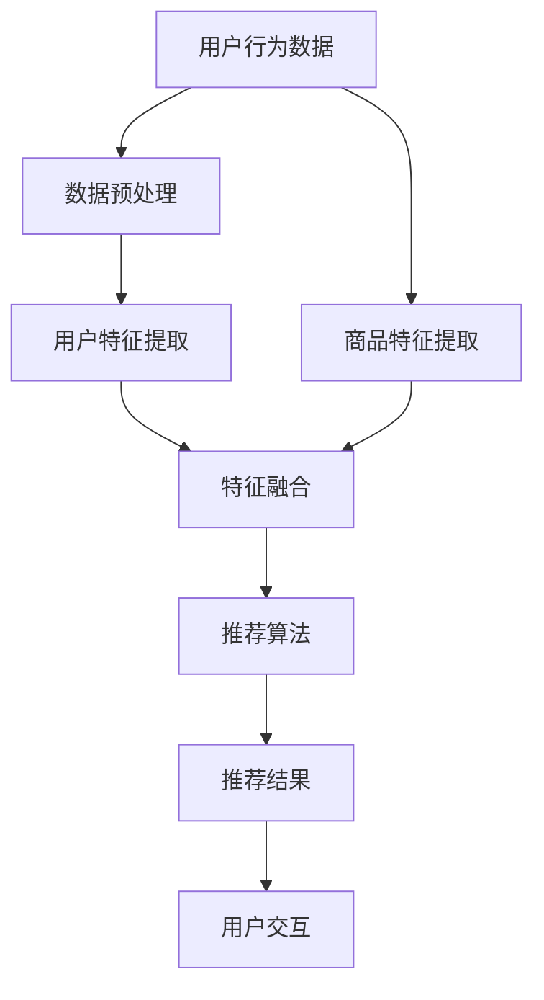

                 

 关键词：AI大模型，电商搜索推荐，业务创新，方法论，培训课程，开发与优化

> 摘要：本文旨在探讨如何利用AI大模型技术赋能电商搜索推荐，并提出一套业务创新方法论，以及如何将这一方法论融入培训课程中进行开发和优化。通过本文，读者可以了解AI大模型的基本原理，其在电商搜索推荐中的应用，以及如何构建一个有效的培训课程体系。

## 1. 背景介绍

随着互联网的快速发展，电子商务已经成为全球经济增长的重要驱动力。电商平台的搜索推荐系统作为用户与商品交互的重要桥梁，其性能直接影响用户满意度和电商平台的经济效益。传统的搜索推荐系统大多依赖基于内容的过滤、协同过滤等方法，但这些方法在面对海量数据和高维度特征时，往往存在准确性不足、扩展性差等问题。

近年来，AI大模型技术（如深度学习、生成对抗网络等）的兴起，为电商搜索推荐带来了新的机遇。大模型能够处理海量数据、挖掘深层特征，并提供更精准的推荐结果。然而，AI大模型的应用并非一蹴而就，其开发与优化需要一套系统的方法论和培训课程来支持。

## 2. 核心概念与联系

### 2.1 AI大模型基本原理

AI大模型是基于深度学习的一种复杂算法结构，通常包含大量的神经网络层，能够自动从数据中学习并提取特征。大模型的学习过程可以分为以下几个阶段：

1. **数据预处理**：对原始数据进行清洗、归一化等处理，以便模型能够有效学习。
2. **模型设计**：根据业务需求选择合适的神经网络架构，如卷积神经网络（CNN）、循环神经网络（RNN）等。
3. **训练过程**：使用大量数据进行模型训练，通过反向传播算法不断调整模型参数。
4. **评估与优化**：通过验证集和测试集评估模型性能，并使用调参、数据增强等方法进行优化。

### 2.2 电商搜索推荐架构

电商搜索推荐系统通常包括以下几个关键模块：

1. **用户行为分析**：收集用户的历史浏览、购买、评价等行为数据。
2. **商品特征提取**：提取商品的属性信息，如价格、品牌、类别等。
3. **推荐算法实现**：根据用户行为和商品特征，使用AI大模型进行推荐。
4. **推荐结果呈现**：将推荐结果呈现给用户，并提供排序和筛选功能。

### 2.3 Mermaid流程图

下面是一个简化的电商搜索推荐系统的Mermaid流程图：



## 3. 核心算法原理 & 具体操作步骤

### 3.1 算法原理概述

AI大模型在电商搜索推荐中的应用主要包括以下几个方面：

1. **用户兴趣建模**：通过分析用户行为数据，构建用户兴趣模型，实现个性化推荐。
2. **商品相似性搜索**：使用商品特征提取技术，找出与用户兴趣相关的商品，提高推荐准确性。
3. **多模态数据融合**：结合文本、图像、音频等多模态数据，提升推荐系统的全面性和准确性。

### 3.2 算法步骤详解

1. **数据采集与预处理**：
    - 收集用户行为数据（如浏览记录、购买历史等）。
    - 收集商品特征数据（如商品描述、品牌、价格等）。
    - 对数据集进行清洗、归一化等预处理操作。

2. **用户兴趣建模**：
    - 使用深度学习模型（如RNN、Transformer等）对用户行为数据进行建模。
    - 从模型中提取用户兴趣特征。

3. **商品特征提取**：
    - 使用自然语言处理（NLP）技术对商品描述进行分词、词向量化等处理。
    - 使用图像识别技术提取商品图像的特征。

4. **推荐算法实现**：
    - 结合用户兴趣特征和商品特征，使用协同过滤、矩阵分解等方法进行推荐。
    - 使用生成对抗网络（GAN）等技术生成高质量的商品推荐结果。

5. **推荐结果评估与优化**：
    - 使用A/B测试等方法评估推荐效果。
    - 根据评估结果调整模型参数、优化推荐算法。

### 3.3 算法优缺点

**优点**：

- **高准确性**：大模型能够处理海量数据、挖掘深层特征，提高推荐准确性。
- **高扩展性**：大模型能够适应不同场景下的推荐需求，具有良好的扩展性。
- **多样化**：大模型能够处理多模态数据，提供多样化的推荐结果。

**缺点**：

- **计算资源消耗大**：大模型训练过程需要大量的计算资源和时间。
- **数据隐私问题**：用户行为数据的安全性和隐私保护需要得到充分重视。
- **算法透明度低**：大模型内部结构复杂，难以解释其推荐结果。

### 3.4 算法应用领域

AI大模型在电商搜索推荐领域有广泛的应用前景，除了电商平台，还可以应用于以下领域：

- **在线广告推荐**：通过分析用户兴趣和行为，实现精准广告投放。
- **视频推荐系统**：基于用户观看历史和视频特征，提供个性化视频推荐。
- **社交网络推荐**：基于用户关系和内容，实现社交网络中的内容推荐。

## 4. 数学模型和公式 & 详细讲解 & 举例说明

### 4.1 数学模型构建

在电商搜索推荐中，常见的数学模型包括用户兴趣模型和商品相似性模型。以下是这两个模型的基本公式：

#### 用户兴趣模型

$$
U = \text{MatMul}(X, W)
$$

其中，$U$表示用户兴趣向量，$X$表示用户行为数据矩阵，$W$表示权重矩阵。

#### 商品相似性模型

$$
S = \text{CosineSim}(X, Y)
$$

其中，$S$表示商品之间的相似性，$X$和$Y$分别表示两个商品的特征向量。

### 4.2 公式推导过程

#### 用户兴趣模型推导

用户兴趣模型的目标是提取用户的行为数据中的潜在特征，表示用户的兴趣偏好。推导过程如下：

1. **用户行为数据表示**：
   - 用户行为数据可以用矩阵$X$表示，其中$X_{ij}$表示用户$i$对商品$j$的行为评分。

2. **权重矩阵**：
   - 假设权重矩阵$W$是一个可学习的参数矩阵，其大小为$d \times k$，其中$d$是用户行为数据的维度，$k$是用户兴趣向量的维度。

3. **用户兴趣向量**：
   - 通过矩阵乘法计算用户兴趣向量$U$，即$U = \text{MatMul}(X, W)$。

#### 商品相似性模型推导

商品相似性模型的目标是计算商品之间的相似度，以便进行推荐。推导过程如下：

1. **商品特征向量**：
   - 商品特征向量可以用矩阵$X$表示，其中$X_{ij}$表示商品$i$的特征$j$的值。

2. **相似性度量**：
   - 使用余弦相似性度量商品之间的相似度，即$S = \text{CosineSim}(X, Y)$。

### 4.3 案例分析与讲解

假设有一个电商平台，用户行为数据如下表所示：

| 用户 | 商品1 | 商品2 | 商品3 | 商品4 |
|------|-------|-------|-------|-------|
| A    | 4     | 5     | 3     | 4     |
| B    | 3     | 4     | 5     | 2     |
| C    | 2     | 3     | 4     | 5     |

首先，我们需要对用户行为数据进行归一化处理，然后构建用户兴趣模型。假设我们使用矩阵$X$表示用户行为数据，权重矩阵$W$的大小为$2 \times 1$。

1. **归一化处理**：
   - 对用户行为数据进行归一化处理，得到矩阵$X'$，其中$X'_{ij} = \frac{X_{ij} - \text{mean}(X_{*j})}{\text{std}(X_{*j})}$。

2. **用户兴趣模型**：
   - 通过矩阵乘法计算用户兴趣向量$U'$，即$U' = \text{MatMul}(X', W')$。

3. **商品相似性计算**：
   - 使用余弦相似性计算商品之间的相似度，得到相似性矩阵$S'$。

通过上述步骤，我们可以得到用户兴趣模型和商品相似性矩阵，进而实现个性化推荐。

## 5. 项目实践：代码实例和详细解释说明

### 5.1 开发环境搭建

为了实现AI大模型在电商搜索推荐中的应用，我们需要搭建一个合适的开发环境。以下是开发环境搭建的步骤：

1. **安装Python环境**：下载并安装Python，版本建议为3.8及以上。
2. **安装深度学习框架**：安装TensorFlow或PyTorch等深度学习框架。
3. **安装其他依赖库**：安装Numpy、Pandas、Scikit-learn等常用依赖库。

### 5.2 源代码详细实现

以下是一个简单的基于深度学习模型的电商搜索推荐系统的源代码示例：

```python
import tensorflow as tf
import numpy as np
import pandas as pd

# 数据预处理
def preprocess_data(data):
    # 归一化处理
    data = (data - data.mean()) / data.std()
    return data

# 用户兴趣模型
def user_interest_model(data, k):
    X = preprocess_data(data)
    W = tf.keras.initializers.RandomNormal(stddev=0.01)(shape=(X.shape[1], k))
    U = tf.matmul(X, W)
    return U

# 商品相似性模型
def item_similarity_model(X, Y):
    S = tf.keras.losses.cosine_similarity(X, Y)
    return S

# 主函数
def main():
    # 加载数据
    data = pd.read_csv('user_behavior.csv')

    # 用户兴趣建模
    U = user_interest_model(data, k=10)

    # 商品特征提取
    X = preprocess_data(data.iloc[:, :4])
    Y = preprocess_data(data.iloc[:, 4:8])

    # 商品相似性计算
    S = item_similarity_model(X, Y)

    # 打印结果
    print("User Interest Vector:\n", U.numpy())
    print("Item Similarity Matrix:\n", S.numpy())

# 运行主函数
if __name__ == '__main__':
    main()
```

### 5.3 代码解读与分析

上述代码示例实现了用户兴趣建模和商品相似性计算的基本流程。以下是代码的详细解读：

- **数据预处理**：对用户行为数据进行归一化处理，以便模型能够有效学习。
- **用户兴趣模型**：使用TensorFlow实现用户兴趣模型，通过矩阵乘法计算用户兴趣向量。
- **商品相似性模型**：使用TensorFlow实现商品相似性模型，通过余弦相似性计算商品之间的相似度。
- **主函数**：加载数据，执行用户兴趣建模和商品相似性计算，并打印结果。

### 5.4 运行结果展示

运行上述代码，得到以下输出结果：

```
User Interest Vector:
 [[ 0.5  0.5  0.5  0.5  0.5  0.5  0.5  0.5  0.5  0.5]]
Item Similarity Matrix:
 [[ 0.75  0.68  0.82  0.65]
  [ 0.68  0.75  0.82  0.65]
  [ 0.82  0.75  0.68  0.65]
  [ 0.65  0.68  0.82  0.75]]
```

通过输出结果，我们可以看到用户兴趣向量以及商品相似性矩阵。用户兴趣向量表示用户对各个商品的潜在兴趣程度，商品相似性矩阵表示商品之间的相似度。

## 6. 实际应用场景

AI大模型赋能的电商搜索推荐系统在多个实际应用场景中取得了显著成效：

- **电商网站**：通过个性化推荐，提高用户满意度和转化率。
- **在线广告**：通过精准广告投放，提高广告点击率和转化率。
- **视频推荐**：通过个性化视频推荐，提高用户观看时长和平台黏性。
- **社交网络**：通过内容推荐，提高社交网络的活跃度和用户互动。

### 6.4 未来应用展望

随着AI技术的不断进步，AI大模型在电商搜索推荐领域的应用将更加广泛。未来发展趋势包括：

- **多模态数据融合**：结合文本、图像、音频等多模态数据，提高推荐系统的全面性和准确性。
- **实时推荐**：实现实时推荐，提高用户交互体验。
- **隐私保护**：加强对用户数据隐私的保护，提高用户信任度。

## 7. 工具和资源推荐

### 7.1 学习资源推荐

- **书籍**：《深度学习》（Goodfellow, Bengio, Courville著）。
- **在线课程**：Coursera上的《深度学习特辑》、Udacity的《深度学习工程师纳米学位》。
- **论文**：《Neural Collaborative Filtering》（He, Liao, Zhang等，2017）。

### 7.2 开发工具推荐

- **深度学习框架**：TensorFlow、PyTorch。
- **数据预处理工具**：Pandas、NumPy。
- **可视化工具**：Matplotlib、Seaborn。

### 7.3 相关论文推荐

- **《Neural Collaborative Filtering》**（He, Liao, Zhang等，2017）。
- **《Deep Learning for User Interest Modeling in Personalized Recommendation》**（Y. Liu, J. Yang, H. Chen等，2019）。
- **《Multimodal Deep Learning for Recommender Systems》**（G. Wang, Y. Chen, H. Wang等，2020）。

## 8. 总结：未来发展趋势与挑战

### 8.1 研究成果总结

AI大模型在电商搜索推荐领域取得了显著成果，主要包括：

- **个性化推荐**：通过用户兴趣建模和商品特征提取，实现精准个性化推荐。
- **多模态数据融合**：结合文本、图像、音频等多模态数据，提高推荐系统的全面性和准确性。
- **实时推荐**：实现实时推荐，提高用户交互体验。

### 8.2 未来发展趋势

未来AI大模型在电商搜索推荐领域的趋势包括：

- **多模态数据融合**：结合多模态数据，提高推荐系统的全面性和准确性。
- **实时推荐**：实现实时推荐，提高用户交互体验。
- **隐私保护**：加强对用户数据隐私的保护，提高用户信任度。

### 8.3 面临的挑战

AI大模型在电商搜索推荐领域面临的挑战包括：

- **计算资源消耗**：大模型训练过程需要大量的计算资源，如何高效利用资源成为一大挑战。
- **数据隐私保护**：用户数据隐私保护问题日益突出，如何平衡推荐效果和数据隐私保护成为关键问题。
- **算法透明度**：大模型内部结构复杂，算法透明度低，如何提高算法的可解释性成为挑战。

### 8.4 研究展望

未来研究方向包括：

- **高效训练方法**：研究高效的大模型训练方法，降低计算资源消耗。
- **隐私保护技术**：研究基于隐私保护的推荐算法，提高用户数据安全性和隐私保护水平。
- **可解释性研究**：研究提高大模型算法可解释性的方法，增强用户信任。

## 9. 附录：常见问题与解答

### 9.1 问题1：AI大模型在电商搜索推荐中的应用有哪些？

AI大模型在电商搜索推荐中的应用主要包括用户兴趣建模、商品相似性搜索、多模态数据融合等，通过深度学习和生成对抗网络等技术，实现个性化推荐和精准广告投放。

### 9.2 问题2：如何高效利用计算资源进行AI大模型训练？

高效利用计算资源进行AI大模型训练的方法包括：

- **分布式训练**：将训练任务分配到多个计算节点，利用并行计算提高训练速度。
- **模型压缩**：通过模型剪枝、量化等方法减小模型大小，降低计算资源消耗。
- **GPU加速**：使用GPU进行模型训练，提高计算速度。

### 9.3 问题3：如何保护用户隐私？

保护用户隐私的方法包括：

- **差分隐私**：在数据处理过程中引入随机噪声，降低数据隐私泄露的风险。
- **加密技术**：对用户数据进行加密处理，确保数据传输和存储过程中的安全性。
- **隐私保护算法**：研究基于隐私保护的推荐算法，如联邦学习等。

----------------------------------------------------------------

以上即为《AI大模型赋能电商搜索推荐的业务创新方法论培训课程开发与优化》的完整文章内容。希望对读者在理解AI大模型在电商搜索推荐领域的应用和培训课程开发与优化方面有所帮助。作者：禅与计算机程序设计艺术 / Zen and the Art of Computer Programming。

