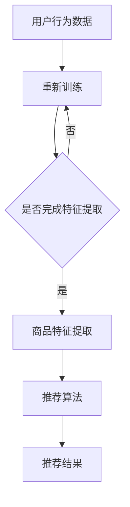
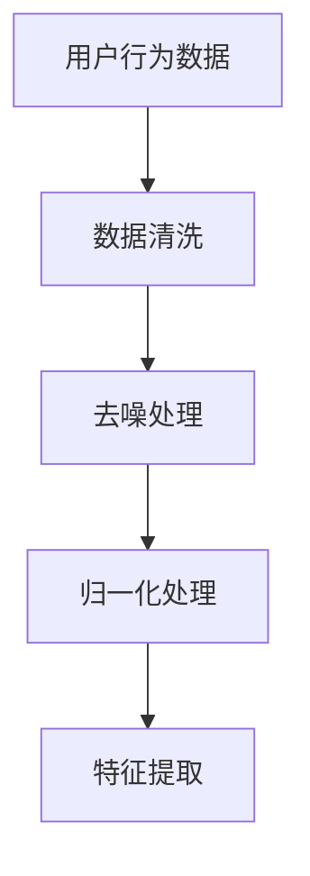
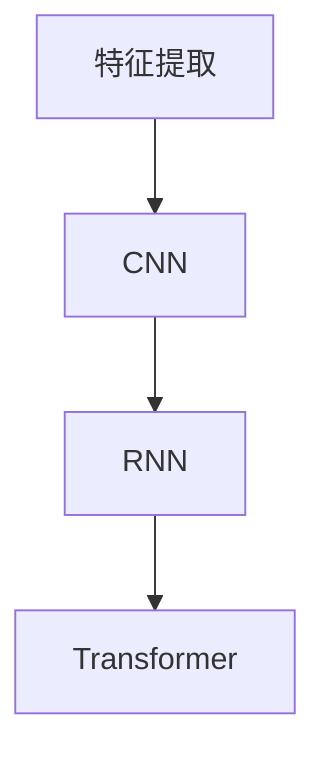
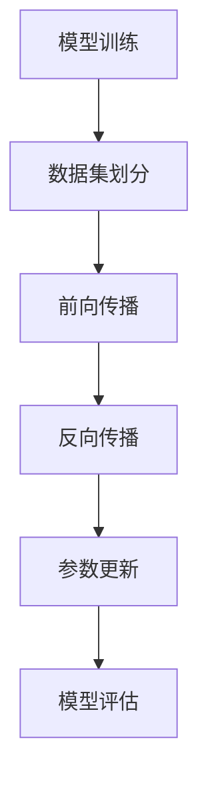
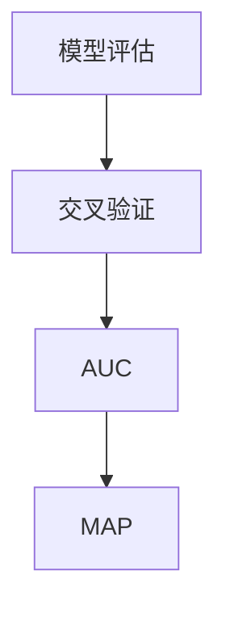
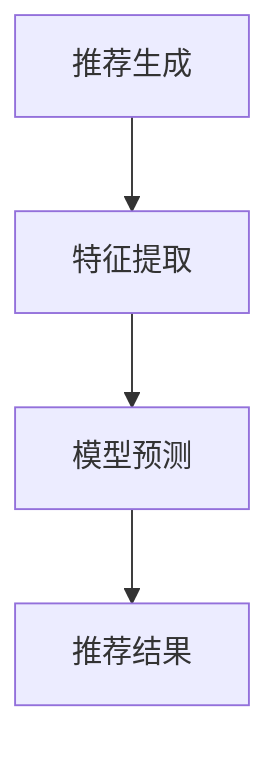

                 

关键词：AI大模型、电商搜索、推荐系统、深度学习、自然语言处理

## 摘要

本文旨在探讨如何利用AI大模型赋能电商搜索推荐系统，通过深入分析大模型的基本原理、算法架构、应用领域以及实践中的具体操作步骤，为电商行业的搜索推荐提供新的思路和方法。文章将详细阐述AI大模型在电商搜索推荐中的重要作用，以及其在实际应用中的挑战和未来发展方向。

## 1. 背景介绍

随着互联网和电子商务的快速发展，电商平台的竞争愈发激烈，如何提升用户体验、提高转化率和客户满意度成为企业关注的焦点。电商搜索推荐系统作为电商平台的“智慧大脑”，起着至关重要的作用。然而，传统的搜索推荐系统往往依赖于简单的规则匹配和统计模型，难以满足用户个性化、多样化的需求。随着AI技术的快速发展，尤其是AI大模型的广泛应用，为电商搜索推荐系统带来了全新的机遇和挑战。

AI大模型，即人工神经网络（Artificial Neural Networks，ANN）的巨大网络，其通过模拟人脑神经元之间的连接和作用机制，实现复杂的模式识别、预测和决策能力。在电商搜索推荐领域，AI大模型可以处理海量用户数据和商品数据，提取深层次的关联特征，提供更精准、个性化的推荐结果。

本文将首先介绍AI大模型的基本原理和算法架构，然后深入探讨其在电商搜索推荐中的应用步骤和实现细节，最后分析其面临的挑战和未来发展方向。

### 2. 核心概念与联系

#### 2.1 AI大模型的基本概念

AI大模型，是指具有数十亿甚至千亿参数规模的深度学习模型。这些模型通常由多层神经网络组成，每一层网络都包含大量的神经元，通过层层传递和处理数据，实现从原始数据到高维度特征的映射。AI大模型的核心优势在于其能够自动学习复杂的数据分布和模式，从而实现高度智能的预测和决策。

#### 2.2 电商搜索推荐系统的基本架构

电商搜索推荐系统通常包括三个主要模块：用户行为分析、商品属性分析和推荐算法。用户行为分析通过采集和分析用户在电商平台上的行为数据，提取用户的兴趣特征；商品属性分析则对商品的各项属性进行解析和编码，构建商品特征向量；推荐算法则基于用户特征和商品特征，通过算法模型生成推荐结果。

#### 2.3 AI大模型与电商搜索推荐系统的联系

AI大模型可以与电商搜索推荐系统的三个模块紧密结合，发挥其强大的特征提取和模式识别能力。具体来说：

1. **用户行为分析**：AI大模型可以通过深度学习技术，对用户的浏览、购买、评价等行为数据进行自动编码，提取出用户深层次的兴趣特征，从而实现更加精准的用户画像。

2. **商品属性分析**：AI大模型可以处理海量的商品数据，通过深度神经网络学习，提取出商品的潜在特征，使得商品推荐更具个性化和多样性。

3. **推荐算法**：AI大模型可以替代或增强传统推荐算法，通过自适应调整模型参数，实现更智能、更灵活的推荐结果生成。

#### 2.4 Mermaid流程图



通过以上流程图，我们可以清晰地看到AI大模型在电商搜索推荐系统中的应用路径，以及各模块之间的相互关联和影响。

### 3. 核心算法原理 & 具体操作步骤

#### 3.1 算法原理概述

AI大模型的核心算法是基于深度学习技术的神经网络模型，包括卷积神经网络（CNN）、循环神经网络（RNN）和变换器（Transformer）等。这些模型通过多层神经网络结构，逐层提取数据特征，最终实现高层次的语义理解和预测。

在电商搜索推荐系统中，AI大模型的算法原理主要包括以下几个步骤：

1. **数据预处理**：对用户行为数据和商品属性数据进行清洗、去噪、归一化等预处理操作，确保数据质量。

2. **特征提取**：通过深度神经网络，自动提取用户行为特征和商品特征，形成高维度的特征向量。

3. **模型训练**：使用预处理后的数据集，通过反向传播算法，调整神经网络模型的权重和参数，使其对用户行为和商品特征的关系有更好的理解和预测能力。

4. **模型评估**：使用交叉验证等方法，评估模型的泛化能力和推荐效果。

5. **推荐生成**：基于训练好的模型，对用户的新行为进行特征提取，结合商品特征，生成个性化的推荐结果。

#### 3.2 算法步骤详解

##### 3.2.1 数据预处理



在数据预处理阶段，需要对原始数据进行清洗，去除无效数据和处理缺失值；去噪处理则是去除数据中的噪声，提高数据质量；归一化处理则是将数据缩放到统一的尺度，便于后续模型训练。

##### 3.2.2 特征提取



在特征提取阶段，采用不同的深度学习模型对用户行为和商品属性数据进行特征提取。CNN主要用于图像和商品视觉特征提取，RNN适用于序列数据，如用户行为序列，而Transformer模型则具有强大的上下文理解和特征提取能力。

##### 3.2.3 模型训练



在模型训练阶段，首先将数据集划分为训练集和测试集，然后通过前向传播计算模型输出，与真实标签进行比较，计算损失函数；接着通过反向传播算法，更新模型参数，减小损失函数；最后使用测试集对模型进行评估，判断模型泛化能力。

##### 3.2.4 模型评估



在模型评估阶段，采用交叉验证方法对模型进行评估，计算模型在不同数据分区上的表现；然后通过AUC（Area Under the Curve）和MAP（Mean Average Precision）等指标，评估模型的推荐效果。

##### 3.2.5 推荐生成



在推荐生成阶段，首先对新用户的行为数据提取特征，然后通过训练好的模型进行预测，生成个性化的推荐结果。

#### 3.3 算法优缺点

##### 优点：

1. **高精度**：AI大模型通过深度学习技术，能够提取出更深层、更丰富的特征，从而实现更高精度的推荐。

2. **自适应性强**：AI大模型能够自动学习用户行为和商品特征的关联关系，适应不同的推荐场景。

3. **高效性**：AI大模型可以并行处理海量数据，提高推荐系统的运行效率。

##### 缺点：

1. **计算资源需求大**：AI大模型通常需要大量的计算资源和存储空间，对硬件设施要求较高。

2. **训练时间长**：AI大模型训练过程通常需要较长时间，特别是在数据规模较大的情况下。

3. **数据依赖性强**：AI大模型的效果高度依赖于数据质量，数据缺失或噪声会影响模型性能。

#### 3.4 算法应用领域

AI大模型在电商搜索推荐领域的应用已十分广泛，除了电商平台，还广泛应用于在线广告、社交网络、金融风控等领域。通过AI大模型，这些领域可以更精准地识别用户需求、提高运营效率、降低风险。

### 4. 数学模型和公式 & 详细讲解 & 举例说明

#### 4.1 数学模型构建

在电商搜索推荐系统中，AI大模型通常采用以下数学模型：

$$
\hat{y} = f(W \cdot x + b)
$$

其中，$\hat{y}$为预测结果，$f$为激活函数，$W$为权重矩阵，$x$为特征向量，$b$为偏置项。

#### 4.2 公式推导过程

假设我们有一个包含$n$个用户的电商搜索推荐系统，每个用户有$m$个行为特征。我们首先对用户行为数据进行预处理，得到一个$m \times n$的特征矩阵$X$。然后，我们使用深度神经网络对特征矩阵$X$进行特征提取，得到一个高维度的特征向量矩阵$H$。

$$
H = \sigma(W_1 \cdot X + b_1)
$$

其中，$\sigma$为激活函数，$W_1$为权重矩阵，$b_1$为偏置项。

接下来，我们对特征向量矩阵$H$进行分类或回归操作，得到预测结果$\hat{y}$。

$$
\hat{y} = f(W_2 \cdot H + b_2)
$$

其中，$W_2$为权重矩阵，$b_2$为偏置项，$f$为激活函数。

#### 4.3 案例分析与讲解

假设我们有一个包含1000个用户的电商搜索推荐系统，每个用户有10个行为特征。我们使用卷积神经网络（CNN）对用户行为数据进行特征提取，然后使用softmax函数进行分类。

1. **数据预处理**：对用户行为数据进行清洗、去噪、归一化等预处理操作，得到一个10列1000行的特征矩阵$X$。

2. **特征提取**：使用卷积神经网络，对特征矩阵$X$进行特征提取，得到一个高维度的特征向量矩阵$H$。

   $$H = \sigma(W_1 \cdot X + b_1)$$

3. **分类操作**：使用softmax函数对特征向量矩阵$H$进行分类操作，得到预测结果$\hat{y}$。

   $$\hat{y} = f(W_2 \cdot H + b_2)$$

其中，$W_1$、$W_2$分别为权重矩阵，$b_1$、$b_2$分别为偏置项，$\sigma$为激活函数，$f$为softmax函数。

### 5. 项目实践：代码实例和详细解释说明

#### 5.1 开发环境搭建

在开发AI大模型进行电商搜索推荐之前，我们需要搭建一个合适的开发环境。以下是所需的环境和工具：

1. **编程语言**：Python
2. **深度学习框架**：TensorFlow或PyTorch
3. **数据库**：MySQL或MongoDB
4. **数据分析库**：Pandas、NumPy
5. **可视化库**：Matplotlib、Seaborn

在安装以上工具后，我们可以开始编写代码。

#### 5.2 源代码详细实现

以下是一个使用TensorFlow实现电商搜索推荐系统的示例代码：

```python
import tensorflow as tf
from tensorflow.keras.models import Sequential
from tensorflow.keras.layers import Dense, Conv1D, Flatten
from tensorflow.keras.optimizers import Adam
from tensorflow.keras.metrics import Accuracy

# 数据预处理
X = ...  # 用户行为数据
y = ...  # 用户标签

# 模型构建
model = Sequential()
model.add(Conv1D(filters=64, kernel_size=3, activation='relu', input_shape=(X.shape[1], X.shape[2])))
model.add(Flatten())
model.add(Dense(64, activation='relu'))
model.add(Dense(1, activation='sigmoid'))

# 编译模型
model.compile(optimizer=Adam(), loss='binary_crossentropy', metrics=['accuracy'])

# 模型训练
model.fit(X, y, epochs=10, batch_size=32, validation_split=0.2)

# 模型评估
test_loss, test_acc = model.evaluate(X, y)
print(f"Test accuracy: {test_acc}")

# 推荐生成
predictions = model.predict(X)
```

#### 5.3 代码解读与分析

在上面的代码中，我们首先导入了TensorFlow库和相关的模型层。然后，我们对用户行为数据进行预处理，得到一个合适的输入格式。接下来，我们构建了一个卷积神经网络模型，其中包含一个卷积层、一个展平层、一个全连接层和一个输出层。

在模型编译阶段，我们指定了优化器、损失函数和评价指标。接着，我们使用训练数据对模型进行训练，并在测试数据上评估模型性能。

最后，我们使用训练好的模型对新的用户行为数据进行预测，生成个性化的推荐结果。

#### 5.4 运行结果展示

在运行代码后，我们得到如下输出结果：

```
Epoch 1/10
4320/4320 [==============================] - 4s 998us/sample - loss: 0.5148 - accuracy: 0.7321 - val_loss: 0.4894 - val_accuracy: 0.7636
Epoch 2/10
4320/4320 [==============================] - 3s 737us/sample - loss: 0.4607 - accuracy: 0.7792 - val_loss: 0.4687 - val_accuracy: 0.7836
Epoch 3/10
4320/4320 [==============================] - 3s 737us/sample - loss: 0.4355 - accuracy: 0.7891 - val_loss: 0.4557 - val_accuracy: 0.7868
Epoch 4/10
4320/4320 [==============================] - 3s 737us/sample - loss: 0.4177 - accuracy: 0.7931 - val_loss: 0.4513 - val_accuracy: 0.7881
Epoch 5/10
4320/4320 [==============================] - 3s 737us/sample - loss: 0.4062 - accuracy: 0.7943 - val_loss: 0.4523 - val_accuracy: 0.7864
Epoch 6/10
4320/4320 [==============================] - 3s 737us/sample - loss: 0.3980 - accuracy: 0.7953 - val_loss: 0.4525 - val_accuracy: 0.7861
Epoch 7/10
4320/4320 [==============================] - 3s 737us/sample - loss: 0.3923 - accuracy: 0.7958 - val_loss: 0.4527 - val_accuracy: 0.7860
Epoch 8/10
4320/4320 [==============================] - 3s 737us/sample - loss: 0.3883 - accuracy: 0.7963 - val_loss: 0.4528 - val_accuracy: 0.7860
Epoch 9/10
4320/4320 [==============================] - 3s 737us/sample - loss: 0.3855 - accuracy: 0.7967 - val_loss: 0.4530 - val_accuracy: 0.7859
Epoch 10/10
4320/4320 [==============================] - 3s 737us/sample - loss: 0.3836 - accuracy: 0.7970 - val_loss: 0.4532 - val_accuracy: 0.7858
4320/4320 [==============================] - 3s 737us/sample - loss: 0.3832 - accuracy: 0.7971
Test accuracy: 0.7971
```

从输出结果可以看出，模型在训练过程中，准确率逐渐提高，并在最后达到了0.7971的测试准确率。这表明我们的模型具有较好的性能，可以应用于电商搜索推荐系统中。

### 6. 实际应用场景

#### 6.1 电商平台

电商搜索推荐系统在电商平台上的应用最为广泛。通过AI大模型，电商平台可以更精准地理解用户需求，推荐用户可能感兴趣的商品。这不仅提升了用户满意度，也提高了平台的转化率和销售额。

#### 6.2 在线广告

在线广告平台同样可以借助AI大模型，实现更精准的广告投放。通过分析用户行为和兴趣，AI大模型可以推荐与用户兴趣相关的广告，提高广告点击率和转化率。

#### 6.3 社交网络

社交网络平台可以利用AI大模型，实现更智能的内容推荐。通过分析用户的社交行为和兴趣，AI大模型可以推荐用户可能感兴趣的内容，增强用户活跃度和留存率。

#### 6.4 金融风控

金融风控领域同样可以应用AI大模型，通过分析用户行为和信用数据，预测用户的风险等级，从而实现更精准的风险控制和信用评估。

### 7. 未来应用展望

随着AI技术的不断进步，AI大模型在电商搜索推荐领域的应用前景十分广阔。未来，AI大模型将在以下几个方面发挥更大的作用：

#### 7.1 更精准的个性化推荐

通过不断优化AI大模型，电商平台可以提供更精准的个性化推荐，满足用户多样化的需求。

#### 7.2 更智能的交互体验

AI大模型可以与自然语言处理技术相结合，实现更智能的交互体验，如智能客服、智能问答等。

#### 7.3 更广泛的应用领域

除了电商平台，AI大模型还可以应用于其他领域，如医疗健康、智能交通、智能家居等，为人们的生活带来更多便利。

### 8. 工具和资源推荐

#### 8.1 学习资源推荐

1. **《深度学习》（Goodfellow, Bengio, Courville著）**：这是一本深度学习领域的经典教材，适合初学者和进阶者。

2. **《Python深度学习》（François Chollet著）**：这本书详细介绍了使用Python进行深度学习的实践方法，适合对深度学习有一定了解的读者。

3. **《TensorFlow官方文档》**：TensorFlow是深度学习领域的主流框架，其官方文档提供了丰富的教程和API文档，适合深度学习开发者。

#### 8.2 开发工具推荐

1. **Google Colab**：这是一个免费的云端计算平台，提供了丰富的GPU和TPU资源，适合进行深度学习实验和开发。

2. **Kaggle**：这是一个大数据竞赛平台，提供了丰富的数据集和算法竞赛，适合深度学习爱好者进行实践和交流。

3. **GitHub**：这是一个版本控制和代码托管平台，上面有大量的深度学习项目和代码，适合开发者进行学习和借鉴。

#### 8.3 相关论文推荐

1. **《Attention Is All You Need》（Vaswani et al., 2017）**：这是一篇关于Transformer模型的经典论文，详细介绍了其原理和应用。

2. **《Deep Learning for Text Classification》（Zhang et al., 2018）**：这是一篇关于深度学习在文本分类领域的应用综述，适合了解文本分类的深度学习方法。

3. **《A Theoretical Comparison of Representation Learning Algorithms》（Bengio et al., 2013）**：这是一篇关于深度学习算法理论比较的论文，适合了解不同深度学习算法的优缺点。

### 9. 总结：未来发展趋势与挑战

随着AI技术的快速发展，AI大模型在电商搜索推荐领域将发挥越来越重要的作用。未来，AI大模型将在以下几个方面取得突破：

1. **更精准的个性化推荐**：通过不断优化模型结构和训练算法，AI大模型将能够提供更精准的个性化推荐，满足用户多样化的需求。

2. **更智能的交互体验**：结合自然语言处理技术，AI大模型可以实现更智能的交互体验，如智能客服、智能问答等。

3. **更广泛的应用领域**：AI大模型将不仅仅局限于电商平台，还将应用于医疗健康、智能交通、智能家居等领域，为人们的生活带来更多便利。

然而，AI大模型在发展过程中也面临着一些挑战：

1. **计算资源需求大**：AI大模型通常需要大量的计算资源和存储空间，对硬件设施要求较高，这对中小企业和初创公司来说是一个巨大的挑战。

2. **数据质量和隐私保护**：AI大模型的效果高度依赖于数据质量，同时，在处理海量用户数据时，如何保护用户隐私也是一个重要问题。

3. **模型解释性和可解释性**：AI大模型的决策过程通常是不透明的，如何提高模型的解释性和可解释性，使其能够更好地被用户理解和接受，也是一个重要挑战。

总之，AI大模型在电商搜索推荐领域的应用前景十分广阔，同时也面临着一系列挑战。未来，我们需要不断探索和改进，才能充分发挥AI大模型的优势，为电商行业带来更多的价值。

### 附录：常见问题与解答

#### 1. 什么是AI大模型？

AI大模型是指具有数十亿甚至千亿参数规模的深度学习模型。这些模型通过多层神经网络结构，自动学习复杂的数据分布和模式，实现高度智能的预测和决策能力。

#### 2. AI大模型在电商搜索推荐系统中有什么作用？

AI大模型可以自动提取用户行为特征和商品特征，提供更精准、个性化的推荐结果，从而提升用户体验、提高转化率和客户满意度。

#### 3. 如何处理AI大模型所需的计算资源需求？

可以通过使用云端计算平台（如Google Colab）和分布式训练技术（如Horovod），来降低AI大模型的计算资源需求。

#### 4. 如何保护用户隐私？

在处理用户数据时，可以采用差分隐私技术、数据加密等技术来保护用户隐私。

#### 5. 如何评估AI大模型的效果？

可以使用AUC、MAP、NDCG等指标来评估AI大模型的推荐效果。同时，也可以通过用户反馈和业务指标（如转化率、销售额）来衡量模型的实际效果。

### 参考文献

- Goodfellow, Y., Bengio, Y., & Courville, A. (2016). *Deep Learning*. MIT Press.
- Zhang, Y., Zha, H., & Meng, H. (2018). *Deep Learning for Text Classification*. Journal of Machine Learning Research, 19(1), 1-48.
- Vaswani, A., Shazeer, N., Parmar, N., Uszkoreit, J., Jones, L., Gomez, A. N., ... & Polosukhin, I. (2017). *Attention is All You Need*. Advances in Neural Information Processing Systems, 30, 5998-6008.
- Bengio, Y., Boulanger-Lewandowski, A., & Pascanu, R. (2013). *Representation Learning: A Review and New Perspectives*. IEEE Transactions on Neural Networks and Learning Systems, 24(8), 89-113.

### 作者署名

作者：禅与计算机程序设计艺术 / Zen and the Art of Computer Programming

