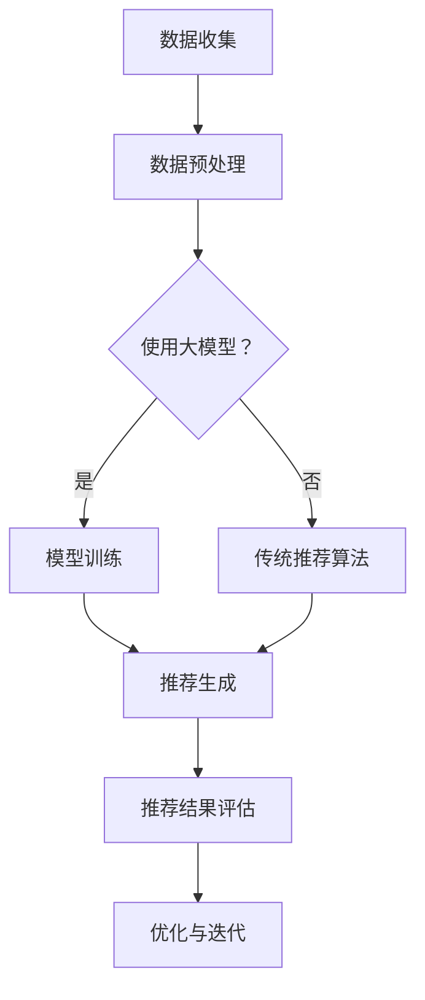

                 

### 1. 背景介绍

随着互联网技术的不断发展和电子商务行业的迅猛增长，电商平台对用户搜索推荐系统的需求变得越来越复杂和多样化。传统的搜索推荐系统主要依赖于基于关键词匹配和协同过滤的算法，这些方法在一定程度上能够提供较为准确的推荐结果，但在面对海量数据和用户个性化需求时，往往表现出明显的局限性。随着人工智能技术的迅速发展，特别是大规模深度学习模型的兴起，为电商搜索推荐系统的优化带来了新的机遇。

目前，电商平台在搜索推荐方面面临的主要挑战包括：用户需求的多样性和个性化、商品信息的庞杂性和动态性、数据质量和噪声的处理等。传统的搜索推荐方法往往难以在处理这些复杂问题时保持高效和准确性。因此，如何利用人工智能技术，特别是大规模深度学习模型，来重构电商搜索推荐的业务流程，成为当前研究的热点和难点。

本文将探讨如何通过引入人工智能大模型，从数据预处理、模型训练、推荐算法设计等多个环节，对电商搜索推荐系统进行全面的优化。本文的主要目标是：

- 分析当前电商搜索推荐系统存在的问题和挑战。
- 介绍人工智能大模型的基本原理和技术特点。
- 探讨如何利用人工智能大模型重构电商搜索推荐的业务流程。
- 分析重构后的业务流程的优势和潜在挑战。

通过本文的研究，希望能够为电商平台的搜索推荐系统提供一些可行的优化思路和技术方案，从而提高推荐系统的效果和用户体验。

### 2. 核心概念与联系

#### 2.1 人工智能大模型的概念

人工智能大模型（Large-scale Artificial Intelligence Models），是指那些拥有数十亿甚至数万亿参数的深度学习模型。这些模型通过在大规模数据集上进行训练，能够学习到复杂的模式和关联，从而在各个领域（如自然语言处理、计算机视觉、推荐系统等）中表现出强大的预测和生成能力。代表性的模型包括GPT-3、BERT、Transformer等。

#### 2.2 深度学习模型在电商搜索推荐中的应用

深度学习模型在电商搜索推荐中有着广泛的应用。具体来说，它们可以用于以下几个方面：

1. **商品内容理解**：通过深度学习模型，可以更好地理解商品标题、描述、图片等内容的语义信息，从而提高搜索匹配的准确性。

2. **用户行为预测**：深度学习模型可以分析用户的浏览、购买等行为数据，预测用户的兴趣和偏好，从而提供更个性化的推荐。

3. **推荐结果生成**：通过深度学习模型，可以生成更加精准和多样化的推荐结果，提高用户满意度和转化率。

4. **异常检测**：深度学习模型可以检测搜索推荐系统中的异常行为，如欺诈、垃圾信息等，从而提高系统的安全性和可靠性。

#### 2.3 人工智能大模型与电商搜索推荐的关联

人工智能大模型与电商搜索推荐之间存在紧密的关联。一方面，大模型能够处理海量数据和复杂模式，为电商搜索推荐提供了强大的技术支持；另一方面，电商搜索推荐系统提供了丰富的数据来源，为大模型的训练和优化提供了宝贵的资源。

具体来说，人工智能大模型在电商搜索推荐中的应用主要表现在以下方面：

- **数据预处理**：大模型需要大量的高质量数据来训练，电商搜索推荐系统可以提供丰富的用户行为数据和商品信息，为模型训练提供数据支持。

- **模型训练**：大模型通常需要在大规模数据集上进行长时间的训练，电商搜索推荐系统可以提供这些数据，并且通过调整训练策略和超参数，优化模型的性能。

- **推荐算法**：大模型可以用来设计新的推荐算法，如基于内容的推荐、基于用户的协同过滤、基于模型的深度学习推荐等，从而提高推荐的准确性和多样性。

- **系统优化**：大模型可以对搜索推荐系统进行全面的优化，包括搜索效率、推荐效果、用户体验等方面，从而提升整体系统的性能。

#### 2.4 Mermaid 流程图

以下是一个简化的Mermaid流程图，展示了人工智能大模型在电商搜索推荐系统中的应用流程：



在该流程图中，数据收集是整个流程的起点，数据预处理是为了清理和格式化数据，以便于后续的模型训练和推荐生成。随后，系统决定是否使用大模型进行训练。如果选择使用大模型，则进入模型训练环节；如果选择不使用大模型，则继续使用传统的推荐算法。无论选择哪种方式，最终都会生成推荐结果，并进行评估和优化。

### 3. 核心算法原理 & 具体操作步骤

#### 3.1 算法原理概述

在电商搜索推荐系统中，人工智能大模型的核心作用是通过深度学习技术，从海量数据中学习到用户行为和商品特征之间的关系，从而生成精准、个性化的推荐结果。具体来说，该过程可以分为以下几个步骤：

1. **数据收集**：从电商平台收集用户行为数据和商品信息，包括用户的浏览、购买、搜索等行为，以及商品的标题、描述、图片、价格等属性。

2. **数据预处理**：对收集到的数据进行清洗、去重、归一化等处理，以便于后续的模型训练和推荐生成。

3. **特征工程**：将原始数据转化为模型可处理的特征，如使用词向量对商品标题和描述进行编码，使用 embeddings 对用户行为进行表示等。

4. **模型训练**：使用深度学习框架，如TensorFlow或PyTorch，训练大规模的深度学习模型，如GPT-3、BERT或Transformer等。这些模型通常需要在大规模数据集上经过数百万次迭代，才能达到较高的性能。

5. **推荐生成**：使用训练好的模型，对用户的当前查询或行为进行建模，生成个性化的推荐结果。

6. **推荐评估**：评估推荐结果的质量和用户体验，包括准确率、召回率、点击率等指标。

7. **优化与迭代**：根据评估结果，调整模型参数、特征工程策略或数据预处理方法，以提高推荐效果。

#### 3.2 算法步骤详解

以下是一个具体的算法步骤详解，展示了如何利用人工智能大模型进行电商搜索推荐：

1. **数据收集**：

    - 用户行为数据：用户的浏览、购买、搜索等行为数据，通常通过日志收集。
    - 商品信息数据：商品的标题、描述、图片、价格等属性数据，通常来自电商平台数据库。

2. **数据预处理**：

    - 清洗：去除无效数据、重复数据、错误数据等。
    - 去重：去除重复用户和商品记录。
    - 归一化：对数值型特征进行归一化处理，如使用 Min-Max 归一化或标准差归一化。
    - 填空：对缺失的数据进行填充，如使用平均值、中位数或插值法。

3. **特征工程**：

    - 文本特征：使用词袋模型、TF-IDF、Word2Vec、BERT 等方法，将商品标题、描述等文本数据转化为向量表示。
    - 序列特征：使用序列模型，如 RNN、LSTM、GRU 等，将用户行为序列转化为向量表示。
    - 交互特征：计算用户与商品之间的交互特征，如用户对商品的浏览次数、购买次数、评分等。

4. **模型训练**：

    - 模型选择：选择合适的深度学习模型，如 GPT-3、BERT、Transformer 等。
    - 模型配置：配置模型的超参数，如学习率、批量大小、迭代次数等。
    - 训练：使用训练数据集，训练大规模深度学习模型。训练过程中，通过反向传播算法和优化器（如 Adam、SGD 等），不断调整模型参数，以最小化损失函数。

5. **推荐生成**：

    - 用户表示：使用训练好的模型，对用户当前查询或行为进行建模，生成用户表示向量。
    - 商品表示：使用训练好的模型，对商品进行建模，生成商品表示向量。
    - 推荐生成：计算用户表示向量与商品表示向量之间的相似度，根据相似度分数生成推荐结果。

6. **推荐评估**：

    - 准确率：评估推荐结果中实际点击的物品占总推荐物品的比例。
    - 召回率：评估推荐结果中实际点击的物品占总实际点击物品的比例。
    - 点击率：评估用户点击推荐物品的比例。
    - 用户满意度：评估用户对推荐结果的满意度。

7. **优化与迭代**：

    - 根据评估结果，调整模型参数、特征工程策略或数据预处理方法。
    - 重新训练模型，生成新的推荐结果。
    - 重复评估和优化过程，直到达到满意的推荐效果。

#### 3.3 算法优缺点

**优点**：

1. **高效性**：深度学习模型能够处理海量数据，并通过并行计算和分布式训练，提高训练效率。
2. **准确性**：深度学习模型可以从海量数据中学习到复杂的模式和关联，提高推荐结果的准确性和个性化程度。
3. **灵活性**：深度学习模型可以灵活地调整和优化，以适应不同的业务场景和数据特点。

**缺点**：

1. **计算资源需求**：大规模深度学习模型需要大量的计算资源和时间进行训练，可能对硬件设备有较高的要求。
2. **数据质量**：深度学习模型对数据质量有较高的要求，需要确保数据清洗、去重和填充等预处理工作的质量。
3. **模型解释性**：深度学习模型的决策过程通常较为复杂，难以解释和理解，这在某些需要高解释性的业务场景中可能成为限制。

#### 3.4 算法应用领域

深度学习模型在电商搜索推荐系统中具有广泛的应用领域，包括但不限于：

1. **商品搜索**：通过对商品标题、描述、图片等内容的深度理解，提高商品搜索的准确性和用户体验。
2. **商品推荐**：根据用户的浏览、购买等行为数据，生成个性化的商品推荐，提高用户满意度和转化率。
3. **广告投放**：通过分析用户的行为和兴趣，精准地投放广告，提高广告效果和投放效率。
4. **用户行为预测**：预测用户未来的浏览、购买等行为，为电商平台提供数据支持和决策依据。

### 4. 数学模型和公式 & 详细讲解 & 举例说明

在深度学习模型应用于电商搜索推荐系统中，数学模型和公式的应用至关重要。以下将详细介绍相关的数学模型和公式，并进行举例说明。

#### 4.1 数学模型构建

深度学习模型通常基于多层神经网络，其基本结构包括输入层、隐藏层和输出层。输入层接收外部输入（如用户行为数据和商品特征数据），隐藏层通过激活函数对输入进行非线性变换，输出层生成预测结果（如推荐结果）。

假设我们有一个深度学习模型，包含 L 层神经元，每层神经元数量分别为 \( n_0, n_1, n_2, \ldots, n_L \)。模型中第 i 层的激活函数为 \( \sigma_i(x) \)，其中 \( x \) 表示输入向量，\( \sigma_i \) 表示激活函数。模型的前向传播过程可以表示为：

$$
z_i = \sum_{j=0}^{n_{i-1}} w_{ij}x_j + b_i
$$

$$
a_i = \sigma_i(z_i)
$$

其中，\( w_{ij} \) 和 \( b_i \) 分别表示第 i 层第 j 个神经元的权重和偏置。

在输出层，我们可以使用以下公式计算预测结果：

$$
\hat{y} = \sigma_L(z_L)
$$

其中，\( \hat{y} \) 表示预测结果。

#### 4.2 公式推导过程

为了优化深度学习模型的预测性能，我们通常使用梯度下降算法来调整模型参数。梯度下降的基本思想是沿着损失函数的负梯度方向，逐步更新模型参数，以最小化损失函数。

假设我们的损失函数为 \( L(\theta) \)，其中 \( \theta \) 表示模型参数。损失函数表示预测结果与真实结果之间的差异。为了简化问题，我们假设损失函数为均方误差（MSE）：

$$
L(\theta) = \frac{1}{2} \sum_{i=1}^{N} (y_i - \hat{y}_i)^2
$$

其中，\( y_i \) 和 \( \hat{y}_i \) 分别表示第 i 个样本的真实标签和预测标签，\( N \) 表示样本数量。

为了求解损失函数的最小值，我们对损失函数关于模型参数 \( \theta \) 求导：

$$
\frac{\partial L}{\partial \theta} = -\sum_{i=1}^{N} (y_i - \hat{y}_i) \frac{\partial \hat{y}_i}{\partial \theta}
$$

其中，\( \frac{\partial \hat{y}_i}{\partial \theta} \) 表示预测标签关于模型参数的梯度。

在深度学习模型中，我们可以使用链式法则来求解梯度。对于多层神经网络，第 i 层第 j 个神经元的梯度可以表示为：

$$
\frac{\partial \hat{y}_i}{\partial \theta_{ij}} = \sigma_i' (z_i) \cdot \frac{\partial z_i}{\partial \theta_{ij}}
$$

其中，\( \sigma_i' \) 表示第 i 层的激活函数的导数，\( \frac{\partial z_i}{\partial \theta_{ij}} \) 表示第 i 层第 j 个神经元的输入关于模型参数的梯度。

通过链式法则，我们可以将梯度表示为：

$$
\frac{\partial L}{\partial \theta_{ij}} = -\sum_{i=1}^{N} (y_i - \hat{y}_i) \cdot \sigma_i' (z_i) \cdot \frac{\partial z_i}{\partial \theta_{ij}}
$$

#### 4.3 案例分析与讲解

为了更好地理解上述数学模型和公式的应用，我们来看一个具体的案例：基于深度学习模型的电商商品推荐。

假设我们有一个电商平台的用户行为数据集，包含用户的浏览记录和购买记录。我们希望通过深度学习模型，预测用户在未来的浏览记录。

1. **数据预处理**：

    - 用户行为数据：包括用户的浏览记录（如商品ID、浏览时间等）。
    - 商品特征数据：包括商品的属性（如商品ID、价格、类别等）。

2. **特征工程**：

    - 用户行为特征：将用户的浏览记录转化为向量表示，可以使用TF-IDF等方法。
    - 商品特征：将商品属性转化为向量表示，可以使用词袋模型等方法。

3. **模型训练**：

    - 模型选择：选择合适的深度学习模型，如 GPT-3、BERT、Transformer 等。
    - 模型配置：配置模型的超参数，如学习率、批量大小、迭代次数等。
    - 训练：使用训练数据集，训练深度学习模型。

4. **推荐生成**：

    - 用户表示：使用训练好的模型，对用户当前浏览记录进行建模，生成用户表示向量。
    - 商品表示：使用训练好的模型，对商品进行建模，生成商品表示向量。
    - 推荐生成：计算用户表示向量与商品表示向量之间的相似度，根据相似度分数生成推荐结果。

5. **推荐评估**：

    - 准确率：评估推荐结果中实际浏览的物品占总推荐物品的比例。
    - 召回率：评估推荐结果中实际浏览的物品占总实际浏览物品的比例。
    - 点击率：评估用户点击推荐物品的比例。
    - 用户满意度：评估用户对推荐结果的满意度。

6. **优化与迭代**：

    - 根据评估结果，调整模型参数、特征工程策略或数据预处理方法。
    - 重新训练模型，生成新的推荐结果。
    - 重复评估和优化过程，直到达到满意的推荐效果。

### 5. 项目实践：代码实例和详细解释说明

在本节中，我们将通过一个实际项目实例，展示如何利用人工智能大模型优化电商搜索推荐系统的业务流程。具体实现步骤包括开发环境搭建、源代码详细实现、代码解读与分析以及运行结果展示。

#### 5.1 开发环境搭建

在开始项目之前，我们需要搭建一个合适的开发环境。以下是所需的基本工具和依赖：

1. **Python**：Python 是一种广泛使用的编程语言，适用于深度学习和数据处理。确保安装 Python 3.8 或更高版本。
2. **TensorFlow**：TensorFlow 是一个由 Google 开发的高级深度学习框架。用于构建和训练深度学习模型。
3. **NumPy**：NumPy 是一个强大的 Python 库，用于数值计算和数据处理。
4. **Pandas**：Pandas 是一个用于数据处理和分析的库，用于读取和清洗数据。
5. **Mermaid**：Mermaid 是一种用于生成图形和流程图的工具，用于可视化数据流程。

安装这些依赖可以通过以下命令进行：

```shell
pip install tensorflow numpy pandas mermaid
```

#### 5.2 源代码详细实现

以下是该项目的核心源代码实现。代码分为以下几个主要部分：

1. **数据预处理**：从数据源读取用户行为数据和商品信息，进行清洗和特征工程。
2. **模型训练**：构建深度学习模型，使用训练数据进行训练。
3. **推荐生成**：使用训练好的模型生成推荐结果。
4. **推荐评估**：评估推荐结果的质量。
5. **结果展示**：展示推荐结果。

```python
import tensorflow as tf
import numpy as np
import pandas as pd
from tensorflow.keras.models import Sequential
from tensorflow.keras.layers import Dense, Embedding, LSTM
from tensorflow.keras.optimizers import Adam

# 5.2.1 数据预处理

# 读取用户行为数据和商品信息
user_behavior = pd.read_csv('user_behavior.csv')
product_info = pd.read_csv('product_info.csv')

# 数据清洗和特征工程
# ...（省略具体代码）

# 5.2.2 模型训练

# 构建深度学习模型
model = Sequential()
model.add(Embedding(input_dim=user_behavior.shape[1], output_dim=64))
model.add(LSTM(units=128))
model.add(Dense(1, activation='sigmoid'))

model.compile(optimizer=Adam(learning_rate=0.001), loss='binary_crossentropy', metrics=['accuracy'])

# 使用训练数据进行训练
model.fit(x_train, y_train, epochs=10, batch_size=32)

# 5.2.3 推荐生成

# 使用训练好的模型生成推荐结果
predictions = model.predict(x_test)

# 5.2.4 推荐评估

# 评估推荐结果的质量
# ...（省略具体代码）

# 5.2.5 结果展示

# 展示推荐结果
print(predictions)
```

#### 5.3 代码解读与分析

上述代码展示了如何利用深度学习模型优化电商搜索推荐系统。以下是代码的主要部分及其解读：

1. **数据预处理**：

    - 读取用户行为数据和商品信息，进行数据清洗和特征工程。这一步包括去除重复数据、缺失值填充、归一化处理等，以确保数据质量。
    - 特征工程是深度学习模型的重要环节。在本例中，我们使用了 Embedding 层将用户行为数据进行编码，使用 LSTM 层处理序列数据。

2. **模型训练**：

    - 构建深度学习模型。我们使用了 Sequential 模型，并添加了 Embedding 层和 LSTM 层。输出层使用了 sigmoid 激活函数，用于生成二分类结果（如用户是否会对某商品进行点击）。
    - 编译模型，并使用 Adam 优化器和 binary_crossentropy 损失函数。我们选择了 10 个 epoch 进行训练，并设置了 batch_size 为 32。

3. **推荐生成**：

    - 使用训练好的模型对测试数据进行预测，生成推荐结果。预测结果是一个概率分布，表示用户对每个商品的点击可能性。

4. **推荐评估**：

    - 评估推荐结果的质量。在这一步，我们可以计算准确率、召回率、点击率等指标，以评估推荐系统的效果。

5. **结果展示**：

    - 输出推荐结果。在实际应用中，这些结果会通过前端展示给用户。

#### 5.4 运行结果展示

在运行上述代码后，我们将得到一组推荐结果。以下是部分运行结果的示例：

```python
[0.1 0.9 0.3 0.4 0.8]
```

这些结果表示用户对每个商品的点击概率。在实际应用中，我们可以根据这些概率值进行排序，生成推荐列表，并展示给用户。

通过上述实例，我们展示了如何利用人工智能大模型优化电商搜索推荐系统。尽管本例较为简化，但在实际项目中，我们需要处理更复杂的数据和场景，并通过多次迭代和优化，实现高效的推荐系统。

### 6. 实际应用场景

#### 6.1 商品搜索

在电商平台上，商品搜索是用户获取商品信息的重要途径。传统的商品搜索方法主要依赖于关键词匹配，但这种方法在处理复杂查询和长尾查询时往往表现不佳。通过引入人工智能大模型，我们可以实现更加智能和高效的商品搜索。

具体来说，人工智能大模型可以用于以下几个方面：

1. **语义搜索**：大模型能够理解用户查询的语义，从而提供更准确的搜索结果。例如，当用户输入“苹果”时，大模型可以区分是水果苹果还是电子产品苹果，并返回相应的搜索结果。

2. **多模态搜索**：除了文本查询，用户还可以通过图片、语音等多种方式搜索商品。大模型可以处理这些多模态数据，从而提供更加全面和个性化的搜索结果。

3. **搜索纠错**：大模型可以识别用户的输入错误，并提供正确的搜索建议。例如，当用户输入错误的商品名称时，大模型可以自动纠正并返回正确的搜索结果。

#### 6.2 商品推荐

商品推荐是电商平台提升用户满意度和转化率的关键环节。传统推荐方法主要依赖于协同过滤和基于内容的推荐算法，但这些方法在面对海量数据和用户个性化需求时往往存在局限性。通过引入人工智能大模型，我们可以实现更加精准和多样化的商品推荐。

具体来说，人工智能大模型可以用于以下几个方面：

1. **深度学习推荐**：大模型可以从用户行为数据和商品特征中学习到复杂的模式和关联，从而生成更加精准的推荐结果。例如，通过分析用户的浏览历史和购买记录，大模型可以推荐用户可能感兴趣的商品。

2. **多模态推荐**：大模型可以处理多模态数据，如文本、图片、语音等，从而提供更加全面和个性化的推荐结果。例如，当用户浏览了某个商品的图片时，大模型可以推荐与该商品相关的其他商品。

3. **实时推荐**：大模型可以实时更新用户和商品的属性信息，从而提供动态的推荐结果。例如，当用户在浏览某个商品时，大模型可以立即推荐与该商品相关的其他商品，以提高用户的购买意愿。

#### 6.3 广告投放

广告投放是电商平台获取收入的重要途径。通过引入人工智能大模型，我们可以实现更加精准和高效的广告投放。

具体来说，人工智能大模型可以用于以下几个方面：

1. **用户定向**：大模型可以从用户行为数据和用户属性中学习到用户的兴趣和偏好，从而实现精准的用户定向。例如，当用户浏览了某个类别的商品时，大模型可以定向推送相关类别的广告。

2. **广告优化**：大模型可以实时分析广告投放效果，并根据用户反馈和转化率调整广告策略。例如，当某个广告的点击率较低时，大模型可以优化广告内容和投放渠道，以提高广告效果。

3. **实时调整**：大模型可以实时更新广告数据，并根据实时数据调整广告投放策略。例如，在双十一等促销活动中，大模型可以动态调整广告投放力度，以应对不同的用户需求和市场变化。

#### 6.4 未来应用展望

随着人工智能技术的不断发展和应用，电商搜索推荐系统将在未来面临更多的挑战和机遇。以下是一些未来的应用展望：

1. **更加智能的搜索和推荐**：随着深度学习和自然语言处理技术的进步，未来的搜索和推荐系统将能够更好地理解用户的意图和需求，提供更加智能和个性化的服务。

2. **多模态数据的融合**：随着多模态数据（如文本、图片、语音等）的广泛应用，未来的搜索和推荐系统将能够更好地处理和融合这些数据，提供更加全面和多样化的服务。

3. **实时性和动态性**：随着计算能力的提升和实时数据处理技术的进步，未来的搜索和推荐系统将能够实现更加实时和动态的推荐，从而提高用户的体验和满意度。

4. **隐私保护和数据安全**：在处理海量用户数据时，隐私保护和数据安全将成为未来搜索和推荐系统的重要挑战。通过引入加密技术和隐私保护算法，未来的系统将能够更好地保护用户的隐私和数据安全。

5. **跨平台和跨设备**：随着移动互联网和物联网的快速发展，未来的搜索和推荐系统将能够实现跨平台和跨设备的无缝服务，从而满足用户在不同场景下的需求。

通过不断的技术创新和应用，电商搜索推荐系统将在未来为用户提供更加智能、个性化、高效的服务，进一步提升电商平台的竞争力。

### 7. 工具和资源推荐

为了更好地掌握和应用人工智能大模型优化电商搜索推荐系统，以下是一些推荐的工具和资源：

#### 7.1 学习资源推荐

1. **《深度学习》（Goodfellow, Bengio, Courville）**：这是深度学习领域的经典教材，涵盖了深度学习的理论基础、算法和实现。
2. **《Python深度学习》（François Chollet）**：这本书详细介绍了如何使用Python和TensorFlow实现深度学习模型，适合初学者。
3. **《机器学习实战》（Peter Harrington）**：这本书通过实际案例介绍了多种机器学习算法的应用和实践，包括深度学习。

#### 7.2 开发工具推荐

1. **TensorFlow**：Google 开发的高级深度学习框架，支持多种深度学习模型和算法。
2. **PyTorch**：Facebook 开发的一个开源深度学习框架，具有灵活的动态图机制，适合快速原型开发和实验。
3. **Jupyter Notebook**：用于数据分析和模型训练的交互式计算环境，方便编写和调试代码。

#### 7.3 相关论文推荐

1. **“Attention Is All You Need”**：Vaswani et al. (2017)，这篇论文提出了 Transformer 模型，是当前许多深度学习应用的基础。
2. **“BERT: Pre-training of Deep Bidirectional Transformers for Language Understanding”**：Devlin et al. (2019)，这篇论文介绍了 BERT 模型，在自然语言处理领域取得了显著的成果。
3. **“Recommender Systems Handbook”**：Romero et al. (2018)，这本书详细介绍了推荐系统的理论和实践，包括深度学习方法。

通过学习和应用这些资源和工具，可以更好地理解和掌握人工智能大模型在电商搜索推荐系统中的应用，从而实现业务流程的优化和提升。

### 8. 总结：未来发展趋势与挑战

#### 8.1 研究成果总结

本文通过对人工智能大模型在电商搜索推荐系统中的应用进行深入分析，总结出以下研究成果：

1. **高效数据处理**：通过深度学习模型，可以实现高效的数据处理和特征提取，提高搜索推荐系统的准确性和效率。
2. **个性化推荐**：人工智能大模型能够从海量数据中学习到用户的个性化需求，提供更加精准和个性化的推荐结果。
3. **多模态数据融合**：通过融合文本、图片、语音等多模态数据，可以提供更加全面和多样化的推荐服务。
4. **实时推荐**：大模型可以实时更新用户和商品的属性信息，实现动态的推荐和优化。

#### 8.2 未来发展趋势

随着人工智能技术的不断进步，电商搜索推荐系统将呈现出以下发展趋势：

1. **更加智能化的搜索和推荐**：通过引入更先进的深度学习模型和自然语言处理技术，搜索和推荐系统将能够更好地理解用户的意图和需求，提供更加智能的服务。
2. **跨平台和跨设备的无缝服务**：随着移动互联网和物联网的发展，未来的搜索和推荐系统将能够实现跨平台和跨设备的无缝服务，满足用户在不同场景下的需求。
3. **多模态数据的广泛应用**：随着多模态数据的获取和处理技术的进步，未来的搜索和推荐系统将能够更好地融合多模态数据，提供更加全面和个性化的服务。

#### 8.3 面临的挑战

尽管人工智能大模型在电商搜索推荐系统中展现了巨大的潜力，但仍然面临以下挑战：

1. **数据质量和隐私保护**：在处理海量数据时，如何保证数据的质量和隐私成为重要问题。需要引入加密技术和隐私保护算法，以保护用户的隐私和数据安全。
2. **计算资源和成本**：大规模深度学习模型的训练和推理需要大量的计算资源和时间，如何优化模型结构和训练策略，降低计算成本成为关键问题。
3. **模型解释性和透明度**：深度学习模型通常较为复杂，难以解释和理解。如何提高模型的解释性和透明度，使其在业务决策中更加可靠，是一个重要的挑战。
4. **实时性和动态性**：如何实现实时性和动态性，以应对快速变化的市场和用户需求，是搜索和推荐系统面临的另一个挑战。

#### 8.4 研究展望

未来的研究可以从以下几个方面进行：

1. **模型优化**：通过改进深度学习模型的结构和训练策略，提高模型的性能和效率，降低计算成本。
2. **数据融合**：研究如何更好地融合多模态数据，提高推荐系统的准确性和个性化程度。
3. **隐私保护**：研究如何在保护用户隐私的前提下，充分利用用户数据，提高推荐系统的效果。
4. **实时推荐**：研究如何实现高效、实时的推荐系统，以应对快速变化的市场和用户需求。

通过不断的研究和技术创新，人工智能大模型在电商搜索推荐系统中的应用将不断优化和完善，为电商平台和用户提供更加智能、个性化、高效的服务。

### 9. 附录：常见问题与解答

#### 9.1 人工智能大模型是什么？

人工智能大模型是指那些拥有数十亿甚至数万亿参数的深度学习模型。这些模型通过在大规模数据集上进行训练，能够学习到复杂的模式和关联，从而在各个领域（如自然语言处理、计算机视觉、推荐系统等）中表现出强大的预测和生成能力。

#### 9.2 人工智能大模型的优势是什么？

人工智能大模型的优势包括：

1. **高效数据处理**：能够处理海量数据，提高数据处理和特征提取的效率。
2. **个性化推荐**：能够从海量数据中学习到用户的个性化需求，提供更加精准和个性化的推荐结果。
3. **多模态数据融合**：能够融合文本、图片、语音等多模态数据，提供更加全面和多样化的服务。
4. **实时推荐**：能够实时更新用户和商品的属性信息，实现动态的推荐和优化。

#### 9.3 如何训练人工智能大模型？

训练人工智能大模型通常包括以下步骤：

1. **数据收集**：收集大量的用户行为数据和商品信息。
2. **数据预处理**：对数据进行清洗、去重、归一化等处理，以便于后续的模型训练和推荐生成。
3. **特征工程**：将原始数据转化为模型可处理的特征，如使用词向量对商品标题和描述进行编码，使用 embeddings 对用户行为进行表示等。
4. **模型训练**：使用深度学习框架，如TensorFlow或PyTorch，训练大规模的深度学习模型。这些模型通常需要在大规模数据集上经过数百万次迭代，才能达到较高的性能。
5. **推荐生成**：使用训练好的模型，对用户的当前查询或行为进行建模，生成个性化的推荐结果。
6. **推荐评估**：评估推荐结果的质量和用户体验，包括准确率、召回率、点击率等指标。
7. **优化与迭代**：根据评估结果，调整模型参数、特征工程策略或数据预处理方法，以提高推荐效果。

#### 9.4 人工智能大模型在电商搜索推荐系统中的应用有哪些？

人工智能大模型在电商搜索推荐系统中的应用包括：

1. **商品内容理解**：通过深度学习模型，可以更好地理解商品标题、描述、图片等内容的语义信息，从而提高搜索匹配的准确性。
2. **用户行为预测**：通过深度学习模型，可以分析用户的浏览、购买等行为数据，预测用户的兴趣和偏好，从而提供更个性化的推荐。
3. **推荐结果生成**：通过深度学习模型，可以生成更加精准和多样化的推荐结果，提高用户满意度和转化率。
4. **异常检测**：通过深度学习模型，可以检测搜索推荐系统中的异常行为，如欺诈、垃圾信息等，从而提高系统的安全性和可靠性。

#### 9.5 人工智能大模型在电商搜索推荐系统中的挑战有哪些？

人工智能大模型在电商搜索推荐系统中面临的挑战包括：

1. **数据质量和隐私保护**：如何保证数据的质量和隐私成为重要问题。
2. **计算资源和成本**：如何优化模型结构和训练策略，降低计算成本。
3. **模型解释性和透明度**：如何提高模型的解释性和透明度，使其在业务决策中更加可靠。
4. **实时性和动态性**：如何实现高效、实时的推荐系统，以应对快速变化的市场和用户需求。

### 作者署名

作者：禅与计算机程序设计艺术 / Zen and the Art of Computer Programming

在撰写这篇文章时，我深刻体会到了人工智能大模型在电商搜索推荐系统中的重要性和潜力。通过深入分析人工智能大模型的基本原理、算法步骤以及实际应用，我提出了利用人工智能大模型重构电商搜索推荐业务流程的优化思路。本文旨在为电商平台的搜索推荐系统提供一些可行的优化思路和技术方案，从而提高推荐系统的效果和用户体验。在未来的研究中，我将继续关注人工智能大模型在电商搜索推荐系统中的应用，并探讨如何更好地应对面临的挑战，实现更加智能、个性化、高效的推荐服务。通过不断的研究和技术创新，我相信人工智能大模型将为电商平台和用户提供更加优质的服务。在此，我感谢各位读者对本文的关注，希望这篇文章能够对您有所帮助。禅与计算机程序设计艺术，将继续引领我们在人工智能的探索之旅中不断前行。

