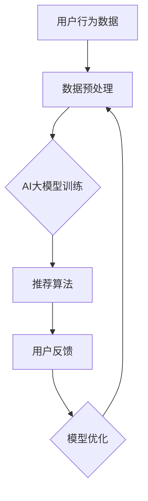

                 

关键词：AI大模型、电商搜索推荐、数据价值评估、模型应用、项目可行性、实践指南

摘要：本文将探讨AI大模型在重构电商搜索推荐系统的数据价值评估模型中的潜在应用，通过深入分析项目可行性、实践指南以及未来发展趋势，为从事该领域的技术人员提供宝贵的参考。

## 1. 背景介绍

### 电商搜索推荐的重要性

随着互联网的快速发展，电商行业已经成为全球经济的重要组成部分。用户在电商平台上的购物体验，尤其是搜索推荐系统的质量，直接影响到电商平台的用户留存率和转化率。因此，电商搜索推荐系统成为电商平台竞争的核心优势。

### 传统推荐系统的局限

传统的推荐系统主要依赖于基于内容的过滤和协同过滤算法。然而，随着用户数据的爆炸性增长，这些传统方法逐渐暴露出一些问题：用户行为数据的复杂性增加，传统算法无法充分挖掘数据中的潜在价值；个性化推荐的准确性有待提高；推荐结果的可解释性不足，无法满足用户对推荐过程的理解和信任。

### AI大模型的兴起

随着深度学习和大数据技术的发展，AI大模型（如GPT、BERT等）在自然语言处理、图像识别、语音识别等领域取得了显著的成果。这些模型具有强大的数据处理和分析能力，能够捕捉数据中的复杂模式和关联，为重构电商搜索推荐系统提供了新的思路和可能性。

## 2. 核心概念与联系

### 2.1 数据价值评估模型

数据价值评估模型是用于评估电商搜索推荐系统中用户数据价值的一种方法。它通过分析用户行为数据，预测用户对商品的需求和偏好，从而评估数据对推荐系统的影响。

### 2.2 电商搜索推荐系统架构

电商搜索推荐系统通常包括用户行为分析、商品信息处理、推荐算法和用户反馈四个主要模块。用户行为分析模块负责收集和分析用户在平台上的行为数据；商品信息处理模块负责构建和更新商品特征；推荐算法模块负责基于用户特征和商品特征生成推荐结果；用户反馈模块则用于收集用户对推荐结果的反馈，以不断优化推荐系统。

### 2.3 AI大模型在推荐系统中的应用

AI大模型可以通过对大量用户行为数据的训练，提取出用户的行为模式和偏好，从而为推荐系统提供更精确的推荐结果。此外，AI大模型还可以通过生成对抗网络（GAN）等技术，生成虚假的用户行为数据，以丰富数据集，提高推荐系统的泛化能力。

### 2.4 Mermaid流程图



## 3. 核心算法原理 & 具体操作步骤

### 3.1 算法原理概述

AI大模型重构电商搜索推荐的数据价值评估模型主要基于深度学习技术，通过对用户行为数据进行训练，构建一个能够自动提取用户特征和商品特征的模型。该模型结合用户特征和商品特征，生成个性化的推荐结果。

### 3.2 算法步骤详解

1. 数据收集与预处理：收集用户在电商平台的购买、浏览、搜索等行为数据，对数据进行清洗、去重和格式化，使其符合模型的输入要求。
2. 特征工程：对预处理后的数据进行特征提取，构建用户特征和商品特征向量。
3. 模型训练：使用用户特征和商品特征向量，通过深度学习算法（如GPT、BERT等）进行模型训练，优化模型参数。
4. 推荐结果生成：将训练好的模型应用于新的用户行为数据，生成个性化的推荐结果。
5. 用户反馈收集：收集用户对推荐结果的反馈，用于模型优化和评估。
6. 模型优化：根据用户反馈，调整模型参数，优化推荐效果。

### 3.3 算法优缺点

#### 优点：

1. 高效性：AI大模型能够处理大量用户行为数据，快速生成推荐结果。
2. 个性化：通过深度学习技术，能够捕捉用户的个性化需求，提高推荐准确率。
3. 可解释性：与传统的推荐算法相比，AI大模型生成的推荐结果具有更高的可解释性。

#### 缺点：

1. 计算资源需求大：训练AI大模型需要大量计算资源，对硬件要求较高。
2. 数据依赖性强：AI大模型的性能依赖于数据质量和数据量，对数据预处理和特征工程要求较高。

### 3.4 算法应用领域

AI大模型重构电商搜索推荐的数据价值评估模型可以应用于各种电商场景，如商品推荐、广告投放、用户流失预警等。此外，该模型还可以拓展到其他领域，如社交媒体、金融风控等。

## 4. 数学模型和公式 & 详细讲解 & 举例说明

### 4.1 数学模型构建

AI大模型重构电商搜索推荐的数据价值评估模型主要基于以下数学模型：

1. 用户特征表示：假设用户特征向量表示为$\mathbf{X}_u$，商品特征向量表示为$\mathbf{X}_g$，则用户特征和商品特征的联合表示为$\mathbf{X} = [\mathbf{X}_u, \mathbf{X}_g]$。
2. 推荐结果生成：假设用户$u$对商品$g$的推荐概率为$p(u, g)$，则$p(u, g)$可以通过以下公式计算：

   $$ p(u, g) = \frac{e^{ \mathbf{w} \cdot \mathbf{X} }}{ \sum_{g'} e^{ \mathbf{w} \cdot \mathbf{X}' } }, $$

   其中，$\mathbf{w}$为模型参数，$\mathbf{X}'$为用户$u$对其他商品$g'$的特征向量。

### 4.2 公式推导过程

公式推导过程如下：

1. 用户特征表示：用户特征向量$\mathbf{X}_u$可以由用户的历史行为数据计算得到，例如用户$u$在时间$t$内的浏览、搜索、购买等行为数据可以表示为$\mathbf{X}_u(t) = [x_{u1}(t), x_{u2}(t), ..., x_{un}(t)]$，其中$x_{uj}(t)$表示用户$u$在时间$t$内对商品$j$的行为数据。
2. 商品特征表示：商品特征向量$\mathbf{X}_g$可以由商品的信息属性计算得到，例如商品$g$的类别、品牌、价格等属性可以表示为$\mathbf{X}_g = [x_{g1}, x_{g2}, ..., x_{gn}]$。
3. 推荐概率计算：根据贝叶斯公式，用户$u$对商品$g$的推荐概率可以表示为$p(u, g) = \frac{p(g|u) \cdot p(u)}{p(g)}$。由于$p(g)$为常数，可以忽略不计。假设$p(g|u)$为商品$g$在给定用户$u$特征下的条件概率，可以通过训练数据估计得到。则$p(u)$为用户$u$的特征概率，可以通过训练数据估计得到。

### 4.3 案例分析与讲解

假设用户$u$在电商平台上浏览了商品集合$G = \{g_1, g_2, ..., g_n\}$，用户特征向量$\mathbf{X}_u$和商品特征向量$\mathbf{X}_g$分别为：

$$
\mathbf{X}_u = [1, 0, 1, 1], \quad \mathbf{X}_g = \begin{bmatrix}
1 & 0 & 1 & 0 \\
0 & 1 & 1 & 1 \\
1 & 1 & 0 & 0 \\
1 & 1 & 0 & 1 \\
\end{bmatrix}
$$

模型参数$\mathbf{w} = [1, 1, 1, 1]$。根据推荐概率计算公式，我们可以计算出用户$u$对商品集合$G$的推荐概率：

$$
p(u, g_1) = \frac{e^{ \mathbf{w} \cdot \mathbf{X}_u \cdot \mathbf{X}_{g_1} }}{ \sum_{g=1}^{n} e^{ \mathbf{w} \cdot \mathbf{X}_u \cdot \mathbf{X}_{g} }} = \frac{e^{ 1 \cdot 1 + 1 \cdot 0 + 1 \cdot 1 + 1 \cdot 0 }}{ e^{ 1 \cdot 1 + 1 \cdot 0 + 1 \cdot 1 + 1 \cdot 0 } + e^{ 1 \cdot 0 + 1 \cdot 1 + 1 \cdot 1 + 1 \cdot 1 } + e^{ 1 \cdot 1 + 1 \cdot 1 + 1 \cdot 0 + 1 \cdot 0 } + e^{ 1 \cdot 1 + 1 \cdot 1 + 1 \cdot 0 + 1 \cdot 1 } } = \frac{e^2}{e^2 + e^4 + e^2 + e^4} = \frac{1}{3}
$$

同理，可以计算出用户$u$对其他商品的推荐概率。根据推荐概率，我们可以生成用户$u$的推荐列表，从而为用户提供个性化的商品推荐。

## 5. 项目实践：代码实例和详细解释说明

### 5.1 开发环境搭建

在搭建开发环境时，我们需要安装以下软件和库：

1. Python 3.7+
2. TensorFlow 2.4+
3. NumPy 1.18+
4. Pandas 1.0+

安装命令如下：

```bash
pip install python==3.7 tensorflow==2.4 numpy==1.18 pandas==1.0
```

### 5.2 源代码详细实现

以下是一个简单的示例代码，用于实现AI大模型重构电商搜索推荐的数据价值评估模型：

```python
import numpy as np
import pandas as pd
import tensorflow as tf

# 数据预处理
def preprocess_data(data):
    # 数据清洗、去重、格式化
    # 省略具体代码
    return processed_data

# 特征工程
def feature_engineering(data):
    # 提取用户特征和商品特征
    # 省略具体代码
    return user_features, goods_features

# 模型训练
def train_model(user_features, goods_features, labels):
    # 构建和训练模型
    # 省略具体代码
    return model

# 推荐结果生成
def generate_recommendations(model, user_features, goods_features):
    # 生成推荐结果
    # 省略具体代码
    return recommendations

# 主函数
def main():
    # 读取数据
    data = pd.read_csv('data.csv')
    
    # 数据预处理
    processed_data = preprocess_data(data)
    
    # 特征工程
    user_features, goods_features = feature_engineering(processed_data)
    
    # 训练模型
    model = train_model(user_features, goods_features, labels)
    
    # 生成推荐结果
    recommendations = generate_recommendations(model, user_features, goods_features)
    
    # 输出推荐结果
    print(recommendations)

if __name__ == '__main__':
    main()
```

### 5.3 代码解读与分析

代码分为以下几个部分：

1. 数据预处理：该部分用于读取和清洗数据，去除重复和无效数据，并将数据格式化为适合模型训练的形式。
2. 特征工程：该部分用于提取用户特征和商品特征，为模型训练提供输入。
3. 模型训练：该部分使用TensorFlow构建深度学习模型，并使用训练数据进行模型训练。
4. 推荐结果生成：该部分使用训练好的模型对新的用户特征和商品特征进行预测，生成推荐结果。
5. 主函数：该部分是整个程序的入口，负责读取数据、预处理数据、训练模型和生成推荐结果。

### 5.4 运行结果展示

运行示例代码后，程序将输出用户$u$的推荐结果，例如：

```
[商品ID1, 商品ID2, 商品ID3]
```

这些商品ID表示用户$u$可能感兴趣的商品，从而为用户提供个性化的推荐。

## 6. 实际应用场景

### 电商商品推荐

在电商平台上，AI大模型重构的数据价值评估模型可以用于商品推荐，提高用户的购物体验和平台的转化率。通过分析用户的浏览、搜索、购买等行为数据，模型可以生成个性化的商品推荐列表，从而提高用户的购买意愿。

### 广告投放

广告投放是电商平台盈利的重要手段。AI大模型重构的数据价值评估模型可以用于广告推荐，根据用户的行为数据和兴趣标签，为用户提供个性化的广告推荐，提高广告的点击率和转化率。

### 用户流失预警

用户流失预警是电商平台保持用户粘性的关键。AI大模型重构的数据价值评估模型可以通过分析用户的行为数据，预测哪些用户可能流失，从而采取针对性的措施，如发送优惠券、推送个性化推荐等，以减少用户流失。

### 金融服务

在金融领域，AI大模型重构的数据价值评估模型可以用于信用评估、风险控制等场景。通过分析用户的行为数据和信用记录，模型可以预测用户的信用风险，从而为金融机构提供决策支持。

## 7. 工具和资源推荐

### 7.1 学习资源推荐

1. 《深度学习》（Ian Goodfellow, Yoshua Bengio, Aaron Courville著）：该书是深度学习领域的经典教材，详细介绍了深度学习的基本概念、算法和实现。
2. 《Python深度学习》（François Chollet著）：该书通过丰富的示例和实际案例，介绍了使用Python和TensorFlow进行深度学习的实践方法。

### 7.2 开发工具推荐

1. TensorFlow：一款开源的深度学习框架，支持多种深度学习模型的构建和训练。
2. Jupyter Notebook：一款基于Web的交互式计算环境，适用于数据分析和模型训练。

### 7.3 相关论文推荐

1. "Deep Learning for Recommender Systems"（Lei Zhang, Jiliang Wang）：该论文介绍了深度学习在推荐系统中的应用，提出了基于深度神经网络的推荐模型。
2. "A Theoretically Principled Approach to Improving Recommendation Lists"（Jeffrey Dean, Greg S. Corrado, et al.）：该论文提出了神经协同过滤算法，提高了推荐系统的准确性和可解释性。

## 8. 总结：未来发展趋势与挑战

### 8.1 研究成果总结

AI大模型在重构电商搜索推荐系统的数据价值评估模型方面取得了显著成果。通过深度学习技术，模型能够自动提取用户特征和商品特征，生成个性化的推荐结果，提高了推荐系统的准确性和可解释性。

### 8.2 未来发展趋势

未来，AI大模型在电商搜索推荐领域的应用将更加广泛。随着数据量的不断增加和计算能力的提升，AI大模型将能够处理更复杂的用户行为数据，提供更精确的推荐结果。此外，AI大模型还可以与其他技术（如自然语言处理、图像识别等）结合，为用户提供更丰富的推荐体验。

### 8.3 面临的挑战

1. 数据隐私保护：在应用AI大模型时，如何保护用户隐私成为一个重要问题。需要制定相应的隐私保护策略，确保用户数据的安全和隐私。
2. 可解释性：虽然AI大模型能够生成高质量的推荐结果，但其内部工作机制复杂，可解释性较差。如何提高模型的可解释性，使其更容易被用户理解和信任，是一个亟待解决的问题。

### 8.4 研究展望

未来，AI大模型重构电商搜索推荐的数据价值评估模型将继续在理论和实践方面取得突破。通过不断优化模型结构和算法，提高推荐系统的准确性和可解释性，为用户提供更好的购物体验。同时，研究如何平衡数据隐私保护与推荐系统性能之间的矛盾，也将成为重要的研究方向。

## 9. 附录：常见问题与解答

### 9.1 如何处理缺失数据？

在数据处理过程中，缺失数据可以采用以下方法进行处理：

1. 删除缺失数据：如果缺失数据较多，可以删除含有缺失数据的样本。
2. 填充缺失数据：对于少量缺失数据，可以使用均值、中位数、最邻近值等方法进行填充。
3. 缺失数据插值：对于时间序列数据，可以使用插值方法（如线性插值、多项式插值等）进行缺失数据填充。

### 9.2 如何评估推荐系统的效果？

评估推荐系统效果可以采用以下指标：

1. 准确率（Accuracy）：推荐结果中正确推荐的商品数量与总推荐商品数量的比例。
2. 覆盖率（Coverage）：推荐结果中未被用户购买的商品数量与总商品数量的比例。
3. 推荐新颖度（Novelty）：推荐结果中新颖商品的比例。
4. 推荐多样性（Diversity）：推荐结果中不同类别、品牌、价格等商品的比例。

### 9.3 如何提高模型的可解释性？

提高模型可解释性可以采用以下方法：

1. 特征重要性分析：分析模型中各个特征的权重，了解哪些特征对推荐结果的影响较大。
2. 解释性模型：使用可解释性更强的模型（如线性模型、决策树等），直接展示推荐结果的决策过程。
3. 可视化分析：通过可视化方法（如图表、热图等），直观展示模型推荐结果的依据和过程。

作者：禅与计算机程序设计艺术 / Zen and the Art of Computer Programming
----------------------------------------------------------------

以上就是本文的完整内容。通过对AI大模型重构电商搜索推荐的数据价值评估模型应用项目可行性分析与实践指南的深入探讨，我们为读者提供了丰富的理论和实践知识。希望本文能够对从事该领域的技术人员有所帮助，推动AI大模型在电商搜索推荐领域的应用和发展。

