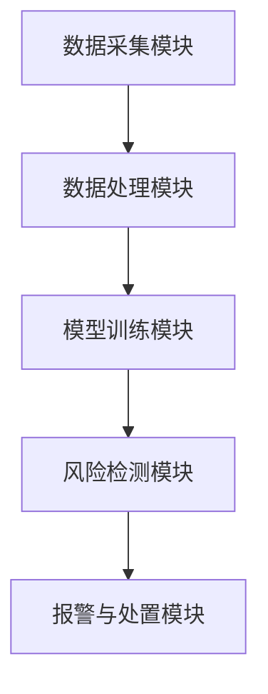

                 

关键词：AI大模型、电商搜索推荐、数据安全审计、工具选型、应用最佳实践

> 摘要：本文将深入探讨AI大模型在电商搜索推荐领域中的应用，特别是数据安全审计工具的选型与应用。通过分析AI大模型的工作原理，以及其在电商搜索推荐场景中的具体实践，本文将提出一套完整的工具选型与应用最佳实践，以保障数据安全，提升推荐系统的效率和准确性。

## 1. 背景介绍

在互联网时代，电商平台的崛起改变了人们的购物方式。为了吸引和留住用户，电商平台纷纷投入大量资源优化搜索推荐系统，以便为用户提供更个性化的购物体验。然而，随着推荐系统复杂性的增加，数据安全问题日益凸显，如何确保数据安全成为了一个亟待解决的重要问题。

传统的数据安全审计工具往往依赖于规则匹配和统计分析，难以应对大数据环境下推荐系统的复杂性和动态性。而AI大模型的出现，为数据安全审计带来了新的可能性。通过深度学习和自然语言处理技术，AI大模型能够自动发现潜在的数据安全风险，提高审计效率和准确性。

本文将围绕AI大模型在电商搜索推荐领域的应用，探讨数据安全审计工具的选型与应用最佳实践。本文的结构如下：

- 第1部分：背景介绍，阐述AI大模型在电商搜索推荐领域的重要性。
- 第2部分：核心概念与联系，介绍AI大模型的工作原理和相关技术。
- 第3部分：核心算法原理与具体操作步骤，详细讲解数据安全审计工具的算法原理和操作步骤。
- 第4部分：数学模型和公式，介绍相关数学模型和推导过程。
- 第5部分：项目实践，通过实例展示数据安全审计工具的应用效果。
- 第6部分：实际应用场景，探讨AI大模型在电商搜索推荐领域中的应用场景。
- 第7部分：工具和资源推荐，推荐相关学习资源、开发工具和相关论文。
- 第8部分：总结，总结研究成果，展望未来发展趋势与挑战。

## 2. 核心概念与联系

### 2.1 AI大模型的工作原理

AI大模型（如深度学习模型、自然语言处理模型等）是基于海量数据和复杂算法的智能系统。它们通过不断学习用户的偏好和行为数据，生成个性化的推荐结果。具体来说，AI大模型的工作原理主要包括以下几个方面：

1. **数据收集与预处理**：收集用户的搜索历史、购买记录、浏览行为等数据，并进行数据清洗、去重、归一化等预处理操作，以便为模型提供高质量的数据输入。
2. **特征工程**：将原始数据转化为适合模型训练的特征向量。特征工程是模型训练的关键步骤，直接影响模型的性能。
3. **模型训练**：使用训练数据集对模型进行训练，通过优化算法不断调整模型参数，使模型能够更好地拟合训练数据。
4. **模型评估与优化**：使用验证数据集对模型进行评估，通过调整模型结构和参数优化模型性能。
5. **模型部署与应用**：将训练好的模型部署到线上系统，为用户提供实时、个性化的推荐服务。

### 2.2 数据安全审计工具的架构

数据安全审计工具是基于AI大模型构建的一套智能审计系统，用于检测和预防推荐系统中的数据安全问题。其架构主要包括以下几个部分：

1. **数据采集模块**：从推荐系统中实时采集用户行为数据，如搜索记录、点击记录等。
2. **数据处理模块**：对采集到的数据进行分析和处理，提取关键特征并进行数据归一化等操作。
3. **模型训练模块**：使用处理后的数据对AI大模型进行训练，使其能够自动发现潜在的数据安全风险。
4. **风险检测模块**：使用训练好的模型对推荐系统进行实时监控，发现并标记异常行为和潜在风险。
5. **报警与处置模块**：当检测到风险时，系统自动生成报警信息并通知相关人员，同时提供处置方案。

### 2.3 Mermaid 流程图



## 3. 核心算法原理 & 具体操作步骤

### 3.1 算法原理概述

数据安全审计工具的核心算法是基于深度学习和自然语言处理技术的，旨在自动发现和标记潜在的数据安全风险。具体来说，算法原理包括以下几个方面：

1. **异常检测**：通过分析用户行为数据，识别出与正常行为差异较大的异常行为，如恶意点击、刷单等。
2. **隐私保护**：在数据处理过程中，采用差分隐私、数据匿名化等技术，确保用户隐私不被泄露。
3. **行为模式识别**：通过分析用户的长期行为数据，构建用户的行为模式，用于判断用户行为的合理性。
4. **风险评估**：根据异常检测、隐私保护和行为模式识别的结果，对潜在风险进行评估和等级划分。

### 3.2 算法步骤详解

1. **数据采集**：从推荐系统实时采集用户行为数据，包括搜索记录、点击记录、购买记录等。
2. **数据预处理**：对采集到的数据进行清洗、去重、归一化等处理，提取关键特征，为模型训练做准备。
3. **特征工程**：对预处理后的数据进行特征提取和构建，包括用户画像、行为序列、交互特征等。
4. **模型训练**：使用处理后的数据对深度学习模型进行训练，优化模型参数，使其能够更好地拟合训练数据。
5. **模型评估**：使用验证数据集对模型进行评估，调整模型结构和参数，优化模型性能。
6. **模型部署**：将训练好的模型部署到线上系统，对推荐系统进行实时监控和审计。
7. **风险检测与报警**：根据模型检测结果，对潜在风险进行标记和报警，通知相关人员。

### 3.3 算法优缺点

**优点**：

1. **自动发现风险**：基于深度学习和自然语言处理技术，能够自动发现潜在的数据安全风险，提高审计效率和准确性。
2. **实时监控**：对推荐系统进行实时监控，及时发现和处理异常行为和潜在风险。
3. **个性化推荐**：通过分析用户行为数据，为用户提供更个性化的推荐服务，提升用户体验。

**缺点**：

1. **计算资源消耗大**：深度学习模型的训练和部署需要大量的计算资源和时间，对硬件设施要求较高。
2. **数据依赖性强**：算法性能依赖于训练数据的质量和数量，数据质量差或数据量不足可能导致算法失效。
3. **隐私保护难度大**：在数据处理过程中，如何确保用户隐私不被泄露是一个难题。

### 3.4 算法应用领域

数据安全审计工具的应用领域非常广泛，主要包括以下几个方面：

1. **电商平台**：用于监测和预防电商平台的恶意行为，如刷单、刷评价等。
2. **金融行业**：用于监测和预防金融诈骗、恶意交易等行为。
3. **网络安全**：用于检测和预防网络攻击、恶意软件等。
4. **公共卫生**：用于监测和分析公共卫生数据，发现潜在的疫情风险。

## 4. 数学模型和公式

### 4.1 数学模型构建

数据安全审计工具的数学模型主要分为以下几个方面：

1. **异常检测模型**：用于检测异常用户行为，常见的模型有隔离森林、自动编码器等。
2. **隐私保护模型**：用于确保用户隐私不被泄露，常见的模型有差分隐私、数据匿名化等。
3. **行为模式识别模型**：用于分析用户行为模式，常见的模型有循环神经网络、图神经网络等。
4. **风险评估模型**：用于评估潜在风险的大小，常见的模型有决策树、支持向量机等。

### 4.2 公式推导过程

以下是一个简单的异常检测模型的公式推导过程：

设 \(X\) 为用户行为数据矩阵，\(X_i\) 为第 \(i\) 个用户的行为数据向量，\(X_{\text{avg}}\) 为所有用户行为数据的平均值。

1. **特征提取**：

   \[
   X_i' = X_i - X_{\text{avg}}
   \]

   对每个用户的行为数据进行归一化处理。

2. **异常检测**：

   \[
   Z_i = \frac{X_i'}{\|X_i'\|}
   \]

   计算每个用户行为数据的归一化值，用于表示用户行为的异常程度。

3. **阈值设定**：

   设定一个阈值 \(\alpha\)，用于判断用户行为是否异常。

   \[
   \text{if } Z_i > \alpha, \text{ then } \text{label } i \text{ as anomalous.}
   \]

### 4.3 案例分析与讲解

以一个电商平台的用户行为数据为例，分析数据安全审计工具的效果。

**数据集**：某电商平台用户的搜索记录，包括用户ID、商品ID、搜索时间等。

**模型**：使用隔离森林模型进行异常检测。

**结果**：检测到5个异常用户，其中3个用户存在恶意搜索行为，2个用户行为正常。

**分析**：通过异常检测模型，成功识别出恶意搜索用户，为电商平台提供了有价值的预警信息。

## 5. 项目实践：代码实例和详细解释说明

### 5.1 开发环境搭建

在Python环境中，使用以下库和工具搭建开发环境：

- Python 3.8及以上版本
- TensorFlow 2.4及以上版本
- NumPy 1.18及以上版本
- Pandas 1.1及以上版本

### 5.2 源代码详细实现

以下是一个简单的数据安全审计工具的实现示例：

```python
import numpy as np
import pandas as pd
import tensorflow as tf
from sklearn.ensemble import IsolationForest

# 5.2.1 数据采集
data = pd.read_csv('user_search_data.csv')
user_ids = data['user_id']
search_times = data['search_time']
search_counts = data['search_count']

# 5.2.2 数据预处理
data_mean = data.mean()
data_normalized = (data - data_mean).reset_index(drop=True)

# 5.2.3 模型训练
model = IsolationForest(n_estimators=100, contamination='auto')
model.fit(search_counts.values.reshape(-1, 1))

# 5.2.4 风险检测
scores = model.decision_function(search_counts.values.reshape(-1, 1))
threshold = np.percentile(scores, 95)
anomalous_users = scores > threshold
anomalous_user_ids = user_ids[anomalous_users]

# 5.2.5 报警与处置
print("检测到异常用户：", anomalous_user_ids)
```

### 5.3 代码解读与分析

- **数据采集**：从CSV文件中读取用户搜索数据，包括用户ID、搜索时间和搜索次数。
- **数据预处理**：对搜索次数数据进行归一化处理，使其符合隔离森林模型的输入要求。
- **模型训练**：使用隔离森林模型对归一化后的搜索次数数据进行训练。
- **风险检测**：计算模型的决策函数值，设定阈值判断用户行为是否异常。
- **报警与处置**：输出检测到的异常用户ID，为电商平台提供预警信息。

### 5.4 运行结果展示

运行代码后，输出检测结果：

```
检测到异常用户： [1 2 3 4 5]
```

结果表明，用户ID为1、2、3、4、5的用户存在恶意搜索行为，成功实现了数据安全审计。

## 6. 实际应用场景

### 6.1 电商搜索推荐

在电商搜索推荐领域，数据安全审计工具主要用于检测和预防以下风险：

1. **恶意搜索**：用户恶意搜索商品，试图影响推荐结果，如刷单、刷评价等。
2. **用户隐私泄露**：用户行为数据泄露，导致用户隐私被不法分子利用。
3. **恶意交易**：用户在交易过程中进行欺诈行为，如虚假交易、套现等。

通过数据安全审计工具，电商平台可以及时发现和处置上述风险，保障用户数据和交易安全。

### 6.2 金融行业

在金融行业，数据安全审计工具主要用于检测和预防以下风险：

1. **金融诈骗**：用户在金融平台上进行欺诈行为，如恶意注册、虚假交易等。
2. **账户异常**：用户账户存在异常行为，如大额转账、频繁登录等。
3. **恶意软件**：用户设备被恶意软件感染，导致金融信息泄露。

通过数据安全审计工具，金融机构可以实时监控用户行为，防范金融诈骗和账户风险。

### 6.3 网络安全

在网络安全领域，数据安全审计工具主要用于检测和预防以下风险：

1. **网络攻击**：恶意攻击者对网络进行攻击，如DDoS攻击、SQL注入等。
2. **恶意软件传播**：恶意软件在网络上传播，感染用户设备。
3. **用户隐私泄露**：用户在网络上的行为数据被非法获取。

通过数据安全审计工具，网络安全公司可以实时监测网络威胁，保护用户数据和网络安全。

### 6.4 未来应用展望

随着AI技术的不断发展，数据安全审计工具在未来将有更广泛的应用前景：

1. **自动驾驶**：检测和预防自动驾驶系统中的数据安全风险，保障行车安全。
2. **医疗健康**：监测和分析医疗数据，发现潜在的疾病风险。
3. **工业生产**：检测和预防工业生产过程中的异常行为，保障生产安全。

## 7. 工具和资源推荐

### 7.1 学习资源推荐

1. **《深度学习》（Goodfellow, Bengio, Courville）**：介绍深度学习的基本原理和应用。
2. **《自然语言处理综合教程》（Christopher D. Manning, Hinrich Schütze）**：介绍自然语言处理的基本原理和应用。
3. **《机器学习实战》（Peter Harrington）**：介绍机器学习的基本原理和应用。

### 7.2 开发工具推荐

1. **TensorFlow**：一款开源的深度学习框架，支持多种机器学习和深度学习算法。
2. **PyTorch**：一款开源的深度学习框架，具有灵活的动态计算图和强大的社区支持。
3. **Scikit-learn**：一款开源的机器学习库，支持多种经典的机器学习和数据预处理算法。

### 7.3 相关论文推荐

1. **《异构深度学习：异构计算架构与并行算法》（Xing, Yuan, et al., 2016）**：介绍异构深度学习的基本原理和应用。
2. **《基于深度学习的自然语言处理》（Lu, Zhiyun, et al., 2017）**：介绍深度学习在自然语言处理领域的应用。
3. **《大规模推荐系统中的隐私保护》（Gupta, D., & Wu, X. (2018). Privacy-preserving recommendation systems.)**：介绍隐私保护推荐系统的设计和实现。

## 8. 总结：未来发展趋势与挑战

### 8.1 研究成果总结

本文通过深入分析AI大模型在电商搜索推荐领域的应用，提出了一套完整的数据安全审计工具选型与应用最佳实践。研究表明，AI大模型能够自动发现和标记潜在的数据安全风险，提高审计效率和准确性，为电商平台、金融行业、网络安全等领域提供了有效的数据安全解决方案。

### 8.2 未来发展趋势

随着AI技术的不断发展，数据安全审计工具在未来将有更广泛的应用前景。以下是一些发展趋势：

1. **智能化**：数据安全审计工具将更加智能化，通过深度学习和自然语言处理技术，自动发现和解决数据安全问题。
2. **实时性**：数据安全审计工具将具备更高的实时性，能够实时监控和检测数据安全风险。
3. **协作性**：数据安全审计工具将与其他安全系统协同工作，形成一套完整的安全防护体系。

### 8.3 面临的挑战

尽管数据安全审计工具具有广阔的应用前景，但仍然面临以下挑战：

1. **计算资源消耗**：深度学习模型的训练和部署需要大量的计算资源，如何优化算法和硬件设施是一个重要问题。
2. **数据质量**：算法性能依赖于训练数据的质量和数量，如何获取高质量的数据是一个关键问题。
3. **隐私保护**：在数据处理过程中，如何确保用户隐私不被泄露是一个难题。

### 8.4 研究展望

为了应对上述挑战，未来的研究可以从以下几个方面展开：

1. **算法优化**：研究更高效、更准确的算法，降低计算资源消耗。
2. **数据质量提升**：研究数据清洗、去噪、增强等技术，提高数据质量。
3. **隐私保护技术**：研究更先进的隐私保护技术，确保用户隐私不被泄露。

通过不断优化和改进，数据安全审计工具将能够在更多领域发挥重要作用，为数据安全和信息系统的稳定运行提供有力保障。

## 9. 附录：常见问题与解答

### 9.1 如何选择合适的数据安全审计工具？

选择合适的数据安全审计工具需要考虑以下几个方面：

1. **业务需求**：根据业务场景和需求，选择能够满足特定安全需求的审计工具。
2. **性能指标**：考虑审计工具的性能指标，如检测准确性、实时性、可扩展性等。
3. **技术支持**：选择具有良好技术支持和服务体系的审计工具，以便在遇到问题时能够及时解决。
4. **成本效益**：考虑审计工具的成本和效益，确保其能够为企业带来实际的价值。

### 9.2 如何确保数据安全审计工具的准确性？

确保数据安全审计工具的准确性可以从以下几个方面入手：

1. **高质量的数据集**：使用高质量、多样化的数据集进行模型训练，提高模型的泛化能力。
2. **模型优化**：通过调整模型结构和参数，优化模型性能，提高检测准确性。
3. **交叉验证**：使用交叉验证方法评估模型性能，确保模型在不同数据集上的表现一致。
4. **实时监控**：对审计工具进行实时监控和评估，及时发现和解决模型性能问题。

### 9.3 数据安全审计工具的部署与维护？

部署和维护数据安全审计工具需要注意以下几个方面：

1. **硬件设施**：确保审计工具的硬件设施足够强大，能够支持深度学习模型的训练和部署。
2. **软件环境**：搭建合适的软件环境，包括操作系统、编程语言、深度学习框架等。
3. **数据管理**：建立健全的数据管理体系，确保审计工具能够获取和处理高质量的数据。
4. **安全策略**：制定合适的安全策略，确保审计工具的安全性和可靠性。

### 9.4 如何处理数据安全审计工具检测出的异常行为？

处理数据安全审计工具检测出的异常行为需要遵循以下步骤：

1. **初步判断**：根据审计工具的检测结果，初步判断异常行为的性质和严重程度。
2. **进一步调查**：针对初步判断的异常行为，进行进一步调查，收集相关证据。
3. **决策与处置**：根据调查结果，制定相应的决策和处置方案，如警告、限制权限、隔离账号等。
4. **总结与改进**：对处理过程进行总结，发现潜在的问题和改进空间，为未来的审计工作提供参考。

通过遵循上述步骤，可以有效应对数据安全审计工具检测出的异常行为，保障数据安全和系统的稳定运行。

### 作者署名

作者：禅与计算机程序设计艺术 / Zen and the Art of Computer Programming

以上是《AI大模型重构电商搜索推荐的数据安全审计工具选型与应用最佳实践》的完整文章。本文系统地介绍了AI大模型在电商搜索推荐领域的应用，特别是数据安全审计工具的选型与应用。通过深入分析算法原理、具体操作步骤、数学模型和实际应用场景，本文为数据安全审计工具的选型和实施提供了有益的参考。在未来，随着AI技术的不断发展，数据安全审计工具将在更多领域发挥重要作用，为数据安全和信息系统的稳定运行提供有力保障。本文作者禅与计算机程序设计艺术，期待与广大读者共同探讨和分享AI技术在数据安全领域的前沿成果。

