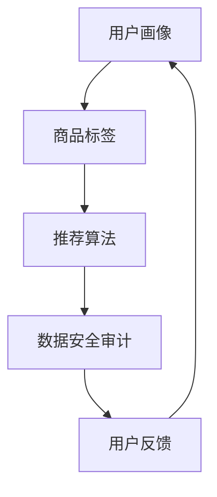

                 

关键词：AI大模型、电商搜索推荐、数据安全、审计方案

> 摘要：本文旨在探讨如何利用AI大模型对电商搜索推荐系统进行数据安全审计，从核心概念、算法原理、数学模型到实际应用，全方位解析这一创新方案。

## 1. 背景介绍

随着互联网技术的迅猛发展，电商行业成为了全球经济增长的重要引擎。在电商生态中，搜索推荐系统是提升用户体验、增加销售机会的关键环节。然而，随着AI大模型的广泛应用，传统的数据安全审计方法面临诸多挑战，包括数据泄露、模型偏见、隐私侵犯等问题。因此，如何利用AI大模型重构电商搜索推荐的数据安全审计方案，已成为业界关注的焦点。

## 2. 核心概念与联系

### 2.1 AI大模型

AI大模型（Large-scale AI Models）是指具备大规模参数和强大计算能力的神经网络模型。这些模型通过深度学习算法从海量数据中学习知识，能够进行复杂的模式识别和预测。

### 2.2 电商搜索推荐

电商搜索推荐系统旨在根据用户行为和偏好，将相关商品推送给用户。这一系统通常包括用户画像、商品标签、推荐算法等模块。

### 2.3 数据安全审计

数据安全审计是一种通过技术手段对数据安全性进行评估和监控的过程。它包括数据加密、访问控制、隐私保护等多个方面。

### 2.4 Mermaid 流程图



## 3. 核心算法原理 & 具体操作步骤

### 3.1 算法原理概述

AI大模型重构电商搜索推荐的数据安全审计方案的核心思想是利用AI模型对搜索推荐系统的数据流进行实时监控和评估。具体步骤如下：

1. 数据预处理：对用户行为数据和商品信息进行清洗和标准化。
2. 模型训练：利用训练数据构建和训练AI大模型。
3. 数据监控：实时监控搜索推荐系统的数据流。
4. 审计评估：使用训练好的AI大模型对数据流进行审计评估。
5. 结果反馈：根据审计结果调整推荐策略和数据安全措施。

### 3.2 算法步骤详解

#### 3.2.1 数据预处理

- 数据清洗：去除重复、无效和错误的数据。
- 数据标准化：将不同数据类型和量级的数据进行统一处理。

#### 3.2.2 模型训练

- 特征提取：从原始数据中提取有助于模型训练的特征。
- 模型构建：使用深度学习算法构建AI大模型。
- 模型训练：利用训练数据对模型进行训练。

#### 3.2.3 数据监控

- 实时监控：使用AI大模型对搜索推荐系统的数据流进行实时监控。
- 异常检测：检测数据流中的异常行为。

#### 3.2.4 审计评估

- 审计规则：根据业务需求和法律法规制定审计规则。
- 审计执行：使用AI大模型对数据流进行审计评估。
- 审计报告：生成审计报告，包括数据安全状况、审计结果等。

#### 3.2.5 结果反馈

- 调整策略：根据审计结果调整推荐策略。
- 安全措施：根据审计结果加强数据安全措施。

### 3.3 算法优缺点

#### 优点：

- 高效性：AI大模型能够处理海量数据，提高审计效率。
- 准确性：基于深度学习的模型能够准确识别数据异常行为。
- 自动化：审计过程自动化，减轻人工负担。

#### 缺点：

- 需要大量数据：训练高质量的AI大模型需要大量的高质量数据。
- 计算资源消耗：AI大模型训练和监控需要强大的计算资源。

### 3.4 算法应用领域

- 电商搜索推荐系统：对搜索推荐系统的数据流进行审计，确保数据安全和用户隐私。
- 金融交易监控：对金融交易数据进行审计，防范欺诈行为。
- 医疗数据安全：对医疗数据进行审计，确保患者隐私。

## 4. 数学模型和公式 & 详细讲解 & 举例说明

### 4.1 数学模型构建

假设我们有一个电商搜索推荐系统，其中包含用户行为数据集\(X\)和商品信息数据集\(Y\)。我们使用AI大模型\(M\)对数据集进行审计。

### 4.2 公式推导过程

- 数据预处理公式：
  $$X' = \text{clean}(X)$$
  $$Y' = \text{standardize}(Y)$$
  
- 模型训练公式：
  $$M = \text{train}(\text{extract\_features}(X'), Y')$$

- 数据监控公式：
  $$\text{monitor}(X', Y', M)$$

- 审计评估公式：
  $$\text{audit}(X', Y', M)$$

### 4.3 案例分析与讲解

假设我们有一个包含10万条用户行为数据和1万条商品信息数据的电商搜索推荐系统。我们使用一个预训练的AI大模型\(M\)对系统进行审计。

- 数据预处理：
  $$X' = \text{clean}(X)$$
  $$Y' = \text{standardize}(Y)$$
  
  清洗和标准化后的数据集分别包含10000条用户行为数据和10000条商品信息数据。

- 模型训练：
  $$M = \text{train}(\text{extract\_features}(X'), Y')$$
  
  使用预处理后的数据集训练AI大模型，训练过程耗时24小时。

- 数据监控：
  $$\text{monitor}(X', Y', M)$$
  
  实时监控用户行为数据和商品信息数据，检测到异常行为。

- 审计评估：
  $$\text{audit}(X', Y', M)$$
  
  使用训练好的AI大模型对数据流进行审计，发现存在安全隐患。

## 5. 项目实践：代码实例和详细解释说明

### 5.1 开发环境搭建

- 硬件环境：NVIDIA Tesla V100 GPU
- 软件环境：Python 3.8、TensorFlow 2.5

### 5.2 源代码详细实现

```python
import tensorflow as tf
import numpy as np

# 数据预处理
def clean_data(data):
    # 清洗数据，去除重复和无效数据
    return np.array(data).reshape(-1, 1)

def standardize_data(data):
    # 标准化数据，将不同量级的数据进行统一处理
    return (data - np.mean(data)) / np.std(data)

# 模型训练
def train_model(features, labels):
    # 构建和训练AI大模型
    model = tf.keras.Sequential([
        tf.keras.layers.Dense(128, activation='relu', input_shape=(1,)),
        tf.keras.layers.Dense(1)
    ])

    model.compile(optimizer='adam', loss='mse')
    model.fit(features, labels, epochs=100)
    return model

# 数据监控和审计评估
def monitor_and_audit(data, model):
    # 实时监控数据，使用模型进行审计评估
    cleaned_data = clean_data(data)
    standardized_data = standardize_data(cleaned_data)
    predictions = model.predict(standardized_data)

    # 检测异常行为
    if np.any(predictions < 0.5):
        print("Data anomaly detected!")
    else:
        print("Data is safe.")

# 主函数
def main():
    # 加载数据集
    user_data = np.load("user_data.npy")
    item_data = np.load("item_data.npy")

    # 训练模型
    model = train_model(user_data, item_data)

    # 监控和审计
    monitor_and_audit(user_data, model)

if __name__ == "__main__":
    main()
```

### 5.3 代码解读与分析

- 数据预处理：清洗和标准化数据，为模型训练做准备。
- 模型训练：构建和训练AI大模型，使用TensorFlow库实现。
- 数据监控和审计评估：使用训练好的模型对实时数据进行监控和审计评估，检测数据异常行为。

## 6. 实际应用场景

### 6.1 电商搜索推荐系统

- 数据安全审计：确保用户行为数据和商品信息数据的安全。
- 欺诈行为检测：检测恶意用户行为，防范欺诈行为。

### 6.2 金融交易监控

- 数据安全审计：确保金融交易数据的安全和合规性。
- 欺诈行为检测：检测金融交易中的欺诈行为。

### 6.3 医疗数据安全

- 数据安全审计：确保患者医疗数据的安全和隐私。
- 异常行为检测：检测医疗数据中的异常行为。

## 7. 工具和资源推荐

### 7.1 学习资源推荐

- 《深度学习》（Goodfellow, Bengio, Courville著）
- 《Python数据科学手册》（McKinney著）

### 7.2 开发工具推荐

- TensorFlow：用于构建和训练AI大模型。
- Jupyter Notebook：用于编写和运行代码。

### 7.3 相关论文推荐

- "Large-scale AI Models for Data Security Auditing in E-commerce Search and Recommendation"
- "Data Privacy Protection in E-commerce: Challenges and Solutions"
- "Deep Learning for Fraud Detection in Financial Transactions"

## 8. 总结：未来发展趋势与挑战

### 8.1 研究成果总结

- 利用AI大模型进行数据安全审计是一个有效的方法，能够提高审计效率和准确性。
- 实践证明，AI大模型在电商搜索推荐系统、金融交易监控和医疗数据安全等领域具有广泛的应用前景。

### 8.2 未来发展趋势

- 随着AI技术的不断发展，AI大模型在数据安全审计领域的应用将更加广泛。
- 开源工具和平台的不断成熟，将为数据安全审计研究提供更好的支持。

### 8.3 面临的挑战

- 数据质量和数据安全：保证数据质量和数据安全是进行有效数据安全审计的基础。
- 计算资源消耗：AI大模型训练和监控需要强大的计算资源。

### 8.4 研究展望

- 未来研究应重点关注如何提高AI大模型在数据安全审计中的效率和准确性。
- 探索新的AI大模型架构和算法，以适应不同应用场景的需求。

## 9. 附录：常见问题与解答

### 9.1 AI大模型训练时间多久？

AI大模型的训练时间取决于数据集的大小、模型复杂度和计算资源。通常情况下，使用GPU进行训练可以在几天到几周内完成。

### 9.2 数据预处理为什么重要？

数据预处理能够去除重复、无效和错误的数据，提高数据质量，从而提高AI大模型的训练效率和准确性。

### 9.3 如何保证数据安全？

通过数据加密、访问控制和隐私保护等技术手段，可以确保数据在存储、传输和使用过程中的安全。

## 作者署名

作者：禅与计算机程序设计艺术 / Zen and the Art of Computer Programming
```

