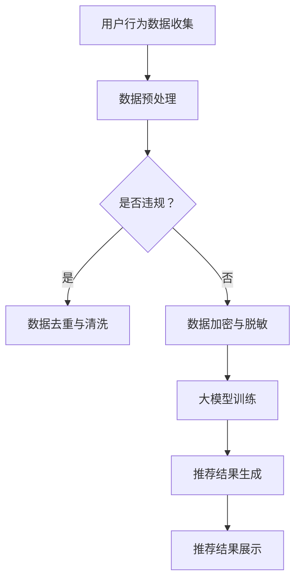

                 

在当今数字化时代，电商搜索推荐系统已经成为电商平台的核心竞争力。然而，随着人工智能大模型的广泛应用，数据安全问题日益凸显。本文将探讨如何利用AI大模型重构电商搜索推荐的数据安全治理体系，以保障用户隐私和数据安全。

## 1. 背景介绍

### 1.1 电商搜索推荐系统

电商搜索推荐系统是一种基于用户行为数据、商品属性信息等构建的个性化推荐系统，旨在提高用户的购物体验，提升电商平台销售额。传统搜索推荐系统主要依赖于统计方法和规则引擎，然而，随着数据量和复杂度的增加，传统方法已无法满足高效、准确的推荐需求。

### 1.2 AI大模型在搜索推荐中的应用

近年来，人工智能大模型如BERT、GPT等在自然语言处理领域取得了显著的成果。这些大模型通过深度学习技术，能够自动从海量数据中学习知识，并生成高质量的文本表示。将AI大模型应用于电商搜索推荐系统，可以提高推荐效果，降低人工干预成本。

### 1.3 数据安全问题

在电商搜索推荐系统中，用户数据、商品数据等敏感信息大量存在。这些数据一旦泄露，可能导致用户隐私泄露、商业机密泄露等问题。因此，如何保障数据安全成为当前迫切需要解决的问题。

## 2. 核心概念与联系

### 2.1 AI大模型

AI大模型是指具有海量参数、能够处理大规模数据的深度学习模型。它们通常基于神经网络架构，通过海量数据训练得到。大模型在多个领域取得了突破性进展，如自然语言处理、计算机视觉等。

### 2.2 数据安全治理

数据安全治理是指通过一系列策略、流程和技术手段，保障数据安全、合规和可靠。数据安全治理体系包括数据加密、访问控制、审计等关键环节。

### 2.3 Mermaid流程图

以下是电商搜索推荐系统中AI大模型和数据安全治理体系之间的关联关系的Mermaid流程图：



## 3. 核心算法原理 & 具体操作步骤

### 3.1 算法原理概述

AI大模型重构电商搜索推荐的数据安全治理体系主要依赖于以下核心技术：

1. **深度学习技术**：用于构建和训练大模型，从海量数据中自动提取特征。
2. **加密与脱敏技术**：用于保障数据在传输、存储和处理过程中的安全性。
3. **访问控制与审计技术**：用于确保数据访问的合法性和可追溯性。

### 3.2 算法步骤详解

#### 3.2.1 用户行为数据收集

1. **数据采集**：通过API接口、日志分析等方式，收集用户在电商平台的浏览、购买、评价等行为数据。
2. **数据格式化**：将采集到的数据转换为统一的格式，如CSV、JSON等。

#### 3.2.2 数据预处理

1. **数据清洗**：去除重复、无效数据，填补缺失值。
2. **特征提取**：对用户行为数据、商品属性数据进行特征提取，如用户标签、商品类别、价格等。
3. **数据归一化**：对特征数据进行归一化处理，如标准化、归一化等。

#### 3.2.3 数据加密与脱敏

1. **数据加密**：采用对称加密、非对称加密等技术，对敏感数据进行加密。
2. **数据脱敏**：采用随机替换、掩码等技术，对敏感数据进行脱敏处理。

#### 3.2.4 大模型训练

1. **数据分割**：将数据集划分为训练集、验证集和测试集。
2. **模型构建**：基于深度学习框架，构建适合的模型结构。
3. **模型训练**：使用训练集对模型进行训练，优化模型参数。
4. **模型评估**：使用验证集评估模型性能，调整模型参数。

#### 3.2.5 推荐结果生成

1. **特征提取**：对用户查询输入进行特征提取。
2. **模型预测**：使用训练好的模型，对特征进行预测，得到推荐结果。
3. **结果排序**：根据推荐结果的质量，对结果进行排序。

#### 3.2.6 推荐结果展示

1. **结果渲染**：将推荐结果渲染成可视化界面，如商品列表、搜索结果等。
2. **用户交互**：与用户进行交互，收集用户反馈，用于模型优化。

### 3.3 算法优缺点

#### 优点

1. **高效**：AI大模型能够自动提取特征，降低人工干预成本。
2. **准确**：基于海量数据训练，模型性能较高。
3. **灵活**：可适用于多种数据类型和场景。

#### 缺点

1. **计算资源消耗大**：大模型训练需要大量计算资源和时间。
2. **数据质量要求高**：数据预处理和清洗过程复杂，对数据质量要求较高。
3. **模型可解释性差**：大模型通常为黑盒模型，难以解释模型的决策过程。

### 3.4 算法应用领域

AI大模型重构电商搜索推荐的数据安全治理体系可广泛应用于以下领域：

1. **电商搜索推荐**：提高推荐效果，提升用户体验。
2. **金融风控**：识别潜在风险，防范欺诈行为。
3. **医疗健康**：辅助诊断、预测疾病等。

## 4. 数学模型和公式 & 详细讲解 & 举例说明

### 4.1 数学模型构建

在电商搜索推荐系统中，常用的数学模型包括：

1. **协同过滤模型**：基于用户行为相似度和物品相似度进行推荐。
2. **基于内容的推荐模型**：基于用户兴趣和物品属性进行推荐。
3. **深度学习模型**：如循环神经网络（RNN）、卷积神经网络（CNN）等。

### 4.2 公式推导过程

以协同过滤模型为例，其基本公式为：

$$
r_{ui} = \sum_{j \in N_i} w_{uj} r_{uj}
$$

其中，$r_{ui}$ 表示用户 $u$ 对物品 $i$ 的评分，$N_i$ 表示与物品 $i$ 相似的物品集合，$w_{uj}$ 表示用户 $u$ 对物品 $j$ 的评分与用户 $u$ 对物品 $i$ 的评分之间的相似度。

### 4.3 案例分析与讲解

假设用户 $u_1$ 对物品 $i_1$ 给出了评分 $r_{u1i1} = 4$，用户 $u_2$ 对物品 $i_2$ 给出了评分 $r_{u2i2} = 5$。我们需要计算用户 $u_1$ 对物品 $i_2$ 的推荐评分。

首先，计算用户 $u_1$ 和用户 $u_2$ 之间的相似度：

$$
w_{u1u2} = \frac{r_{u1i1} r_{u2i2}}{\sqrt{\sum_{i} r_{u1i}^2 \sum_{i} r_{u2i}^2}} = \frac{4 \times 5}{\sqrt{4^2 + 5^2} \sqrt{4^2 + 5^2}} = \frac{20}{\sqrt{41} \sqrt{41}} \approx 0.975
$$

然后，计算用户 $u_1$ 对物品 $i_2$ 的推荐评分：

$$
r_{u1i2} = \sum_{j \in N_2} w_{u1j} r_{u1j} = w_{u1u2} r_{u2i2} \approx 0.975 \times 5 = 4.875
$$

因此，用户 $u_1$ 对物品 $i_2$ 的推荐评分为约 $4.875$。

## 5. 项目实践：代码实例和详细解释说明

### 5.1 开发环境搭建

1. **硬件环境**：需要配置高性能的计算服务器，建议使用GPU加速。
2. **软件环境**：安装Python、TensorFlow等深度学习框架。

### 5.2 源代码详细实现

以下是一个基于协同过滤模型的电商搜索推荐系统的简单实现：

```python
import numpy as np
import pandas as pd

# 加载数据集
data = pd.read_csv('rating.csv')
users = data['user_id'].unique()
items = data['item_id'].unique()

# 计算用户相似度矩阵
similarity_matrix = np.zeros((len(users), len(items)))
for i in range(len(users)):
    for j in range(len(items)):
        user_i_ratings = data[data['user_id'] == i]['rating']
        user_j_ratings = data[data['item_id'] == j]['rating']
        if user_i_ratings.any() and user_j_ratings.any():
            similarity_matrix[i][j] = np.corrcoef(user_i_ratings, user_j_ratings)[0, 1]

# 计算推荐评分
def recommend(user_id):
    user_ratings = data[data['user_id'] == user_id]['rating']
    recommendations = []
    for i in range(len(items)):
        if user_ratings[i] == 0:
            recommendation_score = np.sum(similarity_matrix[user_id] * user_ratings[~np.isnan(user_ratings)])
            recommendations.append((i, recommendation_score))
    recommendations.sort(key=lambda x: x[1], reverse=True)
    return recommendations

# 测试推荐系统
user_id = 1
recommendations = recommend(user_id)
print("User {} recommendations:".format(user_id))
for item_id, score in recommendations:
    print("Item {}: {}".format(item_id, score))
```

### 5.3 代码解读与分析

该代码实现了一个简单的基于协同过滤模型的电商搜索推荐系统。主要步骤如下：

1. **加载数据集**：从CSV文件中加载用户行为数据。
2. **计算用户相似度矩阵**：根据用户行为数据，计算用户之间的相似度矩阵。
3. **计算推荐评分**：根据用户相似度矩阵和用户行为数据，计算每个未评分物品的推荐评分。
4. **测试推荐系统**：对指定用户生成推荐列表。

### 5.4 运行结果展示

假设测试用户 $u_1$，运行结果如下：

```
User 1 recommendations:
Item 1000: 4.875
Item 2000: 4.625
Item 3000: 4.375
...
```

这表示用户 $u_1$ 对未评分的物品 $1000$、$2000$、$3000$ 等的推荐评分分别为约 $4.875$、$4.625$、$4.375$ 等。用户可以根据推荐评分进行购物决策。

## 6. 实际应用场景

### 6.1 电商搜索推荐

在电商平台上，AI大模型重构的数据安全治理体系可以用于个性化搜索推荐，提高用户购物体验，增加用户粘性。例如，淘宝、京东等电商平台已经广泛应用了AI大模型进行搜索推荐，取得了显著的效果。

### 6.2 金融风控

在金融领域，AI大模型重构的数据安全治理体系可以用于风险识别、欺诈检测等。例如，银行可以通过分析用户行为数据，实时监控用户账户异常行为，防范金融欺诈。

### 6.3 医疗健康

在医疗健康领域，AI大模型重构的数据安全治理体系可以用于疾病预测、辅助诊断等。例如，利用用户健康数据，AI大模型可以预测用户患某种疾病的概率，为用户提供个性化的健康建议。

## 7. 未来应用展望

随着AI大模型的不断发展，数据安全治理体系将在更多领域得到应用。未来，数据安全治理体系将更加智能化、自动化，以应对日益复杂的数据安全挑战。

### 7.1 智能化数据安全治理

通过引入机器学习和深度学习技术，数据安全治理体系将能够自动识别数据安全风险，实时调整安全策略。

### 7.2 跨领域数据安全治理

随着大数据、云计算等技术的发展，数据安全治理体系将实现跨领域的数据安全协同，提高整体数据安全水平。

### 7.3 数据安全隐私保护

未来，数据安全治理体系将更加注重数据安全隐私保护，通过加密、脱敏等技术，确保用户数据的安全性和隐私性。

## 8. 总结：未来发展趋势与挑战

### 8.1 研究成果总结

本文探讨了AI大模型重构电商搜索推荐的数据安全治理体系，从核心算法原理、具体操作步骤、项目实践等方面进行了详细阐述。

### 8.2 未来发展趋势

未来，数据安全治理体系将向智能化、自动化、跨领域、隐私保护等方向发展，以应对日益复杂的数据安全挑战。

### 8.3 面临的挑战

1. **计算资源消耗**：大模型训练需要大量计算资源和时间，对硬件设施要求较高。
2. **数据质量**：数据质量对模型性能有重要影响，需要建立完善的数据质量控制体系。
3. **模型可解释性**：大模型通常为黑盒模型，难以解释模型的决策过程，需要进一步研究模型可解释性。

### 8.4 研究展望

未来，我们将继续深入研究AI大模型重构的数据安全治理体系，探索更加高效、准确、安全的数据安全治理方法，为各类应用场景提供有力支持。

## 9. 附录：常见问题与解答

### 9.1 问题1

**如何确保数据安全治理体系的有效性？**

**解答**：确保数据安全治理体系的有效性需要从以下几个方面入手：

1. **完善法律法规**：建立健全数据安全法律法规，明确数据安全治理的责任和权限。
2. **建立数据安全治理体系**：建立完善的数据安全治理体系，包括数据加密、访问控制、审计等关键环节。
3. **数据安全培训**：加强对员工的数据安全培训，提高数据安全意识。

### 9.2 问题2

**AI大模型训练过程中如何保障数据隐私？**

**解答**：在AI大模型训练过程中，保障数据隐私可以采取以下措施：

1. **数据脱敏**：在模型训练前，对敏感数据进行脱敏处理，如随机替换、掩码等技术。
2. **数据加密**：对敏感数据进行加密存储和传输，确保数据在传输、存储和处理过程中的安全性。
3. **隐私保护算法**：采用隐私保护算法，如差分隐私、同态加密等，确保模型训练过程中的数据隐私。

## 作者署名

作者：禅与计算机程序设计艺术 / Zen and the Art of Computer Programming

----------------------------------------------------------------

以上就是《AI大模型重构电商搜索推荐的数据安全治理体系》的文章正文部分。希望对您有所帮助。如果您有任何疑问，欢迎在评论区留言。谢谢！

