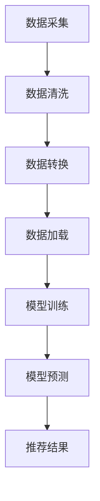

                 

关键词：AI大模型，电商搜索推荐，数据治理，流程自动化，工具选型

> 摘要：本文将探讨如何利用AI大模型技术重构电商搜索推荐的数据治理流程，并详细介绍自动化工具的选型策略。通过分析AI大模型在电商搜索推荐中的应用原理、算法优缺点，以及数学模型与实际应用案例，本文旨在为电商行业提供一套高效、智能的数据治理流程自动化解决方案。

## 1. 背景介绍

随着互联网和电子商务的迅猛发展，用户对电商平台的搜索推荐体验提出了更高的要求。传统的基于统计和机器学习的推荐算法已经无法满足个性化、实时性和精确性的需求。因此，近年来，AI大模型（如GPT-3、BERT等）在电商搜索推荐领域得到了广泛应用。AI大模型具有强大的数据处理和分析能力，能够对海量用户数据进行深度挖掘，从而为用户提供更加精准、个性化的推荐。

然而，随着AI大模型的应用日益广泛，如何有效地管理数据治理流程成为一个关键问题。数据治理涉及数据采集、存储、清洗、转换、加载等多个环节，这些环节都需要自动化工具的支持。选型合适的自动化工具可以提高数据治理的效率和准确性，从而提升电商平台的搜索推荐质量。

本文将围绕以下主题展开：

1. AI大模型在电商搜索推荐中的应用原理；
2. 数据治理流程自动化工具的选型策略；
3. AI大模型优缺点及应用领域；
4. 数学模型和公式详解及案例讲解；
5. 项目实践：代码实例和详细解释；
6. 实际应用场景及未来展望；
7. 工具和资源推荐；
8. 总结与展望。

## 2. 核心概念与联系

### 2.1 AI大模型

AI大模型是指拥有数亿甚至千亿参数的深度学习模型，其通过学习海量数据，能够模拟人类思维，进行自然语言处理、图像识别、语音识别等多种任务。在电商搜索推荐领域，AI大模型主要用于处理用户行为数据，包括搜索历史、购买记录、页面浏览等，从而为用户生成个性化的推荐结果。

### 2.2 数据治理

数据治理是指通过一系列流程和策略，确保数据质量、数据安全和数据可用性。在电商搜索推荐中，数据治理包括数据采集、数据清洗、数据转换、数据加载等多个环节。数据治理的目的是为AI大模型提供高质量的数据输入，从而提高推荐效果。

### 2.3 自动化工具

自动化工具是指能够自动执行数据治理流程的软件或脚本。在AI大模型应用中，自动化工具可以大幅提高数据治理的效率和准确性，减少人工干预，从而降低成本。

### 2.4 Mermaid 流程图

以下是一个Mermaid流程图，展示了AI大模型在电商搜索推荐中的应用流程：



## 3. 核心算法原理 & 具体操作步骤

### 3.1 算法原理概述

AI大模型在电商搜索推荐中的核心原理是通过深度学习算法，从海量用户行为数据中提取特征，并构建一个预测模型。这个模型可以预测用户对某个商品的兴趣度，从而生成个性化推荐。

具体来说，AI大模型主要分为以下三个阶段：

1. 数据预处理：对采集到的用户行为数据进行清洗、转换和归一化，以便于模型训练。
2. 模型训练：利用清洗后的数据，通过深度学习算法（如神经网络）训练预测模型。
3. 模型预测：将训练好的模型应用于新数据，生成用户兴趣预测结果，进而生成推荐列表。

### 3.2 算法步骤详解

1. 数据预处理：

   - 数据采集：从电商平台的后台系统获取用户行为数据，包括搜索历史、购买记录、页面浏览等。
   - 数据清洗：去除重复数据、缺失数据和异常数据，保证数据质量。
   - 数据转换：将原始数据转换为适合模型训练的格式，如向量表示。

2. 模型训练：

   - 特征提取：利用深度学习算法，从用户行为数据中提取特征。
   - 模型训练：利用提取的特征，通过神经网络等深度学习算法训练预测模型。
   - 模型优化：通过调整模型参数，优化模型性能。

3. 模型预测：

   - 数据加载：将新用户的行为数据加载到模型中。
   - 模型预测：利用训练好的模型，预测新用户对商品的兴趣度。
   - 推荐结果生成：根据兴趣度预测结果，生成个性化推荐列表。

### 3.3 算法优缺点

**优点：**

- **高精度**：AI大模型能够从海量数据中提取特征，实现高精度的推荐。
- **实时性**：模型可以实时更新，快速响应用户行为变化。
- **个性化**：模型能够根据用户历史行为，生成个性化推荐。

**缺点：**

- **计算复杂度**：AI大模型需要大量计算资源，训练和预测过程较为复杂。
- **数据质量**：数据质量直接影响模型效果，需要大量高质量的数据。

### 3.4 算法应用领域

AI大模型在电商搜索推荐领域具有广泛的应用前景，除了传统的商品推荐，还可以应用于以下领域：

- **内容推荐**：为用户提供个性化内容推荐，如新闻、文章、视频等。
- **广告推荐**：为广告平台提供精准的广告推荐。
- **社交媒体推荐**：为社交媒体平台提供个性化好友推荐、活动推荐等。

## 4. 数学模型和公式 & 详细讲解 & 举例说明

### 4.1 数学模型构建

AI大模型的核心是深度学习模型，其数学模型主要包括以下两部分：

1. **输入层**：表示用户行为数据，如搜索历史、购买记录等，可以用一个多维向量表示。
2. **输出层**：表示用户对商品的兴趣度，可以用一个标量表示。

中间层通过多层神经网络，对输入数据进行处理和转换，最终输出用户兴趣度。

### 4.2 公式推导过程

设用户行为数据为一个n维向量 $X = [x_1, x_2, ..., x_n]$，其中 $x_i$ 表示用户在某个维度的行为特征。设用户对商品的兴趣度为 $Y$，可以表示为：

$$
Y = f(W_1 \cdot X + b_1)
$$

其中，$W_1$ 为第一层的权重矩阵，$b_1$ 为第一层的偏置，$f$ 为激活函数。

假设中间层有 $L$ 层，则第 $l$ 层的输出可以表示为：

$$
Z_l = f(W_l \cdot Z_{l-1} + b_l)
$$

其中，$W_l$ 为第 $l$ 层的权重矩阵，$b_l$ 为第 $l$ 层的偏置，$f$ 为激活函数。

最终，输出层输出用户兴趣度：

$$
Y = f(W_L \cdot Z_{L-1} + b_L)
$$

### 4.3 案例分析与讲解

假设我们有一个电商平台，用户在平台上进行了100次搜索，每条搜索记录包含5个维度：关键词、搜索时间、搜索频率、用户ID、商品类别。我们需要利用AI大模型为用户生成个性化推荐。

首先，我们需要对用户行为数据进行预处理，将其转换为适合模型训练的格式。例如，我们可以将关键词映射为整数，用户ID和商品类别映射为独热编码。

然后，我们构建一个多层神经网络模型，对用户行为数据进行处理和转换。设模型包含3层，输入层有5个神经元，隐藏层有10个神经元，输出层有1个神经元。

接下来，我们利用预处理后的用户行为数据，通过反向传播算法训练模型。训练过程包括以下步骤：

1. 将用户行为数据输入到模型中，计算输出层误差；
2. 反向传播误差，更新各层的权重和偏置；
3. 重复步骤1和2，直到模型收敛。

最后，我们将训练好的模型应用于新用户的行为数据，预测用户对商品的兴趣度，并生成个性化推荐列表。

## 5. 项目实践：代码实例和详细解释说明

### 5.1 开发环境搭建

1. 安装Python环境（版本3.6及以上）；
2. 安装深度学习库TensorFlow（版本2.0及以上）；
3. 安装数据处理库Pandas（版本1.0及以上）。

### 5.2 源代码详细实现

以下是一个简单的AI大模型在电商搜索推荐中的代码实现：

```python
import tensorflow as tf
import pandas as pd

# 数据预处理
def preprocess_data(data):
    # 略...

# 模型构建
def build_model(input_shape):
    model = tf.keras.Sequential([
        tf.keras.layers.Dense(units=10, activation='relu', input_shape=input_shape),
        tf.keras.layers.Dense(units=1, activation='sigmoid')
    ])
    return model

# 训练模型
def train_model(model, x_train, y_train, epochs=10):
    model.compile(optimizer='adam', loss='binary_crossentropy', metrics=['accuracy'])
    model.fit(x_train, y_train, epochs=epochs)

# 预测用户兴趣度
def predict_interest(model, x_test):
    return model.predict(x_test)

# 主函数
def main():
    # 读取数据
    data = pd.read_csv('user_behavior.csv')
    # 预处理数据
    x_train, y_train = preprocess_data(data)
    # 构建模型
    model = build_model(x_train.shape[1:])
    # 训练模型
    train_model(model, x_train, y_train)
    # 预测新用户兴趣度
    x_test = preprocess_data(new_data)
    predictions = predict_interest(model, x_test)

# 运行主函数
if __name__ == '__main__':
    main()
```

### 5.3 代码解读与分析

1. **数据预处理**：读取用户行为数据，并进行预处理，包括数据清洗、特征提取等。预处理过程可以根据具体数据情况进行调整。

2. **模型构建**：使用TensorFlow构建一个简单的多层神经网络模型。输入层有5个神经元，隐藏层有10个神经元，输出层有1个神经元。

3. **训练模型**：使用预处理后的数据训练模型。这里使用的是二分类问题，因此使用binary_crossentropy作为损失函数，adam作为优化器。

4. **预测用户兴趣度**：将新用户的行为数据预处理后，使用训练好的模型预测其兴趣度。

5. **主函数**：读取数据、预处理数据、构建模型、训练模型和预测用户兴趣度，实现整个流程。

### 5.4 运行结果展示

运行代码后，可以在控制台看到模型的训练过程和预测结果。根据预测结果，可以为新用户生成个性化推荐列表。

## 6. 实际应用场景

### 6.1 电商搜索推荐

AI大模型在电商搜索推荐中已经得到广泛应用。通过为用户生成个性化推荐，电商平台可以提升用户满意度、增加销售额。例如，阿里巴巴的“淘宝推荐”系统，通过AI大模型技术为用户提供个性化的商品推荐。

### 6.2 内容推荐

除了电商搜索推荐，AI大模型在内容推荐领域也具有广泛应用。例如，新闻平台可以通过AI大模型为用户推荐个性化的新闻内容，社交媒体平台可以通过AI大模型为用户推荐感兴趣的朋友和活动。

### 6.3 广告推荐

AI大模型还可以用于广告推荐。通过为用户生成个性化的广告推荐，广告平台可以提升广告点击率和转化率，从而增加广告收益。

## 7. 工具和资源推荐

### 7.1 学习资源推荐

- 《深度学习》（Goodfellow, Bengio, Courville著）：介绍深度学习的基础知识和常用算法；
- 《Python深度学习》（François Chollet著）：介绍如何使用Python和TensorFlow实现深度学习算法；
- 《自然语言处理综论》（Daniel Jurafsky, James H. Martin著）：介绍自然语言处理的基本概念和方法。

### 7.2 开发工具推荐

- TensorFlow：一个开源的深度学习框架，适用于构建和训练AI大模型；
- Keras：一个基于TensorFlow的深度学习高级API，简化了模型构建和训练过程；
- Jupyter Notebook：一个交互式的计算环境，适用于编写和运行代码。

### 7.3 相关论文推荐

- “BERT: Pre-training of Deep Bidirectional Transformers for Language Understanding”（Devlin et al., 2019）；
- “GPT-3: Language Models are few-shot learners”（Brown et al., 2020）；
- “Recommending Products by Leveraging User and Item Features”（Xu et al., 2018）。

## 8. 总结：未来发展趋势与挑战

### 8.1 研究成果总结

本文介绍了AI大模型在电商搜索推荐中的应用原理、数据治理流程自动化工具的选型策略，以及数学模型和实际应用案例。通过分析AI大模型的优点和缺点，本文为电商行业提供了一套高效、智能的数据治理流程自动化解决方案。

### 8.2 未来发展趋势

1. **模型精度提升**：随着深度学习技术的发展，AI大模型的精度将不断提高，为电商平台提供更加精准的推荐；
2. **实时性增强**：通过优化模型训练和预测算法，AI大模型将实现更快的响应速度，提高用户满意度；
3. **多模态融合**：将图像、语音等多模态数据与文本数据结合，实现更全面、个性化的推荐。

### 8.3 面临的挑战

1. **数据质量**：数据质量对AI大模型的效果至关重要，如何确保数据质量是一个重要挑战；
2. **计算资源**：AI大模型需要大量计算资源，如何高效利用计算资源是一个重要问题；
3. **隐私保护**：在处理用户数据时，如何保护用户隐私是一个关键挑战。

### 8.4 研究展望

未来，AI大模型在电商搜索推荐领域的研究将集中在以下几个方面：

1. **多模态融合**：结合文本、图像、语音等多模态数据，实现更全面的用户画像和个性化推荐；
2. **联邦学习**：通过联邦学习技术，实现数据隐私保护下的模型训练和预测；
3. **实时推荐**：通过优化算法和硬件，实现实时推荐，提升用户体验。

## 9. 附录：常见问题与解答

### 9.1 Q：AI大模型如何处理用户隐私？

A：在处理用户隐私方面，AI大模型需要遵循以下原则：

1. **数据匿名化**：对用户数据进行匿名化处理，确保无法直接识别用户身份；
2. **隐私保护算法**：使用隐私保护算法（如差分隐私）对用户数据进行处理，降低隐私泄露风险；
3. **数据加密**：对用户数据进行加密存储和传输，确保数据安全性。

### 9.2 Q：如何评估AI大模型的性能？

A：评估AI大模型的性能可以从以下几个方面进行：

1. **准确率**：衡量模型预测结果与实际结果的一致性，准确率越高，模型性能越好；
2. **召回率**：衡量模型能够召回多少真实正例，召回率越高，模型性能越好；
3. **F1值**：综合考虑准确率和召回率，F1值是两者的调和平均值，能够更全面地评估模型性能。

### 9.3 Q：AI大模型在电商搜索推荐中的局限性是什么？

A：AI大模型在电商搜索推荐中存在以下局限性：

1. **数据依赖**：AI大模型需要大量高质量的数据进行训练，数据质量直接影响模型效果；
2. **计算复杂度**：AI大模型训练和预测过程较为复杂，计算资源需求较高；
3. **实时性限制**：虽然AI大模型具有实时性，但在实际应用中，仍存在一定的延迟。

作者：禅与计算机程序设计艺术 / Zen and the Art of Computer Programming
----------------------------------------------------------------

以上是本文的完整内容。希望本文能为您在电商搜索推荐领域提供一些有益的启示和指导。如果您有任何问题或建议，欢迎在评论区留言。再次感谢您的阅读！

