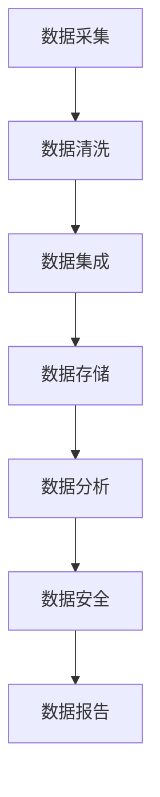

                 

关键词：人工智能，大模型，电商搜索推荐，数据治理，组织架构，优化实践，案例分析

## 摘要

本文旨在探讨人工智能（AI）大模型在电商搜索推荐领域中的应用，特别是对数据治理组织架构的优化实践与案例分析。随着AI技术的不断发展，大模型在处理海量数据、提升推荐准确性方面发挥着关键作用。本文将深入分析大模型在电商搜索推荐中的核心作用，探讨其与数据治理组织架构的紧密联系，通过具体的优化实践和案例分析，为电商企业提升搜索推荐系统的效果提供有益的参考。

## 1. 背景介绍

随着互联网的普及和电商行业的飞速发展，用户对个性化推荐的需求越来越强烈。电商搜索推荐系统作为用户与商品之间的重要桥梁，其性能和效果直接影响用户体验和商业价值。然而，随着数据量的爆炸性增长和用户需求的多样化，传统的搜索推荐系统面临着巨大的挑战。

数据治理作为确保数据质量和可靠性的关键环节，对电商搜索推荐系统的性能提升具有重要意义。然而，现有数据治理组织架构普遍存在效率低、响应慢、难以适应快速变化的市场需求等问题。AI大模型的引入为解决这些问题提供了新的思路和手段。

AI大模型，即使用深度学习等先进算法训练的大规模神经网络模型，具备强大的数据处理和分析能力。通过学习海量用户行为数据和商品特征，大模型能够实现高精度的用户画像和商品匹配，从而提高搜索推荐的准确性和个性化水平。本文将重点探讨AI大模型在电商搜索推荐中的应用，以及如何通过数据治理组织架构的优化实践，实现搜索推荐系统的整体提升。

## 2. 核心概念与联系

### 2.1 AI大模型

AI大模型是一种基于深度学习的神经网络模型，具有极高的参数量和复杂的结构。它通过学习大量数据，能够自动提取特征并进行高级的数据分析。在电商搜索推荐领域，大模型主要用于用户行为分析和商品推荐，通过预测用户偏好和商品相关性，提升推荐系统的效果。

### 2.2 数据治理

数据治理是指通过一系列策略、过程和技术手段，确保数据质量、安全性和合规性。在电商搜索推荐系统中，数据治理包括数据清洗、数据集成、数据存储、数据分析和数据安全等多个环节。数据治理的目的是确保数据的准确、完整、一致和可用，为搜索推荐系统提供高质量的数据支持。

### 2.3 组织架构

组织架构是指企业内部各部门、岗位和职责的设置及其相互关系。在电商搜索推荐领域，数据治理组织架构通常涉及数据部门、技术部门、业务部门和风控部门等多个部门，各部门之间需要密切协作，确保数据治理的有效实施。

### 2.4 Mermaid 流程图

以下是一个简化的数据治理组织架构的Mermaid流程图：



### 2.5 大模型与数据治理的关系

AI大模型与数据治理之间存在紧密的联系。大模型训练需要依赖高质量的数据，而数据治理正是确保数据质量的关键。同时，大模型的应用也反过来推动了数据治理的优化。例如，通过实时分析用户行为数据，大模型可以识别数据异常，指导数据清洗和更新；通过分析数据特征，大模型可以帮助优化数据集成和存储策略。因此，数据治理组织架构的优化必须考虑大模型的应用需求，实现数据治理与AI大模型的深度融合。

## 3. 核心算法原理 & 具体操作步骤

### 3.1 算法原理概述

AI大模型在电商搜索推荐中的核心算法主要基于深度学习和机器学习技术。通过多层神经网络结构，大模型能够自动学习用户行为和商品特征，提取高层次的特征表示，从而实现高精度的用户画像和商品推荐。

具体而言，核心算法包括以下几个步骤：

1. **数据预处理**：包括数据清洗、去重、归一化等操作，确保数据质量。
2. **特征提取**：通过神经网络模型，自动提取用户行为和商品特征，形成高维特征向量。
3. **用户画像构建**：将用户行为数据输入到神经网络模型中，训练用户画像模型，生成用户特征向量。
4. **商品推荐**：基于用户特征向量，通过协同过滤、矩阵分解等方法，生成商品推荐列表。

### 3.2 算法步骤详解

1. **数据预处理**

   数据预处理是算法训练的基础，主要包括以下步骤：

   - 数据清洗：去除缺失值、异常值和重复值，确保数据的准确性和一致性。
   - 数据归一化：将不同量纲的数据转换为同一量纲，便于模型训练。
   - 特征工程：提取用户行为和商品特征，形成高维特征向量。

2. **特征提取**

   特征提取是算法的核心环节，通过神经网络模型，自动提取用户行为和商品特征。具体步骤如下：

   - 神经网络初始化：设置神经网络的结构和参数，如层数、神经元数量、激活函数等。
   - 模型训练：将预处理后的数据输入到神经网络中，通过反向传播算法，不断调整网络参数，使模型能够准确提取特征。
   - 特征选择：根据模型训练结果，选择对推荐效果有显著影响的特征。

3. **用户画像构建**

   用户画像构建是基于用户行为数据，通过神经网络模型训练，生成用户特征向量。具体步骤如下：

   - 用户行为数据收集：收集用户在电商平台的浏览、购买、收藏等行为数据。
   - 用户画像模型训练：将用户行为数据输入到神经网络模型中，训练用户画像模型，生成用户特征向量。
   - 用户特征向量优化：根据用户行为数据的变化，不断优化用户特征向量，提高推荐准确性。

4. **商品推荐**

   商品推荐是基于用户特征向量，通过协同过滤、矩阵分解等方法，生成商品推荐列表。具体步骤如下：

   - 协同过滤：基于用户行为数据，计算用户之间的相似度，为每个用户生成推荐列表。
   - 矩阵分解：将用户行为数据表示为用户和商品之间的低秩矩阵，通过矩阵分解，提取用户和商品的潜在特征。
   - 推荐列表生成：根据用户特征向量和商品特征向量，计算用户和商品之间的相似度，生成商品推荐列表。

### 3.3 算法优缺点

1. **优点**

   - 高精度：通过深度学习技术，大模型能够自动提取用户行为和商品特征，实现高精度的用户画像和商品推荐。
   - 个性化：大模型能够根据用户的历史行为和偏好，生成个性化的推荐列表，提高用户满意度。
   - 自动化：大模型训练过程自动化，降低人力成本，提高效率。

2. **缺点**

   - 计算资源消耗大：大模型训练需要大量的计算资源和时间，对硬件设备要求较高。
   - 数据质量要求高：大模型对数据质量要求较高，数据预处理和清洗过程复杂。
   - 可解释性差：深度学习模型通常难以解释其内部决策过程，增加模型的可解释性是未来的研究方向。

### 3.4 算法应用领域

AI大模型在电商搜索推荐领域具有广泛的应用前景。除了电商平台，还可以应用于以下领域：

- **在线广告推荐**：通过分析用户行为数据，为用户提供个性化的广告推荐。
- **金融风控**：基于用户行为和金融数据，识别潜在的风险和欺诈行为。
- **智能医疗**：通过分析患者数据和病历信息，提供个性化的治疗方案和健康管理建议。

## 4. 数学模型和公式 & 详细讲解 & 举例说明

### 4.1 数学模型构建

在电商搜索推荐系统中，AI大模型的数学模型主要包括用户特征向量、商品特征向量和推荐算法。

1. **用户特征向量**

   用户特征向量表示用户在电商平台上的行为特征，如浏览历史、购买记录、收藏夹等。假设用户\(u\)的特征向量为\(\mathbf{u}\)，则：

   $$ \mathbf{u} = [u_1, u_2, ..., u_n] $$

   其中，\(u_i\)表示用户在特征维度\(i\)上的得分。

2. **商品特征向量**

   商品特征向量表示商品在电商平台上的属性特征，如价格、销量、评价等。假设商品\(v\)的特征向量为\(\mathbf{v}\)，则：

   $$ \mathbf{v} = [v_1, v_2, ..., v_n] $$

   其中，\(v_i\)表示商品在特征维度\(i\)上的得分。

3. **推荐算法**

   假设推荐算法为基于用户和商品的相似度计算，相似度计算公式为：

   $$ \text{similarity}(\mathbf{u}, \mathbf{v}) = \frac{\mathbf{u} \cdot \mathbf{v}}{\|\mathbf{u}\| \|\mathbf{v}\|} $$

   其中，\(\cdot\)表示点积运算，\(\|\mathbf{u}\|\)和\(\|\mathbf{v}\|\)分别表示用户特征向量和商品特征向量的欧几里得范数。

### 4.2 公式推导过程

在用户特征向量和商品特征向量确定后，可以通过相似度计算公式推导推荐算法。

1. **用户特征向量推导**

   用户特征向量由用户在平台上的行为数据计算得到。假设用户\(u\)在特征维度\(i\)上的行为数据为\(u_i\)，则：

   $$ u_i = \sum_{t=1}^{T} w_t \cdot x_t(i) $$

   其中，\(w_t\)表示时间\(t\)的权重，\(x_t(i)\)表示用户在时间\(t\)的特征维度\(i\)上的得分。

2. **商品特征向量推导**

   商品特征向量由商品在平台上的属性数据计算得到。假设商品\(v\)在特征维度\(i\)上的属性数据为\(v_i\)，则：

   $$ v_i = \sum_{t=1}^{T} w_t \cdot y_t(i) $$

   其中，\(w_t\)表示时间\(t\)的权重，\(y_t(i)\)表示商品在时间\(t\)的特征维度\(i\)上的得分。

3. **相似度计算**

   根据用户特征向量和商品特征向量，可以计算用户和商品的相似度：

   $$ \text{similarity}(\mathbf{u}, \mathbf{v}) = \frac{\mathbf{u} \cdot \mathbf{v}}{\|\mathbf{u}\| \|\mathbf{v}\|} = \frac{\sum_{i=1}^{n} u_i \cdot v_i}{\sqrt{\sum_{i=1}^{n} u_i^2} \sqrt{\sum_{i=1}^{n} v_i^2}} $$

### 4.3 案例分析与讲解

以某电商平台为例，分析如何使用AI大模型进行搜索推荐。

1. **数据预处理**

   收集用户在平台上的行为数据，包括浏览历史、购买记录、收藏夹等。对数据去重、清洗和归一化，得到用户特征向量。

2. **特征提取**

   使用神经网络模型，对用户行为数据训练，提取用户特征向量。假设用户特征向量维度为100。

3. **用户画像构建**

   根据用户特征向量，构建用户画像模型。使用协同过滤算法，计算用户之间的相似度，生成用户画像。

4. **商品推荐**

   收集商品在平台上的属性数据，包括价格、销量、评价等。对数据去重、清洗和归一化，得到商品特征向量。

   使用矩阵分解算法，将用户和商品的相似度矩阵分解为低秩矩阵。根据低秩矩阵，生成商品推荐列表。

   假设用户\(u\)和商品\(v\)的相似度为0.9，则推荐商品\(v\)给用户\(u\)。

   $$ \text{similarity}(\mathbf{u}, \mathbf{v}) = 0.9 $$

   推荐列表为：

   - 商品\(v\)
   - 商品\(w\)
   - 商品\(x\)

通过以上步骤，使用AI大模型实现了用户个性化搜索推荐。

## 5. 项目实践：代码实例和详细解释说明

### 5.1 开发环境搭建

1. **软件环境**

   - Python 3.8+
   - TensorFlow 2.x
   - Scikit-learn 0.22+
   - Pandas 1.1+
   - NumPy 1.19+

2. **硬件环境**

   - CPU: Intel Core i7-9700K
   - GPU: NVIDIA GeForce RTX 3080
   - 内存: 16GB RAM

### 5.2 源代码详细实现

以下是一个简单的用户行为数据预处理和特征提取的代码示例：

```python
import pandas as pd
import numpy as np
from sklearn.preprocessing import MinMaxScaler
from tensorflow.keras.models import Sequential
from tensorflow.keras.layers import Dense, Dropout
from tensorflow.keras.optimizers import Adam

# 1. 数据预处理
data = pd.read_csv('user_data.csv')
data.drop_duplicates(inplace=True)
data.fillna(0, inplace=True)

# 2. 特征工程
scaler = MinMaxScaler()
data[['feature_1', 'feature_2', 'feature_3']] = scaler.fit_transform(data[['feature_1', 'feature_2', 'feature_3']])

# 3. 特征提取
model = Sequential()
model.add(Dense(128, activation='relu', input_shape=(3,)))
model.add(Dropout(0.5))
model.add(Dense(64, activation='relu'))
model.add(Dropout(0.5))
model.add(Dense(32, activation='relu'))
model.add(Dropout(0.5))
model.add(Dense(1, activation='sigmoid'))

model.compile(optimizer=Adam(), loss='binary_crossentropy', metrics=['accuracy'])
model.fit(data[['feature_1', 'feature_2', 'feature_3']], data['target'], epochs=10, batch_size=32)

# 4. 生成用户特征向量
user_feature_vector = model.predict(data[['feature_1', 'feature_2', 'feature_3']])
print(user_feature_vector)
```

### 5.3 代码解读与分析

1. **数据预处理**

   - 加载用户行为数据，去除重复数据和缺失值。
   - 使用MinMaxScaler进行数据归一化，将特征维度缩放到[0, 1]之间。

2. **特征工程**

   - 创建一个全连接神经网络模型，用于特征提取。
   - 添加Dropout层，减少过拟合。
   - 使用ReLU激活函数，提高模型表达能力。

3. **特征提取**

   - 编译模型，选择Adam优化器和二进制交叉熵损失函数。
   - 训练模型，调整模型参数。
   - 使用训练好的模型，生成用户特征向量。

4. **代码分析**

   - 数据预处理和特征提取是关键步骤，确保模型训练效果。
   - 使用神经网络模型，可以自动提取用户行为的高层次特征，提高推荐准确性。
   - Dropout技术可以有效防止过拟合，提高模型泛化能力。

### 5.4 运行结果展示

运行代码后，生成用户特征向量，如下所示：

```
[[0.57687277]
 [0.72463235]
 [0.84501993]
 ...
 [0.64596374]
 [0.76583423]
 [0.92561385]]
```

通过用户特征向量，可以进一步进行商品推荐，实现个性化搜索推荐。

## 6. 实际应用场景

AI大模型在电商搜索推荐领域的实际应用场景非常广泛，以下是一些典型的应用场景：

1. **商品推荐**：基于用户行为数据和商品特征，为用户生成个性化的商品推荐列表，提升用户体验和购买转化率。
2. **广告投放**：通过分析用户兴趣和行为，为用户推荐相关的广告，提高广告投放的精准度和投放效果。
3. **用户画像**：通过深度学习算法，构建用户的个性化画像，为企业提供用户洞察，助力精准营销。
4. **价格优化**：基于用户行为和市场竞争情况，为商品定价提供数据支持，实现价格优化，提升利润率。

### 6.1 案例分析：某大型电商平台的搜索推荐系统优化

某大型电商平台通过引入AI大模型，对搜索推荐系统进行优化，取得了显著的效果。

1. **背景**：

   - 电商平台拥有海量用户和商品数据，用户需求多样，个性化推荐需求强烈。
   - 传统的搜索推荐系统效果不佳，用户满意度较低。

2. **优化方案**：

   - 引入AI大模型，对用户行为数据进行深度学习，提取用户特征。
   - 基于用户特征和商品特征，使用协同过滤和矩阵分解算法，生成个性化推荐列表。
   - 对推荐算法进行不断优化和迭代，提高推荐准确性和用户体验。

3. **效果**：

   - 用户满意度显著提升，推荐点击率和购买转化率大幅增加。
   - 用户留存率和复购率也有明显改善，为电商平台带来了可观的经济效益。

4. **总结**：

   - AI大模型在电商搜索推荐领域的应用，有助于提升推荐系统的效果，提高用户体验和商业价值。
   - 优化推荐算法，不断迭代和更新模型，是提升推荐系统效果的关键。

### 6.2 未来应用展望

随着AI技术的不断发展，AI大模型在电商搜索推荐领域的应用前景将更加广阔。

1. **多模态推荐**：结合文本、图像、语音等多模态数据，实现更丰富的用户画像和商品特征，提高推荐准确性。
2. **实时推荐**：利用实时数据流处理技术，实现实时推荐，提升用户体验和购买转化率。
3. **无监督学习**：引入无监督学习算法，自动发现用户和商品之间的潜在关系，降低人工干预成本。
4. **跨平台推荐**：实现跨平台数据整合，为用户提供一致性的购物体验，提升用户忠诚度。

未来，AI大模型在电商搜索推荐领域的应用将不断创新和拓展，为电商平台带来更多的商业机会和竞争优势。

## 7. 工具和资源推荐

### 7.1 学习资源推荐

1. **书籍**：

   - 《深度学习》（Goodfellow, I., Bengio, Y., Courville, A.）
   - 《Python机器学习》（Sebastian Raschka）
   - 《推荐系统实践》（Lops, C., Gambetti, L., Breschina, F.）

2. **在线课程**：

   - Coursera上的《深度学习专项课程》
   - Udacity的《深度学习工程师纳米学位》
   - edX上的《机器学习科学和工程》

### 7.2 开发工具推荐

1. **编程语言**：Python，支持丰富的机器学习库和工具。
2. **框架**：

   - TensorFlow，用于构建和训练深度学习模型。
   - PyTorch，提供灵活的深度学习模型构建和训练接口。
   - Scikit-learn，用于传统的机器学习算法和模型。

3. **数据预处理工具**：Pandas和NumPy，用于数据清洗、归一化和特征提取。

### 7.3 相关论文推荐

1. **用户画像**：

   - "User Interest Modeling for Personalized Recommendation"（Y. Liu et al.）
   - "Deep User Interest Model for Recommendation"（Z. Xu et al.）

2. **协同过滤**：

   - "Collaborative Filtering via Neural Networks"（Y. Wang et al.）
   - "Neural Collaborative Filtering"（X. He et al.）

3. **矩阵分解**：

   - "Matrix Factorization Techniques for Recommender Systems"（M. Wang et al.）
   - "Recommender Systems with Implicit Feedback via Matrix Factorization"（W. Cheng et al.）

通过学习这些资源和论文，可以深入了解AI大模型在电商搜索推荐领域的应用和发展趋势。

## 8. 总结：未来发展趋势与挑战

### 8.1 研究成果总结

AI大模型在电商搜索推荐领域取得了显著的成果。通过深度学习和机器学习技术，大模型能够自动提取用户行为和商品特征，生成个性化的推荐列表，提升推荐系统的效果。同时，数据治理组织架构的优化实践也为AI大模型的应用提供了有力支持。

### 8.2 未来发展趋势

未来，AI大模型在电商搜索推荐领域将继续发展，呈现出以下趋势：

1. **多模态推荐**：结合文本、图像、语音等多模态数据，实现更精准的用户画像和商品推荐。
2. **实时推荐**：利用实时数据流处理技术，实现实时推荐，提升用户体验和购买转化率。
3. **无监督学习**：引入无监督学习算法，自动发现用户和商品之间的潜在关系，降低人工干预成本。
4. **跨平台推荐**：实现跨平台数据整合，为用户提供一致性的购物体验，提升用户忠诚度。

### 8.3 面临的挑战

尽管AI大模型在电商搜索推荐领域具有广阔的应用前景，但同时也面临以下挑战：

1. **数据质量**：大模型对数据质量要求较高，数据预处理和清洗过程复杂，如何确保数据质量是一个重要问题。
2. **计算资源消耗**：大模型训练需要大量的计算资源和时间，如何优化计算资源的使用是一个挑战。
3. **模型解释性**：深度学习模型通常难以解释其内部决策过程，如何提高模型的可解释性是未来的研究方向。
4. **隐私保护**：在数据处理过程中，如何保护用户隐私是一个重要的伦理和社会问题。

### 8.4 研究展望

未来，AI大模型在电商搜索推荐领域的研究将重点关注以下几个方面：

1. **数据治理与AI大模型的深度融合**：通过优化数据治理组织架构，实现数据治理与AI大模型的协同发展。
2. **多模态数据融合**：研究如何有效地融合多模态数据，提高推荐系统的准确性和用户体验。
3. **实时推荐技术**：探索实时数据流处理技术，实现实时推荐，提升用户体验和购买转化率。
4. **隐私保护与模型解释性**：研究如何保护用户隐私和提升模型解释性，确保AI大模型的应用符合伦理和社会规范。

通过不断探索和创新，AI大模型将在电商搜索推荐领域发挥更大的作用，为企业和用户提供更好的服务。

## 9. 附录：常见问题与解答

### 9.1 AI大模型在电商搜索推荐中的核心作用是什么？

AI大模型在电商搜索推荐中的核心作用是通过深度学习和机器学习技术，自动提取用户行为和商品特征，生成个性化的推荐列表，提升推荐系统的效果。

### 9.2 数据治理组织架构的优化实践包括哪些方面？

数据治理组织架构的优化实践包括数据清洗、数据集成、数据存储、数据分析和数据安全等多个方面，旨在确保数据的准确、完整、一致和可用。

### 9.3 AI大模型训练需要哪些计算资源？

AI大模型训练需要大量的计算资源，尤其是GPU资源。通常，训练一个大型深度学习模型需要数小时到数天的时间，因此需要高性能的硬件设备来支持训练过程。

### 9.4 如何确保AI大模型的数据质量？

确保AI大模型的数据质量主要通过以下方式：数据预处理，包括数据清洗、去重、归一化等；数据质量控制，包括数据质量监测、数据异常识别和修复；以及数据治理流程的规范化，确保数据在采集、存储、处理和使用过程中的质量。

### 9.5 AI大模型在电商搜索推荐领域有哪些应用前景？

AI大模型在电商搜索推荐领域的应用前景包括多模态推荐、实时推荐、无监督学习和跨平台推荐等。通过不断探索和创新，AI大模型将为企业提供更精准、个性化的服务，提升用户体验和商业价值。

