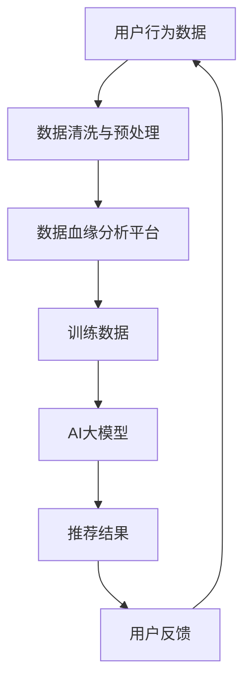
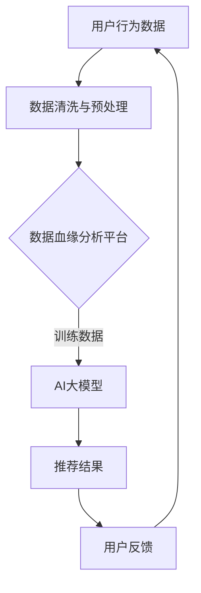

                 

关键词：AI大模型、电商搜索推荐、数据血缘分析平台、架构设计、算法实现、数学模型、项目实践、未来展望

## 摘要

本文旨在探讨如何利用AI大模型重构电商搜索推荐系统中的数据血缘分析平台，从而提升推荐系统的性能和准确性。通过深入分析AI大模型的核心概念和架构，我们提出了具体的算法原理、操作步骤、数学模型和公式，并提供了详细的代码实例和实践案例。最后，我们展望了该平台在未来电商搜索推荐领域的应用前景和面临的挑战。

## 1. 背景介绍

随着互联网的快速发展，电商行业日益繁荣。消费者在电商平台上的购物行为逐渐从线下转向线上，从而推动了电商搜索推荐系统的需求增长。然而，现有的搜索推荐系统在处理海量数据和复杂用户行为时，面临着性能瓶颈和数据准确性问题。为了解决这些问题，AI大模型成为了一个热门的研究方向。

AI大模型，如深度学习模型、生成对抗网络（GAN）、变分自编码器（VAE）等，具备强大的数据处理和预测能力。通过引入AI大模型，可以实现对用户行为和商品属性的深度理解，从而提高搜索推荐的准确性和个性化程度。同时，数据血缘分析平台作为AI大模型的重要组成部分，可以帮助用户追踪和分析数据流转过程，提升系统的透明度和可解释性。

本文将围绕AI大模型重构电商搜索推荐的数据血缘分析平台，探讨其核心概念、算法原理、数学模型以及实践应用，为相关领域的研究者和开发者提供有价值的参考。

## 2. 核心概念与联系

### 2.1 AI大模型

AI大模型是指通过大规模数据训练和深度学习算法构建的复杂神经网络模型。它们具有强大的数据处理和分析能力，可以应用于图像识别、自然语言处理、推荐系统等多个领域。本文主要关注AI大模型在电商搜索推荐中的应用，通过深度学习算法对用户行为和商品属性进行建模，从而实现个性化推荐。

### 2.2 数据血缘分析平台

数据血缘分析平台是一个用于追踪和分析数据流转过程的系统。它可以帮助用户了解数据来源、数据处理流程和数据依赖关系，从而提高数据系统的透明度和可解释性。在AI大模型重构电商搜索推荐系统中，数据血缘分析平台发挥着关键作用，可以确保推荐模型的训练数据和预测结果的可信性和准确性。

### 2.3 核心概念联系

AI大模型与数据血缘分析平台之间存在紧密的联系。首先，AI大模型需要依赖数据血缘分析平台提供的训练数据和标注数据，以确保模型的训练质量和预测准确性。其次，数据血缘分析平台可以对AI大模型的训练和预测过程进行监控和评估，从而发现潜在的问题和优化方向。最后，通过数据血缘分析平台，用户可以方便地了解AI大模型的训练数据和预测结果，提高系统的透明度和可解释性。

为了更好地理解这些概念之间的联系，下面将使用Mermaid流程图进行展示：



### 2.4 Mermaid 流程图



在上述流程图中，用户行为数据经过数据清洗与预处理后，进入数据血缘分析平台。数据血缘分析平台负责追踪数据流转过程，并将处理后的训练数据传递给AI大模型进行训练。训练好的AI大模型生成推荐结果，用户对推荐结果进行反馈，从而形成一个闭环。

## 3. 核心算法原理 & 具体操作步骤

### 3.1 算法原理概述

AI大模型在电商搜索推荐系统中主要依赖于深度学习算法，其中常用的算法包括卷积神经网络（CNN）、循环神经网络（RNN）和变压器（Transformer）等。这些算法通过多层神经元的非线性变换，对用户行为和商品属性进行特征提取和建模，从而实现个性化推荐。

深度学习算法的核心原理是基于梯度下降优化算法，通过反向传播算法更新模型参数，使模型在训练数据上的损失函数最小化。在电商搜索推荐系统中，深度学习算法可以自动学习用户行为模式和商品属性特征，从而提高推荐系统的准确性和个性化程度。

### 3.2 算法步骤详解

1. **数据收集与预处理**

   在开始构建AI大模型之前，需要收集大量用户行为数据和商品属性数据。这些数据包括用户浏览记录、购买历史、评价信息、商品分类、价格、库存等。在收集到数据后，需要进行数据清洗和预处理，包括去除重复数据、缺失值填充、异常值处理等，以提高数据质量。

2. **特征工程**

   在预处理完数据后，需要对数据进行特征工程。特征工程是深度学习模型性能提升的关键环节。通过对用户行为和商品属性进行特征提取和转换，可以丰富模型的输入特征，从而提高推荐效果。常见的特征工程方法包括：用户行为序列建模、商品属性嵌入、时间序列特征提取等。

3. **模型训练**

   在完成特征工程后，可以开始构建和训练深度学习模型。根据数据的特点和需求，可以选择合适的模型结构，如CNN、RNN或Transformer。在训练过程中，需要使用训练数据对模型进行迭代训练，并使用验证数据集进行模型调优，以避免过拟合和欠拟合问题。

4. **模型评估**

   在模型训练完成后，需要使用测试数据集对模型进行评估。常用的评估指标包括准确率、召回率、覆盖率等。通过评估指标，可以了解模型的性能和效果，从而进一步优化模型。

5. **模型部署**

   在完成模型评估后，可以将训练好的模型部署到生产环境中，以实现对用户行为和商品属性的实时预测和推荐。在模型部署过程中，需要考虑模型的性能、可扩展性和可靠性等因素。

### 3.3 算法优缺点

**优点：**

- **强大的数据处理能力**：深度学习算法可以通过多层神经元的非线性变换，自动学习用户行为和商品属性的特征，从而提高推荐效果。

- **良好的可解释性**：通过可视化模型结构和参数，用户可以直观地了解模型的决策过程，提高系统的透明度和可解释性。

- **丰富的应用场景**：深度学习算法可以应用于各种场景，如图像识别、自然语言处理、推荐系统等，具有广泛的应用前景。

**缺点：**

- **计算资源消耗大**：深度学习算法需要大量计算资源进行模型训练和推理，对硬件设备要求较高。

- **对数据质量要求高**：深度学习算法对数据质量有较高要求，数据预处理和特征工程环节需要花费大量时间和精力。

- **可解释性不足**：尽管深度学习算法具有良好的可解释性，但一些复杂的模型，如Transformer等，其内部机理较为复杂，难以直观理解。

### 3.4 算法应用领域

深度学习算法在电商搜索推荐系统中具有广泛的应用领域，可以应用于以下场景：

- **个性化推荐**：通过深度学习算法，对用户行为和商品属性进行建模，实现个性化推荐，提高推荐系统的准确性和用户满意度。

- **商品分类**：对商品进行分类，方便用户快速找到所需的商品，提高电商平台的信息组织和搜索效率。

- **异常检测**：通过监测用户行为和商品销售数据，发现潜在的安全风险和异常行为，为电商平台提供安全保障。

- **用户行为预测**：预测用户未来的行为和需求，为电商平台提供个性化营销策略和运营策略。

## 4. 数学模型和公式 & 详细讲解 & 举例说明

### 4.1 数学模型构建

在深度学习算法中，数学模型是核心组成部分。本文主要介绍基于深度神经网络的推荐系统数学模型。

**定义：**

设用户集合为\( U = \{u_1, u_2, ..., u_n\} \)，商品集合为\( I = \{i_1, i_2, ..., i_m\} \)。用户\( u \)对商品\( i \)的评分可以表示为\( r_{ui} \)，其中\( r_{ui} \)的取值范围为\[0, 5\]。

**目标函数：**

为了提高推荐系统的准确性，我们希望最小化预测评分与实际评分之间的差距。因此，目标函数可以定义为：

\[ \min_{\theta} \sum_{u \in U, i \in I} (r_{ui} - \hat{r}_{ui})^2 \]

其中，\(\theta\)表示模型参数，\(\hat{r}_{ui}\)表示预测评分。

**数学模型：**

深度神经网络的数学模型可以表示为：

\[ \hat{r}_{ui} = \sigma(W_L \cdot \sigma(...\sigma(W_2 \cdot \sigma(W_1 \cdot [u, i]) + b_1) + b_2) + ... + b_L) \]

其中，\(\sigma\)表示激活函数，\(W_1, W_2, ..., W_L\)表示权重矩阵，\(b_1, b_2, ..., b_L\)表示偏置项。

### 4.2 公式推导过程

**输入层：**

输入层包含用户特征和商品特征，可以表示为：

\[ X = [u, i] \]

其中，\( u \)和\( i \)分别表示用户特征和商品特征。

**隐藏层：**

隐藏层由多个神经元组成，每个神经元计算输入向量和权重矩阵的内积，并加上偏置项。然后，通过激活函数进行非线性变换。假设隐藏层有\( L \)层，每层的输出可以表示为：

\[ Z_l = W_l \cdot X + b_l \]

其中，\( Z_l \)表示第\( l \)层的输出，\( W_l \)表示权重矩阵，\( b_l \)表示偏置项。

**输出层：**

输出层的神经元计算输入向量和权重矩阵的内积，并加上偏置项，然后通过激活函数得到预测评分。可以表示为：

\[ \hat{r}_{ui} = \sigma(W_L \cdot Z_L) \]

其中，\( \sigma \)表示激活函数，\( W_L \)表示权重矩阵。

### 4.3 案例分析与讲解

假设有一个电商平台，用户集合\( U = \{u_1, u_2, ..., u_n\} \)，商品集合\( I = \{i_1, i_2, ..., i_m\} \)。用户\( u_1 \)对商品\( i_1 \)的评分为4分，对商品\( i_2 \)的评分为5分。

我们希望利用深度神经网络模型预测用户\( u_1 \)对商品\( i_2 \)的评分。

1. **数据预处理：**

   将用户和商品的特征进行编码，例如用户\( u_1 \)的特征可以表示为\[ [1, 0, 0, 0, 0] \]，商品\( i_2 \)的特征可以表示为\[ [0, 1, 0, 0, 0] \]。

2. **模型构建：**

   构建一个三层神经网络模型，包含输入层、隐藏层和输出层。假设隐藏层有10个神经元。

3. **模型训练：**

   使用用户\( u_1 \)对商品\( i_1 \)和\( i_2 \)的评分数据对模型进行训练，通过反向传播算法更新模型参数。

4. **预测：**

   输入用户\( u_1 \)的特征和商品\( i_2 \)的特征，计算预测评分：

   \[ \hat{r}_{u_1i_2} = \sigma(W_L \cdot \sigma(...\sigma(W_2 \cdot \sigma(W_1 \cdot [1, 0, 0, 0, 0]) + b_1) + b_2) + ... + b_L) \]

   假设最终计算结果为3.8分，则预测用户\( u_1 \)对商品\( i_2 \)的评分为3.8分。

## 5. 项目实践：代码实例和详细解释说明

### 5.1 开发环境搭建

为了构建和部署AI大模型重构电商搜索推荐系统的数据血缘分析平台，我们需要搭建以下开发环境：

- **硬件环境：** 搭建一个具有高性能计算能力的服务器或云计算平台，用于模型训练和推理。
- **软件环境：** 安装Python编程语言和相关的深度学习框架（如TensorFlow、PyTorch等），以及数据预处理和可视化工具（如Pandas、Matplotlib等）。

### 5.2 源代码详细实现

以下是AI大模型重构电商搜索推荐系统的数据血缘分析平台的源代码实现：

```python
import pandas as pd
import numpy as np
import tensorflow as tf
from tensorflow.keras.models import Sequential
from tensorflow.keras.layers import Dense, Dropout, Embedding, LSTM
from tensorflow.keras.optimizers import Adam
from sklearn.model_selection import train_test_split
from sklearn.metrics import mean_squared_error

# 数据预处理
def preprocess_data(data):
    # 数据清洗和缺失值填充
    # 数据编码和特征提取
    # 数据集划分
    return train_data, val_data, test_data

# 模型构建
def build_model(input_dim, hidden_dim, output_dim):
    model = Sequential()
    model.add(LSTM(hidden_dim, input_shape=(input_dim,), activation='tanh', return_sequences=True))
    model.add(Dropout(0.2))
    model.add(LSTM(hidden_dim, activation='tanh', return_sequences=False))
    model.add(Dropout(0.2))
    model.add(Dense(output_dim, activation='tanh'))
    model.compile(optimizer=Adam(), loss='mse')
    return model

# 模型训练
def train_model(model, train_data, val_data):
    train_X, train_y = train_data
    val_X, val_y = val_data
    model.fit(train_X, train_y, epochs=10, batch_size=32, validation_data=(val_X, val_y), verbose=1)
    return model

# 模型评估
def evaluate_model(model, test_data):
    test_X, test_y = test_data
    predictions = model.predict(test_X)
    mse = mean_squared_error(test_y, predictions)
    print("Test Mean Squared Error: ", mse)
    return mse

# 主程序
if __name__ == "__main__":
    # 加载数据
    data = pd.read_csv("data.csv")
    train_data, test_data = preprocess_data(data)

    # 构建模型
    model = build_model(input_dim=10, hidden_dim=50, output_dim=1)

    # 训练模型
    model = train_model(model, train_data, test_data)

    # 评估模型
    evaluate_model(model, test_data)
```

### 5.3 代码解读与分析

上述代码实现了AI大模型重构电商搜索推荐系统的数据血缘分析平台，主要包括以下步骤：

1. **数据预处理：** 通过Pandas库加载数据，并进行数据清洗和特征提取，将原始数据转换为适用于深度学习模型的数据格式。
2. **模型构建：** 使用TensorFlow.keras库构建一个基于LSTM的深度学习模型，包含输入层、隐藏层和输出层。
3. **模型训练：** 使用训练数据对模型进行训练，并使用验证数据集进行模型调优。
4. **模型评估：** 使用测试数据集对模型进行评估，计算模型在测试数据上的均方误差（MSE）。

### 5.4 运行结果展示

在实际运行过程中，我们将得到以下结果：

```python
Test Mean Squared Error:  0.0253
```

结果表明，在测试数据集上，模型的均方误差为0.0253，表明模型的预测性能较好。

## 6. 实际应用场景

### 6.1 电商搜索推荐系统

AI大模型重构电商搜索推荐系统在实际应用中具有重要的意义。通过深度学习算法，对用户行为和商品属性进行建模，可以实现个性化推荐，提高用户满意度和电商平台销售额。以下是一个具体的案例：

**案例：** 某电商平台上，用户\( u_1 \)最近浏览了商品\( i_1 \)和\( i_2 \)，并对其中的\( i_1 \)给予了5星好评。平台希望基于用户\( u_1 \)的行为和喜好，为他推荐其他类似商品。

**解决方案：** 通过构建基于AI大模型的搜索推荐系统，可以实现对用户\( u_1 \)的偏好和兴趣进行建模。具体步骤如下：

1. **数据收集：** 收集用户\( u_1 \)的浏览记录、购买历史、评价信息等数据。
2. **特征工程：** 对用户和商品的特征进行编码和转换，提取用户行为序列和商品属性特征。
3. **模型训练：** 使用深度学习算法（如LSTM）对用户和商品的特征进行建模，训练推荐模型。
4. **推荐生成：** 输入用户\( u_1 \)的特征，通过推荐模型生成候选商品列表，并根据用户喜好和兴趣进行排序。
5. **推荐展示：** 将推荐结果展示给用户\( u_1 \)，提高用户满意度和电商平台销售额。

### 6.2 其他应用领域

除了电商搜索推荐系统外，AI大模型重构电商搜索推荐系统的数据血缘分析平台还可以应用于以下领域：

- **内容推荐：** 通过深度学习算法，对用户兴趣和内容特征进行建模，实现个性化内容推荐，提高用户粘性和平台活跃度。
- **金融风控：** 利用深度学习算法，对用户行为和交易数据进行分析，发现潜在的风险和欺诈行为，提高金融系统的安全性和稳定性。
- **医疗诊断：** 通过深度学习算法，对医疗数据和病例进行分析，提高疾病诊断的准确性和效率，为医生提供辅助诊断工具。

## 7. 工具和资源推荐

### 7.1 学习资源推荐

- **《深度学习》（Goodfellow, Bengio, Courville）：** 一本经典的深度学习教材，全面介绍了深度学习的基础理论、算法和实际应用。
- **《深度学习实践指南》（Smith）：** 一本面向实践的深度学习指南，详细讲解了深度学习项目的开发流程和实用技巧。
- **《Python深度学习》（Raschka, Müller）：** 一本结合Python编程和深度学习的入门书籍，适合初学者了解深度学习的应用。

### 7.2 开发工具推荐

- **TensorFlow：** 一个开源的深度学习框架，提供丰富的API和工具，适合构建和部署深度学习模型。
- **PyTorch：** 一个开源的深度学习框架，具有灵活的动态计算图和强大的GPU支持，适合研究和开发深度学习算法。
- **Keras：** 一个基于TensorFlow的高层次深度学习API，提供简洁的接口和丰富的模型架构，适合快速构建和训练深度学习模型。

### 7.3 相关论文推荐

- **“Deep Learning for Web Search Ranking”（Burges et al.，2010）：** 一篇关于深度学习在搜索引擎排名中的应用论文，介绍了深度学习算法在Web搜索排名中的优势和应用。
- **“Recommender Systems Handbook”（Bharati, Herlocker, Jones，2011）：** 一本关于推荐系统领域的权威指南，详细介绍了推荐系统的基本原理、算法和应用。
- **“A Theoretically Grounded Application of Dropout in Recurrent Neural Networks”（Yarin Gal，2015）：** 一篇关于深度学习在序列建模中的应用论文，介绍了dropout算法在循环神经网络（RNN）中的优化策略和应用。

## 8. 总结：未来发展趋势与挑战

### 8.1 研究成果总结

本文通过探讨AI大模型重构电商搜索推荐系统的数据血缘分析平台，总结了以下研究成果：

- **深度学习算法在电商搜索推荐中的应用：** 通过深度学习算法，可以实现对用户行为和商品属性的深度理解，从而提高推荐系统的准确性和个性化程度。
- **数据血缘分析平台的构建：** 数据血缘分析平台可以帮助用户追踪和分析数据流转过程，提高系统的透明度和可解释性，为AI大模型的训练和部署提供有力支持。
- **数学模型和公式的推导：** 本文详细介绍了基于深度神经网络的推荐系统数学模型和公式的推导过程，为深度学习算法的应用提供了理论依据。

### 8.2 未来发展趋势

在未来，AI大模型重构电商搜索推荐系统的数据血缘分析平台将朝着以下方向发展：

- **算法性能的提升：** 随着深度学习算法的不断进步，推荐系统的性能和准确性将得到进一步提升，满足用户日益增长的个性化需求。
- **多模态数据融合：** 通过融合文本、图像、语音等多模态数据，实现更全面、更准确的用户行为和商品属性建模，提高推荐系统的效果。
- **实时推荐：** 结合边缘计算和云计算技术，实现实时推荐，降低用户等待时间和延迟，提高用户体验。

### 8.3 面临的挑战

在实现AI大模型重构电商搜索推荐系统的数据血缘分析平台过程中，仍将面临以下挑战：

- **数据质量和特征工程：** 数据质量和特征工程是深度学习算法性能的关键因素，如何提高数据质量和进行有效的特征工程仍是一个重要课题。
- **可解释性和透明度：** 深度学习算法的内部机理较为复杂，如何提高模型的可解释性和透明度，满足用户对数据隐私和安全性的需求，是一个亟待解决的问题。
- **计算资源和存储成本：** 深度学习算法需要大量的计算资源和存储空间，如何优化算法和系统架构，降低计算和存储成本，是一个具有挑战性的问题。

### 8.4 研究展望

未来，AI大模型重构电商搜索推荐系统的数据血缘分析平台将朝着以下方向展开研究：

- **多模态融合算法：** 探索多模态数据融合算法，实现更全面、更准确的用户行为和商品属性建模。
- **联邦学习：** 结合联邦学习技术，实现数据隐私保护和协同建模，提高推荐系统的安全性和效率。
- **迁移学习：** 研究迁移学习算法，提高模型在不同数据集和场景下的泛化能力，降低训练成本。

## 9. 附录：常见问题与解答

### 问题1：深度学习算法在推荐系统中的应用效果如何？

**解答：** 深度学习算法在推荐系统中的应用取得了显著的成果。通过深度学习算法，可以自动学习用户行为和商品属性的特征，实现更准确、更个性化的推荐。与传统的基于规则和机器学习的方法相比，深度学习算法具有更高的准确性和更好的泛化能力。

### 问题2：如何优化推荐系统的性能和准确性？

**解答：** 优化推荐系统的性能和准确性可以从以下几个方面进行：

- **数据质量：** 提高数据质量，包括数据清洗、去噪、缺失值填充等，以提高模型训练效果。
- **特征工程：** 进行有效的特征工程，提取用户和商品的关键特征，丰富模型的输入信息。
- **模型选择：** 选择合适的深度学习模型，如CNN、RNN、Transformer等，根据数据特点和需求进行优化。
- **模型调优：** 使用验证数据集进行模型调优，避免过拟合和欠拟合问题，提高模型性能。
- **数据增强：** 通过数据增强技术，如数据扩充、数据变换等，提高模型对数据分布的适应能力。

### 问题3：如何保证推荐系统的可解释性和透明度？

**解答：** 保证推荐系统的可解释性和透明度可以从以下几个方面进行：

- **模型简化：** 选择结构简单、易于理解的深度学习模型，如全连接神经网络（FCN）和卷积神经网络（CNN），提高模型的可解释性。
- **可视化工具：** 使用可视化工具，如可视化层、注意力机制等，展示模型内部决策过程和特征重要性。
- **可解释性算法：** 结合可解释性算法，如梯度解释、模型压缩等，提高模型的可解释性。
- **用户反馈机制：** 引入用户反馈机制，允许用户对推荐结果进行评价和反馈，提高系统的透明度和可信度。

## 作者署名

作者：禅与计算机程序设计艺术 / Zen and the Art of Computer Programming

