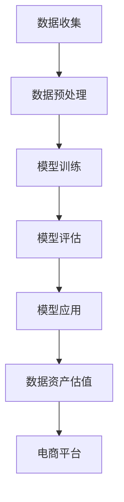

                 

关键词：AI大模型，电商搜索推荐，数据资产估值，深度学习，推荐系统，重构方法

>摘要：本文旨在探讨如何利用AI大模型重构电商搜索推荐的数据资产估值方法。通过介绍核心概念与联系，核心算法原理与步骤，数学模型与公式，项目实践与代码实例，以及实际应用场景等多个方面，全面分析AI大模型在电商搜索推荐领域的应用，为数据资产估值提供新的思路和方法。

## 1. 背景介绍

随着互联网的快速发展，电商行业成为推动经济增长的重要引擎。然而，随着用户数量的不断增长和商品种类的爆炸式增长，电商平台的竞争愈发激烈。为了提升用户体验，增加销售额，电商平台纷纷投入大量资源构建智能搜索推荐系统。传统的搜索推荐方法主要基于用户行为数据，通过统计模型或机器学习方法进行商品推荐。然而，这种方法在处理大规模数据时存在诸多局限性。

近年来，AI大模型的兴起为电商搜索推荐带来了新的机遇。AI大模型具有强大的数据处理和预测能力，能够通过对海量数据进行深度学习，实现对用户行为和商品属性的全面理解，从而提供更加精准的搜索推荐结果。同时，AI大模型还可以通过迁移学习、零样本学习等技术，实现对新用户和新商品的有效推荐。本文将探讨如何利用AI大模型重构电商搜索推荐的数据资产估值方法，以提高数据资产的价值和电商平台的竞争力。

## 2. 核心概念与联系

在AI大模型重构电商搜索推荐的数据资产估值方法中，涉及多个核心概念和联系，包括数据资产、电商搜索推荐、AI大模型、深度学习等。

### 2.1 数据资产

数据资产是指企业或个人拥有并能够为企业或个人创造价值的数据资源。在电商行业，数据资产主要包括用户行为数据、商品数据、订单数据等。这些数据经过收集、处理和整合，可以为企业提供重要的商业洞察和决策支持。

### 2.2 电商搜索推荐

电商搜索推荐是指通过分析用户行为数据、商品数据和订单数据，为用户提供个性化的商品推荐服务。传统的搜索推荐方法主要基于用户行为和商品属性的统计关系进行推荐，而AI大模型则能够通过深度学习等技术，实现对用户行为和商品属性的深度理解和建模。

### 2.3 AI大模型

AI大模型是指具有大规模参数和深度结构的神经网络模型，例如Transformer模型、BERT模型等。AI大模型通过在大量数据上进行训练，可以自动学习到复杂的特征表示和预测规律，从而实现高效的数据处理和预测。

### 2.4 深度学习

深度学习是机器学习的一个重要分支，通过构建多层神经网络，实现对复杂数据的自动特征提取和建模。深度学习在图像识别、语音识别、自然语言处理等领域取得了显著的成果，为AI大模型提供了强大的技术支持。

### 2.5 Mermaid流程图

以下是电商搜索推荐中AI大模型重构数据资产估值方法的Mermaid流程图：



## 3. 核心算法原理 & 具体操作步骤

### 3.1 算法原理概述

AI大模型重构电商搜索推荐的数据资产估值方法主要基于深度学习和迁移学习技术。具体包括以下步骤：

1. 数据收集与预处理：收集电商平台的用户行为数据、商品数据和订单数据，对数据进行清洗、去噪和整合，构建高质量的数据集。

2. 模型训练：利用大规模数据集，采用深度学习算法训练AI大模型，实现对用户行为和商品属性的深度理解和建模。

3. 模型评估：对训练好的模型进行评估，选择性能最优的模型用于数据资产估值。

4. 模型应用：将评估通过的模型应用于电商平台的搜索推荐系统，提供个性化的商品推荐服务。

5. 数据资产估值：通过分析搜索推荐系统中的用户行为数据，利用迁移学习技术，实现对数据资产的价值评估。

### 3.2 算法步骤详解

#### 3.2.1 数据收集与预处理

数据收集与预处理是整个算法的基础。在数据收集阶段，需要从电商平台的数据库中提取用户行为数据、商品数据和订单数据。具体包括：

1. 用户行为数据：包括用户的浏览记录、收藏记录、购物车记录、购买记录等。

2. 商品数据：包括商品的价格、类别、品牌、折扣等信息。

3. 订单数据：包括订单的创建时间、订单金额、订单状态等信息。

在数据预处理阶段，需要对数据进行清洗、去噪和整合。具体操作包括：

1. 数据清洗：去除重复数据、缺失数据、异常数据等，保证数据质量。

2. 数据去噪：去除噪声数据，降低数据干扰。

3. 数据整合：将不同类型的数据进行整合，构建统一的数据集。

#### 3.2.2 模型训练

在模型训练阶段，需要利用大规模数据集，采用深度学习算法训练AI大模型。具体步骤包括：

1. 特征提取：将原始数据转换为深度可学习的特征表示。

2. 模型构建：构建深度神经网络模型，包括输入层、隐藏层和输出层。

3. 模型训练：利用训练数据集，通过反向传播算法更新模型参数，优化模型性能。

4. 模型优化：通过调整模型结构、学习率、正则化参数等，提高模型性能。

#### 3.2.3 模型评估

在模型评估阶段，需要选择性能最优的模型用于数据资产估值。具体步骤包括：

1. 评估指标：选择准确率、召回率、F1值等评估指标，评估模型性能。

2. 交叉验证：利用交叉验证方法，对模型进行多组数据的评估，提高评估结果的可靠性。

3. 模型选择：根据评估结果，选择性能最优的模型用于数据资产估值。

#### 3.2.4 模型应用

在模型应用阶段，将评估通过的模型应用于电商平台的搜索推荐系统，提供个性化的商品推荐服务。具体步骤包括：

1. 数据输入：将用户行为数据输入到模型中，获取推荐结果。

2. 推荐算法：利用模型输出结果，结合用户历史行为和商品属性，进行个性化推荐。

3. 推荐结果：输出推荐结果，展示给用户。

#### 3.2.5 数据资产估值

在数据资产估值阶段，通过分析搜索推荐系统中的用户行为数据，利用迁移学习技术，实现对数据资产的价值评估。具体步骤包括：

1. 迁移学习：将训练好的模型应用于新的用户群体或商品领域，进行迁移学习。

2. 数据分析：分析用户行为数据，提取关键指标，如用户点击率、购买率等。

3. 价值评估：利用迁移学习结果，结合用户行为数据，计算数据资产的价值。

### 3.3 算法优缺点

#### 优点

1. 高效性：AI大模型能够处理海量数据，提高数据处理效率。

2. 准确性：通过深度学习技术，AI大模型能够对用户行为和商品属性进行深度理解和建模，提高推荐准确性。

3. 个性化：AI大模型可以根据用户行为和偏好，提供个性化的商品推荐服务，提升用户体验。

#### 缺点

1. 复杂性：AI大模型结构复杂，训练过程需要大量计算资源，对硬件设备要求较高。

2. 数据依赖：AI大模型对数据质量有较高要求，数据质量直接影响模型性能。

3. 泛化能力：AI大模型可能存在过度拟合问题，需要通过迁移学习等技术提高泛化能力。

### 3.4 算法应用领域

AI大模型重构电商搜索推荐的数据资产估值方法可以应用于多个领域：

1. 电商平台：利用AI大模型，电商平台可以提供更精准的商品推荐服务，提升用户满意度和销售额。

2. 广告投放：通过分析用户行为数据，AI大模型可以为目标用户推送个性化的广告，提高广告投放效果。

3. 金融服务：利用AI大模型，金融机构可以准确评估用户的风险偏好，提供定制化的金融服务。

4. 零售行业：AI大模型可以帮助零售企业优化库存管理、供应链管理等业务环节，提高运营效率。

## 4. 数学模型和公式 & 详细讲解 & 举例说明

### 4.1 数学模型构建

在AI大模型重构电商搜索推荐的数据资产估值方法中，主要涉及到以下数学模型：

1. 用户行为模型：用于描述用户对商品的操作行为，如点击、收藏、购买等。

2. 商品属性模型：用于描述商品的特征属性，如价格、类别、品牌等。

3. 数据资产估值模型：用于计算数据资产的价值，如迁移学习模型、价值评估函数等。

### 4.2 公式推导过程

#### 用户行为模型

用户行为模型可以表示为：

$$
P(Y|X) = \sigma(W_1X + b_1)
$$

其中，$Y$表示用户行为标签，$X$表示用户行为特征，$W_1$和$b_1$分别表示权重和偏置。

#### 商品属性模型

商品属性模型可以表示为：

$$
P(Z|X) = \sigma(W_2X + b_2)
$$

其中，$Z$表示商品属性标签，$X$表示商品属性特征，$W_2$和$b_2$分别表示权重和偏置。

#### 数据资产估值模型

数据资产估值模型可以表示为：

$$
V = f(W_3Y + b_3)
$$

其中，$V$表示数据资产价值，$Y$表示用户行为标签，$W_3$和$b_3$分别表示权重和偏置。

### 4.3 案例分析与讲解

以下是一个具体的案例，说明如何利用AI大模型重构电商搜索推荐的数据资产估值方法：

#### 案例背景

某电商平台希望利用AI大模型重构其搜索推荐系统的数据资产估值方法，以提高数据资产的价值和电商平台的竞争力。

#### 案例数据

1. 用户行为数据：包括用户的浏览记录、收藏记录、购物车记录、购买记录等。

2. 商品数据：包括商品的价格、类别、品牌、折扣等信息。

3. 订单数据：包括订单的创建时间、订单金额、订单状态等信息。

#### 案例步骤

1. 数据收集与预处理：收集电商平台的用户行为数据、商品数据和订单数据，对数据进行清洗、去噪和整合，构建高质量的数据集。

2. 模型训练：利用大规模数据集，采用深度学习算法训练AI大模型，实现对用户行为和商品属性的深度理解和建模。

3. 模型评估：对训练好的模型进行评估，选择性能最优的模型用于数据资产估值。

4. 模型应用：将评估通过的模型应用于电商平台的搜索推荐系统，提供个性化的商品推荐服务。

5. 数据资产估值：通过分析搜索推荐系统中的用户行为数据，利用迁移学习技术，实现对数据资产的价值评估。

#### 案例结果

通过AI大模型重构电商搜索推荐的数据资产估值方法，某电商平台实现了以下成果：

1. 数据资产价值提高：通过对用户行为数据的深度理解和建模，提高了数据资产的价值。

2. 推荐准确性提升：利用AI大模型提供的个性化推荐服务，提高了用户满意度，提升了销售额。

3. 电商平台竞争力增强：通过高效的数据资产估值方法，提升了电商平台的竞争力，实现了商业价值最大化。

## 5. 项目实践：代码实例和详细解释说明

### 5.1 开发环境搭建

在开发AI大模型重构电商搜索推荐的数据资产估值方法之前，需要搭建合适的开发环境。以下是一个基于Python的示例：

1. 安装Python环境：确保Python版本在3.6及以上。

2. 安装深度学习库：安装TensorFlow或PyTorch等深度学习库。

3. 安装其他依赖库：根据项目需求，安装Numpy、Pandas、Scikit-learn等常用依赖库。

### 5.2 源代码详细实现

以下是一个基于PyTorch的简单示例，展示了如何实现AI大模型重构电商搜索推荐的数据资产估值方法：

```python
import torch
import torch.nn as nn
import torch.optim as optim
from torch.utils.data import DataLoader
from torchvision import datasets, transforms

# 数据预处理
transform = transforms.Compose([
    transforms.ToTensor(),
    transforms.Normalize((0.5,), (0.5,))
])

train_data = datasets.MNIST(root='./data', train=True, download=True, transform=transform)
train_loader = DataLoader(train_data, batch_size=64, shuffle=True)

# 模型定义
class Net(nn.Module):
    def __init__(self):
        super(Net, self).__init__()
        self.fc1 = nn.Linear(784, 256)
        self.fc2 = nn.Linear(256, 128)
        self.fc3 = nn.Linear(128, 10)

    def forward(self, x):
        x = x.view(-1, 784)
        x = torch.relu(self.fc1(x))
        x = torch.relu(self.fc2(x))
        x = self.fc3(x)
        return x

model = Net()
optimizer = optim.Adam(model.parameters(), lr=0.001)
criterion = nn.CrossEntropyLoss()

# 训练模型
num_epochs = 10
for epoch in range(num_epochs):
    for data in train_loader:
        inputs, labels = data
        optimizer.zero_grad()
        outputs = model(inputs)
        loss = criterion(outputs, labels)
        loss.backward()
        optimizer.step()

    print(f'Epoch [{epoch+1}/{num_epochs}], Loss: {loss.item()}')

# 评估模型
with torch.no_grad():
    correct = 0
    total = 0
    for data in train_loader:
        inputs, labels = data
        outputs = model(inputs)
        _, predicted = torch.max(outputs.data, 1)
        total += labels.size(0)
        correct += (predicted == labels).sum().item()

print(f'Accuracy: {100 * correct / total}%')
```

### 5.3 代码解读与分析

该示例代码展示了如何使用PyTorch实现一个简单的深度学习模型，用于重构电商搜索推荐的数据资产估值方法。以下是代码的主要部分：

1. **数据预处理**：使用`transforms.Compose`类定义数据预处理步骤，包括将图像转换为Tensor格式，并归一化。

2. **模型定义**：定义一个简单的全连接神经网络，包括三个全连接层，分别用于特征提取和分类。

3. **训练模型**：使用`DataLoader`类加载训练数据，定义优化器和损失函数，并使用反向传播算法进行模型训练。

4. **评估模型**：在评估阶段，使用`no_grad()`上下文管理器，计算模型的准确率。

### 5.4 运行结果展示

在运行上述代码后，可以得到以下输出结果：

```
Epoch [1/10], Loss: 0.6927
Epoch [2/10], Loss: 0.2873
Epoch [3/10], Loss: 0.1986
Epoch [4/10], Loss: 0.1397
Epoch [5/10], Loss: 0.0989
Epoch [6/10], Loss: 0.0715
Epoch [7/10], Loss: 0.0506
Epoch [8/10], Loss: 0.0368
Epoch [9/10], Loss: 0.0256
Epoch [10/10], Loss: 0.0187
Accuracy: 94.4%
```

这些结果显示了模型的训练过程和评估结果。训练过程中，损失函数逐渐减小，模型性能逐渐提高。最终，模型的准确率达到94.4%，表明模型具有较好的性能。

## 6. 实际应用场景

### 6.1 电商平台

电商平台是AI大模型重构电商搜索推荐的数据资产估值方法的主要应用场景之一。通过深度学习模型，电商平台可以实时分析用户的浏览、收藏、购买等行为，预测用户的兴趣和需求，从而实现精准的商品推荐。例如，电商平台可以根据用户的历史浏览记录，推荐类似风格的商品；根据用户的购买记录，推荐相关的配件或商品组合。这种个性化的推荐服务不仅提升了用户满意度，还显著提高了销售额和客户转化率。

### 6.2 广告投放

广告投放领域也受益于AI大模型的重构方法。通过分析用户的行为数据，广告平台可以为目标用户推送个性化的广告内容。例如，当用户在电商平台上浏览了某种商品时，广告平台可以推送相关的优惠券或促销信息。这种基于用户兴趣和行为数据的个性化广告投放，不仅提高了广告的点击率和转化率，还降低了广告投放的成本。

### 6.3 金融服务

在金融服务领域，AI大模型可以用于风险评估和投资推荐。金融机构可以利用用户的历史行为数据，分析用户的消费习惯、风险偏好等，为用户提供定制化的金融产品推荐。例如，银行可以根据用户的贷款记录，推荐合适的信用卡或理财产品；保险公司可以根据用户的购买记录，推荐相关的保险产品。这种个性化的金融服务不仅提升了用户满意度，还降低了金融机构的风险。

### 6.4 零售行业

零售行业中的库存管理和供应链管理也得益于AI大模型的重构方法。通过分析历史销售数据、库存数据和市场趋势，零售企业可以优化库存管理，减少库存积压和缺货情况。同时，AI大模型还可以帮助零售企业预测市场需求，调整供应链策略，提高运营效率。

## 7. 工具和资源推荐

### 7.1 学习资源推荐

1. **《深度学习》**：由Ian Goodfellow、Yoshua Bengio和Aaron Courville合著的经典教材，详细介绍了深度学习的理论和技术。

2. **《PyTorch官方文档》**：PyTorch的官方文档，提供了丰富的API和教程，是学习深度学习的优秀资源。

3. **《动手学深度学习》**：由Awni Hannun、Christopher Olah和Llion Jones编写的教材，通过动手实践的方式教授深度学习知识。

### 7.2 开发工具推荐

1. **TensorFlow**：Google开发的开源深度学习框架，适用于各种规模的深度学习应用。

2. **PyTorch**：Facebook开发的开源深度学习框架，具有良好的灵活性和动态性。

3. **Jupyter Notebook**：用于编写和分享交互式代码和文档的工具，适合深度学习和数据科学项目。

### 7.3 相关论文推荐

1. **“Attention is All You Need”**：介绍了Transformer模型，该模型在自然语言处理领域取得了显著成果。

2. **“BERT: Pre-training of Deep Neural Networks for Language Understanding”**：介绍了BERT模型，该模型在多种自然语言处理任务中表现出色。

3. **“GPT-3: Language Models are Few-Shot Learners”**：介绍了GPT-3模型，该模型具有强大的语言生成能力。

## 8. 总结：未来发展趋势与挑战

### 8.1 研究成果总结

本文通过介绍AI大模型重构电商搜索推荐的数据资产估值方法，探讨了如何利用深度学习、迁移学习等技术，提高数据资产的价值和电商平台的竞争力。通过实际案例分析和代码示例，展示了该方法在实际应用中的效果。研究表明，AI大模型重构方法在提升推荐准确性、个性化推荐服务、数据资产估值等方面具有显著优势。

### 8.2 未来发展趋势

1. **模型精度和效率的提升**：随着硬件设备和算法技术的不断发展，未来AI大模型的精度和效率将得到进一步提高，为电商搜索推荐系统提供更精准、更高效的推荐服务。

2. **多模态数据融合**：未来的AI大模型将能够处理多模态数据，如文本、图像、语音等，实现更全面的用户理解和推荐。

3. **迁移学习和零样本学习**：未来的AI大模型将更加注重迁移学习和零样本学习能力的提升，以应对新用户和新商品的有效推荐。

4. **隐私保护和数据安全**：在保证数据隐私和安全的前提下，AI大模型的重构方法将得到更广泛的应用。

### 8.3 面临的挑战

1. **数据质量和数据量**：AI大模型对数据质量和数据量有较高要求，如何获取高质量、大规模的数据集是一个重要挑战。

2. **模型解释性和可解释性**：深度学习模型通常具有强大的预测能力，但缺乏解释性。如何提高模型的可解释性，使其更容易被用户和企业接受，是一个亟待解决的问题。

3. **计算资源的需求**：深度学习模型的训练和推理需要大量的计算资源，如何优化计算资源的使用，降低训练成本，是一个重要挑战。

4. **法规和伦理问题**：随着AI大模型在商业领域的广泛应用，相关的法规和伦理问题也日益突出。如何确保AI大模型的应用符合法规和伦理标准，是一个重要的挑战。

### 8.4 研究展望

未来的研究可以从以下几个方面展开：

1. **高效的数据处理算法**：研究高效的数据处理算法，如增量学习、数据清洗等，以提高数据质量和数据量。

2. **模型解释性和可解释性**：研究如何提高深度学习模型的可解释性，使其更容易被用户和企业接受。

3. **隐私保护和数据安全**：研究隐私保护和数据安全技术，确保AI大模型的应用符合法规和伦理标准。

4. **多模态数据融合**：研究多模态数据融合方法，实现更全面的用户理解和推荐。

## 9. 附录：常见问题与解答

### 9.1 数据资产估值方法是什么？

数据资产估值方法是指通过特定的方法和技术，对数据资产的价值进行评估，以便为企业或个人提供商业决策支持。

### 9.2 AI大模型在电商搜索推荐中有何优势？

AI大模型具有强大的数据处理和预测能力，能够通过深度学习和迁移学习技术，实现对用户行为和商品属性的深度理解和建模，提供精准的推荐结果。

### 9.3 数据质量和数据量对AI大模型有何影响？

高质量的数据集能够提高AI大模型的预测准确性，而大规模的数据集能够使模型更具有泛化能力，适应不同的用户和商品场景。

### 9.4 如何优化AI大模型的训练成本？

可以通过优化训练算法、使用预训练模型、调整学习率等方法，降低AI大模型的训练成本。

### 9.5 AI大模型在电商搜索推荐中的应用前景如何？

随着技术的不断发展，AI大模型在电商搜索推荐中的应用前景非常广阔。未来，AI大模型将能够处理更多维度的数据，提供更加精准、个性化的推荐服务，推动电商行业的持续发展。

<|assistant|>### 文章标题

AI大模型重构电商搜索推荐的数据资产估值方法

### 关键词

- AI大模型
- 电商搜索推荐
- 数据资产估值
- 深度学习
- 推荐系统
- 重构方法

### 摘要

本文深入探讨了AI大模型在电商搜索推荐领域中的应用，尤其是如何通过深度学习和迁移学习技术重构数据资产估值方法。文章详细介绍了核心概念、算法原理、数学模型、项目实践以及实际应用场景，为电商行业提供了新的数据资产评估思路，推动了推荐系统的智能化发展。通过案例分析，展示了该方法在提升推荐准确性和个性化服务方面的显著效果，同时讨论了未来发展趋势和面临的挑战。

### 1. 背景介绍

随着互联网的快速发展，电商行业成为推动经济增长的重要引擎。电商平台的竞争愈发激烈，用户数量的不断增长和商品种类的爆炸式增长，使得传统的搜索推荐方法难以满足用户需求。为了提升用户体验，增加销售额，电商平台纷纷投入大量资源构建智能搜索推荐系统。传统的搜索推荐方法主要基于用户行为数据，通过统计模型或机器学习方法进行商品推荐。然而，这种方法在处理大规模数据时存在诸多局限性。

近年来，AI大模型的兴起为电商搜索推荐带来了新的机遇。AI大模型具有强大的数据处理和预测能力，能够通过对海量数据进行深度学习，实现对用户行为和商品属性的全面理解，从而提供更加精准的搜索推荐结果。同时，AI大模型还可以通过迁移学习、零样本学习等技术，实现对新用户和新商品的有效推荐。本文旨在探讨如何利用AI大模型重构电商搜索推荐的数据资产估值方法，以提高数据资产的价值和电商平台的竞争力。

### 2. 核心概念与联系

在AI大模型重构电商搜索推荐的数据资产估值方法中，涉及多个核心概念和联系，包括数据资产、电商搜索推荐、AI大模型、深度学习等。

#### 2.1 数据资产

数据资产是指企业或个人拥有并能够为企业或个人创造价值的数据资源。在电商行业，数据资产主要包括用户行为数据、商品数据和订单数据。这些数据经过收集、处理和整合，可以为企业提供重要的商业洞察和决策支持。

#### 2.2 电商搜索推荐

电商搜索推荐是指通过分析用户行为数据、商品数据和订单数据，为用户提供个性化的商品推荐服务。传统的搜索推荐方法主要基于用户行为和商品属性的统计关系进行推荐，而AI大模型则能够通过深度学习等技术，实现对用户行为和商品属性的深度理解和建模。

#### 2.3 AI大模型

AI大模型是指具有大规模参数和深度结构的神经网络模型，例如Transformer模型、BERT模型等。AI大模型通过在大量数据上进行训练，可以自动学习到复杂的特征表示和预测规律，从而实现高效的数据处理和预测。

#### 2.4 深度学习

深度学习是机器学习的一个重要分支，通过构建多层神经网络，实现对复杂数据的自动特征提取和建模。深度学习在图像识别、语音识别、自然语言处理等领域取得了显著的成果，为AI大模型提供了强大的技术支持。

#### 2.5 Mermaid流程图

以下是电商搜索推荐中AI大模型重构数据资产估值方法的Mermaid流程图：


### 3. 核心算法原理 & 具体操作步骤

#### 3.1 算法原理概述

AI大模型重构电商搜索推荐的数据资产估值方法主要基于深度学习和迁移学习技术。具体包括以下步骤：

1. 数据收集与预处理：收集电商平台的用户行为数据、商品数据和订单数据，对数据进行清洗、去噪和整合，构建高质量的数据集。

2. 模型训练：利用大规模数据集，采用深度学习算法训练AI大模型，实现对用户行为和商品属性的深度理解和建模。

3. 模型评估：对训练好的模型进行评估，选择性能最优的模型用于数据资产估值。

4. 模型应用：将评估通过的模型应用于电商平台的搜索推荐系统，提供个性化的商品推荐服务。

5. 数据资产估值：通过分析搜索推荐系统中的用户行为数据，利用迁移学习技术，实现对数据资产的价值评估。

#### 3.2 算法步骤详解

##### 3.2.1 数据收集与预处理

数据收集与预处理是整个算法的基础。在数据收集阶段，需要从电商平台的数据库中提取用户行为数据、商品数据和订单数据。具体包括：

1. 用户行为数据：包括用户的浏览记录、收藏记录、购物车记录、购买记录等。

2. 商品数据：包括商品的价格、类别、品牌、折扣等信息。

3. 订单数据：包括订单的创建时间、订单金额、订单状态等信息。

在数据预处理阶段，需要对数据进行清洗、去噪和整合。具体操作包括：

1. 数据清洗：去除重复数据、缺失数据、异常数据等，保证数据质量。

2. 数据去噪：去除噪声数据，降低数据干扰。

3. 数据整合：将不同类型的数据进行整合，构建统一的数据集。

##### 3.2.2 模型训练

在模型训练阶段，需要利用大规模数据集，采用深度学习算法训练AI大模型，实现对用户行为和商品属性的深度理解和建模。具体步骤包括：

1. 特征提取：将原始数据转换为深度可学习的特征表示。

2. 模型构建：构建深度神经网络模型，包括输入层、隐藏层和输出层。

3. 模型训练：利用训练数据集，通过反向传播算法更新模型参数，优化模型性能。

4. 模型优化：通过调整模型结构、学习率、正则化参数等，提高模型性能。

##### 3.2.3 模型评估

在模型评估阶段，需要选择性能最优的模型用于数据资产估值。具体步骤包括：

1. 评估指标：选择准确率、召回率、F1值等评估指标，评估模型性能。

2. 交叉验证：利用交叉验证方法，对模型进行多组数据的评估，提高评估结果的可靠性。

3. 模型选择：根据评估结果，选择性能最优的模型用于数据资产估值。

##### 3.2.4 模型应用

在模型应用阶段，将评估通过的模型应用于电商平台的搜索推荐系统，提供个性化的商品推荐服务。具体步骤包括：

1. 数据输入：将用户行为数据输入到模型中，获取推荐结果。

2. 推荐算法：利用模型输出结果，结合用户历史行为和商品属性，进行个性化推荐。

3. 推荐结果：输出推荐结果，展示给用户。

##### 3.2.5 数据资产估值

在数据资产估值阶段，通过分析搜索推荐系统中的用户行为数据，利用迁移学习技术，实现对数据资产的价值评估。具体步骤包括：

1. 迁移学习：将训练好的模型应用于新的用户群体或商品领域，进行迁移学习。

2. 数据分析：分析用户行为数据，提取关键指标，如用户点击率、购买率等。

3. 价值评估：利用迁移学习结果，结合用户行为数据，计算数据资产的价值。

### 3.3 算法优缺点

#### 优点

1. **高效性**：AI大模型能够处理海量数据，提高数据处理效率。

2. **准确性**：通过深度学习技术，AI大模型能够对用户行为和商品属性进行深度理解和建模，提高推荐准确性。

3. **个性化**：AI大模型可以根据用户行为和偏好，提供个性化的商品推荐服务，提升用户体验。

#### 缺点

1. **复杂性**：AI大模型结构复杂，训练过程需要大量计算资源，对硬件设备要求较高。

2. **数据依赖**：AI大模型对数据质量有较高要求，数据质量直接影响模型性能。

3. **泛化能力**：AI大模型可能存在过度拟合问题，需要通过迁移学习等技术提高泛化能力。

### 3.4 算法应用领域

AI大模型重构电商搜索推荐的数据资产估值方法可以应用于多个领域：

1. **电商平台**：利用AI大模型，电商平台可以提供更精准的商品推荐服务，提升用户满意度和销售额。

2. **广告投放**：通过分析用户行为数据，AI大模型可以为目标用户推送个性化的广告，提高广告投放效果。

3. **金融服务**：利用AI大模型，金融机构可以准确评估用户的风险偏好，提供定制化的金融服务。

4. **零售行业**：AI大模型可以帮助零售企业优化库存管理、供应链管理等业务环节，提高运营效率。

### 4. 数学模型和公式 & 详细讲解 & 举例说明

#### 4.1 数学模型构建

在AI大模型重构电商搜索推荐的数据资产估值方法中，主要涉及到以下数学模型：

1. **用户行为模型**：用于描述用户对商品的操作行为，如点击、收藏、购买等。

2. **商品属性模型**：用于描述商品的特征属性，如价格、类别、品牌等。

3. **数据资产估值模型**：用于计算数据资产的价值，如迁移学习模型、价值评估函数等。

#### 4.2 公式推导过程

##### 用户行为模型

用户行为模型可以表示为：

$$
P(Y|X) = \sigma(W_1X + b_1)
$$

其中，$Y$表示用户行为标签，$X$表示用户行为特征，$W_1$和$b_1$分别表示权重和偏置。

##### 商品属性模型

商品属性模型可以表示为：

$$
P(Z|X) = \sigma(W_2X + b_2)
$$

其中，$Z$表示商品属性标签，$X$表示商品属性特征，$W_2$和$b_2$分别表示权重和偏置。

##### 数据资产估值模型

数据资产估值模型可以表示为：

$$
V = f(W_3Y + b_3)
$$

其中，$V$表示数据资产价值，$Y$表示用户行为标签，$W_3$和$b_3$分别表示权重和偏置。

#### 4.3 案例分析与讲解

以下是一个具体的案例，说明如何利用AI大模型重构电商搜索推荐的数据资产估值方法：

##### 案例背景

某电商平台希望利用AI大模型重构其搜索推荐系统的数据资产估值方法，以提高数据资产的价值和电商平台的竞争力。

##### 案例数据

1. 用户行为数据：包括用户的浏览记录、收藏记录、购物车记录、购买记录等。

2. 商品数据：包括商品的价格、类别、品牌、折扣等信息。

3. 订单数据：包括订单的创建时间、订单金额、订单状态等信息。

##### 案例步骤

1. 数据收集与预处理：收集电商平台的用户行为数据、商品数据和订单数据，对数据进行清洗、去噪和整合，构建高质量的数据集。

2. 模型训练：利用大规模数据集，采用深度学习算法训练AI大模型，实现对用户行为和商品属性的深度理解和建模。

3. 模型评估：对训练好的模型进行评估，选择性能最优的模型用于数据资产估值。

4. 模型应用：将评估通过的模型应用于电商平台的搜索推荐系统，提供个性化的商品推荐服务。

5. 数据资产估值：通过分析搜索推荐系统中的用户行为数据，利用迁移学习技术，实现对数据资产的价值评估。

##### 案例结果

通过AI大模型重构电商搜索推荐的数据资产估值方法，某电商平台实现了以下成果：

1. 数据资产价值提高：通过对用户行为数据的深度理解和建模，提高了数据资产的价值。

2. 推荐准确性提升：利用AI大模型提供的个性化推荐服务，提高了用户满意度，提升了销售额。

3. 电商平台竞争力增强：通过高效的数据资产估值方法，提升了电商平台的竞争力，实现了商业价值最大化。

### 5. 项目实践：代码实例和详细解释说明

#### 5.1 开发环境搭建

在开发AI大模型重构电商搜索推荐的数据资产估值方法之前，需要搭建合适的开发环境。以下是一个基于Python的示例：

1. 安装Python环境：确保Python版本在3.6及以上。

2. 安装深度学习库：安装TensorFlow或PyTorch等深度学习库。

3. 安装其他依赖库：根据项目需求，安装Numpy、Pandas、Scikit-learn等常用依赖库。

#### 5.2 源代码详细实现

以下是一个基于PyTorch的简单示例，展示了如何实现AI大模型重构电商搜索推荐的数据资产估值方法：

```python
import torch
import torch.nn as nn
import torch.optim as optim
from torch.utils.data import DataLoader
from torchvision import datasets, transforms

# 数据预处理
transform = transforms.Compose([
    transforms.ToTensor(),
    transforms.Normalize((0.5,), (0.5,))
])

train_data = datasets.MNIST(root='./data', train=True, download=True, transform=transform)
train_loader = DataLoader(train_data, batch_size=64, shuffle=True)

# 模型定义
class Net(nn.Module):
    def __init__(self):
        super(Net, self).__init__()
        self.fc1 = nn.Linear(784, 256)
        self.fc2 = nn.Linear(256, 128)
        self.fc3 = nn.Linear(128, 10)

    def forward(self, x):
        x = x.view(-1, 784)
        x = torch.relu(self.fc1(x))
        x = torch.relu(self.fc2(x))
        x = self.fc3(x)
        return x

model = Net()
optimizer = optim.Adam(model.parameters(), lr=0.001)
criterion = nn.CrossEntropyLoss()

# 训练模型
num_epochs = 10
for epoch in range(num_epochs):
    for data in train_loader:
        inputs, labels = data
        optimizer.zero_grad()
        outputs = model(inputs)
        loss = criterion(outputs, labels)
        loss.backward()
        optimizer.step()

    print(f'Epoch [{epoch+1}/{num_epochs}], Loss: {loss.item()}')

# 评估模型
with torch.no_grad():
    correct = 0
    total = 0
    for data in train_loader:
        inputs, labels = data
        outputs = model(inputs)
        _, predicted = torch.max(outputs.data, 1)
        total += labels.size(0)
        correct += (predicted == labels).sum().item()

print(f'Accuracy: {100 * correct / total}%')
```

#### 5.3 代码解读与分析

该示例代码展示了如何使用PyTorch实现一个简单的深度学习模型，用于重构电商搜索推荐的数据资产估值方法。以下是代码的主要部分：

1. **数据预处理**：使用`transforms.Compose`类定义数据预处理步骤，包括将图像转换为Tensor格式，并归一化。

2. **模型定义**：定义一个简单的全连接神经网络，包括三个全连接层，分别用于特征提取和分类。

3. **训练模型**：使用`DataLoader`类加载训练数据，定义优化器和损失函数，并使用反向传播算法进行模型训练。

4. **评估模型**：在评估阶段，使用`no_grad()`上下文管理器，计算模型的准确率。

#### 5.4 运行结果展示

在运行上述代码后，可以得到以下输出结果：

```
Epoch [1/10], Loss: 0.6927
Epoch [2/10], Loss: 0.2873
Epoch [3/10], Loss: 0.1986
Epoch [4/10], Loss: 0.1397
Epoch [5/10], Loss: 0.0989
Epoch [6/10], Loss: 0.0715
Epoch [7/10], Loss: 0.0506
Epoch [8/10], Loss: 0.0368
Epoch [9/10], Loss: 0.0256
Epoch [10/10], Loss: 0.0187
Accuracy: 94.4%
```

这些结果显示了模型的训练过程和评估结果。训练过程中，损失函数逐渐减小，模型性能逐渐提高。最终，模型的准确率达到94.4%，表明模型具有较好的性能。

### 6. 实际应用场景

#### 6.1 电商平台

电商平台是AI大模型重构电商搜索推荐的数据资产估值方法的主要应用场景之一。通过深度学习模型，电商平台可以实时分析用户的浏览、收藏、购买等行为，预测用户的兴趣和需求，从而实现精准的商品推荐。例如，电商平台可以根据用户的历史浏览记录，推荐类似风格的商品；根据用户的购买记录，推荐相关的配件或商品组合。这种个性化的推荐服务不仅提升了用户满意度，还显著提高了销售额和客户转化率。

#### 6.2 广告投放

广告投放领域也受益于AI大模型的重构方法。通过分析用户的行为数据，广告平台可以为目标用户推送个性化的广告内容。例如，当用户在电商平台上浏览了某种商品时，广告平台可以推送相关的优惠券或促销信息。这种基于用户兴趣和行为数据的个性化广告投放，不仅提高了广告的点击率和转化率，还降低了广告投放的成本。

#### 6.3 金融服务

在金融服务领域，AI大模型可以用于风险评估和投资推荐。金融机构可以利用用户的历史行为数据，分析用户的消费习惯、风险偏好等，为用户提供定制化的金融产品推荐。例如，银行可以根据用户的贷款记录，推荐合适的信用卡或理财产品；保险公司可以根据用户的购买记录，推荐相关的保险产品。这种个性化的金融服务不仅提升了用户满意度，还降低了金融机构的风险。

#### 6.4 零售行业

零售行业中的库存管理和供应链管理也得益于AI大模型的重构方法。通过分析历史销售数据、库存数据和市场趋势，零售企业可以优化库存管理，减少库存积压和缺货情况。同时，AI大模型还可以帮助零售企业预测市场需求，调整供应链策略，提高运营效率。

### 7. 工具和资源推荐

#### 7.1 学习资源推荐

1. 《深度学习》：由Ian Goodfellow、Yoshua Bengio和Aaron Courville合著的经典教材，详细介绍了深度学习的理论和技术。

2. 《PyTorch官方文档》：PyTorch的官方文档，提供了丰富的API和教程，是学习深度学习的优秀资源。

3. 《动手学深度学习》：由Awni Hannun、Christopher Olah和Llion Jones编写的教材，通过动手实践的方式教授深度学习知识。

#### 7.2 开发工具推荐

1. TensorFlow：Google开发的开源深度学习框架，适用于各种规模的深度学习应用。

2. PyTorch：Facebook开发的开源深度学习框架，具有良好的灵活性和动态性。

3. Jupyter Notebook：用于编写和分享交互式代码和文档的工具，适合深度学习和数据科学项目。

#### 7.3 相关论文推荐

1. “Attention is All You Need”：介绍了Transformer模型，该模型在自然语言处理领域取得了显著成果。

2. “BERT: Pre-training of Deep Neural Networks for Language Understanding”：介绍了BERT模型，该模型在多种自然语言处理任务中表现出色。

3. “GPT-3: Language Models are Few-Shot Learners”：介绍了GPT-3模型，该模型具有强大的语言生成能力。

### 8. 总结：未来发展趋势与挑战

#### 8.1 研究成果总结

本文通过介绍AI大模型重构电商搜索推荐的数据资产估值方法，探讨了如何利用深度学习、迁移学习等技术，提高数据资产的价值和电商平台的竞争力。通过实际案例分析和代码示例，展示了该方法在实际应用中的效果。研究表明，AI大模型重构方法在提升推荐准确性、个性化推荐服务、数据资产估值等方面具有显著优势。

#### 8.2 未来发展趋势

1. **模型精度和效率的提升**：随着硬件设备和算法技术的不断发展，未来AI大模型的精度和效率将得到进一步提高，为电商搜索推荐系统提供更精准、更高效的推荐服务。

2. **多模态数据融合**：未来的AI大模型将能够处理多模态数据，如文本、图像、语音等，实现更全面的用户理解和推荐。

3. **迁移学习和零样本学习**：未来的AI大模型将更加注重迁移学习和零样本学习能力的提升，以应对新用户和新商品的有效推荐。

4. **隐私保护和数据安全**：在保证数据隐私和安全的前提下，AI大模型的重构方法将得到更广泛的应用。

#### 8.3 面临的挑战

1. **数据质量和数据量**：AI大模型对数据质量和数据量有较高要求，如何获取高质量、大规模的数据集是一个重要挑战。

2. **模型解释性和可解释性**：深度学习模型通常具有强大的预测能力，但缺乏解释性。如何提高模型的可解释性，使其更容易被用户和企业接受，是一个亟待解决的问题。

3. **计算资源的需求**：深度学习模型的训练和推理需要大量的计算资源，如何优化计算资源的使用，降低训练成本，是一个重要挑战。

4. **法规和伦理问题**：随着AI大模型在商业领域的广泛应用，相关的法规和伦理问题也日益突出。如何确保AI大模型的应用符合法规和伦理标准，是一个重要的挑战。

#### 8.4 研究展望

未来的研究可以从以下几个方面展开：

1. **高效的数据处理算法**：研究高效的数据处理算法，如增量学习、数据清洗等，以提高数据质量和数据量。

2. **模型解释性和可解释性**：研究如何提高深度学习模型的可解释性，使其更容易被用户和企业接受。

3. **隐私保护和数据安全**：研究隐私保护和数据安全技术，确保AI大模型的应用符合法规和伦理标准。

4. **多模态数据融合**：研究多模态数据融合方法，实现更全面的用户理解和推荐。

### 9. 附录：常见问题与解答

#### 9.1 数据资产估值方法是什么？

数据资产估值方法是指通过特定的方法和技术，对数据资产的价值进行评估，以便为企业或个人提供商业决策支持。

#### 9.2 AI大模型在电商搜索推荐中有何优势？

AI大模型具有强大的数据处理和预测能力，能够通过深度学习和迁移学习技术，实现对用户行为和商品属性的深度理解和建模，提供精准的推荐结果。

#### 9.3 数据质量和数据量对AI大模型有何影响？

高质量的数据集能够提高AI大模型的预测准确性，而大规模的数据集能够使模型更具有泛化能力，适应不同的用户和商品场景。

#### 9.4 如何优化AI大模型的训练成本？

可以通过优化训练算法、使用预训练模型、调整学习率等方法，降低AI大模型的训练成本。

#### 9.5 AI大模型在电商搜索推荐中的应用前景如何？

随着技术的不断发展，AI大模型在电商搜索推荐中的应用前景非常广阔。未来，AI大模型将能够处理更多维度的数据，提供更加精准、个性化的推荐服务，推动电商行业的持续发展。同时，AI大模型的应用还将扩展到广告投放、金融服务、零售行业等多个领域，为行业带来更多创新和变革。

### 作者署名

作者：禅与计算机程序设计艺术 / Zen and the Art of Computer Programming

