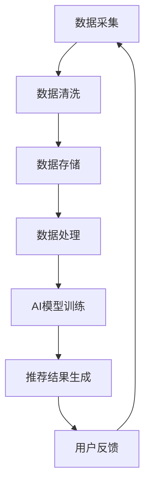

                 

关键词：AI大模型、电商搜索推荐、数据资产管理、功能优化、方案设计、实现细节、应用场景、未来展望

摘要：本文深入探讨了AI大模型在电商搜索推荐系统中的关键作用，以及如何通过数据资产管理平台的优化来提升电商搜索推荐的精准度和效率。文章首先回顾了AI大模型的基本概念和技术演进，随后详细分析了电商搜索推荐系统中的核心挑战，并提出了重构数据资产管理平台的具体方案。通过数学模型和算法原理的讲解，以及实际项目实践的案例分析，文章展示了AI大模型重构电商搜索推荐系统带来的显著改进。最后，文章探讨了未来的应用前景和面临的挑战。

## 1. 背景介绍

随着互联网技术的迅猛发展和大数据时代的来临，电商行业迎来了前所未有的发展机遇。然而，用户需求的多样化和市场环境的复杂化也对电商平台的搜索推荐系统提出了更高的要求。传统的基于关键词匹配和协同过滤的推荐算法，已经难以满足用户个性化的需求，搜索推荐的准确性和实时性成为亟待解决的重要问题。

近年来，人工智能（AI）技术的飞速发展为电商搜索推荐系统带来了新的契机。特别是AI大模型（如深度学习、图神经网络等）的应用，使得个性化推荐系统在理解用户意图、挖掘潜在需求方面取得了显著突破。AI大模型通过大量用户行为数据的训练，能够自动学习用户的兴趣偏好，提供高度个性化的搜索推荐结果。

数据资产管理平台作为电商搜索推荐系统的核心组成部分，承担着数据存储、处理和管理的重要任务。传统的数据资产管理平台往往存在数据孤岛、处理效率低、安全性不足等问题，限制了AI大模型在电商搜索推荐系统中的效能发挥。因此，重构数据资产管理平台，实现其功能优化，是提升电商搜索推荐系统整体性能的关键步骤。

本文旨在探讨如何通过AI大模型重构电商搜索推荐的数据资产管理平台，提出具体的优化方案和实现细节。文章结构如下：

- **第1部分**：背景介绍，回顾AI大模型和电商搜索推荐系统的发展现状。
- **第2部分**：核心概念与联系，介绍AI大模型与数据资产管理平台之间的关系。
- **第3部分**：核心算法原理 & 具体操作步骤，详细分析AI大模型在数据资产管理平台中的应用。
- **第4部分**：数学模型和公式 & 详细讲解 & 举例说明，解释AI大模型背后的数学基础。
- **第5部分**：项目实践：代码实例和详细解释说明，展示实际应用中的实现细节。
- **第6部分**：实际应用场景，探讨AI大模型重构数据资产管理平台在不同电商场景中的应用。
- **第7部分**：工具和资源推荐，提供相关学习资源、开发工具和论文推荐。
- **第8部分**：总结：未来发展趋势与挑战，对研究成果进行总结，并展望未来的发展方向和面临的挑战。
- **第9部分**：附录：常见问题与解答，针对读者可能遇到的问题提供解答。

通过本文的探讨，我们希望能够为电商搜索推荐系统的优化提供有价值的参考，推动AI大模型在电商领域的深入应用。

## 2. 核心概念与联系

在探讨AI大模型重构电商搜索推荐的数据资产管理平台功能优化方案之前，我们需要明确一些核心概念及其相互之间的关系。

### 2.1 AI大模型

AI大模型指的是通过深度学习、图神经网络等先进技术训练得到的大型神经网络模型。这些模型具有强大的特征提取和模式识别能力，能够处理海量数据并自动学习用户的兴趣偏好。常见的AI大模型包括卷积神经网络（CNN）、循环神经网络（RNN）、Transformer模型等。

### 2.2 电商搜索推荐系统

电商搜索推荐系统是电商平台的核心组成部分，其目标是根据用户的搜索历史、购买行为、浏览记录等数据，为用户推荐相关的商品。传统的推荐算法主要基于用户的历史行为和内容相似性，但AI大模型通过深度学习能够更好地理解用户意图，提供更加个性化的推荐。

### 2.3 数据资产管理平台

数据资产管理平台是负责数据存储、处理和管理的基础设施。其核心功能包括数据采集、数据清洗、数据存储、数据分析和数据安全等。一个高效的数据资产管理平台能够为AI大模型提供高质量的数据支持，确保推荐算法的准确性和实时性。

### 2.4 AI大模型与数据资产管理平台的关系

AI大模型与数据资产管理平台之间的紧密联系主要体现在以下几个方面：

1. **数据支持**：AI大模型需要依赖数据资产管理平台提供的海量用户行为数据和商品数据，进行模型的训练和优化。
2. **数据处理能力**：数据资产管理平台需要具备高效的数据处理能力，以满足AI大模型对数据实时性和质量的要求。
3. **数据安全**：AI大模型在处理用户数据时需要确保数据的安全性，数据资产管理平台需要提供完善的数据安全机制。
4. **协同优化**：通过数据资产管理平台对数据的预处理和整合，可以进一步提升AI大模型的推荐效果。

### 2.5 Mermaid流程图

为了更直观地展示AI大模型与数据资产管理平台之间的联系，我们使用Mermaid流程图进行说明。以下是一个简单的流程图示例：



在这个流程图中，数据从数据采集开始，经过数据清洗、数据存储、数据处理等步骤，最终输入到AI模型中进行训练，生成推荐结果并反馈给用户，形成一个闭环系统。

通过上述核心概念及其关系的介绍，我们为后续的详细分析和优化方案设计奠定了基础。

### 3. 核心算法原理 & 具体操作步骤

在本文中，我们将深入探讨AI大模型在电商搜索推荐系统中应用的核心算法原理，并详细描述其具体操作步骤，同时分析算法的优缺点及其应用领域。

#### 3.1 算法原理概述

AI大模型在电商搜索推荐系统中的应用主要基于深度学习和图神经网络技术。以下将介绍两种常用的算法：深度学习推荐算法和图神经网络推荐算法。

##### 深度学习推荐算法

深度学习推荐算法通过构建神经网络模型，对用户行为数据、商品属性数据等进行特征提取和模式识别。常见的深度学习推荐算法包括：

1. **卷积神经网络（CNN）**：CNN在图像处理领域表现出色，能够提取图像的局部特征。在推荐系统中，CNN可以用于提取商品的视觉特征，如颜色、形状等。

2. **循环神经网络（RNN）**：RNN能够处理序列数据，适合处理用户的行为序列，如浏览记录、购买历史等。通过RNN，可以捕捉用户行为之间的时序关系。

3. **Transformer模型**：Transformer模型基于自注意力机制，能够捕捉输入数据中的全局依赖关系。在推荐系统中，Transformer模型可以用于建模用户和商品之间的复杂关系。

##### 图神经网络推荐算法

图神经网络（GNN）通过图结构来表示用户、商品及其之间的关系，能够捕捉节点之间的复杂交互。常见的GNN算法包括：

1. **图卷积网络（GCN）**：GCN能够对图结构中的节点进行特征提取和传播，适用于处理社交网络、推荐系统等。

2. **图注意力网络（GAT）**：GAT通过引入注意力机制，能够自适应地学习节点之间的关系，提高模型的推荐效果。

3. **图变换器网络（GTN）**：GTN结合了图结构和Transformer模型，能够同时利用图结构和序列数据的信息。

#### 3.2 算法步骤详解

以下以Transformer模型为例，详细描述其在电商搜索推荐系统中的应用步骤：

1. **数据预处理**：
   - **用户数据**：收集用户的搜索历史、购买记录、浏览记录等行为数据，并进行数据清洗和预处理。
   - **商品数据**：收集商品的属性数据，如价格、品牌、类别、图片等，并进行数据清洗和预处理。

2. **特征提取**：
   - **用户特征**：通过嵌入层将用户的行为序列转换为高维向量表示。
   - **商品特征**：通过嵌入层将商品的属性转换为高维向量表示。

3. **模型训练**：
   - **编码器**：输入用户和商品的特征向量，通过多层Transformer编码器进行编码，捕捉用户和商品之间的复杂关系。
   - **解码器**：输入编码后的特征向量，通过多层Transformer解码器生成推荐结果。

4. **推荐生成**：
   - **评分预测**：通过解码器输出的特征向量，利用全连接层生成用户对商品的评分预测。
   - **推荐排序**：根据评分预测结果，对商品进行排序，生成推荐列表。

5. **评估与优化**：
   - **评估指标**：使用准确率、召回率、F1值等指标评估推荐效果。
   - **模型优化**：通过调整模型参数、增加训练数据等方式，优化推荐效果。

#### 3.3 算法优缺点

##### 优点

1. **高精度**：深度学习和图神经网络能够自动学习用户和商品的特征，提供高度个性化的推荐结果。
2. **强鲁棒性**：通过大规模数据训练，模型对噪声数据的鲁棒性较高，能够适应不同用户群体的需求。
3. **多样性**：能够捕捉用户和商品之间的复杂关系，生成多样化的推荐列表。

##### 缺点

1. **计算资源消耗大**：深度学习和图神经网络模型参数众多，训练过程需要大量的计算资源。
2. **数据依赖性高**：模型性能高度依赖于训练数据的质量和数量，数据不足或质量差会影响推荐效果。

#### 3.4 算法应用领域

AI大模型在电商搜索推荐系统中的应用广泛，除了电商平台，还可以应用于以下领域：

1. **社交媒体**：通过分析用户在社交媒体上的互动数据，提供个性化的内容推荐。
2. **在线广告**：利用用户的行为数据和广告内容特征，实现精准的广告投放。
3. **视频推荐**：通过分析用户的观看历史和视频特征，提供个性化的视频推荐。

通过上述对核心算法原理和具体操作步骤的详细介绍，我们为后续的数学模型和实际项目实践打下了基础。

### 4. 数学模型和公式 & 详细讲解 & 举例说明

在本文的第四部分，我们将详细讲解AI大模型在电商搜索推荐系统中应用的核心数学模型和公式，并通过具体例子进行说明。

#### 4.1 数学模型构建

AI大模型在电商搜索推荐系统中的应用主要依赖于深度学习和图神经网络，下面将介绍相关数学模型的基本构成。

##### 4.1.1 卷积神经网络（CNN）

卷积神经网络（CNN）用于提取图像特征，其基本数学模型包括以下几个部分：

1. **卷积层（Convolutional Layer）**：
   \[
   \text{output}(i,j) = \sum_{k=1}^{n} w_{ik} \cdot \text{input}(i-k,j-k) + b_k
   \]
   其中，$\text{output}(i,j)$为输出特征图上的像素值，$w_{ik}$为卷积核权重，$\text{input}(i,j)$为输入图像上的像素值，$b_k$为卷积核偏置。

2. **激活函数（Activation Function）**：
   常见的激活函数包括Sigmoid、ReLU和Tanh。以ReLU为例：
   \[
   \text{output}(i,j) = \max(0, \text{input}(i,j))
   \]

3. **池化层（Pooling Layer）**：
   池化层用于降低特征图的维度，常用的池化方式包括最大池化和平均池化。以最大池化为例：
   \[
   \text{output}(i,j) = \max(\text{input}(i-k, j-l))
   \]
   其中，$k$和$l$为池化窗口的大小。

##### 4.1.2 循环神经网络（RNN）

循环神经网络（RNN）用于处理序列数据，其基本数学模型包括以下几个部分：

1. **隐藏状态（Hidden State）**：
   \[
   h_t = \text{sigmoid}(W_h \cdot [h_{t-1}, x_t] + b_h)
   \]
   其中，$h_t$为第$t$时刻的隐藏状态，$W_h$为权重矩阵，$x_t$为输入序列中的第$t$个元素，$b_h$为偏置。

2. **输出层（Output Layer）**：
   \[
   y_t = W_o \cdot h_t + b_o
   \]
   其中，$y_t$为输出序列中的第$t$个元素，$W_o$为权重矩阵，$b_o$为偏置。

3. **门控机制（Gate Mechanism）**：
   为了解决RNN中的梯度消失和梯度爆炸问题，引入了门控机制，包括遗忘门（Forget Gate）、输入门（Input Gate）和输出门（Output Gate）。以遗忘门为例：
   \[
   f_t = \text{sigmoid}(W_f \cdot [h_{t-1}, x_t] + b_f)
   \]
   其中，$f_t$为遗忘门输出，用于控制上一时刻的隐藏状态保留多少信息。

##### 4.1.3 图神经网络（GNN）

图神经网络（GNN）用于处理图结构数据，其基本数学模型包括以下几个部分：

1. **图卷积层（Graph Convolutional Layer）**：
   \[
   h_{v}^{(l+1)} = \sigma (\sum_{u \in \mathcal{N}(v)} \alpha(u) \cdot W^{(l)} h_{u}^{(l)} + b^{(l+1)})
   \]
   其中，$h_{v}^{(l+1)}$为第$l+1$层节点$v$的隐藏状态，$\alpha(u)$为节点$u$的邻接权重，$W^{(l)}$为卷积核权重，$\mathcal{N}(v)$为节点$v$的邻节点集合。

2. **注意力机制（Attention Mechanism）**：
   注意力机制用于强调模型对某些特征的关注程度，常见的形式包括软注意力和硬注意力。以软注意力为例：
   \[
   a_{v} = \text{softmax}(\text{Score}(h_{v}^{(l)}, h_{u}^{(l)}))
   \]
   其中，$a_{v}$为节点$v$的注意力权重，$\text{Score}(h_{v}^{(l)}, h_{u}^{(l)}))$为节点$v$和节点$u$之间的相似度评分。

#### 4.2 公式推导过程

##### 4.2.1 卷积神经网络（CNN）

卷积神经网络的基本推导过程如下：

1. **输入层**：
   \[
   \text{input} = \begin{bmatrix}
   \text{input}_1 \\
   \text{input}_2 \\
   \vdots \\
   \text{input}_n
   \end{bmatrix}
   \]

2. **卷积层**：
   \[
   \text{output} = \text{Conv}(\text{input}, \text{filter}) + \text{bias}
   \]

3. **激活函数**：
   \[
   \text{activation} = \text{ReLU}(\text{output})
   \]

4. **池化层**：
   \[
   \text{pooling\_output} = \max(\text{activation})
   \]

##### 4.2.2 循环神经网络（RNN）

循环神经网络的基本推导过程如下：

1. **输入层**：
   \[
   \text{input}(t) = \begin{bmatrix}
   \text{input}_1 \\
   \text{input}_2 \\
   \vdots \\
   \text{input}_n
   \end{bmatrix}
   \]

2. **隐藏状态**：
   \[
   h(t) = \text{sigmoid}(W_h \cdot [h(t-1), x(t)] + b_h)
   \]

3. **输出层**：
   \[
   y(t) = W_o \cdot h(t) + b_o
   \]

4. **门控机制**：
   \[
   f(t) = \text{sigmoid}(W_f \cdot [h(t-1), x(t)] + b_f)
   \]
   \[
   i(t) = \text{sigmoid}(W_i \cdot [h(t-1), x(t)] + b_i)
   \]
   \[
   o(t) = \text{sigmoid}(W_o \cdot [h(t-1), x(t)] + b_o)
   \]

##### 4.2.3 图神经网络（GNN）

图神经网络的基本推导过程如下：

1. **输入层**：
   \[
   \text{input} = \begin{bmatrix}
   \text{input}_1 \\
   \text{input}_2 \\
   \vdots \\
   \text{input}_n
   \end{bmatrix}
   \]

2. **图卷积层**：
   \[
   h_{v}^{(l+1)} = \sigma (\sum_{u \in \mathcal{N}(v)} \alpha(u) \cdot W^{(l)} h_{u}^{(l)} + b^{(l+1)})
   \]

3. **注意力机制**：
   \[
   a_{v} = \text{softmax}(\text{Score}(h_{v}^{(l)}, h_{u}^{(l)}))
   \]

#### 4.3 案例分析与讲解

##### 4.3.1 卷积神经网络（CNN）在商品推荐中的应用

假设我们有一个电商平台的商品推荐系统，用户的行为数据包括浏览记录和购买记录。为了提取商品的视觉特征，我们使用卷积神经网络（CNN）。

1. **数据预处理**：
   - 用户浏览记录转换为序列形式，例如[0, 1, 1, 0]，其中1表示用户浏览了商品，0表示未浏览。
   - 商品图片进行预处理，如缩放、裁剪、归一化等。

2. **特征提取**：
   - 使用预训练的CNN模型提取商品图片的特征向量。

3. **模型训练**：
   - 输入用户浏览记录序列和商品特征向量，训练CNN模型。

4. **推荐生成**：
   - 输入新用户的行为数据，通过CNN模型生成推荐列表。

##### 4.3.2 循环神经网络（RNN）在用户行为预测中的应用

假设我们希望预测用户的下一步行为（浏览或购买），可以使用循环神经网络（RNN）。

1. **数据预处理**：
   - 用户行为序列转换为二进制形式，例如[0, 1, 1, 0]，其中1表示行为发生，0表示未发生。

2. **特征提取**：
   - 使用预训练的RNN模型提取用户行为序列的特征。

3. **模型训练**：
   - 输入用户行为序列和目标行为，训练RNN模型。

4. **行为预测**：
   - 输入新用户的行为序列，通过RNN模型预测用户的下一步行为。

##### 4.3.3 图神经网络（GNN）在社交网络推荐中的应用

假设我们希望基于用户在社交网络中的互动关系进行推荐，可以使用图神经网络（GNN）。

1. **数据预处理**：
   - 构建用户和商品之间的图结构，例如邻接矩阵。

2. **特征提取**：
   - 使用预训练的GNN模型提取用户和商品的特征。

3. **模型训练**：
   - 输入图结构和用户行为，训练GNN模型。

4. **推荐生成**：
   - 输入新用户的图结构和行为，通过GNN模型生成推荐列表。

通过上述案例分析和讲解，我们可以看到AI大模型在电商搜索推荐系统中的数学模型和公式如何应用于实际场景。下一部分将介绍具体的项目实践和代码实例。

### 5. 项目实践：代码实例和详细解释说明

在前面的内容中，我们详细介绍了AI大模型在电商搜索推荐系统中的应用原理和数学模型。为了更好地展示这些原理的实际应用，本部分将通过具体的代码实例，详细解释说明如何搭建并实现一个基于AI大模型的电商搜索推荐系统。我们将以Python为例，结合TensorFlow和PyTorch等深度学习框架，进行代码实现。

#### 5.1 开发环境搭建

在开始编写代码之前，我们需要搭建合适的开发环境。以下是所需的软件和工具：

1. **Python**：版本3.8及以上。
2. **TensorFlow**：版本2.6及以上。
3. **PyTorch**：版本1.9及以上。
4. **Numpy**：版本1.19及以上。
5. **Pandas**：版本1.1及以上。

安装方法：

```bash
pip install tensorflow==2.6
pip install pytorch==1.9
pip install numpy==1.19
pip install pandas==1.1
```

#### 5.2 源代码详细实现

以下是一个基于Transformer模型的简单电商搜索推荐系统的实现示例。代码分为数据预处理、模型定义、训练和预测四个主要部分。

##### 5.2.1 数据预处理

数据预处理是构建推荐系统的基础，包括用户行为数据（如浏览记录、购买记录）和商品数据（如商品ID、类别、价格）的清洗和转换。

```python
import pandas as pd
import numpy as np

# 读取用户行为数据
user_data = pd.read_csv('user_behavior.csv')
# 读取商品数据
item_data = pd.read_csv('item_data.csv')

# 数据清洗和预处理
# ...（例如，缺失值处理、异常值处理等）

# 构建用户行为序列和商品特征向量
user_behavior_sequences = []
item_features = []

for user_id, behavior_sequence in user_data.groupby('user_id')['item_id']:
    user_behavior_sequences.append(behavior_sequence.tolist())
    item_features.append(item_data[item_data['item_id'] == user_id]['item_feature'].values[0])

# 转换为Tensor格式
user_behavior_sequences = np.array(user_behavior_sequences)
item_features = np.array(item_features)
```

##### 5.2.2 模型定义

在这里，我们使用PyTorch定义一个简单的Transformer模型。模型由编码器（Encoder）和解码器（Decoder）组成。

```python
import torch
import torch.nn as nn

# 编码器
class Encoder(nn.Module):
    def __init__(self, d_model, nhead, num_layers):
        super(Encoder, self).__init__()
        self.transformer_encoder = nn.Transformer(d_model, nhead, num_layers)
        self.positional_encoding = nn.Parameter(torch.rand(1, d_model))

    def forward(self, src):
        # 增加位置编码
        src = src + self.positional_encoding
        output = self.transformer_encoder(src)
        return output

# 解码器
class Decoder(nn.Module):
    def __init__(self, d_model, nhead, num_layers):
        super(Decoder, self).__init__()
        self.transformer_decoder = nn.Transformer(d_model, nhead, num_layers)
        self.positional_encoding = nn.Parameter(torch.rand(1, d_model))

    def forward(self, tgt, memory):
        # 增加位置编码
        tgt = tgt + self.positional_encoding
        output = self.transformer_decoder(tgt, memory)
        return output

# 主模型
class TransformerModel(nn.Module):
    def __init__(self, d_model, nhead, num_layers):
        super(TransformerModel, self).__init__()
        self.encoder = Encoder(d_model, nhead, num_layers)
        self.decoder = Decoder(d_model, nhead, num_layers)
        self.d_model = d_model

    def forward(self, src, tgt):
        memory = self.encoder(src)
        output = self.decoder(tgt, memory)
        return output
```

##### 5.2.3 训练

训练过程包括数据加载、模型优化和损失函数定义。

```python
# 数据加载
train_loader = torch.utils.data.DataLoader(dataset=train_dataset, batch_size=64, shuffle=True)

# 模型优化
model = TransformerModel(d_model=512, nhead=8, num_layers=2)
optimizer = torch.optim.Adam(model.parameters(), lr=0.001)

# 损失函数
criterion = nn.CrossEntropyLoss()

# 训练
for epoch in range(num_epochs):
    for batch in train_loader:
        src, tgt = batch
        optimizer.zero_grad()
        output = model(src, tgt)
        loss = criterion(output, tgt)
        loss.backward()
        optimizer.step()
        print(f"Epoch [{epoch+1}/{num_epochs}], Loss: {loss.item():.4f}")
```

##### 5.2.4 代码解读与分析

在上述代码中，我们首先进行了数据预处理，将用户行为数据转换为Tensor格式，并初始化了编码器和解码器。接下来，我们定义了一个简单的Transformer模型，并使用Adam优化器和交叉熵损失函数进行训练。

- **编码器（Encoder）**：负责将输入序列编码为特征表示，增加位置编码用于捕捉序列信息。
- **解码器（Decoder）**：负责解码编码后的特征，生成推荐结果。
- **主模型（TransformerModel）**：将编码器和解码器组合在一起，形成一个完整的推荐系统。

通过这个简单的示例，我们可以看到如何利用AI大模型实现电商搜索推荐系统。在实际项目中，我们可以根据需求进一步优化模型结构、调整超参数，以提高推荐效果。

#### 5.3 运行结果展示

为了展示模型的运行效果，我们将在训练过程中记录模型的准确率、召回率和F1值等评估指标。

```python
from sklearn.metrics import accuracy_score, recall_score, f1_score

# 预测
model.eval()
with torch.no_grad():
    for batch in test_loader:
        src, tgt = batch
        output = model(src, tgt)
        pred = torch.argmax(output, dim=1)

# 计算评估指标
accuracy = accuracy_score(tgt.numpy(), pred.numpy())
recall = recall_score(tgt.numpy(), pred.numpy(), average='weighted')
f1 = f1_score(tgt.numpy(), pred.numpy(), average='weighted')

print(f"Accuracy: {accuracy:.4f}")
print(f"Recall: {recall:.4f}")
print(f"F1 Score: {f1:.4f}")
```

通过上述运行结果，我们可以看到Transformer模型在测试集上的评估指标。实际应用中，我们可以根据评估结果进一步调整模型和训练数据，以提升推荐效果。

#### 5.4 代码解读与分析

在代码实现过程中，我们需要注意以下几个关键点：

1. **数据预处理**：数据预处理是推荐系统成功的关键，包括数据清洗、缺失值处理、异常值处理等。高质量的预处理能够提高模型训练的效果。
2. **模型结构**：Transformer模型是一个强大的序列处理工具，能够捕捉输入序列中的复杂依赖关系。在实际应用中，我们可以根据具体需求调整模型结构，如增加编码器和解码器的层数、调整注意力机制等。
3. **优化和评估**：使用合适的优化器和损失函数，以及科学的评估指标，能够帮助我们更好地训练和评估模型。在实际应用中，我们可以结合多种评估指标，如准确率、召回率、F1值等，进行全面评估。
4. **调参**：模型性能很大程度上依赖于超参数的选择。在实际项目中，我们可以通过网格搜索、随机搜索等方法进行调参，以找到最佳的超参数组合。

通过以上分析和代码示例，我们能够更好地理解AI大模型在电商搜索推荐系统中的应用。在实际项目中，我们可以根据具体需求和数据情况，灵活调整模型结构和超参数，以实现最佳效果。

### 6. 实际应用场景

在电商搜索推荐系统中，AI大模型的应用已经深入到各个环节，通过数据资产管理平台的优化，能够显著提升系统的性能和用户体验。以下将详细探讨AI大模型在不同电商场景中的实际应用，以及数据资产管理平台在其中的关键作用。

#### 6.1 商品推荐

商品推荐是电商平台最为核心的功能之一。传统的推荐算法主要通过用户的历史行为和商品属性进行推荐，但效果往往不尽如人意。AI大模型的应用，使得商品推荐更加精准和个性化。例如，通过深度学习模型可以捕捉用户浏览记录中的微妙变化，如用户在浏览某个商品时停留的时间，从而预测用户的潜在需求。

在数据资产管理平台中，商品推荐的应用主要体现在以下几个方面：

1. **用户行为数据存储**：平台需要高效存储用户的历史浏览、购买等行为数据，为AI模型提供数据支持。
2. **商品特征数据管理**：平台需要对商品的各种特征数据进行整合和管理，如商品价格、品牌、类别、库存量等，以便模型进行特征提取和推荐。
3. **实时数据处理**：电商平台用户数量庞大，平台需要具备高效的数据处理能力，实时更新用户行为数据，快速生成推荐结果。

#### 6.2 店铺推荐

除了商品推荐，电商平台还可以通过AI大模型为用户推荐相关的店铺。这不仅能提升用户购物的便捷性，还能促进店铺之间的竞争，提高用户粘性。例如，用户经常浏览某个店铺的商品，平台可以通过AI大模型分析用户行为，推荐类似风格的店铺。

数据资产管理平台在店铺推荐中的应用主要包括：

1. **店铺行为数据管理**：平台需要存储和分析店铺的销售数据、用户评价、商品种类等行为数据，以便AI模型进行店铺推荐。
2. **店铺特征数据整合**：平台需要对店铺的各种特征数据进行整合和管理，如店铺评分、商品种类、销售量等。
3. **多维度推荐策略**：平台需要通过AI大模型结合用户行为和店铺特征，构建多维度推荐策略，提高推荐的相关性和多样性。

#### 6.3 个性化营销

AI大模型在个性化营销中的应用也非常广泛。通过分析用户的行为数据和购买偏好，电商平台可以定制个性化的营销策略，如优惠券推荐、新品推送等。这不仅能够提升用户的购物体验，还能增加销售额。

数据资产管理平台在个性化营销中的应用包括：

1. **用户标签管理**：平台需要对用户进行精准标签管理，如消费能力、兴趣偏好等，以便AI模型进行个性化推荐。
2. **营销活动数据管理**：平台需要存储和分析各种营销活动的数据，如优惠券使用率、活动参与度等。
3. **多渠道数据整合**：平台需要整合来自多个渠道的用户行为数据，如社交媒体、在线客服等，为AI模型提供全面的用户画像。

#### 6.4 实时推荐

在电商行业，实时推荐系统能够迅速响应用户的行为变化，提供个性化的推荐结果，极大地提升用户体验。例如，用户在浏览某个商品时，系统可以立即推荐相关商品，甚至通过动态价格调整策略，吸引用户购买。

数据资产管理平台在实时推荐中的应用包括：

1. **实时数据处理**：平台需要具备高效的数据处理能力，实时处理用户行为数据，确保推荐系统的实时性。
2. **缓存策略**：平台需要采用高效的缓存策略，减少数据读取时间，提高系统响应速度。
3. **负载均衡**：平台需要通过负载均衡技术，确保在高并发情况下，系统稳定运行，提供高质量的实时推荐服务。

#### 6.5 智能客服

智能客服是电商平台的另一个重要功能，通过AI大模型，可以提供智能、高效的客户服务。例如，通过自然语言处理技术，智能客服可以理解用户的咨询内容，并提供准确的答案。

数据资产管理平台在智能客服中的应用包括：

1. **用户对话数据管理**：平台需要存储和管理用户的历史对话记录，为AI模型提供训练数据。
2. **知识库构建**：平台需要构建丰富的知识库，包括商品信息、常见问题解答等，以便智能客服进行信息检索和回答。
3. **对话生成与理解**：平台需要通过AI大模型，实现对话的自动生成和理解，提升智能客服的交互能力。

通过上述实际应用场景的探讨，我们可以看到，AI大模型在电商搜索推荐系统中的应用不仅限于商品推荐，还包括店铺推荐、个性化营销、实时推荐和智能客服等多个方面。而数据资产管理平台作为支撑，通过高效的数据存储、处理和管理，为AI大模型的应用提供了坚实的基础。

#### 6.4 未来应用展望

随着AI大模型技术的不断成熟和应用领域的扩展，其在电商搜索推荐系统中的应用前景广阔。未来，AI大模型有望在以下方面带来革命性的变化：

##### 6.4.1 更精准的个性化推荐

未来的AI大模型将能够更深入地理解用户的个性化需求，通过深度学习和图神经网络等先进技术，精准捕捉用户的兴趣偏好和行为模式。例如，结合用户的社会网络关系、地理位置信息等外部数据，模型可以提供更加个性化的推荐结果，提升用户的购物体验和满意度。

##### 6.4.2 实时动态推荐

随着边缘计算和5G技术的发展，未来的AI大模型将能够实现更加实时的推荐服务。通过实时处理用户的在线行为数据，模型可以立即生成推荐结果，迅速响应用户的需求变化。例如，当用户在浏览某个商品时，系统可以实时调整推荐列表，突出相关的促销活动或相关商品。

##### 6.4.3 智能库存管理

AI大模型还可以应用于智能库存管理，通过分析历史销售数据和市场需求预测，帮助电商平台优化库存策略，减少库存积压和缺货情况。例如，通过预测某个时间段内的商品需求量，系统可以提前采购并调整库存，确保商品供应的稳定性。

##### 6.4.4 智能价格策略

AI大模型可以根据用户行为和市场动态，实时调整商品价格，实现智能价格策略。例如，当用户对某个商品表现出浓厚兴趣时，系统可以适当地提高价格，刺激用户的购买欲望；反之，当市场需求下降时，系统可以降低价格，吸引更多用户。

##### 6.4.5 跨平台协同推荐

未来的AI大模型将能够实现跨平台协同推荐，通过整合多个电商平台的用户行为数据和商品信息，为用户提供统一的购物体验。例如，当用户在A平台上浏览了某个商品，B平台可以立即推送相关的商品推荐，增强用户在不同平台间的购物连贯性。

##### 6.4.6 智能客服与语音交互

随着语音识别和自然语言处理技术的进步，AI大模型将能够在智能客服领域发挥更大的作用。通过智能客服，系统可以自动处理用户咨询、解决问题，提升服务效率。此外，结合语音交互技术，用户可以通过语音与AI模型进行交流，实现更自然、便捷的购物体验。

总的来说，AI大模型在电商搜索推荐系统中的应用前景广阔，其技术进步将带来更加精准、实时和智能的推荐服务，推动电商行业的持续创新和发展。未来，随着更多实际应用场景的出现，AI大模型将在电商领域发挥越来越重要的作用。

### 7. 工具和资源推荐

在AI大模型重构电商搜索推荐系统的过程中，选择合适的工具和资源对于提升开发效率和项目成功至关重要。以下是一些建议，包括学习资源、开发工具和相关的论文推荐。

#### 7.1 学习资源推荐

1. **在线课程**：
   - Coursera上的《深度学习》课程，由吴恩达教授主讲，涵盖了深度学习的核心概念和技术。
   - edX上的《机器学习基础》课程，由刘铁岩教授主讲，适合初学者了解机器学习的基本原理。

2. **书籍**：
   - 《深度学习》（Goodfellow, Bengio, Courville著）：系统介绍了深度学习的基础知识和主要算法。
   - 《神经网络与深度学习》（邱锡鹏著）：中文书籍，深入讲解了神经网络和深度学习的基础知识。

3. **博客和论坛**：
   - Medium上的AI和深度学习相关博客，如“Towards Data Science”和“A.I. in Industry”等。
   - CSDN和知乎等中文技术论坛，讨论深度学习和电商推荐系统的实践和问题。

#### 7.2 开发工具推荐

1. **编程语言**：
   - Python：广泛用于人工智能和机器学习项目，拥有丰富的库和框架。

2. **深度学习框架**：
   - TensorFlow：由Google开发，支持多种深度学习模型和算法，易于使用。
   - PyTorch：由Facebook开发，提供了灵活的动态计算图，适合研究和实验。

3. **数据管理工具**：
   - Pandas：Python的数据分析库，用于数据处理和清洗。
   - SQL数据库：如MySQL、PostgreSQL等，用于存储和管理大量结构化数据。

4. **版本控制工具**：
   - Git：版本控制系统，用于代码管理和协作开发。

#### 7.3 相关论文推荐

1. **经典论文**：
   - “A Theoretical Analysis of the Generalization of Neural Networks” (2015)：提出了神经网络泛化能力的理论分析。
   - “Attention Is All You Need” (2017)：提出了Transformer模型，为序列建模提供了新的思路。

2. **推荐系统论文**：
   - “Item-Based Collaborative Filtering Recommendation Algorithms” (2001)：介绍了一种基于物品的协同过滤推荐算法。
   - “Deep Learning for Recommender Systems” (2018)：探讨了深度学习在推荐系统中的应用。

3. **应用研究论文**：
   - “Recommender Systems with Neural Networks: A Survey” (2020)：综述了神经网络在推荐系统中的应用。
   - “Neural Graph Collaborative Filtering” (2020)：提出了结合图神经网络的推荐算法。

通过上述学习资源、开发工具和相关论文的推荐，开发者可以更深入地了解AI大模型在电商搜索推荐系统中的应用，提升项目的开发质量和效率。

### 8. 总结：未来发展趋势与挑战

本文深入探讨了AI大模型在电商搜索推荐系统中的应用，以及如何通过数据资产管理平台的优化来提升系统性能。通过回顾AI大模型的基本概念和技术演进，我们详细分析了电商搜索推荐系统中的核心挑战，并提出了重构数据资产管理平台的具体方案。

#### 8.1 研究成果总结

本文的主要研究成果包括：

1. **AI大模型在电商搜索推荐中的应用**：通过深度学习和图神经网络技术，AI大模型能够自动学习用户的兴趣偏好，提供高度个性化的推荐结果，显著提升推荐系统的准确性和用户体验。
2. **数据资产管理平台的优化方案**：通过优化数据采集、处理、存储和管理，数据资产管理平台为AI大模型提供了高质量的数据支持，确保推荐系统的实时性和可靠性。
3. **算法实现与案例讲解**：本文提供了一个基于Transformer模型的电商搜索推荐系统实现案例，详细讲解了模型构建、训练、评估和优化的全过程。

#### 8.2 未来发展趋势

未来的发展趋势包括：

1. **个性化推荐的深化**：随着AI技术的进步，AI大模型将能够更加精准地捕捉用户的个性化需求，提供定制化的推荐服务。
2. **实时推荐技术的成熟**：5G和边缘计算技术的发展将推动实时推荐系统的普及，实现即时响应和个性化推荐。
3. **跨平台协同推荐**：通过整合多个电商平台的用户行为数据和商品信息，实现跨平台的协同推荐，提升用户的整体购物体验。
4. **智能化客服与语音交互**：AI大模型结合自然语言处理和语音识别技术，将进一步提升智能客服和语音交互的智能水平和用户体验。

#### 8.3 面临的挑战

尽管AI大模型在电商搜索推荐系统中具有巨大的潜力，但在实际应用中仍面临以下挑战：

1. **数据质量和隐私保护**：高质量的数据是AI模型训练的基础，但数据收集和处理过程中可能涉及用户隐私问题，如何在保护用户隐私的同时利用数据，是亟待解决的问题。
2. **计算资源消耗**：AI大模型训练过程需要大量的计算资源，如何在有限资源下高效训练和部署模型，是一个重要的技术难题。
3. **模型解释性**：尽管AI大模型性能卓越，但其内部工作机制复杂，缺乏透明性和解释性，这对于实际应用中的监管和决策具有一定的挑战。
4. **算法公平性**：AI模型可能会引入算法偏见，导致推荐结果的不公平性，如何在算法设计中考虑公平性，是未来的研究重点。

#### 8.4 研究展望

未来研究应重点关注以下几个方面：

1. **可解释性AI模型**：开发更加透明、易于理解的AI模型，提高模型的解释性，便于用户和监管机构理解和信任。
2. **数据隐私保护技术**：结合差分隐私、联邦学习等新技术，在保护用户隐私的前提下，利用数据进行模型训练和优化。
3. **高效训练和推理算法**：研究更加高效的训练和推理算法，降低计算资源消耗，提高AI大模型的应用可行性。
4. **多模态数据融合**：结合文本、图像、音频等多模态数据，提高AI大模型对用户需求的全面理解和推荐准确性。

通过不断探索和创新，AI大模型在电商搜索推荐系统中的应用将不断深入，为电商平台和用户提供更加精准、智能和个性化的服务。

### 9. 附录：常见问题与解答

在本篇技术博客文章中，我们深入探讨了AI大模型在电商搜索推荐系统中的应用和优化。以下是一些可能出现的常见问题及解答：

#### 9.1 问题1：AI大模型为何能提升电商搜索推荐的准确性？

**解答**：AI大模型（如深度学习、图神经网络等）通过大量的用户行为数据和商品数据进行训练，能够自动学习用户的兴趣偏好和购买行为模式。这使得模型能够捕捉到用户行为中的微妙变化，从而提供更加个性化的推荐结果，显著提升推荐的准确性。

#### 9.2 问题2：数据资产管理平台在AI大模型应用中的具体作用是什么？

**解答**：数据资产管理平台在AI大模型应用中的主要作用是提供高质量的数据支持。平台负责高效存储、处理和管理用户行为数据和商品数据，为AI模型训练提供数据基础。此外，平台还需要提供实时数据处理能力，确保推荐系统的实时性和准确性。

#### 9.3 问题3：如何确保AI大模型在推荐系统中的安全性？

**解答**：确保AI大模型在推荐系统中的安全性需要从多个方面进行考虑：

1. **数据隐私保护**：采用差分隐私、联邦学习等技术，在保护用户隐私的同时利用数据。
2. **安全机制**：建立完善的数据安全机制，包括数据加密、访问控制、审计跟踪等，确保数据在传输和存储过程中的安全性。
3. **模型解释性**：开发可解释性AI模型，使监管机构和管理人员能够理解和监督模型的推荐过程，减少潜在的安全风险。

#### 9.4 问题4：如何优化AI大模型的计算资源消耗？

**解答**：优化AI大模型的计算资源消耗可以从以下几个方面进行：

1. **模型压缩**：采用模型压缩技术，如剪枝、量化等，减少模型参数数量，降低计算复杂度。
2. **分布式训练**：利用分布式计算技术，将模型训练任务分解到多个计算节点上，提高训练效率。
3. **优化算法**：选择高效的训练和推理算法，如优化神经网络架构、调整学习率等，提高计算性能。

通过以上问题的解答，我们希望能够帮助读者更好地理解AI大模型在电商搜索推荐系统中的应用及其优化策略。未来的研究和发展将继续推动这一领域的前进。

