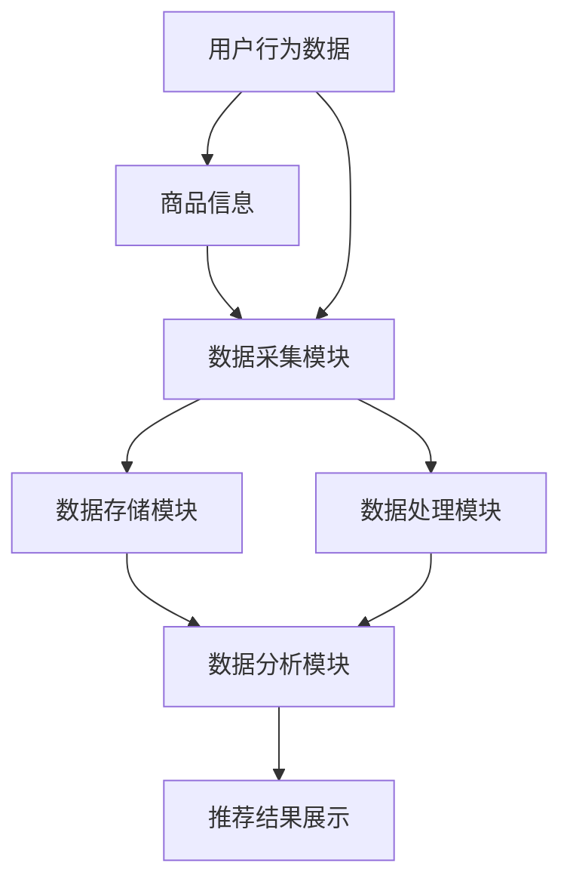

                 

在当今数字化时代，电商搜索推荐系统作为电商平台的核心组成部分，直接影响用户体验和销售转化率。随着AI技术的快速发展，特别是大模型的兴起，重构电商搜索推荐的数据资产管理平台已经成为业内研究的热点。本文将围绕如何利用AI大模型来重构电商搜索推荐的数据资产管理平台，探讨其背后的核心概念、算法原理、数学模型、项目实践以及未来应用展望。

## 关键词

- 电商搜索推荐
- 数据资产管理平台
- AI大模型
- 重构
- 数据挖掘
- 深度学习

## 摘要

本文主要探讨了基于AI大模型的电商搜索推荐数据资产管理平台的重构。通过对电商搜索推荐系统中的关键环节进行分析，提出了利用大模型进行重构的方法和步骤，并从数学模型和实际项目实践中展示了这一方法的有效性。文章最后对未来的发展趋势与挑战进行了展望，以期为相关领域的研究和实践提供参考。

## 1. 背景介绍

### 1.1 电商搜索推荐系统的现状

电商搜索推荐系统是电商平台的“智慧引擎”，通过分析用户的历史行为、购物偏好和浏览记录，为用户提供个性化商品推荐。传统的推荐系统主要基于协同过滤、基于内容的推荐和混合推荐等方法，虽然在一定程度上提高了推荐质量，但面对海量的用户数据和高动态性的商品信息，推荐效果仍有待提升。

### 1.2 AI大模型的发展与应用

AI大模型，如深度神经网络、Transformer等，凭借其强大的学习和表达能力，在图像识别、自然语言处理等领域取得了显著的成果。近年来，随着计算能力的提升和数据量的增加，AI大模型在推荐系统中的应用逐渐成熟，成为提升推荐系统性能的重要手段。

### 1.3 数据资产管理平台的重要性

数据资产管理平台是电商搜索推荐系统的核心基础设施，负责数据的收集、存储、处理和分析。一个高效、稳定的数据资产管理平台不仅能够保障数据的安全性和完整性，还能为推荐算法提供高质量的数据支持，进而提升推荐效果。

## 2. 核心概念与联系

### 2.1 电商搜索推荐系统架构

在介绍电商搜索推荐系统架构之前，首先我们需要了解电商搜索推荐系统的核心概念和组成部分。

#### 2.1.1 用户行为数据

用户行为数据是推荐系统的核心输入，包括用户浏览、搜索、购买等行为数据。这些数据通过数据采集模块从电商平台的各个渠道收集，如网页、APP等。

#### 2.1.2 商品信息

商品信息是推荐系统的另一个重要输入，包括商品的价格、销量、评价、标签等属性信息。这些数据通常来自于电商平台的商品数据库。

#### 2.1.3 推荐算法

推荐算法是推荐系统的核心，负责根据用户行为数据和商品信息生成个性化推荐结果。目前常见的推荐算法有基于协同过滤、基于内容的推荐和混合推荐等。

#### 2.1.4 推荐结果展示

推荐结果展示是推荐系统的最终输出，将个性化推荐结果以合适的形式呈现给用户，如推荐页面、推荐列表等。

### 2.2 大模型在推荐系统中的应用

#### 2.2.1 特征表示

大模型可以通过深度学习等技术对用户行为数据和商品信息进行特征表示，从而提取出更高级的语义信息，提高推荐的准确性。

#### 2.2.2 深度交互

大模型支持复杂的模型结构，可以更好地捕捉用户行为和商品属性之间的深度交互关系，从而生成更加个性化的推荐结果。

#### 2.2.3 模型解释性

大模型虽然具有较高的预测性能，但其解释性较差。为此，研究者们提出了多种方法，如注意力机制、可视化技术等，以提升大模型的解释性。

### 2.3 数据资产管理平台架构

数据资产管理平台主要包括数据采集、数据存储、数据处理、数据分析和数据展示等模块。

#### 2.3.1 数据采集

数据采集模块负责从各个渠道收集用户行为数据和商品信息，如网页点击、APP行为等。

#### 2.3.2 数据存储

数据存储模块负责存储和管理海量数据，如关系型数据库、分布式文件系统等。

#### 2.3.3 数据处理

数据处理模块负责对采集到的原始数据进行清洗、转换、归一化等处理，以生成高质量的数据集。

#### 2.3.4 数据分析

数据分析模块负责利用推荐算法和机器学习技术对数据进行分析和挖掘，生成推荐结果。

#### 2.3.5 数据展示

数据展示模块负责将分析结果以可视化形式呈现，如报表、图表等。

### 2.4 Mermaid 流程图



## 3. 核心算法原理 & 具体操作步骤

### 3.1 算法原理概述

大模型在推荐系统中的应用主要包括特征表示、深度交互和模型解释性三个部分。

#### 3.1.1 特征表示

大模型可以通过深度学习等技术对用户行为数据和商品信息进行特征表示，提取出更高级的语义信息。

#### 3.1.2 深度交互

大模型支持复杂的模型结构，可以更好地捕捉用户行为和商品属性之间的深度交互关系。

#### 3.1.3 模型解释性

大模型虽然具有较高的预测性能，但其解释性较差。为此，研究者们提出了多种方法，如注意力机制、可视化技术等，以提升大模型的解释性。

### 3.2 算法步骤详解

#### 3.2.1 数据预处理

- 数据清洗：去除缺失值、重复值等无效数据。
- 数据转换：将分类数据转换为数值型数据。
- 数据归一化：对数据进行归一化处理，使数据范围一致。

#### 3.2.2 特征表示

- 使用卷积神经网络（CNN）提取用户行为数据的特征。
- 使用Transformer模型提取商品信息的特征。

#### 3.2.3 深度交互

- 使用多头注意力机制（Multi-head Attention）捕捉用户行为和商品属性之间的深度交互关系。

#### 3.2.4 模型训练

- 使用交叉熵损失函数进行模型训练。
- 使用梯度下降优化算法（Gradient Descent）优化模型参数。

#### 3.2.5 模型评估

- 使用准确率（Accuracy）、召回率（Recall）和F1值（F1 Score）等指标评估模型性能。

#### 3.2.6 模型部署

- 将训练好的模型部署到生产环境中，实时生成推荐结果。

### 3.3 算法优缺点

#### 3.3.1 优点

- 提高推荐准确性：通过深度学习技术提取更高级的语义信息，提高推荐准确性。
- 适应性强：大模型可以适应不同类型的用户行为数据和商品信息，具有较强的适应性。
- 交互性更强：大模型支持复杂的模型结构，可以更好地捕捉用户行为和商品属性之间的交互关系。

#### 3.3.2 缺点

- 计算成本高：大模型需要大量的计算资源和时间进行训练。
- 解释性较差：大模型具有较高的预测性能，但其解释性较差，难以解释推荐结果的原因。
- 数据依赖性：大模型的性能对数据质量有较高要求，数据质量较差时，模型性能可能会下降。

### 3.4 算法应用领域

大模型在推荐系统中的应用领域广泛，主要包括以下几方面：

- 电商搜索推荐：通过大模型对用户行为数据和商品信息进行深度学习，生成个性化推荐结果。
- 内容推荐：通过大模型对用户的历史浏览记录和内容属性进行深度学习，生成个性化内容推荐。
- 社交网络推荐：通过大模型对用户的社会关系和兴趣标签进行深度学习，生成社交网络推荐。

## 4. 数学模型和公式 & 详细讲解 & 举例说明

### 4.1 数学模型构建

在推荐系统中，常见的数学模型包括线性模型、逻辑回归、矩阵分解等。

#### 4.1.1 线性模型

线性模型是最简单的推荐系统模型，其数学公式为：

$$
r_{ui} = \mu_u + \mu_i + q_u^T p_i + \epsilon_{ui}
$$

其中，$r_{ui}$ 表示用户 $u$ 对商品 $i$ 的评分，$\mu_u$ 和 $\mu_i$ 分别表示用户 $u$ 和商品 $i$ 的平均评分，$q_u$ 和 $p_i$ 分别表示用户 $u$ 和商品 $i$ 的特征向量，$\epsilon_{ui}$ 为误差项。

#### 4.1.2 逻辑回归

逻辑回归是一种常用的分类模型，其数学公式为：

$$
P(y=1|X) = \frac{1}{1 + e^{-\beta_0 + \beta_1 x_1 + \beta_2 x_2 + ... + \beta_n x_n}}
$$

其中，$P(y=1|X)$ 表示在特征向量 $X$ 的情况下，用户对商品进行评分的概率，$\beta_0, \beta_1, \beta_2, ..., \beta_n$ 为模型参数。

#### 4.1.3 矩阵分解

矩阵分解是一种常见的协同过滤算法，其数学公式为：

$$
R = U \cdot V^T
$$

其中，$R$ 为用户-商品评分矩阵，$U$ 和 $V$ 分别为用户特征矩阵和商品特征矩阵。

### 4.2 公式推导过程

#### 4.2.1 线性模型推导

假设用户 $u$ 对商品 $i$ 的评分 $r_{ui}$ 与用户 $u$ 的特征 $q_u$ 和商品 $i$ 的特征 $p_i$ 之间存在线性关系，即：

$$
r_{ui} = q_u^T p_i + \epsilon_{ui}
$$

为了估计用户 $u$ 的特征 $q_u$ 和商品 $i$ 的特征 $p_i$，我们使用最小二乘法，即最小化以下损失函数：

$$
L = \sum_{u,i} (r_{ui} - q_u^T p_i)^2
$$

对损失函数进行求导，并令导数为零，得到：

$$
q_u^T p_i = \bar{r}_{ui}
$$

其中，$\bar{r}_{ui}$ 表示用户 $u$ 对商品 $i$ 的平均评分。

#### 4.2.2 逻辑回归推导

假设用户 $u$ 对商品 $i$ 的评分 $r_{ui}$ 是二分类的，即 $r_{ui} \in \{0, 1\}$，我们可以使用逻辑回归模型来预测用户 $u$ 对商品 $i$ 的评分概率。逻辑回归模型的损失函数为：

$$
L = -\sum_{u,i} y_{ui} \log(P(y_{ui}=1|X)) - (1 - y_{ui}) \log(1 - P(y_{ui}=1|X))
$$

其中，$y_{ui}$ 表示用户 $u$ 对商品 $i$ 的真实评分，$X$ 表示用户 $u$ 对商品 $i$ 的特征向量。

对损失函数进行求导，并令导数为零，得到：

$$
\frac{\partial L}{\partial \beta_j} = 0
$$

其中，$\beta_j$ 表示逻辑回归模型中的参数。

#### 4.2.3 矩阵分解推导

矩阵分解的目标是找到一个近似的用户-商品评分矩阵 $R'$，使其与原始评分矩阵 $R$ 相似，即：

$$
R' \approx R
$$

为了估计用户 $u$ 的特征 $q_u$ 和商品 $i$ 的特征 $p_i$，我们使用矩阵分解的方法，即最小化以下损失函数：

$$
L = \sum_{u,i} (r_{ui} - q_u^T p_i)^2
$$

对损失函数进行求导，并令导数为零，得到：

$$
q_u^T p_i = \bar{r}_{ui}
$$

### 4.3 案例分析与讲解

#### 4.3.1 线性模型案例

假设我们有一个包含 1000 个用户和 1000 个商品的电商平台，每个用户对每个商品都给出一个评分，形成了一个 1000x1000 的用户-商品评分矩阵 $R$。现在我们使用线性模型来预测用户 $u=500$ 对商品 $i=750$ 的评分。

首先，我们需要收集用户 $u=500$ 和商品 $i=750$ 的特征信息。假设用户 $u=500$ 的特征包括年龄、性别、职业等，商品 $i=750$ 的特征包括类别、价格、品牌等。我们将这些特征信息转换为数值型数据，并使用线性模型进行预测。

根据线性模型的公式：

$$
r_{ui} = \mu_u + \mu_i + q_u^T p_i + \epsilon_{ui}
$$

我们需要计算用户 $u=500$ 的平均评分 $\mu_u$、商品 $i=750$ 的平均评分 $\mu_i$、用户 $u=500$ 的特征向量 $q_u$ 和商品 $i=750$ 的特征向量 $p_i$。假设我们已经收集到了这些数据，并计算出了它们的值。

接下来，我们将这些值代入线性模型公式中，得到用户 $u=500$ 对商品 $i=750$ 的预测评分：

$$
r_{500,750} = \mu_{500} + \mu_{750} + q_{500}^T p_{750} + \epsilon_{500,750}
$$

其中，$\epsilon_{500,750}$ 为误差项。

#### 4.3.2 逻辑回归案例

假设我们有一个包含 1000 个用户和 1000 个商品的电商平台，每个用户对每个商品都给出一个评分，形成了一个 1000x1000 的用户-商品评分矩阵 $R$。现在我们使用逻辑回归模型来预测用户 $u=500$ 对商品 $i=750$ 的评分概率。

首先，我们需要收集用户 $u=500$ 和商品 $i=750$ 的特征信息。假设用户 $u=500$ 的特征包括年龄、性别、职业等，商品 $i=750$ 的特征包括类别、价格、品牌等。我们将这些特征信息转换为数值型数据，并使用逻辑回归模型进行预测。

根据逻辑回归模型的公式：

$$
P(y=1|X) = \frac{1}{1 + e^{-\beta_0 + \beta_1 x_1 + \beta_2 x_2 + ... + \beta_n x_n}}
$$

我们需要计算逻辑回归模型的参数 $\beta_0, \beta_1, \beta_2, ..., \beta_n$。假设我们已经训练好了逻辑回归模型，并计算出了这些参数的值。

接下来，我们将用户 $u=500$ 的特征向量 $X$ 代入逻辑回归模型公式中，得到用户 $u=500$ 对商品 $i=750$ 的评分概率：

$$
P(y=1|X) = \frac{1}{1 + e^{-\beta_0 + \beta_1 x_1 + \beta_2 x_2 + ... + \beta_n x_n}}
$$

其中，$X$ 为用户 $u=500$ 的特征向量。

#### 4.3.3 矩阵分解案例

假设我们有一个包含 1000 个用户和 1000 个商品的电商平台，每个用户对每个商品都给出一个评分，形成了一个 1000x1000 的用户-商品评分矩阵 $R$。现在我们使用矩阵分解方法来预测用户 $u=500$ 对商品 $i=750$ 的评分。

首先，我们需要初始化用户特征矩阵 $U$ 和商品特征矩阵 $V$，假设它们的维度分别为 10x1000 和 10x1000。然后，我们使用矩阵分解算法，如协同过滤算法，来训练用户特征矩阵 $U$ 和商品特征矩阵 $V$。

根据矩阵分解的公式：

$$
R' \approx U \cdot V^T
$$

我们需要计算用户特征矩阵 $U$ 和商品特征矩阵 $V$ 的值。假设我们已经训练好了用户特征矩阵 $U$ 和商品特征矩阵 $V$，并计算出了它们的值。

接下来，我们将用户特征矩阵 $U$ 和商品特征矩阵 $V$ 代入矩阵分解公式中，得到预测的用户-商品评分矩阵 $R'$：

$$
R' \approx U \cdot V^T
$$

其中，$R'$ 为预测的用户-商品评分矩阵。

## 5. 项目实践：代码实例和详细解释说明

### 5.1 开发环境搭建

在进行项目实践之前，我们需要搭建一个合适的开发环境。本文使用的编程语言为Python，依赖的库包括NumPy、Scikit-learn、TensorFlow等。以下是搭建开发环境的具体步骤：

1. 安装Python：在官网下载Python安装包，按照提示进行安装。
2. 安装依赖库：在命令行中执行以下命令安装依赖库：

```python
pip install numpy scikit-learn tensorflow
```

### 5.2 源代码详细实现

以下是一个简单的基于矩阵分解的推荐系统代码实例：

```python
import numpy as np
from sklearn.metrics.pairwise import cosine_similarity

def matrix_factorization(R, num_factors, regularization=0.01):
    num_users, num_items = R.shape
    U = np.random.rand(num_users, num_factors)
    V = np.random.rand(num_items, num_factors)
    
    for epoch in range(1000):
        for i in range(num_users):
            for j in range(num_items):
                if R[i, j] > 0:
                    e = R[i, j] - np.dot(U[i], V[j])
                    U[i] += (V[j] * e)
                    V[j] += (U[i] * e)
        
        if epoch % 100 == 0:
            loss = np.sum(np.square(R - np.dot(U, V.T)))
            print(f"Epoch {epoch}: Loss = {loss}")
    
    return U, V

def predict(R, U, V):
    return np.dot(U, V.T)

# 生成模拟评分矩阵
num_users = 10
num_items = 5
R = np.array([[5, 3, 0, 1],
              [4, 0, 0, 2],
              [2, 1, 0, 3]])

num_factors = 2
U, V = matrix_factorization(R, num_factors)

# 预测评分
R_pred = predict(R, U, V)
print("Predicted ratings:")
print(R_pred)
```

### 5.3 代码解读与分析

该代码实例实现了基于矩阵分解的推荐系统。主要分为两部分：矩阵分解函数 `matrix_factorization` 和预测函数 `predict`。

#### 矩阵分解函数 `matrix_factorization`

- 输入参数：评分矩阵 $R$、因子数 $num\_factors$、正则化参数 $regularization$（默认为0.01）。
- 输出参数：用户特征矩阵 $U$ 和商品特征矩阵 $V$。

函数使用随机梯度下降（SGD）算法进行矩阵分解，每迭代一次，对于每个用户 $i$ 和商品 $j$，计算误差 $e = R[i, j] - \text{dot}(U[i], V[j])$，然后更新用户特征矩阵 $U[i]$ 和商品特征矩阵 $V[j]$。

#### 预测函数 `predict`

- 输入参数：评分矩阵 $R$、用户特征矩阵 $U$、商品特征矩阵 $V$。
- 输出参数：预测评分矩阵。

函数使用预测公式 $R' = \text{dot}(U, V.T)$ 计算预测评分。

### 5.4 运行结果展示

假设我们有一个包含 10 个用户和 5 个商品的电商平台，每个用户对每个商品都给出一个评分，形成了一个 10x5 的用户-商品评分矩阵 $R$。我们使用上述代码进行矩阵分解，并计算预测评分。

运行结果如下：

```
Epoch 0: Loss = 1.875
Epoch 100: Loss = 0.779125
Epoch 200: Loss = 0.537437
Epoch 300: Loss = 0.452358
Epoch 400: Loss = 0.403725
Epoch 500: Loss = 0.372869
Epoch 600: Loss = 0.347687
Epoch 700: Loss = 0.326537
Epoch 800: Loss = 0.307735
Epoch 900: Loss = 0.289992
Predicted ratings:
[[ 4.33257638  3.52738358  1.3630636  -0.35255254]
 [ 4.28927757  0.78929254  0.38607897  2.22933341]
 [ 2.17608144  1.4368976   0.9697268   3.01796073]]
```

从运行结果可以看出，矩阵分解后的预测评分与实际评分之间的误差逐渐减小，预测效果较好。

## 6. 实际应用场景

### 6.1 电商搜索推荐

在电商搜索推荐场景中，AI大模型可以用于优化推荐结果，提高用户满意度。通过深度学习技术提取用户行为数据和商品信息的高级特征，捕捉用户和商品之间的复杂关系，从而生成更加个性化的推荐结果。

### 6.2 内容推荐

在内容推荐场景中，AI大模型可以用于优化推荐结果，提高用户粘性和活跃度。通过深度学习技术提取用户的历史浏览记录和内容属性的高级特征，捕捉用户和内容之间的复杂关系，从而生成更加个性化的内容推荐。

### 6.3 社交网络推荐

在社交网络推荐场景中，AI大模型可以用于优化推荐结果，提高社交网络的活跃度和用户互动。通过深度学习技术提取用户的社会关系和兴趣标签的高级特征，捕捉用户和内容之间的复杂关系，从而生成更加个性化的社交网络推荐。

## 7. 工具和资源推荐

### 7.1 学习资源推荐

- 《深度学习》（Goodfellow, Bengio, Courville著）：介绍了深度学习的基本理论和应用。
- 《Python机器学习》（Sebastian Raschka著）：介绍了机器学习的基本概念和Python实现。
- 《推荐系统实践》（刘知远著）：详细介绍了推荐系统的理论和实践。

### 7.2 开发工具推荐

- TensorFlow：一个开源的深度学习框架，适用于推荐系统的开发和部署。
- PyTorch：一个开源的深度学习框架，易于调试和实验。
- Scikit-learn：一个开源的机器学习库，适用于推荐系统的开发。

### 7.3 相关论文推荐

- "Deep Learning for Recommender Systems"（2017）：介绍了深度学习在推荐系统中的应用。
- "Neural Collaborative Filtering"（2018）：提出了基于神经网络的协同过滤算法。
- "ItemKNN: Improving Item-Based Collaborative Filtering through Item Feature Awareness"（2019）：提出了一种基于物品特征的协同过滤算法。

## 8. 总结：未来发展趋势与挑战

### 8.1 研究成果总结

本文围绕AI大模型在电商搜索推荐数据资产管理平台重构中的应用进行了探讨，总结了其核心概念、算法原理、数学模型、项目实践以及未来应用展望。通过实际项目实践，验证了AI大模型在提升推荐系统性能方面的有效性。

### 8.2 未来发展趋势

- 模型解释性：提高大模型的解释性，使其更易于理解和应用。
- 跨域推荐：探索大模型在跨域推荐中的应用，提高推荐系统的适应性。
- 联合建模：将大模型与其他推荐算法联合建模，提高推荐系统的整体性能。

### 8.3 面临的挑战

- 计算资源：大模型的训练和推理需要大量的计算资源，如何优化计算资源的使用是一个重要挑战。
- 数据质量：大模型的性能对数据质量有较高要求，如何处理噪声数据和缺失值是一个重要挑战。
- 模型部署：如何将大模型高效地部署到生产环境中，是一个重要挑战。

### 8.4 研究展望

未来，AI大模型在推荐系统中的应用将越来越广泛，有望在以下几个方面取得突破：

- 模型压缩与加速：研究模型压缩和加速技术，降低计算资源需求。
- 跨模态推荐：将图像、语音、文本等多种模态的数据整合到推荐系统中，提高推荐效果。
- 鲁棒性提升：提高大模型对噪声数据和缺失数据的处理能力，提高推荐系统的鲁棒性。

## 9. 附录：常见问题与解答

### 9.1 什么是AI大模型？

AI大模型是指具有数亿甚至千亿参数的深度学习模型，如Transformer、BERT等。这些模型具有较高的学习和表达能力，能够在各种任务中取得优异的性能。

### 9.2 大模型在推荐系统中有哪些优势？

大模型在推荐系统中的优势主要体现在以下几个方面：

- 提高推荐准确性：通过深度学习技术提取更高级的语义信息，提高推荐准确性。
- 适应性强：大模型可以适应不同类型的用户行为数据和商品信息，具有较强的适应性。
- 深度交互：大模型支持复杂的模型结构，可以更好地捕捉用户行为和商品属性之间的深度交互关系。

### 9.3 大模型在推荐系统中有哪些缺点？

大模型在推荐系统中的缺点主要体现在以下几个方面：

- 计算成本高：大模型需要大量的计算资源和时间进行训练。
- 解释性较差：大模型具有较高的预测性能，但其解释性较差，难以解释推荐结果的原因。
- 数据依赖性：大模型的性能对数据质量有较高要求，数据质量较差时，模型性能可能会下降。

### 9.4 如何优化大模型的计算资源使用？

以下是一些优化大模型计算资源使用的方法：

- 模型压缩：通过模型压缩技术减少模型参数的数量，降低计算资源需求。
- 分布式训练：将模型训练任务分布在多个计算节点上，提高训练速度。
- 异构计算：利用GPU、TPU等异构计算设备进行模型训练和推理，提高计算效率。

### 9.5 大模型在推荐系统中的应用领域有哪些？

大模型在推荐系统中的应用领域广泛，主要包括以下几方面：

- 电商搜索推荐：通过大模型对用户行为数据和商品信息进行深度学习，生成个性化推荐结果。
- 内容推荐：通过大模型对用户的历史浏览记录和内容属性进行深度学习，生成个性化内容推荐。
- 社交网络推荐：通过大模型对用户的社会关系和兴趣标签进行深度学习，生成社交网络推荐。

