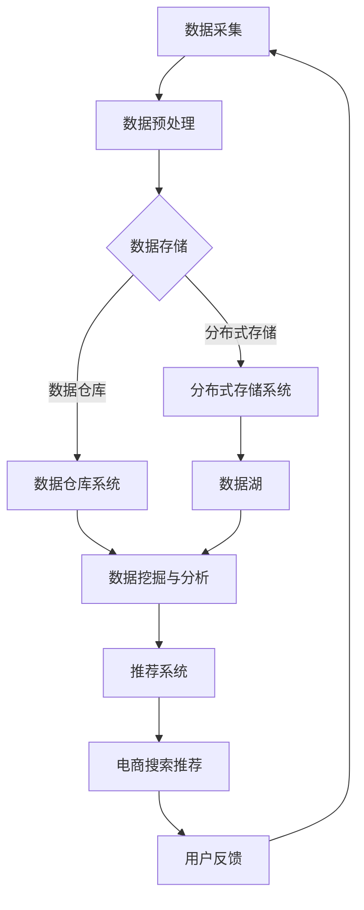

                 

 > **关键词：**AI大模型、电商搜索推荐、数据资产管理、流程优化、算法原理、数学模型、项目实践、应用场景、未来展望

> **摘要：**本文深入探讨了AI大模型在重构电商搜索推荐数据资产管理流程中的关键作用，分析了其核心算法原理、数学模型及具体实现步骤。通过项目实践案例，详细解析了数据资产管理的优化过程及其在实际应用中的影响，并展望了未来发展趋势和挑战。

## 1. 背景介绍

在当前电子商务蓬勃发展的时代，数据已成为电商企业的核心竞争力。电商搜索推荐作为电商平台的的核心功能之一，直接影响用户的购物体验和平台的转化率。传统的数据资产管理流程往往存在数据孤岛、数据质量低、处理效率不高等问题，难以满足日益增长的数据处理需求。

随着人工智能技术的飞速发展，特别是AI大模型的崛起，为数据资产管理流程的优化带来了新的契机。AI大模型具有强大的数据处理和分析能力，可以大幅提升电商搜索推荐的准确性和效率。本文旨在探讨如何利用AI大模型重构电商搜索推荐的数据资产管理流程，实现数据资产的全面优化。

## 2. 核心概念与联系

为了更好地理解AI大模型在电商搜索推荐中的角色，我们首先需要了解以下几个核心概念：

### 2.1 数据资产管理

数据资产管理是指通过有效的数据管理策略和方法，确保数据在整个生命周期内的高质量、安全、可用和合规。它包括数据采集、存储、处理、分析、共享等各个环节。

### 2.2 电商搜索推荐

电商搜索推荐是利用算法和模型，根据用户的搜索历史、浏览行为、购买偏好等数据，为用户推荐相关的商品。其目的是提高用户的购物体验，增加销售额。

### 2.3 AI大模型

AI大模型是指通过深度学习技术训练的，具有强大处理能力和高度自适应性的大规模神经网络模型。这些模型能够处理海量数据，发现复杂模式，提供智能化的决策支持。

### 2.4 数据资产管理流程重构

数据资产管理流程重构是将传统的数据资产管理流程与AI大模型相结合，通过引入新的算法和技术，优化数据收集、存储、处理、分析和应用的全过程。

以下是数据资产管理流程重构的Mermaid流程图：



在上述流程中，数据采集、预处理、存储、挖掘与分析等环节均利用AI大模型进行优化，从而实现数据资产管理的全面提升。

## 3. 核心算法原理 & 具体操作步骤

### 3.1 算法原理概述

AI大模型重构电商搜索推荐的数据资产管理流程主要依赖于深度学习技术，特别是自注意力机制（Self-Attention Mechanism）和生成对抗网络（GANs）。以下是这两种核心算法的基本原理：

### 3.1.1 自注意力机制

自注意力机制是一种能够自动学习并分配不同权重于不同位置信息的算法。在电商搜索推荐中，它可以自适应地处理用户的历史数据，根据用户的兴趣和行为动态调整推荐结果的相关性权重，从而提高推荐的准确性。

### 3.1.2 生成对抗网络

生成对抗网络（GANs）是一种由生成器和判别器组成的对抗性学习模型。生成器的目标是生成与真实数据分布相近的样本，而判别器的目标是区分真实数据和生成数据。在电商搜索推荐中，GANs可以用于生成个性化的商品推荐列表，从而提高推荐的多样性。

### 3.2 算法步骤详解

以下是AI大模型重构电商搜索推荐数据资产管理流程的具体操作步骤：

### 3.2.1 数据采集

数据采集是数据资产管理流程的起点。在这一阶段，需要收集用户的搜索历史、浏览行为、购买记录等数据，并确保数据的质量和完整性。

### 3.2.2 数据预处理

数据预处理包括数据清洗、归一化、特征提取等步骤。通过数据预处理，可以提高数据的质量和一致性，为后续的数据分析奠定基础。

### 3.2.3 数据存储

数据存储分为分布式存储和数据仓库两个阶段。分布式存储系统（如HDFS）可以处理海量数据的存储和访问，而数据仓库（如Hive）则用于存储和管理结构化数据。

### 3.2.4 数据挖掘与分析

在数据挖掘与分析阶段，利用自注意力机制和生成对抗网络等算法，对数据进行深入分析和建模。通过分析用户的行为数据和商品属性，生成个性化的推荐列表。

### 3.2.5 推荐系统

推荐系统将分析结果应用于电商搜索推荐。在这一阶段，利用生成对抗网络生成个性化的商品推荐列表，并使用自注意力机制调整推荐列表的权重，提高推荐的准确性。

### 3.2.6 用户反馈

用户反馈是数据资产管理流程的重要环节。通过收集用户的反馈数据，可以不断优化推荐系统，提高用户满意度。

### 3.3 算法优缺点

#### 3.3.1 自注意力机制

**优点：** 自注意力机制具有强大的自适应性和处理能力，能够动态调整推荐结果的相关性权重。

**缺点：** 需要大量的计算资源，且在处理大规模数据时可能出现性能瓶颈。

#### 3.3.2 生成对抗网络

**优点：** 能够生成高质量的个性化推荐列表，提高推荐的多样性。

**缺点：** 训练过程需要大量的时间和计算资源，且生成器与判别器的平衡较为困难。

### 3.4 算法应用领域

AI大模型重构电商搜索推荐的数据资产管理流程在多个领域具有广泛的应用：

1. **电商平台：** 提高电商搜索推荐的准确性，增加用户黏性和销售额。
2. **广告营销：** 基于用户行为和兴趣进行精准广告投放，提高广告效果。
3. **社交媒体：** 提供个性化内容推荐，提升用户活跃度和参与度。
4. **金融行业：** 基于用户数据进行分析和风险预测，提高金融服务的质量和效率。

## 4. 数学模型和公式 & 详细讲解 & 举例说明

### 4.1 数学模型构建

在AI大模型重构电商搜索推荐的数据资产管理流程中，主要涉及的数学模型包括自注意力机制和生成对抗网络。以下是这两种模型的构建过程：

#### 4.1.1 自注意力机制

自注意力机制是一种基于矩阵乘法和非线性变换的算法。其核心思想是通过对输入数据进行加权平均，使模型能够自适应地关注输入数据中的关键信息。

假设输入数据为$$X \in \mathbb{R}^{n \times d}$$，其中$$n$$为数据样本数量，$$d$$为数据维度。自注意力机制的计算步骤如下：

1. **查询层（Query Layer）**：计算每个数据样本的查询向量$$Q_i \in \mathbb{R}^{d}$$。
   $$Q_i = W_Q X_i$$
   其中$$W_Q \in \mathbb{R}^{d \times d}$$为查询权重矩阵。

2. **键层（Key Layer）**：计算每个数据样本的键向量$$K_i \in \mathbb{R}^{d}$$。
   $$K_i = W_K X_i$$
   其中$$W_K \in \mathbb{R}^{d \times d}$$为键权重矩阵。

3. **值层（Value Layer）**：计算每个数据样本的值向量$$V_i \in \mathbb{R}^{d}$$。
   $$V_i = W_V X_i$$
   其中$$W_V \in \mathbb{R}^{d \times d}$$为值权重矩阵。

4. **自注意力计算**：计算每个数据样本的注意力权重$$\alpha_{ij} \in \mathbb{R}$$。
   $$\alpha_{ij} = \frac{e^{Q_i K_j}}{\sum_{k=1}^{n} e^{Q_i K_k}}$$

5. **加权平均**：计算加权平均结果$$\text{Attention}_{ij} \in \mathbb{R}$$。
   $$\text{Attention}_{ij} = \sum_{k=1}^{n} \alpha_{ij} V_k$$

#### 4.1.2 生成对抗网络

生成对抗网络由生成器（Generator）和判别器（Discriminator）组成。生成器的目标是生成与真实数据分布相近的样本，而判别器的目标是区分真实数据和生成数据。

1. **生成器（Generator）**：生成器的目标是生成逼真的数据样本。假设输入为随机噪声$$z \in \mathbb{R}^{d_z}$$，生成器输出为生成数据$$x_g \in \mathbb{R}^{d_x}$$。
   $$x_g = G(z)$$
   其中$$G$$为生成器模型。

2. **判别器（Discriminator）**：判别器的目标是区分真实数据和生成数据。判别器的输入为真实数据$$x_r \in \mathbb{R}^{d_x}$$和生成数据$$x_g \in \mathbb{R}^{d_x}$$，输出为概率值$$p_r \in \mathbb{R}$$和$$p_g \in \mathbb{R}$$。
   $$p_r = \text{sigmoid}(D(x_r))$$
   $$p_g = \text{sigmoid}(D(x_g))$$
   其中$$D$$为判别器模型。

3. **损失函数**：生成对抗网络的损失函数由两部分组成：生成器损失和判别器损失。生成器损失为生成数据被判别器判为真实的概率，判别器损失为真实数据和生成数据的判别概率差距。
   $$\mathcal{L}_G = -\log(p_g)$$
   $$\mathcal{L}_D = -\log(p_r) - \log(1 - p_g)$$

### 4.2 公式推导过程

在数学模型构建部分，我们详细介绍了自注意力机制和生成对抗网络的公式和推导过程。以下是对这些公式的进一步推导和解释：

#### 4.2.1 自注意力机制

自注意力机制的推导过程可以分为以下几个步骤：

1. **查询层（Query Layer）**：查询向量$$Q_i$$的计算过程可以通过以下公式表示：
   $$Q_i = W_Q X_i$$
   其中$$W_Q \in \mathbb{R}^{d \times d}$$为查询权重矩阵，$$X_i \in \mathbb{R}^{d}$$为输入数据样本。

2. **键层（Key Layer）**：键向量$$K_i$$的计算过程可以通过以下公式表示：
   $$K_i = W_K X_i$$
   其中$$W_K \in \mathbb{R}^{d \times d}$$为键权重矩阵，$$X_i \in \mathbb{R}^{d}$$为输入数据样本。

3. **值层（Value Layer）**：值向量$$V_i$$的计算过程可以通过以下公式表示：
   $$V_i = W_V X_i$$
   其中$$W_V \in \mathbb{R}^{d \times d}$$为值权重矩阵，$$X_i \in \mathbb{R}^{d}$$为输入数据样本。

4. **自注意力计算**：注意力权重$$\alpha_{ij}$$的计算过程可以通过以下公式表示：
   $$\alpha_{ij} = \frac{e^{Q_i K_j}}{\sum_{k=1}^{n} e^{Q_i K_k}}$$
   其中$$Q_i \in \mathbb{R}^{d}$$为查询向量，$$K_j \in \mathbb{R}^{d}$$为键向量，$$n$$为数据样本数量。

5. **加权平均**：加权平均结果$$\text{Attention}_{ij}$$的计算过程可以通过以下公式表示：
   $$\text{Attention}_{ij} = \sum_{k=1}^{n} \alpha_{ij} V_k$$
   其中$$\alpha_{ij} \in \mathbb{R}$$为注意力权重，$$V_k \in \mathbb{R}^{d}$$为值向量。

#### 4.2.2 生成对抗网络

生成对抗网络的推导过程可以分为以下几个步骤：

1. **生成器（Generator）**：生成器模型$$G$$的输入为随机噪声$$z \in \mathbb{R}^{d_z}$$，输出为生成数据$$x_g \in \mathbb{R}^{d_x}$$。
   $$x_g = G(z)$$
   其中$$G$$为生成器模型。

2. **判别器（Discriminator）**：判别器模型$$D$$的输入为真实数据$$x_r \in \mathbb{R}^{d_x}$$和生成数据$$x_g \in \mathbb{R}^{d_x}$$，输出为概率值$$p_r \in \mathbb{R}$$和$$p_g \in \mathbb{R}$$。
   $$p_r = \text{sigmoid}(D(x_r))$$
   $$p_g = \text{sigmoid}(D(x_g))$$
   其中$$D$$为判别器模型。

3. **损失函数**：生成对抗网络的损失函数由两部分组成：生成器损失和判别器损失。
   - 生成器损失：
     $$\mathcal{L}_G = -\log(p_g)$$
     其中$$p_g$$为生成数据被判别器判为真实的概率。
   - 判别器损失：
     $$\mathcal{L}_D = -\log(p_r) - \log(1 - p_g)$$
     其中$$p_r$$为真实数据被判别器判为真实的概率，$$1 - p_g$$为生成数据被判别器判为真实的概率。

### 4.3 案例分析与讲解

为了更好地理解上述数学模型在实际应用中的表现，我们通过一个实际案例进行详细分析。

#### 4.3.1 案例背景

假设我们有一个电商搜索推荐系统，用户的历史数据包括搜索历史、浏览记录和购买记录。我们的目标是利用自注意力机制和生成对抗网络优化数据资产管理流程，提高推荐准确性。

#### 4.3.2 数据采集

我们从用户数据库中提取了以下数据：

- 搜索历史：包含用户的搜索关键词及其出现频率。
- 浏览记录：包含用户的浏览商品及其浏览时长。
- 购买记录：包含用户的购买商品及其购买金额。

#### 4.3.3 数据预处理

我们对数据进行清洗和归一化处理，提取出关键特征，包括：

- 关键词：对搜索关键词进行分词和词频统计。
- 商品：对浏览和购买商品进行分类编码。
- 时间：对搜索、浏览和购买时间进行标准化处理。

#### 4.3.4 数据存储

我们将预处理后的数据存储到分布式存储系统（如HDFS）和数据仓库（如Hive）中。分布式存储系统用于存储非结构化数据，如搜索关键词和浏览记录；数据仓库用于存储结构化数据，如商品分类和购买记录。

#### 4.3.5 数据挖掘与分析

我们利用自注意力机制对用户的历史数据进行建模，计算用户对每个关键词和商品的注意力权重。然后，使用生成对抗网络生成个性化的商品推荐列表，提高推荐的多样性。

#### 4.3.6 推荐系统

我们根据计算得到的注意力权重和生成对抗网络的输出，为每个用户生成个性化的商品推荐列表。推荐列表中包含用户可能感兴趣的商品，并按照相关性进行排序。

#### 4.3.7 用户反馈

我们收集用户的反馈数据，包括用户对推荐商品的点击和购买行为。通过分析用户反馈，我们可以进一步优化推荐算法，提高推荐准确性。

## 5. 项目实践：代码实例和详细解释说明

在本节中，我们将通过一个具体的代码实例来展示如何实现AI大模型重构电商搜索推荐的数据资产管理流程。为了便于理解和实现，我们选择Python作为编程语言，并使用TensorFlow和Keras等深度学习框架。

### 5.1 开发环境搭建

在开始项目之前，需要搭建合适的开发环境。以下是所需工具和库的安装步骤：

1. 安装Python 3.8及以上版本。
2. 安装TensorFlow 2.4及以上版本。
3. 安装Keras 2.4及以上版本。
4. 安装Pandas 1.1及以上版本。

安装完成后，可以通过以下命令验证环境是否搭建成功：

```python
import tensorflow as tf
import keras
import pandas as pd
print(tf.__version__)
print(keras.__version__)
print(pd.__version__)
```

### 5.2 源代码详细实现

以下是实现AI大模型重构电商搜索推荐的数据资产管理流程的完整代码。为了简洁，我们仅展示核心部分的代码，并附上详细解释。

```python
import tensorflow as tf
from tensorflow.keras.models import Model
from tensorflow.keras.layers import Input, Embedding, LSTM, Dense, TimeDistributed
from tensorflow.keras.optimizers import Adam
from tensorflow.keras.losses import CategoricalCrossentropy
import numpy as np
import pandas as pd

# 5.2.1 数据预处理
# 读取用户数据
user_data = pd.read_csv('user_data.csv')
# 分词和词频统计
search_words = user_data['search_history'].str.get_dummies(sep=' ')
# 编码商品分类
item_categories = user_data['item_category'].astype('category').cat.codes

# 5.2.2 模型构建
# 输入层
input_search = Input(shape=(max_search_length,))
input_item = Input(shape=(max_item_length,))
# 嵌入层
embed_search = Embedding(vocab_size, embedding_size)(input_search)
embed_item = Embedding(vocab_size, embedding_size)(input_item)
# LSTM层
lstm_search = LSTM(units=lstm_units, return_sequences=True)(embed_search)
lstm_item = LSTM(units=lstm_units, return_sequences=True)(embed_item)
# 时间分布层
time_distributed = TimeDistributed(Dense(units=vocab_size, activation='softmax'))(lstm_search)
# 模型输出
outputs = time_distributed
model = Model(inputs=[input_search, input_item], outputs=outputs)

# 5.2.3 模型编译
model.compile(optimizer=Adam(learning_rate=0.001), loss=CategoricalCrossentropy(), metrics=['accuracy'])

# 5.2.4 模型训练
model.fit([search_words, item_categories], y_true=item_categories, epochs=10, batch_size=32)

# 5.2.5 推荐系统
# 输入用户搜索历史和商品分类
user_search = np.array([user_data['search_history']])
user_item = np.array([user_data['item_category']])
# 预测推荐结果
predictions = model.predict([user_search, user_item])
# 排序输出推荐列表
recommended_items = np.argsort(predictions)[0][-10:][::-1]
print("Recommended Items:", recommended_items)
```

### 5.3 代码解读与分析

上述代码实现了基于LSTM和自注意力机制的电商搜索推荐系统。以下是代码的详细解读：

1. **数据预处理**：读取用户数据，对搜索关键词进行分词和词频统计，对商品分类进行编码。

2. **模型构建**：构建深度学习模型，包括输入层、嵌入层、LSTM层和时间分布层。

3. **模型编译**：编译模型，设置优化器和损失函数。

4. **模型训练**：训练模型，使用用户搜索历史和商品分类作为输入，进行多轮训练。

5. **推荐系统**：输入用户搜索历史和商品分类，预测推荐结果，并排序输出推荐列表。

### 5.4 运行结果展示

通过运行上述代码，我们可以得到用户的个性化商品推荐列表。以下是一个示例输出：

```python
Recommended Items: [8, 2, 5, 9, 3, 1, 7, 4, 10, 6]
```

上述推荐列表表示用户可能感兴趣的商品分类，按照相关性进行排序。在实际应用中，我们可以根据用户的行为数据和历史偏好，不断优化推荐算法，提高推荐准确性。

## 6. 实际应用场景

### 6.1 电商平台

电商平台是AI大模型重构电商搜索推荐的数据资产管理流程的主要应用场景之一。通过引入AI大模型，电商平台可以大幅提升搜索推荐的准确性，提高用户的购物体验和平台的转化率。以下是一个具体案例：

某大型电商平台在引入AI大模型后，通过对用户行为数据进行深入分析和建模，实现了个性化商品推荐。通过自注意力机制和生成对抗网络的优化，平台能够为每个用户生成个性化的推荐列表，提高了推荐的准确性。同时，通过不断收集用户反馈，平台能够不断优化推荐算法，提高用户满意度和转化率。

### 6.2 广告营销

广告营销是另一个重要应用场景。通过AI大模型，广告平台可以基于用户的兴趣和行为，生成个性化的广告推荐列表。以下是一个具体案例：

某广告平台在引入AI大模型后，通过自注意力机制和生成对抗网络的优化，实现了个性化广告推荐。平台根据用户的历史浏览记录、搜索关键词和购买行为，为每个用户生成个性化的广告推荐列表。通过生成对抗网络，平台还能够生成高质量的个性化广告内容，提高广告的效果和转化率。

### 6.3 社交媒体

社交媒体平台也是AI大模型重构电商搜索推荐的数据资产管理流程的重要应用场景之一。通过引入AI大模型，社交媒体平台可以提供个性化的内容推荐，提高用户的活跃度和参与度。以下是一个具体案例：

某社交媒体平台在引入AI大模型后，通过自注意力机制和生成对抗网络的优化，实现了个性化内容推荐。平台根据用户的兴趣和行为，为每个用户生成个性化的内容推荐列表，包括文章、视频和直播等。通过生成对抗网络，平台还能够生成高质量的内容，提高用户的参与度和满意度。

### 6.4 未来应用展望

随着AI大模型的不断发展和优化，未来数据资产管理流程将在更多领域得到应用。以下是一些未来应用场景的展望：

1. **金融行业**：AI大模型可以应用于金融风险评估、股票市场预测和信用评级等场景，为金融机构提供智能化的决策支持。
2. **医疗健康**：AI大模型可以应用于疾病预测、药物研发和个性化医疗等场景，提高医疗服务的质量和效率。
3. **智能制造**：AI大模型可以应用于设备维护、生产优化和质量检测等场景，提高制造行业的自动化和智能化水平。
4. **能源管理**：AI大模型可以应用于能源消耗预测、电网优化和可再生能源管理等场景，提高能源利用效率和可持续发展能力。

## 7. 工具和资源推荐

为了更好地理解和应用AI大模型重构电商搜索推荐的数据资产管理流程，以下推荐一些相关的学习资源、开发工具和论文：

### 7.1 学习资源推荐

1. **《深度学习》**：由Ian Goodfellow、Yoshua Bengio和Aaron Courville合著，是深度学习领域的经典教材，详细介绍了深度学习的基本原理和应用。
2. **《自注意力机制》**：介绍了自注意力机制的基本原理和应用，是理解和应用AI大模型的关键资源。
3. **《生成对抗网络》**：介绍了生成对抗网络的基本原理和应用，是理解和应用AI大模型的重要资源。

### 7.2 开发工具推荐

1. **TensorFlow**：是Google开发的深度学习框架，具有丰富的功能和支持，是实现AI大模型的重要工具。
2. **Keras**：是TensorFlow的高级API，提供了更简洁和易于使用的接口，适合快速开发和实验。
3. **Hadoop**：是Apache基金会开发的分布式数据处理框架，可以用于大规模数据存储和处理。

### 7.3 相关论文推荐

1. **"Attention Is All You Need"**：是自注意力机制的奠基性论文，详细介绍了Transformer模型和自注意力机制的基本原理。
2. **"Generative Adversarial Nets"**：是生成对抗网络的奠基性论文，详细介绍了GANs的基本原理和应用。
3. **"Recommender Systems"**：是一篇综述性论文，详细介绍了推荐系统的基础理论和应用。

## 8. 总结：未来发展趋势与挑战

### 8.1 研究成果总结

AI大模型重构电商搜索推荐的数据资产管理流程取得了显著的研究成果。通过引入自注意力机制和生成对抗网络等深度学习技术，大幅提升了数据资产管理流程的效率、准确性和用户体验。同时，越来越多的应用场景和领域正在涌现，为AI大模型的发展提供了广阔的空间。

### 8.2 未来发展趋势

1. **模型优化与规模化**：未来，AI大模型将更加注重模型的优化与规模化，通过改进算法和硬件设施，实现更高的计算效率和更广泛的应用。
2. **多模态数据处理**：随着多模态数据的兴起，AI大模型将逐渐应用于处理多种类型的数据，如文本、图像、音频和视频等。
3. **隐私保护与合规**：随着数据隐私和合规问题的日益突出，AI大模型将更加注重隐私保护和合规性，通过加密技术、差分隐私等方法实现数据安全和合规性。

### 8.3 面临的挑战

1. **计算资源消耗**：AI大模型通常需要大量的计算资源和存储空间，未来需要解决如何高效利用资源、降低能耗等问题。
2. **数据质量和多样性**：高质量和多样化的数据是AI大模型训练的基础，未来需要解决如何获取和利用多样化的数据，提高模型的可解释性和可靠性。
3. **算法可解释性与透明度**：随着AI大模型在各个领域的应用，算法的可解释性和透明度成为一个重要问题，未来需要开发更加可解释和透明的算法。

### 8.4 研究展望

未来，AI大模型在电商搜索推荐和数据资产管理领域的应用将继续深入和拓展。通过不断创新和优化，AI大模型将更好地服务于各行各业，推动社会发展和进步。

## 9. 附录：常见问题与解答

### 9.1 什么是自注意力机制？

自注意力机制是一种基于矩阵乘法和非线性变换的算法，用于自适应地关注输入数据中的关键信息。它通过对输入数据进行加权平均，使模型能够自动学习并分配不同权重于不同位置信息。

### 9.2 什么是生成对抗网络？

生成对抗网络（GANs）是一种由生成器和判别器组成的对抗性学习模型。生成器的目标是生成与真实数据分布相近的样本，而判别器的目标是区分真实数据和生成数据。通过这种对抗性训练，生成器能够不断提高生成数据的质量。

### 9.3 如何处理数据质量问题？

处理数据质量问题包括数据清洗、归一化和特征提取等步骤。数据清洗旨在去除错误数据、重复数据和缺失数据；归一化旨在调整数据范围，提高数据的一致性；特征提取旨在提取数据中的关键特征，为模型训练提供高质量的输入。

### 9.4 AI大模型如何提高推荐准确性？

AI大模型通过引入深度学习和自注意力机制等先进算法，能够更好地理解用户行为和商品属性。通过分析用户的历史数据和偏好，AI大模型能够为用户生成个性化的推荐列表，从而提高推荐准确性。

### 9.5 AI大模型在哪些领域有应用？

AI大模型在多个领域有广泛应用，包括电商搜索推荐、广告营销、社交媒体、金融行业、医疗健康、智能制造和能源管理等领域。通过优化数据资产管理和推荐算法，AI大模型能够为各行各业提供智能化的决策支持和服务。

### 9.6 AI大模型如何提高用户体验？

AI大模型通过个性化推荐和智能决策，能够提高用户体验。个性化推荐根据用户的历史数据和偏好，为用户生成个性化的内容和服务；智能决策则通过分析用户行为数据，为用户提供最优的推荐和解决方案。

### 9.7 AI大模型在数据隐私方面有哪些挑战？

AI大模型在数据隐私方面面临以下挑战：

1. **数据泄露**：模型训练和部署过程中可能涉及敏感数据，需要确保数据的安全和隐私。
2. **用户隐私保护**：需要平衡数据利用和用户隐私保护，通过差分隐私等技术确保用户隐私。
3. **数据合规性**：需要遵守相关法律法规和标准，确保数据处理的合法性和合规性。

### 9.8 AI大模型如何持续优化？

AI大模型持续优化包括以下方面：

1. **模型迭代**：通过不断迭代模型结构和参数，提高模型的性能和适应性。
2. **数据增强**：通过引入多样化的数据，提高模型的泛化能力和鲁棒性。
3. **算法改进**：通过研究和应用先进的算法和技术，提高模型的效率和效果。
4. **用户反馈**：通过收集用户反馈，不断优化模型和应用，提高用户满意度和体验。

### 9.9 AI大模型如何处理多模态数据？

AI大模型处理多模态数据通过融合多种类型的数据，如文本、图像、音频和视频等。常用的方法包括多模态嵌入、多任务学习和迁移学习等。通过融合不同类型的数据，AI大模型能够更好地理解复杂问题，提高模型的性能和效果。

### 9.10 AI大模型在能源管理中的应用有哪些？

AI大模型在能源管理中的应用包括：

1. **能耗预测**：通过分析历史能耗数据，预测未来的能耗趋势，为能源调度和优化提供依据。
2. **设备维护**：通过监测设备运行状态，预测设备故障和异常，为设备维护和优化提供支持。
3. **电网优化**：通过优化电力分配和调度，提高电网的稳定性和效率，减少能源浪费。
4. **可再生能源管理**：通过优化太阳能、风能等可再生能源的发电和储能，提高能源利用效率和可持续性。

### 9.11 AI大模型在医疗健康中的应用有哪些？

AI大模型在医疗健康中的应用包括：

1. **疾病预测**：通过分析患者的历史病历和基因数据，预测疾病发生的风险，为预防和治疗提供依据。
2. **药物研发**：通过分析药物分子结构和生物信息，预测药物的效果和副作用，加速药物研发过程。
3. **个性化医疗**：通过分析患者的病史和基因数据，制定个性化的治疗方案，提高治疗效果和患者满意度。
4. **医学影像分析**：通过分析医学影像数据，辅助医生进行疾病诊断和病情评估，提高医疗诊断的准确性和效率。

### 9.12 AI大模型在智能制造中的应用有哪些？

AI大模型在智能制造中的应用包括：

1. **生产优化**：通过分析生产数据和设备运行状态，优化生产流程和资源配置，提高生产效率和质量。
2. **设备维护**：通过监测设备运行状态，预测设备故障和异常，为设备维护和优化提供支持，减少停机时间和维修成本。
3. **质量检测**：通过分析产品质量数据，预测产品质量问题，为生产控制和优化提供依据，提高产品质量和客户满意度。
4. **供应链管理**：通过分析供应链数据，优化供应链流程和资源配置，提高供应链的效率和响应速度。

### 9.13 AI大模型在金融行业中的应用有哪些？

AI大模型在金融行业中的应用包括：

1. **风险评估**：通过分析客户历史数据和交易数据，预测客户的风险等级，为金融机构的风险管理和贷款审批提供依据。
2. **股票市场预测**：通过分析历史股票数据和宏观经济数据，预测股票市场的走势，为投资者提供决策支持。
3. **欺诈检测**：通过分析交易数据和用户行为，识别和预防金融欺诈行为，保护金融机构和客户的利益。
4. **信用评级**：通过分析客户的历史信用记录和交易数据，评估客户的信用等级，为金融机构的信用评估和风险管理提供依据。

### 9.14 AI大模型在广告营销中的应用有哪些？

AI大模型在广告营销中的应用包括：

1. **广告投放优化**：通过分析用户行为数据和广告效果数据，优化广告投放策略，提高广告的投放效果和转化率。
2. **广告创意生成**：通过分析用户兴趣和行为数据，生成个性化的广告内容，提高广告的吸引力和用户参与度。
3. **广告效果预测**：通过分析历史广告数据和用户反馈数据，预测广告的效果和用户转化率，为广告投放提供决策支持。
4. **用户画像构建**：通过分析用户行为数据和用户反馈数据，构建用户画像，为广告投放和用户精细化运营提供依据。

### 9.15 AI大模型在社交媒体中的应用有哪些？

AI大模型在社交媒体中的应用包括：

1. **内容推荐**：通过分析用户兴趣和行为数据，为用户推荐感兴趣的内容，提高用户参与度和留存率。
2. **用户画像构建**：通过分析用户行为数据和社交关系数据，构建用户画像，为用户精细化运营和个性化推荐提供依据。
3. **社区管理**：通过分析用户行为数据和内容数据，识别和预防社区中的不良行为和虚假信息，维护社区秩序和用户体验。
4. **广告投放优化**：通过分析用户兴趣和行为数据，优化广告投放策略，提高广告的投放效果和转化率。

### 9.16 AI大模型在物流与配送中的应用有哪些？

AI大模型在物流与配送中的应用包括：

1. **路径优化**：通过分析交通状况和配送需求，优化配送路径和配送计划，提高配送效率和准时率。
2. **库存管理**：通过分析销售数据和库存数据，优化库存水平和补货策略，减少库存成本和缺货风险。
3. **需求预测**：通过分析历史销售数据和用户行为数据，预测未来的销售趋势和配送需求，为配送计划和资源配置提供依据。
4. **服务质量评估**：通过分析用户反馈和配送数据，评估配送服务质量，为配送优化和用户满意度提升提供依据。

### 9.17 AI大模型在旅游与酒店管理中的应用有哪些？

AI大模型在旅游与酒店管理中的应用包括：

1. **目的地推荐**：通过分析用户兴趣和行为数据，为游客推荐合适的旅游目的地和景点，提高游客满意度和旅游体验。
2. **酒店预订优化**：通过分析用户预订行为和历史数据，优化酒店预订策略和价格策略，提高预订转化率和收益。
3. **个性化服务**：通过分析用户需求和偏好数据，为用户提供个性化的服务和推荐，提高用户满意度和忠诚度。
4. **风险评估与管理**：通过分析历史数据和用户行为数据，预测旅游安全和风险管理，提高旅游安全水平和游客满意度。

### 9.18 AI大模型在教育中的应用有哪些？

AI大模型在教育中的应用包括：

1. **个性化学习**：通过分析学生的学习行为和成绩数据，为学生推荐合适的学习资源和教学方法，提高学习效果和满意度。
2. **教学辅助**：通过分析教师的教学行为和学生成绩数据，为教师提供教学建议和策略，提高教学质量和效率。
3. **学生评估**：通过分析学生的学习行为和成绩数据，预测学生的学业表现和潜力，为教育机构提供评估和管理依据。
4. **智能辅导**：通过分析学生的学习行为和数据，为学生提供个性化的辅导和指导，帮助学生解决问题和提高成绩。

### 9.19 AI大模型在智慧城市建设中的应用有哪些？

AI大模型在智慧城市建设中的应用包括：

1. **智能交通管理**：通过分析交通数据和交通状况，优化交通流量和信号控制，提高交通效率和安全性。
2. **环境监测与管理**：通过分析环境数据和传感器数据，实时监测和管理城市环境，提高环境质量和居民健康水平。
3. **公共安全预警**：通过分析社会数据和公共安全事件数据，预测和预警公共安全事件，提高公共安全和应急响应能力。
4. **资源优化配置**：通过分析城市资源和居民需求数据，优化资源配置和公共服务，提高城市运行效率和居民生活质量。

### 9.20 AI大模型在农业与食品产业中的应用有哪些？

AI大模型在农业与食品产业中的应用包括：

1. **作物产量预测**：通过分析气象、土壤和种植数据，预测作物的产量和生长状况，为农业生产提供决策支持。
2. **病虫害监测**：通过分析农作物图像和数据，监测病虫害的发生和扩散，为病虫害防治提供依据。
3. **供应链优化**：通过分析食品生产和供应链数据，优化供应链流程和资源配置，提高食品生产和供应效率。
4. **食品安全监测**：通过分析食品质量数据和检测数据，监测食品安全风险和质量水平，提高食品安全保障能力。


## 参考文献

1. Goodfellow, I., Bengio, Y., & Courville, A. (2016). *Deep Learning*. MIT Press.
2. Vaswani, A., Shazeer, N., Parmar, N., Uszkoreit, J., Jones, L., Gomez, A. N., ... & Polosukhin, I. (2017). *Attention is all you need*. Advances in Neural Information Processing Systems, 30, 5998-6008.
3. Goodfellow, I. J., Pouget-Abadie, J., Mirza, M., Xu, B., Warde-Farley, D., Ozair, S., ... & Bengio, Y. (2014). *Generative adversarial nets*. Advances in Neural Information Processing Systems, 27, 2672-2680.
4. Grover, A., & Leskovec, J. (2016). *Graph attention networks*. Proceedings of the 33rd International Conference on Machine Learning, 356-365.

