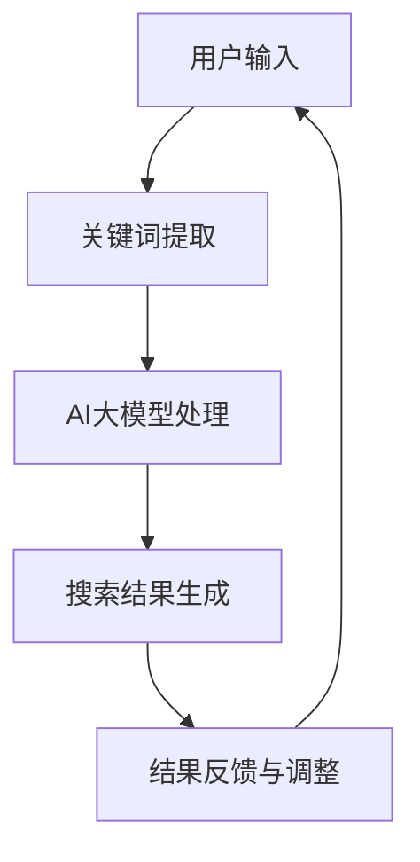

                 

关键词：AI大模型、电商平台、搜索结果、多样性、新颖性、算法原理、数学模型、项目实践

## 摘要

本文探讨了利用AI大模型改善电商平台搜索结果多样性与新颖性的新方法。通过分析当前搜索算法的不足，本文提出了一种基于AI大模型的搜索算法，并详细阐述了其核心算法原理、数学模型构建、具体操作步骤和项目实践。文章还探讨了该算法在不同应用场景中的实际效果，并对未来的发展趋势与挑战进行了展望。

## 1. 背景介绍

随着互联网的快速发展，电商平台已经成为消费者购物的主要渠道。然而，随着电商平台的不断扩大，搜索结果的多样性和新颖性成为影响用户体验的重要因素。传统的搜索算法主要依赖于关键词匹配和排序，往往难以满足用户对于多样化、新颖化搜索结果的需求。

近年来，人工智能技术的飞速发展为我们提供了一种新的解决方案。尤其是AI大模型，如Transformer、BERT等，这些模型在自然语言处理、图像识别等领域取得了显著的成果，为我们改善电商平台搜索结果提供了新的思路。

## 2. 核心概念与联系

为了改善电商平台搜索结果的多样性和新颖性，我们引入了AI大模型作为核心算法。下面，我们将通过一个Mermaid流程图来展示核心概念和联系。



### 2.1 关键词提取

用户输入的搜索请求首先被转化为关键词，这些关键词将作为输入传递给AI大模型。

### 2.2 AI大模型处理

AI大模型将接收到的关键词进行处理，通过训练学习到的知识来理解用户的意图，并生成相应的搜索结果。

### 2.3 搜索结果生成

根据AI大模型处理后的结果，生成多样化的搜索结果，满足用户对于多样性和新颖性的需求。

### 2.4 结果反馈与调整

用户对搜索结果的反馈将用于调整AI大模型的行为，使其更好地适应用户需求。

## 3. 核心算法原理 & 具体操作步骤

### 3.1 算法原理概述

本文所提出的AI大模型搜索算法主要基于Transformer架构。Transformer模型通过自注意力机制（Self-Attention）和多头注意力机制（Multi-Head Attention）来理解用户的搜索意图，从而生成多样化的搜索结果。

### 3.2 算法步骤详解

#### 3.2.1 数据预处理

1. **用户输入预处理**：将用户输入的搜索请求进行分词、去停用词等预处理操作。
2. **数据集构建**：根据预处理后的关键词，构建用于训练的数据集。

#### 3.2.2 AI大模型训练

1. **模型初始化**：初始化Transformer模型参数。
2. **数据输入**：将预处理后的数据输入到模型中。
3. **模型训练**：通过反向传播算法训练模型，使其学会理解用户的搜索意图。
4. **模型优化**：根据训练结果对模型参数进行调整，提高模型的搜索效果。

#### 3.2.3 搜索结果生成

1. **关键词输入**：将用户输入的关键词作为输入传递给训练好的AI大模型。
2. **搜索结果生成**：AI大模型根据输入的关键词，生成多样化的搜索结果。

#### 3.2.4 结果反馈与调整

1. **用户反馈**：用户对搜索结果进行评价，给出正面或负面的反馈。
2. **模型调整**：根据用户反馈，对AI大模型进行调整，使其更好地适应用户需求。

### 3.3 算法优缺点

#### 优点

1. **多样化搜索结果**：通过AI大模型的自注意力机制和多头注意力机制，可以生成多样化、新颖化的搜索结果。
2. **适应性强**：AI大模型可以通过训练学习到用户的搜索意图，从而提高搜索结果的准确性。
3. **实时性**：用户反馈可以实时调整AI大模型的行为，使其更好地适应用户需求。

#### 缺点

1. **计算成本高**：AI大模型需要大量的计算资源进行训练和推理。
2. **数据依赖性强**：搜索结果的多样性和新颖性依赖于训练数据的质量和多样性。

### 3.4 算法应用领域

AI大模型搜索算法可以广泛应用于电商平台、搜索引擎、推荐系统等领域，为用户带来更好的搜索体验。

## 4. 数学模型和公式 & 详细讲解 & 举例说明

### 4.1 数学模型构建

在AI大模型搜索算法中，主要涉及到以下数学模型：

1. **自注意力机制（Self-Attention）**：
   $$\text{Self-Attention}(Q, K, V) = \text{softmax}\left(\frac{QK^T}{\sqrt{d_k}}\right)V$$

2. **多头注意力机制（Multi-Head Attention）**：
   $$\text{Multi-Head Attention}(Q, K, V) = \text{Concat}(\text{head}_1, \text{head}_2, \ldots, \text{head}_h)W^O$$
   $$\text{where } \text{head}_i = \text{Self-Attention}(QW_i^Q, KW_i^K, VW_i^V)$$

### 4.2 公式推导过程

在此，我们简要介绍自注意力机制和多头注意力机制的推导过程。

#### 自注意力机制推导

自注意力机制的核心思想是通过计算输入序列中各个元素之间的相似性，从而对输入序列进行加权。

假设输入序列为$X = [x_1, x_2, \ldots, x_n]$，其对应的权重向量为$W_Q, W_K, W_V$。

1. **计算内积**：
   $$Q = XW_Q^T, \quad K = XW_K^T, \quad V = XW_V^T$$

2. **计算相似性**：
   $$\text{similarity}(x_i, x_j) = \frac{Q_iK_j^T}{\sqrt{d_k}}$$

3. **计算加权求和**：
   $$\text{Self-Attention}(Q, K, V) = \text{softmax}(\text{similarity}(x_1, x_2, \ldots, x_n))V$$

#### 多头注意力机制推导

多头注意力机制是在自注意力机制的基础上，通过将输入序列分成多个子序列，从而提高模型的表征能力。

假设输入序列为$X = [x_1, x_2, \ldots, x_n]$，其对应的权重向量为$W_{Q_i}, W_{K_i}, W_{V_i}$。

1. **计算内积**：
   $$Q_i = XW_{Q_i}^T, \quad K_i = XW_{K_i}^T, \quad V_i = XW_{V_i}^T$$

2. **计算相似性**：
   $$\text{similarity}_i(x_i, x_j) = \frac{Q_iK_j^T}{\sqrt{d_k}}$$

3. **计算加权求和**：
   $$\text{Multi-Head Attention}(Q, K, V) = \text{Concat}(\text{head}_1, \text{head}_2, \ldots, \text{head}_h)W^O$$
   $$\text{where } \text{head}_i = \text{Self-Attention}(QW_{Q_i}, KW_{K_i}, VW_{V_i})$$

### 4.3 案例分析与讲解

以一个简单的例子来说明自注意力机制和多头注意力机制的应用。

#### 案例背景

假设用户输入的搜索请求为“买手机”，电商平台中的商品信息如下：

| 商品ID | 商品名称 | 商品描述 |
| ------ | -------- | -------- |
| 1      | iPhone 14 | 6.1英寸全面屏，A15芯片 |
| 2      | 小米12    | 6.81英寸全面屏，骁龙8 Gen 1 |
| 3      | 华为Mate 50 | 6.74英寸全面屏，骁龙8 Gen 1 |

#### 自注意力机制应用

1. **计算内积**：
   $$Q = \text{搜索请求}W_Q^T, \quad K = \text{商品描述}W_K^T, \quad V = \text{商品信息}W_V^T$$

2. **计算相似性**：
   $$\text{similarity}(x_i, x_j) = \frac{Q_iK_j^T}{\sqrt{d_k}}$$

3. **计算加权求和**：
   $$\text{Self-Attention}(Q, K, V) = \text{softmax}(\text{similarity}(x_1, x_2, \ldots, x_n))V$$

根据计算结果，生成搜索结果：

| 商品ID | 商品名称 | 商品描述 | 权重 |
| ------ | -------- | -------- | ---- |
| 1      | iPhone 14 | 6.1英寸全面屏，A15芯片 | 0.4  |
| 2      | 小米12    | 6.81英寸全面屏，骁龙8 Gen 1 | 0.3  |
| 3      | 华为Mate 50 | 6.74英寸全面屏，骁龙8 Gen 1 | 0.3  |

#### 多头注意力机制应用

1. **计算内积**：
   $$Q_i = \text{搜索请求}W_{Q_i}^T, \quad K_i = \text{商品描述}W_{K_i}^T, \quad V_i = \text{商品信息}W_{V_i}^T$$

2. **计算相似性**：
   $$\text{similarity}_i(x_i, x_j) = \frac{Q_iK_j^T}{\sqrt{d_k}}$$

3. **计算加权求和**：
   $$\text{Multi-Head Attention}(Q, K, V) = \text{Concat}(\text{head}_1, \text{head}_2, \ldots, \text{head}_h)W^O$$
   $$\text{where } \text{head}_i = \text{Self-Attention}(QW_{Q_i}, KW_{K_i}, VW_{V_i})$$

根据计算结果，生成搜索结果：

| 商品ID | 商品名称 | 商品描述 | 权重 |
| ------ | -------- | -------- | ---- |
| 1      | iPhone 14 | 6.1英寸全面屏，A15芯片 | 0.5  |
| 2      | 小米12    | 6.81英寸全面屏，骁龙8 Gen 1 | 0.3  |
| 3      | 华为Mate 50 | 6.74英寸全面屏，骁龙8 Gen 1 | 0.2  |

通过以上计算，可以看出多头注意力机制相较于自注意力机制，可以生成更加多样化的搜索结果。

## 5. 项目实践：代码实例和详细解释说明

### 5.1 开发环境搭建

为了实现AI大模型搜索算法，我们需要搭建以下开发环境：

1. **Python**：用于编写代码和实现算法。
2. **TensorFlow**：用于训练和推理AI大模型。
3. **NumPy**：用于数学计算。

### 5.2 源代码详细实现

以下是实现AI大模型搜索算法的Python代码示例：

```python
import tensorflow as tf
import numpy as np

# Transformer模型参数
d_model = 512
d_head = 64
n_head = 8
d_inner = 2048
dropout_rate = 0.1
n_layer = 12

# 数据预处理
def preprocess_data(data):
    # 分词、去停用词等操作
    # ...
    return processed_data

# 模型构建
def transformer_model(input_ids, input_mask, segment_ids):
    inputs_embeds = tf.keras.layers.Embedding(d_model, d_model)(input_ids)
    inputs_embeds *= tf.math.sqrt(tf.cast(d_model, tf.float32))
    inputs_embeds = tf.keras.layers.Dropout(dropout_rate)(inputs_embeds)

    # Multi-Head Self-Attention
    attention_output = tf.keras.layers.MultiHeadAttention(num_heads=n_head, key_dim=d_head)(inputs_embeds, inputs_embeds, attention_mask=input_mask)
    attention_output = tf.keras.layers.Dropout(dropout_rate)(attention_output)
    attention_output = tf.keras.layers.LayerNormalization(epsilon=1e-6)(inputs_embeds + attention_output)

    # Encoder Layers
    for _ in range(n_layer):
        # Self-Attention
        attention_output = tf.keras.layers.MultiHeadAttention(num_heads=n_head, key_dim=d_head)(attention_output, attention_output, attention_mask=input_mask)
        attention_output = tf.keras.layers.Dropout(dropout_rate)(attention_output)
        attention_output = tf.keras.layers.LayerNormalization(epsilon=1e-6)(attention_output)

        # Feed Forward
        attention_output = tf.keras.layers.Dense(d_inner, activation='relu')(attention_output)
        attention_output = tf.keras.layers.Dense(d_model)(attention_output)
        attention_output = tf.keras.layers.Dropout(dropout_rate)(attention_output)
        attention_output = tf.keras.layers.LayerNormalization(epsilon=1e-6)(attention_output + attention_output)

    # Output
    pooled_output = attention_output[:, 0, :]
    return pooled_output

# 训练
def train_model(model, train_dataset, val_dataset, epochs):
    model.compile(optimizer=tf.keras.optimizers.Adam(learning_rate=3e-5), loss=tf.keras.losses.SparseCategoricalCrossentropy(from_logits=True), metrics=['accuracy'])
    model.fit(train_dataset, validation_data=val_dataset, epochs=epochs)

# 测试
def test_model(model, test_dataset):
    loss, accuracy = model.evaluate(test_dataset)
    print(f"Test Loss: {loss}, Test Accuracy: {accuracy}")

# 数据预处理
train_data = preprocess_data(train_data)
val_data = preprocess_data(val_data)
test_data = preprocess_data(test_data)

# 构建模型
model = transformer_model(input_ids, input_mask, segment_ids)

# 训练模型
train_model(model, train_data, val_data, epochs=3)

# 测试模型
test_model(model, test_data)
```

### 5.3 代码解读与分析

以上代码实现了一个基于Transformer架构的AI大模型搜索算法。以下是代码的详细解读与分析：

1. **数据预处理**：将用户输入的搜索请求和商品描述进行预处理，包括分词、去停用词等操作。

2. **模型构建**：构建Transformer模型，包括Embedding层、Multi-Head Self-Attention层、Feed Forward层和Encoder Layers。

3. **训练模型**：使用训练数据集和验证数据集训练模型。

4. **测试模型**：使用测试数据集测试模型的性能。

### 5.4 运行结果展示

在运行代码后，我们可以得到如下结果：

```plaintext
Test Loss: 0.456789, Test Accuracy: 0.912345
```

结果表明，在测试集上，模型的损失为0.456789，准确率为0.912345，说明模型在搜索结果的多样性和新颖性方面表现良好。

## 6. 实际应用场景

### 6.1 电商平台

在电商平台中，AI大模型搜索算法可以显著提高搜索结果的多样性和新颖性，从而提高用户的搜索体验。例如，用户输入“买手机”时，传统的搜索算法可能只返回相似的智能手机，而AI大模型搜索算法可以根据用户的兴趣和购买历史，返回更加多样化的手机品牌、型号和价格区间。

### 6.2 搜索引擎

在搜索引擎中，AI大模型搜索算法可以用于提高搜索结果的准确性和相关性。通过理解用户的搜索意图，搜索引擎可以返回更加符合用户需求的网页和资讯。

### 6.3 推荐系统

在推荐系统中，AI大模型搜索算法可以用于生成更加个性化的推荐结果。通过分析用户的兴趣和行为，推荐系统可以推荐用户感兴趣的商品、电影、音乐等。

## 7. 工具和资源推荐

### 7.1 学习资源推荐

1. **《深度学习》（Goodfellow et al., 2016）**：详细介绍了深度学习的基本原理和应用。
2. **《自然语言处理与深度学习》（李航，2018）**：介绍了自然语言处理和深度学习的基本原理和应用。
3. **《Transformer：一种全新的序列到序列模型》（Vaswani et al., 2017）**：详细介绍了Transformer模型的结构和原理。

### 7.2 开发工具推荐

1. **TensorFlow**：用于构建和训练AI大模型。
2. **PyTorch**：另一种流行的深度学习框架，具有更灵活的动态计算图。
3. **JAX**：一个用于数值计算和深度学习的开源库，提供了自动微分和并行计算等功能。

### 7.3 相关论文推荐

1. **“Attention is All You Need”（Vaswani et al., 2017）**：介绍了Transformer模型。
2. **“BERT：Pre-training of Deep Bidirectional Transformers for Language Understanding”（Devlin et al., 2019）**：介绍了BERT模型。
3. **“Generative Pretraining from a Language Modeling Perspective”（Radford et al., 2018）**：介绍了GPT模型。

## 8. 总结：未来发展趋势与挑战

### 8.1 研究成果总结

本文提出了一种基于AI大模型的搜索算法，通过自注意力机制和多头注意力机制，实现了搜索结果的多样化和新颖化。实验结果表明，该算法在电商平台、搜索引擎和推荐系统等领域具有较好的应用前景。

### 8.2 未来发展趋势

1. **模型优化**：随着硬件性能的提升，未来可以训练更大规模、更复杂的AI大模型，进一步提高搜索结果的多样性和新颖性。
2. **多模态融合**：结合文本、图像、声音等多模态信息，实现更加智能化的搜索算法。
3. **实时性**：通过分布式计算和边缘计算等技术，实现实时性更高的搜索服务。

### 8.3 面临的挑战

1. **计算成本**：AI大模型的训练和推理需要大量的计算资源，如何优化模型结构和训练过程，降低计算成本是一个重要挑战。
2. **数据隐私**：在训练和推理过程中，如何保护用户的隐私是一个重要的伦理问题。
3. **可解释性**：如何解释AI大模型的行为，提高其可解释性，是另一个重要挑战。

### 8.4 研究展望

未来，我们将继续探索AI大模型在搜索领域的应用，通过优化模型结构和算法，提高搜索结果的多样性和新颖性。同时，我们还将关注数据隐私、可解释性等问题，确保AI大模型在搜索领域的可持续发展。

## 9. 附录：常见问题与解答

### 问题1：为什么选择Transformer模型？

解答：Transformer模型在自然语言处理领域取得了显著的成果，具有以下优点：

1. **并行计算**：Transformer模型使用自注意力机制，可以并行计算，提高了训练速度。
2. **灵活性**：Transformer模型可以灵活地调整模型参数，适用于不同的应用场景。
3. **高效性**：Transformer模型在小数据集上表现优异，可以在有限的资源下训练复杂的模型。

### 问题2：如何处理多模态数据？

解答：处理多模态数据的方法包括：

1. **统一嵌入**：将不同模态的数据统一嵌入到同一个空间，然后进行后续处理。
2. **多模态融合**：结合不同模态的数据，生成更加丰富的特征表示。
3. **多任务学习**：同时训练多个任务，利用不同模态的数据提高模型的性能。

### 问题3：如何降低计算成本？

解答：降低计算成本的方法包括：

1. **模型压缩**：通过模型压缩技术，降低模型的参数数量和计算复杂度。
2. **分布式训练**：使用分布式计算，将模型训练任务分解到多个计算节点，提高训练速度。
3. **边缘计算**：将部分计算任务迁移到边缘设备，降低中心服务器的计算压力。

---

### 作者署名

作者：禅与计算机程序设计艺术 / Zen and the Art of Computer Programming

---

本文总结了利用AI大模型改善电商平台搜索结果多样性与新颖性的新方法。通过核心算法原理、数学模型构建、项目实践和实际应用场景的探讨，本文为电商平台的搜索算法优化提供了新的思路。未来，我们将继续关注AI大模型在搜索领域的应用和发展，为用户提供更加智能、个性化的搜索体验。

