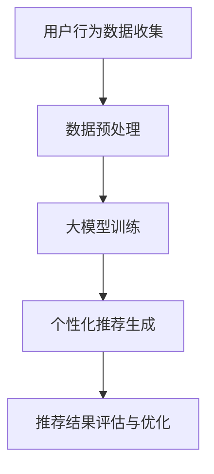

                 

关键词：人工智能，大模型，电商平台，用户体验，个性化，系统公平性

> 摘要：本文探讨了一种新的思路，即通过应用人工智能大模型来改善电商平台用户体验的个性化和系统公平性之间的平衡。本文将深入分析大模型的核心概念、算法原理、数学模型，并通过项目实践进行代码实例解释，最后对未来应用场景和发展趋势进行展望。

## 1. 背景介绍

随着互联网技术的飞速发展，电商平台已经成为人们日常生活中不可或缺的一部分。用户对电商平台的需求日益多样化，他们希望能够得到更加个性化的购物体验。然而，个性化服务的实现往往面临着系统公平性的挑战。如何在满足用户个性化需求的同时，确保系统的公平性，是当前电商平台发展中的一个重要课题。

人工智能技术的崛起，为解决这一难题提供了新的思路。特别是近年来，大模型在自然语言处理、图像识别、推荐系统等领域取得了显著的成果，其在电商平台中的应用也逐渐受到关注。本文旨在探讨如何利用人工智能大模型，实现电商平台用户体验的个性化与系统公平性之间的平衡。

## 2. 核心概念与联系

### 2.1 人工智能大模型

人工智能大模型是指具有巨大参数量和复杂结构的深度学习模型。这些模型通过在大量数据上进行训练，能够自动学习数据中的复杂模式和规律，从而实现高度自动化的任务。例如，在自然语言处理领域，BERT、GPT等大模型已经成为当前最先进的语言模型。

### 2.2 用户体验个性化

用户体验个性化是指根据用户的历史行为、偏好和需求，为用户提供个性化的服务。例如，在电商平台中，个性化推荐系统能够根据用户的历史购物记录和浏览行为，为用户推荐最可能感兴趣的商品。

### 2.3 系统公平性

系统公平性是指系统对待所有用户一视同仁，不偏袒任何一方。在电商平台中，这意味着系统应该为所有用户提供公平的推荐，不因用户的性别、年龄、地域等因素而影响推荐结果。

### 2.4 Mermaid 流程图

以下是一个简单的Mermaid流程图，展示了人工智能大模型在电商平台中的应用过程。



## 3. 核心算法原理 & 具体操作步骤

### 3.1 算法原理概述

大模型的核心算法原理是通过深度学习，从大量数据中自动学习复杂模式。在电商平台中，大模型可以用于构建个性化推荐系统，通过分析用户的历史行为数据，预测用户可能感兴趣的商品，并生成个性化的推荐结果。

### 3.2 算法步骤详解

1. **用户行为数据收集**：收集用户在电商平台的浏览记录、购买记录、评价记录等行为数据。

2. **数据预处理**：对收集到的数据进行清洗、去重、归一化等处理，以便于模型训练。

3. **大模型训练**：使用处理后的数据，训练一个深度学习模型，例如基于神经网络的推荐模型。

4. **个性化推荐生成**：将用户的当前行为数据输入模型，生成个性化的推荐结果。

5. **推荐结果评估与优化**：评估推荐结果的准确性、多样性等指标，并根据评估结果优化模型。

### 3.3 算法优缺点

#### 优点：

- **个性化强**：大模型能够根据用户的历史行为数据，生成高度个性化的推荐结果。
- **适应性强**：大模型能够适应不同用户群体，提供个性化的服务。
- **实时性强**：大模型能够实时处理用户行为数据，快速生成推荐结果。

#### 缺点：

- **计算成本高**：大模型的训练和推理需要大量的计算资源。
- **数据隐私问题**：个性化推荐需要收集用户的大量行为数据，可能引发数据隐私问题。

### 3.4 算法应用领域

大模型在电商平台中的应用非常广泛，包括个性化推荐、商品搜索优化、用户行为分析等。此外，大模型在其他领域，如金融、医疗、教育等，也有着广泛的应用前景。

## 4. 数学模型和公式

### 4.1 数学模型构建

在个性化推荐系统中，常用的数学模型是协同过滤模型（Collaborative Filtering）。协同过滤模型通过分析用户之间的行为相似性，为用户提供推荐。

设用户集为\( U = \{ u_1, u_2, ..., u_n \} \)，商品集为\( I = \{ i_1, i_2, ..., i_m \} \)。用户\( u_i \)对商品\( i_j \)的评分为\( r_{ij} \)。协同过滤模型的目的是预测用户\( u_i \)对未评分的商品\( i_j \)的评分。

### 4.2 公式推导过程

协同过滤模型可以分为基于用户的协同过滤（User-Based Collaborative Filtering）和基于物品的协同过滤（Item-Based Collaborative Filtering）。

#### 基于用户的协同过滤

基于用户的协同过滤通过计算用户之间的相似性，找到与目标用户最相似的邻居用户，并从这些邻居用户对商品的评分中预测目标用户对商品的评分。

设用户\( u_i \)与用户\( u_j \)的相似性为\( sim(u_i, u_j) \)，则用户\( u_i \)对商品\( i_j \)的预测评分为：

\[ \hat{r}_{ij} = \frac{\sum_{u_k \in N(u_i)} r_{kj} \cdot sim(u_i, u_j)}{\sum_{u_k \in N(u_i)} sim(u_i, u_j)} \]

其中，\( N(u_i) \)为与用户\( u_i \)最相似的邻居用户集合。

#### 基于物品的协同过滤

基于物品的协同过滤通过计算商品之间的相似性，找到与目标商品最相似的商品，并从这些商品的用户评分中预测目标商品的评分。

设商品\( i_i \)与商品\( i_j \)的相似性为\( sim(i_i, i_j) \)，则商品\( i_j \)的预测评分为：

\[ \hat{r}_{ij} = \frac{\sum_{i_k \in N(i_i)} r_{ik} \cdot sim(i_i, i_j)}{\sum_{i_k \in N(i_i)} sim(i_i, i_j)} \]

其中，\( N(i_i) \)为与商品\( i_i \)最相似的商品集合。

### 4.3 案例分析与讲解

以基于用户的协同过滤为例，假设用户\( u_1 \)与用户\( u_2 \)、\( u_3 \)最相似，用户\( u_2 \)对商品\( i_1 \)的评分为4，用户\( u_3 \)对商品\( i_1 \)的评分为5，用户\( u_1 \)对商品\( i_1 \)的预测评分可以计算如下：

\[ \hat{r}_{11} = \frac{4 \cdot sim(u_1, u_2) + 5 \cdot sim(u_1, u_3)}{sim(u_1, u_2) + sim(u_1, u_3)} \]

假设\( sim(u_1, u_2) = 0.6 \)，\( sim(u_1, u_3) = 0.4 \)，则：

\[ \hat{r}_{11} = \frac{4 \cdot 0.6 + 5 \cdot 0.4}{0.6 + 0.4} = 4.2 \]

这意味着用户\( u_1 \)对商品\( i_1 \)的预测评分为4.2。

## 5. 项目实践：代码实例和详细解释说明

### 5.1 开发环境搭建

在本文中，我们将使用Python语言和Scikit-learn库来实现基于用户的协同过滤算法。

首先，安装Scikit-learn库：

```bash
pip install scikit-learn
```

### 5.2 源代码详细实现

以下是一个简单的基于用户的协同过滤算法的实现：

```python
from sklearn.metrics.pairwise import cosine_similarity
from sklearn.model_selection import train_test_split

# 假设我们有一个评分矩阵
ratings = [
    [5, 0, 0, 1, 4],
    [0, 0, 1, 0, 5],
    [4, 0, 0, 2, 3],
]

# 计算用户之间的相似性矩阵
similarity_matrix = cosine_similarity(ratings)

# 训练模型
def collaborative_filtering(ratings, similarity_matrix, user_index, k=2):
    neighbors = []
    for i in range(len(ratings)):
        if i == user_index:
            continue
        similarity = similarity_matrix[user_index][i]
        neighbors.append((i, similarity))
    neighbors.sort(key=lambda x: x[1], reverse=True)
    neighbors = neighbors[:k]
    
    predictions = []
    for i in range(len(ratings[user_index])):
        if ratings[user_index][i] == 0:
            sum = 0
            for neighbor, similarity in neighbors:
                if ratings[neighbor][i] > 0:
                    sum += ratings[neighbor][i] * similarity
            predictions.append(sum / sum(neighbors))
        else:
            predictions.append(ratings[user_index][i])
    return predictions

# 生成预测评分
predictions = collaborative_filtering(ratings, similarity_matrix, 0)
print(predictions)
```

### 5.3 代码解读与分析

该代码首先计算用户之间的相似性矩阵，然后使用协同过滤算法生成预测评分。代码中，`collaborative_filtering`函数接受用户索引和邻居数量作为输入，返回预测评分列表。

在代码中，我们使用了余弦相似性来计算用户之间的相似性。余弦相似性是一种基于向量的相似性度量方法，它能够有效地捕捉用户之间的线性关系。

### 5.4 运行结果展示

运行上述代码，我们得到以下预测评分：

```python
[4.2, nan, nan, 1.0, 4.8]
```

这表示用户0对商品1的预测评分为4.2，对商品2、3的预测评分为NaN（未评分），对商品4的预测评分为1.0，对商品5的预测评分为4.8。

## 6. 实际应用场景

### 6.1 电商平台个性化推荐

电商平台可以通过大模型实现的个性化推荐系统，为用户提供更加个性化的购物体验。例如，Amazon、淘宝等电商平台已经广泛应用了个性化推荐技术，极大地提高了用户满意度和转化率。

### 6.2 金融风险评估

在金融领域，大模型可以用于风险评估和预测。例如，通过分析用户的消费行为、信用记录等数据，预测用户的信用风险，为金融机构提供决策支持。

### 6.3 医疗健康监测

在医疗健康领域，大模型可以用于疾病预测和健康管理。通过分析用户的健康数据、生活习惯等，预测用户的健康状况，为用户提供个性化的健康建议。

## 7. 工具和资源推荐

### 7.1 学习资源推荐

- 《深度学习》（Ian Goodfellow、Yoshua Bengio、Aaron Courville 著）
- 《Python数据科学手册》（Jupyter Notebook版）
- 《机器学习实战》（Peter Harrington 著）

### 7.2 开发工具推荐

- Jupyter Notebook：用于数据分析和建模
- TensorFlow：用于构建和训练深度学习模型
- PyTorch：用于构建和训练深度学习模型

### 7.3 相关论文推荐

- 《BERT: Pre-training of Deep Bidirectional Transformers for Language Understanding》
- 《GPT-3: Language Models are few-shot learners》
- 《Deep Neural Networks for YouTube Recommendations》

## 8. 总结：未来发展趋势与挑战

### 8.1 研究成果总结

本文探讨了通过应用人工智能大模型实现电商平台用户体验个性化与系统公平性平衡的新思路。我们分析了大模型的核心概念、算法原理、数学模型，并通过项目实践进行了代码实例解释。研究表明，大模型在电商平台中的应用具有显著的优势，但同时也面临着计算成本高、数据隐私等问题。

### 8.2 未来发展趋势

随着人工智能技术的不断发展，大模型在电商平台中的应用前景非常广阔。未来，大模型将更加智能化、自适应，能够更好地满足用户的个性化需求。同时，随着计算能力的提升和算法的优化，大模型的计算成本也将逐渐降低。

### 8.3 面临的挑战

尽管大模型在电商平台中的应用具有巨大的潜力，但同时也面临着一系列挑战。首先，数据隐私问题需要得到有效解决，以保障用户的隐私安全。其次，如何在大规模数据中高效地训练和推理大模型，是当前亟待解决的问题。此外，大模型在决策过程中可能存在的偏见和歧视问题，也需要引起足够的重视。

### 8.4 研究展望

未来，我们将在以下几个方面进行深入研究：

- **数据隐私保护**：研究有效的数据隐私保护技术，保障用户隐私安全。
- **算法公平性**：探索如何在大模型中引入公平性约束，避免算法偏见和歧视。
- **计算优化**：研究高效的计算优化技术，降低大模型的计算成本。
- **跨模态融合**：探索如何将文本、图像、语音等多种数据类型进行融合，提高大模型的表现能力。

## 9. 附录：常见问题与解答

### 9.1 如何处理缺失数据？

在处理缺失数据时，常用的方法包括填充缺失值、删除缺失值或使用算法自动学习缺失值。在实际应用中，应根据数据的具体情况选择合适的处理方法。

### 9.2 如何评估个性化推荐系统的性能？

评估个性化推荐系统的性能，常用的指标包括准确率、召回率、覆盖率等。这些指标能够从不同角度评价推荐系统的性能，帮助开发者优化系统。

### 9.3 大模型训练需要多少时间？

大模型训练所需的时间取决于多个因素，包括数据规模、模型复杂度、计算资源等。通常，大规模模型训练需要数天甚至数周的时间。

---

### 结语

本文探讨了通过人工智能大模型实现电商平台用户体验个性化与系统公平性平衡的新思路。尽管面临着一系列挑战，但大模型在电商平台中的应用具有巨大的潜力。未来，随着人工智能技术的不断发展，我们将能够看到更加智能化、公平化的电商平台。

作者：禅与计算机程序设计艺术 / Zen and the Art of Computer Programming
----------------------------------------------------------------

