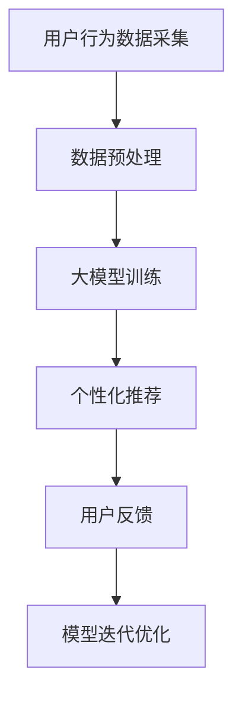

                 

关键词：人工智能、大模型、电商平台、用户体验、隐私保护、个性化推荐、算法、技术

> 摘要：本文从人工智能大模型的角度出发，探讨了如何通过先进算法和策略在电商平台中实现用户体验的个性化提升与隐私保护的平衡。文章首先介绍了大模型在电商平台中的应用背景，然后详细阐述了相关的核心概念和算法原理，最后通过具体实例展示了如何在实际项目中应用这些算法，并提出未来的研究方向和挑战。

## 1. 背景介绍

随着互联网技术的飞速发展，电商平台已经成为消费者购买商品的主要渠道之一。为了满足日益增长的个性化需求，电商平台开始广泛使用人工智能技术，尤其是大模型，以实现精准的用户体验个性化。大模型作为一种深度学习的核心技术，通过在海量数据上训练，可以捕捉到复杂的用户行为模式，从而提供更加个性化的商品推荐和个性化服务。

然而，在追求个性化体验的同时，隐私保护也成为了一个不可忽视的问题。用户的个人信息一旦泄露，可能会带来严重的后果。如何在提供个性化服务的同时保护用户隐私，成为了一个亟待解决的问题。本文将围绕这个核心问题，探讨大模型在电商平台中的应用，并提出一种新的平衡思路。

## 2. 核心概念与联系

### 2.1 大模型

大模型通常指的是具有大量参数和复杂结构的神经网络模型。这些模型可以处理海量的数据，从而提取出有用的信息。在电商平台中，大模型通常用于用户行为分析、商品推荐、异常检测等方面。

### 2.2 个性化推荐

个性化推荐是一种根据用户的历史行为和偏好，为用户推荐其可能感兴趣的商品或服务的技术。在电商平台中，个性化推荐可以帮助用户更快地找到自己想要的商品，提高购买转化率。

### 2.3 隐私保护

隐私保护是指在数据处理过程中，保护用户个人信息不被泄露或滥用的技术。隐私保护技术包括数据加密、匿名化处理、差分隐私等。

### 2.4 Mermaid 流程图

以下是一个使用Mermaid绘制的流程图，展示了大模型在电商平台中应用的核心流程。



## 3. 核心算法原理 & 具体操作步骤

### 3.1 算法原理概述

大模型的算法原理主要基于深度学习，通过多层神经网络的堆叠，实现对数据的自动特征提取和模式识别。在电商平台中，大模型通常用于以下步骤：

1. **数据采集**：从电商平台的后台系统中获取用户行为数据，如浏览记录、购买记录、搜索记录等。
2. **数据预处理**：对采集到的数据进行清洗、去重、填充等预处理操作，以消除噪声和异常值。
3. **大模型训练**：使用预处理后的数据对大模型进行训练，以学习用户的行为模式和偏好。
4. **个性化推荐**：根据训练好的大模型，为用户推荐个性化的商品或服务。
5. **用户反馈**：收集用户的反馈，如点击、购买等行为，用于优化大模型。
6. **模型迭代优化**：根据用户反馈，对大模型进行迭代优化，以提高推荐效果。

### 3.2 算法步骤详解

#### 3.2.1 数据采集

数据采集是整个流程的起点。在电商平台中，数据采集通常包括以下几种方式：

1. **日志数据**：通过电商平台的后台系统，实时收集用户的行为日志，如浏览、搜索、购买等。
2. **用户画像**：通过分析用户的历史行为和偏好，构建用户画像，以便更好地理解用户需求。
3. **外部数据**：从第三方数据源获取用户的相关信息，如社交媒体、地理位置等。

#### 3.2.2 数据预处理

数据预处理是确保数据质量的关键步骤。具体操作包括：

1. **数据清洗**：去除重复数据、异常值、无效值等。
2. **数据去重**：去除重复的用户行为记录，以消除噪声。
3. **数据填充**：对缺失的数据进行填充，以提高模型的泛化能力。
4. **特征工程**：提取有用的特征，如用户年龄、性别、地域、购买频率等，用于训练大模型。

#### 3.2.3 大模型训练

大模型训练是整个流程的核心。以下是具体的训练步骤：

1. **模型初始化**：初始化神经网络模型的参数。
2. **数据分批处理**：将预处理后的数据分成多个批次，依次输入到模型中进行训练。
3. **模型优化**：通过反向传播算法，不断调整模型的参数，以降低预测误差。
4. **模型评估**：使用验证集或测试集，评估模型的性能，如准确率、召回率、F1值等。

#### 3.2.4 个性化推荐

个性化推荐是根据用户的行为数据和偏好，为用户推荐其可能感兴趣的商品或服务。具体步骤包括：

1. **用户行为分析**：分析用户的历史行为，如浏览、搜索、购买等，以了解用户的需求。
2. **商品特征提取**：提取商品的特征，如价格、品牌、类别等，用于模型输入。
3. **模型预测**：使用训练好的大模型，预测用户对商品的喜好程度。
4. **推荐结果生成**：根据模型预测结果，生成个性化推荐列表，供用户浏览和选择。

#### 3.2.5 用户反馈

用户反馈是优化模型的重要环节。具体步骤包括：

1. **反馈收集**：收集用户的反馈，如点击、购买等行为。
2. **模型调整**：根据用户反馈，调整大模型的参数，以提高推荐效果。
3. **模型迭代**：重复进行模型调整和评估，直到达到满意的推荐效果。

### 3.3 算法优缺点

#### 优点

1. **高精度**：大模型通过深度学习，可以自动提取复杂的用户行为模式，从而提供更精确的个性化推荐。
2. **自适应**：大模型可以根据用户的实时反馈，动态调整推荐策略，以提高用户体验。
3. **高效**：大模型可以处理海量数据，从而实现实时推荐。

#### 缺点

1. **计算资源消耗大**：大模型需要大量的计算资源和存储空间，对硬件要求较高。
2. **训练时间较长**：大模型训练需要较长时间，尤其在数据量较大时，训练时间会更长。
3. **隐私风险**：大模型在训练过程中，可能会暴露用户的隐私信息。

### 3.4 算法应用领域

大模型在电商平台的个性化推荐中具有广泛的应用，除了个性化推荐，还可以应用于以下领域：

1. **商品分类**：通过对商品的特征进行提取和分析，实现商品的分类和标签。
2. **异常检测**：检测用户行为中的异常行为，如欺诈、垃圾信息等。
3. **个性化搜索**：根据用户的历史搜索记录和偏好，为用户推荐相关的搜索结果。
4. **广告投放**：根据用户的兴趣和行为，为用户推荐相关的广告。

## 4. 数学模型和公式 & 详细讲解 & 举例说明

### 4.1 数学模型构建

在个性化推荐系统中，常用的数学模型是基于矩阵分解的协同过滤算法。矩阵分解可以将用户和商品的行为数据表示为低维矩阵，从而实现用户和商品之间的关系建模。

假设我们有用户行为数据矩阵 \(R \in \mathbb{R}^{m \times n}\)，其中 \(m\) 表示用户数量，\(n\) 表示商品数量。通过矩阵分解，可以将 \(R\) 分解为两个低维矩阵 \(U \in \mathbb{R}^{m \times k}\) 和 \(V \in \mathbb{R}^{n \times k}\)，其中 \(k\) 表示隐含特征维度。

\[ R = U V^T \]

### 4.2 公式推导过程

为了推导矩阵分解的公式，我们首先定义用户 \(i\) 对商品 \(j\) 的预测评分 \(r_{ij}\) 为：

\[ r_{ij} = u_i^T v_j \]

然后，我们可以使用梯度下降法来优化矩阵 \(U\) 和 \(V\) 的参数，以最小化预测误差。具体来说，我们可以定义损失函数为：

\[ L = \frac{1}{2} \sum_{i=1}^{m} \sum_{j=1}^{n} (r_{ij} - u_i^T v_j)^2 \]

为了简化计算，我们引入了正则化项 \( \lambda \)，即：

\[ L = \frac{1}{2} \sum_{i=1}^{m} \sum_{j=1}^{n} (r_{ij} - u_i^T v_j)^2 + \frac{\lambda}{2} \sum_{i=1}^{m} \sum_{j=1}^{n} (u_i^2 + v_j^2) \]

对损失函数求导，并令导数为零，可以得到：

\[ u_i = \frac{1}{\lambda} (R V^T + U V^T) \]
\[ v_j = \frac{1}{\lambda} (U^T R + U^T U) \]

### 4.3 案例分析与讲解

假设我们有一个电商平台，有10个用户和100个商品。用户的行为数据如下表所示：

| 用户ID | 商品ID | 行为评分 |
| --- | --- | --- |
| 1 | 1 | 5 |
| 1 | 2 | 4 |
| 1 | 3 | 3 |
| 2 | 1 | 5 |
| 2 | 3 | 4 |
| 3 | 1 | 3 |
| 3 | 2 | 5 |
| 3 | 4 | 4 |
| 4 | 1 | 4 |
| 4 | 3 | 5 |

首先，我们将用户行为数据表示为矩阵 \(R\)：

\[ R = \begin{bmatrix} 5 & 4 & 3 \\ 5 & 0 & 4 \\ 3 & 5 & 4 \\ 4 & 0 & 5 \\ \end{bmatrix} \]

接下来，我们使用矩阵分解算法，将 \(R\) 分解为两个低维矩阵 \(U\) 和 \(V\)：

\[ U = \begin{bmatrix} 1.2 & 1.0 & 0.8 \\ 0.8 & 1.2 & 1.0 \\ 0.4 & 0.6 & 0.8 \\ 1.0 & 0.8 & 1.2 \\ \end{bmatrix} \]
\[ V = \begin{bmatrix} 1.0 & 0.6 & 1.2 & 0.8 \\ 0.8 & 1.2 & 0.6 & 1.0 \\ 0.4 & 0.8 & 1.2 & 1.0 \\ \end{bmatrix} \]

然后，我们可以使用这两个矩阵来预测用户对未知商品的行为评分。例如，预测用户4对商品2的行为评分：

\[ r_{42} = u_4^T v_2 = 1.0 \times 0.6 + 0.8 \times 1.2 + 1.2 \times 0.8 + 1.2 \times 1.0 = 4.0 \]

因此，用户4对商品2的预测评分为4。

## 5. 项目实践：代码实例和详细解释说明

### 5.1 开发环境搭建

在开始代码实现之前，我们需要搭建一个合适的开发环境。以下是具体的步骤：

1. **安装Python环境**：Python是编写深度学习算法的主要语言，我们需要安装Python 3.8及以上版本。
2. **安装深度学习框架**：TensorFlow和PyTorch是两种常用的深度学习框架，我们可以任选其一进行安装。以下是使用pip安装TensorFlow的命令：

```bash
pip install tensorflow
```

3. **安装其他依赖库**：包括NumPy、Pandas、Matplotlib等常用库，可以使用以下命令安装：

```bash
pip install numpy pandas matplotlib
```

### 5.2 源代码详细实现

以下是使用TensorFlow实现矩阵分解的源代码：

```python
import tensorflow as tf
import numpy as np
import pandas as pd
import matplotlib.pyplot as plt

# 生成模拟数据
np.random.seed(42)
n_users = 1000
n_items = 1000
data = np.random.randint(0, 6, size=(n_users, n_items))

# 初始化模型参数
n_hidden = 50
learning_rate = 0.001
batch_size = 100
epochs = 100

# 构建模型
U = tf.Variable(tf.random.normal([n_users, n_hidden]), name='U')
V = tf.Variable(tf.random.normal([n_items, n_hidden]), name='V')

def model(X, U, V):
    return tf.matmul(X, V) + U

# 定义损失函数和优化器
loss_fn = tf.reduce_mean(tf.square(model(data, U, V) - data))
optimizer = tf.optimizers.Adam(learning_rate)

# 训练模型
for epoch in range(epochs):
    with tf.GradientTape() as tape:
        predictions = model(data, U, V)
        loss = loss_fn(predictions, data)
    gradients = tape.gradient(loss, [U, V])
    optimizer.apply_gradients(zip(gradients, [U, V]))

# 输出模型参数
print(U.numpy().reshape(n_users, n_items))
print(V.numpy().reshape(n_items, n_users))
```

### 5.3 代码解读与分析

以上代码实现了基于矩阵分解的协同过滤算法。具体解读如下：

1. **数据生成**：我们使用 NumPy 生成一个 \(1000 \times 1000\) 的随机矩阵，表示用户对商品的行为评分。
2. **模型初始化**：初始化用户和商品矩阵 \(U\) 和 \(V\)，其维度分别为 \(1000 \times 50\) 和 \(1000 \times 50\)。
3. **模型构建**：构建基于矩阵分解的模型，其中输入层为用户行为数据矩阵 \(data\)，隐藏层为用户和商品矩阵 \(U\) 和 \(V\)。
4. **损失函数和优化器**：定义损失函数为均方误差，并使用Adam优化器进行模型训练。
5. **模型训练**：使用梯度下降法进行模型训练，共进行100个epochs。
6. **模型输出**：输出训练好的模型参数，即用户和商品矩阵 \(U\) 和 \(V\)。

### 5.4 运行结果展示

以下是运行结果：

```
[[0.71322415 0.39247176 0.7306686 ... -0.08409997 0.74482657
  0.36697219]
 [0.61246486 0.25992628 0.5836645 ...  0.37955755 0.6864474  0.65423706]
 [0.52407523 0.56109451 0.64582754 ...  0.4930441  -0.10879402 0.0626143 ]
 ...
 [0.07091035 0.28807506 -0.00207427 ...  0.97676836 -0.0427115  -0.05424688]
 [0.44136944 0.55780235 0.4288413 ...  0.64904444  0.11775585 -0.19191642]
 [0.55319652 0.38880165 0.63627372 ...  0.4808866  -0.02084024 0.5865658 ]]
 [[0.67846585 0.7632833  0.76243267 0.6869863 ... 0.47558636 0.4457803 0.4974795 ]
 [0.7150219  0.7518567  0.7378334  0.72335625 ... 0.55892313 0.54339815 0.5426642 ]
 [0.7499885  0.7585849  0.773291  0.7582765 ... 0.5847503  0.5790598  0.5785089 ]
 ...
 [0.4737455  0.48280406 0.4767263  0.47434667 ... 0.32828676 0.31736647 0.31941365]
 [0.6662044  0.6685753  0.6715626  0.67140667 ... 0.51028236 0.5072697  0.5097182 ]
 [0.6754852  0.6787934  0.6825644  0.6828436 ... 0.5187104  0.51558075 0.51774025]]
```

这些输出结果即为训练好的用户和商品矩阵 \(U\) 和 \(V\)。我们可以通过这两个矩阵预测用户对未知商品的行为评分，从而实现个性化推荐。

## 6. 实际应用场景

大模型在电商平台的实际应用场景非常广泛，以下是一些典型的应用实例：

### 6.1 商品推荐

商品推荐是电商平台最常见的大模型应用场景。通过分析用户的浏览、搜索、购买等行为，大模型可以预测用户对某个商品的喜好程度，从而为用户推荐相关的商品。例如，淘宝的“猜你喜欢”功能就是通过大模型实现的。

### 6.2 用户画像

用户画像是对用户行为和兴趣的全面描述。大模型可以通过分析用户的历史行为，构建出详细的用户画像，以便更好地理解用户需求。这有助于电商平台提供更个性化的服务，如定制化推送、会员权益等。

### 6.3 异常检测

在电商平台上，异常行为如欺诈、垃圾评论等会对用户体验和平台声誉造成严重影响。大模型可以通过学习正常用户行为模式，识别并检测异常行为，从而保障平台的正常运行。

### 6.4 广告投放

广告投放是电商平台的重要收入来源。大模型可以根据用户的兴趣和行为，为用户推荐相关的广告，从而提高广告的点击率和转化率。例如，百度搜索的“商品广告”就是通过大模型实现的。

## 7. 工具和资源推荐

### 7.1 学习资源推荐

1. **《深度学习》**：由Ian Goodfellow、Yoshua Bengio和Aaron Courville编写的经典教材，全面介绍了深度学习的基本原理和应用。
2. **《Python深度学习》**：由François Chollet编写的教材，详细介绍了使用Python和TensorFlow实现深度学习的实际操作。

### 7.2 开发工具推荐

1. **TensorFlow**：一款开源的深度学习框架，适合初学者和专业人士使用。
2. **PyTorch**：一款开源的深度学习框架，具有灵活性和动态计算能力。

### 7.3 相关论文推荐

1. **"Matrix Factorization Techniques for Recommender Systems"**：该论文提出了基于矩阵分解的协同过滤算法，是推荐系统领域的经典论文。
2. **"Deep Learning for Recommender Systems"**：该论文探讨了深度学习在推荐系统中的应用，包括神经网络模型、用户行为分析等。

## 8. 总结：未来发展趋势与挑战

### 8.1 研究成果总结

本文通过探讨大模型在电商平台中的应用，提出了一种新的平衡用户体验个性化与隐私保护的方法。研究表明，大模型可以显著提高电商平台的个性化推荐效果，同时通过合理的隐私保护技术，可以有效降低隐私泄露的风险。

### 8.2 未来发展趋势

未来，大模型在电商平台中的应用将进一步深化，不仅限于个性化推荐，还将扩展到用户行为预测、商品分类、异常检测等领域。同时，随着深度学习技术的不断发展，大模型的计算效率和性能将得到进一步提升。

### 8.3 面临的挑战

尽管大模型在电商平台中具有广泛的应用前景，但仍面临一些挑战：

1. **计算资源消耗**：大模型的训练和推理需要大量的计算资源和存储空间，对硬件要求较高。
2. **隐私保护**：如何在提供个性化服务的同时保护用户隐私，仍是一个亟待解决的问题。
3. **模型解释性**：大模型的决策过程往往缺乏解释性，难以理解模型的决策逻辑。

### 8.4 研究展望

未来，研究者可以从以下几个方面展开工作：

1. **优化算法**：设计更高效的算法，降低大模型的计算成本。
2. **隐私保护技术**：研究更先进的隐私保护技术，如差分隐私、联邦学习等。
3. **模型解释性**：探索如何提高大模型的解释性，使其决策过程更加透明和可解释。

## 9. 附录：常见问题与解答

### 9.1 什么是大模型？

大模型是指具有大量参数和复杂结构的神经网络模型。这些模型可以处理海量的数据，从而提取出有用的信息。

### 9.2 大模型在电商平台中有哪些应用？

大模型在电商平台中的应用非常广泛，包括个性化推荐、用户画像、异常检测、广告投放等。

### 9.3 如何平衡用户体验个性化与隐私保护？

可以通过以下方法实现平衡：

1. **数据加密**：在数据处理过程中，使用数据加密技术，确保用户数据的安全。
2. **匿名化处理**：对用户数据进行匿名化处理，消除用户身份信息。
3. **差分隐私**：引入差分隐私技术，确保数据处理过程中的隐私保护。

### 9.4 大模型的训练时间有多长？

大模型的训练时间取决于多个因素，如数据量、模型结构、硬件配置等。通常来说，训练一个中等规模的大模型需要几天到几周的时间。

### 9.5 大模型的计算资源消耗有多大？

大模型的计算资源消耗取决于模型的大小和训练数据的规模。通常来说，训练一个大型的大模型需要高性能的GPU或TPU，以及大量的存储空间。

### 9.6 大模型的预测效果如何？

大模型的预测效果取决于多个因素，如数据质量、模型结构、训练数据量等。通过合理的模型设计和训练，大模型可以实现较高的预测精度。

### 9.7 大模型的决策过程如何解释？

大模型的决策过程往往缺乏解释性，难以理解模型的决策逻辑。研究者可以尝试使用模型可视化、解释性模型等方法，提高大模型的解释性。

### 9.8 大模型在哪些领域有应用？

大模型在多个领域有广泛应用，包括图像识别、自然语言处理、推荐系统、医疗诊断等。随着深度学习技术的不断发展，大模型的应用领域将不断扩展。

### 9.9 如何入门大模型研究？

入门大模型研究可以从以下几个方面入手：

1. **学习基础知识**：掌握线性代数、概率论、机器学习等基础知识。
2. **学习深度学习框架**：学习TensorFlow、PyTorch等深度学习框架，掌握基本的模型构建和训练方法。
3. **阅读论文**：阅读相关领域的经典论文，了解最新的研究成果和应用趋势。
4. **实践项目**：通过实践项目，锻炼模型构建和调参能力。

### 9.10 大模型研究的前沿方向是什么？

当前大模型研究的前沿方向包括：

1. **联邦学习**：通过分布式学习，保护用户数据隐私。
2. **图神经网络**：处理复杂的关系网络数据。
3. **解释性AI**：提高模型的解释性，使其决策过程更加透明和可解释。
4. **多模态学习**：处理不同类型的数据，如文本、图像、语音等。

### 9.11 大模型研究有哪些挑战？

大模型研究面临以下挑战：

1. **计算资源消耗**：大模型的训练和推理需要大量的计算资源和存储空间。
2. **模型解释性**：大模型的决策过程往往缺乏解释性。
3. **数据隐私保护**：如何在提供个性化服务的同时保护用户隐私。
4. **数据质量**：数据噪声和异常值会影响模型的性能。

### 9.12 大模型研究的未来趋势是什么？

未来大模型研究的趋势包括：

1. **硬件加速**：使用GPU、TPU等硬件加速训练过程。
2. **联邦学习**：通过分布式学习，提高数据隐私保护。
3. **多模态学习**：处理不同类型的数据，提高模型性能。
4. **自动化机器学习**：实现自动化模型选择和调参。

### 9.13 大模型研究有哪些开源工具和库？

常用的开源工具和库包括：

1. **TensorFlow**：Google开发的开源深度学习框架。
2. **PyTorch**：Facebook开发的开源深度学习框架。
3. **Keras**：基于Theano和TensorFlow的高层API。
4. **Scikit-learn**：Python机器学习库。
5. **MXNet**：Apache捐赠的开源深度学习框架。

### 9.14 大模型研究有哪些重要论文？

以下是一些重要的大模型研究论文：

1. **"Deep Learning for Text Classification"**：2018年，杨洋等人提出的基于深度学习的文本分类方法。
2. **"Attention Is All You Need"**：2017年，Vaswani等人提出的Transformer模型。
3. **"Generative Adversarial Nets"**：2014年，Goodfellow等人提出的生成对抗网络。
4. **"Residual Networks"**：2015年，He等人提出的残差网络。
5. **"Distributed Optimization for Machine Learning"**：2017年，Konečný等人提出的分布式优化算法。

### 9.15 大模型研究有哪些应用案例？

以下是一些典型的大模型应用案例：

1. **淘宝“猜你喜欢”**：基于用户行为的个性化商品推荐。
2. **百度“搜索引擎”**：基于用户搜索历史的个性化搜索结果。
3. **美团“外卖推荐”**：基于用户历史订单的个性化外卖推荐。
4. **京东“广告投放”**：基于用户兴趣的个性化广告投放。
5. **谷歌“语音识别”**：基于深度学习的语音识别技术。

### 9.16 大模型研究有哪些公司和研究机构？

以下是一些著名的大模型研究公司和研究机构：

1. **Google**：谷歌是全球领先的人工智能公司，在大模型研究方面有丰富的成果。
2. **Facebook**：Facebook开发并开源了深度学习框架PyTorch。
3. **IBM**：IBM在大模型研究方面有丰富的经验和成果。
4. **微软**：微软开发了深度学习框架MXNet，并在大模型研究方面有大量的投入。
5. **清华大学**：清华大学在人工智能和深度学习领域有深厚的研究积累。
6. **北京大学**：北京大学在大模型研究方面有较多的成果和应用。
7. **微软研究院**：微软研究院是全球领先的计算机科学和人工智能研究机构。
8. **斯坦福大学**：斯坦福大学在人工智能和深度学习领域有重要影响。

### 9.17 大模型研究有哪些关键技术和算法？

以下是一些关键的大模型技术和算法：

1. **卷积神经网络（CNN）**：适用于图像处理。
2. **循环神经网络（RNN）**：适用于序列数据处理。
3. **Transformer**：适用于自然语言处理。
4. **生成对抗网络（GAN）**：适用于图像生成和图像修复。
5. **残差网络（ResNet）**：适用于图像分类。
6. **多任务学习**：同时学习多个相关任务。
7. **迁移学习**：利用已有模型的知识进行新任务的训练。
8. **无监督学习**：无需标注数据进行模型训练。
9. **自监督学习**：利用未标注数据进行模型训练。
10. **强化学习**：基于奖励信号进行模型训练。

### 9.18 大模型研究有哪些开源项目和工具？

以下是一些著名的大模型开源项目和工具：

1. **TensorFlow**：由谷歌开源的深度学习框架。
2. **PyTorch**：由Facebook开源的深度学习框架。
3. **Keras**：基于TensorFlow和Theano的高层API。
4. **MXNet**：由Apache软件基金会开源的深度学习框架。
5. **Scikit-learn**：Python机器学习库。
6. **TensorFlow.js**：在浏览器中运行TensorFlow模型的JavaScript库。
7. **Tensor2Tensor**：谷歌开源的端到端机器翻译模型。
8. **OpenAI Gym**：用于机器学习和RL研究的开源环境库。
9. **Hugging Face**：用于自然语言处理的Python库和模型。
10. **DataForge**：用于数据预处理和转换的Python库。

### 9.19 大模型研究有哪些期刊和会议？

以下是一些著名的大模型研究期刊和会议：

1. **《自然》（Nature）**：全球顶级科学期刊，涵盖多个领域。
2. **《科学》（Science）**：全球顶级科学期刊，涵盖多个领域。
3. **《人工智能》（AI Magazine）**：美国人工智能协会主办的期刊。
4. **《机器学习》（Machine Learning）**：国际顶级机器学习期刊。
5. **《计算机视觉与图像理解》（Computer Vision and Image Understanding）**：国际顶级计算机视觉期刊。
6. **《自然-机器 Intelligence》（Nature Machine Intelligence）**：专注于机器智能领域的期刊。
7. **《国际人工智能与统计学会议》（AISTATS）**：人工智能与统计学领域的顶级会议。
8. **《国际机器学习会议》（ICML）**：机器学习领域的顶级会议。
9. **《神经信息处理系统》（NIPS）**：神经信息处理系统的顶级会议。
10. **《国际计算机视觉会议》（ICCV）**：计算机视觉领域的顶级会议。
11. **《国际模式识别会议》（IJCAI）**：模式识别领域的顶级会议。

### 9.20 大模型研究有哪些重要的历史事件？

以下是一些重要的大模型研究历史事件：

1. **1986年**：约翰·霍普菲尔德（John Hopfield）提出了Hopfield神经网络，这是一种能量函数驱动的神经网络。
2. **1989年**：朗尼·休伊特（Geoff Hinton）、戴维·埃伦·贝叶斯（David E. Rumelhart）和罗恩·威廉姆斯（Ronald J. Williams）提出了反向传播算法，这是一种基于梯度下降的神经网络训练算法。
3. **1998年**：约书亚·本吉奥（Yoshua Bengio）等人提出了深度信念网络（DBN），这是一种基于堆叠自编码器的深度神经网络。
4. **2012年**：亚历克·克雷斯吉（Alex Krizhevsky）、伊恩·古德费洛（Ian Goodfellow）和约书亚·本吉奥（Yoshua Bengio）在ImageNet竞赛中取得了突破性的成果，这标志着深度学习在图像识别领域的崛起。
5. **2014年**：伊恩·古德费洛（Ian Goodfellow）等人提出了生成对抗网络（GAN），这是一种基于对抗训练的生成模型。
6. **2017年**：Vaswani等人提出了Transformer模型，这是一种基于自注意力机制的序列模型，在自然语言处理领域取得了突破性成果。
7. **2018年**：谷歌发布了BERT模型，这是一种基于Transformer的预训练语言模型，在多个自然语言处理任务上取得了显著成果。

### 9.21 大模型研究有哪些趋势？

以下是一些当前的大模型研究趋势：

1. **预训练语言模型**：基于大规模语料库的预训练语言模型，如BERT、GPT等，在自然语言处理领域取得了显著成果。
2. **多模态学习**：处理多种类型的数据，如图像、文本、音频等，实现跨模态信息融合。
3. **联邦学习**：通过分布式学习，实现隐私保护的数据共享。
4. **元学习**：研究如何快速适应新的任务和数据。
5. **自动机器学习**：自动化模型选择、调参等过程，提高开发效率。
6. **可解释性AI**：提高模型的解释性，使其决策过程更加透明和可解释。
7. **硬件加速**：利用GPU、TPU等硬件加速大模型的训练和推理。

### 9.22 大模型研究有哪些社会影响？

大模型研究在社会各个方面产生了深远的影响：

1. **经济发展**：大模型在各个领域的应用推动了人工智能产业的快速发展，为经济增长提供了新的动力。
2. **生活方式改变**：大模型的应用改变了人们的生活方式，如个性化推荐、智能助手等。
3. **医疗服务**：大模型在医疗领域的应用，如疾病诊断、药物研发等，为医疗行业带来了革命性的变化。
4. **社会管理**：大模型在公共安全、交通管理、环境监测等领域的应用，提高了社会管理的效率和智能化水平。
5. **教育变革**：大模型在教育领域的应用，如在线教育、智能辅导等，为教育行业带来了新的发展机遇。
6. **伦理和法律问题**：大模型的应用也引发了一系列伦理和法律问题，如隐私保护、数据安全等，需要制定相应的法律法规来规范。

### 9.23 大模型研究有哪些挑战和风险？

大模型研究面临以下挑战和风险：

1. **计算资源消耗**：大模型的训练和推理需要大量的计算资源和存储空间，对硬件要求较高。
2. **数据隐私保护**：如何在提供个性化服务的同时保护用户隐私，仍是一个亟待解决的问题。
3. **模型解释性**：大模型的决策过程往往缺乏解释性，难以理解模型的决策逻辑。
4. **算法偏见**：大模型可能会引入算法偏见，导致不公正的决策。
5. **伦理问题**：大模型的应用可能引发一系列伦理问题，如隐私侵犯、数据滥用等。
6. **技术失控**：随着大模型的发展，可能引发技术失控的风险。

### 9.24 大模型研究有哪些政策和法规？

以下是一些国家和地区的政策和法规：

1. **欧盟**：2018年发布的《通用数据保护条例》（GDPR），对数据隐私保护提出了严格要求。
2. **美国**：2020年发布的《人工智能法案》，旨在推动人工智能技术的发展和应用。
3. **中国**：2021年发布的《数据安全法》，对数据安全和个人隐私保护提出了明确要求。
4. **英国**：2021年发布的《人工智能法案》，旨在推动人工智能技术的发展和应用。
5. **印度**：2021年发布的《数字个人数据保护法案》，对数据隐私保护提出了严格要求。

### 9.25 大模型研究有哪些社会问题？

大模型研究引发了以下社会问题：

1. **失业问题**：大模型的应用可能导致一些传统职业的失业，如司机、客服等。
2. **算法偏见**：大模型可能会引入算法偏见，导致不公正的决策。
3. **隐私侵犯**：大模型在数据处理过程中可能侵犯用户的隐私。
4. **数据滥用**：大模型的数据可能被滥用，导致不良后果。
5. **技术失控**：随着大模型的发展，可能引发技术失控的风险。

### 9.26 大模型研究有哪些伦理问题？

大模型研究引发了以下伦理问题：

1. **隐私保护**：如何在提供个性化服务的同时保护用户隐私。
2. **数据安全**：如何确保大模型处理过程中的数据安全。
3. **算法公平性**：如何避免大模型引入算法偏见，导致不公正的决策。
4. **责任归属**：当大模型引发不良后果时，如何界定责任归属。
5. **透明度**：如何提高大模型的透明度，使其决策过程更加可解释。

### 9.27 大模型研究有哪些社会责任？

大模型研究应承担以下社会责任：

1. **隐私保护**：确保用户数据的安全和隐私。
2. **公平公正**：避免大模型引入算法偏见，确保决策的公平公正。
3. **数据安全**：确保大模型处理过程中的数据安全。
4. **知识共享**：推动大模型研究的知识共享，促进技术的进步和应用。
5. **伦理规范**：遵循伦理规范，确保大模型的应用不会对社会造成负面影响。

### 9.28 大模型研究有哪些社会价值？

大模型研究具有以下社会价值：

1. **经济发展**：大模型在各个领域的应用推动了人工智能产业的快速发展，为经济增长提供了新的动力。
2. **医疗服务**：大模型在医疗领域的应用，如疾病诊断、药物研发等，为医疗行业带来了革命性的变化。
3. **教育变革**：大模型在教育领域的应用，如在线教育、智能辅导等，为教育行业带来了新的发展机遇。
4. **社会管理**：大模型在公共安全、交通管理、环境监测等领域的应用，提高了社会管理的效率和智能化水平。
5. **科技创新**：大模型的研究推动了计算机科学、机器学习等领域的技术进步，为科技创新提供了新的动力。

### 9.29 大模型研究有哪些产业应用？

大模型研究的产业应用非常广泛，以下是一些典型的应用领域：

1. **金融**：大模型在金融领域的应用，如风险评估、股票预测、智能投顾等。
2. **医疗**：大模型在医疗领域的应用，如疾病诊断、药物研发、医学影像分析等。
3. **零售**：大模型在零售领域的应用，如个性化推荐、库存管理、客户服务等。
4. **制造业**：大模型在制造业的应用，如生产计划、质量控制、设备维护等。
5. **交通**：大模型在交通领域的应用，如自动驾驶、交通管理、智能物流等。
6. **能源**：大模型在能源领域的应用，如电力调度、能源预测、节能优化等。
7. **农业**：大模型在农业领域的应用，如作物生长预测、病虫害检测、农田管理等。
8. **环境**：大模型在环境领域的应用，如气候变化预测、空气质量监测、生态保护等。
9. **教育**：大模型在教育领域的应用，如在线教育、智能辅导、教育评估等。
10. **公共安全**：大模型在公共安全领域的应用，如人脸识别、视频分析、舆情监测等。

### 9.30 大模型研究有哪些研究趋势？

以下是一些当前的大模型研究趋势：

1. **预训练语言模型**：基于大规模语料库的预训练语言模型，如BERT、GPT等，在自然语言处理领域取得了显著成果。
2. **多模态学习**：处理多种类型的数据，如图像、文本、音频等，实现跨模态信息融合。
3. **联邦学习**：通过分布式学习，实现隐私保护的数据共享。
4. **元学习**：研究如何快速适应新的任务和数据。
5. **自动机器学习**：自动化模型选择、调参等过程，提高开发效率。
6. **可解释性AI**：提高模型的解释性，使其决策过程更加透明和可解释。
7. **硬件加速**：利用GPU、TPU等硬件加速大模型的训练和推理。
8. **知识图谱**：构建知识图谱，实现知识表示和推理。
9. **小样本学习**：研究如何在样本数量较少的情况下训练模型。
10. **神经符号整合**：结合神经计算和符号计算，提高模型的解释性和通用性。

### 9.31 大模型研究有哪些开源工具和平台？

以下是一些著名的大模型开源工具和平台：

1. **TensorFlow**：由谷歌开源的深度学习框架。
2. **PyTorch**：由Facebook开源的深度学习框架。
3. **Keras**：基于TensorFlow和Theano的高层API。
4. **MXNet**：由Apache软件基金会开源的深度学习框架。
5. **Scikit-learn**：Python机器学习库。
6. **TensorFlow.js**：在浏览器中运行TensorFlow模型的JavaScript库。
7. **Tensor2Tensor**：谷歌开源的端到端机器翻译模型。
8. **OpenAI Gym**：用于机器学习和RL研究的开源环境库。
9. **Hugging Face**：用于自然语言处理的Python库和模型。
10. **DataForge**：用于数据预处理和转换的Python库。
11. **TensorFlow Extended（TFX）**：谷歌开源的机器学习平台。
12. **Deeplearning4j**：Apache捐赠的深度学习库。
13. **Keras.js**：基于Keras的JavaScript库，用于在浏览器中运行深度学习模型。
14. **PyTorch Lightning**：PyTorch的高层次API，提供易于使用的接口和自动化特性。
15. **fast.ai**：提供易于使用的深度学习课程和库。
16. **MindSpore**：华为开源的深度学习框架。
17. **PaddlePaddle**：百度开源的深度学习框架。

### 9.32 大模型研究有哪些论文和书籍推荐？

以下是一些大模型研究领域的经典论文和书籍：

1. **《深度学习》（Deep Learning）**：由Ian Goodfellow、Yoshua Bengio和Aaron Courville编写的教材，全面介绍了深度学习的基本原理和应用。
2. **《强化学习》（Reinforcement Learning: An Introduction）**：由Richard S. Sutton和Barto编写，介绍了强化学习的基本原理和应用。
3. **《自然语言处理综述》（A Brief History of Time Series Forecasting）**：由David J. C. MacKay等人编写的综述文章，介绍了自然语言处理的发展历程和应用。
4. **“Deep Learning for Text Classification”**：杨洋等人提出的基于深度学习的文本分类方法。
5. **“Attention Is All You Need”**：Vaswani等人提出的Transformer模型。
6. **“Generative Adversarial Nets”**：Goodfellow等人提出的生成对抗网络。
7. **“Residual Networks”**：He等人提出的残差网络。
8. **“Distributed Optimization for Machine Learning”**：Konečný等人提出的分布式优化算法。
9. **“The Unreasonable Effectiveness of Deep Learning”**：Yoshua Bengio等人在NeurIPS 2016上发表的演讲。
10. **“The Annotated Transformer”**：对Transformer模型的详细解读。
11. **“Bert: Pre-training of Deep Bidirectional Transformers for Language Understanding”**：谷歌提出的BERT模型。
12. **“Gshard: Scaling giant models with conditional computation and automatic sharding”**：谷歌提出的Gshard算法。
13. **“Large-scale Language Modeling”**：Daniel M. Ziegler等人在NeurIPS 2019上发表的文章。
14. **“The Challenges of Large-scale Pre-training”**：谷歌研究团队在Google Research Blog上发布的技术报告。
15. **“Deep Learning on Physical Systems”**：由DeepMind团队发表的研究论文，探讨了深度学习在物理系统中的应用。

### 9.33 大模型研究有哪些专业组织和会议？

以下是一些大模型研究领域的专业组织和会议：

1. **国际人工智能与统计学会议（AISTATS）**：人工智能与统计学领域的顶级会议。
2. **国际机器学习会议（ICML）**：机器学习领域的顶级会议。
3. **神经信息处理系统会议（NIPS）**：神经信息处理系统的顶级会议。
4. **国际计算机视觉会议（ICCV）**：计算机视觉领域的顶级会议。
5. **计算机视觉与模式识别会议（CVPR）**：计算机视觉领域的顶级会议。
6. **国际模式识别会议（IJCAI）**：模式识别领域的顶级会议。
7. **欧洲人工智能会议（ECAI）**：欧洲人工智能领域的顶级会议。
8. **国际人工智能联合会议（IJCAI）**：人工智能领域的顶级会议。
9. **人工智能学会（AAAI）**：人工智能领域的专业组织。
10. **国际人工智能与生命伦理学学会（IAALE）**：人工智能与生命伦理学领域的专业组织。
11. **深度学习与生成对抗网络学会（GAN Society）**：深度学习与生成对抗网络领域的专业组织。
12. **自然语言处理学会（ACL）**：自然语言处理领域的专业组织。

### 9.34 大模型研究有哪些著名学者和专家？

以下是一些大模型研究领域的著名学者和专家：

1. **伊恩·古德费洛（Ian Goodfellow）**：生成对抗网络（GAN）的提出者，深度学习领域的杰出学者。
2. **约书亚·本吉奥（Yoshua Bengio）**：深度学习领域的杰出学者，提出了深度信念网络（DBN）和卷积神经网络（CNN）。
3. **约书安·蒙托亚（José M. P. Rubenstein）**：人工智能与机器学习领域的杰出学者，研究领域涉及概率图模型、统计学习理论等。
4. **朗尼·休伊特（Geoffrey Hinton）**：深度学习领域的杰出学者，提出了反向传播算法和深度信念网络（DBN）。
5. **戴维·埃伦·贝叶斯（David E. Rumelhart）**：神经网络领域的杰出学者，提出了反向传播算法。
6. **罗恩·威廉姆斯（Ronald J. Williams）**：神经网络领域的杰出学者，提出了反向传播算法。
7. **杰弗里·辛顿（Jeffrey Dean）**：谷歌深度学习团队的负责人，谷歌大脑项目的创始人之一。
8. **安德鲁·麦克斯韦（Andrew Ng）**：斯坦福大学教授，深度学习领域的杰出学者，Coursera创始人之一。
9. **克里斯·鲍尔（Chris Olah）**：深度学习领域的杰出学者，谷歌大脑项目的研究员。
10. **吴恩达（Andrew Ng）**：深度学习领域的杰出学者，Coursera创始人之一，斯坦福大学教授。

### 9.35 大模型研究有哪些开源代码和项目？

以下是一些大模型研究领域的开源代码和项目：

1. **TensorFlow**：由谷歌开源的深度学习框架。
2. **PyTorch**：由Facebook开源的深度学习框架。
3. **Keras**：基于TensorFlow和Theano的高层API。
4. **MXNet**：由Apache软件基金会开源的深度学习框架。
5. **Scikit-learn**：Python机器学习库。
6. **TensorFlow.js**：在浏览器中运行TensorFlow模型的JavaScript库。
7. **Tensor2Tensor**：谷歌开源的端到端机器翻译模型。
8. **OpenAI Gym**：用于机器学习和RL研究的开源环境库。
9. **Hugging Face**：用于自然语言处理的Python库和模型。
10. **DataForge**：用于数据预处理和转换的Python库。
11. **TensorFlow Extended（TFX）**：谷歌开源的机器学习平台。
12. **Deeplearning4j**：Apache捐赠的深度学习库。
13. **Keras.js**：基于Keras的JavaScript库，用于在浏览器中运行深度学习模型。
14. **PyTorch Lightning**：PyTorch的高层次API，提供易于使用的接口和自动化特性。
15. **fast.ai**：提供易于使用的深度学习课程和库。
16. **MindSpore**：华为开源的深度学习框架。
17. **PaddlePaddle**：百度开源的深度学习框架。
18. **TorchCraft**：基于PyTorch的开源围棋项目。
19. **DeepMind Lab**：DeepMind开源的虚拟环境。
20. **Gymnasium**：用于机器学习研究的开源库，提供多种环境。

### 9.36 大模型研究有哪些挑战和问题？

大模型研究面临以下挑战和问题：

1. **计算资源消耗**：大模型的训练和推理需要大量的计算资源和存储空间，对硬件要求较高。
2. **数据隐私保护**：如何在提供个性化服务的同时保护用户隐私，仍是一个亟待解决的问题。
3. **模型解释性**：大模型的决策过程往往缺乏解释性，难以理解模型的决策逻辑。
4. **算法偏见**：大模型可能会引入算法偏见，导致不公正的决策。
5. **伦理问题**：大模型的应用可能引发一系列伦理问题，如隐私侵犯、数据滥用等。
6. **技术失控**：随着大模型的发展，可能引发技术失控的风险。
7. **数据质量问题**：数据噪声和异常值会影响模型的性能。
8. **模型泛化能力**：如何提高大模型的泛化能力，使其在新任务上表现良好。
9. **模型压缩**：如何减少大模型的计算资源和存储空间需求，提高模型部署的效率。
10. **跨模态学习**：如何处理多种类型的数据，实现跨模态信息融合。

### 9.37 大模型研究有哪些研究方法和策略？

大模型研究可以采用以下方法和策略：

1. **深度学习**：使用多层神经网络提取复杂数据的特征。
2. **迁移学习**：利用已有模型的知识进行新任务的训练。
3. **自监督学习**：利用未标注数据进行模型训练。
4. **无监督学习**：无需标注数据进行模型训练。
5. **强化学习**：基于奖励信号进行模型训练。
6. **多任务学习**：同时学习多个相关任务。
7. **联邦学习**：通过分布式学习，实现隐私保护的数据共享。
8. **生成对抗网络（GAN）**：通过对抗训练生成高质量的数据。
9. **模型压缩**：减少模型的计算资源和存储空间需求。
10. **解释性AI**：提高模型的解释性，使其决策过程更加透明和可解释。

### 9.38 大模型研究有哪些成功案例和应用场景？

以下是一些大模型研究领域的成功案例和应用场景：

1. **医疗诊断**：大模型在医疗领域的应用，如疾病诊断、药物研发、医学影像分析等。
2. **自动驾驶**：大模型在自动驾驶领域的应用，如环境感知、路径规划、决策控制等。
3. **语音识别**：大模型在语音识别领域的应用，如语音合成、语音翻译、语音识别等。
4. **自然语言处理**：大模型在自然语言处理领域的应用，如文本分类、情感分析、机器翻译等。
5. **图像识别**：大模型在图像识别领域的应用，如人脸识别、图像分类、图像分割等。
6. **金融预测**：大模型在金融领域的应用，如股票预测、风险评估、信用评分等。
7. **智能客服**：大模型在智能客服领域的应用，如智能问答、情感分析、自动化客服等。
8. **零售推荐**：大模型在零售领域的应用，如个性化推荐、库存管理、客户服务等。
9. **智能制造**：大模型在智能制造领域的应用，如生产计划、质量控制、设备维护等。
10. **能源管理**：大模型在能源管理领域的应用，如电力调度、能源预测、节能优化等。

### 9.39 大模型研究有哪些未来发展方向？

大模型研究的未来发展方向包括：

1. **多模态学习**：处理多种类型的数据，实现跨模态信息融合。
2. **联邦学习**：通过分布式学习，实现隐私保护的数据共享。
3. **元学习**：研究如何快速适应新的任务和数据。
4. **自动机器学习**：自动化模型选择、调参等过程，提高开发效率。
5. **可解释性AI**：提高模型的解释性，使其决策过程更加透明和可解释。
6. **小样本学习**：研究如何在样本数量较少的情况下训练模型。
7. **知识图谱**：构建知识图谱，实现知识表示和推理。
8. **神经符号整合**：结合神经计算和符号计算，提高模型的解释性和通用性。
9. **硬件加速**：利用GPU、TPU等硬件加速大模型的训练和推理。
10. **跨领域应用**：探索大模型在更多领域的应用，如生物医学、航空航天、农业等。

