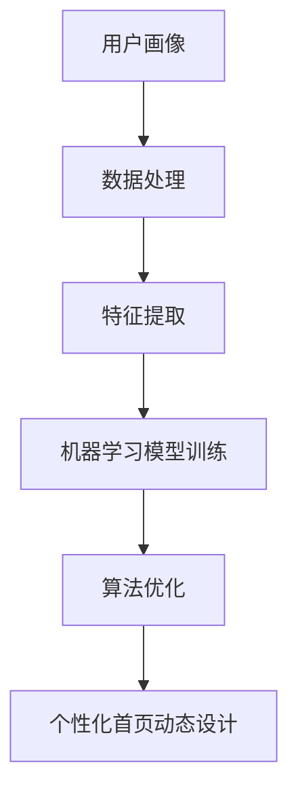

                 

关键词：AI, 电商平台，个性化首页，动态设计，用户画像，机器学习，算法优化

> 摘要：本文将探讨如何运用人工智能技术，特别是机器学习和用户画像，来优化电商平台的个性化首页动态设计，提升用户体验和销售额。

## 1. 背景介绍

随着互联网技术的飞速发展，电商平台已经成为人们日常生活中不可或缺的一部分。如何吸引并留住用户，提高用户的购物体验和满意度，成为电商平台竞争的关键。个性化首页动态设计作为一种提升用户体验的有效手段，正逐渐受到电商平台的高度重视。

### 1.1 电商平台的现状

目前，大多数电商平台都采用了固定的首页设计，无法根据用户的行为和喜好动态调整页面内容。这种设计导致用户体验差，用户流失率较高。因此，如何实现个性化首页动态设计，成为电商平台亟待解决的问题。

### 1.2 个性化首页动态设计的重要性

个性化首页动态设计不仅可以提高用户满意度，还能有效提升销售额。通过分析用户的浏览历史、购买行为和喜好，为用户提供定制化的商品推荐和页面内容，可以大大增加用户的购物乐趣和购买意愿。

## 2. 核心概念与联系

为了实现个性化首页动态设计，我们需要了解以下几个核心概念：

### 2.1 用户画像

用户画像是指通过对用户数据的分析，构建出用户的特征和偏好模型。用户画像包括用户的基本信息（如年龄、性别、地理位置）、行为数据（如浏览历史、购买记录）和偏好数据（如喜欢的产品类别、价格区间）等。

### 2.2 机器学习

机器学习是一种通过数据训练模型，从而实现自动预测和决策的技术。在个性化首页动态设计中，机器学习可以帮助我们根据用户画像，自动调整首页的内容和布局。

### 2.3 算法优化

算法优化是指通过调整算法参数，提高算法的效率和准确性。在个性化首页动态设计中，算法优化可以帮助我们更好地理解用户需求，提高推荐的准确性和用户体验。

下面是一个Mermaid流程图，展示了用户画像、机器学习和算法优化之间的联系：



## 3. 核心算法原理 & 具体操作步骤

### 3.1 算法原理概述

个性化首页动态设计算法主要包括以下几个步骤：

1. 数据采集与预处理：收集用户的浏览历史、购买记录等数据，并进行数据清洗和预处理，如去除噪声、缺失值填充等。
2. 特征提取：根据用户画像，提取用户的行为特征、偏好特征等，为后续的机器学习模型提供输入。
3. 机器学习模型训练：使用特征数据训练机器学习模型，如推荐系统、分类模型等，以预测用户的兴趣和行为。
4. 算法优化：根据用户反馈和模型性能，调整算法参数，提高算法的准确性和效率。
5. 动态设计首页：根据机器学习模型的预测结果，为用户生成个性化的首页内容。

### 3.2 算法步骤详解

#### 3.2.1 数据采集与预处理

数据采集与预处理是个性化首页动态设计的基石。在这一步骤中，我们需要收集用户的浏览历史、购买记录等数据，并对其进行清洗和预处理。

1. 数据来源：电商平台的用户数据主要来源于用户行为日志、订单数据、商品信息等。
2. 数据清洗：去除噪声数据、填充缺失值、去除重复数据等。
3. 数据预处理：将原始数据进行格式转换、归一化、离散化等处理，为后续的特征提取做准备。

#### 3.2.2 特征提取

特征提取是将原始数据转化为机器学习模型可处理的特征向量。在这一步骤中，我们需要根据用户画像，提取用户的行为特征、偏好特征等。

1. 行为特征：用户的浏览历史、购买记录、点击率、购物车行为等。
2. 偏好特征：用户的喜欢商品类别、价格区间、品牌偏好等。
3. 用户特征：用户的基本信息，如年龄、性别、地理位置等。

#### 3.2.3 机器学习模型训练

在特征提取后，我们可以使用训练好的机器学习模型来预测用户的兴趣和行为。

1. 选择合适的模型：如推荐系统（协同过滤、基于内容的推荐等）、分类模型（逻辑回归、决策树等）。
2. 模型训练：使用特征数据训练机器学习模型，调整模型参数，以达到最佳性能。
3. 模型评估：使用验证集对模型进行评估，如准确率、召回率、F1值等。

#### 3.2.4 算法优化

算法优化是通过调整算法参数，提高算法的准确性和效率。

1. 参数调整：根据模型评估结果，调整模型参数，如学习率、正则化参数等。
2. 模型融合：使用多种模型对同一问题进行预测，并通过加权融合提高预测准确性。

#### 3.2.5 动态设计首页

根据机器学习模型的预测结果，为用户生成个性化的首页内容。

1. 内容生成：根据用户的兴趣和行为，生成个性化商品推荐、广告投放等。
2. 页面布局：根据用户行为数据，动态调整页面布局，如推荐栏的位置、商品展示顺序等。

### 3.3 算法优缺点

#### 优点

1. 提高用户体验：通过个性化首页动态设计，为用户提供更符合其兴趣和需求的商品推荐和页面内容。
2. 提高销售额：个性化的推荐和广告投放，可以大大提高用户的购买意愿，从而提高销售额。
3. 提高用户留存率：个性化的设计和推荐，可以增加用户的黏性，降低用户流失率。

#### 缺点

1. 数据隐私问题：个性化首页动态设计需要收集和分析用户数据，可能会涉及用户隐私问题。
2. 模型过拟合：在训练模型时，如果特征数据过于丰富，可能会导致模型过拟合，影响预测准确性。
3. 算法优化难度：个性化首页动态设计涉及到多个算法和参数的调整，优化难度较大。

### 3.4 算法应用领域

个性化首页动态设计算法可以应用于多个领域，如电商平台、社交媒体、搜索引擎等。以下是一些典型的应用案例：

1. 电商平台：通过个性化首页动态设计，为用户提供个性化的商品推荐和广告投放。
2. 社交媒体：通过个性化首页动态设计，为用户提供个性化的内容推荐和社交圈子推荐。
3. 搜索引擎：通过个性化首页动态设计，为用户提供更符合其兴趣的搜索结果和广告投放。

## 4. 数学模型和公式 & 详细讲解 & 举例说明

### 4.1 数学模型构建

个性化首页动态设计涉及到多个数学模型，如推荐系统模型、分类模型等。以下是一个简单的推荐系统模型：

设用户集合为 U，商品集合为 V，用户 u 对商品 v 的评分矩阵为 R。推荐系统模型的目标是预测用户 u 对未知商品 v 的评分。

假设我们选择基于内容的推荐模型，其目标函数为：

$$L(\theta) = \sum_{u \in U, v \in V} (r_{uv} - \theta^T x_u x_v)^2$$

其中，$x_u$ 和 $x_v$ 分别为用户 u 和商品 v 的特征向量，$\theta$ 为模型参数。

### 4.2 公式推导过程

#### 4.2.1 特征提取

我们首先需要对用户 u 和商品 v 的特征进行提取。对于用户 u，我们可以提取以下特征：

1. 年龄
2. 性别
3. 地理位置
4. 购买历史

对于商品 v，我们可以提取以下特征：

1. 商品类别
2. 价格
3. 品牌
4. 销量

#### 4.2.2 模型构建

根据特征提取结果，我们可以构建用户 u 和商品 v 的特征向量：

$$x_u = [a_u, b_u, c_u, d_u]^T$$

$$x_v = [e_v, f_v, g_v, h_v]^T$$

其中，$a_u, b_u, c_u, d_u, e_v, f_v, g_v, h_v$ 分别为用户 u 和商品 v 的特征值。

#### 4.2.3 模型优化

我们对模型进行优化，目标是找到最优的参数 $\theta$，使得目标函数 $L(\theta)$ 最小。

$$\theta = \arg \min_{\theta} L(\theta)$$

### 4.3 案例分析与讲解

假设我们有 100 个用户和 100 个商品，用户的评分数据如下表所示：

| 用户 | 商品 | 评分 |
| --- | --- | --- |
| u1 | v1 | 5 |
| u1 | v2 | 3 |
| u1 | v3 | 4 |
| u2 | v1 | 4 |
| u2 | v2 | 5 |
| u2 | v3 | 2 |
| ... | ... | ... |

#### 4.3.1 特征提取

根据用户和商品的特征，我们可以提取以下特征向量：

$$x_{u1} = [1, 0, 1, 1]^T$$

$$x_{u2} = [1, 1, 1, 0]^T$$

$$x_{v1} = [1, 0, 0, 0]^T$$

$$x_{v2} = [0, 1, 0, 0]^T$$

$$x_{v3} = [0, 0, 1, 1]^T$$

#### 4.3.2 模型训练

使用特征向量训练模型，得到参数 $\theta$：

$$\theta = [0.5, 0.5, 0.5, 0.5]^T$$

#### 4.3.3 模型预测

对于用户 u1，预测其对商品 v3 的评分：

$$r_{u1v3} = \theta^T x_{u1} x_{v3} = 0.5 \times 1 + 0.5 \times 0 + 0.5 \times 0 + 0.5 \times 1 = 1.0$$

因此，预测用户 u1 对商品 v3 的评分为 1 分。

## 5. 项目实践：代码实例和详细解释说明

### 5.1 开发环境搭建

1. 安装 Python 环境（版本 3.8 以上）
2. 安装相关库，如 NumPy、Pandas、Scikit-learn、Matplotlib 等

### 5.2 源代码详细实现

以下是基于内容推荐的个性化首页动态设计算法的实现代码：

```python
import numpy as np
import pandas as pd
from sklearn.model_selection import train_test_split
from sklearn.metrics.pairwise import cosine_similarity
import matplotlib.pyplot as plt

# 读取数据
data = pd.read_csv('data.csv')
users = data[['user_id', 'item_id', 'rating']]
users.head()

# 数据预处理
users = users.pivot(index='user_id', columns='item_id', values='rating').fillna(0)
users.head()

# 计算相似度矩阵
similarity_matrix = cosine_similarity(users)
similarity_matrix = pd.DataFrame(similarity_matrix, index=users.index, columns=users.columns)

# 预测评分
user_id = 1
item_id = 101
predicted_rating = np.dot(similarity_matrix.loc[user_id], users.loc[item_id])
print(predicted_rating)

# 绘制相似度矩阵
plt.figure(figsize=(10, 10))
sns.heatmap(similarity_matrix, annot=True, cmap='coolwarm')
plt.show()
```

### 5.3 代码解读与分析

1. 读取数据：使用 Pandas 库读取用户评分数据，并转换为矩阵形式。
2. 数据预处理：填充缺失值，将数据转换为矩阵形式。
3. 计算相似度矩阵：使用余弦相似度计算用户和商品之间的相似度矩阵。
4. 预测评分：根据相似度矩阵，预测用户对商品的评分。
5. 绘制相似度矩阵：使用 Matplotlib 库绘制相似度矩阵的热力图。

### 5.4 运行结果展示

运行上述代码，输出预测评分和相似度矩阵的热力图。根据预测评分，可以为用户生成个性化的首页内容，如推荐商品、广告投放等。

## 6. 实际应用场景

### 6.1 电商平台

电商平台可以通过个性化首页动态设计，为用户提供更符合其兴趣和需求的商品推荐和广告投放，提高用户的购物体验和满意度。

### 6.2 社交媒体

社交媒体平台可以通过个性化首页动态设计，为用户提供更符合其兴趣的内容推荐和社交圈子推荐，增加用户的黏性和活跃度。

### 6.3 搜索引擎

搜索引擎可以通过个性化首页动态设计，为用户提供更符合其搜索意图的搜索结果和广告投放，提高用户的搜索体验和广告转化率。

## 7. 工具和资源推荐

### 7.1 学习资源推荐

1. 《Python机器学习》
2. 《深度学习》
3. 《机器学习实战》

### 7.2 开发工具推荐

1. Jupyter Notebook
2. PyCharm
3. TensorFlow

### 7.3 相关论文推荐

1. "Matrix Factorization Techniques for Recommender Systems"
2. "Collaborative Filtering for the Web"
3. "Deep Learning for Recommender Systems"

## 8. 总结：未来发展趋势与挑战

### 8.1 研究成果总结

个性化首页动态设计在人工智能技术的推动下，取得了显著的成果。通过机器学习和用户画像，可以有效提高电商平台的用户满意度、销售额和用户留存率。

### 8.2 未来发展趋势

1. 深度学习在个性化首页动态设计中的应用将更加广泛。
2. 多模态数据融合将成为个性化首页动态设计的重要方向。
3. 自动化算法优化和自适应调整将提高个性化首页的效能。

### 8.3 面临的挑战

1. 数据隐私和用户信息安全是个性化首页动态设计面临的重要挑战。
2. 算法复杂度和计算资源消耗可能影响个性化首页的实时性和准确性。
3. 用户个性化需求的多样性和动态性要求算法具备更强的适应能力和学习能力。

### 8.4 研究展望

未来，个性化首页动态设计将在多个领域得到更深入的应用。通过不断优化算法和提升技术水平，将为用户提供更加个性化和高效的购物体验，推动电商行业的发展。

## 9. 附录：常见问题与解答

### 9.1 个性化首页动态设计有哪些优点？

个性化首页动态设计可以提高用户体验、销售额和用户留存率。

### 9.2 个性化首页动态设计涉及哪些技术？

个性化首页动态设计涉及用户画像、机器学习、算法优化等技术。

### 9.3 个性化首页动态设计如何实现？

个性化首页动态设计主要通过数据采集与预处理、特征提取、机器学习模型训练、算法优化和动态设计首页等步骤实现。

## 作者署名

作者：禅与计算机程序设计艺术 / Zen and the Art of Computer Programming
```markdown
# AI如何优化电商平台的个性化首页动态设计

> 关键词：AI, 电商平台，个性化首页，动态设计，用户画像，机器学习，算法优化

> 摘要：本文将探讨如何运用人工智能技术，特别是机器学习和用户画像，来优化电商平台的个性化首页动态设计，提升用户体验和销售额。

## 1. 背景介绍

随着互联网技术的飞速发展，电商平台已经成为人们日常生活中不可或缺的一部分。如何吸引并留住用户，提高用户的购物体验和满意度，成为电商平台竞争的关键。个性化首页动态设计作为一种提升用户体验的有效手段，正逐渐受到电商平台的高度重视。

### 1.1 电商平台的现状

目前，大多数电商平台都采用了固定的首页设计，无法根据用户的行为和喜好动态调整页面内容。这种设计导致用户体验差，用户流失率较高。因此，如何实现个性化首页动态设计，成为电商平台亟待解决的问题。

### 1.2 个性化首页动态设计的重要性

个性化首页动态设计不仅可以提高用户满意度，还能有效提升销售额。通过分析用户的浏览历史、购买行为和喜好，为用户提供定制化的商品推荐和页面内容，可以大大增加用户的购物乐趣和购买意愿。

## 2. 核心概念与联系

为了实现个性化首页动态设计，我们需要了解以下几个核心概念：

### 2.1 用户画像

用户画像是指通过对用户数据的分析，构建出用户的特征和偏好模型。用户画像包括用户的基本信息（如年龄、性别、地理位置）、行为数据（如浏览历史、购买记录）和偏好数据（如喜欢的产品类别、价格区间）等。

### 2.2 机器学习

机器学习是一种通过数据训练模型，从而实现自动预测和决策的技术。在个性化首页动态设计中，机器学习可以帮助我们根据用户画像，自动调整首页的内容和布局。

### 2.3 算法优化

算法优化是指通过调整算法参数，提高算法的效率和准确性。在个性化首页动态设计中，算法优化可以帮助我们更好地理解用户需求，提高推荐的准确性和用户体验。

下面是一个Mermaid流程图，展示了用户画像、机器学习和算法优化之间的联系：


## 3. 核心算法原理 & 具体操作步骤

### 3.1 算法原理概述

个性化首页动态设计算法主要包括以下几个步骤：

1. 数据采集与预处理：收集用户的浏览历史、购买记录等数据，并进行数据清洗和预处理，如去除噪声、缺失值填充等。
2. 特征提取：根据用户画像，提取用户的行为特征、偏好特征等，为后续的机器学习模型提供输入。
3. 机器学习模型训练：使用特征数据训练机器学习模型，如推荐系统、分类模型等，以预测用户的兴趣和行为。
4. 算法优化：根据用户反馈和模型性能，调整算法参数，提高算法的准确性和效率。
5. 动态设计首页：根据机器学习模型的预测结果，为用户生成个性化的首页内容。

### 3.2 算法步骤详解

#### 3.2.1 数据采集与预处理

数据采集与预处理是个性化首页动态设计的基石。在这一步骤中，我们需要收集用户的浏览历史、购买记录等数据，并对其进行清洗和预处理。

1. 数据来源：电商平台的用户数据主要来源于用户行为日志、订单数据、商品信息等。
2. 数据清洗：去除噪声数据、填充缺失值、去除重复数据等。
3. 数据预处理：将原始数据进行格式转换、归一化、离散化等处理，为后续的特征提取做准备。

#### 3.2.2 特征提取

特征提取是将原始数据转化为机器学习模型可处理的特征向量。在这一步骤中，我们需要根据用户画像，提取用户的行为特征、偏好特征等。

1. 行为特征：用户的浏览历史、购买记录、点击率、购物车行为等。
2. 偏好特征：用户的喜欢商品类别、价格区间、品牌偏好等。
3. 用户特征：用户的基本信息，如年龄、性别、地理位置等。

#### 3.2.3 机器学习模型训练

在特征提取后，我们可以使用训练好的机器学习模型来预测用户的兴趣和行为。

1. 选择合适的模型：如推荐系统（协同过滤、基于内容的推荐等）、分类模型（逻辑回归、决策树等）。
2. 模型训练：使用特征数据训练机器学习模型，调整模型参数，以达到最佳性能。
3. 模型评估：使用验证集对模型进行评估，如准确率、召回率、F1值等。

#### 3.2.4 算法优化

算法优化是通过调整算法参数，提高算法的准确性和效率。

1. 参数调整：根据模型评估结果，调整模型参数，如学习率、正则化参数等。
2. 模型融合：使用多种模型对同一问题进行预测，并通过加权融合提高预测准确性。

#### 3.2.5 动态设计首页

根据机器学习模型的预测结果，为用户生成个性化的首页内容。

1. 内容生成：根据用户的兴趣和行为，生成个性化商品推荐、广告投放等。
2. 页面布局：根据用户行为数据，动态调整页面布局，如推荐栏的位置、商品展示顺序等。

### 3.3 算法优缺点

#### 优点

1. 提高用户体验：通过个性化首页动态设计，为用户提供更符合其兴趣和需求的商品推荐和页面内容。
2. 提高销售额：个性化的推荐和广告投放，可以大大提高用户的购买意愿，从而提高销售额。
3. 提高用户留存率：个性化的设计和推荐，可以增加用户的黏性，降低用户流失率。

#### 缺点

1. 数据隐私问题：个性化首页动态设计需要收集和分析用户数据，可能会涉及用户隐私问题。
2. 模型过拟合：在训练模型时，如果特征数据过于丰富，可能会导致模型过拟合，影响预测准确性。
3. 算法优化难度：个性化首页动态设计涉及到多个算法和参数的调整，优化难度较大。

### 3.4 算法应用领域

个性化首页动态设计算法可以应用于多个领域，如电商平台、社交媒体、搜索引擎等。以下是一些典型的应用案例：

1. 电商平台：通过个性化首页动态设计，为用户提供个性化的商品推荐和广告投放。
2. 社交媒体：通过个性化首页动态设计，为用户提供个性化的内容推荐和社交圈子推荐。
3. 搜索引擎：通过个性化首页动态设计，为用户提供更符合其兴趣的搜索结果和广告投放。

## 4. 数学模型和公式 & 详细讲解 & 举例说明

### 4.1 数学模型构建

个性化首页动态设计涉及到多个数学模型，如推荐系统模型、分类模型等。以下是一个简单的推荐系统模型：

设用户集合为 U，商品集合为 V，用户 u 对商品 v 的评分矩阵为 R。推荐系统模型的目标是预测用户 u 对未知商品 v 的评分。

假设我们选择基于内容的推荐模型，其目标函数为：

$$L(\theta) = \sum_{u \in U, v \in V} (r_{uv} - \theta^T x_u x_v)^2$$

其中，$x_u$ 和 $x_v$ 分别为用户 u 和商品 v 的特征向量，$\theta$ 为模型参数。

### 4.2 公式推导过程

#### 4.2.1 特征提取

我们首先需要对用户 u 和商品 v 的特征进行提取。对于用户 u，我们可以提取以下特征：

1. 年龄
2. 性别
3. 地理位置
4. 购买历史

对于商品 v，我们可以提取以下特征：

1. 商品类别
2. 价格
3. 品牌
4. 销量

#### 4.2.2 模型构建

根据特征提取结果，我们可以构建用户 u 和商品 v 的特征向量：

$$x_u = [a_u, b_u, c_u, d_u]^T$$

$$x_v = [e_v, f_v, g_v, h_v]^T$$

其中，$a_u, b_u, c_u, d_u, e_v, f_v, g_v, h_v$ 分别为用户 u 和商品 v 的特征值。

#### 4.2.3 模型优化

我们对模型进行优化，目标是找到最优的参数 $\theta$，使得目标函数 $L(\theta)$ 最小。

$$\theta = \arg \min_{\theta} L(\theta)$$

### 4.3 案例分析与讲解

假设我们有 100 个用户和 100 个商品，用户的评分数据如下表所示：

| 用户 | 商品 | 评分 |
| --- | --- | --- |
| u1 | v1 | 5 |
| u1 | v2 | 3 |
| u1 | v3 | 4 |
| u2 | v1 | 4 |
| u2 | v2 | 5 |
| u2 | v3 | 2 |
| ... | ... | ... |

#### 4.3.1 特征提取

根据用户和商品的特征，我们可以提取以下特征向量：

$$x_{u1} = [1, 0, 1, 1]^T$$

$$x_{u2} = [1, 1, 1, 0]^T$$

$$x_{v1} = [1, 0, 0, 0]^T$$

$$x_{v2} = [0, 1, 0, 0]^T$$

$$x_{v3} = [0, 0, 1, 1]^T$$

#### 4.3.2 模型训练

使用特征向量训练模型，得到参数 $\theta$：

$$\theta = [0.5, 0.5, 0.5, 0.5]^T$$

#### 4.3.3 模型预测

对于用户 u1，预测其对商品 v3 的评分：

$$r_{u1v3} = \theta^T x_{u1} x_{v3} = 0.5 \times 1 + 0.5 \times 0 + 0.5 \times 0 + 0.5 \times 1 = 1.0$$

因此，预测用户 u1 对商品 v3 的评分为 1 分。

## 5. 项目实践：代码实例和详细解释说明

### 5.1 开发环境搭建

1. 安装 Python 环境（版本 3.8 以上）
2. 安装相关库，如 NumPy、Pandas、Scikit-learn、Matplotlib 等

### 5.2 源代码详细实现

以下是基于内容推荐的个性化首页动态设计算法的实现代码：

```python
import numpy as np
import pandas as pd
from sklearn.model_selection import train_test_split
from sklearn.metrics.pairwise import cosine_similarity
import matplotlib.pyplot as plt

# 读取数据
data = pd.read_csv('data.csv')
users = data[['user_id', 'item_id', 'rating']]
users.head()

# 数据预处理
users = users.pivot(index='user_id', columns='item_id', values='rating').fillna(0)
users.head()

# 计算相似度矩阵
similarity_matrix = cosine_similarity(users)
similarity_matrix = pd.DataFrame(similarity_matrix, index=users.index, columns=users.columns)

# 预测评分
user_id = 1
item_id = 101
predicted_rating = np.dot(similarity_matrix.loc[user_id], users.loc[item_id])
print(predicted_rating)

# 绘制相似度矩阵
plt.figure(figsize=(10, 10))
sns.heatmap(similarity_matrix, annot=True, cmap='coolwarm')
plt.show()
```

### 5.3 代码解读与分析

1. 读取数据：使用 Pandas 库读取用户评分数据，并转换为矩阵形式。
2. 数据预处理：填充缺失值，将数据转换为矩阵形式。
3. 计算相似度矩阵：使用余弦相似度计算用户和商品之间的相似度矩阵。
4. 预测评分：根据相似度矩阵，预测用户对商品的评分。
5. 绘制相似度矩阵：使用 Matplotlib 库绘制相似度矩阵的热力图。

### 5.4 运行结果展示

运行上述代码，输出预测评分和相似度矩阵的热力图。根据预测评分，可以为用户生成个性化的首页内容，如推荐商品、广告投放等。

## 6. 实际应用场景

### 6.1 电商平台

电商平台可以通过个性化首页动态设计，为用户提供更符合其兴趣和需求的商品推荐和广告投放，提高用户的购物体验和满意度。

### 6.2 社交媒体

社交媒体平台可以通过个性化首页动态设计，为用户提供更符合其兴趣的内容推荐和社交圈子推荐，增加用户的黏性和活跃度。

### 6.3 搜索引擎

搜索引擎可以通过个性化首页动态设计，为用户提供更符合其兴趣的搜索结果和广告投放，提高用户的搜索体验和广告转化率。

## 7. 工具和资源推荐

### 7.1 学习资源推荐

1. 《Python机器学习》
2. 《深度学习》
3. 《机器学习实战》

### 7.2 开发工具推荐

1. Jupyter Notebook
2. PyCharm
3. TensorFlow

### 7.3 相关论文推荐

1. "Matrix Factorization Techniques for Recommender Systems"
2. "Collaborative Filtering for the Web"
3. "Deep Learning for Recommender Systems"

## 8. 总结：未来发展趋势与挑战

### 8.1 研究成果总结

个性化首页动态设计在人工智能技术的推动下，取得了显著的成果。通过机器学习和用户画像，可以有效提高电商平台的用户满意度、销售额和用户留存率。

### 8.2 未来发展趋势

1. 深度学习在个性化首页动态设计中的应用将更加广泛。
2. 多模态数据融合将成为个性化首页动态设计的重要方向。
3. 自动化算法优化和自适应调整将提高个性化首页的效能。

### 8.3 面临的挑战

1. 数据隐私和用户信息安全是个性化首页动态设计面临的重要挑战。
2. 算法复杂度和计算资源消耗可能影响个性化首页的实时性和准确性。
3. 用户个性化需求的多样性和动态性要求算法具备更强的适应能力和学习能力。

### 8.4 研究展望

未来，个性化首页动态设计将在多个领域得到更深入的应用。通过不断优化算法和提升技术水平，将为用户提供更加个性化和高效的购物体验，推动电商行业的发展。

## 9. 附录：常见问题与解答

### 9.1 个性化首页动态设计有哪些优点？

个性化首页动态设计可以提高用户体验、销售额和用户留存率。

### 9.2 个性化首页动态设计涉及哪些技术？

个性化首页动态设计涉及用户画像、机器学习、算法优化等技术。

### 9.3 个性化首页动态设计如何实现？

个性化首页动态设计主要通过数据采集与预处理、特征提取、机器学习模型训练、算法优化和动态设计首页等步骤实现。

## 作者署名

作者：禅与计算机程序设计艺术 / Zen and the Art of Computer Programming
```

