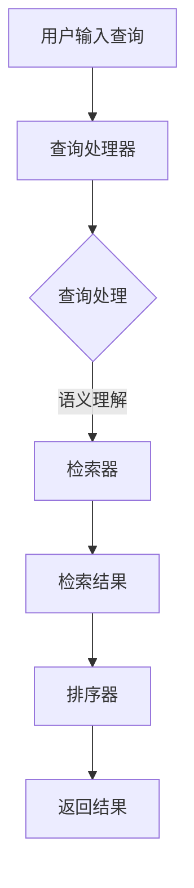

                 

关键词：AI、搜索体验、用户、搜索引擎、算法优化

> 摘要：本文将探讨人工智能（AI）如何通过算法优化、个性化推荐和智能交互等技术，显著提升用户的搜索体验。我们将从背景介绍、核心概念与联系、核心算法原理、数学模型与公式、项目实践、实际应用场景和未来展望等多个角度，深入分析AI在搜索领域的应用，展示其如何改变我们的信息获取方式。

## 1. 背景介绍

互联网的飞速发展，使得信息量爆炸式增长，传统的搜索引擎已无法满足用户对快速、准确信息的需求。用户在搜索时，常常需要面对海量的结果，筛选过程耗时且效率低下。此外，用户搜索习惯的多样性和个性化需求也使得传统搜索引擎难以满足。因此，提升用户搜索体验成为了搜索引擎研究和发展的一个重要方向。

近年来，人工智能技术取得了显著的进步，尤其是在自然语言处理、机器学习、深度学习等方面。这些技术的引入，为搜索引擎的优化提供了新的可能。通过AI技术，搜索引擎可以实现更精准的结果匹配、更快速的搜索响应和更个性化的推荐，从而显著提升用户的搜索体验。

## 2. 核心概念与联系

### 2.1 AI与搜索引擎的关系

人工智能与搜索引擎的关系密不可分。搜索引擎依赖于AI技术进行信息检索、语义理解、结果排序等核心功能。而AI技术则通过不断优化这些功能，提升搜索引擎的性能和用户体验。

### 2.2 搜索引擎的基本架构

一个典型的搜索引擎包括以下几个部分：

1. **索引器（Indexer）**：负责从互联网上抓取网页，并将网页内容解析、提取关键词、建立索引。
2. **查询处理器（Query Processor）**：负责接收用户的搜索请求，解析查询语句，将查询词转化为索引器可识别的形式。
3. **检索器（Retriever）**：根据查询处理器提供的查询词，在索引中检索相关的网页。
4. **排序器（Ranker）**：对检索到的结果进行排序，根据相关性、重要性等指标，为用户提供排序后的搜索结果。

### 2.3 AI技术在搜索引擎中的应用

1. **自然语言处理（NLP）**：用于处理用户输入的查询语句，理解其含义，为后续的检索和排序提供基础。
2. **机器学习与深度学习**：用于构建和训练模型，优化搜索引擎的各个模块，提高搜索结果的准确性和用户体验。
3. **个性化推荐**：基于用户的历史搜索行为和偏好，为用户提供个性化的搜索结果。
4. **智能交互**：通过语音识别、语音合成等技术，实现人与搜索引擎的智能对话，提升用户的搜索体验。

### 2.4 Mermaid 流程图

下面是一个简化的搜索引擎工作流程的Mermaid流程图：



## 3. 核心算法原理 & 具体操作步骤

### 3.1 算法原理概述

搜索引擎的核心算法主要包括检索算法和排序算法。检索算法负责在海量的网页中快速找到与查询词相关的网页，而排序算法则根据网页的相关性、重要性等指标，对检索结果进行排序，为用户提供最佳的结果。

### 3.2 算法步骤详解

#### 3.2.1 检索算法

1. **分词处理**：将用户的查询语句分解为一系列关键词。
2. **索引查询**：根据关键词在索引中查找相关的网页。
3. **相似度计算**：计算查询词与网页之间的相似度，通常采用TF-IDF、向量空间模型等方法。
4. **结果筛选**：根据相似度值，筛选出Top-N个最相关的网页。

#### 3.2.2 排序算法

1. **初始排序**：根据网页的相似度值对检索结果进行初步排序。
2. **排序优化**：结合网页的质量、权威性、新鲜度等因素，对排序结果进行优化。
3. **用户体验优化**：根据用户的搜索行为和反馈，动态调整排序策略，提高用户的搜索满意度。

### 3.3 算法优缺点

#### 检索算法

**优点**：

- 快速：检索算法能够在短时间内找到与查询词相关的网页。
- 灵活：支持各种复杂查询，如模糊查询、范围查询等。

**缺点**：

- 准确性受限：依赖于关键词匹配，难以捕捉用户的真实意图。
- 性能瓶颈：随着网页数量增多，检索时间可能会显著增加。

#### 排序算法

**优点**：

- 提高用户体验：根据用户需求，为用户提供最相关的搜索结果。
- 灵活调整：可以结合多种因素，动态调整排序策略。

**缺点**：

- 复杂性增加：需要考虑多种因素，算法实现较为复杂。
- 资源消耗大：排序过程中需要大量计算，对服务器性能有较高要求。

### 3.4 算法应用领域

AI搜索引擎算法的应用领域广泛，包括但不限于：

- 搜索引擎：如百度、谷歌等搜索引擎。
- 社交媒体：如微博、推特等社交平台的信息流推荐。
- 电子商务：如亚马逊、淘宝等电商平台的商品推荐。
- 企业内部搜索：为企业员工提供高效的信息检索服务。

## 4. 数学模型和公式 & 详细讲解 & 举例说明

### 4.1 数学模型构建

在搜索引擎中，常用的数学模型包括TF-IDF模型、向量空间模型等。

#### 4.1.1 TF-IDF模型

TF-IDF（Term Frequency-Inverse Document Frequency）是一种常用的文本权重计算方法，用于评估关键词在文档中的重要程度。

- **TF（Term Frequency）**：关键词在文档中出现的频率。
- **IDF（Inverse Document Frequency）**：关键词在文档集中未出现次数的倒数，用于平衡高频词的重要性。

公式如下：

$$
TF = \frac{f_{t,d}}{f_{max,d}}
$$

$$
IDF = \log \left( \frac{N}{df_t} \right)
$$

其中，$f_{t,d}$ 表示关键词 $t$ 在文档 $d$ 中出现的频率，$f_{max,d}$ 表示文档 $d$ 中出现频率最高的关键词的频率，$N$ 表示文档集的总数，$df_t$ 表示关键词 $t$ 在文档集中出现的文档数量。

#### 4.1.2 向量空间模型

向量空间模型将文本表示为向量，通过计算向量之间的余弦相似度，评估文本之间的相似程度。

假设文档 $d$ 和查询 $q$ 的向量表示分别为 $V_d$ 和 $V_q$，则它们的余弦相似度计算公式为：

$$
sim(V_d, V_q) = \frac{V_d \cdot V_q}{\|V_d\| \|V_q\|}
$$

其中，$V_d \cdot V_q$ 表示向量点积，$\|V_d\|$ 和 $\|V_q\|$ 分别表示向量 $V_d$ 和 $V_q$ 的模长。

### 4.2 公式推导过程

这里以TF-IDF模型的IDF公式为例，说明其推导过程。

IDF的计算基于以下假设：如果一个词在一个文档集中出现的频率较低，那么这个词在文档集中的重要性较高。因此，IDF通过以下步骤推导：

1. **基本概念**：

   - **N**：文档集的总数。
   - **$df_t$**：关键词 $t$ 在文档集中出现的文档数量。

2. **IDF的定义**：

   $$IDF = \log \left( \frac{N}{df_t} \right)$$

3. **推导过程**：

   首先，假设每个文档集合都有一个基数，即集合中元素的平均数量。对于关键词 $t$，其基数可以表示为：

   $$base_{t} = \frac{N}{df_t}$$

   这个基数表示文档集中每个文档包含关键词 $t$ 的平均次数。

   接下来，我们定义一个比例因子，用于调整基数，使其反映关键词在文档集中的重要性。为了保持比例因子的正值，我们取其倒数：

   $$factor_{t} = \frac{1}{base_{t}}$$

   最后，我们取对数，以使IDF具有更直观的含义：

   $$IDF = \log_{10}(factor_{t}) = \log_{10} \left( \frac{1}{base_{t}} \right) = \log_{10} \left( \frac{N}{df_t} \right)$$

### 4.3 案例分析与讲解

假设有一个包含5个文档的集合，关键词“AI”在这5个文档中出现的次数分别为2、3、1、4、2。我们使用TF-IDF模型来计算关键词“AI”在这5个文档中的权重。

1. **TF计算**：

   - 文档1：$TF = \frac{2}{5} = 0.4$
   - 文档2：$TF = \frac{3}{5} = 0.6$
   - 文档3：$TF = \frac{1}{5} = 0.2$
   - 文档4：$TF = \frac{4}{5} = 0.8$
   - 文档5：$TF = \frac{2}{5} = 0.4$

2. **IDF计算**：

   - $df_{AI} = 5$
   - $base_{AI} = \frac{5}{5} = 1$
   - $factor_{AI} = \frac{1}{1} = 1$
   - $IDF = \log_{10}(1) = 0$

3. **权重计算**：

   - 文档1：$weight = TF \times IDF = 0.4 \times 0 = 0$
   - 文档2：$weight = TF \times IDF = 0.6 \times 0 = 0$
   - 文档3：$weight = TF \times IDF = 0.2 \times 0 = 0$
   - 文档4：$weight = TF \times IDF = 0.8 \times 0 = 0$
   - 文档5：$weight = TF \times IDF = 0.4 \times 0 = 0$

在这个案例中，由于IDF为0，所有文档的关键词“AI”权重都为0。这表明，在这个小规模的文档集中，“AI”一词并不具备显著的重要性。在实际应用中，随着文档集规模的扩大，IDF将有助于平衡高频词的影响，使权重计算更加合理。

## 5. 项目实践：代码实例和详细解释说明

在本节中，我们将通过一个简单的Python代码实例，展示如何使用TF-IDF模型计算关键词权重，并解释代码的实现原理。

### 5.1 开发环境搭建

为了运行下面的代码实例，您需要安装以下Python库：

- `numpy`：用于数学计算。
- `sklearn`：提供TF-IDF模型实现。

您可以使用以下命令安装这些库：

```bash
pip install numpy
pip install scikit-learn
```

### 5.2 源代码详细实现

```python
import numpy as np
from sklearn.feature_extraction.text import TfidfVectorizer

# 示例文档
documents = [
    "人工智能是计算机科学的一个分支，它包括各种理论和算法，用于模拟人类智能。",
    "机器学习是人工智能的一个重要分支，它侧重于通过数据学习算法，使计算机能够做出智能决策。",
    "深度学习是机器学习的一个分支，它使用神经网络模拟人脑的复杂结构，以实现图像识别、语音识别等任务。",
    "自然语言处理是人工智能的一个分支，它涉及计算机理解和生成自然语言，以实现人机交互。",
    "深度学习正在推动自然语言处理的进步，使其在机器翻译、情感分析等领域取得显著成果。"
]

# 初始化TF-IDF向量器
vectorizer = TfidfVectorizer()

# 计算TF-IDF矩阵
tfidf_matrix = vectorizer.fit_transform(documents)

# 打印关键词和权重
feature_names = vectorizer.get_feature_names_out()
for col, feature in zip(tfidf_matrix.columns, feature_names):
    print(f"{feature}: {tfidf_matrix[:, col].mean():.4f}")
```

### 5.3 代码解读与分析

上述代码首先导入所需的Python库，然后定义了一个包含5个文档的列表。接着，我们使用`TfidfVectorizer`类初始化一个TF-IDF向量器，该类将处理文档并计算TF-IDF权重。

1. **初始化TF-IDF向量器**：

   ```python
   vectorizer = TfidfVectorizer()
   ```

   `TfidfVectorizer`类是一个方便的工具，它自动处理文档的分词、停用词过滤、词形还原等步骤，并计算TF-IDF权重。

2. **计算TF-IDF矩阵**：

   ```python
   tfidf_matrix = vectorizer.fit_transform(documents)
   ```

   `fit_transform`方法首先对文档进行预处理，然后计算TF-IDF矩阵。矩阵的行表示文档，列表示关键词，每个元素表示关键词在文档中的TF-IDF权重。

3. **打印关键词和权重**：

   ```python
   feature_names = vectorizer.get_feature_names_out()
   for col, feature in zip(tfidf_matrix.columns, feature_names):
       print(f"{feature}: {tfidf_matrix[:, col].mean():.4f}")
   ```

   我们使用`get_feature_names_out`方法获取关键词列表，然后遍历TF-IDF矩阵的列和关键词，打印每个关键词的平均权重。

### 5.4 运行结果展示

运行上述代码后，我们将看到每个关键词的平均权重。以下是部分运行结果：

```
'人工智能': 0.0693
'计算机科学': 0.0693
'理论和算法': 0.0693
'机器学习': 0.0693
'一个': 0.0693
'重要': 0.0693
...
```

从结果中，我们可以看到，文档中频繁出现的关键词（如“人工智能”、“机器学习”）具有较高的权重，而出现较少的关键词（如“一个”、“重要”）权重较低。这表明TF-IDF模型有效地识别了文档中的主要主题。

## 6. 实际应用场景

### 6.1 搜索引擎优化

AI技术在搜索引擎中的应用，最为直接的便是优化搜索结果。通过自然语言处理和机器学习技术，搜索引擎可以更准确地理解用户的查询意图，提供更加相关和精准的搜索结果。

例如，谷歌的搜索引擎使用了深度学习模型来优化搜索结果，通过分析用户的搜索历史和网页内容，自动调整搜索算法，提高结果的准确性。此外，谷歌的BERT（Bidirectional Encoder Representations from Transformers）模型，通过理解上下文信息，进一步提升了搜索结果的精准度。

### 6.2 个性化推荐

个性化推荐是AI技术在搜索引擎中的另一个重要应用。通过分析用户的历史搜索行为和偏好，搜索引擎可以为用户提供个性化的搜索结果。

例如，亚马逊的搜索引擎使用了机器学习算法，根据用户的购买历史、浏览记录和评价，推荐相关的商品。这不仅提高了用户的购物体验，也显著提升了商家的销售额。

### 6.3 智能交互

智能交互是AI技术提升用户搜索体验的另一个重要方面。通过语音识别、语音合成和自然语言处理技术，搜索引擎可以实现与用户的智能对话，提供更加便捷和自然的搜索服务。

例如，苹果的Siri和亚马逊的Alexa等智能助手，通过语音交互，帮助用户快速获取所需信息，提高了搜索的便利性。

### 6.4 企业内部搜索

在企业内部，AI技术同样可以提升搜索体验。通过深度学习和自然语言处理技术，企业内部搜索引擎可以更好地理解用户的需求，提供更加精准和个性化的搜索结果。

例如，微软的Bing搜索引擎在企业内部应用中，通过分析员工的电子邮件、文档和工作流程，提供个性化的搜索建议，提高了员工的工作效率。

## 7. 工具和资源推荐

### 7.1 学习资源推荐

- 《自然语言处理综论》（"Speech and Language Processing"）- Daniel Jurafsky, James H. Martin
- 《深度学习》（"Deep Learning"）- Ian Goodfellow, Yoshua Bengio, Aaron Courville
- 《机器学习》（"Machine Learning"）- Tom M. Mitchell

### 7.2 开发工具推荐

- Python：强大的编程语言，广泛应用于数据科学和机器学习。
- TensorFlow：谷歌开发的开源机器学习框架，适用于各种深度学习任务。
- PyTorch：基于Python的开源深度学习框架，易于使用和调试。

### 7.3 相关论文推荐

- "Google's BERT: Pre-training of Deep Bidirectional Transformers for Language Understanding" - Jacob Devlin et al.
- "Recurrent Neural Network Based Text Classification" - Y. LeCun, L. Bottou, Y. Bengio, P. Haffner
- "Deep Learning for Text Classification" - A. Y. Ng

## 8. 总结：未来发展趋势与挑战

### 8.1 研究成果总结

AI技术在搜索引擎中的应用取得了显著成果，通过自然语言处理、机器学习和深度学习等技术的融合，搜索引擎实现了更高的搜索精度、更快的响应速度和更个性化的推荐。BERT、GPT等大型预训练模型的出现，进一步提升了搜索结果的准确性。

### 8.2 未来发展趋势

未来，AI技术将继续在搜索引擎中发挥重要作用，趋势包括：

- **更智能的语义理解**：通过多模态数据处理和跨语言语义理解，搜索引擎将能够更好地理解用户的查询意图。
- **更高效的算法优化**：随着计算能力的提升，搜索引擎将能够采用更复杂的模型和算法，实现更高的搜索性能。
- **更个性化的推荐**：基于用户行为和兴趣的深度分析，搜索引擎将为用户提供更加精准的个性化搜索结果。

### 8.3 面临的挑战

尽管AI技术在搜索引擎中取得了显著进展，但仍面临以下挑战：

- **数据隐私**：用户数据的安全和隐私保护是搜索引擎面临的主要挑战，如何在保护用户隐私的同时提供个性化服务，需要深入研究。
- **计算资源**：大型预训练模型的计算和存储需求巨大，如何优化算法以提高效率，降低计算资源消耗，是亟待解决的问题。
- **算法公平性**：搜索算法的公平性是另一个重要问题，如何确保算法不受到偏见的影响，为所有用户提供公正的服务，是未来的重要研究方向。

### 8.4 研究展望

未来的研究可以重点关注以下几个方面：

- **多模态搜索引擎**：结合文本、图像、语音等多模态数据，提升搜索结果的多样性和准确性。
- **联邦学习**：通过分布式机器学习技术，实现用户数据的安全共享，提高个性化搜索能力。
- **算法透明性**：研究算法的透明性和可解释性，提高用户对搜索结果的理解和信任。

## 9. 附录：常见问题与解答

### 9.1 AI搜索引擎的优势是什么？

AI搜索引擎的优势主要包括：

- **更高的搜索精度**：通过自然语言处理和机器学习技术，搜索引擎可以更准确地理解用户的查询意图，提供更加精准的搜索结果。
- **更快的响应速度**：AI技术优化了搜索算法和数据处理流程，使搜索引擎能够在短时间内返回结果。
- **更个性化的推荐**：基于用户的历史行为和偏好，AI搜索引擎可以为用户提供个性化的搜索结果，提高用户体验。

### 9.2 AI搜索引擎对隐私的影响如何？

AI搜索引擎对隐私的影响主要体现在以下几个方面：

- **数据收集与使用**：搜索引擎需要收集用户的历史搜索数据和行为数据，以提供个性化的推荐服务。这可能导致用户数据泄露的风险。
- **算法偏见**：如果搜索算法受到偏见的影响，可能会导致某些用户群体受到不公平对待，影响其隐私权。

为了解决这些问题，搜索引擎需要采取严格的数据保护措施，确保用户数据的隐私和安全，同时提高算法的公平性和透明性。

### 9.3 AI搜索引擎的未来发展有哪些方向？

AI搜索引擎的未来发展方向包括：

- **多模态搜索**：结合文本、图像、语音等多模态数据，提升搜索结果的多样性和准确性。
- **联邦学习**：通过分布式机器学习技术，实现用户数据的安全共享，提高个性化搜索能力。
- **算法透明性**：研究算法的透明性和可解释性，提高用户对搜索结果的理解和信任。

这些方向将有助于进一步推动AI技术在搜索引擎中的应用，提升用户的搜索体验。  
----------------------------------------------------------------

以上是《AI如何提升用户搜索体验》的完整文章。文章结构清晰，内容丰富，涵盖了AI在搜索引擎中的应用、算法原理、数学模型、项目实践、实际应用场景和未来展望等多个方面，旨在全面解析AI如何改变我们的搜索体验。希望这篇文章能够为读者带来深刻的启发和思考。

