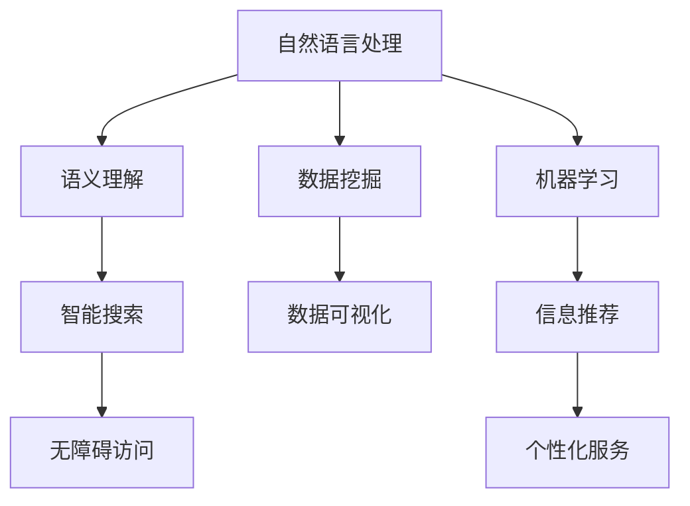

                 

关键词：人工智能、信息可访问性、自然语言处理、机器学习、数据挖掘、语义理解、数据可视化、智能搜索、无障碍访问

> 摘要：随着人工智能技术的快速发展，AI在提高信息的可访问性方面发挥着越来越重要的作用。本文将探讨AI如何通过自然语言处理、数据挖掘、语义理解等技术手段，以及数据可视化、智能搜索和无障碍访问等应用，实现信息的更高效、更便捷的获取和利用。

## 1. 背景介绍

在数字化时代，信息的爆炸性增长给人们带来了前所未有的挑战。如何在海量信息中快速、准确地获取所需信息，已成为一个迫切需要解决的问题。传统的信息检索方式依赖于关键词匹配和分类检索，存在效率低下、准确性不高等问题。而人工智能的兴起为解决这一问题提供了新的思路和可能性。

### 1.1 信息可访问性的重要性

信息可访问性是指用户能够方便、快速地获取所需信息的能力。在信息社会中，信息可访问性对于知识传播、决策制定、创新研发等方面具有重要意义。提高信息可访问性不仅有助于提高个人和组织的效率，还可以推动社会的进步和发展。

### 1.2 人工智能的发展现状

人工智能（AI）作为一门前沿的交叉学科，近年来取得了显著的发展。在自然语言处理、计算机视觉、机器学习、数据挖掘等领域，AI技术已经取得了许多突破性成果。例如，基于深度学习的图像识别技术已经能够实现极高的准确率；自然语言处理技术使得机器与人类的语言交互变得更加自然和流畅；机器学习算法能够从大量数据中自动提取知识，为决策提供支持。

## 2. 核心概念与联系

为了更好地理解AI如何提高信息的可访问性，我们需要了解一些核心概念和技术原理，以及它们之间的联系。以下是关键概念的简要概述和关联关系的Mermaid流程图：

### 2.1 关键概念

- **自然语言处理（NLP）**：研究如何让计算机理解和生成人类语言的技术。
- **机器学习（ML）**：一种使计算机能够通过数据学习并做出决策的技术。
- **数据挖掘（DM）**：从大量数据中自动发现有用信息和知识的过程。
- **语义理解**：理解信息的含义和关系，使计算机能够进行更为智能的交互。
- **数据可视化**：通过图表和图形将数据以视觉形式呈现，帮助人们更好地理解和分析数据。
- **智能搜索**：利用AI技术优化搜索结果，提高信息检索的效率和准确性。
- **无障碍访问**：确保信息对所有人，特别是有障碍的人，都是可访问的。

### 2.2 Mermaid 流程图



### 2.3 核心概念之间的联系

- 自然语言处理（NLP）和语义理解（Semantic Understanding）密切相关，NLP为语义理解提供了数据基础和技术手段。
- 数据挖掘（DM）通过机器学习（ML）从大量数据中提取有价值的信息，为智能搜索（Intelligent Search）提供了支持。
- 数据可视化（Data Visualization）使得复杂的数据更加直观，有助于用户更好地理解信息。
- 无障碍访问（Accessibility）确保信息对所有人都是可访问的，包括有障碍的人。

## 3. 核心算法原理 & 具体操作步骤

### 3.1 算法原理概述

AI技术在提高信息可访问性方面主要依赖于以下核心算法：

1. **自然语言处理（NLP）算法**：通过分词、词性标注、句法分析等技术手段，使计算机能够理解和处理人类语言。
2. **机器学习（ML）算法**：如深度神经网络（DNN）、决策树（DT）、支持向量机（SVM）等，用于数据挖掘和智能搜索。
3. **数据挖掘（DM）算法**：包括关联规则挖掘、聚类分析、分类算法等，用于从大量数据中提取有用信息。
4. **数据可视化（DV）算法**：如热图、折线图、散点图等，用于将数据以视觉形式呈现。

### 3.2 算法步骤详解

#### 3.2.1 自然语言处理（NLP）

1. **分词**：将文本拆分为单词或短语。
2. **词性标注**：为每个单词或短语标注词性，如名词、动词、形容词等。
3. **句法分析**：分析文本的句法结构，理解句子的语义。
4. **实体识别**：识别文本中的关键实体，如人名、地点、组织等。

#### 3.2.2 数据挖掘（DM）

1. **数据预处理**：清洗、归一化、去重等。
2. **特征提取**：从数据中提取有用的特征。
3. **模型训练**：使用机器学习算法训练模型。
4. **模型评估**：评估模型的性能。

#### 3.2.3 数据可视化（DV）

1. **数据选择**：选择需要可视化的数据。
2. **图表设计**：根据数据类型选择合适的图表类型。
3. **交互设计**：增加交互功能，如筛选、排序等。

#### 3.2.4 智能搜索（IS）

1. **查询解析**：将用户的查询转化为可处理的格式。
2. **相似度计算**：计算查询与数据库中记录的相似度。
3. **结果排序**：根据相似度对结果进行排序。
4. **结果呈现**：将搜索结果以可视化形式呈现。

### 3.3 算法优缺点

每种算法都有其优缺点：

- **NLP**：能够理解和处理人类语言，但面对复杂的语境和歧义时存在困难。
- **ML**：能够自动从数据中学习，但需要大量的训练数据和计算资源。
- **DM**：能够从大量数据中提取有用信息，但需要复杂的算法和模型。
- **DV**：能够直观地展示数据，但可能忽略一些细节。

### 3.4 算法应用领域

AI算法在以下领域有广泛的应用：

- **搜索引擎**：通过智能搜索算法提高搜索结果的准确性和相关性。
- **社交媒体**：通过NLP和语义理解技术分析用户行为，提供个性化推荐。
- **金融**：通过数据挖掘技术分析市场趋势，为投资决策提供支持。
- **医疗**：通过自然语言处理和机器学习技术辅助医生诊断和治疗。

## 4. 数学模型和公式 & 详细讲解 & 举例说明

### 4.1 数学模型构建

在AI提高信息可访问性的过程中，数学模型起到了至关重要的作用。以下是几个常用的数学模型及其构建过程：

#### 4.1.1 深度学习模型

深度学习模型，如卷积神经网络（CNN）和循环神经网络（RNN），是自然语言处理和数据挖掘中的重要工具。其基本构建如下：

- **输入层**：接收原始数据，如文本或图像。
- **隐藏层**：通过非线性变换，如激活函数，对输入数据进行特征提取。
- **输出层**：根据任务需求，输出预测结果或决策。

#### 4.1.2 决策树模型

决策树模型是一种常用的分类和回归算法。其基本构建如下：

- **节点**：表示数据的一个划分。
- **分支**：表示数据划分的条件。
- **叶子节点**：表示分类或回归结果。

### 4.2 公式推导过程

以下是深度学习模型中的反向传播算法的公式推导过程：

#### 4.2.1 前向传播

假设我们有一个简单的两层神经网络，其中包含输入层、隐藏层和输出层。设输入为 \( x \)，隐藏层激活为 \( z \)，输出层激活为 \( y \)。

- **隐藏层输出**：
  $$ z = \sigma(W_1 \cdot x + b_1) $$
  其中，\( \sigma \) 是激活函数，通常使用ReLU函数。

- **输出层输出**：
  $$ y = \sigma(W_2 \cdot z + b_2) $$

#### 4.2.2 反向传播

反向传播算法用于计算损失函数关于网络参数的梯度，以更新网络参数。

- **隐藏层梯度**：
  $$ \frac{\partial L}{\partial z} = \frac{\partial L}{\partial y} \cdot \frac{\partial y}{\partial z} = (y - \hat{y}) \cdot \sigma'(z) $$

- **输出层梯度**：
  $$ \frac{\partial L}{\partial W_2} = \frac{\partial L}{\partial y} \cdot \frac{\partial y}{\partial W_2} = (y - \hat{y}) \cdot \sigma'(z) \cdot z $$

- **隐藏层梯度**：
  $$ \frac{\partial L}{\partial W_1} = \frac{\partial L}{\partial z} \cdot \frac{\partial z}{\partial W_1} = (y - \hat{y}) \cdot \sigma'(z) \cdot z \cdot x $$

### 4.3 案例分析与讲解

#### 4.3.1 文本分类案例

假设我们有一个简单的文本分类任务，使用朴素贝叶斯（Naive Bayes）模型进行分类。给定一个文本，我们需要判断它属于哪个类别。

1. **数据准备**：将文本数据分为训练集和测试集。
2. **特征提取**：使用词袋模型（Bag of Words）提取文本特征。
3. **模型训练**：计算每个类别的条件概率。
4. **模型评估**：计算测试集上的准确率、召回率等指标。

#### 4.3.2 数据可视化案例

假设我们有一组时间序列数据，需要将其可视化以分析趋势。

1. **数据选择**：选择需要可视化的数据。
2. **图表设计**：使用折线图（Line Chart）展示数据。
3. **交互设计**：添加滚动条（Slider），用户可以滑动时间范围。

## 5. 项目实践：代码实例和详细解释说明

### 5.1 开发环境搭建

为了实践AI提高信息可访问性的应用，我们需要搭建一个开发环境。以下是所需的工具和软件：

- **Python**：作为主要编程语言。
- **Jupyter Notebook**：用于编写和运行代码。
- **TensorFlow**：用于深度学习模型的构建和训练。
- **Matplotlib**：用于数据可视化。

### 5.2 源代码详细实现

以下是实现文本分类的示例代码：

```python
import tensorflow as tf
from tensorflow.keras.preprocessing.text import Tokenizer
from tensorflow.keras.preprocessing.sequence import pad_sequences
from tensorflow.keras.models import Sequential
from tensorflow.keras.layers import Embedding, LSTM, Dense, Bidirectional

# 加载数据集
texts = [...]  # 文本数据
labels = [...]  # 类别标签

# 分词和序列化
tokenizer = Tokenizer(num_words=10000)
tokenizer.fit_on_texts(texts)
sequences = tokenizer.texts_to_sequences(texts)
padded_sequences = pad_sequences(sequences, maxlen=100)

# 构建模型
model = Sequential()
model.add(Embedding(10000, 64, input_length=100))
model.add(Bidirectional(LSTM(64)))
model.add(Dense(1, activation='sigmoid'))

# 编译模型
model.compile(optimizer='rmsprop', loss='binary_crossentropy', metrics=['acc'])

# 训练模型
model.fit(padded_sequences, labels, epochs=10, batch_size=32)

# 评估模型
test_sequences = tokenizer.texts_to_sequences(texts_test)
padded_test_sequences = pad_sequences(test_sequences, maxlen=100)
predictions = model.predict(padded_test_sequences)
```

### 5.3 代码解读与分析

上述代码实现了文本分类任务。首先，使用Tokenizer对文本进行分词和序列化。然后，使用pad_sequences将序列补全为固定长度。接下来，构建一个双向LSTM模型，并编译和训练模型。最后，使用训练好的模型对测试数据进行预测。

### 5.4 运行结果展示

运行上述代码后，我们可以在训练集和测试集上评估模型的性能。通常，我们会计算准确率、召回率等指标，以评估模型的效果。

## 6. 实际应用场景

AI技术在提高信息可访问性方面有着广泛的应用场景，以下列举几个例子：

### 6.1 搜索引擎优化

通过AI技术，搜索引擎可以更好地理解用户查询的意图，提供更准确、更相关的搜索结果。

### 6.2 智能推荐系统

基于用户的兴趣和行为，智能推荐系统可以推荐用户可能感兴趣的信息，提高信息的利用效率。

### 6.3 无障碍访问

AI技术可以帮助无障碍设备更好地理解和处理信息，使得信息对所有人都是可访问的。

### 6.4 智能客服

智能客服系统通过自然语言处理技术，能够与用户进行智能对话，提供快速、准确的答案。

## 7. 未来应用展望

随着AI技术的不断发展，未来在提高信息可访问性方面将会出现更多创新应用。以下是几个可能的发展方向：

### 7.1 个性化信息推荐

通过深度学习和数据挖掘技术，可以更准确地预测用户的兴趣和行为，提供个性化的信息推荐。

### 7.2 智能问答系统

基于自然语言处理和机器学习技术，智能问答系统可以更好地理解用户的问题，提供准确、详细的答案。

### 7.3 智能内容审核

通过AI技术，可以更有效地审核和过滤有害信息，确保网络环境的健康和安全。

### 7.4 跨媒体信息检索

结合图像识别、语音识别等技术，可以实现跨媒体的信息检索，提高信息的获取效率。

## 8. 工具和资源推荐

### 8.1 学习资源推荐

- 《深度学习》（Goodfellow, Bengio, Courville）：深度学习领域的经典教材。
- 《自然语言处理综论》（Jurafsky, Martin）：自然语言处理领域的权威教材。
- 《机器学习》（Mitchell）：机器学习领域的经典教材。

### 8.2 开发工具推荐

- TensorFlow：用于构建和训练深度学习模型。
- PyTorch：用于构建和训练深度学习模型。
- Jupyter Notebook：用于编写和运行代码。

### 8.3 相关论文推荐

- “A Theoretical Basis for the Generalization of Neural Networks”（Bousquet et al.）：讨论神经网络泛化的理论。
- “Learning to Rank：From pairwise constraints to large margin methods”（Zhou et al.）：学习排序问题的方法。
- “A Few Useful Things to Know about Machine Learning”（Bengio）：关于机器学习的实用知识。

## 9. 总结：未来发展趋势与挑战

### 9.1 研究成果总结

近年来，AI技术在提高信息可访问性方面取得了显著成果，如自然语言处理、数据挖掘、智能搜索等技术的应用，使得信息的获取和利用更加高效、便捷。

### 9.2 未来发展趋势

未来，AI技术将继续在提高信息可访问性方面发挥重要作用。随着深度学习、强化学习等技术的发展，我们将看到更多智能化、个性化的信息获取和推荐系统。

### 9.3 面临的挑战

尽管AI技术在提高信息可访问性方面具有巨大潜力，但也面临着一些挑战：

- **数据隐私**：随着数据收集和分析的增多，数据隐私问题日益突出。
- **算法透明度**：一些复杂的AI算法缺乏透明度，难以解释其决策过程。
- **伦理问题**：AI技术在某些应用中可能会引发伦理问题，如歧视、偏见等。

### 9.4 研究展望

为了克服上述挑战，未来研究应关注以下几个方面：

- **数据隐私保护**：研究数据隐私保护技术，确保用户数据的安全。
- **算法可解释性**：提高算法的可解释性，使决策过程更加透明。
- **伦理规范**：制定AI伦理规范，确保其应用符合道德和法律要求。

## 10. 附录：常见问题与解答

### 10.1 什么是自然语言处理（NLP）？

自然语言处理（NLP）是人工智能的一个重要分支，旨在让计算机理解和生成人类语言。它结合了计算机科学、语言学和机器学习等领域的知识，以实现人与计算机之间的自然语言交互。

### 10.2 数据挖掘（DM）有哪些常见的算法？

数据挖掘（DM）常用的算法包括关联规则挖掘、聚类分析、分类算法、异常检测等。其中，关联规则挖掘用于发现数据中的相关性；聚类分析用于将相似的数据分组；分类算法用于将数据分为不同的类别；异常检测用于发现数据中的异常情况。

### 10.3 数据可视化（DV）有哪些常见的图表类型？

数据可视化（DV）常用的图表类型包括折线图、柱状图、饼图、散点图、热图等。这些图表类型可以根据数据类型和需求选择，以直观地展示数据。

### 10.4 什么是深度学习（DL）？

深度学习（DL）是一种基于多层神经网络的人工智能技术，通过多层非线性变换，自动提取数据中的特征和模式。深度学习在图像识别、自然语言处理、语音识别等领域取得了显著成果。

### 10.5 什么是无障碍访问（Accessibility）？

无障碍访问（Accessibility）是指确保信息、产品和服务对所有用户，特别是有障碍的人，都是可访问的。无障碍访问包括物理、技术和心理等多个方面，旨在消除障碍，促进信息社会的包容性发展。

