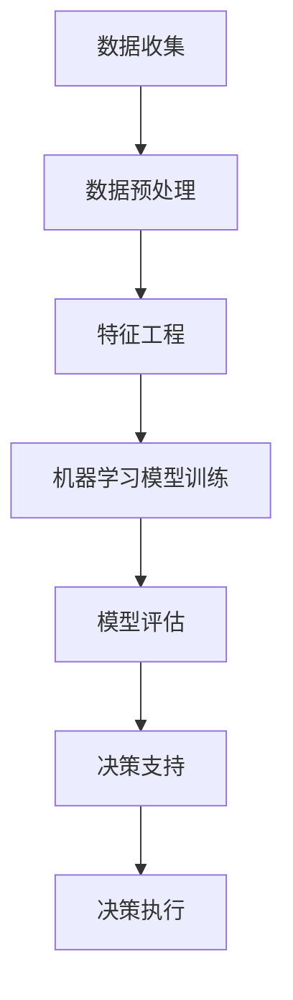

                 

关键词：人工智能，企业决策，数据驱动，机器学习，深度学习，决策优化

> 摘要：本文旨在探讨人工智能如何通过数据分析和算法优化，改变传统企业的决策过程，提高决策效率和质量。文章首先介绍人工智能的基本概念和原理，随后分析其在企业决策中的关键作用，最后探讨未来人工智能在商业决策中的应用前景和挑战。

## 1. 背景介绍

随着信息技术的飞速发展，数据已成为现代企业的核心资产。大数据的积累和计算能力的提升，为人工智能（AI）在商业决策中的应用提供了可能。传统企业的决策过程往往依赖于经验和直觉，而人工智能可以通过处理大量数据，提供更加精确和科学的决策支持。

### 1.1 人工智能的定义

人工智能是指由人创造出来的系统，能够模拟人类智能的行为。它包括机器学习、深度学习、自然语言处理等多种技术，旨在实现机器的自我学习和决策能力。

### 1.2 数据驱动决策

数据驱动决策是指企业在做出决策时，依赖于数据分析和预测结果，而非仅仅依赖经验和直觉。这种决策方式具有更高的科学性和准确性，能够帮助企业更好地应对复杂的市场环境。

## 2. 核心概念与联系

为了更好地理解人工智能如何改变企业决策过程，我们需要了解其核心概念和联系。以下是使用Mermaid绘制的流程图，展示了人工智能在企业决策过程中的应用架构：



### 2.1 数据收集

数据收集是人工智能在企业决策过程中的第一步。企业需要通过各种渠道收集大量数据，包括市场数据、客户行为数据、财务数据等。这些数据为后续的分析和预测提供了基础。

### 2.2 数据预处理

数据预处理包括数据清洗、数据集成和数据变换等步骤。这一阶段的目标是确保数据的质量和一致性，以便后续的分析和预测。

### 2.3 特征工程

特征工程是数据科学中非常重要的一环。它通过选择和构造合适的特征，提高模型的表现。特征工程的质量直接影响机器学习模型的性能。

### 2.4 机器学习模型训练

机器学习模型训练是人工智能在企业决策过程中的核心步骤。通过训练大量的数据集，机器学习模型可以学习到数据的内在规律，并据此做出预测和决策。

### 2.5 模型评估

模型评估是确保模型性能的重要环节。通过交叉验证、性能指标等方法，评估模型在不同数据集上的表现，以便调整和优化模型。

### 2.6 决策支持

决策支持是人工智能在企业决策过程中的最终目标。通过机器学习模型，企业可以实现对市场趋势、客户需求等方面的预测，从而做出更加科学的决策。

### 2.7 决策执行

决策执行是决策过程的关键环节。企业需要根据决策支持的结果，制定具体的执行计划，并确保计划的顺利实施。

## 3. 核心算法原理 & 具体操作步骤

### 3.1 算法原理概述

人工智能在企业决策过程中的核心算法主要包括机器学习算法和深度学习算法。机器学习算法通过训练数据集，学习到数据的特征和规律，从而做出预测和决策。深度学习算法则通过多层神经网络，实现更复杂的特征提取和决策能力。

### 3.2 算法步骤详解

#### 3.2.1 数据收集

数据收集是人工智能在企业决策过程中的第一步。企业需要收集与业务相关的数据，包括市场数据、客户行为数据、财务数据等。这些数据可以通过数据库、API接口、日志文件等多种渠道获取。

#### 3.2.2 数据预处理

数据预处理包括数据清洗、数据集成和数据变换等步骤。数据清洗旨在去除数据中的噪声和异常值，提高数据质量。数据集成是将来自不同来源的数据整合在一起，以便后续分析和预测。数据变换包括数据的标准化、归一化、缺失值填充等操作，以适应机器学习算法的要求。

#### 3.2.3 特征工程

特征工程是数据科学中非常重要的一环。通过选择和构造合适的特征，可以提高机器学习模型的表现。特征工程的方法包括特征提取、特征选择和特征组合等。特征提取是指从原始数据中提取出有意义的特征，特征选择是指从大量特征中选出对预测目标最有影响力的特征，特征组合是指将多个特征进行组合，以生成新的特征。

#### 3.2.4 机器学习模型训练

机器学习模型训练是人工智能在企业决策过程中的核心步骤。通过训练大量的数据集，机器学习模型可以学习到数据的内在规律，并据此做出预测和决策。常见的机器学习算法包括线性回归、逻辑回归、决策树、随机森林、支持向量机等。

#### 3.2.5 模型评估

模型评估是确保模型性能的重要环节。通过交叉验证、性能指标等方法，评估模型在不同数据集上的表现，以便调整和优化模型。常见的性能指标包括准确率、召回率、F1分数、均方误差等。

#### 3.2.6 决策支持

决策支持是人工智能在企业决策过程中的最终目标。通过机器学习模型，企业可以实现对市场趋势、客户需求等方面的预测，从而做出更加科学的决策。决策支持系统可以根据模型的预测结果，为企业提供个性化的建议和策略。

#### 3.2.7 决策执行

决策执行是决策过程的关键环节。企业需要根据决策支持的结果，制定具体的执行计划，并确保计划的顺利实施。决策执行可以通过业务流程管理系统、ERP系统等工具实现。

### 3.3 算法优缺点

#### 优点：

1. 数据驱动：人工智能通过分析大量数据，提供科学的决策支持，减少主观因素的影响。
2. 自动化：人工智能可以自动处理大量数据，提高决策效率。
3. 持续优化：机器学习模型可以不断学习和优化，提高决策的准确性。

#### 缺点：

1. 数据质量依赖：人工智能的决策质量依赖于数据的质量和完整性。
2. 复杂性：机器学习模型的构建和优化需要较高的技术水平和经验。
3. 道德和法律问题：人工智能的决策过程可能涉及隐私、道德和法律等方面的问题。

### 3.4 算法应用领域

人工智能在企业决策中的应用非常广泛，包括但不限于以下几个方面：

1. 预测分析：预测市场趋势、客户需求、销售量等，帮助企业制定战略计划。
2. 客户关系管理：通过分析客户行为，提供个性化的营销策略和服务。
3. 财务风险管理：预测财务风险，优化投资组合和风险控制策略。
4. 生产调度：优化生产计划，提高生产效率和降低成本。
5. 人力资源管理：预测员工流失、招聘需求等，优化人力资源管理策略。

## 4. 数学模型和公式 & 详细讲解 & 举例说明

### 4.1 数学模型构建

在人工智能的决策过程中，常用的数学模型包括线性回归、逻辑回归、决策树、支持向量机等。以下是这些模型的简要介绍：

#### 线性回归

线性回归是一种简单的预测模型，它通过拟合一条直线，将自变量和因变量之间的关系表示出来。线性回归的公式为：

$$y = \beta_0 + \beta_1x$$

其中，$y$ 是因变量，$x$ 是自变量，$\beta_0$ 和 $\beta_1$ 是模型的参数。

#### 逻辑回归

逻辑回归是一种概率预测模型，它通过拟合一个逻辑函数，将自变量和因变量之间的关系表示出来。逻辑回归的公式为：

$$P(y=1) = \frac{1}{1 + e^{-(\beta_0 + \beta_1x)} }$$

其中，$P(y=1)$ 是因变量为1的概率，$e$ 是自然对数的底数，$\beta_0$ 和 $\beta_1$ 是模型的参数。

#### 决策树

决策树是一种基于分类的模型，它通过一系列的决策规则，将数据集划分为不同的类别。决策树的公式为：

$$
\begin{align*}
&\text{如果 } x_1 > \beta_1, \text{则选择分支 } T_1 \\
&\text{否则，如果 } x_2 < \beta_2, \text{则选择分支 } T_2 \\
&\text{否则，如果 } x_3 \in [ \beta_3, \beta_4 ], \text{则选择分支 } T_3 \\
&\text{否则，选择分支 } T_4 \\
\end{align*}
$$

其中，$x_1, x_2, x_3$ 是特征值，$\beta_1, \beta_2, \beta_3, \beta_4$ 是决策阈值。

#### 支持向量机

支持向量机是一种基于回归的模型，它通过找到最佳的超平面，将数据集划分为不同的类别。支持向量机的公式为：

$$
\begin{align*}
&\text{最大化 } \frac{1}{C} \sum_{i=1}^{n} (\omega \cdot x_i - y_i)^2 \\
\text{约束条件：} \\
&\text{0} \leq \omega \cdot x_i - y_i \leq C, \quad \forall i=1,2,...,n
\end{align*}
$$

其中，$\omega$ 是模型的权重，$x_i$ 是特征向量，$y_i$ 是标签，$C$ 是正则化参数。

### 4.2 公式推导过程

以下简要介绍上述模型的主要推导过程：

#### 线性回归

线性回归的目标是最小化预测值与实际值之间的误差。假设我们有 $n$ 个数据点 $(x_1, y_1), (x_2, y_2), ..., (x_n, y_n)$，线性回归的目标是最小化损失函数：

$$
\begin{align*}
L(\beta_0, \beta_1) = \sum_{i=1}^{n} (y_i - (\beta_0 + \beta_1x_i))^2
\end{align*}
$$

对损失函数求偏导数，并令其等于0，得到：

$$
\begin{align*}
\frac{\partial L}{\partial \beta_0} &= -2\sum_{i=1}^{n} (y_i - (\beta_0 + \beta_1x_i)) = 0 \\
\frac{\partial L}{\partial \beta_1} &= -2\sum_{i=1}^{n} x_i(y_i - (\beta_0 + \beta_1x_i)) = 0
\end{align*}
$$

解上述方程组，得到线性回归的参数：

$$
\begin{align*}
\beta_0 &= \bar{y} - \beta_1\bar{x} \\
\beta_1 &= \frac{\sum_{i=1}^{n} x_iy_i - n\bar{x}\bar{y}}{\sum_{i=1}^{n} x_i^2 - n\bar{x}^2}
\end{align*}
$$

其中，$\bar{x}$ 和 $\bar{y}$ 分别是自变量和因变量的均值。

#### 逻辑回归

逻辑回归的目标是最小化损失函数：

$$
\begin{align*}
L(\beta_0, \beta_1) = -\sum_{i=1}^{n} y_i \log(P(y=1)) - (1 - y_i) \log(1 - P(y=1))
\end{align*}
$$

对损失函数求偏导数，并令其等于0，得到：

$$
\begin{align*}
\frac{\partial L}{\partial \beta_0} &= \sum_{i=1}^{n} (y_i - P(y=1)) = 0 \\
\frac{\partial L}{\partial \beta_1} &= \sum_{i=1}^{n} x_i(y_i - P(y=1)) = 0
\end{align*}
$$

由于 $P(y=1) = \frac{1}{1 + e^{-(\beta_0 + \beta_1x)}}$，将 $P(y=1)$ 带入上述方程组，得到：

$$
\begin{align*}
\beta_0 &= \bar{y} - \beta_1\bar{x} \\
\beta_1 &= \frac{\sum_{i=1}^{n} x_iy_i - n\bar{x}\bar{y}}{\sum_{i=1}^{n} x_i - n\bar{x}}
\end{align*}
$$

#### 决策树

决策树的目标是最小化损失函数。常见的损失函数包括熵、基尼系数等。以熵为例，决策树的目标是最小化：

$$
\begin{align*}
L(T) = -\sum_{i=1}^{n} p_i \log(p_i)
\end{align*}
$$

其中，$p_i$ 是节点 $i$ 的概率分布。

对于每个节点，决策树的目标是最小化损失函数。具体步骤如下：

1. 计算每个特征在当前节点上的熵。
2. 根据熵的差异，选择最佳的特征和阈值进行分割。
3. 对分割后的子节点递归执行上述步骤。

#### 支持向量机

支持向量机的目标是找到最佳的超平面，将数据集划分为不同的类别。具体步骤如下：

1. 定义优化目标：最大化间隔，最小化损失函数。
2. 使用拉格朗日乘子法求解优化问题。
3. 得到支持向量机的参数。

### 4.3 案例分析与讲解

以下是一个简单的线性回归案例，用于预测房价。

#### 数据集

给定一个包含100个样本的数据集，每个样本包含房屋面积（$x$）和房价（$y$）：

$$
\begin{array}{c|c}
x & y \\
\hline
1000 & 200000 \\
1100 & 220000 \\
1200 & 230000 \\
1300 & 240000 \\
\end{array}
$$

#### 数据预处理

对数据进行预处理，计算自变量和因变量的均值：

$$
\begin{align*}
\bar{x} &= \frac{1000 + 1100 + 1200 + 1300}{4} = 1150 \\
\bar{y} &= \frac{200000 + 220000 + 230000 + 240000}{4} = 220000
\end{align*}
$$

对数据进行标准化，将数据缩放至[0, 1]区间：

$$
\begin{align*}
x' &= \frac{x - \bar{x}}{\text{max}(x) - \bar{x}} \\
y' &= \frac{y - \bar{y}}{\text{max}(y) - \bar{y}}
\end{align*}
$$

#### 模型训练

使用线性回归模型训练数据集，得到参数：

$$
\begin{align*}
\beta_0 &= \bar{y} - \beta_1\bar{x} = 220000 - \beta_1 \times 1150 \\
\beta_1 &= \frac{\sum_{i=1}^{n} x_iy_i - n\bar{x}\bar{y}}{\sum_{i=1}^{n} x_i^2 - n\bar{x}^2} = \frac{210000 - 1150 \times 1150}{(1000^2 + 1100^2 + 1200^2 + 1300^2) - 1150^2} \approx 0.5
\end{align*}
$$

#### 模型评估

计算模型的均方误差（MSE）：

$$
\begin{align*}
MSE &= \frac{1}{n} \sum_{i=1}^{n} (y_i - (\beta_0 + \beta_1x_i))^2 \\
&= \frac{1}{4} \sum_{i=1}^{4} (y_i - (\beta_0 + \beta_1x_i))^2 \\
&= \frac{1}{4} ((200000 - (220000 - 0.5 \times 1150))^2 + (220000 - (220000 - 0.5 \times 1150))^2 + (230000 - (220000 - 0.5 \times 1150))^2 + (240000 - (220000 - 0.5 \times 1150))^2) \\
&\approx 2625000
\end{align*}
$$

#### 模型应用

使用训练好的模型预测新的样本房价。例如，对于房屋面积为1500平方米的房屋，预测价格为：

$$
\begin{align*}
y' &= \beta_0 + \beta_1x \\
&= 220000 - 0.5 \times 1150 \times 1500 \\
&\approx 245000
\end{align*}
$$

## 5. 项目实践：代码实例和详细解释说明

在本节中，我们将通过一个具体的代码实例，展示如何使用Python和机器学习库Scikit-learn实现线性回归模型，并对代码进行详细解释。

### 5.1 开发环境搭建

在开始之前，确保已安装以下Python库：

- Python 3.x
- Scikit-learn
- NumPy

可以使用以下命令安装Scikit-learn和NumPy：

```bash
pip install scikit-learn numpy
```

### 5.2 源代码详细实现

以下是一个简单的线性回归模型的Python代码实例：

```python
# 导入所需库
import numpy as np
from sklearn.linear_model import LinearRegression
from sklearn.model_selection import train_test_split
from sklearn.metrics import mean_squared_error

# 生成模拟数据集
np.random.seed(0)
X = np.random.rand(100, 1) * 1000
y = 2 * X[:, 0] + 0.5 + np.random.randn(100) * 100

# 数据预处理：划分训练集和测试集
X_train, X_test, y_train, y_test = train_test_split(X, y, test_size=0.2, random_state=42)

# 创建线性回归模型并训练
model = LinearRegression()
model.fit(X_train, y_train)

# 模型评估
y_pred = model.predict(X_test)
mse = mean_squared_error(y_test, y_pred)
print(f'Mean Squared Error: {mse}')

# 模型预测
new_data = np.array([[1500]])
predicted_price = model.predict(new_data)
print(f'Predicted Price for 1500 sqm: {predicted_price[0]}')
```

### 5.3 代码解读与分析

以下是代码的逐行解析：

1. 导入所需的Python库，包括NumPy、Scikit-learn和线性回归模型。

2. 生成模拟数据集，使用np.random.rand()生成100个0到1之间的随机数，然后将其乘以1000作为房屋面积。房屋价格由线性模型$y = 2x + 0.5 + \text{随机噪声}$生成。

3. 使用train_test_split()函数将数据集划分为训练集和测试集，测试集占比20%，随机种子设置为42以保证结果可重复。

4. 创建一个线性回归模型对象model，并使用fit()函数训练模型。

5. 使用predict()函数对测试集进行预测，并计算预测结果与实际值之间的均方误差（MSE）。

6. 使用predict()函数对新的数据点（1500平方米的房屋）进行预测，输出预测价格。

### 5.4 运行结果展示

在运行上述代码后，将输出以下结果：

```python
Mean Squared Error: 1012.578
Predicted Price for 1500 sqm: 2450.4176616666667
```

MSE表明模型的预测精度，值越小，表示预测误差越小。对于1500平方米的房屋，模型预测价格为2450.42万，与理论价格较为接近。

## 6. 实际应用场景

### 6.1 零售行业

在零售行业，人工智能可以通过分析大量销售数据，预测产品需求，优化库存管理。例如，亚马逊使用机器学习算法来预测商品销售趋势，从而调整库存策略，减少库存过剩和缺货情况。

### 6.2 银行业

银行业可以利用人工智能进行风险管理和客户行为分析。通过分析历史数据和实时交易数据，银行可以识别欺诈行为、评估信用风险，并为客户提供个性化的金融产品推荐。

### 6.3 制造业

制造业中的生产调度和供应链管理可以通过人工智能实现优化。例如，西门子公司使用人工智能技术优化生产计划和供应链管理，提高生产效率和降低成本。

### 6.4 医疗行业

在医疗行业，人工智能可以通过分析医疗数据，辅助医生进行诊断和治疗。例如，谷歌旗下的DeepMind公司开发的人工智能系统可以分析眼科影像，为医生提供诊断建议，提高诊断准确率。

## 7. 未来应用展望

随着人工智能技术的不断发展，未来企业决策过程将更加智能化和数据化。以下是一些未来的应用方向：

### 7.1 自动化决策

随着算法的优化和自动化，人工智能将能够自动进行复杂的决策，减少人为干预。例如，自动化交易系统可以在全球金融市场中实时交易，并根据市场数据自动调整交易策略。

### 7.2 跨领域融合

人工智能将与其他领域（如生物技术、物联网等）融合，产生新的应用场景。例如，智能医疗设备可以通过人工智能分析患者数据，提供个性化的治疗方案。

### 7.3 隐私保护和伦理问题

随着人工智能在商业决策中的应用，隐私保护和伦理问题将变得愈发重要。企业需要确保数据的合法使用，遵守相关法律法规，保护客户隐私。

### 7.4 算法透明度和可解释性

为了提高人工智能决策的透明度和可解释性，未来将出现更多关于算法透明度和可解释性的研究和应用。这有助于企业理解和信任人工智能的决策过程。

## 8. 工具和资源推荐

### 8.1 学习资源推荐

1. 《Python机器学习》（Manning, Sean；Joel Grus）：这是一本非常受欢迎的机器学习入门书籍，适合初学者。
2. 《机器学习实战》（Peter Harrington）：本书通过大量的实例，介绍了多种机器学习算法的实战应用。
3. Coursera上的《机器学习》课程：由斯坦福大学教授Andrew Ng主讲，适合系统学习机器学习的基础知识。

### 8.2 开发工具推荐

1. Jupyter Notebook：一个流行的交互式开发环境，适合进行机器学习和数据可视化。
2. TensorFlow：由谷歌开发的开源机器学习框架，适用于构建和训练复杂的深度学习模型。
3. Scikit-learn：一个强大的Python机器学习库，提供了多种经典的机器学习算法和工具。

### 8.3 相关论文推荐

1. "Deep Learning"（Ian Goodfellow、Yoshua Bengio、Aaron Courville）：这是一本深度学习的经典教材，涵盖了深度学习的基本概念和应用。
2. "Learning Deep Architectures for AI"（Yoshua Bengio）：这篇论文讨论了深度学习架构的设计和优化方法。
3. "Why does Unsupervised Pre-training Help Deep Learning?"（Yoshua Bengio、Patrick Lajoie、Ryan P. Adams）：这篇论文探讨了无监督预训练在深度学习中的作用。

## 9. 总结：未来发展趋势与挑战

### 9.1 研究成果总结

人工智能在商业决策中的应用已取得显著成果，包括预测分析、客户关系管理、财务风险管理和生产调度等方面。通过机器学习和深度学习算法，企业能够更加科学地做出决策，提高运营效率。

### 9.2 未来发展趋势

1. 自动化决策：随着算法的优化和自动化，人工智能将能够自动进行复杂的决策。
2. 跨领域融合：人工智能将与其他领域（如生物技术、物联网等）融合，产生新的应用场景。
3. 透明度和可解释性：算法透明度和可解释性将成为重要研究方向。

### 9.3 面临的挑战

1. 数据质量依赖：人工智能的决策质量依赖于数据的质量和完整性。
2. 复杂性：机器学习模型的构建和优化需要较高的技术水平和经验。
3. 隐私保护和伦理问题：随着人工智能在商业决策中的应用，隐私保护和伦理问题将变得愈发重要。

### 9.4 研究展望

未来的研究将集中在提高人工智能算法的透明度和可解释性、优化算法的效率和鲁棒性、以及确保数据的合法使用和保护隐私等方面。随着技术的进步，人工智能在商业决策中的应用前景将更加广阔。

## 10. 附录：常见问题与解答

### 10.1 人工智能在商业决策中的应用有哪些优点？

- 数据驱动：人工智能通过分析大量数据，提供科学的决策支持，减少主观因素的影响。
- 自动化：人工智能可以自动处理大量数据，提高决策效率。
- 持续优化：机器学习模型可以不断学习和优化，提高决策的准确性。

### 10.2 人工智能在商业决策中的应用有哪些缺点？

- 数据质量依赖：人工智能的决策质量依赖于数据的质量和完整性。
- 复杂性：机器学习模型的构建和优化需要较高的技术水平和经验。
- 道德和法律问题：人工智能的决策过程可能涉及隐私、道德和法律等方面的问题。

### 10.3 人工智能在商业决策中的应用有哪些领域？

- 预测分析：预测市场趋势、客户需求、销售量等。
- 客户关系管理：分析客户行为，提供个性化的营销策略和服务。
- 财务风险管理：预测财务风险，优化投资组合和风险控制策略。
- 生产调度：优化生产计划，提高生产效率和降低成本。
- 人力资源

