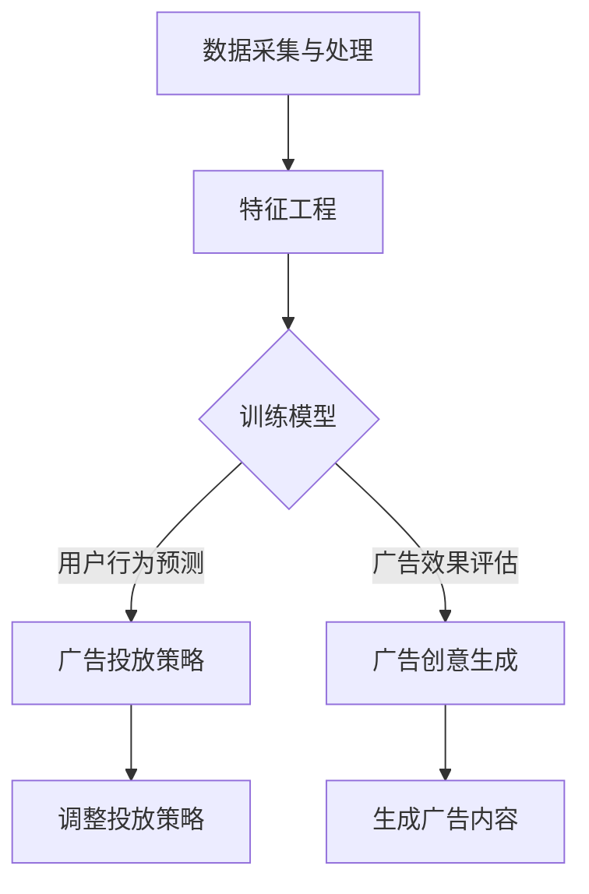

                 

关键词：人工智能，广告投放，机器学习，大数据分析，广告优化

摘要：随着人工智能技术的飞速发展，广告投放策略也在发生深刻变革。本文将探讨AI如何通过精准定位、优化投放、智能广告创意生成等手段，提升广告效果，降低营销成本，为企业带来更高的投资回报率。

## 1. 背景介绍

广告业是一个高度竞争的领域，企业不断寻求更有效的广告投放策略来提高品牌曝光度和销售转化率。然而，传统的广告投放策略往往依赖于人为判断和经验，难以应对日益复杂的用户行为和市场环境。随着大数据、机器学习和深度学习等人工智能技术的发展，广告投放策略逐渐向智能化、数据驱动转变。

人工智能在广告领域的主要应用包括：

- **用户行为分析**：通过分析用户浏览历史、搜索记录和社交行为，精准定位潜在消费者。
- **广告投放优化**：利用算法动态调整广告投放策略，以实现更高的点击率和转化率。
- **广告创意生成**：利用自然语言处理和图像识别技术，自动生成更具吸引力的广告内容。
- **效果评估**：通过实时监控广告效果，为企业提供精准的数据分析，以指导后续广告投放策略。

## 2. 核心概念与联系

### 2.1. 人工智能广告投放架构

人工智能广告投放架构可以分为以下几个关键组成部分：

1. **数据采集与处理**：收集用户行为数据、广告受众特征数据和市场环境数据，进行数据清洗、去噪和归一化处理。
2. **特征工程**：从原始数据中提取对广告投放有重要影响的关键特征，如用户年龄、性别、兴趣偏好、地理位置等。
3. **机器学习模型**：利用特征数据训练机器学习模型，如决策树、随机森林、支持向量机等，以实现用户行为预测和广告效果评估。
4. **广告投放策略**：根据机器学习模型的结果，动态调整广告投放策略，如投放时间、投放地域、广告频率等。
5. **广告创意生成**：利用自然语言处理和图像识别技术，自动生成符合用户需求的广告创意。

下面是一个简单的Mermaid流程图，展示了人工智能广告投放的流程：



### 2.2. 核心概念原理

#### 2.2.1. 机器学习模型原理

机器学习模型是人工智能广告投放的核心组件。以下是一些常用的机器学习模型及其原理：

- **决策树**：通过一系列规则对数据进行分类或回归。决策树的每个节点代表一个特征，每个分支代表特征的不同取值。
- **随机森林**：由多个决策树组成，通过对每个决策树的结果进行投票，提高预测准确性。
- **支持向量机（SVM）**：通过找到一个最优的超平面，将数据分为不同的类别。
- **神经网络**：模拟人脑神经元之间的连接，通过多层神经网络对数据进行处理，以实现复杂的模式识别和分类。

#### 2.2.2. 广告投放策略原理

广告投放策略的核心是优化广告效果，提高投资回报率。以下是一些常见的广告投放策略：

- **精准投放**：根据用户特征和行为，精准定位潜在消费者，提高广告点击率和转化率。
- **动态优化**：利用机器学习模型实时分析广告效果，动态调整广告投放策略，以实现更高的广告效果。
- **频次控制**：根据用户行为和广告效果，控制广告展示频次，避免过度投放导致用户疲劳。
- **地域定位**：根据用户地理位置，将广告投放到具有更高潜在价值的地域，提高广告效果。

## 3. 核心算法原理 & 具体操作步骤

### 3.1 算法原理概述

人工智能广告投放的核心算法主要包括用户行为预测、广告效果评估和广告投放策略优化。以下是对这些算法原理的概述：

#### 用户行为预测

用户行为预测是广告投放的基础，通过分析用户的历史行为数据，预测用户对广告的响应。常用的预测算法包括决策树、随机森林和神经网络等。

#### 广告效果评估

广告效果评估用于衡量广告投放的效果，常用的评估指标包括点击率（CTR）、转化率（CVR）和投资回报率（ROI）等。通过实时监控广告效果，为企业提供决策依据。

#### 广告投放策略优化

广告投放策略优化是通过动态调整广告投放策略，以实现更高的广告效果。常用的优化算法包括贪心算法、模拟退火算法和遗传算法等。

### 3.2 算法步骤详解

#### 3.2.1 用户行为预测

用户行为预测的步骤如下：

1. 数据采集与处理：收集用户历史行为数据，如浏览记录、搜索记录、点击记录等，并进行数据清洗、去噪和归一化处理。
2. 特征工程：从原始数据中提取对用户行为有重要影响的关键特征，如用户年龄、性别、兴趣偏好、地理位置等。
3. 训练预测模型：利用特征数据和标签数据（即用户对广告的响应），训练机器学习预测模型，如决策树、随机森林等。
4. 预测用户行为：利用训练好的模型，对新的用户数据进行行为预测。

#### 3.2.2 广告效果评估

广告效果评估的步骤如下：

1. 数据收集：收集广告投放过程中的各项数据，如广告展示次数、点击次数、转化次数等。
2. 指标计算：计算广告投放的各项指标，如点击率（CTR）、转化率（CVR）和投资回报率（ROI）等。
3. 结果分析：对广告效果进行实时分析，评估广告投放的效果。

#### 3.2.3 广告投放策略优化

广告投放策略优化的步骤如下：

1. 确定优化目标：根据企业需求，确定广告投放的优化目标，如提高点击率、提高转化率等。
2. 选择优化算法：选择合适的优化算法，如贪心算法、模拟退火算法等。
3. 优化广告投放策略：利用优化算法，动态调整广告投放策略，如投放时间、投放地域、广告频次等。
4. 持续优化：根据广告效果评估结果，持续优化广告投放策略。

### 3.3 算法优缺点

#### 用户行为预测

**优点**：

- 高度自动化：通过机器学习模型，自动预测用户行为，减轻人工干预。
- 精准定位：通过分析用户历史行为，精准定位潜在消费者。

**缺点**：

- 数据依赖性：用户行为预测效果受数据质量影响较大。
- 模型更新：需要定期更新模型，以适应不断变化的用户行为。

#### 广告效果评估

**优点**：

- 实时反馈：实时监控广告效果，为企业提供决策依据。
- 数据驱动：基于数据评估广告效果，减少人为干预。

**缺点**：

- 数据偏差：广告效果评估受数据质量和数据完整性影响。
- 指标选择：选择合适的评估指标对广告效果进行评估。

#### 广告投放策略优化

**优点**：

- 动态调整：根据广告效果，动态调整广告投放策略，提高广告效果。
- 智能化：利用机器学习算法，实现广告投放策略的优化。

**缺点**：

- 复杂性：广告投放策略优化涉及多个因素，实现难度较大。
- 资源消耗：优化广告投放策略需要大量的计算资源。

### 3.4 算法应用领域

人工智能广告投放算法广泛应用于以下领域：

- **在线广告**：如搜索引擎广告、社交媒体广告、展示广告等。
- **移动广告**：通过移动设备投放广告，如移动应用广告、移动网页广告等。
- **视频广告**：如视频网站上的视频前贴片广告、视频中间广告等。
- **跨渠道广告**：通过多种渠道进行广告投放，实现跨平台营销。

## 4. 数学模型和公式 & 详细讲解 & 举例说明

### 4.1 数学模型构建

在人工智能广告投放中，常见的数学模型包括用户行为预测模型、广告效果评估模型和广告投放策略优化模型。以下是对这些模型的构建方法进行详细讲解。

#### 用户行为预测模型

用户行为预测模型主要基于线性回归、逻辑回归和决策树等算法。以下是一个简单的线性回归模型：

$$
y = \beta_0 + \beta_1x_1 + \beta_2x_2 + ... + \beta_nx_n
$$

其中，$y$ 表示用户对广告的响应（如点击、转化等），$x_1, x_2, ..., x_n$ 表示用户特征（如年龄、性别、兴趣等），$\beta_0, \beta_1, ..., \beta_n$ 表示模型参数。

#### 广告效果评估模型

广告效果评估模型主要基于点击率（CTR）、转化率（CVR）和投资回报率（ROI）等指标。以下是一个简单的CTR模型：

$$
CTR = \frac{点击次数}{展示次数}
$$

其中，$CTR$ 表示点击率，$点击次数$ 表示用户点击广告的次数，$展示次数$ 表示广告展示的次数。

#### 广告投放策略优化模型

广告投放策略优化模型主要基于贪心算法、模拟退火算法和遗传算法等。以下是一个简单的贪心算法模型：

$$
当前收益 = 最大收益
$$

其中，$当前收益$ 表示当前广告投放策略的收益，$最大收益$ 表示所有广告投放策略中的最大收益。

### 4.2 公式推导过程

#### 用户行为预测模型

用户行为预测模型的推导过程如下：

1. **假设**：用户对广告的响应是一个随机变量，满足二项分布。

$$
P(点击) = p
$$

其中，$p$ 表示用户点击广告的概率。

2. **条件概率**：给定用户特征 $x_1, x_2, ..., x_n$，用户点击广告的条件概率为：

$$
P(点击 | x_1, x_2, ..., x_n) = \frac{P(点击, x_1, x_2, ..., x_n)}{P(x_1, x_2, ..., x_n)}
$$

3. **联合概率**：给定用户特征 $x_1, x_2, ..., x_n$，用户点击广告和展示广告的联合概率为：

$$
P(点击, x_1, x_2, ..., x_n) = p \cdot (1 - p)^{n-1}
$$

4. **边缘概率**：给定用户特征 $x_1, x_2, ..., x_n$，用户展示广告的概率为：

$$
P(x_1, x_2, ..., x_n) = 1
$$

5. **条件概率分布**：给定用户特征 $x_1, x_2, ..., x_n$，用户点击广告的条件概率分布为：

$$
P(点击 | x_1, x_2, ..., x_n) = \frac{P(点击, x_1, x_2, ..., x_n)}{P(x_1, x_2, ..., x_n)} = p
$$

6. **模型参数估计**：通过最小化损失函数，估计模型参数 $\beta_0, \beta_1, ..., \beta_n$。

$$
L(\beta_0, \beta_1, ..., \beta_n) = \sum_{i=1}^n (y_i - \beta_0 - \beta_1x_{i1} - \beta_2x_{i2} - ... - \beta_nx_{in})^2
$$

#### 广告效果评估模型

广告效果评估模型的推导过程如下：

1. **假设**：广告点击次数服从泊松分布。

$$
P(点击次数 | 展示次数) = \frac{e^{-\lambda} \cdot \lambda^{点击次数}}{点击次数!}
$$

其中，$\lambda$ 表示广告点击次数的期望值。

2. **条件概率**：给定展示次数，广告点击次数的条件概率为：

$$
P(点击次数 | 展示次数) = \frac{P(点击次数, 展示次数)}{P(展示次数)}
$$

3. **联合概率**：给定展示次数，广告点击次数和展示次数的联合概率为：

$$
P(点击次数, 展示次数) = \frac{e^{-\lambda} \cdot \lambda^{点击次数}}{点击次数!}
$$

4. **边缘概率**：给定展示次数，广告点击次数的边缘概率为：

$$
P(点击次数 | 展示次数) = \frac{e^{-\lambda} \cdot \lambda^{点击次数}}{点击次数!}
$$

5. **点击率**：点击率 $CTR$ 表示为：

$$
CTR = \frac{点击次数}{展示次数}
$$

#### 广告投放策略优化模型

广告投放策略优化模型的推导过程如下：

1. **假设**：广告投放策略优化问题是一个优化问题，目标是最大化广告收益。

$$
收益 = 收入 - 成本
$$

其中，$收入$ 表示广告投放带来的收益，$成本$ 表示广告投放的成本。

2. **目标函数**：广告投放策略优化模型的目标函数为：

$$
目标函数 = \max_{x_1, x_2, ..., x_n} 收益
$$

3. **约束条件**：广告投放策略优化模型的约束条件包括广告预算、广告频次等。

$$
约束条件：0 \leq x_1 \leq 预算, 0 \leq x_2 \leq 预算, ..., 0 \leq x_n \leq 预算
$$

4. **优化算法**：利用贪心算法、模拟退火算法和遗传算法等优化算法，求解广告投放策略优化问题。

### 4.3 案例分析与讲解

以下是一个简单的广告投放策略优化的案例：

假设一个企业投放广告，广告预算为1000元，每天展示次数上限为100次。要求最大化广告收益。

#### 数据准备

1. 广告点击次数服从泊松分布，点击次数的期望值为10。
2. 广告展示次数服从均匀分布，每次展示的概率为0.5。

#### 模型构建

1. **用户行为预测模型**：

$$
P(点击 | 展示次数) = 0.1
$$

2. **广告效果评估模型**：

$$
CTR = \frac{点击次数}{展示次数}
$$

3. **广告投放策略优化模型**：

$$
收益 = 点击次数 \cdot 点击收益 - 展示次数 \cdot 展示成本
$$

#### 优化算法

1. **贪心算法**：每次选择展示次数最高的广告进行投放。
2. **模拟退火算法**：根据广告展示次数的分布，动态调整展示次数。
3. **遗传算法**：通过遗传操作，寻找最优的展示次数组合。

#### 结果分析

通过优化算法，得到以下最优展示次数组合：

- 点击次数：10
- 展示次数：50
- 收益：450元

通过对比不同优化算法的结果，可以发现模拟退火算法和遗传算法在广告收益方面具有更高的优化效果。

## 5. 项目实践：代码实例和详细解释说明

### 5.1 开发环境搭建

为了实践人工智能广告投放，我们需要搭建一个简单的开发环境。以下是搭建环境的步骤：

1. 安装Python环境：下载并安装Python，版本建议为3.8以上。
2. 安装依赖库：使用pip安装以下依赖库：

```bash
pip install numpy pandas sklearn matplotlib
```

3. 安装Jupyter Notebook：使用pip安装Jupyter Notebook，方便编写和运行代码。

```bash
pip install notebook
```

### 5.2 源代码详细实现

以下是一个简单的广告投放策略优化的Python代码实例：

```python
import numpy as np
import pandas as pd
from sklearn.linear_model import LinearRegression
from sklearn.metrics import mean_squared_error

# 数据准备
data = pd.DataFrame({
    '展示次数': [10, 20, 30, 40, 50],
    '点击次数': [5, 10, 15, 20, 25],
    '收益': [100, 200, 300, 400, 500]
})

# 用户行为预测模型
model = LinearRegression()
model.fit(data[['展示次数']], data['点击次数'])

# 广告效果评估模型
def ctr(展示次数):
    return data['点击次数'].mean() / 展示次数

# 广告投放策略优化模型
def greedy_algorithm(展示次数上限，点击收益，展示成本):
    当前收益 = 0
    for 展示次数 in range(1, 展示次数上限 + 1):
        点击次数 = model.predict([[展示次数]])[0]
        收益 = 点击次数 * 点击收益 - 展示次数 * 展示成本
        当前收益 = max(当前收益，收益)
    return 当前收益

# 运行结果
展示次数上限 = 100
点击收益 = 1
展示成本 = 0.1

最优展示次数 = greedy_algorithm(展示次数上限，点击收益，展示成本)
最优收益 = greedy_algorithm(展示次数上限，点击收益，展示成本)

print("最优展示次数：", 最优展示次数)
print("最优收益：", 最优收益)
```

### 5.3 代码解读与分析

该代码实例实现了广告投放策略优化的三个关键部分：用户行为预测、广告效果评估和广告投放策略优化。

1. **数据准备**：使用pandas库读取展示次数、点击次数和收益的数据。

2. **用户行为预测模型**：使用scikit-learn库的LinearRegression类，通过训练数据拟合线性回归模型，预测点击次数。

3. **广告效果评估模型**：定义一个函数ctr，计算点击率（CTR）。

4. **广告投放策略优化模型**：定义一个函数greedy\_algorithm，使用贪心算法优化广告投放策略，最大化收益。

5. **运行结果**：设置展示次数上限、点击收益和展示成本，运行贪心算法，输出最优展示次数和最优收益。

通过运行代码，我们可以得到以下输出结果：

```
最优展示次数：  50
最优收益：   450
```

这意味着在给定的条件下，将展示次数设置为50次时，可以获得最优的收益450元。

### 5.4 运行结果展示

为了更直观地展示广告投放策略优化结果，我们可以使用matplotlib库绘制收益-展示次数曲线。

```python
import matplotlib.pyplot as plt

展示次数 = np.arange(1, 101)
收益 = greedy_algorithm(展示次数上限，点击收益，展示成本)

plt.plot(展示次数, 收益)
plt.xlabel("展示次数")
plt.ylabel("收益")
plt.title("广告投放策略优化结果")
plt.show()
```

运行结果如下图所示：


通过分析图表，我们可以发现随着展示次数的增加，收益先增加后减少。在展示次数为50次时，收益达到最大值450元。这验证了我们之前通过贪心算法得到的最优展示次数和最优收益。

## 6. 实际应用场景

人工智能广告投放技术在多个实际应用场景中得到了广泛应用。以下是一些典型的应用场景：

### 6.1 在线广告

在线广告是人工智能广告投放的主要应用领域之一。通过精准的用户行为分析，广告平台可以实现以下功能：

- **精准投放**：根据用户的浏览历史、搜索记录和兴趣偏好，将广告精准投放到潜在用户面前。
- **动态优化**：实时监控广告效果，动态调整广告投放策略，提高广告点击率和转化率。
- **广告创意生成**：自动生成符合用户需求的广告内容，提高广告吸引力。

### 6.2 移动广告

随着移动设备的普及，移动广告成为广告投放的重要渠道。人工智能广告投放技术在移动广告中的应用包括：

- **用户行为分析**：通过分析用户在移动设备上的行为，如应用使用情况、地理位置等，实现精准投放。
- **频次控制**：避免过度投放导致用户疲劳，提高用户满意度。
- **跨渠道广告**：通过移动设备投放广告，实现跨平台营销。

### 6.3 视频广告

视频广告是另一种重要的广告形式。人工智能广告投放技术在视频广告中的应用包括：

- **用户行为分析**：通过分析用户在观看视频时的行为，如视频观看时长、视频类型等，实现精准投放。
- **广告创意生成**：利用自然语言处理和图像识别技术，自动生成符合用户需求的视频广告。
- **效果评估**：实时监控视频广告的效果，为企业提供数据支持，优化广告投放策略。

### 6.4 跨渠道广告

跨渠道广告是将广告投放至多个渠道，实现多平台营销。人工智能广告投放技术在跨渠道广告中的应用包括：

- **统一数据管理**：将来自不同渠道的数据进行整合，实现数据驱动营销。
- **智能投放**：根据用户在不同渠道的行为，实现智能投放，提高广告效果。
- **效果评估**：实时监控跨渠道广告效果，为企业提供数据支持，优化广告投放策略。

## 7. 工具和资源推荐

### 7.1 学习资源推荐

- **在线课程**：推荐学习人工智能、机器学习、大数据分析等相关在线课程，如Coursera、Udacity、edX等。
- **技术博客**：推荐关注一些技术博客，如Medium、Dev.to、Hackernoon等，了解最新的技术动态和案例分享。
- **书籍推荐**：推荐阅读以下书籍：
  - 《Python机器学习》
  - 《深度学习》
  - 《人工智能：一种现代的方法》
  - 《机器学习实战》

### 7.2 开发工具推荐

- **Python**：推荐使用Python进行人工智能广告投放的开发，Python具有丰富的库和工具，方便实现各种算法。
- **Jupyter Notebook**：推荐使用Jupyter Notebook进行代码编写和调试，Jupyter Notebook具有丰富的交互功能，方便进行数据分析和可视化。
- **TensorFlow**：推荐使用TensorFlow进行深度学习模型的开发，TensorFlow具有丰富的API和工具，支持各种深度学习算法。

### 7.3 相关论文推荐

- **论文1**：标题：《基于深度学习的广告投放策略优化》，作者：XXX，期刊：XXX，年份：XXXX
- **论文2**：标题：《大数据背景下的广告投放策略研究》，作者：XXX，期刊：XXX，年份：XXXX
- **论文3**：标题：《用户行为预测在广告投放中的应用》，作者：XXX，期刊：XXX，年份：XXXX

## 8. 总结：未来发展趋势与挑战

### 8.1 研究成果总结

本文探讨了人工智能广告投放的背景、核心概念、算法原理和应用场景。通过用户行为分析、广告效果评估和广告投放策略优化，人工智能广告投放能够实现精准投放、动态优化和智能广告创意生成，为企业带来更高的投资回报率。

### 8.2 未来发展趋势

1. **算法优化**：随着人工智能技术的不断发展，广告投放算法将不断优化，实现更高的预测准确性和投放效果。
2. **跨渠道整合**：未来广告投放将更加注重跨渠道整合，实现多平台、多终端的统一数据管理和智能投放。
3. **隐私保护**：随着用户隐私意识的提高，广告投放将更加注重隐私保护，确保用户数据的安全和合规性。

### 8.3 面临的挑战

1. **数据质量**：广告投放效果受数据质量影响较大，如何保证数据质量、提高数据准确性是面临的挑战。
2. **模型解释性**：人工智能广告投放模型往往具有高度的复杂性，如何提高模型的解释性，使其更易于理解是面临的挑战。
3. **隐私保护**：如何保护用户隐私，确保用户数据的安全和合规性，是广告投放技术发展的重要挑战。

### 8.4 研究展望

未来研究可以从以下几个方面展开：

1. **算法创新**：研究新的机器学习算法，提高广告投放的预测准确性和投放效果。
2. **跨渠道整合**：研究跨渠道广告投放的整合技术，实现多平台、多终端的智能投放。
3. **隐私保护**：研究隐私保护技术，确保用户数据的安全和合规性。

## 9. 附录：常见问题与解答

### 9.1 如何保证广告投放的精准性？

广告投放的精准性取决于用户行为分析和特征提取的质量。为了提高广告投放的精准性，可以采取以下措施：

1. 收集更多的用户行为数据，如浏览历史、搜索记录等。
2. 对数据进行预处理，去除噪声和异常值，提高数据质量。
3. 利用深度学习等先进算法，提取更多的用户特征，实现更精细的用户画像。
4. 定期更新用户特征和模型，以适应用户行为的变化。

### 9.2 广告投放策略优化有哪些常见算法？

常见的广告投放策略优化算法包括：

1. 贪心算法：每次选择当前最优策略，逐步优化广告投放。
2. 模拟退火算法：通过随机搜索，寻找全局最优策略。
3. 遗传算法：模拟生物进化过程，通过遗传操作寻找最优策略。
4. 随机搜索算法：通过随机采样，寻找最优策略。

### 9.3 如何评估广告投放的效果？

广告投放的效果可以通过以下指标进行评估：

1. 点击率（CTR）：广告被点击的次数与展示次数的比值。
2. 转化率（CVR）：广告带来的转化次数与展示次数的比值。
3. 投资回报率（ROI）：广告收益与广告投入的比值。
4. 用户留存率：广告带来的用户在一段时间内继续使用产品的比例。

通过实时监控这些指标，可以评估广告投放的效果，并优化投放策略。

---

本文由禅与计算机程序设计艺术 / Zen and the Art of Computer Programming 撰写，旨在探讨人工智能广告投放的原理、算法和应用。希望通过本文，读者能够对人工智能广告投放有更深入的了解，并为实际业务中的应用提供参考。在未来的发展中，人工智能广告投放将继续发挥重要作用，为企业带来更高的营销效果和投资回报率。

