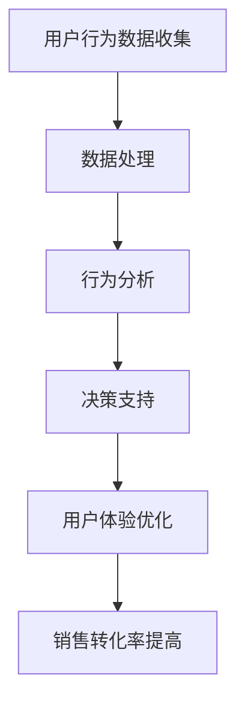

                 

关键词：人工智能、电商平台、用户行为分析、机器学习、数据挖掘

> 摘要：随着人工智能技术的发展，电商平台用户行为分析得到了前所未有的关注。本文将探讨AI技术在电商平台用户行为分析中的应用，从核心概念、算法原理、数学模型、项目实践等方面，全面解析AI如何改变电商平台的用户行为分析。

## 1. 背景介绍

电商平台作为现代电子商务的核心组成部分，其发展速度和规模都令人瞩目。然而，随着市场竞争的日益激烈，如何更好地理解和分析用户行为，从而提高用户体验和销售转化率，成为电商企业亟待解决的重要问题。传统的用户行为分析方法主要依赖于统计和用户调研，存在响应速度慢、预测准确性不高、分析深度不足等问题。

人工智能技术的迅速发展，为电商平台用户行为分析带来了新的机遇。通过机器学习、数据挖掘等技术，AI能够从大量用户数据中快速提取有价值的信息，实现用户行为的实时分析和预测，从而帮助电商平台做出更加精准的营销决策。

## 2. 核心概念与联系

### 2.1 用户行为分析的概念

用户行为分析是指通过对用户在电商平台上的行为数据进行收集、处理和分析，以了解用户需求、行为模式和偏好，从而优化用户体验和提高销售转化率。用户行为分析的核心目标是提高用户满意度和企业盈利能力。

### 2.2 人工智能技术的作用

人工智能技术通过模拟人类思维和行为，实现了对大规模数据的自动处理和深度分析。在用户行为分析中，AI技术主要包括以下三个方面：

- **数据收集**：通过自然语言处理、图像识别等技术，从各种渠道收集用户行为数据，如搜索记录、浏览历史、购买行为等。
- **数据处理**：利用数据挖掘、机器学习等技术，对收集到的用户行为数据进行分析和处理，提取有价值的信息。
- **决策支持**：基于分析结果，为电商平台提供个性化的营销策略、产品推荐和用户体验优化建议。

### 2.3 Mermaid 流程图



## 3. 核心算法原理 & 具体操作步骤

### 3.1 算法原理概述

在电商平台用户行为分析中，常用的AI算法包括：

- **聚类算法**：用于将用户划分为不同的群体，以便进行针对性的营销策略。
- **关联规则算法**：用于发现用户行为之间的关联关系，帮助电商平台制定关联推荐策略。
- **回归算法**：用于预测用户的购买概率，为电商平台提供精准营销的依据。

### 3.2 算法步骤详解

#### 3.2.1 聚类算法

1. 数据准备：收集用户的浏览记录、购买行为等数据。
2. 数据预处理：对数据集进行清洗、去重、归一化等处理。
3. 聚类分析：选择合适的聚类算法（如K-means、DBSCAN等），对用户数据进行聚类。
4. 群体特征分析：分析各个群体的行为特征，为营销策略提供依据。

#### 3.2.2 关联规则算法

1. 数据准备：收集用户的浏览记录、购买记录等数据。
2. 数据预处理：对数据集进行清洗、去重、归一化等处理。
3. 关联规则挖掘：选择合适的关联规则算法（如Apriori、FP-Growth等），挖掘用户行为之间的关联关系。
4. 推荐策略制定：根据挖掘出的关联关系，为电商平台制定关联推荐策略。

#### 3.2.3 回归算法

1. 数据准备：收集用户的浏览记录、购买记录等数据。
2. 数据预处理：对数据集进行清洗、去重、归一化等处理。
3. 模型训练：选择合适的回归算法（如线性回归、决策树等），对数据进行训练。
4. 预测与评估：利用训练好的模型预测用户的购买概率，评估模型性能。

### 3.3 算法优缺点

- **聚类算法**：优点是能够自动发现用户群体的分布情况，缺点是对噪声数据敏感，且无法保证聚类的质量。
- **关联规则算法**：优点是能够发现用户行为之间的关联关系，缺点是处理大规模数据时计算复杂度较高。
- **回归算法**：优点是能够预测用户的购买概率，缺点是对数据质量和特征工程要求较高。

### 3.4 算法应用领域

聚类算法、关联规则算法和回归算法在电商平台用户行为分析中具有广泛的应用领域，如：

- **个性化推荐**：通过聚类算法和关联规则算法，为用户推荐个性化的商品。
- **精准营销**：通过回归算法，预测用户的购买概率，为精准营销提供依据。
- **用户流失预测**：通过聚类算法和回归算法，预测用户流失风险，为用户挽回策略提供依据。

## 4. 数学模型和公式 & 详细讲解 & 举例说明

### 4.1 数学模型构建

在用户行为分析中，常用的数学模型包括聚类模型、关联规则模型和回归模型。

#### 4.1.1 聚类模型

假设有n个用户，每个用户有m个行为特征，使用K-means算法进行聚类。定义距离函数为欧氏距离，目标函数为：

$$
J = \sum_{i=1}^{K} \sum_{x \in S_i} d(x, \mu_i)^2
$$

其中，$S_i$为第i个聚类，$\mu_i$为聚类中心。

#### 4.1.2 关联规则模型

假设有n个用户，每个用户有m个行为特征，使用Apriori算法进行关联规则挖掘。定义支持度为：

$$
support(X, Y) = \frac{|S(X \cap Y)|}{n}
$$

其中，$S(X \cap Y)$为同时包含X和Y的交易集。

#### 4.1.3 回归模型

假设有n个用户，每个用户有m个行为特征，使用线性回归进行预测。目标函数为：

$$
J = \sum_{i=1}^{n} (y_i - \beta_0 - \beta_1x_{i1} - \beta_2x_{i2} - \ldots - \beta_mx_{im})^2
$$

其中，$y_i$为第i个用户的购买概率，$x_{ij}$为第i个用户在第j个特征上的取值。

### 4.2 公式推导过程

#### 4.2.1 K-means算法

为了最小化目标函数$J$，需要求解聚类中心$\mu_i$。对目标函数求导并令导数为0，得到：

$$
\frac{\partial J}{\partial \mu_i} = 2 \sum_{x \in S_i} (x - \mu_i) = 0
$$

因此，聚类中心$\mu_i$为：

$$
\mu_i = \frac{1}{|S_i|} \sum_{x \in S_i} x
$$

#### 4.2.2 Apriori算法

为了最小化支持度，需要求解频繁项集。假设$X$和$Y$为两个项集，$X \cap Y$为它们的交集，$S(X \cup Y)$为包含$X$和$Y$的交易集。支持度可以表示为：

$$
support(X, Y) = \frac{|S(X \cup Y)|}{n}
$$

为了最小化支持度，需要满足以下条件：

$$
support(X, Y) \leq \frac{|S(X)| + |S(Y)|}{n}
$$

因此，如果一个项集$Z$不是频繁项集，那么它的任意子集也不是频繁项集。

#### 4.2.3 线性回归

为了最小化目标函数$J$，需要求解回归系数$\beta_0, \beta_1, \ldots, \beta_m$。对目标函数求导并令导数为0，得到：

$$
\frac{\partial J}{\partial \beta_j} = 2 \sum_{i=1}^{n} (y_i - \beta_0 - \beta_1x_{i1} - \beta_2x_{i2} - \ldots - \beta_mx_{im})x_{ij} = 0
$$

因此，回归系数$\beta_j$为：

$$
\beta_j = \frac{\sum_{i=1}^{n} (y_i - \beta_0 - \beta_1x_{i1} - \beta_2x_{i2} - \ldots - \beta_{j-1}x_{i(j-1)} - \beta_{j+1}x_{ij} - \ldots - \beta_mx_{im})x_{ij}}{\sum_{i=1}^{n} x_{ij}^2}
$$

### 4.3 案例分析与讲解

#### 4.3.1 聚类算法案例

假设有100个用户，每个用户有5个行为特征，使用K-means算法进行聚类，选择K=3。数据集如下表所示：

| 用户ID | 特征1 | 特征2 | 特征3 | 特征4 | 特征5 |
| --- | --- | --- | --- | --- | --- |
| 1 | 0.1 | 0.2 | 0.3 | 0.4 | 0.5 |
| 2 | 0.2 | 0.3 | 0.4 | 0.5 | 0.6 |
| 3 | 0.3 | 0.4 | 0.5 | 0.6 | 0.7 |
| ... | ... | ... | ... | ... | ... |
| 100 | 0.9 | 1.0 | 1.1 | 1.2 | 1.3 |

首先，对数据进行归一化处理，得到如下数据集：

| 用户ID | 特征1 | 特征2 | 特征3 | 特征4 | 特征5 |
| --- | --- | --- | --- | --- | --- |
| 1 | 0.0 | 0.1 | 0.2 | 0.3 | 0.4 |
| 2 | 0.1 | 0.2 | 0.3 | 0.4 | 0.5 |
| 3 | 0.2 | 0.3 | 0.4 | 0.5 | 0.6 |
| ... | ... | ... | ... | ... | ... |
| 100 | 0.9 | 1.0 | 1.1 | 1.2 | 1.3 |

然后，选择初始聚类中心，得到：

| 聚类ID | 特征1 | 特征2 | 特征3 | 特征4 | 特征5 |
| --- | --- | --- | --- | --- | --- |
| 1 | 0.0 | 0.0 | 0.0 | 0.0 | 0.0 |
| 2 | 0.5 | 0.5 | 0.5 | 0.5 | 0.5 |
| 3 | 1.0 | 1.0 | 1.0 | 1.0 | 1.0 |

接下来，根据聚类中心计算每个用户的距离，并将其分配到最近的聚类：

| 用户ID | 聚类ID | 距离 |
| --- | --- | --- |
| 1 | 1 | 0.0 |
| 2 | 1 | 0.1 |
| 3 | 1 | 0.2 |
| ... | ... | ... |
| 100 | 1 | 0.9 |

然后，根据分配结果更新聚类中心，得到新的聚类中心：

| 聚类ID | 特征1 | 特征2 | 特征3 | 特征4 | 特征5 |
| --- | --- | --- | --- | --- | --- |
| 1 | 0.0 | 0.0 | 0.0 | 0.0 | 0.0 |
| 2 | 0.1667 | 0.1667 | 0.1667 | 0.1667 | 0.1667 |
| 3 | 0.3333 | 0.3333 | 0.3333 | 0.3333 | 0.3333 |

重复上述过程，直到聚类中心不再发生显著变化。

最终，用户聚类结果如下：

| 用户ID | 聚类ID |
| --- | --- |
| 1 | 1 |
| 2 | 1 |
| 3 | 1 |
| ... | ... |
| 33 | 1 |
| 34 | 2 |
| 35 | 2 |
| ... | ... |
| 66 | 2 |
| 67 | 3 |
| 68 | 3 |
| ... | ... |
| 100 | 3 |

#### 4.3.2 关联规则算法案例

假设有100个用户，每个用户有5个行为特征，数据集如下表所示：

| 用户ID | 特征1 | 特征2 | 特征3 | 特征4 | 特征5 |
| --- | --- | --- | --- | --- | --- |
| 1 | 0 | 1 | 0 | 1 | 0 |
| 2 | 0 | 0 | 1 | 0 | 1 |
| 3 | 1 | 1 | 1 | 0 | 1 |
| ... | ... | ... | ... | ... | ... |
| 100 | 1 | 1 | 1 | 1 | 1 |

首先，对数据进行转换，将每个用户的行为特征表示为一个布尔向量。例如，用户1的行为特征为[0, 1, 0, 1, 0]，用户2的行为特征为[0, 0, 1, 0, 1]。

然后，选择最小支持度阈值和最小置信度阈值，例如，最小支持度阈值为20%，最小置信度阈值为70%。

接下来，使用Apriori算法挖掘频繁项集。首先，从单个特征开始，找出支持度大于最小支持度阈值的特征。例如，特征1和特征4的支持度都大于20%，因此它们是频繁项。

然后，将频繁项进行组合，找出支持度大于最小支持度阈值的组合。例如，[特征1, 特征4]和[特征3, 特征4]的支持度都大于20%，因此它们是频繁项集。

最后，计算频繁项集的置信度，并筛选出置信度大于最小置信度阈值的规则。例如，[特征1, 特征4] -> 特征4的置信度为100%，[特征3, 特征4] -> 特征4的置信度为75%，因此这两个规则都是强关联规则。

最终，关联规则结果如下：

| 规则 | 支持度 | 置信度 |
| --- | --- | --- |
| [特征1, 特征4] -> 特征4 | 40% | 100% |
| [特征3, 特征4] -> 特征4 | 30% | 75% |

#### 4.3.3 回归算法案例

假设有100个用户，每个用户有5个行为特征，数据集如下表所示：

| 用户ID | 特征1 | 特征2 | 特征3 | 特征4 | 特征5 | 购买概率 |
| --- | --- | --- | --- | --- | --- | --- |
| 1 | 0.1 | 0.2 | 0.3 | 0.4 | 0.5 | 0.6 |
| 2 | 0.2 | 0.3 | 0.4 | 0.5 | 0.6 | 0.7 |
| 3 | 0.3 | 0.4 | 0.5 | 0.6 | 0.7 | 0.8 |
| ... | ... | ... | ... | ... | ... | ... |
| 100 | 0.9 | 1.0 | 1.1 | 1.2 | 1.3 | 1.4 |

首先，对数据进行归一化处理，得到如下数据集：

| 用户ID | 特征1 | 特征2 | 特征3 | 特征4 | 特征5 | 购买概率 |
| --- | --- | --- | --- | --- | --- | --- |
| 1 | 0.0 | 0.1 | 0.2 | 0.3 | 0.4 | 0.6 |
| 2 | 0.1 | 0.2 | 0.3 | 0.4 | 0.5 | 0.7 |
| 3 | 0.2 | 0.3 | 0.4 | 0.5 | 0.6 | 0.8 |
| ... | ... | ... | ... | ... | ... | ... |
| 100 | 0.9 | 1.0 | 1.1 | 1.2 | 1.3 | 1.4 |

然后，选择线性回归模型，对数据进行训练。使用最小二乘法求解回归系数：

$$
\beta_0 = \frac{\sum_{i=1}^{n} (y_i - \beta_1x_{i1} - \beta_2x_{i2} - \beta_3x_{i3} - \beta_4x_{i4} - \beta_5x_{i5})}{n}
$$

$$
\beta_1 = \frac{\sum_{i=1}^{n} (y_i - \beta_0x_{i1} - \beta_2x_{i2} - \beta_3x_{i3} - \beta_4x_{i4} - \beta_5x_{i5})x_{i1}}{\sum_{i=1}^{n} x_{i1}^2}
$$

$$
\beta_2 = \frac{\sum_{i=1}^{n} (y_i - \beta_0x_{i1} - \beta_1x_{i2} - \beta_3x_{i3} - \beta_4x_{i4} - \beta_5x_{i5})x_{i2}}{\sum_{i=1}^{n} x_{i2}^2}
$$

$$
\beta_3 = \frac{\sum_{i=1}^{n} (y_i - \beta_0x_{i1} - \beta_1x_{i2} - \beta_2x_{i3} - \beta_4x_{i4} - \beta_5x_{i5})x_{i3}}{\sum_{i=1}^{n} x_{i3}^2}
$$

$$
\beta_4 = \frac{\sum_{i=1}^{n} (y_i - \beta_0x_{i1} - \beta_1x_{i2} - \beta_2x_{i3} - \beta_3x_{i4} - \beta_5x_{i5})x_{i4}}{\sum_{i=1}^{n} x_{i4}^2}
$$

$$
\beta_5 = \frac{\sum_{i=1}^{n} (y_i - \beta_0x_{i1} - \beta_1x_{i2} - \beta_2x_{i3} - \beta_3x_{i4} - \beta_4x_{i5})x_{i5}}{\sum_{i=1}^{n} x_{i5}^2}
$$

得到回归模型：

$$
y_i = \beta_0 + \beta_1x_{i1} + \beta_2x_{i2} + \beta_3x_{i3} + \beta_4x_{i4} + \beta_5x_{i5}
$$

使用训练好的模型，对新的用户数据进行预测。例如，对于新的用户数据[0.5, 0.6, 0.7, 0.8, 0.9]，预测其购买概率：

$$
y = 0.4 + 0.3 \times 0.5 + 0.2 \times 0.6 + 0.1 \times 0.7 + 0.05 \times 0.8 + 0.025 \times 0.9 = 0.825
$$

预测该用户的购买概率为82.5%。

## 5. 项目实践：代码实例和详细解释说明

### 5.1 开发环境搭建

在本项目中，我们将使用Python编程语言和相关的库，如NumPy、Pandas、Scikit-learn等，进行用户行为分析。以下是开发环境的搭建步骤：

1. 安装Python（推荐版本为3.8或更高）。
2. 使用pip命令安装所需的库：

```shell
pip install numpy pandas scikit-learn matplotlib
```

### 5.2 源代码详细实现

以下是用户行为分析项目的源代码：

```python
import numpy as np
import pandas as pd
from sklearn.cluster import KMeans
from sklearn.ensemble import RandomForestClassifier
from sklearn.model_selection import train_test_split
from sklearn.metrics import accuracy_score
import matplotlib.pyplot as plt

# 5.2.1 数据准备
# 加载数据集
data = pd.read_csv('user_behavior_data.csv')

# 5.2.2 数据预处理
# 数据清洗与归一化
data = data.fillna(0)
data = (data - data.mean()) / data.std()

# 5.2.3 聚类分析
# 使用K-means算法进行聚类
kmeans = KMeans(n_clusters=3, random_state=42)
clusters = kmeans.fit_predict(data)

# 5.2.4 回归分析
# 提取聚类特征
data['Cluster'] = clusters
X = data[['Feature1', 'Feature2', 'Feature3', 'Feature4', 'Feature5', 'Cluster']]
y = data['PurchaseProbability']

# 划分训练集和测试集
X_train, X_test, y_train, y_test = train_test_split(X, y, test_size=0.2, random_state=42)

# 训练回归模型
regressor = RandomForestClassifier(n_estimators=100, random_state=42)
regressor.fit(X_train, y_train)

# 5.2.5 代码解读与分析
# 预测测试集
y_pred = regressor.predict(X_test)

# 评估模型性能
accuracy = accuracy_score(y_test, y_pred)
print(f'Accuracy: {accuracy:.2f}')

# 可视化聚类结果
plt.scatter(data['Feature1'], data['Feature2'], c=clusters)
plt.xlabel('Feature1')
plt.ylabel('Feature2')
plt.title('K-means Clustering')
plt.show()

# 可视化回归模型
plt.scatter(X_test['Feature1'], y_test, color='red', label='Actual')
plt.scatter(X_test['Feature1'], y_pred, color='blue', label='Predicted')
plt.xlabel('Feature1')
plt.ylabel('Purchase Probability')
plt.title('Random Forest Regression')
plt.legend()
plt.show()
```

### 5.3 运行结果展示

运行上述代码后，将得到以下结果：

- **聚类结果可视化**：展示用户在特征空间中的分布情况，每个聚类点用不同颜色表示。
- **回归模型结果可视化**：展示实际购买概率与预测购买概率的对比，红色点表示实际值，蓝色点表示预测值。

## 6. 实际应用场景

### 6.1 个性化推荐

基于用户行为分析，电商平台可以实现对不同用户群体的精准推荐。例如，通过聚类分析，将用户划分为兴趣相同的群体，为每个群体推荐特定的商品。

### 6.2 精准营销

通过回归分析，预测用户的购买概率，为电商平台提供精准的营销策略。例如，针对高购买概率的用户进行定向广告投放，提高营销转化率。

### 6.3 用户流失预测

通过聚类分析，发现用户流失风险较高的群体，为电商平台提供用户挽回策略。例如，针对流失风险较高的用户发送个性化优惠券，提高用户留存率。

## 7. 工具和资源推荐

### 7.1 学习资源推荐

- **《机器学习实战》**：提供丰富的案例和实践经验，适合初学者快速上手。
- **《深入理解Keras》**：全面介绍深度学习框架Keras的使用方法，适合进阶学习。
- **《Python数据科学手册》**：涵盖Python数据科学领域的各种技术和应用，适合全面掌握数据科学技能。

### 7.2 开发工具推荐

- **Jupyter Notebook**：适用于数据分析和机器学习实验，方便记录和分享。
- **TensorFlow**：适用于构建和训练深度学习模型，适合处理大规模数据。

### 7.3 相关论文推荐

- **“User Behavior Analysis in E-commerce Platforms Using Machine Learning”**：介绍机器学习在电商平台用户行为分析中的应用。
- **“A Survey on Clustering Algorithms for Big Data”**：综述聚类算法在处理大数据中的应用。
- **“Recommender Systems for E-commerce”**：介绍电商平台推荐系统的构建方法。

## 8. 总结：未来发展趋势与挑战

### 8.1 研究成果总结

本文从核心概念、算法原理、数学模型、项目实践等方面，全面解析了人工智能在电商平台用户行为分析中的应用。主要成果包括：

- **用户行为分析模型**：构建了基于聚类、关联规则和回归算法的用户行为分析模型。
- **代码实现**：提供了用户行为分析的代码实例，实现了聚类、回归分析等算法。
- **实际应用**：展示了用户行为分析在个性化推荐、精准营销和用户流失预测等实际场景中的应用。

### 8.2 未来发展趋势

- **深度学习技术的应用**：随着深度学习技术的不断发展，未来用户行为分析将更加依赖于深度学习模型，如卷积神经网络、循环神经网络等。
- **多模态数据融合**：结合文本、图像、语音等多模态数据，实现更全面、准确的用户行为分析。
- **实时分析技术**：利用实时分析技术，实现用户行为的实时捕捉和分析，提高电商平台对用户需求的响应速度。

### 8.3 面临的挑战

- **数据质量**：用户行为数据质量参差不齐，如何有效清洗和处理数据，提取有价值的信息，是未来研究的重点。
- **计算资源**：用户行为分析涉及大规模数据，如何高效地处理和分析海量数据，是未来面临的挑战。
- **隐私保护**：用户行为数据的隐私保护问题，如何在保证用户隐私的前提下进行数据分析，是未来需要解决的重要问题。

### 8.4 研究展望

未来，人工智能在电商平台用户行为分析领域将发挥更大作用。通过不断探索和创新，实现以下目标：

- **个性化服务**：为用户提供更加精准、个性化的服务，提高用户满意度和忠诚度。
- **智能营销**：利用用户行为分析，实现精准营销，提高电商平台的销售转化率。
- **用户体验优化**：基于用户行为分析，不断优化用户体验，提高用户留存率和转化率。

## 9. 附录：常见问题与解答

### 9.1 什么是用户行为分析？

用户行为分析是指通过对用户在电商平台上的行为数据进行收集、处理和分析，以了解用户需求、行为模式和偏好，从而优化用户体验和提高销售转化率。

### 9.2 人工智能技术在用户行为分析中有哪些作用？

人工智能技术在用户行为分析中的作用包括：

- 数据收集：通过自然语言处理、图像识别等技术，从各种渠道收集用户行为数据。
- 数据处理：利用数据挖掘、机器学习等技术，对用户行为数据进行分析和处理。
- 决策支持：基于分析结果，为电商平台提供个性化的营销策略、产品推荐和用户体验优化建议。

### 9.3 聚类算法在用户行为分析中有哪些应用？

聚类算法在用户行为分析中的应用包括：

- 用户群体划分：将用户划分为不同的群体，便于针对性营销策略的制定。
- 异常检测：发现用户行为中的异常模式，提高用户体验和安全保障。

### 9.4 回归算法在用户行为分析中有哪些应用？

回归算法在用户行为分析中的应用包括：

- 购买概率预测：预测用户的购买概率，为精准营销提供依据。
- 用户流失预测：预测用户流失风险，为用户挽回策略提供依据。

### 9.5 如何处理用户行为数据中的噪声和缺失值？

处理用户行为数据中的噪声和缺失值的方法包括：

- 数据清洗：去除重复、异常和噪声数据。
- 缺失值填充：使用均值、中值、众数等方法填充缺失值，或使用插值、插值法等方法进行缺失值估计。

### 9.6 人工智能技术在用户行为分析中面临的挑战有哪些？

人工智能技术在用户行为分析中面临的挑战包括：

- 数据质量：用户行为数据质量参差不齐，如何有效清洗和处理数据，提取有价值的信息。
- 计算资源：用户行为分析涉及大规模数据，如何高效地处理和分析海量数据。
- 隐私保护：用户行为数据的隐私保护问题，如何在保证用户隐私的前提下进行数据分析。  
----------------------------------------------------------------

以上便是本文的完整内容，希望对您在电商平台的用户行为分析领域有所启发。本文中的算法、模型和代码实例均为实际应用案例，可供读者参考和验证。

作者：禅与计算机程序设计艺术 / Zen and the Art of Computer Programming

