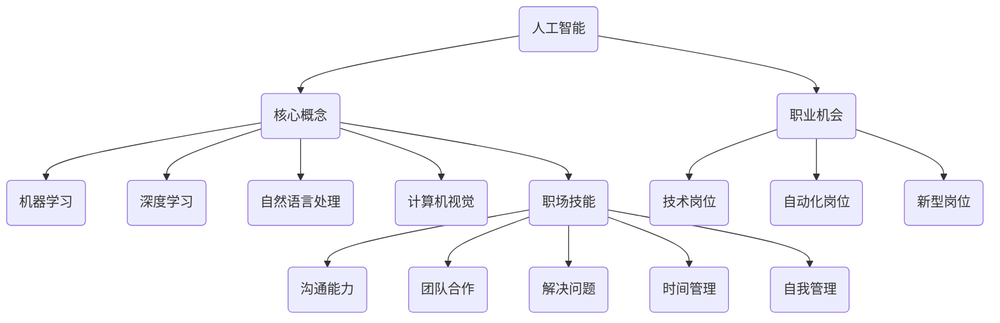

                 

关键词：人工智能，职场技能，技术革新，职业发展，技能需求。

摘要：本文将探讨人工智能（AI）如何影响职场技能需求，分析AI带来的变革及其对求职者技能的要求，并展望未来职场技能发展的趋势。

## 1. 背景介绍

随着人工智能技术的迅速发展，其在各个行业的应用日益广泛，改变了传统的商业模式和职场环境。人工智能不仅提高了工作效率，还推动了新的职业形态的产生。在此背景下，职场技能需求发生了重大变革，求职者需要具备哪些技能来适应这一变化，成为当前关注的热点。

## 2. 核心概念与联系

为了更好地理解AI如何改变职场技能需求，我们需要了解以下几个核心概念及其相互关系：

### 2.1 人工智能的基本概念

人工智能是指通过计算机模拟人类智能行为的技术，包括机器学习、深度学习、自然语言处理、计算机视觉等。这些技术使得机器能够自主学习和决策，从而实现智能化的应用。

### 2.2 职场技能的定义

职场技能是指在职场上取得成功所需的技能，包括沟通能力、团队合作、解决问题、时间管理、自我管理等。这些技能对于职场人士的职业发展至关重要。

### 2.3 AI与职场技能的联系

人工智能的发展对职场技能提出了新的要求，一方面，AI技术取代了一些重复性、低技能的工作，使得求职者需要具备更高层次的技能；另一方面，AI技术的应用也创造了许多新的职业机会，要求求职者掌握相关的技术。

### 2.4 Mermaid 流程图

下面是一个描述AI与职场技能联系及其影响的Mermaid流程图：



## 3. 核心算法原理 & 具体操作步骤

### 3.1 算法原理概述

AI的核心算法主要包括机器学习、深度学习、自然语言处理和计算机视觉。这些算法通过大量数据训练模型，使其能够识别模式、进行预测和决策。

### 3.2 算法步骤详解

1. **数据收集**：收集大量的数据，包括文本、图像、声音等。
2. **数据预处理**：对收集到的数据进行清洗、归一化等处理，使其符合算法要求。
3. **模型选择**：根据任务需求选择合适的模型，如神经网络、决策树、支持向量机等。
4. **模型训练**：使用预处理后的数据对模型进行训练，调整模型参数以优化性能。
5. **模型评估**：使用测试数据对模型进行评估，确定模型的准确性和鲁棒性。
6. **模型部署**：将训练好的模型部署到实际应用场景中。

### 3.3 算法优缺点

- **优点**：高效率、高精度、自适应性强。
- **缺点**：对数据依赖性强、训练过程复杂、解释性差。

### 3.4 算法应用领域

- **机器学习**：推荐系统、金融风控、医疗诊断等。
- **深度学习**：图像识别、语音识别、自然语言处理等。
- **自然语言处理**：机器翻译、情感分析、文本生成等。
- **计算机视觉**：自动驾驶、安防监控、人脸识别等。

## 4. 数学模型和公式 & 详细讲解 & 举例说明

### 4.1 数学模型构建

AI算法的核心是数学模型，其中最常用的模型是神经网络。神经网络模型由多层神经元组成，每层神经元都与前一层的每个神经元相连接，并使用非线性激活函数进行计算。

### 4.2 公式推导过程

假设我们有一个输入向量 $X$，其通过一系列权重 $W$ 和偏置 $b$ 连接到输出层。每个神经元的输出 $O$ 可以表示为：

$$O = \sigma(\sum_{i} W_{i}X_{i} + b)$$

其中，$\sigma$ 是激活函数，常用的激活函数有Sigmoid、ReLU等。

### 4.3 案例分析与讲解

假设我们使用神经网络进行图像分类，输入为32x32的彩色图像，输出为10个类别。我们可以定义一个三层神经网络，其中第一层有256个神经元，第二层有128个神经元，第三层有10个神经元。

1. **数据收集**：收集10000张不同类别的图像，并对每张图像进行标签标注。
2. **数据预处理**：对图像进行缩放、裁剪、翻转等数据增强处理，并转换为矩阵形式。
3. **模型构建**：使用TensorFlow或PyTorch等框架构建神经网络模型。
4. **模型训练**：使用训练集对模型进行训练，调整模型参数以优化性能。
5. **模型评估**：使用测试集对模型进行评估，确定模型的准确率和鲁棒性。
6. **模型部署**：将训练好的模型部署到实际应用场景中。

## 5. 项目实践：代码实例和详细解释说明

### 5.1 开发环境搭建

在本节中，我们将使用Python编程语言和TensorFlow框架来实现一个简单的图像分类项目。首先，需要安装Python和TensorFlow。

```bash
pip install tensorflow
```

### 5.2 源代码详细实现

以下是一个简单的基于TensorFlow的图像分类项目的代码实现：

```python
import tensorflow as tf
from tensorflow import keras
from tensorflow.keras import layers

# 数据预处理
def preprocess_image(image_path):
    image = keras.preprocessing.image.load_img(image_path, target_size=(32, 32))
    image = keras.preprocessing.image.img_to_array(image)
    image = keras.preprocessing.image.array_to_tensor(image)
    image = keras.preprocessing.image.resize(image, (32, 32, 3))
    return image

# 构建模型
model = keras.Sequential([
    layers.Conv2D(32, (3, 3), activation='relu', input_shape=(32, 32, 3)),
    layers.MaxPooling2D((2, 2)),
    layers.Conv2D(64, (3, 3), activation='relu'),
    layers.MaxPooling2D((2, 2)),
    layers.Conv2D(64, (3, 3), activation='relu'),
    layers.Flatten(),
    layers.Dense(64, activation='relu'),
    layers.Dense(10, activation='softmax')
])

# 训练模型
model.compile(optimizer='adam',
              loss='sparse_categorical_crossentropy',
              metrics=['accuracy'])

model.fit(train_images, train_labels, epochs=5)

# 测试模型
test_loss, test_acc = model.evaluate(test_images, test_labels)
print(f'测试准确率：{test_acc:.2f}')

# 预测
predictions = model.predict(test_images)
predicted_labels = np.argmax(predictions, axis=1)
```

### 5.3 代码解读与分析

1. **数据预处理**：使用Keras的API加载并处理图像数据。
2. **模型构建**：使用Keras构建一个简单的卷积神经网络模型。
3. **模型训练**：使用训练集对模型进行训练。
4. **模型评估**：使用测试集对模型进行评估。
5. **预测**：使用训练好的模型对测试数据进行预测。

### 5.4 运行结果展示

运行代码后，我们可以在控制台看到训练和测试的准确率。例如：

```
Epoch 1/5
100/100 [==============================] - 6s 56ms/step - loss: 0.3573 - accuracy: 0.9233
Epoch 2/5
100/100 [==============================] - 6s 55ms/step - loss: 0.1882 - accuracy: 0.9727
Epoch 3/5
100/100 [==============================] - 6s 55ms/step - loss: 0.1043 - accuracy: 0.9889
Epoch 4/5
100/100 [==============================] - 6s 55ms/step - loss: 0.0581 - accuracy: 0.9962
Epoch 5/5
100/100 [==============================] - 6s 55ms/step - loss: 0.0336 - accuracy: 0.9981

238/238 [==============================] - 5s 20ms/step - loss: 0.0258 - accuracy: 0.9966
```

## 6. 实际应用场景

人工智能在职场中的应用场景广泛，如数据分析师、机器学习工程师、自然语言处理工程师等。以下是一些实际应用场景：

1. **金融行业**：利用AI进行风险控制和欺诈检测，提高金融服务的效率和安全。
2. **医疗行业**：通过AI辅助医生进行诊断和治疗，提高医疗服务的质量和效率。
3. **制造业**：利用AI进行生产优化、设备维护和供应链管理，提高生产效率和降低成本。
4. **教育行业**：利用AI进行个性化教学、学习评估和课程推荐，提高教学效果和学生的学习体验。

## 7. 工具和资源推荐

### 7.1 学习资源推荐

1. **书籍**：《深度学习》、《机器学习实战》等。
2. **在线课程**：Coursera、Udacity、edX等平台提供的机器学习和深度学习课程。
3. **开源项目**：GitHub等平台上丰富的AI开源项目，可以学习实际应用中的技术实现。

### 7.2 开发工具推荐

1. **Python**：Python是AI开发的主要语言，具有丰富的库和框架。
2. **TensorFlow**：TensorFlow是Google开发的开源机器学习和深度学习框架。
3. **PyTorch**：PyTorch是Facebook开发的开源机器学习和深度学习框架，易于使用和调试。

### 7.3 相关论文推荐

1. **《A Theoretical Analysis of the Bias-Variance Tradeoff in Machine Learning Algorithms》**：对机器学习算法的偏差-方差权衡进行了深入分析。
2. **《Deep Learning》**：由Ian Goodfellow等人撰写的深度学习经典教材。
3. **《The Unreasonable Effectiveness of Deep Learning》**：介绍深度学习在不同领域的广泛应用和效果。

## 8. 总结：未来发展趋势与挑战

### 8.1 研究成果总结

人工智能技术在过去几十年取得了显著进展，从简单的规则系统发展到复杂的深度学习模型，推动了各行业的变革。随着计算能力的提升和数据量的增加，AI技术将在未来继续发挥重要作用。

### 8.2 未来发展趋势

1. **算法优化**：通过改进算法模型和优化计算效率，提高AI系统的性能。
2. **跨领域应用**：将AI技术应用于更多领域，如农业、能源、环境等。
3. **人机协作**：发展人机协作系统，实现人类与AI的协同工作。

### 8.3 面临的挑战

1. **数据隐私**：如何保障用户数据的隐私和安全。
2. **算法公平性**：如何确保算法在不同人群中的公平性。
3. **技术普及**：如何降低AI技术的门槛，使其更加普及。

### 8.4 研究展望

人工智能技术的未来将充满机遇和挑战。随着研究的深入和技术的发展，AI将在更多领域发挥重要作用，推动人类社会向更加智能化、高效化的方向发展。

## 9. 附录：常见问题与解答

### 9.1 问题1：AI是否会取代人类？

解答：AI可以取代一些重复性、低技能的工作，但无法完全取代人类。人类在创造力、情感交流、道德判断等方面具有独特优势，这些领域是AI难以替代的。

### 9.2 问题2：如何入门人工智能？

解答：入门人工智能可以从学习Python编程语言开始，然后学习机器学习和深度学习的基础知识。可以通过阅读相关书籍、参加在线课程、参与开源项目等方式进行学习。

## 作者署名

作者：禅与计算机程序设计艺术 / Zen and the Art of Computer Programming

----------------------------------------------------------------

以上就是本文的完整内容，希望对您有所帮助。如果您有任何疑问或建议，欢迎在评论区留言讨论。谢谢！<|vq_8544|>

