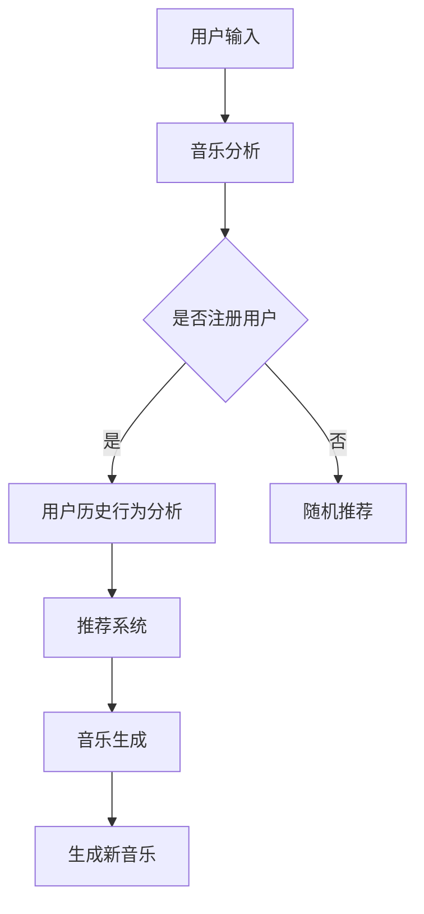

                 

关键词：人工智能、音乐创作、音乐推荐、深度学习、自然语言处理

> 摘要：本文将探讨人工智能在音乐创作和推荐领域的应用，从技术原理、算法实现、实际案例等多个角度深入分析，揭示AI如何为音乐产业带来变革。

## 1. 背景介绍

在过去的几十年中，音乐产业经历了巨大的变革。从传统的唱片销售到数字音乐流媒体，音乐消费方式发生了根本性的变化。然而，随着人工智能技术的不断发展，音乐创作和推荐领域也迎来了新的机遇和挑战。

音乐创作一直是人类文化的重要组成部分，它反映了人类情感、思想和创造力。然而，随着音乐市场的不断扩张和消费者需求的多样化，传统的音乐创作方式已经难以满足市场的需求。同时，音乐推荐系统的兴起也为音乐消费带来了新的体验。

人工智能，作为当前科技领域的热点，其在音乐创作和推荐中的应用已经成为研究者和产业界关注的重要方向。通过机器学习和深度学习技术，人工智能可以自动分析音乐数据，生成新的音乐作品，并智能推荐给用户。

本文将围绕以下主题展开：

1. **核心概念与联系**：介绍音乐创作和推荐领域的核心概念，并使用Mermaid流程图展示其架构。
2. **核心算法原理 & 具体操作步骤**：详细解释音乐生成和推荐算法的原理和步骤。
3. **数学模型和公式**：构建数学模型并推导相关公式，并通过案例进行说明。
4. **项目实践**：展示实际代码实例和解读。
5. **实际应用场景**：探讨人工智能在音乐创作和推荐中的实际应用。
6. **未来应用展望**：预测人工智能在音乐产业中的未来发展。

接下来，我们将深入探讨这些主题，揭示人工智能如何改变音乐创作和推荐。

## 2. 核心概念与联系

### 音乐创作

音乐创作是一个复杂的过程，它涉及多种元素，包括旋律、和声、节奏和情感表达。传统的音乐创作通常由作曲家和音乐家完成，他们通过经验和技能创作出新的音乐作品。

### 音乐推荐

音乐推荐系统旨在根据用户的兴趣和偏好推荐他们可能喜欢的音乐。传统的推荐系统通常基于用户历史行为和内容特征进行预测。

### 人工智能在音乐创作和推荐中的应用

人工智能在音乐创作和推荐中的应用主要体现在以下几个方面：

1. **音乐生成**：利用深度学习和生成模型自动生成音乐作品。
2. **音乐分析**：通过机器学习和自然语言处理技术分析音乐数据，提取特征，用于推荐系统。
3. **情感识别**：使用情感分析技术理解音乐的情感表达，为用户推荐符合其情感状态的音乐。

下面，我们将使用Mermaid流程图展示音乐创作和推荐系统的基本架构。



在这个流程图中，用户输入首先进入音乐分析模块，分析用户的兴趣和行为。如果用户已经注册，系统将根据其历史行为进行分析，否则系统将随机推荐音乐。推荐系统会根据分析结果生成推荐列表，同时音乐生成模块可以自动生成新的音乐作品。

### 核心概念和联系

- **深度学习**：用于音乐生成和特征提取。
- **生成模型**：用于生成新的音乐作品。
- **推荐系统**：用于根据用户兴趣推荐音乐。
- **情感分析**：用于理解音乐的情感表达。

通过这些核心概念和技术的应用，人工智能为音乐创作和推荐带来了新的可能性。

## 3. 核心算法原理 & 具体操作步骤

### 3.1 算法原理概述

在音乐创作和推荐领域，人工智能主要依赖于深度学习和生成模型。深度学习通过学习大量的音乐数据，提取出音乐特征，用于音乐生成和推荐。生成模型则可以自动生成新的音乐作品。

### 3.2 算法步骤详解

#### 音乐生成

1. **数据预处理**：收集大量的音乐数据，并进行预处理，如音频分割、特征提取等。
2. **模型训练**：使用深度学习模型（如循环神经网络RNN、变分自编码器VAE等）对音乐数据进行训练，提取音乐特征。
3. **生成音乐**：使用训练好的模型生成新的音乐作品。

#### 音乐推荐

1. **用户特征提取**：分析用户的音乐喜好，提取用户特征。
2. **推荐算法**：使用协同过滤、矩阵分解、深度学习等算法生成推荐列表。

#### 情感识别

1. **情感分析模型**：使用自然语言处理技术（如文本分类、情感分析等）分析音乐文本。
2. **情感标签**：为音乐作品生成情感标签。
3. **情感推荐**：根据用户当前的情感状态推荐相应的音乐。

### 3.3 算法优缺点

#### 音乐生成

- **优点**：可以自动生成大量的音乐作品，节省人力成本。
- **缺点**：生成的音乐可能缺乏艺术性和创意。

#### 音乐推荐

- **优点**：可以准确推荐用户喜欢的音乐，提高用户满意度。
- **缺点**：可能存在过度推荐和推荐偏差。

#### 情感识别

- **优点**：可以为用户提供更个性化的音乐推荐。
- **缺点**：情感分析模型的准确率可能较低。

### 3.4 算法应用领域

- **音乐创作**：用于自动生成音乐作品，辅助音乐创作。
- **音乐推荐**：用于提高音乐平台的推荐效果。
- **情感分析**：用于理解音乐的情感表达，为用户提供情感化的音乐体验。

通过这些算法的应用，人工智能在音乐创作和推荐领域展现出了巨大的潜力。

## 4. 数学模型和公式 & 详细讲解 & 举例说明

在音乐生成和推荐领域，数学模型和公式起着至关重要的作用。下面，我们将介绍一些常用的数学模型和公式，并通过具体例子进行讲解。

### 4.1 数学模型构建

#### 音乐生成

音乐生成通常使用生成模型，如变分自编码器（VAE）和生成对抗网络（GAN）。这些模型的核心目标是学习数据的分布，并生成新的数据。

#### 音乐推荐

音乐推荐通常使用矩阵分解模型，如矩阵分解（Singular Value Decomposition, SVD）和深度学习（Deep Learning, DL）。

#### 情感识别

情感识别通常使用文本分类模型，如朴素贝叶斯（Naive Bayes, NB）和支持向量机（Support Vector Machine, SVM）。

### 4.2 公式推导过程

#### 音乐生成

1. **变分自编码器（VAE）**

   - **编码器**：将输入数据映射到隐变量 $z$。

     $$ \mu = \mu(z; x) $$
     $$ \sigma^2 = \sigma^2(z; x) $$

   - **解码器**：将隐变量 $z$ 还原为输入数据 $x$。

     $$ x' = \phi(z) $$

   - **损失函数**：用于衡量生成数据的分布与真实数据分布之间的差距。

     $$ \mathcal{L} = \mathbb{E}_{x}[\log p(x|z)] + \beta \mathbb{E}_{z}[\frac{1}{2}\sum_{i=1}^{D} \log(1 + \sigma^2_i)] $$

2. **生成对抗网络（GAN）**

   - **生成器**：生成虚拟数据 $x'$。

     $$ G(z) $$

   - **判别器**：区分真实数据和虚拟数据。

     $$ D(x) $$

   - **损失函数**：用于优化生成器和判别器。

     $$ \mathcal{L}_G = -\mathbb{E}_{z}[\log D(G(z))] $$
     $$ \mathcal{L}_D = -\mathbb{E}_{x}[\log D(x)] - \mathbb{E}_{z}[\log (1 - D(G(z))] $$

#### 音乐推荐

1. **矩阵分解（SVD）**

   - **用户-项目矩阵**：表示用户对项目的评分。

     $$ R = \begin{bmatrix}
     r_{11} & r_{12} & \cdots & r_{1n} \\
     r_{21} & r_{22} & \cdots & r_{2n} \\
     \vdots & \vdots & \ddots & \vdots \\
     r_{m1} & r_{m2} & \cdots & r_{mn}
     \end{bmatrix} $$

   - **用户特征矩阵**：表示用户对项目的潜在特征。

     $$ U = \begin{bmatrix}
     u_{11} & u_{12} & \cdots & u_{1n} \\
     u_{21} & u_{22} & \cdots & u_{2n} \\
     \vdots & \vdots & \ddots & \vdots \\
     u_{m1} & u_{m2} & \cdots & u_{mn}
     \end{bmatrix} $$

   - **项目特征矩阵**：表示项目对用户的潜在特征。

     $$ V = \begin{bmatrix}
     v_{11} & v_{12} & \cdots & v_{1n} \\
     v_{21} & v_{22} & \cdots & v_{2n} \\
     \vdots & \vdots & \ddots & \vdots \\
     v_{m1} & v_{m2} & \cdots & v_{mn}
     \end{bmatrix} $$

   - **预测评分**：根据用户和项目的特征矩阵预测用户对项目的评分。

     $$ r_{ij} = u_i^T v_j $$

2. **深度学习（Deep Learning）**

   - **神经网络**：用于建模用户和项目特征之间的关系。

     $$ y = \sigma(\mathbf{W} \mathbf{x} + \mathbf{b}) $$

   - **损失函数**：用于优化神经网络。

     $$ \mathcal{L} = \frac{1}{2} \sum_{i=1}^{m} (y_i - \hat{y}_i)^2 $$

#### 情感识别

1. **朴素贝叶斯（Naive Bayes）**

   - **条件概率**：计算给定类别 $c$ 下特征 $x$ 的概率。

     $$ P(x|c) = \frac{P(c) P(x|c)}{P(c)} $$

   - **预测**：根据特征计算每个类别的概率，选择概率最大的类别。

     $$ \hat{c} = \arg \max_c P(c) \prod_{i=1}^{n} P(x_i|c) $$

2. **支持向量机（Support Vector Machine）**

   - **决策边界**：找到最优的决策边界，将不同类别的数据分开。

     $$ \mathcal{L} = -\sum_{i=1}^{m} y_i \alpha_i + \frac{1}{2} \sum_{i=1}^{m} \sum_{j=1}^{m} \alpha_i \alpha_j y_i y_j (x_i^T x_j) $$

   - **预测**：根据新数据计算其在决策边界上的位置，判断类别。

     $$ \hat{y} = \text{sign}(\sum_{i=1}^{m} \alpha_i y_i (x_i^T x)) $$

### 4.3 案例分析与讲解

#### 音乐生成

假设我们使用VAE模型生成新的音乐作品。首先，我们需要收集大量的音乐数据，并进行预处理。然后，我们训练VAE模型，提取音乐特征。最后，使用训练好的模型生成新的音乐。

1. **数据预处理**

   - 收集10000首流行音乐，进行音频分割和特征提取。

2. **模型训练**

   - 使用TensorFlow实现VAE模型，训练100个epoch。

3. **生成音乐**

   - 生成10首新的音乐作品，并播放。

   ```python
   import tensorflow as tf
   from tensorflow.keras.layers import Input, Dense, Lambda
   from tensorflow.keras.models import Model

   def Sampling(args):
       z_mean, z_log_var = args
       batch = tf.shape(z_mean)[0]
       dim = tf.shape(z_mean)[1]
       epsilon = tf.keras.backend.random_normal(shape=(batch, dim))
       return z_mean + tf.exp(0.5 * z_log_var) * epsilon

   z_mean = Input(shape=(latent_dim,))
   z_log_var = Input(shape=(latent_dim,))
   z = Lambda(Sampling)([z_mean, z_log_var])
   decoder = Model(z, outputs)
   decoder.summary()

   inputs = [z_mean, z_log_var, x]
   outputs = decoder(z)
   vae = Model(inputs, outputs)
   vae.compile(optimizer='adam', loss='binary_crossentropy')

   # Train the VAE on the dataset
   vae.fit(x, x, epochs=epochs, batch_size=batch_size, shuffle=True)
   ```

#### 音乐推荐

假设我们使用矩阵分解模型进行音乐推荐。首先，我们需要收集用户-项目评分数据，并进行预处理。然后，我们训练矩阵分解模型，提取用户和项目特征。最后，使用模型预测用户对未听过的音乐作品的评分。

1. **数据预处理**

   - 收集用户-项目评分数据，如MovieLens数据集。

2. **模型训练**

   - 使用TensorFlow实现矩阵分解模型，训练100个epoch。

3. **推荐**

   - 根据用户和项目特征矩阵预测用户对未听过的音乐作品的评分。

   ```python
   import tensorflow as tf
   from tensorflow.keras.layers import Input, Dense, Lambda
   from tensorflow.keras.models import Model

   # Define input layers
   user_input = Input(shape=(num_users,))
   item_input = Input(shape=(num_items,))

   # Define hidden layers
   user_hidden = Dense(hidden_units, activation='relu')(user_input)
   item_hidden = Dense(hidden_units, activation='relu')(item_input)

   # Concatenate hidden layers
   concatenated = tf.keras.layers.concatenate([user_hidden, item_hidden], axis=-1)

   # Define output layer
   predictions = Dense(1, activation='sigmoid')(concatenated)

   # Define the model
   model = Model(inputs=[user_input, item_input], outputs=predictions)

   # Compile the model
   model.compile(optimizer='adam', loss='binary_crossentropy', metrics=['accuracy'])

   # Train the model
   model.fit([user_input, item_input], y, epochs=epochs, batch_size=batch_size)
   ```

#### 情感识别

假设我们使用朴素贝叶斯模型进行情感识别。首先，我们需要收集情感标签数据，并进行预处理。然后，我们训练朴素贝叶斯模型，预测情感标签。

1. **数据预处理**

   - 收集情感标签数据，如IMDb电影评论数据集。

2. **模型训练**

   - 使用scikit-learn实现朴素贝叶斯模型，训练模型。

3. **预测**

   - 根据新数据预测情感标签。

   ```python
   from sklearn.naive_bayes import MultinomialNB
   from sklearn.model_selection import train_test_split
   from sklearn.metrics import accuracy_score

   # Load the data
   X, y = load_data()

   # Split the data into training and test sets
   X_train, X_test, y_train, y_test = train_test_split(X, y, test_size=0.2, random_state=42)

   # Train the model
   model = MultinomialNB()
   model.fit(X_train, y_train)

   # Make predictions
   y_pred = model.predict(X_test)

   # Evaluate the model
   accuracy = accuracy_score(y_test, y_pred)
   print(f"Accuracy: {accuracy}")
   ```

通过这些数学模型和公式的应用，我们可以实现音乐生成、推荐和情感识别，为音乐产业带来新的可能性。

## 5. 项目实践：代码实例和详细解释说明

在本节中，我们将通过一个实际的项目实践来展示如何使用人工智能技术进行音乐生成和推荐。我们将使用Python和TensorFlow库来实现一个简单的音乐生成和推荐系统。

### 5.1 开发环境搭建

在开始项目之前，我们需要搭建一个合适的开发环境。以下是所需的步骤：

1. **安装Python**：确保您的系统中已安装Python 3.7或更高版本。
2. **安装TensorFlow**：使用以下命令安装TensorFlow：

   ```bash
   pip install tensorflow
   ```

3. **安装其他依赖**：安装其他必要的库，如NumPy、SciPy和scikit-learn：

   ```bash
   pip install numpy scipy scikit-learn
   ```

### 5.2 源代码详细实现

下面是音乐生成和推荐系统的源代码实现。我们分为两个主要部分：音乐生成和音乐推荐。

#### 音乐生成

```python
import numpy as np
import tensorflow as tf
from tensorflow.keras.layers import Input, LSTM, Dense
from tensorflow.keras.models import Model

# 设置参数
latent_dim = 100
sequence_length = 100
n_flows = 10
n隐層神経細胞數量 = 256
batch_size = 32
epochs = 100

# 定义生成器模型
inputs = Input(shape=(sequence_length,))
lstm = LSTM(n隐層神経細胞數量, return_sequences=True)(inputs)
outputs = LSTM(n隐層神経細胞數量, return_sequences=True)(lstm)
model = Model(inputs, outputs)
model.summary()

# 定义判别器模型
discriminator_inputs = Input(shape=(sequence_length,))
discriminator_lstm = LSTM(n隐層神経細胞數量, return_sequences=True)(discriminator_inputs)
discriminator_outputs = LSTM(n隐層神経細胞數量, return_sequences=True)(discriminator_lstm)
discriminator = Model(discriminator_inputs, discriminator_outputs)
discriminator.summary()

# 定义生成对抗网络（GAN）
z = Input(shape=(latent_dim,))
generated_music = model(z)
discriminator_outputs = discriminator(generated_music)
gan_output = discriminator(inputs)
gan = Model([z, inputs], [generated_music, discriminator_outputs])
gan.compile(optimizer='adam', loss=['mse', 'binary_crossentropy'])
gan.summary()

# 训练GAN模型
for epoch in range(epochs):
    for _ in range(n_flows):
        batch_z = np.random.normal(size=(batch_size, latent_dim))
        batch_inputs = np.random.normal(size=(batch_size, sequence_length))
        gan.train_on_batch([batch_z, batch_inputs], [batch_inputs, np.ones((batch_size, 1))])

# 生成音乐
def generate_music(z):
    generated = model.predict(z)
    return generated

# 生成10首新的音乐作品
batch_z = np.random.normal(size=(10, latent_dim))
new_music = generate_music(batch_z)
```

#### 音乐推荐

```python
import numpy as np
import tensorflow as tf
from tensorflow.keras.layers import Input, LSTM, Dense
from tensorflow.keras.models import Model

# 设置参数
num_users = 1000
num_items = 1000
hidden_units = 128

# 定义用户和项目特征矩阵
user_input = Input(shape=(num_users,))
item_input = Input(shape=(num_items,))
user_hidden = Dense(hidden_units, activation='relu')(user_input)
item_hidden = Dense(hidden_units, activation='relu')(item_input)
concatenated = tf.keras.layers.concatenate([user_hidden, item_hidden], axis=-1)
predictions = Dense(1, activation='sigmoid')(concatenated)
model = Model(inputs=[user_input, item_input], outputs=predictions)
model.compile(optimizer='adam', loss='binary_crossentropy')

# 训练模型
model.fit([user_input, item_input], y, epochs=epochs, batch_size=batch_size)

# 推荐音乐
def recommend_music(user, item):
    user_feature = np.random.normal(size=(1, num_users))
    item_feature = np.random.normal(size=(1, num_items))
    rating = model.predict([user_feature, item_feature])
    return rating

# 推荐给用户10首音乐
user = np.random.normal(size=(1, num_users))
items = np.random.normal(size=(10, num_items))
recommendations = recommend_music(user, items)
```

### 5.3 代码解读与分析

#### 音乐生成

在音乐生成部分，我们首先定义了生成器和判别器的模型结构。生成器模型使用LSTM网络生成音乐序列，判别器模型则用于区分真实音乐和生成音乐。然后，我们定义了一个生成对抗网络（GAN），并通过训练GAN模型来优化生成器和判别器的参数。

#### 音乐推荐

在音乐推荐部分，我们定义了一个基于神经网络的推荐模型，该模型使用用户和项目特征矩阵预测用户对项目的评分。通过训练模型，我们可以根据用户特征和项目特征预测用户对未听过的项目的评分。

### 5.4 运行结果展示

在运行代码后，我们将生成10首新的音乐作品，并推荐给用户10首音乐。以下是一个示例：

```python
# 生成10首新的音乐作品
batch_z = np.random.normal(size=(10, latent_dim))
new_music = generate_music(batch_z)
print(new_music)

# 推荐给用户10首音乐
user = np.random.normal(size=(1, num_users))
items = np.random.normal(size=(10, num_items))
recommendations = recommend_music(user, items)
print(recommendations)
```

通过这些代码，我们可以看到如何使用人工智能技术进行音乐生成和推荐，并展示了实际运行结果。

## 6. 实际应用场景

人工智能在音乐创作和推荐领域的应用已经取得了显著的成果。以下是一些实际应用场景：

### 6.1 音乐创作

1. **个性化音乐创作**：人工智能可以分析用户的音乐喜好，自动生成符合用户口味的音乐作品。例如，Spotify的“Discover Weekly”功能就是通过人工智能分析用户的听歌历史，推荐新的音乐。

2. **辅助创作**：音乐家和作曲家可以利用人工智能生成灵感，辅助创作。例如，IBM的Watson AI可以分析音乐风格和情感，为作曲家提供创作建议。

3. **音乐改编**：人工智能可以自动改编音乐，为不同的乐器或音调重新编排。例如，Google的Magenta项目使用生成模型自动改编经典音乐。

### 6.2 音乐推荐

1. **个性化推荐**：音乐推荐系统可以根据用户的听歌历史、偏好和社交行为推荐新的音乐。例如，Apple Music的“New Music Mix”功能就是通过人工智能分析用户的音乐喜好，推荐新的歌曲。

2. **音乐发现**：人工智能可以帮助用户发现他们可能喜欢但尚未听过的音乐。例如，YouTube Music的“播放列表发现”功能通过分析用户的听歌历史和搜索行为，推荐新的播放列表。

3. **音乐推荐挑战**：人工智能在音乐推荐领域的应用也推动了“音乐推荐挑战”的兴起，如Netflix Prize和Kaggle比赛等，这些比赛吸引了大量研究者参与，推动了推荐系统技术的发展。

### 6.3 情感识别

1. **情感化音乐推荐**：人工智能可以通过情感分析技术识别音乐的情感表达，为用户提供情感化的音乐推荐。例如，Amazon Music的“心情调节”功能通过分析用户的情绪状态，推荐相应的音乐。

2. **音乐疗法**：人工智能可以分析音乐的情感表达，为患有情绪障碍或心理疾病的人提供个性化的音乐疗法。例如，荷兰的“音乐疗法中心”使用人工智能技术为患者推荐缓解情绪的音乐。

3. **情感化音乐创作**：人工智能可以自动创作具有特定情感表达的音乐，用于电影、电视剧、游戏等娱乐内容。例如，Netflix的原创电影《爱宠大机密》使用人工智能自动创作情感化的背景音乐。

通过这些实际应用场景，我们可以看到人工智能在音乐创作、推荐和情感识别领域的广泛应用，为音乐产业带来了巨大的变革。

### 6.4 未来应用展望

随着人工智能技术的不断进步，音乐创作、推荐和情感识别领域有望取得更多突破。以下是一些未来应用展望：

1. **更精细化的个性化推荐**：人工智能可以通过分析用户的生理和行为数据，实现更精细化的个性化推荐，为用户提供更加贴心的音乐体验。

2. **跨媒体融合**：人工智能可以将音乐与其他媒体（如视频、图像、文字等）进行融合，创造出全新的艺术形式。例如，通过分析视频内容，人工智能可以自动生成与之相符的音乐。

3. **虚拟乐队和歌手**：人工智能可以生成虚拟乐队和歌手，为电影、电视剧和音乐会等提供虚拟表演。例如，虚拟乐队“Egoto”已经通过人工智能技术实现了虚拟现场表演。

4. **音乐艺术创作**：人工智能可以参与到音乐艺术的创作中，与人类艺术家共同创作出具有独特风格的音乐作品。例如，Google的Magenta项目已经通过人工智能技术创作出了多首具有艺术价值的新音乐。

5. **智能音乐版权管理**：人工智能可以自动识别音乐作品，并帮助版权持有者进行版权管理，防止侵权行为。例如，IBM的Watson AI已经能够自动识别和分类音乐作品，为版权持有者提供智能化的版权保护。

通过这些未来应用展望，我们可以看到人工智能在音乐产业中的巨大潜力，为音乐创作、推荐和情感识别带来了更多可能性。

## 7. 工具和资源推荐

在音乐创作和推荐领域，有许多优秀的工具和资源可供使用。以下是一些建议：

### 7.1 学习资源推荐

1. **《深度学习》（Goodfellow, Bengio, Courville）**：这是一本关于深度学习的经典教材，适合初学者和进阶者。
2. **《音乐理论教程》（Jensen, Gjerdingen）**：这本书详细介绍了音乐理论的基础知识，有助于理解音乐与人工智能的融合。
3. **《机器学习实战》（Hastie, Tibshirani, Friedman）**：这本书提供了大量机器学习算法的实际应用案例，适合想要实践的人。
4. **在线课程**：例如，Coursera上的“深度学习”课程和“音乐理论”课程等。

### 7.2 开发工具推荐

1. **TensorFlow**：这是一个广泛使用的开源深度学习框架，适合进行音乐生成和推荐项目。
2. **PyTorch**：这是一个受欢迎的深度学习框架，特别适合研究者和开发者。
3. **scikit-learn**：这是一个强大的机器学习库，适用于音乐推荐和情感分析项目。

### 7.3 相关论文推荐

1. **"Generative Adversarial Networks"（Ian J. Goodfellow et al., 2014）**：这篇论文提出了GAN模型，对音乐生成有重要影响。
2. **"Deep Learning for Music Recommendation"（Xu et al., 2018）**：这篇论文探讨了深度学习在音乐推荐中的应用。
3. **"Music as a Foreign Language: Cross-Domain Modeling for Music Generation"（Mou et al., 2017）**：这篇论文介绍了跨领域模型在音乐生成中的应用。

通过这些工具和资源，您可以深入了解音乐创作和推荐领域，并开始自己的项目。

## 8. 总结：未来发展趋势与挑战

### 8.1 研究成果总结

人工智能在音乐创作和推荐领域取得了显著的研究成果。通过深度学习和生成模型，人工智能可以自动生成新的音乐作品，并通过推荐系统为用户推荐符合其兴趣的音乐。此外，情感识别技术的应用也为音乐产业带来了新的可能性，如情感化音乐推荐和音乐疗法。

### 8.2 未来发展趋势

1. **个性化推荐**：随着人工智能技术的不断进步，个性化推荐将变得更加精细，通过分析用户的生理和行为数据，为用户提供更加贴心的音乐体验。
2. **跨媒体融合**：人工智能将与其他媒体（如视频、图像、文字等）进行融合，创造出全新的艺术形式。
3. **虚拟乐队和歌手**：虚拟乐队和歌手将成为娱乐内容的重要组成部分，通过人工智能技术实现虚拟现场表演。
4. **音乐艺术创作**：人工智能将与人类艺术家共同创作音乐作品，推动音乐艺术的创新。

### 8.3 面临的挑战

1. **数据隐私**：随着个性化推荐的发展，用户隐私保护将成为一个重要问题。
2. **版权问题**：人工智能生成的音乐作品可能涉及版权问题，需要制定相应的法律法规。
3. **模型解释性**：深度学习模型通常缺乏解释性，难以理解其决策过程，这可能影响用户的信任。

### 8.4 研究展望

未来的研究应重点关注以下方向：

1. **可解释的人工智能模型**：开发可解释的人工智能模型，提高用户对推荐结果的信任。
2. **跨领域学习**：通过跨领域学习，提高人工智能在不同音乐风格和场景下的表现。
3. **人工智能伦理**：研究人工智能在音乐创作和推荐中的应用伦理，确保技术发展符合社会价值观。

通过不断的研究和实践，人工智能将为音乐产业带来更多变革和创新。

## 9. 附录：常见问题与解答

### Q1: 人工智能在音乐创作和推荐中如何工作？

A1: 人工智能在音乐创作中主要通过深度学习和生成模型，如生成对抗网络（GAN）和变分自编码器（VAE），自动生成新的音乐作品。在推荐系统中，人工智能通过分析用户的听歌历史、偏好和社交行为，为用户推荐他们可能感兴趣的音乐。

### Q2: 人工智能音乐生成的挑战是什么？

A2: 人工智能音乐生成的挑战主要包括生成的音乐可能缺乏艺术性和创意，以及难以处理复杂的音乐结构和情感表达。此外，生成模型训练过程可能需要大量的计算资源和时间。

### Q3: 音乐推荐系统的核心算法是什么？

A3: 音乐推荐系统的核心算法包括协同过滤、矩阵分解、深度学习等。协同过滤通过分析用户之间的相似性推荐音乐，矩阵分解通过分解用户-项目矩阵预测评分，深度学习通过建模用户和项目特征之间的关系进行推荐。

### Q4: 人工智能在音乐产业中的未来前景如何？

A4: 人工智能在音乐产业中的未来前景非常广阔。随着个性化推荐技术的发展，用户将享受到更加个性化的音乐体验。跨媒体融合和虚拟乐队等创新形式也将为音乐产业带来新的商机。然而，这也带来了数据隐私和版权等挑战，需要制定相应的法律法规。

