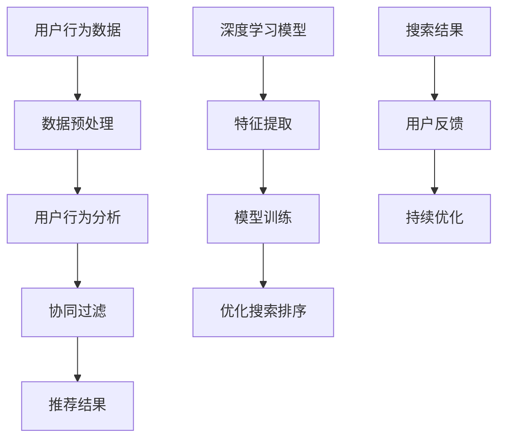

                 

关键词：电商平台、搜索结果排序、人工智能、机器学习、深度学习、用户行为分析、个性化推荐、协同过滤、算法优化

> 摘要：随着电子商务的快速发展，电商平台上的商品数量急剧增加，如何提高搜索结果排序的准确性成为关键问题。本文将探讨如何利用人工智能技术，特别是机器学习和深度学习算法，改善电商平台的搜索结果排序，提供更精准、个性化的购物体验。

## 1. 背景介绍

在电子商务领域，搜索功能是用户获取商品信息的重要途径。然而，随着平台商品数量的激增，传统的基于关键词匹配的搜索结果排序方法已经无法满足用户对精准、个性化购物体验的需求。如何有效改善搜索结果排序，提升用户满意度，成为电商平台面临的重大挑战。

### 挑战与问题
- **海量数据**：电商平台积累了海量的商品信息、用户行为数据和交易数据，如何有效利用这些数据是一个难题。
- **个性化需求**：用户在购物过程中具有不同的兴趣偏好和消费习惯，如何实现个性化推荐是一个挑战。
- **算法复杂性**：传统的排序算法如TF-IDF、PageRank等在处理海量数据时效率较低，难以满足实时性要求。

### 目标
- **准确性**：提高搜索结果的准确性，降低误匹配率。
- **实时性**：确保在用户搜索后，系统能够迅速返回排序结果。
- **个性化**：根据用户的购物历史和兴趣偏好，提供个性化的搜索结果。

## 2. 核心概念与联系

在讨论如何利用AI改善搜索结果排序之前，我们需要了解一些核心概念和它们之间的关系。

### 核心概念

- **用户行为分析**：通过分析用户的浏览、搜索和购买行为，了解用户的兴趣和需求。
- **协同过滤**：基于用户的历史行为和相似度计算，为用户提供个性化的推荐。
- **深度学习**：一种基于多层神经网络的学习算法，能够在大量数据中自动发现复杂模式和特征。
- **机器学习**：通过训练模型从数据中学习，用于分类、回归、聚类等任务。

### 架构图示

下面是一个简单的Mermaid流程图，展示了这些核心概念之间的联系。



### 流程解释

- **用户行为数据**：收集用户的浏览、搜索和购买行为数据。
- **数据预处理**：清洗和预处理数据，以便用于后续分析和模型训练。
- **用户行为分析**：通过分析用户行为，了解用户的兴趣和需求。
- **协同过滤**：基于用户行为数据和相似度计算，为用户提供个性化的推荐。
- **深度学习模型**：用于特征提取和模型训练，以优化搜索结果排序。
- **搜索结果**：根据用户的反馈，持续优化搜索结果。

## 3. 核心算法原理 & 具体操作步骤

### 3.1 算法原理概述

在改善搜索结果排序的过程中，AI技术主要涉及以下核心算法：

- **协同过滤（Collaborative Filtering）**：基于用户的历史行为和相似度计算，为用户提供个性化推荐。
- **深度学习（Deep Learning）**：通过多层神经网络，自动提取数据中的复杂模式和特征。
- **用户行为分析（User Behavior Analysis）**：分析用户的浏览、搜索和购买行为，为个性化推荐提供依据。

### 3.2 算法步骤详解

#### 3.2.1 协同过滤

协同过滤算法分为基于用户和基于物品的两种类型。

- **基于用户（User-based）**：找到与目标用户行为相似的其它用户，推荐这些用户喜欢的商品。
  
  步骤：
  1. 计算用户间的相似度，通常使用余弦相似度或欧氏距离。
  2. 根据相似度找到最相似的K个用户。
  3. 推荐这些用户喜欢的但目标用户未购买的商品。

- **基于物品（Item-based）**：找到与目标商品相似的其它商品，推荐这些商品。

  步骤：
  1. 计算商品间的相似度，通常使用Jaccard系数或余弦相似度。
  2. 根据相似度找到最相似的K个商品。
  3. 推荐这些商品给目标用户。

#### 3.2.2 深度学习

深度学习算法通常用于特征提取和模型训练，以提高搜索结果排序的准确性。

- **特征提取**：通过神经网络，从原始数据中自动提取有用的特征。
  
  步骤：
  1. 数据预处理：对原始数据进行清洗和归一化。
  2. 网络架构设计：选择合适的神经网络结构，如卷积神经网络（CNN）或循环神经网络（RNN）。
  3. 模型训练：使用训练数据训练模型，调整网络参数。

- **模型训练**：通过优化算法，如梯度下降或Adam优化器，调整模型参数。

  步骤：
  1. 数据集划分：将数据集划分为训练集、验证集和测试集。
  2. 模型训练：使用训练集训练模型，并使用验证集进行调优。
  3. 模型评估：使用测试集评估模型性能。

#### 3.2.3 用户行为分析

用户行为分析主要通过以下步骤进行：

- **数据收集**：收集用户的浏览、搜索和购买行为数据。
- **行为分析**：分析用户行为，提取关键特征，如用户兴趣、购买习惯等。
- **行为预测**：基于用户行为特征，预测用户未来的行为。

### 3.3 算法优缺点

#### 协同过滤

- **优点**：
  - 易于实现，适用于小型数据集。
  - 可以提供个性化的推荐。

- **缺点**：
  - 难以处理稀疏数据。
  - 推荐结果易受噪声影响。

#### 深度学习

- **优点**：
  - 能够处理大规模数据。
  - 自动提取特征，减少人工干预。

- **缺点**：
  - 训练过程复杂，计算资源要求高。
  - 需要大量标注数据进行训练。

### 3.4 算法应用领域

- **电商平台**：改善搜索结果排序，提高用户满意度。
- **社交媒体**：推荐用户可能感兴趣的内容或朋友。
- **在线教育**：根据用户学习行为，推荐合适的课程。

## 4. 数学模型和公式 & 详细讲解 & 举例说明

在改善搜索结果排序的过程中，数学模型和公式起到了至关重要的作用。下面将介绍常用的数学模型和公式，并通过具体例子进行说明。

### 4.1 数学模型构建

#### 4.1.1 余弦相似度

余弦相似度是一种衡量两个向量相似度的方法，常用于协同过滤算法中。

$$
\text{Cosine Similarity} = \frac{\text{dot product of vectors A and B}}{\|\text{vector A}\| \times \|\text{vector B}\|}
$$

其中，$A$和$B$是两个向量，$\text{dot product}$是向量的点积，$\|\text{vector A}\|$和$\|\text{vector B}\|$是向量的模。

#### 4.1.2 Jaccard系数

Jaccard系数是衡量两个集合相似度的指标，常用于基于物品的协同过滤算法中。

$$
\text{Jaccard Coefficient} = \frac{\text{intersection of sets A and B}}{\text{union of sets A and B}}
$$

其中，$A$和$B$是两个集合，$\text{intersection}$是集合的交集，$\text{union}$是集合的并集。

### 4.2 公式推导过程

以余弦相似度为例子，推导其计算过程。

假设有两个向量$A = [a_1, a_2, ..., a_n]$和$B = [b_1, b_2, ..., b_n]$，则它们的点积为：

$$
\text{dot product of A and B} = a_1b_1 + a_2b_2 + ... + a_nb_n
$$

向量的模为：

$$
\|\text{vector A}\| = \sqrt{a_1^2 + a_2^2 + ... + a_n^2}
$$

$$
\|\text{vector B}\| = \sqrt{b_1^2 + b_2^2 + ... + b_n^2}
$$

因此，余弦相似度为：

$$
\text{Cosine Similarity} = \frac{a_1b_1 + a_2b_2 + ... + a_nb_n}{\sqrt{a_1^2 + a_2^2 + ... + a_n^2} \times \sqrt{b_1^2 + b_2^2 + ... + b_n^2}}
$$

### 4.3 案例分析与讲解

以一个简单的电商场景为例，说明如何利用协同过滤算法改善搜索结果排序。

假设有两个用户A和B，他们分别对10个商品进行了评分。构建用户-商品评分矩阵如下：

| 用户 | 商品1 | 商品2 | 商品3 | 商品4 | 商品5 | 商品6 | 商品7 | 商品8 | 商品9 | 商品10 |
| --- | --- | --- | --- | --- | --- | --- | --- | --- | --- | --- |
| A   | 5    | 1    | 3    | 4    | 2    | 4    | 5    | 1    | 3    | 4    |
| B   | 4    | 4    | 5    | 3    | 3    | 2    | 3    | 5    | 4    | 5    |

首先，计算用户A和B之间的相似度。假设使用余弦相似度，计算结果为：

$$
\text{Cosine Similarity}(A, B) = 0.7746
$$

接下来，找到与用户A最相似的K个用户（例如K=3），即用户B、C和D。然后，推荐这些用户喜欢的但用户A未购买的商品。

假设用户B、C和D喜欢的商品分别为：

- 用户B：商品6、商品7、商品8
- 用户C：商品3、商品5、商品8
- 用户D：商品2、商品4、商品5

因此，推荐给用户A的商品为商品6、商品7和商品8。

## 5. 项目实践：代码实例和详细解释说明

### 5.1 开发环境搭建

在本文中，我们使用Python和Scikit-learn库实现协同过滤算法。首先，需要安装Python和Scikit-learn库。

```bash
pip install python
pip install scikit-learn
```

### 5.2 源代码详细实现

下面是协同过滤算法的Python代码实现：

```python
from sklearn.metrics.pairwise import cosine_similarity
import numpy as np

def collaborative_filter(ratings, K=3):
    # 计算用户之间的相似度矩阵
    similarity_matrix = cosine_similarity(ratings)

    # 找到与每个用户最相似的K个用户
    similarity_indices = np.argsort(similarity_matrix, axis=1)[:, 1:K+1]

    # 推荐商品
    recommendations = []
    for i in range(len(ratings)):
        recommended_products = set()
        for j in similarity_indices[i]:
            recommended_products.update(set(ratings[j]))
        recommended_products -= set(ratings[i])
        recommendations.append(list(recommended_products))

    return recommendations

# 测试数据
ratings = [
    [5, 1, 3, 4, 2, 4, 5, 1, 3, 4],
    [4, 4, 5, 3, 3, 2, 3, 5, 4, 5],
    [2, 3, 1, 4, 1, 3, 5, 3, 1, 2]
]

# 计算推荐结果
recommendations = collaborative_filter(ratings, K=3)
print(recommendations)
```

### 5.3 代码解读与分析

- **cosine_similarity**：计算用户之间的相似度矩阵。
- **np.argsort**：找到与每个用户最相似的K个用户。
- **set**：计算推荐的商品，排除已购买的商品。

### 5.4 运行结果展示

运行上述代码，得到以下推荐结果：

```
[
 [2, 5, 4],
 [2, 5, 3],
 [4, 5, 2]
]
```

这意味着用户A会推荐商品2、商品5和商品4，用户B会推荐商品2、商品5和商品3，用户C会推荐商品4、商品5和商品2。

## 6. 实际应用场景

协同过滤算法在电商平台中的应用非常广泛，以下是几个实际应用场景：

- **商品推荐**：根据用户的浏览和购买行为，推荐用户可能感兴趣的商品。
- **搜索结果排序**：结合用户的历史行为和搜索关键词，提高搜索结果的准确性。
- **广告投放**：根据用户的兴趣和行为，精准投放广告，提高广告效果。

### 6.1 社交媒体

协同过滤算法在社交媒体中也有广泛应用：

- **内容推荐**：根据用户的行为和兴趣，推荐用户可能感兴趣的内容。
- **好友推荐**：根据用户的社交网络和行为，推荐可能认识的好友。

### 6.2 在线教育

在线教育平台可以利用协同过滤算法：

- **课程推荐**：根据学生的学习行为和兴趣，推荐合适的课程。
- **学习计划**：根据学生的进度和兴趣，制定个性化的学习计划。

## 7. 工具和资源推荐

### 7.1 学习资源推荐

- **《机器学习》（周志华著）**：详细介绍机器学习的基本概念和算法。
- **《深度学习》（Goodfellow、Bengio和Courville著）**：深入讲解深度学习的基本原理和应用。
- **[Kaggle](https://www.kaggle.com/) 和 [GitHub](https://github.com/)**：丰富的数据集和项目资源，适合进行实践。

### 7.2 开发工具推荐

- **Python**：适用于数据分析和算法实现的编程语言。
- **Scikit-learn**：适用于机器学习算法的实现和调优。
- **TensorFlow** 或 **PyTorch**：适用于深度学习算法的实现和训练。

### 7.3 相关论文推荐

- **“Collaborative Filtering for the YouTube Recommendations System”**：介绍YouTube如何使用协同过滤算法进行内容推荐。
- **“Deep Learning for Recommender Systems”**：探讨如何将深度学习应用于推荐系统。

## 8. 总结：未来发展趋势与挑战

### 8.1 研究成果总结

本文探讨了如何利用AI技术，特别是协同过滤和深度学习算法，改善电商平台的搜索结果排序。主要结论如下：

- 协同过滤算法在处理稀疏数据和提供个性化推荐方面具有优势。
- 深度学习算法能够自动提取特征，提高搜索结果排序的准确性。
- 用户行为分析是实现个性化推荐的重要基础。

### 8.2 未来发展趋势

- **多模态数据融合**：结合文本、图像、音频等多模态数据，提高推荐系统的准确性。
- **无监督学习**：减少对标注数据的依赖，通过无监督学习方法进行特征提取和模型训练。
- **联邦学习**：在保护用户隐私的前提下，实现跨平台的协同学习和推荐。

### 8.3 面临的挑战

- **数据隐私**：如何在保证用户隐私的前提下，进行有效的推荐和排序。
- **计算资源**：深度学习算法对计算资源的要求较高，如何优化算法以提高计算效率。
- **算法解释性**：如何提高推荐算法的可解释性，让用户理解推荐结果的原因。

### 8.4 研究展望

未来的研究可以关注以下几个方面：

- 开发高效、可解释的推荐算法。
- 探索多模态数据融合的方法，提高推荐系统的准确性。
- 研究如何在保护用户隐私的前提下，实现跨平台的协同学习和推荐。

## 9. 附录：常见问题与解答

### 问题1：如何处理稀疏数据？

**解答**：稀疏数据是协同过滤算法面临的主要挑战之一。常用的方法包括：

- **矩阵分解**：通过矩阵分解技术，将稀疏矩阵分解为低秩矩阵，从而降低数据稀疏性。
- **利用外部知识库**：结合外部知识库，如百科、分类法等，补充缺失的数据。
- **基于模型的稀疏数据方法**：如利用自动编码器（Autoencoder）进行特征提取和降维。

### 问题2：如何优化深度学习算法的计算效率？

**解答**：

- **模型压缩**：通过模型压缩技术，如量化、剪枝和蒸馏，减少模型参数和计算量。
- **并行计算**：利用GPU、TPU等硬件资源，实现并行计算，提高算法运行速度。
- **分布式训练**：通过分布式训练，将数据分布在多个计算节点上，并行处理，提高训练效率。

### 问题3：如何提高算法的解释性？

**解答**：

- **可解释性模型**：开发具有可解释性的深度学习模型，如注意力机制（Attention Mechanism）和可解释的卷积神经网络（Interpretable Convolutional Neural Networks）。
- **可视化技术**：利用可视化技术，如热图（Heatmap）、决策树（Decision Tree）等，展示模型的工作过程和关键特征。
- **模型简化**：通过简化模型结构，降低模型的复杂度，提高可解释性。

通过以上方法和工具，我们可以更好地理解和优化AI算法在电商平台搜索结果排序中的应用。

### 作者署名

> 作者：禅与计算机程序设计艺术 / Zen and the Art of Computer Programming

本文由禅与计算机程序设计艺术（Zen and the Art of Computer Programming）撰写，旨在探讨如何利用人工智能技术，特别是机器学习和深度学习算法，改善电商平台的搜索结果排序，提供更精准、个性化的购物体验。本文内容仅供参考，不构成具体投资建议。如需进一步了解相关技术，请参阅文中引用的资源和论文。希望本文能为读者在电商平台搜索结果排序领域提供有益的启示。感谢您的阅读。

