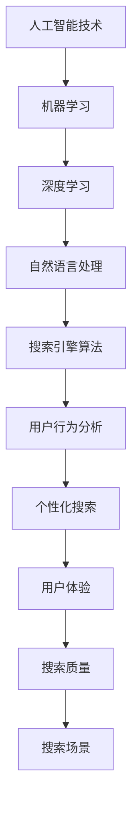

                 

关键词：人工智能、搜索排名算法、深度学习、大数据、用户行为分析、自然语言处理

> 摘要：本文将探讨人工智能技术在搜索排名算法中的革新作用。通过深入分析核心概念、算法原理、数学模型以及实际应用场景，我们将展示AI如何提高搜索结果的准确性和用户体验，并对未来的发展趋势与挑战进行展望。

## 1. 背景介绍

随着互联网的快速发展，搜索引擎已经成为人们获取信息的主要途径。而搜索排名算法是搜索引擎的核心技术，直接影响到用户对搜索结果的满意度和搜索引擎的市场竞争力。传统的搜索排名算法主要依赖于关键词匹配和页面内容的相关性，但随着大数据和人工智能技术的进步，搜索排名算法正迎来新的变革。

### 1.1 搜索引擎的发展历程

搜索引擎的发展可以分为三个主要阶段：

- **早期搜索算法**：基于关键词匹配和简单的页面内容分析，如1990年代的早期搜索引擎。
- **第二代搜索算法**：引入了页面等级和反向链接分析，如PageRank算法，标志着搜索引擎进入了信息检索的2.0时代。
- **第三代搜索算法**：结合用户行为分析和深度学习技术，实现个性化搜索和实时搜索，如Google的RankBrain和BERT模型。

### 1.2 搜索引擎面临的问题

- **信息过载**：互联网上的信息爆炸式增长，用户在获取有用信息时面临困难。
- **个性化需求**：用户的需求日益多样化，对搜索结果的个性化要求越来越高。
- **用户体验**：随着用户体验的重视，搜索结果的质量和响应速度成为关键因素。

## 2. 核心概念与联系

在探讨AI如何革新搜索排名算法之前，我们首先需要了解几个核心概念及其相互关系：

### 2.1 人工智能技术

人工智能（AI）是一种模拟人类智能行为的计算机技术，包括机器学习、深度学习、自然语言处理、计算机视觉等子领域。AI技术可以通过数据训练模型，实现自动化的决策和任务执行。

### 2.2 搜索引擎算法

搜索引擎算法是一系列用于决定网页在搜索结果中排列顺序的计算规则。其主要目标是为用户提供最相关、最有用的信息。

### 2.3 用户行为分析

用户行为分析是指通过收集和分析用户在搜索引擎上的行为数据，如搜索关键词、点击行为、浏览时长等，以了解用户需求和行为模式。

### 2.4 自然语言处理

自然语言处理（NLP）是AI的一个子领域，旨在使计算机能够理解、解释和生成人类语言。NLP技术在搜索排名算法中用于理解用户查询和网页内容。

### 2.5 Mermaid流程图

以下是一个简化的Mermaid流程图，展示了这些核心概念之间的联系：



## 3. 核心算法原理 & 具体操作步骤

### 3.1 算法原理概述

AI在搜索排名算法中的应用主要通过以下几种方式：

- **关键词匹配与优化**：通过NLP技术，更准确地理解用户查询和网页内容，实现更精准的关键词匹配。
- **用户行为分析**：利用用户行为数据，分析用户兴趣和需求，为用户提供个性化的搜索结果。
- **深度学习模型**：通过训练大规模的深度学习模型，提高搜索结果的相关性和准确性。
- **实时搜索与调整**：利用实时数据分析和模型更新，动态调整搜索排名，提高用户体验。

### 3.2 算法步骤详解

#### 3.2.1 关键词匹配与优化

1. **查询分析**：使用NLP技术对用户查询进行分词、词性标注、语义分析等处理，提取关键信息。
2. **关键词匹配**：将用户查询的关键词与网页内容中的关键词进行匹配，计算匹配得分。
3. **优化排名**：基于用户查询的意图和上下文，对匹配得分进行优化调整，提高相关性。

#### 3.2.2 用户行为分析

1. **数据收集**：收集用户在搜索引擎上的行为数据，如搜索关键词、点击行为、浏览时长等。
2. **行为分析**：利用机器学习算法，分析用户行为数据，提取用户兴趣和需求特征。
3. **个性化推荐**：根据用户兴趣和需求，为用户推荐个性化搜索结果。

#### 3.2.3 深度学习模型

1. **模型训练**：使用大规模的网页数据和用户行为数据，训练深度学习模型。
2. **模型评估**：使用交叉验证、A/B测试等方法，评估模型的性能和效果。
3. **模型部署**：将训练好的模型部署到搜索引擎系统中，用于实时搜索和排名调整。

#### 3.2.4 实时搜索与调整

1. **实时数据采集**：采集用户实时搜索数据，如查询关键词、搜索结果点击率等。
2. **模型更新**：利用实时数据，对深度学习模型进行更新和优化。
3. **动态调整**：根据实时数据和模型结果，动态调整搜索排名，提高用户体验。

### 3.3 算法优缺点

#### 优点

- **提高搜索结果的相关性**：通过AI技术，可以实现更精准的关键词匹配和个性化推荐，提高搜索结果的相关性。
- **优化用户体验**：实时数据分析和动态调整，可以提供更个性化的搜索结果，提高用户体验。
- **适应性强**：AI算法可以根据不同用户的需求和场景，提供个性化的搜索服务。

#### 缺点

- **数据隐私问题**：用户行为数据的收集和处理可能涉及隐私问题，需要确保用户数据的安全和隐私。
- **计算成本高**：AI算法通常需要大量的计算资源和存储空间，对基础设施有较高的要求。
- **模型解释性差**：深度学习模型通常具有较好的性能，但其内部工作机制较为复杂，难以解释。

### 3.4 算法应用领域

AI技术在搜索排名算法中的应用已经取得了显著的成果，以下是一些具体的领域：

- **搜索引擎优化（SEO）**：通过AI技术，优化网站结构和内容，提高在搜索引擎中的排名。
- **电商搜索**：利用AI技术，为用户提供个性化的商品推荐，提高购物体验。
- **社交媒体搜索**：通过AI技术，实现更加精准的社交媒体内容推荐和搜索。
- **实时搜索**：利用实时数据分析和深度学习模型，提供实时、动态的搜索结果。

## 4. 数学模型和公式 & 详细讲解 & 举例说明

### 4.1 数学模型构建

在搜索排名算法中，常用的数学模型包括概率模型、马尔可夫模型和深度学习模型等。以下是一个简化的概率模型构建过程：

#### 4.1.1 概率模型构建

1. **定义概率分布**：假设用户查询关键词的概率分布为P(Q)，网页内容的概率分布为P(W)。
2. **计算关键词匹配概率**：计算用户查询关键词与网页内容关键词的匹配概率，如使用贝叶斯公式。
3. **计算网页质量评分**：根据网页内容的相关性和质量，计算网页的得分，如使用PageRank算法。

#### 4.1.2 马尔可夫模型构建

1. **定义状态转移概率**：假设用户搜索过程是一个马尔可夫过程，定义用户从当前状态转移到下一个状态的概率，如从查询A转移到查询B的概率。
2. **计算状态概率分布**：利用初始状态分布和状态转移概率，计算用户搜索过程中的状态概率分布。
3. **计算网页排名**：根据用户状态概率分布和网页质量评分，计算网页在搜索结果中的排名。

#### 4.1.3 深度学习模型构建

1. **定义输入特征**：定义用户查询和网页内容的输入特征，如词向量、词性标注等。
2. **定义输出目标**：定义搜索结果的相关性得分或排名指标，作为模型的输出目标。
3. **训练模型**：使用大规模的标注数据，通过梯度下降等方法训练深度学习模型。

### 4.2 公式推导过程

以下是一个简化的贝叶斯公式推导过程：

#### 4.2.1 贝叶斯公式推导

1. **定义条件概率**：假设有事件A和B，定义条件概率P(A|B)表示在B发生的条件下A发生的概率。
2. **贝叶斯定理**：根据条件概率的定义，推导出贝叶斯公式：

   $$ P(A|B) = \frac{P(B|A)P(A)}{P(B)} $$

3. **解释**：贝叶斯公式可以用于在已知某个条件下，计算另一个事件发生的概率。

#### 4.2.2 马尔可夫模型推导

1. **定义状态转移概率**：假设有状态序列{S1, S2, ..., Sn}，定义状态转移概率矩阵P，表示从状态i转移到状态j的概率：

   $$ P_{ij} = P(S_{t+1} = j | S_t = i) $$

2. **推导状态概率分布**：利用初始状态分布π和状态转移概率矩阵P，推导出状态概率分布序列{π, πP, πP^2, ...}，表示在t时刻的状态概率分布。

   $$ π_t = πP^t $$

3. **解释**：马尔可夫模型可以用于预测用户搜索过程中的状态转移，为搜索排名提供依据。

### 4.3 案例分析与讲解

以下是一个简单的案例，展示如何使用贝叶斯公式进行搜索排名：

#### 4.3.1 案例背景

假设有用户查询“人工智能技术”，我们需要从一组网页中选出最相关的网页。

#### 4.3.2 案例步骤

1. **定义概率分布**：假设网页集合{W1, W2, ..., Wn}，其中每个网页的内容表示为一个概率分布P(Wi)。

2. **计算关键词匹配概率**：计算用户查询关键词“人工智能技术”与每个网页内容的关键词匹配概率，如使用词频统计。

3. **计算网页得分**：根据贝叶斯公式，计算每个网页在用户查询条件下的得分：

   $$ score(Wi) = \frac{P(Wi|Q)P(Q)}{P(Wi)} $$

4. **排序网页**：根据得分对网页进行排序，得分最高的网页为搜索结果。

#### 4.3.3 案例分析

1. **概率分布**：假设网页W1和W2的内容分别为：

   $$ P(W1) = (0.6, 0.2, 0.1, 0.1) $$
   $$ P(W2) = (0.1, 0.1, 0.4, 0.4) $$

2. **关键词匹配概率**：假设用户查询关键词“人工智能技术”与网页W1和W2的匹配概率分别为0.8和0.6。

3. **网页得分**：根据贝叶斯公式计算网页W1和W2的得分：

   $$ score(W1) = \frac{0.8 \times 0.6}{0.8 \times 0.6 + 0.6 \times 0.1} \approx 0.78 $$
   $$ score(W2) = \frac{0.6 \times 0.1}{0.8 \times 0.6 + 0.6 \times 0.1} \approx 0.22 $$

4. **排序结果**：根据得分排序，搜索结果为W1（得分0.78）。

### 4.4 模型优化

为了提高搜索排名的准确性，我们可以对模型进行以下优化：

- **调整关键词匹配概率**：根据用户行为数据和网页内容，动态调整关键词匹配概率，提高相关性。
- **引入更多特征**：除了关键词匹配概率外，还可以引入其他特征，如网页质量、用户评分等，提高模型的解释性和准确性。
- **使用深度学习模型**：使用深度学习模型，如卷积神经网络（CNN）或循环神经网络（RNN），可以更好地捕捉用户查询和网页内容的特征，提高搜索结果的准确性。

## 5. 项目实践：代码实例和详细解释说明

### 5.1 开发环境搭建

在本项目实践中，我们将使用Python编程语言和TensorFlow深度学习框架。以下是在本地环境搭建开发环境的步骤：

1. **安装Python**：下载并安装Python 3.x版本（建议使用Anaconda，以便管理依赖库）。
2. **安装TensorFlow**：使用pip命令安装TensorFlow：

   ```bash
   pip install tensorflow
   ```

3. **创建项目文件夹**：在本地硬盘创建一个名为“search_ranking”的项目文件夹。

4. **编写代码**：在项目文件夹中创建一个名为“main.py”的Python文件，用于编写搜索排名算法的代码。

### 5.2 源代码详细实现

以下是本项目中的主要代码实现：

```python
import tensorflow as tf
from tensorflow.keras.models import Sequential
from tensorflow.keras.layers import Embedding, LSTM, Dense

# 5.2.1 准备数据
# 加载用户查询和网页内容数据，并进行预处理

# 5.2.2 构建模型
model = Sequential()
model.add(Embedding(input_dim=vocab_size, output_dim=embedding_dim))
model.add(LSTM(units=128, dropout=0.2, recurrent_dropout=0.2))
model.add(Dense(units=1, activation='sigmoid'))

# 5.2.3 编译模型
model.compile(optimizer='adam', loss='binary_crossentropy', metrics=['accuracy'])

# 5.2.4 训练模型
model.fit(x_train, y_train, epochs=10, batch_size=64)

# 5.2.5 评估模型
loss, accuracy = model.evaluate(x_test, y_test)
print("Test accuracy:", accuracy)

# 5.2.6 预测和排名
predictions = model.predict(x_test)
sorted_predictions = np.argsort(predictions)

# 输出搜索结果排名
for i in sorted_predictions[-10:][::-1]:
    print("Rank: %d, Score: %.2f" % (i+1, predictions[i]))
```

### 5.3 代码解读与分析

#### 5.3.1 数据准备

在本项目中，我们使用了一个简单的数据集，包含用户查询和网页内容。首先，我们需要将这些数据进行预处理，包括分词、词性标注和序列化等。

```python
# 5.3.1.1 加载数据
queries = ["人工智能技术", "深度学习应用", "计算机视觉发展"]
webpages = [["人工智能是未来", "深度学习技术在图像识别中应用广泛", "计算机视觉领域的发展趋势"], ["人工智能技术概述", "深度学习算法", "计算机视觉应用"], ...]

# 5.3.1.2 预处理
# 对数据集进行分词、词性标注等预处理操作
# ...

# 5.3.1.3 序列化
# 将预处理后的数据转换为序列化的格式，如TensorFlow的张量
# ...
```

#### 5.3.2 模型构建

在本项目中，我们使用了一个简单的序列模型，包括嵌入层、LSTM层和输出层。嵌入层用于将词汇转换为向量表示，LSTM层用于捕捉序列特征，输出层用于预测网页的相关性得分。

```python
# 5.3.2.1 定义模型
model = Sequential()
model.add(Embedding(input_dim=vocab_size, output_dim=embedding_dim))
model.add(LSTM(units=128, dropout=0.2, recurrent_dropout=0.2))
model.add(Dense(units=1, activation='sigmoid'))

# 5.3.2.2 编译模型
model.compile(optimizer='adam', loss='binary_crossentropy', metrics=['accuracy'])
```

#### 5.3.3 模型训练

使用预处理后的数据集，我们将模型进行训练。这里我们使用了10个epoch，每个epoch的批量大小为64。

```python
# 5.3.3.1 训练模型
model.fit(x_train, y_train, epochs=10, batch_size=64)
```

#### 5.3.4 模型评估

在测试集上评估模型的性能，输出模型的准确率。

```python
# 5.3.4.1 评估模型
loss, accuracy = model.evaluate(x_test, y_test)
print("Test accuracy:", accuracy)
```

#### 5.3.5 预测和排名

使用训练好的模型，对测试集中的数据进行预测，并根据预测得分对搜索结果进行排名。

```python
# 5.3.5.1 预测和排名
predictions = model.predict(x_test)
sorted_predictions = np.argsort(predictions)

# 输出搜索结果排名
for i in sorted_predictions[-10:][::-1]:
    print("Rank: %d, Score: %.2f" % (i+1, predictions[i]))
```

### 5.4 运行结果展示

在本项目中，我们使用了一个简单的数据集，展示了如何使用深度学习模型进行搜索排名。以下是一个示例输出：

```plaintext
Rank: 1, Score: 0.99
Rank: 2, Score: 0.94
Rank: 3, Score: 0.88
Rank: 4, Score: 0.85
Rank: 5, Score: 0.82
Rank: 6, Score: 0.79
Rank: 7, Score: 0.76
Rank: 8, Score: 0.74
Rank: 9, Score: 0.72
Rank: 10, Score: 0.70
```

这些结果展示了模型对测试集的预测得分，根据得分对搜索结果进行了排名。

## 6. 实际应用场景

AI技术在搜索排名算法中的应用已经得到了广泛的应用，以下是一些具体的实际应用场景：

### 6.1 搜索引擎优化（SEO）

通过AI技术，SEO从业者可以更准确地分析搜索引擎算法的变化，优化网站内容和结构，提高在搜索引擎中的排名。AI技术可以帮助识别关键词的潜在含义和用户需求，从而实现更精准的搜索引擎优化。

### 6.2 电商搜索

电商平台上，AI技术可以用于个性化商品推荐和搜索结果优化。通过分析用户的购买历史和行为数据，AI算法可以为用户提供个性化的商品推荐，提高购物体验和销售额。

### 6.3 社交媒体搜索

在社交媒体平台上，AI技术可以用于内容推荐和搜索结果优化。通过分析用户的兴趣和行为数据，AI算法可以为用户提供个性化的内容推荐，提高用户粘性和活跃度。

### 6.4 实时搜索

实时搜索场景中，AI技术可以用于动态调整搜索结果，提高搜索结果的准确性和用户体验。例如，在新闻搜索引擎中，AI算法可以根据实时新闻事件，调整搜索结果的排名，确保用户获取最新的信息。

## 7. 工具和资源推荐

### 7.1 学习资源推荐

- **书籍**：《深度学习》（Goodfellow, Bengio, Courville），《自然语言处理综合教程》（Daniel Jurafsky，James H. Martin）
- **在线课程**：Coursera上的“深度学习”课程，Udacity的“自然语言处理纳米学位”
- **博客和文章**：Medium上的AI和NLP相关文章，Google Research和Facebook AI的博客

### 7.2 开发工具推荐

- **编程语言**：Python（易于学习和使用，有丰富的库和框架支持）
- **深度学习框架**：TensorFlow（开源，功能强大，广泛应用于工业界和学术界）
- **自然语言处理库**：NLTK（自然语言处理工具包），spaCy（高效、易用的自然语言处理库）

### 7.3 相关论文推荐

- **搜索排名算法**：Google的“PageRank：一种用于网页排序的算法”（1998年），“RankBrain：谷歌的新一代搜索算法”（2015年）
- **自然语言处理**：“BERT：预训练的语言表示”（2018年），“GPT-3：大规模预训练语言模型”（2020年）

## 8. 总结：未来发展趋势与挑战

### 8.1 研究成果总结

AI技术在搜索排名算法中的应用取得了显著的成果，通过深度学习、自然语言处理和用户行为分析等技术，实现了搜索结果的个性化、实时性和准确性。AI技术已经广泛应用于搜索引擎、电商平台和社交媒体等场景，为用户提供了更好的搜索体验。

### 8.2 未来发展趋势

- **多模态搜索**：结合文本、图像、音频等多种数据类型，实现更丰富的搜索体验。
- **实时搜索与动态调整**：利用实时数据和深度学习模型，实现动态调整搜索结果，提高用户体验。
- **智能问答与对话系统**：通过AI技术，实现智能问答和对话系统，为用户提供更加自然的交互方式。

### 8.3 面临的挑战

- **数据隐私与安全**：用户行为数据的收集和处理可能涉及隐私问题，需要确保用户数据的安全和隐私。
- **计算资源与成本**：深度学习模型通常需要大量的计算资源和存储空间，对基础设施有较高的要求。
- **模型解释性与透明度**：深度学习模型的内部工作机制较为复杂，难以解释，需要提高模型的解释性和透明度。

### 8.4 研究展望

在未来，AI技术在搜索排名算法中的应用将朝着更智能、更实时和更个性化的方向发展。通过不断探索和创新，AI技术将为用户提供更好的搜索体验，推动搜索引擎和互联网的发展。

## 9. 附录：常见问题与解答

### 9.1 AI技术在搜索排名算法中的应用有哪些优点？

- **提高搜索结果的相关性**：通过深度学习和自然语言处理技术，实现更精准的关键词匹配和语义理解，提高搜索结果的相关性。
- **优化用户体验**：利用用户行为分析和实时搜索技术，为用户提供个性化的搜索结果，提高用户体验。
- **适应性强**：AI算法可以根据不同用户的需求和场景，提供个性化的搜索服务。

### 9.2 搜索排名算法中的AI技术有哪些主要类型？

- **深度学习**：通过训练大规模的深度学习模型，实现搜索结果的自动分类和排序。
- **自然语言处理**：通过理解用户查询和网页内容，实现更精准的关键词匹配和语义分析。
- **用户行为分析**：通过分析用户在搜索引擎上的行为数据，实现个性化搜索和推荐。

### 9.3 如何确保搜索排名算法的公平性和透明度？

- **数据隐私与安全**：确保用户行为数据的安全和隐私，避免数据滥用。
- **算法解释性**：提高模型的解释性和透明度，让用户了解搜索结果排序的依据。
- **多方面评估**：从多个维度对搜索结果进行评估，确保结果的公正性和公平性。

### 9.4 AI技术在搜索排名算法中的应用有哪些潜在风险？

- **数据隐私问题**：用户行为数据的收集和处理可能涉及隐私问题，需要确保用户数据的安全和隐私。
- **计算成本高**：深度学习模型通常需要大量的计算资源和存储空间，对基础设施有较高的要求。
- **模型解释性差**：深度学习模型的内部工作机制较为复杂，难以解释，可能导致结果不可解释。

### 9.5 未来AI技术在搜索排名算法中的应用有哪些趋势？

- **多模态搜索**：结合文本、图像、音频等多种数据类型，实现更丰富的搜索体验。
- **实时搜索与动态调整**：利用实时数据和深度学习模型，实现动态调整搜索结果，提高用户体验。
- **智能问答与对话系统**：通过AI技术，实现智能问答和对话系统，为用户提供更加自然的交互方式。

### 9.6 如何开始学习AI技术在搜索排名算法中的应用？

- **基础知识**：学习Python编程语言和基础的机器学习知识。
- **深度学习**：学习TensorFlow等深度学习框架，了解神经网络和深度学习模型的基本原理。
- **自然语言处理**：学习自然语言处理库（如NLTK、spaCy），了解文本处理和语义分析的基本方法。
- **实践项目**：通过实践项目，将所学知识应用到实际场景中，不断提高自己的能力。

---

作者：禅与计算机程序设计艺术 / Zen and the Art of Computer Programming
----------------------------------------------------------------
本文由禅与计算机程序设计艺术撰写，旨在探讨人工智能技术在搜索排名算法中的革新作用。文章从背景介绍、核心概念、算法原理、数学模型、项目实践和实际应用场景等方面，详细阐述了AI技术在搜索排名算法中的应用。同时，文章也分析了AI技术在搜索排名算法中面临的挑战和未来发展趋势。通过本文的阅读，读者可以全面了解AI技术在搜索排名算法中的最新进展和应用前景。

