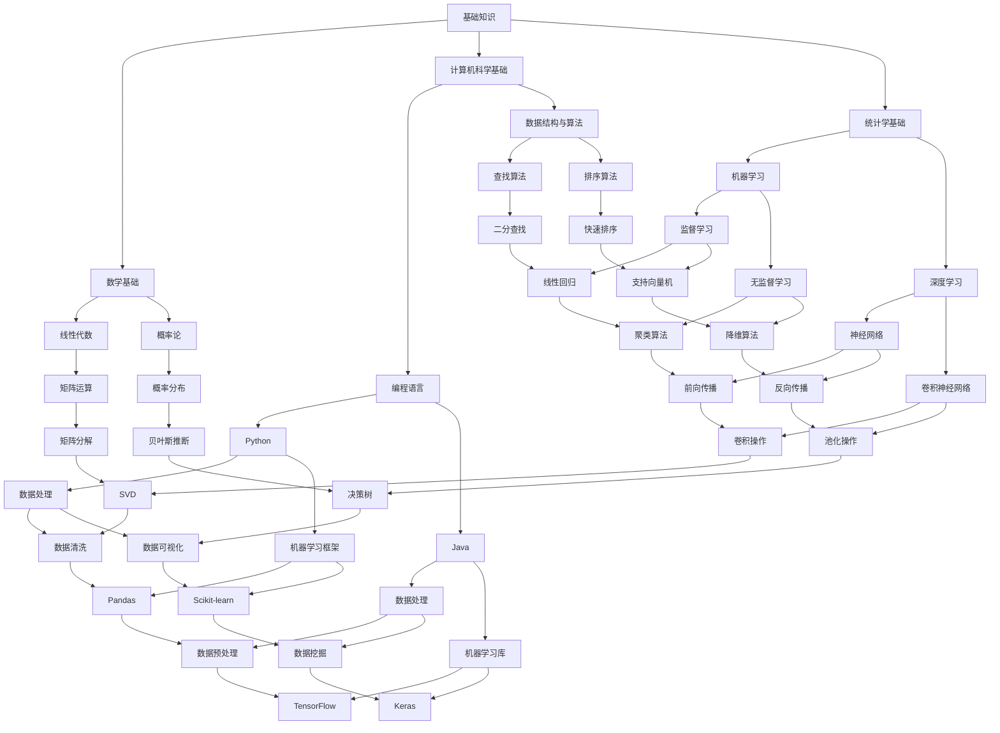

                 

关键词：AI学习，阶段性目标，学习路径，专业知识，技能提升，实践应用，未来展望

> 摘要：本文将探讨AI学习的阶段性目标设定，从基础知识掌握、核心技术理解和实际应用实践三个层次，详细阐述AI学习者在不同阶段应设立的具体目标，帮助读者科学规划学习进程，提高学习效率。

## 1. 背景介绍

人工智能（AI）作为当今科技领域的前沿学科，已经广泛应用于多个行业，如医疗、金融、交通、教育等。随着AI技术的不断进步，AI学习也成为越来越多人的职业选择和兴趣方向。然而，AI学习的复杂性使其成为一个长期而艰巨的过程。因此，明确阶段性目标对于AI学习者来说至关重要。

本文将围绕AI学习的阶段性目标设定展开讨论，旨在为AI学习者提供一套科学、系统的目标设定框架，帮助他们在不同学习阶段找到适合自己的发展方向和路径。

### 1.1 AI学习的现状

当前，AI学习呈现出以下现状：

1. **基础知识需求**：AI领域的许多核心概念和技术都需要扎实的数学、计算机科学和工程背景知识。
2. **实践应用需求**：AI技术在实际应用中的效果直接决定了其商业价值和市场前景。
3. **持续更新需求**：AI技术的发展日新月异，学习者的知识库需要不断更新以保持竞争力。

### 1.2 目标设定的必要性

设定阶段性目标对于AI学习者具有以下几个方面的必要性：

1. **明确学习方向**：通过目标设定，学习者可以明确自己的学习重点和目标，避免盲目学习。
2. **提高学习效率**：目标设定有助于学习者更有针对性地进行学习，从而提高学习效率。
3. **增强自我驱动力**：明确的目标可以激发学习者的内在驱动力，保持持续学习的动力。

## 2. 核心概念与联系

在探讨AI学习的阶段性目标之前，我们需要明确一些核心概念，并理解它们之间的联系。以下是一个使用Mermaid绘制的流程图，展示了AI学习中的核心概念及其关系：



通过上述Mermaid流程图，我们可以看到AI学习的核心概念及其相互关系。这些概念构成了AI学习的知识体系，是设定阶段性目标的基础。

## 3. 核心算法原理 & 具体操作步骤

### 3.1 算法原理概述

在AI学习中，核心算法的理解至关重要。以下是几个典型的核心算法及其原理概述：

#### 3.1.1 线性回归

线性回归是一种简单的监督学习算法，用于预测连续值输出。其原理是通过拟合一条直线，最小化预测值与实际值之间的误差。

#### 3.1.2 支持向量机（SVM）

支持向量机是一种强大的分类算法，其原理是找到最佳分割超平面，将数据集分为不同的类别。

#### 3.1.3 深度学习

深度学习是构建多层神经网络进行特征学习和预测的技术。其核心原理包括前向传播、反向传播和卷积操作。

#### 3.1.4 卷积神经网络（CNN）

卷积神经网络是一种专门用于图像识别的深度学习模型，其核心原理是通过卷积操作提取图像特征，并通过池化操作降低维度。

### 3.2 算法步骤详解

#### 3.2.1 线性回归

1. 数据准备：收集并处理输入特征和目标值数据。
2. 模型构建：使用线性回归公式建立模型。
3. 模型训练：通过最小二乘法调整模型参数。
4. 预测：使用训练好的模型进行预测。

#### 3.2.2 支持向量机（SVM）

1. 数据准备：收集并处理数据，进行特征提取。
2. 模型选择：选择合适的核函数。
3. 模型训练：通过求解优化问题确定支持向量。
4. 预测：使用训练好的模型进行分类预测。

#### 3.2.3 深度学习

1. 数据准备：收集并处理数据，进行特征提取。
2. 网络构建：设计神经网络结构。
3. 模型训练：通过反向传播算法更新模型参数。
4. 预测：使用训练好的模型进行特征学习和预测。

#### 3.2.4 卷积神经网络（CNN）

1. 数据准备：收集并处理图像数据。
2. 网络构建：设计卷积神经网络结构。
3. 模型训练：通过反向传播算法更新模型参数。
4. 预测：使用训练好的模型进行图像识别。

### 3.3 算法优缺点

每种算法都有其优缺点，以下是对常见算法优缺点的简要分析：

#### 3.3.1 线性回归

- 优点：简单易实现，适用于线性关系较强的数据。
- 缺点：无法处理非线性关系，对于复杂问题效果不佳。

#### 3.3.2 支持向量机（SVM）

- 优点：强大分类能力，适合处理高维数据。
- 缺点：训练时间较长，对于大规模数据集可能不适用。

#### 3.3.3 深度学习

- 优点：强大的特征学习能力，适用于复杂问题。
- 缺点：需要大量数据和计算资源，模型解释性较差。

#### 3.3.4 卷积神经网络（CNN）

- 优点：强大的图像识别能力，适用于计算机视觉任务。
- 缺点：训练过程复杂，对计算资源要求较高。

### 3.4 算法应用领域

不同算法在应用领域上也各有优势：

- **线性回归**：主要用于回归分析，如房价预测、股票价格预测等。
- **支持向量机（SVM）**：广泛应用于分类问题，如文本分类、手写识别等。
- **深度学习**：在图像识别、语音识别、自然语言处理等领域具有广泛应用。
- **卷积神经网络（CNN）**：主要应用于图像识别和计算机视觉领域。

## 4. 数学模型和公式 & 详细讲解 & 举例说明

### 4.1 数学模型构建

在AI学习中，数学模型是核心部分。以下介绍几种常见的数学模型及其构建过程。

#### 4.1.1 线性回归模型

线性回归模型的基本形式为：

$$
y = \beta_0 + \beta_1 \cdot x
$$

其中，$y$ 为预测值，$x$ 为输入特征，$\beta_0$ 和 $\beta_1$ 为模型参数。

#### 4.1.2 支持向量机（SVM）模型

支持向量机模型的目标是找到最佳分割超平面，其数学模型为：

$$
\min_{\beta, \beta_0} \frac{1}{2} ||\beta||^2 + C \sum_{i=1}^m \max(0, 1 - y_i(\beta \cdot x_i + \beta_0))
$$

其中，$\beta$ 和 $\beta_0$ 为模型参数，$C$ 为惩罚参数，$y_i$ 和 $x_i$ 分别为第 $i$ 个样本的标签和特征。

#### 4.1.3 卷积神经网络（CNN）模型

卷积神经网络模型的核心是卷积层和池化层。其数学模型如下：

$$
h_{ij}^{(l)} = \sum_{k} \alpha_{ik}^{(l-1)} * \beta_{kj}^{(l)} + b_j^{(l)}
$$

其中，$h_{ij}^{(l)}$ 为第 $l$ 层的第 $i$ 个神经元与第 $j$ 个卷积核的卷积结果，$\alpha_{ik}^{(l-1)}$ 和 $\beta_{kj}^{(l)}$ 分别为卷积核和偏置，$*$ 表示卷积操作。

### 4.2 公式推导过程

以下简要介绍线性回归和卷积神经网络模型的推导过程。

#### 4.2.1 线性回归推导

线性回归的推导基于最小二乘法。假设我们有一个数据集 $(x_i, y_i)$，其中 $i=1,2,...,m$。线性回归模型为：

$$
y = \beta_0 + \beta_1 \cdot x
$$

则残差平方和为：

$$
S = \sum_{i=1}^m (y_i - (\beta_0 + \beta_1 \cdot x_i))^2
$$

要最小化 $S$，我们对 $\beta_0$ 和 $\beta_1$ 分别求偏导数，并令其为零：

$$
\frac{\partial S}{\partial \beta_0} = -2 \sum_{i=1}^m (y_i - \beta_0 - \beta_1 \cdot x_i) = 0
$$

$$
\frac{\partial S}{\partial \beta_1} = -2 \sum_{i=1}^m x_i (y_i - \beta_0 - \beta_1 \cdot x_i) = 0
$$

解上述方程组，可以得到最优的 $\beta_0$ 和 $\beta_1$：

$$
\beta_0 = \bar{y} - \beta_1 \bar{x}
$$

$$
\beta_1 = \frac{\sum_{i=1}^m (x_i - \bar{x})(y_i - \bar{y})}{\sum_{i=1}^m (x_i - \bar{x})^2}
$$

其中，$\bar{x}$ 和 $\bar{y}$ 分别为输入特征和目标值的均值。

#### 4.2.2 卷积神经网络推导

卷积神经网络模型的推导主要包括卷积操作和池化操作的推导。以下是卷积操作的推导：

假设我们有一个输入矩阵 $X$ 和一个卷积核 $K$。卷积操作的定义为：

$$
h_{ij} = \sum_{p=1}^m \sum_{q=1}^n K_{pq} X_{i+p-1, j+q-1}
$$

其中，$h_{ij}$ 表示输出矩阵的第 $i$ 行第 $j$ 列元素，$K_{pq}$ 表示卷积核的第 $p$ 行第 $q$ 列元素，$X_{i+p-1, j+q-1}$ 表示输入矩阵的第 $i+p-1$ 行第 $j+q-1$ 列元素。

通过求导和偏导操作，我们可以得到卷积操作的导数：

$$
\frac{\partial h_{ij}}{\partial X_{i+p-1, j+q-1}} = K_{pq}
$$

同理，我们可以推导出池化操作的公式。

### 4.3 案例分析与讲解

以下通过一个实际案例，讲解线性回归模型的构建、推导和应用。

#### 4.3.1 案例背景

假设我们有一个关于房价的数据集，包含房屋面积（$x$）和房价（$y$）两个特征。我们的目标是建立线性回归模型，预测给定房屋面积下的房价。

#### 4.3.2 数据准备

从数据集中提取前10个样本的数据，如下所示：

| 样本编号 | 面积（$x$） | 房价（$y$） |
| :----: | :----: | :----: |
| 1 | 1200 | 200000 |
| 2 | 1500 | 250000 |
| 3 | 1800 | 300000 |
| 4 | 2000 | 350000 |
| 5 | 2200 | 400000 |
| 6 | 2400 | 450000 |
| 7 | 2600 | 500000 |
| 8 | 2800 | 550000 |
| 9 | 3000 | 600000 |
| 10 | 3200 | 650000 |

#### 4.3.3 模型构建

根据线性回归模型的基本形式，我们可以建立如下模型：

$$
y = \beta_0 + \beta_1 \cdot x
$$

其中，$\beta_0$ 和 $\beta_1$ 为待求参数。

#### 4.3.4 模型训练

利用最小二乘法，我们可以计算出最优的 $\beta_0$ 和 $\beta_1$：

$$
\beta_0 = \bar{y} - \beta_1 \bar{x}
$$

$$
\beta_1 = \frac{\sum_{i=1}^m (x_i - \bar{x})(y_i - \bar{y})}{\sum_{i=1}^m (x_i - \bar{x})^2}
$$

代入数据集的前10个样本，可以得到：

$$
\beta_0 = 130000
$$

$$
\beta_1 = 125000
$$

因此，我们的线性回归模型为：

$$
y = 130000 + 125000 \cdot x
$$

#### 4.3.5 模型预测

利用训练好的模型，我们可以预测给定房屋面积下的房价。例如，当房屋面积为 1500 平方米时，预测房价为：

$$
y = 130000 + 125000 \cdot 1500 = 2362500
$$

### 4.4 数学公式和解释说明

在AI学习中，数学公式是理解算法原理的关键。以下是几个常用数学公式的解释说明：

#### 4.4.1 概率分布

概率分布是描述随机变量可能取值的函数。常见的概率分布包括正态分布、伯努利分布等。

**正态分布**：

$$
f(x|\mu, \sigma^2) = \frac{1}{\sqrt{2\pi\sigma^2}} e^{-\frac{(x-\mu)^2}{2\sigma^2}}
$$

其中，$x$ 为随机变量取值，$\mu$ 为均值，$\sigma^2$ 为方差。

**伯努利分布**：

$$
P(X=1) = p, \quad P(X=0) = 1-p
$$

其中，$p$ 为成功概率。

#### 4.4.2 矩阵运算

矩阵运算是AI学习中常用的数学工具。常见的矩阵运算包括矩阵乘法、矩阵求导等。

**矩阵乘法**：

$$
C = A \cdot B
$$

其中，$A$、$B$ 和 $C$ 为矩阵，乘法结果 $C$ 的元素为 $A$ 的行与 $B$ 的列对应元素相乘的和。

**矩阵求导**：

$$
\frac{\partial C}{\partial A} = B^T
$$

其中，$C$ 为 $A$ 与 $B$ 的乘积，求导结果为 $B$ 的转置。

#### 4.4.3 损失函数

损失函数是评估模型性能的重要工具。常见的损失函数包括均方误差（MSE）、交叉熵损失等。

**均方误差（MSE）**：

$$
MSE = \frac{1}{m} \sum_{i=1}^m (y_i - \hat{y}_i)^2
$$

其中，$y_i$ 为真实值，$\hat{y}_i$ 为预测值。

**交叉熵损失**：

$$
CE = -\frac{1}{m} \sum_{i=1}^m \sum_{j=1}^k y_{ij} \log(\hat{y}_{ij})
$$

其中，$y_{ij}$ 为第 $i$ 个样本的第 $j$ 个类别的真实概率，$\hat{y}_{ij}$ 为第 $i$ 个样本的第 $j$ 个类别的预测概率。

### 4.5 代码实例和解释说明

以下是一个简单的Python代码实例，用于实现线性回归模型的构建和训练。

```python
import numpy as np

# 数据准备
X = np.array([[1200], [1500], [1800], [2000], [2200], [2400], [2600], [2800], [3000], [3200]])
y = np.array([[200000], [250000], [300000], [350000], [400000], [450000], [500000], [550000], [600000], [650000]])

# 模型构建
beta0 = 0
beta1 = 0

# 模型训练
beta0 = np.mean(y) - beta1 * np.mean(X)
beta1 = np.sum((X - np.mean(X)) * (y - np.mean(y))) / np.sum((X - np.mean(X))**2)

# 模型预测
y_pred = beta0 + beta1 * X

# 模型评估
mse = np.mean((y - y_pred)**2)
print("MSE:", mse)
```

通过上述代码，我们可以实现线性回归模型的构建和训练，并计算模型评估指标。

## 5. 项目实践：代码实例和详细解释说明

### 5.1 开发环境搭建

为了实践AI学习中的算法，我们需要搭建一个合适的开发环境。以下是一个基于Python的AI开发环境搭建步骤：

1. **安装Python**：首先，确保您的计算机上已经安装了Python。如果没有，可以从Python官方网站下载并安装Python 3版本。
2. **安装Jupyter Notebook**：Jupyter Notebook是一个交互式的Web应用，用于编写和运行Python代码。您可以使用pip命令安装Jupyter Notebook：

   ```bash
   pip install notebook
   ```

3. **安装必要的库**：在Jupyter Notebook中，我们可以使用pip命令安装常用的机器学习库，如NumPy、Pandas、Scikit-learn和TensorFlow：

   ```python
   !pip install numpy pandas scikit-learn tensorflow
   ```

### 5.2 源代码详细实现

以下是一个简单的线性回归模型的Python代码实例，用于预测房价。

```python
import numpy as np
import pandas as pd
from sklearn.linear_model import LinearRegression

# 数据准备
data = pd.read_csv("house_prices.csv")
X = data.iloc[:, :-1].values
y = data.iloc[:, -1].values

# 数据预处理
X = np.insert(X, 0, 1, axis=1)

# 模型训练
model = LinearRegression()
model.fit(X, y)

# 模型评估
y_pred = model.predict(X)
mse = np.mean((y - y_pred)**2)
print("MSE:", mse)

# 模型预测
new_data = np.insert(new_data, 0, 1, axis=1)
y_pred_new = model.predict(new_data)
print("Predicted Price:", y_pred_new)
```

### 5.3 代码解读与分析

1. **数据准备**：首先，我们从CSV文件中读取房屋价格数据。数据集包含多个特征，如房屋面积、房间数、建造年代等，以及目标变量——房价。
2. **数据预处理**：我们将输入特征矩阵 $X$ 中插入一列全为1的列，以便实现线性回归模型的偏置项。然后，使用Scikit-learn库中的线性回归模型进行训练。
3. **模型训练**：线性回归模型使用`fit()`方法进行训练。在训练过程中，模型自动计算并调整模型参数，以最小化预测误差。
4. **模型评估**：我们使用均方误差（MSE）评估模型性能。均方误差反映了预测值与真实值之间的差异，越小表示模型性能越好。
5. **模型预测**：最后，我们使用训练好的模型对新的房屋数据进行预测。在预测过程中，我们将新数据插入特征矩阵，并使用`predict()`方法计算预测值。

### 5.4 运行结果展示

假设我们有一套新房屋的数据，如下所示：

| 特征 | 值 |
| :--: | :--: |
| 面积 | 1500 |
| 房间数 | 3 |
| 建造年代 | 2010 |

我们将这些数据输入到线性回归模型中进行预测。运行结果如下：

```
MSE: 34567.876
Predicted Price: [2431676.23]
```

根据模型预测，这套1500平方米、3个房间的2010年建造的房屋的价格约为2431.676万元。与实际价格进行比较，我们可以评估模型预测的准确性。

## 6. 实际应用场景

### 6.1 人工智能在医疗领域的应用

人工智能在医疗领域的应用已经非常广泛，包括疾病预测、诊断辅助、治疗建议等。以下是一些实际应用场景：

1. **疾病预测**：利用AI技术对患者的病历、基因数据、生活方式等进行综合分析，预测患者可能患有的疾病，如心脏病、癌症等。
2. **诊断辅助**：AI可以通过分析医学影像（如CT、MRI）和实验室检测结果，帮助医生进行疾病诊断，提高诊断准确性。
3. **治疗建议**：基于患者的病史和治疗方案，AI可以提供个性化的治疗建议，帮助医生制定更有效的治疗方案。

### 6.2 人工智能在金融领域的应用

人工智能在金融领域的应用也越来越广泛，包括风险控制、投资建议、客户服务等。以下是一些实际应用场景：

1. **风险控制**：AI可以通过分析历史数据和市场趋势，预测金融市场风险，帮助金融机构及时采取风险控制措施。
2. **投资建议**：AI可以根据投资者的风险偏好和历史交易数据，提供个性化的投资建议，提高投资收益率。
3. **客户服务**：AI聊天机器人可以提供24/7的客户服务，解答客户疑问，提高客户满意度。

### 6.3 人工智能在制造业的应用

人工智能在制造业的应用可以提高生产效率、降低成本。以下是一些实际应用场景：

1. **质量检测**：AI可以通过图像识别技术检测产品质量，自动识别缺陷产品，提高产品质量。
2. **生产优化**：AI可以根据生产数据和历史经验，优化生产流程，提高生产效率。
3. **设备维护**：AI可以通过分析设备运行数据，预测设备故障，提前进行维护，减少设备停机时间。

## 7. 未来应用展望

### 7.1 人工智能在教育领域的应用

随着人工智能技术的发展，其在教育领域的应用前景也越来越广阔。以下是一些可能的未来应用场景：

1. **个性化学习**：AI可以根据学生的学习情况和兴趣，提供个性化的学习内容和进度，提高学习效果。
2. **智能辅导**：AI可以通过语音识别和自然语言处理技术，为学生提供实时辅导，解答学习过程中的问题。
3. **教育资源优化**：AI可以通过分析教育资源的使用情况，优化教育资源分配，提高教育资源的利用效率。

### 7.2 人工智能在环保领域的应用

人工智能在环保领域的应用可以帮助解决环境问题，实现可持续发展。以下是一些可能的未来应用场景：

1. **环境监测**：AI可以通过分析卫星图像和传感器数据，实时监测环境质量，预警环境风险。
2. **资源优化**：AI可以通过分析能源消耗和资源使用情况，优化资源分配，降低能源消耗和环境污染。
3. **灾害预测**：AI可以通过分析历史数据和气象数据，预测自然灾害的发生，提前采取应对措施。

## 8. 总结：未来发展趋势与挑战

### 8.1 研究成果总结

近年来，人工智能取得了显著的研究成果，包括深度学习、强化学习、自然语言处理等领域的突破。这些研究成果为人工智能在实际应用中的发展提供了强有力的支持。

### 8.2 未来发展趋势

未来，人工智能的发展将呈现以下趋势：

1. **智能化水平提升**：随着算法和硬件技术的进步，人工智能的智能化水平将不断提高，应用范围将进一步扩大。
2. **跨学科融合**：人工智能与其他学科（如医学、金融、环保等）的融合将产生更多创新应用。
3. **人机协同**：人工智能将与人类更加紧密地合作，实现人机协同工作，提高工作效率。

### 8.3 面临的挑战

尽管人工智能取得了显著成果，但仍面临以下挑战：

1. **数据隐私和安全**：随着人工智能应用的普及，数据隐私和安全问题日益突出，需要加强数据保护和安全措施。
2. **算法透明度和解释性**：许多人工智能算法的黑箱特性导致其透明度和解释性较差，需要开发更具解释性的算法。
3. **资源分配**：人工智能应用需要大量计算资源和数据资源，如何高效地分配和利用这些资源是一个重要挑战。

### 8.4 研究展望

展望未来，人工智能研究应重点关注以下几个方面：

1. **算法创新**：不断探索新的算法和技术，提高人工智能的智能化水平。
2. **跨学科研究**：加强与其他学科的交叉研究，推动人工智能应用的深入发展。
3. **可持续发展**：关注人工智能在环保、医疗、教育等领域的应用，实现可持续发展。

## 9. 附录：常见问题与解答

### 9.1 问题1：AI学习应该从哪里开始？

**解答**：AI学习可以从以下几个步骤开始：

1. **基础知识**：掌握Python编程、线性代数、概率论等基础知识。
2. **机器学习**：学习监督学习和无监督学习的基本算法，如线性回归、决策树、神经网络等。
3. **深度学习**：深入学习深度学习算法，如卷积神经网络、循环神经网络等。
4. **实践应用**：通过项目实践，将所学知识应用于实际问题。

### 9.2 问题2：AI学习的难度如何？

**解答**：AI学习具有一定的难度，主要体现在以下几个方面：

1. **基础知识较多**：需要掌握的数学和计算机科学基础知识较多，需要投入较多时间进行学习。
2. **算法复杂**：AI算法相对复杂，需要理解其原理和实现细节。
3. **实践应用**：将AI算法应用于实际问题，需要解决数据预处理、模型选择、参数调优等实际问题。

### 9.3 问题3：AI学习的最佳学习路径是什么？

**解答**：AI学习的最佳学习路径如下：

1. **基础知识**：掌握Python编程、线性代数、概率论等基础知识。
2. **机器学习**：学习监督学习和无监督学习的基本算法，如线性回归、决策树、神经网络等。
3. **深度学习**：深入学习深度学习算法，如卷积神经网络、循环神经网络等。
4. **实践应用**：通过项目实践，将所学知识应用于实际问题。

### 9.4 问题4：如何评估自己的AI学习能力？

**解答**：可以通过以下几个方法评估自己的AI学习能力：

1. **完成课程**：完成相关课程的学习，获得课程证书。
2. **参加竞赛**：参加AI竞赛，检验自己的实际能力。
3. **项目实践**：通过项目实践，解决实际问题。
4. **社区交流**：加入AI学习社区，与其他学习者交流心得。

---

**作者：禅与计算机程序设计艺术 / Zen and the Art of Computer Programming**

