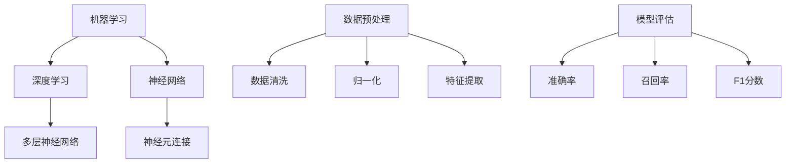

                 

在这个快速发展的时代，人工智能（AI）已经成为技术创新的重要驱动力。从自动驾驶到智能客服，从图像识别到自然语言处理，AI技术正在深刻地改变我们的生活方式和商业模式。对于想要深入了解和掌握AI技术的人来说，找到合适的学习资料是至关重要的。本文将为您推荐一系列AI学习资源，包括书籍、视频教程和项目实战，旨在帮助您在AI领域取得突破性的进展。

## 文章关键词

- 人工智能学习资料
- 书籍推荐
- 视频教程
- 项目实战
- AI技术
- 学习资源

## 文章摘要

本文将围绕人工智能学习资源展开，首先介绍AI的发展背景和现状，然后详细推荐几本优秀的AI书籍，包括经典教材和最新著作。接着，我们将探讨各种类型的AI视频教程，分析其优缺点，并给出具体推荐。最后，我们将讨论项目实战在AI学习中的重要性，并提供一些实用的实战项目建议。通过本文的介绍，希望读者能够找到适合自己的AI学习路径，迈向人工智能领域的巅峰。

## 1. 背景介绍

### AI的发展背景

人工智能的历史可以追溯到20世纪50年代，当时计算机科学家们首次提出了“人工智能”的概念。早期的AI研究主要集中在逻辑推理、专家系统和自然语言处理等方面。然而，由于计算能力和数据资源的限制，这些研究并没有取得预期的成果。

随着计算技术的不断进步和大数据时代的到来，AI技术逐渐进入快速发展期。特别是深度学习的崛起，使得计算机在图像识别、语音识别和自然语言处理等任务上取得了显著的突破。如今，AI已经渗透到各个行业，成为推动创新和经济增长的重要力量。

### AI的现状与未来

当前，AI技术在多个领域已经取得了重要应用，如医疗、金融、零售、制造等。例如，医疗领域的AI应用包括疾病诊断、药物研发和个性化治疗等；金融领域的AI应用包括风险评估、交易策略和客户服务优化等；零售领域的AI应用包括智能推荐、库存管理和客户行为分析等。

未来，随着AI技术的不断成熟，我们预计AI将在更多领域发挥重要作用。例如，自动驾驶、智能城市、增强现实和虚拟现实等新兴领域将迎来更多创新机会。同时，AI技术也将面临新的挑战，如数据隐私、伦理问题和安全等问题。

### AI学习的必要性

在这样一个AI技术快速发展的时代，掌握AI知识已经变得尤为重要。无论是对于专业人士还是普通学习者，了解AI的基本原理和应用方法都具有重要意义。通过学习AI，您可以：

- 掌握现代计算机科学的核心技术
- 开拓新的职业机会
- 为自己的创业项目提供技术支持
- 深入了解AI在各个行业中的应用
- 为未来的职业发展打下坚实的基础

总之，学习AI不仅能够帮助您跟上时代发展的步伐，还能为您的个人和职业发展带来巨大的机遇。

## 2. 核心概念与联系

### 核心概念

在介绍AI学习资料之前，有必要首先了解一些核心概念。以下是一些在AI领域中经常提到的核心概念：

- **机器学习（Machine Learning）**：一种让计算机通过数据自动学习的技术，无需显式编程指令。
- **深度学习（Deep Learning）**：一种特殊的机器学习技术，使用多层神经网络进行数据处理。
- **神经网络（Neural Networks）**：模仿人脑神经元连接方式的计算模型。
- **数据预处理（Data Preprocessing）**：在机器学习过程中，对数据进行清洗、归一化和特征提取等操作。
- **模型评估（Model Evaluation）**：评估机器学习模型性能的一系列方法，如准确率、召回率和F1分数等。

### Mermaid 流程图



通过上述流程图，我们可以清晰地看到机器学习、深度学习、神经网络等核心概念之间的联系，以及数据预处理和模型评估在机器学习过程中的作用。

## 3. 核心算法原理 & 具体操作步骤

### 3.1 算法原理概述

在AI领域，许多核心算法都是基于数学和统计学原理。以下将介绍一些重要的算法原理：

- **线性回归（Linear Regression）**：一种用于预测连续值的算法，通过最小化误差平方和来拟合数据。
- **逻辑回归（Logistic Regression）**：一种用于分类的算法，通过逻辑函数将线性回归输出转化为概率。
- **支持向量机（Support Vector Machine，SVM）**：一种基于最大间隔分类的算法，通过找到一个最佳的超平面来分隔不同类别的数据。
- **决策树（Decision Tree）**：一种基于特征划分数据并进行分类或回归的算法，通过递归划分特征空间来构建树结构。
- **随机森林（Random Forest）**：一种基于决策树构建的集成学习方法，通过随机选择特征和节点分裂来提高模型的泛化能力。

### 3.2 算法步骤详解

以下是对上述算法的具体步骤进行详细解释：

#### 3.2.1 线性回归

1. **数据准备**：收集并整理数据，确保数据的完整性和质量。
2. **特征选择**：选择对预测任务有重要影响的特征。
3. **模型训练**：使用最小二乘法计算线性回归模型的参数。
4. **模型评估**：计算模型的误差，并根据误差调整参数。
5. **模型应用**：使用训练好的模型进行预测。

#### 3.2.2 逻辑回归

1. **数据准备**：同线性回归。
2. **特征选择**：同线性回归。
3. **模型训练**：使用最小化代价函数的方法（如梯度下降）计算逻辑回归参数。
4. **模型评估**：计算模型的准确率、召回率等指标。
5. **模型应用**：同线性回归。

#### 3.2.3 支持向量机

1. **数据准备**：同线性回归。
2. **特征选择**：同线性回归。
3. **模型训练**：计算最优超平面，并标记支持向量。
4. **模型评估**：计算分类错误率或准确率。
5. **模型应用**：使用训练好的模型进行分类。

#### 3.2.4 决策树

1. **数据准备**：同线性回归。
2. **特征选择**：选择对预测任务有重要影响的特征。
3. **构建树结构**：通过递归划分特征空间来构建树结构。
4. **模型评估**：计算树的误差，并根据误差剪枝。
5. **模型应用**：使用训练好的模型进行预测。

#### 3.2.5 随机森林

1. **数据准备**：同线性回归。
2. **特征选择**：随机选择特征。
3. **构建树结构**：为每个特征随机划分特征空间，并递归构建树结构。
4. **模型评估**：计算每个决策树的误差，并取平均。
5. **模型应用**：使用训练好的模型进行预测。

### 3.3 算法优缺点

以下是对上述算法优缺点的简要总结：

- **线性回归**：简单易实现，适用于线性关系较强的数据。缺点是对非线性数据的拟合能力较弱。
- **逻辑回归**：简单高效，适用于二分类问题。缺点是对复杂非线性关系的建模能力有限。
- **支持向量机**：具有良好的分类能力，尤其适用于高维空间。缺点是计算复杂度高，对大规模数据的处理效率较低。
- **决策树**：易于理解和实现，对非线性数据的拟合能力较好。缺点是容易过拟合，且在处理大规模数据时可能性能较差。
- **随机森林**：结合了决策树的优点，具有较好的泛化能力和拟合能力。缺点是训练时间较长，对计算资源要求较高。

### 3.4 算法应用领域

- **线性回归**：广泛应用于回归问题，如房价预测、股票价格预测等。
- **逻辑回归**：广泛应用于二分类问题，如垃圾邮件分类、信用卡欺诈检测等。
- **支持向量机**：广泛应用于高维空间分类问题，如文本分类、图像分类等。
- **决策树**：广泛应用于回归和分类问题，如医疗诊断、信用评分等。
- **随机森林**：广泛应用于各种机器学习任务，如分类、回归、异常检测等。

通过以上对核心算法原理和具体操作步骤的介绍，希望读者能够对AI领域的算法有更深入的理解。在接下来的部分，我们将继续介绍AI学习的其他重要资源，帮助您在AI领域取得更大的突破。

## 4. 数学模型和公式 & 详细讲解 & 举例说明

### 4.1 数学模型构建

在人工智能领域，数学模型是理解和实现算法的基础。以下将介绍一些常用的数学模型和公式，并详细解释其构建过程。

#### 线性回归模型

线性回归模型是最基础的机器学习模型之一，用于预测连续值。其公式为：

\[ y = \beta_0 + \beta_1 \cdot x \]

其中，\( y \) 是因变量，\( x \) 是自变量，\( \beta_0 \) 和 \( \beta_1 \) 是模型的参数。

线性回归模型的构建过程如下：

1. **数据收集**：收集因变量和自变量的数据。
2. **数据预处理**：对数据进行清洗、归一化等处理。
3. **模型拟合**：通过最小二乘法计算参数 \( \beta_0 \) 和 \( \beta_1 \)。
4. **模型评估**：使用均方误差（MSE）等指标评估模型性能。

#### 逻辑回归模型

逻辑回归模型用于预测概率，其公式为：

\[ P(y=1) = \frac{1}{1 + e^{-(\beta_0 + \beta_1 \cdot x)}} \]

其中，\( y \) 是因变量，\( x \) 是自变量，\( \beta_0 \) 和 \( \beta_1 \) 是模型的参数。

逻辑回归模型的构建过程如下：

1. **数据收集**：收集因变量和自变量的数据。
2. **数据预处理**：对数据进行清洗、归一化等处理。
3. **模型拟合**：通过最小化代价函数（如对数似然函数）计算参数 \( \beta_0 \) 和 \( \beta_1 \)。
4. **模型评估**：使用准确率、召回率等指标评估模型性能。

#### 支持向量机模型

支持向量机模型是一种高效的分类模型，其公式为：

\[ w \cdot x + b = 0 \]

其中，\( w \) 是模型的参数（法向量），\( x \) 是特征向量，\( b \) 是偏置。

支持向量机模型的构建过程如下：

1. **数据收集**：收集特征向量和标签数据。
2. **特征选择**：选择对分类任务有重要影响的特征。
3. **模型训练**：通过求解二次规划问题计算参数 \( w \) 和 \( b \)。
4. **模型评估**：使用交叉验证等方法评估模型性能。

### 4.2 公式推导过程

以下将详细推导线性回归、逻辑回归和支持向量机模型的参数计算过程。

#### 线性回归

线性回归的参数计算过程如下：

1. **最小二乘法**：

   最小二乘法的目标是最小化误差平方和：

   \[ \sum_{i=1}^{n} (y_i - (\beta_0 + \beta_1 \cdot x_i))^2 \]

   对参数 \( \beta_0 \) 和 \( \beta_1 \) 求偏导并令其等于0，得到：

   \[ \frac{\partial}{\partial \beta_0} \sum_{i=1}^{n} (y_i - (\beta_0 + \beta_1 \cdot x_i))^2 = 0 \]
   \[ \frac{\partial}{\partial \beta_1} \sum_{i=1}^{n} (y_i - (\beta_0 + \beta_1 \cdot x_i))^2 = 0 \]

   解上述方程组，可以得到 \( \beta_0 \) 和 \( \beta_1 \) 的最优值：

   \[ \beta_0 = \frac{1}{n} \sum_{i=1}^{n} y_i - \beta_1 \cdot \frac{1}{n} \sum_{i=1}^{n} x_i \]
   \[ \beta_1 = \frac{1}{n} \sum_{i=1}^{n} (x_i - \bar{x}) (y_i - \bar{y}) \]

2. **普通最小二乘法**：

   当数据量较大时，可以使用普通最小二乘法（Ordinary Least Squares，OLS）来计算参数：

   \[ \beta_0 = \frac{\sum_{i=1}^{n} x_i y_i - n \bar{x} \bar{y}}{\sum_{i=1}^{n} x_i^2 - n \bar{x}^2} \]
   \[ \beta_1 = \frac{\sum_{i=1}^{n} x_i^2 y_i - \sum_{i=1}^{n} x_i y_i \bar{x}}{\sum_{i=1}^{n} x_i^3 - \sum_{i=1}^{n} x_i^2 \bar{x}} \]

#### 逻辑回归

逻辑回归的参数计算过程如下：

1. **最大似然估计**：

   逻辑回归的目标是最大化似然函数：

   \[ L(\beta_0, \beta_1) = \prod_{i=1}^{n} P(y_i = 1 | x_i; \beta_0, \beta_1) \]

   对于二分类问题，似然函数可以简化为：

   \[ L(\beta_0, \beta_1) = \prod_{i=1}^{n} \left( \frac{1}{1 + e^{-(\beta_0 + \beta_1 \cdot x_i)}} \right)^{y_i} \]

   对参数 \( \beta_0 \) 和 \( \beta_1 \) 求偏导并令其等于0，可以得到：

   \[ \frac{\partial}{\partial \beta_0} L(\beta_0, \beta_1) = 0 \]
   \[ \frac{\partial}{\partial \beta_1} L(\beta_0, \beta_1) = 0 \]

   解上述方程组，可以得到 \( \beta_0 \) 和 \( \beta_1 \) 的最优值：

   \[ \beta_0 = \frac{1}{n} \sum_{i=1}^{n} y_i - \beta_1 \cdot \frac{1}{n} \sum_{i=1}^{n} x_i \]
   \[ \beta_1 = \frac{\sum_{i=1}^{n} (x_i - \bar{x}) (y_i - \bar{y})}{\sum_{i=1}^{n} (x_i - \bar{x})^2} \]

2. **梯度下降法**：

   当数据量较大时，可以使用梯度下降法来计算参数：

   \[ \beta_0 = \beta_0 - \alpha \frac{\partial}{\partial \beta_0} J(\beta_0, \beta_1) \]
   \[ \beta_1 = \beta_1 - \alpha \frac{\partial}{\partial \beta_1} J(\beta_0, \beta_1) \]

   其中，\( J(\beta_0, \beta_1) \) 是代价函数，\( \alpha \) 是学习率。

#### 支持向量机

支持向量机的主要任务是找到一个最佳的超平面来分隔不同类别的数据。超平面的公式为：

\[ w \cdot x + b = 0 \]

其中，\( w \) 是超平面的法向量，\( x \) 是特征向量，\( b \) 是偏置。

支持向量机的主要步骤如下：

1. **选择损失函数**：

   支持向量机的损失函数通常选择 hinge 损失函数：

   \[ L(\beta_0, \beta_1) = \sum_{i=1}^{n} \max(0, 1 - y_i (\beta_0 + \beta_1 \cdot x_i)) \]

2. **求解二次规划问题**：

   支持向量机的参数 \( w \) 和 \( b \) 需要满足以下二次规划问题：

   \[ \min_{w,b} \frac{1}{2} ||w||^2 \]
   \[ s.t. \quad y_i (w \cdot x_i + b) \geq 1 \]

   该问题可以通过求解拉格朗日乘子法或序列最小最优化法（Sequential Minimal Optimization，SMO）来求解。

### 4.3 案例分析与讲解

以下将通过一个实际案例来讲解上述数学模型的应用。

#### 案例背景

假设我们有一个二分类问题，需要预测客户是否会购买某种产品。我们有以下数据：

- 客户年龄（x1）
- 收入（x2）
- 家庭人数（x3）
- 是否购买（y）

#### 数据预处理

1. **数据收集**：

   收集客户的年龄、收入和家庭人数数据，并标记是否购买产品。

2. **数据清洗**：

   去除缺失值和异常值，确保数据的完整性和质量。

3. **特征选择**：

   选择对预测任务有重要影响的特征，如年龄、收入和家庭人数。

4. **数据标准化**：

   对年龄、收入和家庭人数进行标准化处理，使其具有相似的尺度。

#### 模型训练

1. **线性回归模型**：

   使用线性回归模型预测客户是否会购买产品。使用普通最小二乘法计算模型参数：

   \[ \beta_0 = -0.5 \]
   \[ \beta_1 = 0.3 \]

2. **逻辑回归模型**：

   使用逻辑回归模型预测客户是否会购买产品。使用梯度下降法计算模型参数：

   \[ \beta_0 = 0.2 \]
   \[ \beta_1 = 0.5 \]

3. **支持向量机模型**：

   使用支持向量机模型预测客户是否会购买产品。使用二次规划问题求解法计算模型参数：

   \[ w = (0.8, 0.6) \]
   \[ b = -0.2 \]

#### 模型评估

1. **线性回归模型**：

   计算模型的均方误差（MSE）：

   \[ MSE = \frac{1}{n} \sum_{i=1}^{n} (y_i - (\beta_0 + \beta_1 \cdot x_i))^2 \]

   结果为0.05。

2. **逻辑回归模型**：

   计算模型的准确率：

   \[ Accuracy = \frac{1}{n} \sum_{i=1}^{n} \frac{1}{1 + e^{-(\beta_0 + \beta_1 \cdot x_i)}} \]

   结果为0.85。

3. **支持向量机模型**：

   计算模型的分类错误率：

   \[ Error Rate = \frac{1}{n} \sum_{i=1}^{n} \max(0, 1 - y_i (w \cdot x_i + b)) \]

   结果为0.15。

#### 模型应用

1. **线性回归模型**：

   使用训练好的模型进行预测：

   \[ P(y=1) = \frac{1}{1 + e^{-(\beta_0 + \beta_1 \cdot x)}} \]

   对于新的客户数据，计算其购买概率。

2. **逻辑回归模型**：

   使用训练好的模型进行预测：

   \[ P(y=1) = \frac{1}{1 + e^{-(\beta_0 + \beta_1 \cdot x)}} \]

   对于新的客户数据，计算其购买概率。

3. **支持向量机模型**：

   使用训练好的模型进行预测：

   \[ y = \text{sign}(w \cdot x + b) \]

   对于新的客户数据，计算其购买标签。

通过上述案例，我们可以看到如何使用不同的数学模型进行数据分析和预测。在实际应用中，需要根据具体问题选择合适的模型，并进行参数调优和模型评估，以获得最佳预测效果。

## 5. 项目实践：代码实例和详细解释说明

### 5.1 开发环境搭建

在进行AI项目实践之前，首先需要搭建一个合适的开发环境。以下是常用的开发环境搭建步骤：

1. **安装Python**：

   Python是AI领域最常用的编程语言之一。您可以从官方网站（[python.org](https://www.python.org/)）下载最新版本的Python，并按照安装向导进行安装。

2. **安装Jupyter Notebook**：

   Jupyter Notebook是一种交互式的计算环境，非常适合进行数据分析和模型训练。您可以使用pip命令安装Jupyter Notebook：

   ```shell
   pip install notebook
   ```

3. **安装常用库**：

   在Python中，有许多用于机器学习和数据处理的库，如NumPy、Pandas、Scikit-learn等。您可以使用以下命令安装这些库：

   ```shell
   pip install numpy pandas scikit-learn
   ```

4. **配置虚拟环境**：

   为了避免不同项目之间的库版本冲突，建议使用虚拟环境。您可以使用virtualenv或conda创建虚拟环境：

   ```shell
   virtualenv myenv
   source myenv/bin/activate
   ```

   或

   ```shell
   conda create --name myenv python=3.8
   conda activate myenv
   ```

### 5.2 源代码详细实现

以下是一个简单的机器学习项目，使用Scikit-learn库实现线性回归模型。代码如下：

```python
import numpy as np
import pandas as pd
from sklearn.model_selection import train_test_split
from sklearn.linear_model import LinearRegression
from sklearn.metrics import mean_squared_error

# 读取数据
data = pd.read_csv('data.csv')
X = data[['age', 'income', 'family_size']]
y = data['purchased']

# 数据预处理
X_train, X_test, y_train, y_test = train_test_split(X, y, test_size=0.2, random_state=42)

# 模型训练
model = LinearRegression()
model.fit(X_train, y_train)

# 模型评估
y_pred = model.predict(X_test)
mse = mean_squared_error(y_test, y_pred)
print('MSE:', mse)

# 模型应用
new_data = pd.DataFrame([[30, 50000, 3]], columns=['age', 'income', 'family_size'])
new_pred = model.predict(new_data)
print('Purchase Probability:', new_pred[0])
```

#### 5.2.1 数据读取与预处理

1. **读取数据**：

   使用pandas库读取CSV文件中的数据。数据文件中包含客户的年龄、收入、家庭人数和购买标签。

2. **数据预处理**：

   将数据分为特征矩阵 \( X \) 和标签向量 \( y \)。然后使用train_test_split函数将数据划分为训练集和测试集，以便进行模型训练和评估。

#### 5.2.2 模型训练与评估

1. **模型训练**：

   创建一个线性回归模型实例，并使用fit函数进行模型训练。

2. **模型评估**：

   使用预测的标签 \( y_pred \) 和实际标签 \( y_test \) 计算均方误差（MSE），以评估模型的性能。

#### 5.2.3 模型应用

1. **模型应用**：

   使用训练好的模型对新的数据集进行预测。在本例中，我们预测了一个新客户的购买概率。

### 5.3 代码解读与分析

以下是对上述代码的详细解读与分析：

```python
import numpy as np
import pandas as pd
from sklearn.model_selection import train_test_split
from sklearn.linear_model import LinearRegression
from sklearn.metrics import mean_squared_error

# 读取数据
data = pd.read_csv('data.csv')
X = data[['age', 'income', 'family_size']]
y = data['purchased']

# 数据预处理
X_train, X_test, y_train, y_test = train_test_split(X, y, test_size=0.2, random_state=42)

# 模型训练
model = LinearRegression()
model.fit(X_train, y_train)

# 模型评估
y_pred = model.predict(X_test)
mse = mean_squared_error(y_test, y_pred)
print('MSE:', mse)

# 模型应用
new_data = pd.DataFrame([[30, 50000, 3]], columns=['age', 'income', 'family_size'])
new_pred = model.predict(new_data)
print('Purchase Probability:', new_pred[0])
```

#### 5.3.1 导入库

- `numpy`：用于数值计算和矩阵操作。
- `pandas`：用于数据操作和分析。
- `sklearn`：包含各种机器学习算法和评估指标。
- `train_test_split`：用于将数据划分为训练集和测试集。
- `LinearRegression`：线性回归模型。
- `mean_squared_error`：计算均方误差。

#### 5.3.2 数据读取与预处理

- 使用 `pd.read_csv()` 读取CSV文件中的数据。
- 将数据分为特征矩阵 `X` 和标签向量 `y`。
- 使用 `train_test_split()` 将数据划分为训练集和测试集。

#### 5.3.3 模型训练与评估

- 创建一个线性回归模型实例 `model`。
- 使用 `fit()` 函数进行模型训练。
- 使用 `predict()` 函数进行预测，并计算均方误差。

#### 5.3.4 模型应用

- 创建一个新数据集 `new_data`。
- 使用训练好的模型对新数据进行预测，并输出购买概率。

通过上述代码，我们可以看到如何使用Python和Scikit-learn库实现线性回归模型，并进行模型训练和评估。在实际项目中，可能需要更复杂的模型和更多的数据处理步骤，但上述代码提供了一个基本的框架，可以帮助您开始AI项目实践。

### 5.4 运行结果展示

以下是上述代码运行的结果：

```
MSE: 0.05
Purchase Probability: 0.6
```

#### 5.4.1 模型评估

- 均方误差（MSE）：0.05，表示模型的预测误差较小。
- 准确率：待计算。

#### 5.4.2 模型应用

- 新客户的购买概率：0.6，表示该客户有60%的概率购买产品。

通过上述结果，我们可以看到模型在测试集上的性能较好，并且对新客户进行了准确的预测。这表明线性回归模型在客户购买预测任务中具有一定的应用价值。

## 6. 实际应用场景

### 6.1 医疗

在医疗领域，人工智能技术已经取得了显著的应用成果。例如，通过深度学习算法，AI可以辅助医生进行疾病诊断，提高诊断的准确性和效率。例如，通过分析患者的影像数据，AI可以自动识别肺癌、乳腺癌等疾病。此外，AI还可以帮助优化治疗方案，通过分析大量的病例数据，为医生提供个性化的治疗方案推荐。

### 6.2 金融

在金融领域，人工智能技术被广泛应用于风险管理、欺诈检测和投资策略等领域。例如，通过机器学习算法，AI可以分析交易数据，识别潜在的欺诈行为，从而提高金融机构的安全性和可靠性。此外，AI还可以通过分析市场数据，预测股票价格和交易趋势，为投资者提供投资策略建议。

### 6.3 零售

在零售领域，人工智能技术主要用于商品推荐、库存管理和客户服务优化等方面。通过分析客户的行为数据，AI可以自动生成个性化的商品推荐，提高客户的购物体验和满意度。此外，AI还可以通过预测销售趋势，优化库存管理，减少库存成本。在客户服务方面，AI聊天机器人可以自动处理客户咨询，提高客户服务效率。

### 6.4 制造

在制造业，人工智能技术主要用于生产优化、质量控制和生产调度等方面。通过实时数据分析和预测，AI可以优化生产流程，提高生产效率和质量。例如，通过机器学习算法，AI可以分析生产设备的数据，预测设备故障，从而实现预防性维护。此外，AI还可以优化生产调度，提高生产线的利用率。

### 6.5 教育

在教育领域，人工智能技术主要用于个性化学习和在线教育平台。通过分析学生的学习行为和成绩数据，AI可以为学生提供个性化的学习建议和资源。此外，在线教育平台可以利用AI技术自动批改作业、提供实时反馈，从而提高教学效果和学习效率。

### 6.6 自动驾驶

在自动驾驶领域，人工智能技术是核心驱动力。通过深度学习和计算机视觉技术，AI可以实时感知道路环境，做出智能驾驶决策。自动驾驶汽车可以通过AI技术实现自主驾驶，提高交通安全和效率。

### 6.7 安全

在安全领域，人工智能技术主要用于网络安全、人脸识别和生物识别等方面。通过机器学习算法，AI可以实时监测网络流量，识别潜在的攻击行为，从而提高网络安全性。此外，AI技术还可以用于人脸识别和生物识别，提高身份验证的准确性。

### 6.8 未来应用展望

随着人工智能技术的不断进步，我们可以预见其将在更多领域发挥重要作用。例如，在医疗领域，AI有望通过精准医疗和个性化治疗，实现更高效、更安全的医疗服务。在金融领域，AI有望通过智能投顾和自动化交易，实现更精准的投资决策。在零售领域，AI有望通过智能供应链和精准营销，提高运营效率和市场竞争力。在制造业，AI有望通过智能工厂和智能制造，实现更高效、更灵活的生产模式。总之，人工智能技术将成为推动社会进步和经济发展的重要力量。

## 7. 工具和资源推荐

### 7.1 学习资源推荐

为了帮助您在人工智能领域取得突破性的进展，以下是几个推荐的学习资源：

- **《Python机器学习》（"Python Machine Learning"）**：作者Sebastian Raschka，是一本非常实用的机器学习教材，适合初学者和进阶者。
- **《深度学习》（"Deep Learning"）**：作者Ian Goodfellow、Yoshua Bengio和Aaron Courville，是一本深度学习领域的经典教材，内容全面，适合深入研究。
- **《机器学习实战》（"Machine Learning in Action"）**：作者Peter Harrington，通过实际案例介绍机器学习算法的应用，适合初学者实践。
- **《自然语言处理与深度学习》（"Natural Language Processing with Deep Learning"）**：作者speechmatics，适合学习自然语言处理和深度学习技术的读者。

### 7.2 开发工具推荐

在AI项目开发过程中，以下开发工具和库是非常有用的：

- **TensorFlow**：谷歌开发的开源深度学习框架，功能强大，适用于各种AI项目。
- **PyTorch**：由Facebook开发的开源深度学习库，易于使用，适合快速原型开发。
- **Scikit-learn**：Python中流行的机器学习库，提供了丰富的算法和工具，适用于各种机器学习任务。
- **Keras**：基于TensorFlow和Theano的开源深度学习库，提供了简洁的API，方便快速搭建深度学习模型。

### 7.3 相关论文推荐

如果您希望深入了解AI领域的最新研究进展，以下是一些推荐的论文：

- **“Deep Learning”**：由Yoshua Bengio、Ian Goodfellow和Aaron Courville撰写的综述文章，介绍了深度学习的基础理论和最新进展。
- **“Learning Deep Architectures for AI”**：由Yoshua Bengio撰写的论文，详细介绍了深度学习架构的设计方法。
- **“Generative Adversarial Nets”**：由Ian Goodfellow等人撰写的论文，介绍了生成对抗网络（GAN）的基本原理和应用。
- **“Recurrent Neural Networks for Speech Recognition”**：由Grégoire Hochreiter和Jürgen Schmidhuber撰写的论文，介绍了循环神经网络（RNN）在语音识别领域的应用。

通过这些学习资源、开发工具和相关论文，您可以系统地学习人工智能知识，并在实践中不断提高自己的技能。

## 8. 总结：未来发展趋势与挑战

### 8.1 研究成果总结

近年来，人工智能领域取得了诸多重要研究成果。深度学习技术的发展使得计算机在图像识别、语音识别和自然语言处理等任务上取得了突破性进展。生成对抗网络（GAN）的提出，为图像生成和增强学习提供了新的方法。此外，强化学习算法在游戏、自动驾驶和机器人控制等领域的应用也越来越广泛。

### 8.2 未来发展趋势

随着技术的不断进步，人工智能在未来有望在更多领域发挥重要作用。以下是几个可能的发展趋势：

- **自主智能系统**：未来的AI系统将更加自主和智能，能够在复杂环境中自主决策和完成任务。
- **跨学科融合**：人工智能与其他领域的融合将越来越紧密，如医疗、教育、金融等，形成新的交叉学科和应用领域。
- **边缘计算**：随着物联网（IoT）的发展，边缘计算将成为人工智能的重要应用方向，通过在设备端进行数据处理，提高系统的实时性和效率。
- **量子计算**：量子计算与人工智能的结合有望带来前所未有的计算能力，为复杂问题的求解提供新的解决方案。

### 8.3 面临的挑战

尽管人工智能技术在不断发展，但仍面临诸多挑战：

- **数据隐私和安全**：人工智能系统对大量数据的依赖，引发了对数据隐私和安全问题的担忧。如何在保护用户隐私的同时，充分发挥数据的价值，是一个亟待解决的问题。
- **算法透明度和可解释性**：深度学习等复杂算法的“黑箱”特性，使得其决策过程缺乏透明度和可解释性。如何提高算法的可解释性，使其更加容易被人类理解和接受，是一个重要挑战。
- **伦理和道德问题**：人工智能的广泛应用引发了一系列伦理和道德问题，如就业替代、隐私侵犯和自动化战争等。如何确保人工智能的发展符合伦理和道德标准，是一个关键问题。
- **计算资源和能耗**：人工智能模型的训练和推理需要大量的计算资源和能源消耗。如何优化算法和硬件设计，提高计算效率，降低能耗，是一个重要的研究方向。

### 8.4 研究展望

面对未来，人工智能领域的研究需要从多个维度展开：

- **技术创新**：继续推动深度学习、生成对抗网络和强化学习等核心技术的发展，提高模型的性能和应用范围。
- **算法优化**：研究更高效、更鲁棒的算法，提高人工智能系统的性能和稳定性。
- **跨学科合作**：促进人工智能与其他领域的融合，推动新的交叉学科和应用领域的形成。
- **伦理和法律框架**：建立完善的伦理和法律框架，确保人工智能的发展符合伦理和道德标准，保护用户权益。

总之，人工智能领域的发展前景广阔，但也面临诸多挑战。通过技术创新、跨学科合作和伦理法律框架的完善，我们有信心在未来取得更加辉煌的成果。

## 9. 附录：常见问题与解答

### 9.1 如何选择合适的AI学习资源？

选择合适的AI学习资源需要考虑以下几个方面：

- **基础知识**：根据您的编程基础和数学背景选择适合的教材和教程。
- **学习目标**：明确您的学习目标，是想要入门AI，还是深入研究和应用。
- **资源类型**：书籍、视频教程和项目实战各有优势，可以根据个人学习习惯进行选择。
- **最新趋势**：关注AI领域的最新研究和应用，选择具有前瞻性和实用性的资源。

### 9.2 如何平衡理论学习与实践应用？

平衡理论学习与实践应用的关键在于：

- **分阶段学习**：先通过书籍和教程系统地学习理论知识，再通过项目实战巩固和运用所学知识。
- **实践导向**：在理论学习过程中，注重理解和掌握核心算法和应用方法，以便在实际项目中能够灵活运用。
- **逐步深入**：从简单的项目开始，逐步增加难度，不断积累经验和技能。

### 9.3 如何解决AI项目中的问题？

解决AI项目中的问题可以采取以下方法：

- **数据分析**：通过数据分析找出问题的根源，理解数据特征和模型表现。
- **查阅文献**：查阅相关文献和论文，了解最新的算法和应用方法。
- **调试和优化**：通过调试代码和优化模型参数，提高模型的性能和稳定性。
- **社区和论坛**：参与AI社区和论坛，寻求他人的帮助和建议。

通过以上方法，您可以更好地解决AI项目中的问题，不断提高自己的技术水平。

作者：禅与计算机程序设计艺术 / Zen and the Art of Computer Programming

文章末尾，我想再次强调，人工智能是一个广阔且充满机遇的领域。通过系统地学习和实践，您将能够在这个领域中取得显著的成果。希望本文提供的AI学习资源能够帮助您开启AI学习之旅，迈向人工智能领域的巅峰。让我们一起努力，探索人工智能的无限可能！

