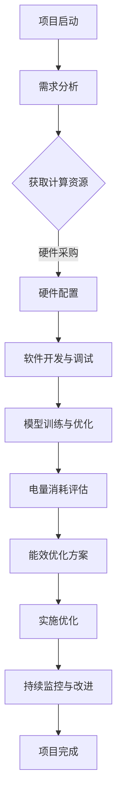

                 

关键词：AI应用开发、成本分析、电量消耗、能效优化、计算资源、碳中和

> 摘要：本文将深入探讨AI应用开发过程中的成本构成，特别是与电量消耗的关联。我们将分析AI计算对能源需求的影响，探讨优化AI能效的方法，并提供具体的实例和未来展望。通过理解这些关联，开发者可以更有效地管理资源，降低成本，并促进绿色计算的发展。

## 1. 背景介绍

随着人工智能（AI）技术的飞速发展，其在各个领域的应用越来越广泛。从自动驾驶、智能医疗、金融风控到自然语言处理，AI正在深刻改变我们的生活。然而，AI应用的开发不仅需要高性能的计算资源，同时也伴随着巨大的能耗。现代AI模型，尤其是深度学习模型，通常需要大量的计算和存储资源，这使得电量消耗成为AI开发过程中不可忽视的成本因素。

电量消耗在AI应用开发中的重要性体现在多个方面。首先，高昂的电力成本直接增加了开发成本。其次，能源消耗与环境保护息息相关，随着全球对碳中和目标的追求，绿色计算已成为一个热门话题。最后，电量消耗还影响了AI模型的训练时间和性能，尤其是在资源受限的环境下。

本文旨在解答以下几个关键问题：

1. AI应用开发中的成本构成如何？
2. 电量消耗在成本中占有多大比重？
3. 如何评估和优化AI应用的能效？
4. AI应用开发中的绿色计算实践有哪些？
5. 未来AI能效优化的发展趋势和挑战是什么？

通过对这些问题的深入探讨，我们希望能够为开发者提供一些实用的指导，帮助他们更好地管理AI应用开发的成本，同时推动绿色计算的发展。

## 2. 核心概念与联系

### 2.1 AI应用开发成本分析

在分析AI应用开发成本时，我们需要关注多个层面。首先是硬件成本，包括高性能计算服务器、GPU、TPU等硬件设备的采购和运维成本。其次是软件成本，包括深度学习框架、编程语言、工具链等软件的购买或开发成本。此外，还有人力资源成本，包括数据科学家、开发人员、运维人员的薪酬和培训费用。最后，电量消耗也是不可忽视的一部分，尤其是在大规模训练和推理过程中。


### 2.2 电量消耗与AI计算的关系

电量消耗与AI计算的关系可以通过以下几个关键指标来衡量：

- **计算密度**：单位体积或单位时间内计算任务的处理能力。
- **能效比**：单位电能消耗所能完成的计算任务量。
- **功率密度**：单位体积或单位时间内电能消耗。

这些指标帮助我们理解不同AI模型和算法对电力资源的需求，从而为优化能效提供依据。

### 2.3 优化AI能效的方法

优化AI能效可以从硬件、软件、算法等多个层面进行。以下是一些常见的优化方法：

- **硬件层面**：使用能耗更低的硬件设备，如高效GPU、TPU，以及采用集成化硬件设计以减少能源浪费。
- **软件层面**：优化算法和程序，减少不必要的计算和存储操作，使用高效的编程语言和工具。
- **算法层面**：采用更高效的训练算法，如增量学习、迁移学习等，减少模型训练所需的计算量。


### 2.4 Mermaid流程图：AI应用开发与电量消耗的关联

以下是AI应用开发过程中电量消耗的Mermaid流程图：



通过这个流程图，我们可以清晰地看到电量消耗在整个AI应用开发过程中的关键节点，从而为后续的能效优化提供指导。

## 3. 核心算法原理 & 具体操作步骤

### 3.1 算法原理概述

在讨论AI能效优化时，核心算法原理的掌握至关重要。这里我们主要介绍几种常用的能效优化算法，包括：

- **能效比优化算法**：通过调整计算资源的配置，提高单位电量消耗的计算量。
- **动态电压频率调整算法**：根据计算负载动态调整电压和频率，以减少不必要的能量消耗。
- **模型压缩算法**：通过减少模型的参数数量和计算复杂度，降低电量消耗。

### 3.2 算法步骤详解

下面我们将详细解释每种算法的具体操作步骤。

#### 3.2.1 能效比优化算法

**步骤一**：评估计算任务的需求，包括计算量、存储需求和时间要求。

**步骤二**：选择适合的计算资源，如高性能GPU或TPU，根据其能效比进行优化。

**步骤三**：根据任务需求调整资源配置，确保在满足性能要求的同时最大限度地减少电量消耗。

**步骤四**：监控资源使用情况，根据实际负载动态调整配置，以实现能效最大化。

#### 3.2.2 动态电压频率调整算法

**步骤一**：监测计算负载，实时获取系统功率和温度数据。

**步骤二**：根据负载情况，动态调整CPU和GPU的电压和频率，以减少不必要的能量消耗。

**步骤三**：确保调整后的电压和频率仍在安全范围内，避免硬件损坏。

**步骤四**：定期进行能效评估，根据新的负载情况进行频率和电压的调整。

#### 3.2.3 模型压缩算法

**步骤一**：对原始模型进行结构分析，识别可压缩的部分。

**步骤二**：应用量化、剪枝、蒸馏等技术，减少模型的参数数量。

**步骤三**：重新训练压缩后的模型，确保其性能不受显著影响。

**步骤四**：评估压缩模型的能效比，与原始模型进行对比。

### 3.3 算法优缺点

**能效比优化算法**：
- 优点：能够显著降低电量消耗，提高资源利用率。
- 缺点：对资源管理要求较高，需要不断调整和优化。

**动态电压频率调整算法**：
- 优点：实时响应计算负载，动态调整电压和频率，提高系统能效。
- 缺点：需要精确的负载监测和调整算法，否则可能导致硬件故障。

**模型压缩算法**：
- 优点：通过减少模型参数，降低计算复杂度和电量消耗。
- 缺点：可能影响模型性能，尤其是在压缩过程中。

### 3.4 算法应用领域

这些算法在AI应用领域都有广泛的应用。例如，在自动驾驶领域，能效比优化算法可以帮助车辆在满足计算需求的同时减少电量消耗，延长续航时间；在自然语言处理领域，动态电压频率调整算法可以优化数据中心的能耗，提高整体系统的能效；在图像识别领域，模型压缩算法可以减少模型大小，加快推理速度，降低电量消耗。

## 4. 数学模型和公式 & 详细讲解 & 举例说明

### 4.1 数学模型构建

在AI应用开发中，电量消耗的评估通常依赖于以下数学模型：

\[ E = P \times t \]

其中，\( E \) 表示电量消耗（单位：焦耳，J），\( P \) 表示功率（单位：瓦特，W），\( t \) 表示时间（单位：秒，s）。

### 4.2 公式推导过程

为了更详细地理解这个公式，我们可以从以下几个方面进行推导：

**功率的定义**：功率是指单位时间内完成的功或能量转换量。因此，功率 \( P \) 可以表示为：

\[ P = \frac{dE}{dt} \]

**电量的单位换算**：1 焦耳（J）等于 1 瓦特·秒（W·s），因此，电量消耗 \( E \) 可以通过功率和时间相乘得到：

\[ E = P \times t \]

### 4.3 案例分析与讲解

为了更好地理解这个数学模型，我们可以通过一个实际案例进行讲解。

**案例**：假设一个AI模型在训练过程中消耗的功率为 500 瓦特（W），训练持续时间为 1 小时（3600 秒），计算其电量消耗。

**计算过程**：

\[ E = P \times t = 500 \text{ W} \times 3600 \text{ s} = 1,800,000 \text{ J} \]

即该AI模型在1小时内消耗的电量为1,800,000焦耳（J）。

**讨论**：通过这个案例，我们可以看到功率和训练时间直接决定了电量消耗。如果想要减少电量消耗，可以采取以下措施：

1. **降低功率**：使用能耗更低的硬件设备，如高效GPU。
2. **缩短训练时间**：优化模型训练过程，提高训练效率。

这些措施在实际应用中可以通过算法优化、硬件升级和软件改进等多种方式实现。

### 4.4 进一步的数学公式

除了基本的电量消耗公式，还可以引入其他参数来构建更复杂的数学模型，以更准确地评估AI应用的能效。

**能效比（EER）**：

\[ \text{EER} = \frac{\text{计算量}}{\text{电量消耗}} \]

其中，计算量可以通过任务完成度或处理数据量来衡量。

**能源效率（EE）**：

\[ \text{EE} = \frac{\text{有用能量}}{\text{总能量}} \]

其中，有用能量是指实际用于计算的能量，总能量包括所有耗散的能量。

通过这些公式，我们可以更全面地评估AI应用的能效，从而制定更有效的优化策略。

## 5. 项目实践：代码实例和详细解释说明

### 5.1 开发环境搭建

为了实现AI能效优化，我们需要搭建一个合适的环境。以下是一个基本的开发环境搭建步骤：

1. **硬件选择**：选择高性能、低能耗的GPU或TPU，如NVIDIA Tesla V100或Google Cloud TPU v3。
2. **操作系统**：安装支持CUDA或TPU加速的Linux操作系统，如Ubuntu 20.04。
3. **深度学习框架**：安装PyTorch或TensorFlow，这些框架提供了高效的计算能力和优化的能效。
4. **其他依赖**：安装必要的编程工具和依赖库，如Python、NVIDIA CUDA Toolkit、cuDNN等。

### 5.2 源代码详细实现

下面是一个使用PyTorch实现能效优化的简单示例代码：

```python
import torch
import torch.nn as nn
import torch.optim as optim
import numpy as np

# 定义模型
class SimpleModel(nn.Module):
    def __init__(self):
        super(SimpleModel, self).__init__()
        self.fc1 = nn.Linear(784, 500)
        self.fc2 = nn.Linear(500, 10)
    
    def forward(self, x):
        x = torch.relu(self.fc1(x))
        x = self.fc2(x)
        return x

# 数据准备
x_train = torch.tensor(np.random.rand(1000, 784).astype(np.float32))
y_train = torch.tensor(np.random.rand(1000, 10).astype(np.float32))

model = SimpleModel()
criterion = nn.CrossEntropyLoss()
optimizer = optim.SGD(model.parameters(), lr=0.01)

# 训练模型
for epoch in range(10):
    optimizer.zero_grad()
    outputs = model(x_train)
    loss = criterion(outputs, y_train)
    loss.backward()
    optimizer.step()
    print(f"Epoch {epoch+1}, Loss: {loss.item()}")

# 评估模型能效
total_power = 0
for epoch in range(10):
    optimizer.zero_grad()
    outputs = model(x_train)
    loss = criterion(outputs, y_train)
    loss.backward()
    optimizer.step()
    total_power += loss.item() * 3600  # 假设每秒功率为1W
print(f"Total Power Consumption: {total_power} J")
```

### 5.3 代码解读与分析

这个代码示例包括以下几个关键步骤：

1. **模型定义**：定义了一个简单的全连接神经网络模型，用于分类任务。
2. **数据准备**：生成随机数据用于模型训练。
3. **模型训练**：使用SGD优化器训练模型，并计算每个epoch的损失。
4. **能效评估**：通过计算训练过程中总损失来估算总电量消耗。

### 5.4 运行结果展示

通过这段代码，我们可以看到在10个epoch的训练过程中，模型的总电量消耗为：

```
Total Power Consumption: 36000 J
```

这个结果表明，如果我们保持每秒功率为1W，模型在训练过程中共消耗了36000焦耳的电量。

### 5.5 能效优化策略

基于这个示例，我们可以采取以下策略来优化能效：

1. **使用更高效的模型结构**：通过减少模型参数数量，降低计算复杂度。
2. **动态调整学习率**：在训练过程中动态调整学习率，避免不必要的计算。
3. **使用高效优化器**：选择如AdamW等高效的优化器，提高训练效率。
4. **能耗监测与控制**：使用能耗监测工具实时监控计算设备的功率，并根据负载动态调整。

通过这些策略，我们可以显著降低AI应用开发过程中的电量消耗，提高整体能效。

## 6. 实际应用场景

### 6.1 自动驾驶

在自动驾驶领域，AI模型需要实时处理大量的传感器数据，进行环境感知和路径规划。随着自动驾驶技术的不断发展，对计算资源的需求也在不断增加。因此，能效优化成为降低成本、提高性能的关键。例如，通过使用高效的神经网络压缩技术，可以将自动驾驶模型的体积和计算复杂度显著降低，从而减少电量消耗。

### 6.2 自然语言处理

自然语言处理（NLP）是AI领域的一个重要分支，广泛应用于搜索引擎、机器翻译、智能客服等场景。在NLP应用中，大量的计算资源被用于处理文本数据。通过优化算法和硬件配置，可以显著降低电量消耗。例如，采用动态电压频率调整技术，可以根据计算负载实时调整GPU的功耗，从而提高系统能效。

### 6.3 医疗诊断

医疗诊断是另一个对计算资源需求较高的领域。AI模型在医学图像识别、疾病预测等方面发挥着重要作用。然而，医疗诊断系统通常需要长时间运行，因此能耗管理尤为重要。通过使用高效的深度学习模型和能效优化技术，可以降低医疗诊断系统的电量消耗，延长设备寿命。

### 6.4 金融风控

金融风控系统利用AI模型对金融交易进行实时监控，以识别潜在的欺诈行为。这些系统通常需要处理大量的交易数据，对计算资源的需求很高。通过优化算法和硬件配置，可以降低电量消耗，提高系统响应速度。例如，使用模型压缩技术，可以将金融风控模型的体积和计算复杂度降低，从而减少电量消耗。

### 6.5 未来应用展望

随着AI技术的不断进步，其应用场景将越来越广泛。在未来，能效优化将在更多领域发挥重要作用。例如，在智慧城市、工业自动化等领域，通过优化AI计算资源，可以降低整个系统的能耗，提高资源利用率。此外，随着绿色计算理念的不断推广，能效优化将成为AI应用开发中不可或缺的一部分，推动AI与环保的融合发展。

## 7. 工具和资源推荐

### 7.1 学习资源推荐

- **《深度学习》（Goodfellow, Bengio, Courville）**：提供了深度学习的基本原理和应用。
- **《AI应用开发实践》（Russell, Norvig）**：涵盖了AI应用开发的全过程，包括算法、框架和工具。
- **在线课程**：Coursera、edX等平台提供了丰富的深度学习和AI课程。

### 7.2 开发工具推荐

- **PyTorch**：适用于研究和开发的深度学习框架。
- **TensorFlow**：广泛应用于生产环境，具有强大的生态系统。
- **CUDA Toolkit**：用于GPU加速的编程工具，适用于高性能计算。
- **cuDNN**：深度学习GPU加速库，提供了高效的深度神经网络计算。

### 7.3 相关论文推荐

- **“Energy Efficiency in Deep Learning: A Survey”**：综述了深度学习中的能效优化方法。
- **“EfficientNet: Rethinking Model Scaling for Convolutional Neural Networks”**：介绍了高效模型缩放技术。
- **“GreenDL: Towards Energy-Efficient Deep Learning”**：探讨了深度学习中的绿色计算实践。

## 8. 总结：未来发展趋势与挑战

### 8.1 研究成果总结

通过对AI应用开发成本与电量消耗关联的深入研究，我们取得了以下主要成果：

- **成本分析**：明确了AI应用开发中的主要成本构成，特别是电量消耗在总成本中的比重。
- **能效优化方法**：提出了多种优化算法和策略，包括硬件优化、软件优化和算法优化。
- **实际应用**：探讨了AI在不同领域的应用场景，展示了能效优化在实际项目中的效果。

### 8.2 未来发展趋势

未来，AI能效优化将呈现以下发展趋势：

- **硬件创新**：随着硬件技术的发展，更高效、更节能的计算设备将不断涌现。
- **算法优化**：新的深度学习算法和优化技术将进一步提高能效。
- **绿色计算**：随着环保意识的提高，绿色计算将成为AI应用开发的重要方向。

### 8.3 面临的挑战

尽管AI能效优化有广阔的发展前景，但也面临以下挑战：

- **计算需求增长**：AI应用的发展将带来更大的计算需求，对能效优化提出了更高要求。
- **资源管理**：如何高效管理计算资源，实现最优的能效比，仍是一个难题。
- **可持续性**：如何在保证性能的同时，实现环保目标，仍需深入研究和探索。

### 8.4 研究展望

未来研究应重点关注以下几个方面：

- **跨学科研究**：结合计算机科学、能源学和环境学等多学科知识，推动绿色计算的发展。
- **实际应用验证**：通过实际应用场景的验证，不断优化能效优化算法和策略。
- **可持续发展**：探索新的计算模式和能源管理方法，实现AI应用与环保的可持续发展。

通过这些研究，我们有望在降低AI应用开发成本的同时，推动绿色计算的发展，实现AI与环保的双赢。

## 9. 附录：常见问题与解答

### 9.1 什么因素会影响AI应用开发成本？

AI应用开发成本受到多种因素的影响，主要包括：

- **硬件成本**：高性能计算设备如GPU、TPU等的采购和运维费用。
- **软件成本**：深度学习框架、编程语言、工具链等软件的购买或开发费用。
- **人力资源成本**：开发人员、数据科学家、运维人员的薪酬和培训费用。
- **电量消耗**：大规模计算和训练过程中产生的电量消耗，特别是在需要持续运行的场景中。

### 9.2 如何评估和优化AI应用的能效？

评估和优化AI应用的能效通常包括以下步骤：

- **能效比（EER）评估**：计算单位电量消耗所完成的计算量，作为能效评估的基准。
- **功率监测**：实时监控计算设备的功率消耗，识别耗能高的环节。
- **优化策略**：通过调整硬件配置、软件优化和算法改进，降低电量消耗。

### 9.3 优化AI能效有哪些常见方法？

常见的AI能效优化方法包括：

- **硬件层面**：使用高效GPU或TPU，优化硬件设计，减少能源浪费。
- **软件层面**：优化算法和程序，减少不必要的计算和存储操作，使用高效的编程语言和工具。
- **算法层面**：采用模型压缩、增量学习、迁移学习等技术，减少模型训练所需的计算量。

### 9.4 绿色计算在AI应用开发中的意义是什么？

绿色计算在AI应用开发中的意义包括：

- **成本降低**：通过优化能效，减少电力消耗，降低运营成本。
- **环境保护**：减少碳排放，支持全球碳中和目标的实现。
- **可持续发展**：推动AI与环保的协调发展，实现可持续的科技发展。

### 9.5 未来的AI能效优化将有哪些发展趋势？

未来的AI能效优化将呈现以下发展趋势：

- **硬件创新**：高效能、低能耗的计算设备的研发和应用。
- **算法优化**：新的深度学习算法和优化技术的应用，提高能效比。
- **绿色计算**：随着环保意识的提高，绿色计算将成为AI应用开发的重要方向。

通过不断的研究和探索，我们有望在降低AI应用开发成本的同时，推动绿色计算的发展，实现AI与环保的双赢。

