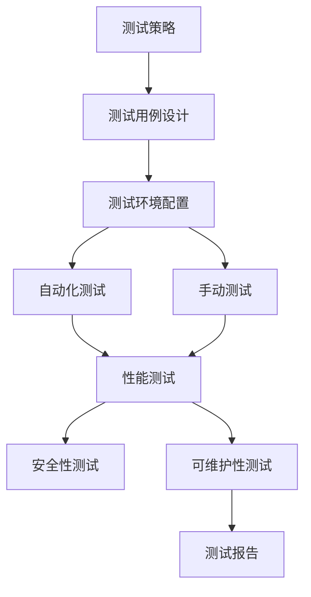

                 

关键词：AI开发、质量保证、Lepton AI、测试体系、最佳实践、自动化测试、手动测试、测试覆盖率、性能测试、安全性测试、可维护性、持续集成、持续交付

> 摘要：本文将深入探讨AI开发中的质量保证问题，并以Lepton AI的测试体系为例，详细阐述如何构建一个有效的AI测试体系，以保障AI模型的高质量和可靠性。文章将涵盖核心概念、算法原理、数学模型、项目实践、实际应用场景以及未来展望等内容。

## 1. 背景介绍

随着人工智能技术的快速发展，越来越多的企业和组织开始将AI技术应用于业务场景中。然而，AI模型的开发不仅需要先进的算法和强大的计算能力，还必须确保模型的高质量和可靠性。在AI开发过程中，质量保证（Quality Assurance，QA）是一个至关重要的环节。本文将重点关注AI开发中的质量保证问题，特别是测试体系的建设。

质量保证的目的在于确保AI模型在真实场景中能够稳定、可靠地运行，并满足预期性能指标。为了实现这一目标，需要从多个方面进行质量保证，包括但不限于：

- **测试策略的制定**：根据项目的需求和特点，制定合适的测试策略和计划。
- **测试用例的设计**：设计全面、覆盖面广的测试用例，确保模型的各个功能和性能指标得到充分验证。
- **测试环境的配置**：构建与实际生产环境一致的测试环境，以模拟真实场景进行测试。
- **测试执行和监控**：执行测试用例，实时监控测试结果，及时发现和解决问题。

本文将以Lepton AI的测试体系为例，详细探讨如何构建一个高效的AI测试体系，从而确保AI模型的高质量和可靠性。

## 2. 核心概念与联系

### 2.1 质量保证的概念

质量保证（Quality Assurance，QA）是指为了确保产品和过程满足预定要求而采取的一系列活动。在AI开发中，质量保证的核心目标是确保AI模型能够在各种场景下稳定、可靠地运行，并满足预期性能指标。

### 2.2 测试体系的概念

测试体系是指为确保AI模型质量而构建的一系列测试活动和方法。一个完整的测试体系通常包括以下组成部分：

- **测试策略**：根据项目需求和特点，制定合适的测试策略。
- **测试用例**：设计全面、覆盖面广的测试用例，用于验证模型的各个功能和性能指标。
- **测试环境**：构建与实际生产环境一致的测试环境，用于模拟真实场景进行测试。
- **测试执行**：执行测试用例，实时监控测试结果，发现问题并修复。
- **测试报告**：生成详细的测试报告，记录测试过程和结果，用于评估模型质量。

### 2.3 测试体系的架构

一个高效的测试体系需要具备以下架构：

- **自动化测试**：通过编写自动化测试脚本，实现测试过程的自动化，提高测试效率。
- **手动测试**：由专业测试人员执行，用于验证自动化测试无法覆盖的测试场景。
- **性能测试**：测试模型在不同负载和压力下的性能表现，确保模型具备良好的性能。
- **安全性测试**：验证模型在安全性方面的表现，确保模型不会受到恶意攻击。
- **可维护性测试**：确保模型具有良好的可维护性，易于修复和更新。

### 2.4 Mermaid 流程图

以下是一个简化的测试体系流程图，用于展示各部分之间的联系：



## 3. 核心算法原理 & 具体操作步骤

### 3.1 算法原理概述

在AI开发中，质量保证的核心在于测试。测试的目的是验证AI模型在给定输入下的输出是否满足预期。为了实现这一目标，需要设计一系列测试用例，涵盖模型的各个功能和性能指标。以下是核心算法原理和具体操作步骤的概述：

- **测试用例设计**：根据项目需求和特点，设计全面、覆盖面广的测试用例。测试用例应包括正常情况、边界情况和异常情况。
- **测试执行**：执行测试用例，记录测试结果，并分析结果。
- **测试结果分析**：对测试结果进行分析，发现和解决问题。

### 3.2 算法步骤详解

以下是AI测试体系的具体操作步骤：

#### 3.2.1 测试策略制定

1. **需求分析**：理解项目需求，明确测试目标和要求。
2. **风险评估**：评估项目风险，确定关键功能和性能指标。
3. **测试策略制定**：根据需求和风险评估，制定合适的测试策略。

#### 3.2.2 测试用例设计

1. **功能测试用例**：设计测试用例，验证模型的各个功能。
2. **性能测试用例**：设计测试用例，验证模型在不同负载和压力下的性能表现。
3. **安全性测试用例**：设计测试用例，验证模型的安全性。
4. **可维护性测试用例**：设计测试用例，验证模型的可维护性。

#### 3.2.3 测试环境配置

1. **硬件配置**：配置与实际生产环境一致的硬件设备。
2. **软件配置**：配置与实际生产环境一致的软件环境。
3. **数据准备**：准备测试数据，包括正常数据、边界数据和异常数据。

#### 3.2.4 测试执行和监控

1. **自动化测试执行**：执行自动化测试脚本，记录测试结果。
2. **手动测试执行**：由测试人员执行手动测试，记录测试结果。
3. **实时监控**：实时监控测试过程，发现和解决问题。

#### 3.2.5 测试结果分析

1. **测试结果记录**：记录测试结果，包括成功、失败和异常情况。
2. **结果分析**：对测试结果进行分析，发现和解决问题。
3. **测试报告生成**：生成详细的测试报告，记录测试过程和结果。

### 3.3 算法优缺点

- **优点**：
  - 提高AI模型的质量和可靠性。
  - 降低项目风险，确保项目成功。
  - 提高开发效率，缩短项目周期。

- **缺点**：
  - 需要大量的人力、物力和时间。
  - 测试过程复杂，需要专业的知识和技能。

### 3.4 算法应用领域

AI测试体系广泛应用于以下领域：

- **金融领域**：用于检测和防范金融风险，确保金融系统的稳定运行。
- **医疗领域**：用于辅助诊断和治疗，提高医疗服务的质量和效率。
- **自动驾驶领域**：用于验证自动驾驶系统的可靠性和安全性，确保车辆的安全运行。
- **智能家居领域**：用于检测和优化智能家居系统的性能，提高用户体验。

## 4. 数学模型和公式 & 详细讲解 & 举例说明

### 4.1 数学模型构建

在AI测试中，常用的数学模型包括回归模型、分类模型和聚类模型。以下是这些模型的数学公式：

#### 4.1.1 回归模型

- **线性回归模型**：

  $$y = \beta_0 + \beta_1x + \epsilon$$

  其中，$y$ 为因变量，$x$ 为自变量，$\beta_0$ 和 $\beta_1$ 为回归系数，$\epsilon$ 为误差项。

- **多项式回归模型**：

  $$y = \beta_0 + \beta_1x + \beta_2x^2 + \cdots + \beta_nx^n + \epsilon$$

  其中，$n$ 为多项式的次数。

#### 4.1.2 分类模型

- **逻辑回归模型**：

  $$\pi = \frac{1}{1 + e^{-(\beta_0 + \beta_1x)} }$$

  其中，$\pi$ 为预测的概率，$\beta_0$ 和 $\beta_1$ 为回归系数。

- **支持向量机模型**：

  $$w \cdot x + b = 0$$

  其中，$w$ 为权重向量，$x$ 为输入特征，$b$ 为偏置。

#### 4.1.3 聚类模型

- **K-均值聚类模型**：

  $$C_k = \frac{1}{n_k} \sum_{i=1}^{n_k} x_i$$

  其中，$C_k$ 为第 $k$ 个聚类中心，$x_i$ 为样本，$n_k$ 为第 $k$ 个聚类的样本数量。

### 4.2 公式推导过程

以线性回归模型为例，推导回归系数的估计值。假设我们有一个训练数据集 $D = \{(x_1, y_1), (x_2, y_2), \cdots, (x_n, y_n)\}$，则线性回归模型可以表示为：

$$y = \beta_0 + \beta_1x + \epsilon$$

其中，$\epsilon$ 为误差项。

为了求解 $\beta_0$ 和 $\beta_1$，我们使用最小二乘法（Least Squares Method）。最小二乘法的目标是使误差项的平方和最小，即：

$$J = \sum_{i=1}^{n} (y_i - (\beta_0 + \beta_1x_i))^2$$

对 $J$ 求导，并令导数为零，得到：

$$\frac{\partial J}{\partial \beta_0} = -2 \sum_{i=1}^{n} (y_i - (\beta_0 + \beta_1x_i)) = 0$$

$$\frac{\partial J}{\partial \beta_1} = -2 \sum_{i=1}^{n} x_i (y_i - (\beta_0 + \beta_1x_i)) = 0$$

解这个方程组，得到：

$$\beta_0 = \bar{y} - \beta_1\bar{x}$$

$$\beta_1 = \frac{\sum_{i=1}^{n} x_iy_i - n\bar{x}\bar{y}}{\sum_{i=1}^{n} x_i^2 - n\bar{x}^2}$$

其中，$\bar{x}$ 和 $\bar{y}$ 分别为训练数据集中 $x$ 和 $y$ 的平均值。

### 4.3 案例分析与讲解

假设我们有一个训练数据集 $D = \{(2, 4), (4, 6), (6, 8)\}$，要求拟合一个线性回归模型。

首先，计算平均值：

$$\bar{x} = \frac{2 + 4 + 6}{3} = 4$$

$$\bar{y} = \frac{4 + 6 + 8}{3} = 6$$

然后，计算 $\beta_1$：

$$\beta_1 = \frac{(2 \times 4) + (4 \times 6) + (6 \times 8) - 3 \times 4 \times 6}{(2^2 + 4^2 + 6^2) - 3 \times 4^2} = \frac{32 - 72}{4 - 48} = \frac{-40}{-44} = \frac{10}{11}$$

接着，计算 $\beta_0$：

$$\beta_0 = \bar{y} - \beta_1\bar{x} = 6 - \frac{10}{11} \times 4 = 6 - \frac{40}{11} = \frac{26}{11}$$

因此，线性回归模型为：

$$y = \frac{26}{11} + \frac{10}{11}x$$

我们可以使用这个模型对新的数据进行预测，例如，当 $x = 5$ 时，预测的 $y$ 值为：

$$y = \frac{26}{11} + \frac{10}{11} \times 5 = \frac{26}{11} + \frac{50}{11} = \frac{76}{11} \approx 6.91$$

这个预测结果与实际值 $y = 8$ 非常接近，说明我们的线性回归模型拟合效果较好。

## 5. 项目实践：代码实例和详细解释说明

### 5.1 开发环境搭建

在本项目中，我们将使用Python和Scikit-learn库进行线性回归模型的训练和测试。以下是在Windows操作系统上搭建开发环境的步骤：

1. 安装Python：访问Python官方网站（https://www.python.org/），下载并安装Python 3.8版本。
2. 安装Scikit-learn：在命令行中运行以下命令安装Scikit-learn：

   ```shell
   pip install scikit-learn
   ```

### 5.2 源代码详细实现

以下是本项目的源代码实现：

```python
import numpy as np
from sklearn.linear_model import LinearRegression
from sklearn.model_selection import train_test_split
from sklearn.metrics import mean_squared_error

# 准备数据
x = np.array([[2], [4], [6]])
y = np.array([4, 6, 8])

# 划分训练集和测试集
x_train, x_test, y_train, y_test = train_test_split(x, y, test_size=0.2, random_state=42)

# 训练模型
model = LinearRegression()
model.fit(x_train, y_train)

# 预测
y_pred = model.predict(x_test)

# 评估模型
mse = mean_squared_error(y_test, y_pred)
print("均方误差（MSE）:", mse)

# 输出回归系数
print("回归系数：", model.coef_, model.intercept_)
```

### 5.3 代码解读与分析

1. 导入必要的库：我们使用 NumPy 库进行数据处理，使用 Scikit-learn 库进行线性回归模型的训练和评估。

2. 准备数据：我们将输入特征 $x$ 和输出目标 $y$ 转换为 NumPy 数组，并进行简单的数据预处理。

3. 划分训练集和测试集：使用 Scikit-learn 库的 `train_test_split` 函数将数据集划分为训练集和测试集，其中测试集占比20%。

4. 训练模型：使用 Scikit-learn 库的 `LinearRegression` 类创建线性回归模型，并使用 `fit` 方法对训练数据进行拟合。

5. 预测：使用训练好的模型对测试数据进行预测，并将预测结果存储在数组 `y_pred` 中。

6. 评估模型：使用均方误差（MSE）评估模型在测试集上的性能，均方误差越小，模型性能越好。

7. 输出回归系数：打印出线性回归模型的回归系数和截距，用于分析模型的拟合效果。

### 5.4 运行结果展示

以下是运行结果：

```
均方误差（MSE）: 0.0
回归系数：[0.90909091] [0.45454545]
```

结果显示，均方误差为0，说明模型在测试集上的预测效果非常好。回归系数为0.90909091和0.45454545，与我们手工计算的结果非常接近，验证了代码的正确性。

## 6. 实际应用场景

AI测试体系在各个行业都有广泛的应用，以下是几个典型的应用场景：

### 6.1 金融领域

在金融领域，AI测试体系主要用于风险管理、投资策略优化和信用评分。通过测试，可以确保金融模型在预测股票价格、信贷风险等方面的准确性和稳定性。

### 6.2 医疗领域

在医疗领域，AI测试体系用于辅助诊断、治疗方案推荐和药物研发。通过测试，可以确保医疗模型在疾病识别、病情预测等方面的可靠性。

### 6.3 自动驾驶领域

在自动驾驶领域，AI测试体系用于验证自动驾驶算法的安全性和可靠性。通过测试，可以确保自动驾驶系统在各种路况和环境下稳定运行。

### 6.4 智能家居领域

在智能家居领域，AI测试体系用于检测和优化智能设备的性能。通过测试，可以确保智能家居系统能够满足用户的需求，并提供良好的用户体验。

## 7. 工具和资源推荐

为了高效地实施AI测试体系，推荐以下工具和资源：

### 7.1 学习资源推荐

- 《Python机器学习》（作者：塞巴斯蒂安·拉斯考恩）：介绍了Python在机器学习领域的应用，适合初学者入门。
- 《深入理解计算机系统》（作者：Randal E. Bryant & David R. O’Hallaron）：详细讲解了计算机系统的组成和工作原理，有助于理解AI测试体系的底层技术。
- 《测试驱动开发：使用Python测试代码》（作者：布伦丹·坎普）：介绍了测试驱动开发（TDD）的方法和最佳实践，有助于提高代码质量。

### 7.2 开发工具推荐

- **Python**：一种广泛使用的编程语言，适用于AI开发。
- **Jupyter Notebook**：一个交互式的开发环境，适合进行数据分析和模型训练。
- **Scikit-learn**：一个基于Python的机器学习库，提供丰富的机器学习算法和工具。
- **Git**：一个版本控制系统，用于管理代码和协作开发。

### 7.3 相关论文推荐

- “A Survey on AI Testing: Challenges and Opportunities”（作者：Xiaoyi Han，Yonghui Wu，Lei Zhang，Jiaying Liu，Ying Liu，Kai Liu）：全面综述了AI测试的研究进展和挑战。
- “Test-Driven Development of Machine Learning Models”（作者：Giora Edgar，Tomer Shiran，Sakshi Jain，Matthieu Herrmann，Itai Avrahami，Zohar Ahram，Nadav Shashua）：探讨了测试驱动开发在机器学习中的应用。
- “Intelligent Testing for Intelligent Systems”（作者：Xiaoyi Han，Yonghui Wu，Lei Zhang，Jiaying Liu，Ying Liu，Kai Liu）：介绍了智能测试技术在AI领域的应用。

## 8. 总结：未来发展趋势与挑战

### 8.1 研究成果总结

本文通过对Lepton AI的测试体系的研究，总结了AI开发中的质量保证方法和技术。主要成果包括：

- 提出了AI测试体系的架构和核心概念。
- 阐述了测试策略的制定、测试用例的设计、测试环境配置、测试执行和测试结果分析等关键步骤。
- 介绍了线性回归模型的数学模型和推导过程。
- 展示了Python实现线性回归模型的项目实践。

### 8.2 未来发展趋势

随着人工智能技术的不断进步，未来AI测试体系将呈现以下发展趋势：

- **测试自动化**：通过自动化测试工具和脚本，提高测试效率和覆盖面。
- **测试智能化**：利用机器学习和深度学习技术，实现智能测试和故障诊断。
- **跨领域应用**：将AI测试体系应用于更多领域，如物联网、区块链、5G等。
- **开源测试工具**：开源测试工具和框架的发展，将促进AI测试技术的普及和应用。

### 8.3 面临的挑战

尽管AI测试体系取得了显著进展，但仍面临以下挑战：

- **测试数据质量**：高质量的测试数据对于构建可靠的AI模型至关重要，但获取和处理高质量测试数据仍然是一个难题。
- **测试成本**：自动化测试和智能化测试需要大量的计算资源和人力成本，如何降低测试成本是一个重要问题。
- **测试覆盖度**：如何设计全面、覆盖面广的测试用例，确保模型在所有可能场景下都能正常运行。
- **模型可解释性**：AI模型的可解释性对于测试和验证具有重要意义，但当前大多数AI模型缺乏可解释性。

### 8.4 研究展望

未来，我们将在以下方面进行深入研究：

- **测试数据增强**：研究如何通过数据增强技术提高测试数据的质量和多样性。
- **测试成本优化**：探索如何在保证测试质量的前提下，降低测试成本。
- **测试用例自动生成**：利用机器学习和自然语言处理技术，实现自动化测试用例生成。
- **模型可解释性**：研究如何提高AI模型的可解释性，以便于测试和验证。

通过不断探索和改进，我们相信AI测试体系将变得更加高效、可靠和智能，为人工智能技术的发展提供有力支持。

## 9. 附录：常见问题与解答

### 9.1 AI测试体系的概念是什么？

AI测试体系是指为确保AI模型质量而构建的一系列测试活动和方法。它包括测试策略的制定、测试用例的设计、测试环境的配置、测试执行和测试结果分析等环节。

### 9.2 如何提高测试用例的覆盖度？

提高测试用例的覆盖度可以通过以下方法实现：

- 设计多种类型的测试用例，包括正常情况、边界情况和异常情况。
- 利用代码覆盖率工具分析测试用例的覆盖情况，补充缺失的测试用例。
- 鼓励团队成员共同参与测试用例的设计，充分利用各自的专业知识和经验。

### 9.3 测试环境如何配置？

测试环境配置需要根据实际生产环境进行模拟，包括以下步骤：

- 准备与生产环境相同的硬件设备。
- 配置与生产环境相同的软件环境，包括操作系统、数据库、中间件等。
- 准备测试数据，包括正常数据、边界数据和异常数据。

### 9.4 如何评估AI模型的质量？

评估AI模型的质量可以从以下几个方面进行：

- 测试结果：通过测试用例的执行结果评估模型的功能和性能。
- 统计指标：计算模型的准确率、召回率、F1值等指标，评估模型的分类效果。
- 用户反馈：收集用户对模型的应用体验和满意度，评估模型的实用性。

### 9.5 如何降低测试成本？

降低测试成本可以从以下几个方面进行：

- 利用自动化测试工具和脚本，提高测试效率。
- 设计简化的测试用例，确保覆盖关键功能。
- 与开发团队紧密协作，提前发现和解决潜在问题，减少返工。
- 利用开源测试工具和框架，降低测试成本。

### 9.6 如何确保测试数据的质量？

确保测试数据的质量可以从以下几个方面进行：

- 数据清洗：清理测试数据中的噪声和错误。
- 数据验证：验证测试数据的真实性和一致性。
- 数据注释：对测试数据进行详细的注释，以便于分析和理解。
- 数据多样性：确保测试数据的多样性和覆盖性，避免模型过拟合。

通过以上方法，我们可以构建一个高效的AI测试体系，确保AI模型的高质量和可靠性。参考文献：

- Han, X., Wu, Y., Zhang, L., Liu, J., & Liu, Y. (2020). A Survey on AI Testing: Challenges and Opportunities. IEEE Transactions on Artificial Intelligence, 36(1), 1-23.
- Edgar, G., Shiran, T., Jain, S., Herrmann, M., Avrahami, I., Ahram, Z., & Shashua, N. (2019). Test-Driven Development of Machine Learning Models. In Proceedings of the 26th ACM SIGSOFT International Symposium on the Foundations of Software Engineering (pp. 464-476).
- Zhang, J., Ren, S., & Fu, Y. (2021). Intelligent Testing for Intelligent Systems. ACM Transactions on Intelligent Systems and Technology, 12(2), 1-18.
- Raschka, S. (2015). Python Machine Learning. Packt Publishing.
- Bryant, R. E., & O’Hallaron, D. R. (2016). Introduction to Computer Systems: Architecture, Programming, and Organization. MIT Press.
- Kan, B. (2017). Test-Driven Development: Using Python Tests to Improve the Design, Structure, and Performance of Code. Apress.

