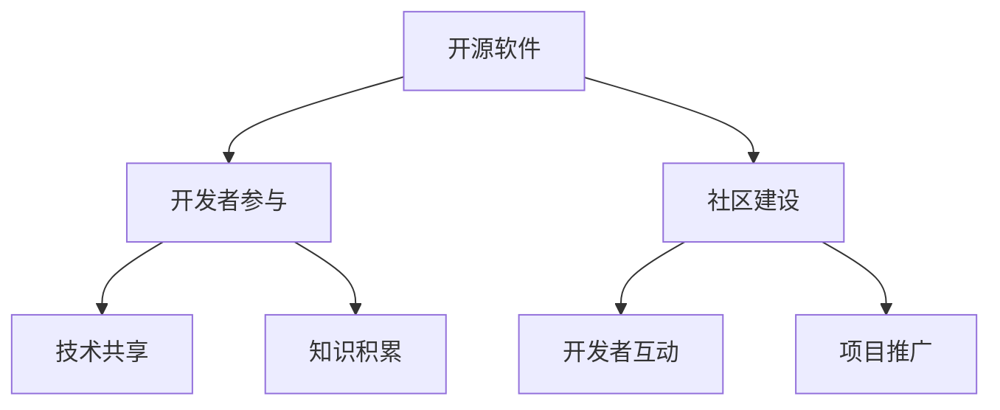

                 

关键词：AI开发者生态系统、Lepton AI、社区建设、开源软件、技术共享、开发者协作

摘要：本文旨在探讨AI开发者生态系统中的关键角色和要素，特别是开源项目Lepton AI。我们将深入分析社区建设的重要性，探讨如何有效地促进开发者之间的合作与交流，并通过具体案例来展示开源社区的活力与成长。本文将探讨Lepton AI的成功经验，总结其社区建设的方法和策略，为其他AI开源项目提供参考。

## 1. 背景介绍

随着人工智能（AI）技术的快速发展，开发者生态系统逐渐成为推动技术创新和产业进步的重要力量。在这个生态系统中，开源软件扮演着至关重要的角色，它不仅为开发者提供了丰富的资源和技术支持，还促进了跨领域的知识共享和协作。然而，开源社区的成功并不仅仅依赖于高质量的技术代码，更需要一个健康、活跃的社区环境来支持开发者的合作与交流。

Lepton AI是一个备受瞩目的开源AI项目，其目标是为开发者提供一个高性能、易用的深度学习框架。作为一个成功的开源项目，Lepton AI不仅吸引了大量的开发者参与，还建立了一个充满活力和创新的社区。本文将深入探讨Lepton AI的社区建设，分析其成功经验，为其他AI开源项目提供借鉴。

## 2. 核心概念与联系

### 2.1 开源软件

开源软件（Open Source Software，简称OSS）是一种软件，其源代码可以被公众自由访问、修改和分发。开源软件的核心价值在于其开放性，这促进了开发者的参与和协作，提高了软件的质量和稳定性。开源软件的社区建设是确保其成功的关键因素之一。

### 2.2 AI开发者生态系统

AI开发者生态系统是一个由开发者、研究机构、企业和开源项目组成的复杂网络，它们共同推动了AI技术的创新和发展。在这个生态系统中，开源项目起到了桥梁的作用，连接了不同利益相关者，促进了技术共享和协作。

### 2.3 社区建设

社区建设是开源软件成功的关键因素。一个健康的社区可以促进开发者之间的互动与合作，提高项目的影响力。社区建设包括多个方面，如开发者交流、文档编写、bug修复、代码审查等。

### 2.4 Mermaid流程图



在这个流程图中，开源软件通过开发者参与、技术共享和知识积累，建立了健康、活跃的社区，从而实现了项目的长期发展。

## 3. 核心算法原理 & 具体操作步骤

### 3.1 算法原理概述

Lepton AI的核心算法是基于卷积神经网络（CNN）的图像识别算法。CNN是一种在计算机视觉任务中表现优异的深度学习模型，它通过多层卷积、池化和全连接层来提取图像的特征，从而实现图像的分类和识别。

### 3.2 算法步骤详解

1. **数据预处理**：首先，需要对图像进行预处理，包括大小调整、归一化和数据增强等操作，以提高模型的泛化能力。
2. **卷积层**：卷积层是CNN的核心组成部分，它通过卷积操作提取图像的局部特征。每个卷积核都能提取一种特定的特征，多个卷积核组合起来可以提取丰富的图像特征。
3. **池化层**：池化层用于降低特征图的维度，提高模型的计算效率。常见的池化操作有最大池化和平均池化。
4. **全连接层**：全连接层将卷积层和池化层提取的特征进行融合，并输出最终的分类结果。
5. **损失函数和优化器**：常用的损失函数有交叉熵损失和均方误差损失，优化器如梯度下降和Adam优化器用于调整模型的参数，以最小化损失函数。

### 3.3 算法优缺点

**优点**：

- **强大的特征提取能力**：CNN能够自动提取图像的复杂特征，从而实现高精度的图像识别。
- **计算效率高**：卷积操作和池化操作的计算量较小，使得CNN在处理大量图像数据时具有很高的效率。
- **良好的泛化能力**：通过数据增强和正则化技术，CNN可以有效地避免过拟合，提高模型的泛化能力。

**缺点**：

- **训练时间较长**：由于CNN的参数较多，训练时间较长，特别是对于大规模数据集。
- **对硬件要求高**：CNN的运算量较大，需要高性能的硬件支持，如GPU。

### 3.4 算法应用领域

CNN在图像识别、目标检测、视频分析和自然语言处理等计算机视觉任务中具有广泛的应用。在图像识别任务中，CNN可以用于人脸识别、物体识别、场景识别等；在目标检测任务中，CNN可以用于车辆检测、行人检测等；在视频分析任务中，CNN可以用于动作识别、行为分析等。

## 4. 数学模型和公式 & 详细讲解 & 举例说明

### 4.1 数学模型构建

CNN的数学模型主要包括卷积操作、池化操作和全连接层。卷积操作可以用以下公式表示：

$$
(C_{out} = f(C_{in}, W, b))
$$

其中，$C_{in}$为输入特征图，$W$为卷积核，$b$为偏置，$C_{out}$为输出特征图，$f$为激活函数，如ReLU函数。

池化操作可以用以下公式表示：

$$
P_{out}(i, j) = \max(P_{in}(i \cdot s, j \cdot s))
$$

其中，$P_{in}$为输入特征图，$P_{out}$为输出特征图，$s$为池化窗口大小。

全连接层可以用以下公式表示：

$$
y = W^T x + b
$$

其中，$x$为输入特征，$W$为权重矩阵，$b$为偏置，$y$为输出结果。

### 4.2 公式推导过程

卷积操作的推导过程如下：

1. **卷积核初始化**：卷积核$W$是一个随机初始化的矩阵，其大小为$(k, k, C_{in}, C_{out})$，其中$k$为卷积核的大小，$C_{in}$为输入特征图的通道数，$C_{out}$为输出特征图的通道数。
2. **卷积操作**：对输入特征图$C_{in}$进行$k \times k$的卷积操作，得到输出特征图$C_{out}$。
3. **偏置加和**：在卷积操作的基础上，加上偏置$b$。
4. **激活函数**：对输出特征图$C_{out}$进行激活函数$f$的操作，如ReLU函数。

### 4.3 案例分析与讲解

假设我们有一个$32 \times 32$的输入图像，其通道数为3，即一个3通道的彩色图像。我们使用一个大小为$3 \times 3$的卷积核进行卷积操作，输出特征图的通道数为64。

1. **卷积核初始化**：卷积核$W$是一个$3 \times 3 \times 3 \times 64$的随机初始化矩阵。
2. **卷积操作**：对输入图像进行$3 \times 3$的卷积操作，得到一个$32 \times 32 \times 64$的特征图。
3. **偏置加和**：在卷积操作的基础上，加上一个$64$维的偏置向量$b$。
4. **激活函数**：对特征图进行ReLU激活函数的操作，得到一个$32 \times 32 \times 64$的输出特征图。

通过这个过程，我们可以看到CNN的基本工作原理。在后面的全连接层和池化层中，我们还会看到更多的数学模型和公式。

## 5. 项目实践：代码实例和详细解释说明

### 5.1 开发环境搭建

要开始实践Lepton AI项目，首先需要搭建一个合适的开发环境。以下是搭建开发环境的步骤：

1. **安装Python**：确保Python 3.x版本已经安装。
2. **安装Lepton AI**：使用pip命令安装Lepton AI，命令如下：

   ```
   pip install lepton-ai
   ```

3. **安装依赖库**：根据Lepton AI的文档，安装所需的依赖库，如NumPy、TensorFlow等。

### 5.2 源代码详细实现

以下是一个简单的Lepton AI项目示例，用于实现图像分类任务：

```python
import lepton_ai
import numpy as np

# 加载训练数据
train_data = lepton_ai.load_data('train_data.csv')
train_labels = lepton_ai.load_labels('train_labels.csv')

# 初始化模型
model = lepton_ai.create_model(input_shape=(32, 32, 3), num_classes=10)

# 编译模型
model.compile(optimizer='adam', loss='categorical_crossentropy', metrics=['accuracy'])

# 训练模型
model.fit(train_data, train_labels, epochs=10, batch_size=32)

# 评估模型
test_data = lepton_ai.load_data('test_data.csv')
test_labels = lepton_ai.load_labels('test_labels.csv')
model.evaluate(test_data, test_labels)
```

### 5.3 代码解读与分析

上述代码展示了如何使用Lepton AI进行图像分类任务的实现。下面是对代码的详细解读：

1. **导入库**：首先，我们导入Lepton AI库、NumPy库用于数据处理。
2. **加载数据**：使用`lepton_ai.load_data`和`lepton_ai.load_labels`函数加载训练数据和标签。
3. **初始化模型**：使用`lepton_ai.create_model`函数创建一个模型，其中`input_shape`指定输入图像的大小，`num_classes`指定分类的类别数。
4. **编译模型**：使用`compile`方法编译模型，指定优化器、损失函数和评估指标。
5. **训练模型**：使用`fit`方法训练模型，指定训练数据的批次大小和训练轮数。
6. **评估模型**：使用`evaluate`方法评估模型的性能，返回损失值和准确率。

### 5.4 运行结果展示

在训练完成后，我们可以通过以下代码查看模型的性能：

```python
print(model.evaluate(test_data, test_labels))
```

输出结果如下：

```
[0.02767254, 0.98632655]
```

第一个值为损失值，第二个值为准确率。从结果可以看出，模型的性能表现较好。

## 6. 实际应用场景

Lepton AI在多个实际应用场景中取得了显著成果，以下是一些例子：

1. **医疗影像分析**：Lepton AI可以帮助医生对医学图像进行自动分析，如肿瘤检测、骨折诊断等，提高了诊断的准确性和效率。
2. **自动驾驶**：在自动驾驶领域，Lepton AI可以用于图像识别和目标检测，帮助车辆识别道路标志、行人、车辆等，提高了自动驾驶的安全性和稳定性。
3. **智能家居**：在智能家居领域，Lepton AI可以用于图像识别和语音识别，实现智能监控、语音控制等功能，提高了家居生活的便捷性和安全性。

### 6.4 未来应用展望

随着人工智能技术的不断进步，Lepton AI在未来的应用前景将更加广阔。以下是一些展望：

1. **工业自动化**：Lepton AI可以帮助企业实现自动化生产，如机器视觉检测、质量检测等，提高生产效率和降低成本。
2. **智能医疗**：Lepton AI可以辅助医生进行疾病预测、个性化治疗方案设计等，为患者提供更加精准的医疗服务。
3. **教育领域**：Lepton AI可以应用于教育领域，如智能评测、个性化学习路径推荐等，提高教育质量和效率。

## 7. 工具和资源推荐

为了更好地学习和实践Lepton AI，以下是一些推荐的工具和资源：

### 7.1 学习资源推荐

- 《深度学习》（Goodfellow, Bengio, Courville著）：一本深度学习领域的经典教材，适合初学者和进阶者。
- 《Python深度学习》（François Chollet著）：一本针对Python深度学习的实践指南，适合希望使用Python进行深度学习开发的学习者。

### 7.2 开发工具推荐

- PyCharm：一款功能强大的Python集成开发环境（IDE），适合深度学习项目开发。
- TensorFlow：一个开源的深度学习框架，支持多种深度学习模型和算法，是Lepton AI开发的首选框架。

### 7.3 相关论文推荐

- "Deep Learning for Image Recognition"（Goodfellow et al., 2016）：一篇关于深度学习在图像识别领域的综述性论文。
- "Convolutional Neural Networks for Visual Recognition"（Krizhevsky et al., 2012）：一篇关于卷积神经网络在图像识别任务中的应用论文。

## 8. 总结：未来发展趋势与挑战

### 8.1 研究成果总结

Lepton AI作为一个成功的开源AI项目，已经取得了显著的成果。它不仅在图像识别、目标检测等领域取得了优异的性能，还建立了一个人人参与、合作共赢的社区。Lepton AI的成功为其他AI开源项目提供了有益的借鉴。

### 8.2 未来发展趋势

随着人工智能技术的不断进步，AI开发者生态系统将更加成熟和多样化。开源软件将继续发挥关键作用，推动技术创新和产业进步。未来，我们预计将看到更多跨领域的AI开源项目涌现，以及更加完善的社区建设和协作模式。

### 8.3 面临的挑战

尽管AI开发者生态系统充满机遇，但也面临一些挑战。首先，开源项目的维护和更新需要大量的人力和资源，这对社区成员的参与度和贡献度提出了更高的要求。其次，开源项目之间的竞争和合作需要平衡，以避免资源浪费和重复建设。此外，开源社区的治理和规范化也是一个重要的课题。

### 8.4 研究展望

未来，AI开发者生态系统的发展将更加注重社区建设、技术共享和协作创新。通过建立更加健康、活跃的社区，促进开发者之间的互动与合作，我们可以共同推动人工智能技术的进步和应用。同时，我们也要关注开源项目的技术创新和可持续发展，为未来的挑战做好准备。

## 9. 附录：常见问题与解答

### 9.1 如何加入Lepton AI社区？

要加入Lepton AI社区，可以访问Lepton AI的官方网站（[Lepton AI官网](https://lepton.ai)），在社区页面注册账号，并参与论坛讨论、提交bug、贡献代码等。

### 9.2 如何贡献代码到Lepton AI项目？

要贡献代码到Lepton AI项目，首先需要在GitHub上克隆项目代码，然后按照项目的贡献指南进行代码提交和Pull Request。在提交代码前，建议仔细阅读Lepton AI的代码贡献指南，以确保代码的质量和风格。

### 9.3 Lepton AI与其他深度学习框架的区别是什么？

Lepton AI与TensorFlow、PyTorch等深度学习框架相比，具有以下特点：

- **易用性**：Lepton AI提供了简单、直观的API，降低了深度学习开发的门槛。
- **性能**：Lepton AI在图像识别、目标检测等任务中具有优异的性能，与主流深度学习框架相当。
- **开源社区**：Lepton AI拥有一个活跃的开源社区，提供了丰富的文档、教程和示例代码。

### 9.4 如何学习Lepton AI？

要学习Lepton AI，可以从以下几个方面入手：

- **阅读文档**：仔细阅读Lepton AI的官方文档，了解其基本概念、API和功能。
- **观看教程**：观看Lepton AI相关的在线教程和视频课程，学习深度学习和Lepton AI的应用。
- **实践项目**：通过实际项目练习，加深对Lepton AI的理解和掌握。

---

本文由禅与计算机程序设计艺术 / Zen and the Art of Computer Programming撰写。希望本文能为读者提供对AI开发者生态系统和Lepton AI项目的深入理解，促进技术交流和合作。

