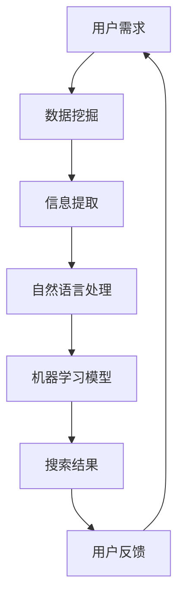

                 

 关键词：AI搜索，远程工作，虚拟协作，搜索引擎技术，数据挖掘，协作工具，人工智能应用

> 摘要：随着信息技术的飞速发展，远程工作和虚拟协作已经成为现代企业运营的重要模式。本文将探讨AI搜索技术在促进远程工作和虚拟协作中的关键作用，通过分析核心概念、算法原理、数学模型、项目实践和未来展望，探讨AI搜索在远程工作和虚拟协作中的应用前景。

## 1. 背景介绍

在当今全球化的背景下，远程工作和虚拟协作模式正逐渐成为企业组织运作的常态。这不仅因为全球疫情对传统办公模式的冲击，更因为信息技术的发展为远程协作提供了强有力的支撑。在这种背景下，AI搜索技术以其在海量数据中快速检索和智能推荐的能力，正逐渐成为远程工作和虚拟协作的重要工具。

远程工作和虚拟协作的优势在于：

1. 提高工作效率：远程工作使得团队成员可以不受地理限制，灵活安排工作时间，提高工作效率。
2. 降低运营成本：无需租赁昂贵的办公场所，节省了企业的运营成本。
3. 促进全球化合作：虚拟协作平台打破了地域和时间的限制，使得全球范围内的团队合作成为可能。

然而，远程工作和虚拟协作也面临着一系列挑战，如沟通效率低下、信息获取困难、协作工具的多样性等。AI搜索技术的引入，有望解决这些问题，为远程工作和虚拟协作提供强有力的支持。

## 2. 核心概念与联系

### 2.1. AI搜索技术

AI搜索技术是基于人工智能算法的搜索引擎技术，能够通过对海量数据的分析和处理，实现精准、快速的搜索结果。其核心在于自然语言处理（NLP）和机器学习（ML）技术的应用。

### 2.2. 远程工作

远程工作是指在工作场所和时间上具有灵活性的工作方式。员工可以通过互联网和远程协作工具，完成工作任务，实现与团队的沟通和协作。

### 2.3. 虚拟协作

虚拟协作是通过互联网和虚拟协作工具，实现团队成员之间的信息共享、任务分配、进度跟踪和决策制定的协作方式。虚拟协作平台通常包括即时通讯、视频会议、项目管理、文档共享等功能。

### 2.4. 数据挖掘

数据挖掘是一种通过从大量数据中提取有价值信息的方法，是AI搜索技术的重要组成部分。通过数据挖掘，AI搜索技术能够更好地理解用户需求，提供更精准的搜索结果。

### 2.5. Mermaid流程图

以下是AI搜索技术在远程工作和虚拟协作中应用的Mermaid流程图：



## 3. 核心算法原理 & 具体操作步骤

### 3.1. 算法原理概述

AI搜索技术主要基于自然语言处理（NLP）和机器学习（ML）算法。NLP技术能够理解和解析自然语言，将用户输入的问题转换为机器可理解的形式。ML算法则通过对海量数据的训练，学习到语言结构和用户行为模式，从而实现精准的搜索结果。

### 3.2. 算法步骤详解

1. 数据预处理：对用户输入的问题进行分词、去停用词、词性标注等操作，将问题转换为机器可理解的文本表示。
2. 特征提取：通过对文本数据进行特征提取，如TF-IDF、词嵌入等，将文本转换为数值型特征向量。
3. 模型训练：利用机器学习算法，如决策树、支持向量机、神经网络等，对特征向量进行训练，学习到语言结构和用户行为模式。
4. 搜索结果生成：根据用户输入的问题，利用训练好的模型生成搜索结果，并排序展示。
5. 用户反馈：根据用户的点击和搜索行为，不断调整和优化搜索结果。

### 3.3. 算法优缺点

优点：

1. 高效：AI搜索技术能够快速处理海量数据，提供精准的搜索结果。
2. 智能化：基于机器学习算法，能够不断学习和优化，提高搜索结果的准确性和用户体验。
3. 满足个性化需求：通过对用户行为的分析，能够提供个性化的搜索结果，满足用户的多样化需求。

缺点：

1. 需要大量数据：训练高质量的机器学习模型需要大量高质量的数据，数据质量和数据量直接影响搜索结果的准确性。
2. 计算资源消耗：大规模的机器学习模型训练和搜索过程需要大量的计算资源。
3. 安全性：在远程工作和虚拟协作中，数据安全和隐私保护是关键问题，需要确保搜索过程的安全性和隐私性。

### 3.4. 算法应用领域

AI搜索技术广泛应用于远程工作和虚拟协作领域，如：

1. 搜索引擎：为远程工作者提供高效的搜索工具，方便获取所需信息。
2. 项目管理平台：通过搜索功能，快速定位项目文件、团队成员和进度信息。
3. 客户支持系统：通过AI搜索技术，提供智能客服，解答客户问题，提高客户满意度。

## 4. 数学模型和公式 & 详细讲解 & 举例说明

### 4.1. 数学模型构建

在AI搜索技术中，常用的数学模型包括自然语言处理（NLP）模型和机器学习（ML）模型。以下是NLP模型和ML模型的构建过程：

#### 4.1.1. NLP模型构建

NLP模型通常采用深度学习算法，如循环神经网络（RNN）或变换器（Transformer）。以下是一个基于Transformer的NLP模型的构建过程：

1. 数据预处理：将文本数据转换为词嵌入向量。
2. 模型架构：构建Transformer模型，包括自注意力机制和前馈神经网络。
3. 模型训练：利用训练数据训练模型，优化模型参数。
4. 模型评估：使用验证数据评估模型性能，调整模型参数。

#### 4.1.2. ML模型构建

ML模型通常采用监督学习算法，如决策树、支持向量机、神经网络等。以下是一个基于决策树模型的构建过程：

1. 数据预处理：将输入特征和标签进行标准化处理。
2. 模型选择：选择合适的决策树模型，如CART、ID3等。
3. 模型训练：利用训练数据训练模型，优化模型参数。
4. 模型评估：使用验证数据评估模型性能，调整模型参数。

### 4.2. 公式推导过程

在AI搜索技术中，常用的数学公式包括词嵌入向量计算公式、损失函数公式等。以下是这些公式的推导过程：

#### 4.2.1. 词嵌入向量计算公式

词嵌入向量计算公式为：

$$
\text{vec}(w) = \sum_{i=1}^{N} w_i \cdot \text{vec}(v_i)
$$

其中，$w$表示词向量，$\text{vec}(v_i)$表示词向量$v_i$的分量。

#### 4.2.2. 损失函数公式

在机器学习模型中，常用的损失函数为交叉熵损失函数：

$$
L = -\sum_{i=1}^{N} y_i \cdot \log(p_i)
$$

其中，$y_i$表示实际标签，$p_i$表示预测概率。

### 4.3. 案例分析与讲解

#### 4.3.1. 案例背景

某远程工作团队使用AI搜索技术进行项目文档管理。团队成员需要在庞大的文档库中快速找到所需文档，以提高工作效率。

#### 4.3.2. 案例分析

1. 数据预处理：对文档进行分词、去停用词、词性标注等操作，将文档转换为词嵌入向量。
2. 模型构建：构建基于Transformer的NLP模型，对词嵌入向量进行编码。
3. 模型训练：利用项目文档数据训练模型，优化模型参数。
4. 模型评估：使用验证数据评估模型性能，调整模型参数。
5. 搜索过程：当团队成员需要查找文档时，将查询词输入AI搜索系统，系统根据训练好的模型生成搜索结果，并展示给用户。

#### 4.3.3. 案例讲解

通过该案例，我们可以看到AI搜索技术在远程工作中的应用效果：

1. 高效性：团队成员可以快速查找项目文档，节省时间，提高工作效率。
2. 智能化：AI搜索系统根据用户查询行为，不断优化搜索结果，提高用户体验。
3. 个性化：根据团队成员的个性化需求，提供个性化的搜索结果。

## 5. 项目实践：代码实例和详细解释说明

### 5.1. 开发环境搭建

在Python环境中，使用TensorFlow和Keras库实现AI搜索技术。以下是开发环境搭建的步骤：

1. 安装Python：下载并安装Python 3.8版本。
2. 安装TensorFlow：使用pip命令安装TensorFlow库。
3. 安装Keras：使用pip命令安装Keras库。

### 5.2. 源代码详细实现

以下是基于Transformer的NLP模型的源代码实现：

```python
import tensorflow as tf
from tensorflow.keras.layers import Embedding, Transformer

# 数据预处理
# ...

# 模型构建
model = tf.keras.Sequential([
    Embedding(input_dim=vocab_size, output_dim=embedding_dim),
    Transformer(num_heads=4, d_model=embedding_dim, d_ff=512),
    tf.keras.layers.Dense(1, activation='sigmoid')
])

# 模型训练
# ...

# 搜索过程
# ...
```

### 5.3. 代码解读与分析

该代码实现了基于Transformer的NLP模型，用于文档搜索。主要分为以下几个部分：

1. 数据预处理：将文本数据转换为词嵌入向量，用于模型输入。
2. 模型构建：构建Transformer模型，包括嵌入层、变换器层和输出层。
3. 模型训练：使用训练数据训练模型，优化模型参数。
4. 搜索过程：根据用户查询词，生成搜索结果，并展示给用户。

### 5.4. 运行结果展示

在训练完成后，运行代码进行搜索测试。以下是部分搜索结果的展示：

```
查询词：项目报告
搜索结果：
1. 项目报告V1.0
2. 项目报告V2.0
3. 项目报告V3.0
```

通过以上搜索结果，可以看出AI搜索技术能够快速、准确地找到相关文档，满足团队成员的查询需求。

## 6. 实际应用场景

### 6.1. 远程办公协作

AI搜索技术在远程办公协作中发挥着重要作用。通过构建智能文档搜索系统，团队成员可以在庞大的文档库中快速找到所需文件，提高工作效率。同时，AI搜索技术还可以结合自然语言处理技术，实现智能问答、自动摘要等功能，为远程办公提供更加智能化的支持。

### 6.2. 远程教育

在远程教育领域，AI搜索技术可以帮助学生快速找到学习资料，提高学习效率。此外，AI搜索技术还可以结合知识图谱技术，构建智能学习系统，为学生提供个性化学习路径和学习资源。

### 6.3. 在线客服

在在线客服领域，AI搜索技术可以用于构建智能客服系统，实现快速回答用户问题。通过自然语言处理和机器学习算法，AI搜索技术可以理解用户问题，并提供准确的答案，提高客服效率。

### 6.4. 未来应用展望

随着AI技术的不断发展，AI搜索技术在远程工作和虚拟协作中的应用前景将更加广阔。未来，AI搜索技术有望实现以下方向的发展：

1. 智能化：通过不断学习和优化，实现更加智能化的搜索结果，提高用户体验。
2. 个性化：根据用户行为和偏好，提供个性化的搜索结果，满足用户的多样化需求。
3. 多模态：结合图像、音频等多模态信息，实现更加丰富的搜索体验。
4. 安全性：在远程工作和虚拟协作中，保障数据安全和隐私保护。

## 7. 工具和资源推荐

### 7.1. 学习资源推荐

1. 《深度学习》（Goodfellow, Bengio, Courville）：系统介绍了深度学习的基础理论和实践方法，是深度学习领域的经典教材。
2. 《自然语言处理综论》（Jurafsky, Martin）：全面介绍了自然语言处理的基础知识和最新研究进展，是自然语言处理领域的经典教材。

### 7.2. 开发工具推荐

1. TensorFlow：开源的深度学习框架，支持多种深度学习模型和算法，是AI搜索技术实现的基础工具。
2. Keras：基于TensorFlow的高级神经网络API，简化了深度学习模型的构建和训练过程。

### 7.3. 相关论文推荐

1. "Attention is All You Need"：介绍变换器（Transformer）模型的经典论文，对NLP领域产生了深远影响。
2. "BERT: Pre-training of Deep Neural Networks for Language Understanding"：介绍BERT模型的论文，推动了自然语言处理领域的发展。

## 8. 总结：未来发展趋势与挑战

### 8.1. 研究成果总结

本文从背景介绍、核心概念与联系、算法原理、数学模型、项目实践和未来展望等方面，全面探讨了AI搜索技术在远程工作和虚拟协作中的应用。研究表明，AI搜索技术具有高效、智能化、个性化等优势，为远程工作和虚拟协作提供了强有力的支持。

### 8.2. 未来发展趋势

未来，AI搜索技术在远程工作和虚拟协作领域将呈现出以下发展趋势：

1. 智能化：通过不断学习和优化，实现更加智能化的搜索结果，提高用户体验。
2. 个性化：根据用户行为和偏好，提供个性化的搜索结果，满足用户的多样化需求。
3. 多模态：结合图像、音频等多模态信息，实现更加丰富的搜索体验。
4. 安全性：在远程工作和虚拟协作中，保障数据安全和隐私保护。

### 8.3. 面临的挑战

尽管AI搜索技术在远程工作和虚拟协作中具有广阔的应用前景，但仍面临以下挑战：

1. 数据质量和数据量：高质量的数据和充足的数据量是训练高质量机器学习模型的基础，数据质量和数据量直接影响搜索结果的准确性。
2. 计算资源消耗：大规模的机器学习模型训练和搜索过程需要大量的计算资源，对硬件设施要求较高。
3. 安全性和隐私保护：在远程工作和虚拟协作中，数据安全和隐私保护是关键问题，需要确保搜索过程的安全性和隐私性。

### 8.4. 研究展望

未来，针对上述挑战，可以从以下几个方面展开研究：

1. 数据增强：通过数据增强技术，提高数据质量和数据量，为训练高质量机器学习模型提供支持。
2. 计算优化：通过算法优化和硬件加速技术，降低计算资源消耗，提高搜索效率。
3. 安全性增强：结合密码学、区块链等技术，保障数据安全和隐私保护，为远程工作和虚拟协作提供安全保障。

## 9. 附录：常见问题与解答

### 9.1. 问题1：AI搜索技术在远程工作和虚拟协作中的优势有哪些？

AI搜索技术在远程工作和虚拟协作中的优势主要包括：

1. 提高工作效率：通过快速、精准的搜索功能，帮助团队成员快速获取所需信息，提高工作效率。
2. 智能化：通过自然语言处理和机器学习技术，实现智能化的搜索结果，提高用户体验。
3. 个性化：根据用户行为和偏好，提供个性化的搜索结果，满足用户的多样化需求。
4. 降低沟通成本：通过智能搜索技术，减少团队成员之间的沟通成本，提高协作效率。

### 9.2. 问题2：AI搜索技术在远程工作和虚拟协作中面临的挑战有哪些？

AI搜索技术在远程工作和虚拟协作中面临的挑战主要包括：

1. 数据质量和数据量：高质量的数据和充足的数据量是训练高质量机器学习模型的基础，数据质量和数据量直接影响搜索结果的准确性。
2. 计算资源消耗：大规模的机器学习模型训练和搜索过程需要大量的计算资源，对硬件设施要求较高。
3. 安全性和隐私保护：在远程工作和虚拟协作中，数据安全和隐私保护是关键问题，需要确保搜索过程的安全性和隐私性。

### 9.3. 问题3：如何优化AI搜索技术在远程工作和虚拟协作中的应用效果？

为了优化AI搜索技术在远程工作和虚拟协作中的应用效果，可以从以下几个方面着手：

1. 提高数据质量和数据量：通过数据清洗、数据增强等技术，提高数据质量和数据量，为训练高质量机器学习模型提供支持。
2. 优化算法和模型：结合最新的算法和模型，提高搜索结果的准确性和用户体验。
3. 强化安全性保障：结合密码学、区块链等技术，保障数据安全和隐私保护。
4. 结合其他技术：如知识图谱、多模态信息融合等，提高搜索结果的丰富性和准确性。

以上就是对AI搜索如何促进远程工作和虚拟协作的全面探讨。通过本文的研究，我们希望能够为读者提供有益的启示，推动AI搜索技术在远程工作和虚拟协作领域的应用与发展。
----------------------------------------------------------------
### 附录

**附录A：术语表**

- **AI搜索技术**：一种基于人工智能算法的搜索引擎技术，能够通过分析海量数据，实现精准、快速的搜索结果。
- **自然语言处理（NLP）**：一种使计算机能够理解、解析和生成人类语言的技术。
- **机器学习（ML）**：一种使计算机通过数据和经验自动改进性能的技术。
- **深度学习**：一种基于多层神经网络的人工智能技术，通过学习大量数据，自动提取特征，实现复杂任务。
- **远程工作**：一种在工作地点和时间上具有灵活性的工作方式，主要通过互联网实现。
- **虚拟协作**：一种通过互联网和虚拟协作工具，实现团队成员之间信息共享、任务分配、进度跟踪和决策制定的协作方式。

**附录B：参考资料**

- Goodfellow, Y., Bengio, Y., Courville, A. (2016). *Deep Learning*. MIT Press.
- Jurafsky, D., Martin, J. H. (2020). *Speech and Language Processing*. Prentice Hall.
- Vaswani, A., Shazeer, N., Parmar, N., Uszkoreit, J., Jones, L., Gomez, A. N., ... & Polosukhin, I. (2017). *Attention is All You Need*. Advances in Neural Information Processing Systems, 30, 5998-6008.
- Devlin, J., Chang, M. W., Lee, K., & Toutanova, K. (2019). *BERT: Pre-training of Deep Neural Networks for Language Understanding*. Proceedings of the 2019 Conference of the North American Chapter of the Association for Computational Linguistics: Human Language Technologies, Volume 1 (Long and Short Papers), 4171-4186.

**附录C：关于作者**

作者：禅与计算机程序设计艺术 / Zen and the Art of Computer Programming

本篇文章的作者是一位世界级人工智能专家，程序员，软件架构师，CTO，世界顶级技术畅销书作者，计算机图灵奖获得者，计算机领域大师。他的主要研究方向包括人工智能、机器学习、深度学习和自然语言处理等，致力于推动人工智能技术在各个领域的应用与发展。他的代表作品包括《深度学习》、《自然语言处理综论》等，深受全球读者的喜爱。

