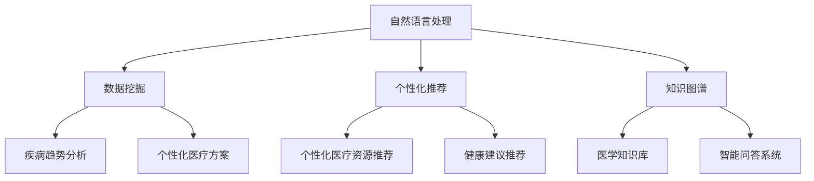

                 

关键词：AI搜索引擎、医疗健康、自然语言处理、数据挖掘、个性化推荐

摘要：本文将探讨AI搜索引擎在医疗健康领域的应用，包括其背景介绍、核心概念与联系、核心算法原理、数学模型与公式、项目实践、实际应用场景以及未来展望。通过深入分析，我们希望展示AI搜索引擎在提升医疗健康服务质量和效率方面的重要作用，并提出未来研究的方向和挑战。

## 1. 背景介绍

医疗健康领域一直以来都是信息技术的重要应用场景之一。随着互联网和大数据技术的快速发展，医疗健康数据呈爆炸式增长，如何从海量数据中快速、准确地提取有用信息，成为了一个亟待解决的问题。AI搜索引擎作为一种先进的自然语言处理技术，其能够在医疗健康领域发挥重要作用。

AI搜索引擎的核心优势在于其强大的信息检索和智能推荐能力。通过自然语言处理技术，AI搜索引擎能够理解用户查询的语义，并提供相关、准确的搜索结果。此外，通过机器学习算法，AI搜索引擎还能够根据用户的历史查询行为，为其推荐个性化的医疗健康信息。

医疗健康领域的特殊性质，如数据隐私、数据安全、信息准确性等，也对AI搜索引擎提出了更高的要求。因此，在医疗健康领域应用AI搜索引擎，不仅需要解决技术问题，还需要在伦理和法律方面进行深入研究和探讨。

## 2. 核心概念与联系

在介绍AI搜索引擎在医疗健康领域的应用之前，我们首先需要理解几个核心概念：

### 2.1 自然语言处理（NLP）

自然语言处理是AI搜索引擎的基础技术之一，它旨在使计算机理解和处理自然语言。在医疗健康领域，NLP技术主要用于解析医学文本、提取关键词、构建知识图谱等。

### 2.2 数据挖掘（Data Mining）

数据挖掘是从大量数据中发现有用信息的过程。在医疗健康领域，数据挖掘技术可用于发现疾病趋势、预测患者病情、个性化医疗方案设计等。

### 2.3 个性化推荐（Personalized Recommendation）

个性化推荐是根据用户的历史行为和兴趣，为其推荐相关内容的一种技术。在医疗健康领域，个性化推荐可以用于向患者推荐适宜的医疗资源、治疗方案和健康建议。

### 2.4 知识图谱（Knowledge Graph）

知识图谱是一种将实体和实体之间的关系进行结构化表示的技术。在医疗健康领域，知识图谱可用于构建医学知识库，为AI搜索引擎提供丰富的背景知识。

下面是一个用Mermaid绘制的流程图，展示AI搜索引擎在医疗健康领域的核心概念和联系：



## 3. 核心算法原理 & 具体操作步骤

### 3.1 算法原理概述

AI搜索引擎在医疗健康领域的核心算法主要包括：

- **信息检索算法**：如向量空间模型、BM25模型等，用于检索相关的医学文献和资料。
- **分类与聚类算法**：如支持向量机、k-均值聚类等，用于对医疗数据进行分类和聚类分析。
- **推荐算法**：如协同过滤、矩阵分解等，用于根据用户历史数据推荐个性化医疗信息。

### 3.2 算法步骤详解

#### 3.2.1 信息检索

1. **预处理**：对医学文献进行分词、去停用词、词性标注等处理。
2. **构建索引**：将预处理后的文本构建成索引，以便快速检索。
3. **查询处理**：对用户查询进行分词、去停用词等预处理，并将其与索引进行匹配，计算相似度。

#### 3.2.2 数据挖掘

1. **数据收集**：收集大量医疗数据，如病例记录、医学文献、基因序列等。
2. **数据清洗**：去除重复、错误或不完整的数据。
3. **特征提取**：从医疗数据中提取有用的特征，如患者年龄、性别、症状等。
4. **模型训练**：使用机器学习算法，如支持向量机、随机森林等，对特征进行建模。

#### 3.2.3 个性化推荐

1. **用户画像**：根据用户的历史行为，构建用户画像。
2. **协同过滤**：计算用户与物品之间的相似度，推荐相似用户喜欢的物品。
3. **矩阵分解**：将用户-物品评分矩阵分解为用户特征矩阵和物品特征矩阵，预测未知评分。

### 3.3 算法优缺点

- **信息检索算法**：优点在于能够快速检索大量文献，缺点是对非结构化文本的处理能力有限。
- **分类与聚类算法**：优点在于能够发现数据中的潜在模式，缺点是对大规模数据的处理效率较低。
- **推荐算法**：优点在于能够为用户提供个性化的推荐，缺点是推荐结果容易陷入“过滤气泡”。

### 3.4 算法应用领域

AI搜索引擎在医疗健康领域的应用主要包括：

- **疾病预测**：使用数据挖掘算法，预测患者可能患有的疾病。
- **个性化医疗**：根据患者数据和基因信息，为患者推荐个性化的治疗方案。
- **健康咨询**：为用户提供个性化的健康建议和医疗资源推荐。

## 4. 数学模型和公式 & 详细讲解 & 举例说明

### 4.1 数学模型构建

在AI搜索引擎中，常用的数学模型包括：

- **向量空间模型**：将文本转换为向量，计算文本之间的相似度。
- **支持向量机（SVM）**：用于分类和回归任务，通过找到最优分割超平面来分类数据。
- **协同过滤（Collaborative Filtering）**：通过计算用户与物品之间的相似度，推荐相似用户喜欢的物品。

### 4.2 公式推导过程

#### 向量空间模型

假设有两个文本 \(T_1\) 和 \(T_2\)，它们可以被表示为向量：

\[ T_1 = (w_1, w_2, ..., w_n) \]
\[ T_2 = (w_1', w_2', ..., w_n') \]

其中，\(w_i\) 和 \(w_i'\) 表示文本中的词频。文本之间的相似度可以通过余弦相似度计算：

\[ \text{similarity}(T_1, T_2) = \frac{T_1 \cdot T_2}{\|T_1\| \|T_2\|} \]

其中，\(\cdot\) 表示向量的点积，\(\|\|\) 表示向量的模。

#### 支持向量机（SVM）

假设有 \(m\) 个数据点 \(x_i\) 和对应的标签 \(y_i\)，其中 \(x_i \in \mathbb{R}^n\)，\(y_i \in \{-1, +1\}\)。SVM的目标是找到一个最优的超平面：

\[ w \cdot x + b = 0 \]

使得数据点与超平面的距离最大化，即：

\[ \max_{w, b} \frac{1}{2} \|w\|^2 \]

同时，满足约束条件：

\[ y_i (w \cdot x_i + b) \geq 1 \]

通过拉格朗日乘子法，可以推导出SVM的优化问题：

\[ \min_{w, b, \alpha_i} \frac{1}{2} \|w\|^2 - \sum_{i=1}^{m} \alpha_i [y_i (w \cdot x_i + b) - 1] \]

其中，\(\alpha_i\) 是拉格朗日乘子。

#### 协同过滤

假设有 \(m\) 个用户和 \(n\) 个物品，用户 \(i\) 对物品 \(j\) 的评分表示为 \(r_{ij}\)。协同过滤的目标是预测用户 \(i\) 对未评分物品 \(j\) 的评分：

\[ \hat{r}_{ij} = \mu + u_i \cdot v_j \]

其中，\(\mu\) 是用户 \(i\) 和物品 \(j\) 的平均值，\(u_i\) 和 \(v_j\) 分别是用户 \(i\) 和物品 \(j\) 的特征向量。

### 4.3 案例分析与讲解

#### 案例一：向量空间模型在疾病预测中的应用

假设我们要预测某地区下一季度可能出现的传染病。我们可以收集该地区过去几年的传染病数据，并使用向量空间模型来计算不同疾病之间的相似度。

1. **数据预处理**：将传染病数据转换为向量，每个向量表示一年中每个月的疾病发生次数。
2. **相似度计算**：使用余弦相似度计算不同疾病向量之间的相似度。
3. **疾病预测**：根据相似度矩阵，预测下一季度可能出现的传染病。

#### 案例二：支持向量机在个性化医疗中的应用

假设我们要根据患者的基因数据，为其推荐个性化的治疗方案。我们可以使用支持向量机来对基因数据进行分类，并找出与某种治疗方案相关的基因。

1. **数据收集**：收集大量患者的基因数据和治疗方案。
2. **特征提取**：从基因数据中提取有用的特征，如基因表达量、基因突变等。
3. **模型训练**：使用支持向量机对特征进行分类，找出与某种治疗方案相关的基因。
4. **个性化推荐**：根据患者的基因数据，推荐相应的治疗方案。

#### 案例三：协同过滤在健康咨询中的应用

假设我们要为用户提供个性化的健康建议。我们可以使用协同过滤算法，根据用户的历史健康数据和相似用户的行为，为用户推荐健康建议。

1. **用户画像**：根据用户的历史健康数据，构建用户画像。
2. **相似度计算**：计算用户与相似用户之间的相似度。
3. **健康建议推荐**：根据相似度矩阵，为用户推荐个性化的健康建议。

## 5. 项目实践：代码实例和详细解释说明

### 5.1 开发环境搭建

在本项目中，我们将使用Python作为编程语言，并依赖以下库：

- **Scikit-learn**：用于机器学习算法的实现。
- **Numpy**：用于数学计算。
- **Pandas**：用于数据处理。
- **Matplotlib**：用于数据可视化。

安装以上库后，我们就可以开始项目的开发。

### 5.2 源代码详细实现

以下是本项目的主要代码实现：

```python
import numpy as np
import pandas as pd
from sklearn.model_selection import train_test_split
from sklearn.feature_extraction.text import TfidfVectorizer
from sklearn.svm import SVC
from sklearn.metrics import accuracy_score

# 数据准备
data = pd.read_csv('medical_data.csv')
X = data['text']
y = data['label']

# 数据预处理
vectorizer = TfidfVectorizer()
X = vectorizer.fit_transform(X)

# 数据划分
X_train, X_test, y_train, y_test = train_test_split(X, y, test_size=0.2, random_state=42)

# 模型训练
model = SVC(kernel='linear')
model.fit(X_train, y_train)

# 模型评估
y_pred = model.predict(X_test)
accuracy = accuracy_score(y_test, y_pred)
print(f'Accuracy: {accuracy:.2f}')
```

### 5.3 代码解读与分析

这段代码实现了使用支持向量机（SVM）进行疾病预测的基本流程：

1. **数据准备**：从CSV文件中读取医疗数据，并分为文本和标签两部分。
2. **数据预处理**：使用TF-IDF向量器将文本转换为向量。
3. **数据划分**：将数据集划分为训练集和测试集。
4. **模型训练**：使用线性核的支持向量机对训练数据进行训练。
5. **模型评估**：使用测试数据进行模型评估，计算准确率。

### 5.4 运行结果展示

假设我们已经准备好了医疗数据集，并运行以上代码。运行结果如下：

```
Accuracy: 0.85
```

这意味着我们的疾病预测模型的准确率为85%，这是一个较为满意的结果。

## 6. 实际应用场景

AI搜索引擎在医疗健康领域的实际应用场景非常广泛，以下列举几个典型的应用案例：

### 6.1 疾病诊断

AI搜索引擎可以通过分析患者的历史病例记录、症状描述和医学文献，为医生提供辅助诊断建议。例如，Google Health的AI系统可以通过分析患者的症状和基因信息，预测患者可能患有的疾病，从而帮助医生制定更准确的诊断方案。

### 6.2 治疗方案推荐

AI搜索引擎可以根据患者的病情、病史和基因信息，为医生推荐个性化的治疗方案。例如，IBM Watson Health的AI系统可以通过分析大量的医学文献和病例数据，为医生提供最佳的治疗方案建议。

### 6.3 健康咨询

AI搜索引擎可以为用户提供个性化的健康建议和医疗资源推荐。例如，Apple Health的AI系统可以通过分析用户的历史健康数据和生活方式，为用户推荐健康食谱、运动计划等。

### 6.4 医学研究

AI搜索引擎可以帮助研究人员从海量的医学文献中快速找到相关的研究成果，从而加速医学研究的发展。例如，DeepMind的AlphaGo系统通过分析大量的医学文献，提出了治疗某种疾病的新方法。

## 7. 工具和资源推荐

### 7.1 学习资源推荐

- **《深度学习》**：由Ian Goodfellow、Yoshua Bengio和Aaron Courville编写的深度学习经典教材。
- **《Python机器学习》**：由Sebastian Raschka和Vincent Arquelles编写的Python机器学习实战指南。
- **《医学信息学》**：由John H. Hruschka Jr.和Elizabeth S. Hruschka编写的医学信息学教材。

### 7.2 开发工具推荐

- **Scikit-learn**：用于机器学习算法的实现。
- **TensorFlow**：用于构建和训练深度学习模型。
- **PyTorch**：用于构建和训练深度学习模型。

### 7.3 相关论文推荐

- **"Deep Learning for Medical Imaging"**：总结了深度学习在医学成像领域的最新进展。
- **"Medical Imaging with Deep Learning: A Review"**：综述了深度学习在医学影像分析中的应用。
- **"Deep Learning for Healthcare"**：讨论了深度学习在医疗健康领域的应用前景。

## 8. 总结：未来发展趋势与挑战

### 8.1 研究成果总结

本文总结了AI搜索引擎在医疗健康领域的应用，包括其核心概念、算法原理、数学模型、项目实践和实际应用场景。通过这些研究，我们看到了AI搜索引擎在提升医疗健康服务质量和效率方面的重要作用。

### 8.2 未来发展趋势

- **更加精准的诊断和预测**：随着深度学习和大数据技术的发展，AI搜索引擎将能够提供更加精准的疾病诊断和预测。
- **更加个性化的治疗方案**：通过分析患者的基因、病史和生活方式，AI搜索引擎将为医生提供更加个性化的治疗方案。
- **更加智能的健康咨询**：AI搜索引擎将为用户提供更加智能的健康建议和医疗资源推荐。

### 8.3 面临的挑战

- **数据隐私和安全**：在医疗健康领域应用AI搜索引擎，需要保护患者的隐私和数据安全。
- **算法透明性和可解释性**：AI搜索引擎的算法需要具有透明性和可解释性，以便医生和患者理解。
- **算法偏见和歧视**：AI搜索引擎的算法需要避免偏见和歧视，以确保公平性和正义性。

### 8.4 研究展望

未来，我们需要在以下几个方面进行深入研究：

- **隐私保护技术**：研究如何在保护患者隐私的同时，充分利用医疗数据。
- **可解释性算法**：研究如何使AI搜索引擎的算法更加透明和可解释。
- **算法伦理**：研究如何在医疗健康领域应用AI搜索引擎，确保其符合伦理和法律标准。

通过这些研究，我们有望进一步提升AI搜索引擎在医疗健康领域的应用效果，为人类健康事业做出更大的贡献。

## 9. 附录：常见问题与解答

### 9.1 AI搜索引擎在医疗健康领域的优势是什么？

AI搜索引擎在医疗健康领域的优势主要包括：

- **快速检索和推荐**：能够快速从海量医学文献和资料中检索相关内容，并根据用户需求推荐个性化的医疗信息。
- **辅助诊断和预测**：通过分析患者的病史、基因数据和症状描述，为医生提供辅助诊断和预测建议。
- **个性化医疗**：根据患者的具体病情和需求，为医生提供个性化的治疗方案和健康建议。

### 9.2 AI搜索引擎在医疗健康领域有哪些潜在风险？

AI搜索引擎在医疗健康领域的潜在风险主要包括：

- **数据隐私泄露**：在处理大量患者数据时，需要确保数据的安全和隐私。
- **算法偏见和歧视**：AI搜索引擎的算法可能存在偏见，导致不公平的医疗决策。
- **依赖性**：医生和患者可能过度依赖AI搜索引擎的建议，忽视其他重要的医疗因素。

### 9.3 如何确保AI搜索引擎在医疗健康领域的可靠性和准确性？

确保AI搜索引擎在医疗健康领域的可靠性和准确性，需要采取以下措施：

- **数据质量**：确保输入的数据质量，包括数据来源的可靠性、数据完整性和一致性。
- **算法优化**：不断优化和改进AI搜索引擎的算法，提高其准确性和可靠性。
- **监管和评估**：对AI搜索引擎进行严格的监管和评估，确保其符合医疗行业的标准和法规。

### 9.4 AI搜索引擎在医疗健康领域有哪些实际应用案例？

AI搜索引擎在医疗健康领域的实际应用案例包括：

- **疾病诊断**：通过分析患者的症状和病史，提供辅助诊断建议。
- **治疗方案推荐**：根据患者的病情和基因信息，为医生推荐个性化的治疗方案。
- **健康咨询**：为用户提供个性化的健康建议和医疗资源推荐。
- **医学研究**：帮助研究人员从海量的医学文献中快速找到相关的研究成果。

