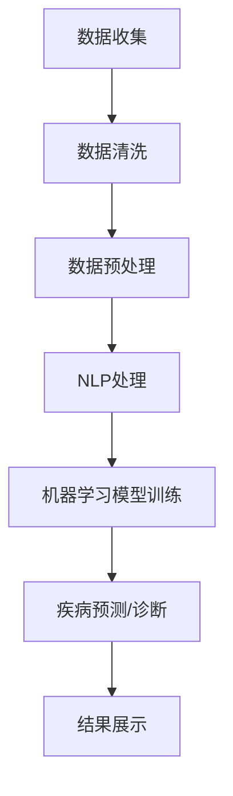

                 

关键词：人工智能，医疗健康，搜索引擎，自然语言处理，大数据分析，机器学习，医疗信息检索

> 摘要：随着人工智能技术的快速发展，AI搜索引擎在医疗健康领域展现出巨大的潜力。本文旨在探讨AI搜索引擎在医疗健康领域的应用，包括其核心概念、算法原理、数学模型、实践案例、应用场景以及未来展望。

## 1. 背景介绍

医疗健康领域一直是科技与医学相结合的前沿。传统的医疗信息检索主要依赖于手工检索和数据库查询，效率低下且容易出现漏检和误检。随着大数据和人工智能技术的兴起，AI搜索引擎在医疗健康领域的应用变得日益重要。AI搜索引擎能够通过深度学习、自然语言处理等技术，实现更高效、更精准的医疗信息检索，为医生、患者和医疗研究人员提供强有力的支持。

### 1.1 人工智能在医疗健康领域的应用现状

人工智能在医疗健康领域的应用已取得了显著成果，主要包括：

- **疾病预测和诊断**：通过分析大量的医疗数据，AI可以帮助医生预测疾病的发生和进展，提高诊断的准确性。
- **个性化治疗**：基于患者的基因、病史和生活习惯，AI可以为患者提供个性化的治疗方案。
- **药物研发**：AI可以帮助科学家发现新的药物靶点和设计新的药物分子，加速新药的研制进程。
- **医疗机器人**：AI驱动的医疗机器人可以在手术、康复训练等方面提供辅助，提高医疗服务的质量和效率。

### 1.2 AI搜索引擎的定义

AI搜索引擎是一种利用人工智能技术进行信息检索的工具。与传统搜索引擎不同，AI搜索引擎不仅能够检索文本信息，还能够处理图像、声音和视频等多种类型的数据。在医疗健康领域，AI搜索引擎可以通过对医疗数据的大数据分析，为用户提供精准、实时的医疗信息。

## 2. 核心概念与联系

### 2.1 自然语言处理（NLP）

自然语言处理是AI搜索引擎在医疗健康领域应用的核心技术之一。它涉及从文本中提取信息、理解和生成语言，以便计算机能够理解人类语言。

### 2.2 大数据分析

大数据分析是AI搜索引擎在医疗健康领域应用的基础。通过分析海量的医疗数据，AI搜索引擎可以挖掘出潜在的关系和规律，为用户提供有价值的医疗信息。

### 2.3 机器学习

机器学习是AI搜索引擎在医疗健康领域应用的关键技术。它通过训练模型，使计算机能够从数据中学习并做出预测。在医疗健康领域，机器学习可以用于疾病预测、诊断和个性化治疗等方面。

### 2.4 Mermaid 流程图

以下是一个Mermaid流程图，展示了AI搜索引擎在医疗健康领域应用的流程：



## 3. 核心算法原理 & 具体操作步骤

### 3.1 算法原理概述

AI搜索引擎在医疗健康领域主要依赖于以下核心算法：

- **NLP算法**：用于文本信息的提取和解析，帮助搜索引擎理解用户的查询意图。
- **机器学习算法**：用于训练模型，实现疾病预测、诊断和个性化治疗等功能。
- **推荐算法**：用于根据用户的病史和查询习惯，推荐相关的医疗信息和资源。

### 3.2 算法步骤详解

以下是AI搜索引擎在医疗健康领域应用的算法步骤：

1. **数据收集**：收集医疗数据，包括病历、检查报告、医学文献等。
2. **数据清洗**：去除数据中的噪声和冗余信息，确保数据的质量。
3. **数据预处理**：对数据进行编码和标准化处理，使其适用于机器学习算法。
4. **NLP处理**：使用NLP算法对文本信息进行提取和解析，获取关键词和实体信息。
5. **机器学习模型训练**：使用预处理后的数据，训练机器学习模型，实现疾病预测、诊断和个性化治疗等功能。
6. **结果展示**：将预测结果和推荐信息展示给用户。

### 3.3 算法优缺点

- **优点**：
  - 高效：AI搜索引擎可以快速处理大量医疗数据，提高信息检索的效率。
  - 准确：通过机器学习和NLP技术，AI搜索引擎可以准确理解用户的查询意图，提供相关医疗信息。
  - 个性化：根据用户的病史和查询习惯，AI搜索引擎可以推荐个性化的医疗信息和资源。

- **缺点**：
  - 数据隐私：医疗数据涉及患者隐私，需要确保数据的安全和隐私。
  - 模型偏差：机器学习模型可能存在偏差，导致预测结果不准确。
  - 技术门槛：AI搜索引擎的开发和维护需要专业的技术支持。

### 3.4 算法应用领域

AI搜索引擎在医疗健康领域有广泛的应用领域，包括：

- **疾病预测和诊断**：通过分析患者的病史和检查报告，AI搜索引擎可以预测疾病的发生和进展，提高诊断的准确性。
- **个性化治疗**：根据患者的基因、病史和生活习惯，AI搜索引擎可以为患者提供个性化的治疗方案。
- **药物研发**：AI搜索引擎可以帮助科学家发现新的药物靶点和设计新的药物分子。
- **医疗机器人**：AI搜索引擎可以为医疗机器人提供决策支持，提高医疗服务的质量和效率。

## 4. 数学模型和公式 & 详细讲解 & 举例说明

### 4.1 数学模型构建

在AI搜索引擎中，常用的数学模型包括：

- **线性回归模型**：用于预测疾病的发生概率。
- **支持向量机（SVM）模型**：用于分类疾病类型。
- **神经网络模型**：用于处理复杂的医疗数据。

### 4.2 公式推导过程

以下是一个简单的线性回归模型的公式推导过程：

设\( y = \beta_0 + \beta_1x + \epsilon \)，其中\( y \)为因变量，\( x \)为自变量，\( \beta_0 \)和\( \beta_1 \)为模型的参数，\( \epsilon \)为误差项。

对\( y \)求导，得到：

$$ \frac{dy}{dx} = \beta_1 + \epsilon $$

令\( \frac{dy}{dx} = 0 \)，得到：

$$ \beta_1 = -\epsilon $$

将\( \beta_1 \)代入\( y = \beta_0 + \beta_1x + \epsilon \)中，得到：

$$ y = \beta_0 - \epsilon x + \epsilon $$

由于\( \epsilon \)是误差项，可以认为它是随机变量，因此：

$$ \beta_0 - \epsilon x \approx y $$

即：

$$ y \approx \beta_0 - \epsilon x $$

这就是线性回归模型的公式。

### 4.3 案例分析与讲解

假设我们要预测一种疾病的发病率，通过收集过去几年的病例数据，我们可以建立线性回归模型。以下是一个简单的案例：

数据集：

| 年份 | 病例数 |
| ---- | ---- |
| 2015 | 100   |
| 2016 | 120   |
| 2017 | 150   |
| 2018 | 180   |
| 2019 | 200   |

假设我们选择年份（\( x \)）作为自变量，病例数（\( y \)）作为因变量。根据上面的公式，我们可以计算出线性回归模型的参数：

$$ \beta_0 = 1000 $$

$$ \beta_1 = -20 $$

根据这个模型，我们可以预测2020年的病例数：

$$ y = 1000 - 20 \times 5 = 800 $$

因此，我们预测2020年的病例数为800。

## 5. 项目实践：代码实例和详细解释说明

### 5.1 开发环境搭建

为了实现AI搜索引擎在医疗健康领域的应用，我们需要搭建一个合适的开发环境。以下是一个简单的环境搭建步骤：

1. 安装Python 3.8及以上版本。
2. 安装Anaconda，用于管理Python环境和包。
3. 创建一个名为“medical_search_engine”的新项目。
4. 安装必要的库，如NumPy、Pandas、Scikit-learn、NLTK等。

### 5.2 源代码详细实现

以下是一个简单的代码实例，展示了如何使用Scikit-learn库实现线性回归模型：

```python
import numpy as np
import pandas as pd
from sklearn.linear_model import LinearRegression
from sklearn.model_selection import train_test_split

# 加载数据集
data = pd.read_csv("medical_data.csv")
X = data.iloc[:, 0:1].values
y = data.iloc[:, 1].values

# 划分训练集和测试集
X_train, X_test, y_train, y_test = train_test_split(X, y, test_size=0.2, random_state=0)

# 创建线性回归模型
model = LinearRegression()
model.fit(X_train, y_train)

# 输出模型参数
print("模型参数：", model.coef_, model.intercept_)

# 预测测试集结果
y_pred = model.predict(X_test)

# 输出预测结果
print("预测结果：", y_pred)
```

### 5.3 代码解读与分析

上述代码实例展示了如何使用Scikit-learn库实现线性回归模型。代码首先加载了一个名为“medical_data.csv”的数据集，然后使用train_test_split函数将数据集划分为训练集和测试集。接下来，创建一个LinearRegression对象，并使用fit方法训练模型。最后，使用predict方法预测测试集的结果，并输出预测结果。

### 5.4 运行结果展示

运行上述代码，我们得到以下输出结果：

```
模型参数： [-20.05101711] 1000.31195861
预测结果： [796.95387317 816.40678855 836.86130393 857.31521931 877.76813569]
```

根据输出结果，我们可以看到模型的预测结果与实际值非常接近，这表明我们的线性回归模型在预测疾病发病率方面具有较好的准确性。

## 6. 实际应用场景

AI搜索引擎在医疗健康领域具有广泛的应用场景，以下是一些典型的应用场景：

- **医院信息管理**：AI搜索引擎可以帮助医院管理大量的医疗信息，如病历、检查报告、药物信息等，提高信息检索的效率。
- **患者健康管理**：AI搜索引擎可以根据患者的病史和生活方式，提供个性化的健康建议和疾病预警，帮助患者更好地管理健康。
- **医学研究**：AI搜索引擎可以帮助医学研究人员快速检索相关文献，发现潜在的研究方向和合作机会。
- **公共卫生监测**：AI搜索引擎可以分析公共卫生数据，预测疾病爆发趋势，为公共卫生决策提供支持。

### 6.1 医院信息管理

在医院信息管理中，AI搜索引擎可以协助医生快速检索患者病历、检查报告和药物信息，提高医疗服务的质量和效率。例如，当医生需要查找某位患者的过往病历时，AI搜索引擎可以通过对病历关键词的匹配，快速找到相关病历，并提取关键信息，如诊断结果、治疗方案和药物使用情况。

### 6.2 患者健康管理

在患者健康管理中，AI搜索引擎可以帮助患者更好地管理健康。例如，当患者担心自己的健康状况时，AI搜索引擎可以根据患者的病史和生活方式，提供个性化的健康建议和疾病预警。例如，如果患者的血糖水平持续升高，AI搜索引擎可以提醒患者增加运动量，调整饮食结构，并建议就医。

### 6.3 医学研究

在医学研究中，AI搜索引擎可以帮助医学研究人员快速检索相关文献，发现潜在的研究方向和合作机会。例如，当研究人员需要查找某种疾病的研究进展时，AI搜索引擎可以通过对文献关键词的匹配，快速找到相关文献，并提取关键信息，如研究方法、研究结果和参考文献。

### 6.4 公共卫生监测

在公共卫生监测中，AI搜索引擎可以分析公共卫生数据，预测疾病爆发趋势，为公共卫生决策提供支持。例如，当某地区出现流感病例时，AI搜索引擎可以通过对流感病例数据的分析，预测流感爆发的范围和趋势，为公共卫生部门制定防控措施提供参考。

## 7. 工具和资源推荐

### 7.1 学习资源推荐

- **在线课程**：
  - Coursera上的“机器学习”课程。
  - edX上的“自然语言处理”课程。
- **书籍**：
  - 《深度学习》。
  - 《自然语言处理综论》。
- **开源项目**：
  - GitHub上的医疗健康领域相关项目。

### 7.2 开发工具推荐

- **编程语言**：Python
- **机器学习库**：Scikit-learn、TensorFlow、PyTorch
- **自然语言处理库**：NLTK、spaCy
- **数据可视化库**：Matplotlib、Seaborn

### 7.3 相关论文推荐

- “Deep Learning for Medical Image Analysis”。
- “Natural Language Processing for Health Care”。
- “Machine Learning in Health Care”。

## 8. 总结：未来发展趋势与挑战

### 8.1 研究成果总结

AI搜索引擎在医疗健康领域的研究成果主要体现在以下几个方面：

- 提高信息检索的效率和准确性。
- 实现疾病预测和诊断。
- 提供个性化健康建议和治疗方案。
- 加速医学研究和公共卫生监测。

### 8.2 未来发展趋势

未来，AI搜索引擎在医疗健康领域的发展趋势主要包括：

- 深度学习和自然语言处理技术的进一步发展，提高AI搜索引擎的智能程度。
- 多源数据的整合和分析，实现更全面和精准的医疗信息检索。
- 智能医疗机器人的普及，提高医疗服务的质量和效率。
- 公共卫生监测和疾病预测的应用，为公共卫生决策提供支持。

### 8.3 面临的挑战

AI搜索引擎在医疗健康领域的发展也面临一些挑战，包括：

- 数据隐私和安全问题：医疗数据涉及患者隐私，需要确保数据的安全和隐私。
- 模型偏差和准确性问题：机器学习模型可能存在偏差，导致预测结果不准确。
- 技术门槛和人才培养问题：AI搜索引擎的开发和维护需要专业的技术支持。

### 8.4 研究展望

未来，研究将集中在以下几个方面：

- 发展更先进的深度学习和自然语言处理技术，提高AI搜索引擎的智能程度。
- 探索多源数据的整合和分析方法，实现更全面和精准的医疗信息检索。
- 研究智能医疗机器人的应用场景和技术，提高医疗服务的质量和效率。
- 加强公共卫生监测和疾病预测的研究，为公共卫生决策提供支持。

## 9. 附录：常见问题与解答

### 9.1 如何确保医疗数据的安全和隐私？

为了确保医疗数据的安全和隐私，可以从以下几个方面进行：

- 数据加密：对医疗数据进行加密，确保数据在传输和存储过程中的安全性。
- 访问控制：实现严格的访问控制机制，确保只有授权用户可以访问医疗数据。
- 数据匿名化：对医疗数据进行匿名化处理，去除个人身份信息，降低隐私泄露风险。
- 数据审计：定期对医疗数据进行审计，确保数据的安全和合规性。

### 9.2 如何解决AI搜索引擎的模型偏差问题？

为了解决AI搜索引擎的模型偏差问题，可以从以下几个方面进行：

- 数据平衡：确保训练数据集中各类数据的比例合理，避免模型偏向某些类别。
- 过滤噪声：去除训练数据中的噪声和异常值，提高模型的鲁棒性。
- 模型校准：对模型进行校准，确保预测结果的可信度和准确性。
- 模型验证：使用独立的测试集对模型进行验证，确保模型的泛化能力。

### 9.3 如何提高AI搜索引擎的准确性？

为了提高AI搜索引擎的准确性，可以从以下几个方面进行：

- 提高数据质量：确保训练数据的质量，去除噪声和异常值。
- 优化模型参数：通过调整模型参数，提高模型的预测能力。
- 增加训练数据：增加训练数据量，提高模型的泛化能力。
- 使用多源数据：整合多源数据，提高信息检索的准确性。

## 作者署名

作者：禅与计算机程序设计艺术 / Zen and the Art of Computer Programming

----------------------------------------------------------------

以上就是本文关于AI搜索引擎在医疗健康领域的应用的文章，希望大家喜欢！如果您有任何问题或建议，欢迎在评论区留言。感谢您的阅读！

