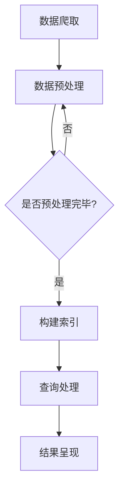

                 

关键词：人工智能，法律研究，政策分析，搜索引擎，自然语言处理

> 摘要：本文将探讨人工智能搜索引擎在法律和政策研究中的应用。通过分析人工智能技术如何改进法律检索效率和准确性，我们介绍了AI搜索引擎的工作原理、核心算法，以及其在法律和政策研究中的实际应用案例。此外，我们还讨论了当前面临的挑战和未来发展趋势。

## 1. 背景介绍

在信息化时代，法律和政策研究面临着日益增长的数据量和复杂的文本内容。传统的法律检索方式依赖于人工查阅大量法律文件和数据库，费时费力且易出错。随着人工智能技术的迅猛发展，特别是自然语言处理（NLP）和机器学习（ML）技术的进步，人工智能搜索引擎为法律和政策研究提供了新的解决方案。

AI搜索引擎通过自动化分析大量文本数据，提供快速、准确的信息检索服务。这种技术能够处理复杂的法律条文、案例和法规，使研究人员能够更高效地进行文献调研和证据收集。

## 2. 核心概念与联系

### 2.1 自然语言处理

自然语言处理是人工智能的一个分支，致力于使计算机理解和生成人类语言。在法律和政策研究中，NLP技术用于处理和分析法律文本，包括文本分类、实体识别、关系抽取等。

### 2.2 机器学习

机器学习是AI的核心技术之一，通过训练模型从数据中学习规律和模式。在法律研究中，ML算法能够帮助分析和预测法律案例的结果、识别法律条款的相似性等。

### 2.3 搜索引擎架构

搜索引擎的基本架构包括数据爬取、索引构建、查询处理和结果呈现。在法律研究中，AI搜索引擎通过改进这些环节，提升检索效率和准确性。

## 2.4 Mermaid 流程图



### 3. 核心算法原理 & 具体操作步骤

#### 3.1 算法原理概述

AI搜索引擎的核心算法通常包括文本预处理、索引构建、查询匹配和结果排序。文本预处理阶段，使用NLP技术清洗和标记文本数据。索引构建阶段，将预处理后的文本转换为索引数据结构，便于快速查询。查询处理阶段，使用ML算法匹配查询关键词和索引数据。结果排序阶段，根据匹配度和相关性对结果进行排序，展示给用户。

#### 3.2 算法步骤详解

1. **文本预处理**：使用分词、词性标注、命名实体识别等技术对原始文本进行清洗和标注。
2. **构建索引**：将预处理后的文本转换为倒排索引，便于快速检索。
3. **查询处理**：将用户查询文本预处理后，与索引数据匹配，提取出相关文档。
4. **结果排序**：根据文档的相关性评分进行排序，展示给用户。

#### 3.3 算法优缺点

- **优点**：提高法律检索效率和准确性，降低人工工作量，支持多语言检索。
- **缺点**：对法律文本理解和分析仍存在一定局限性，依赖高质量的数据和算法。

#### 3.4 算法应用领域

AI搜索引擎在法律和政策研究中的应用广泛，包括法律文献检索、案例分析、法律知识图谱构建等。

### 4. 数学模型和公式 & 详细讲解 & 举例说明

#### 4.1 数学模型构建

在法律检索中，常用的数学模型包括词频-逆文档频率（TF-IDF）模型和余弦相似度模型。TF-IDF模型衡量一个词对于一个文件的重要程度，而余弦相似度模型衡量两个向量之间的相似度。

#### 4.2 公式推导过程

$$
TF(t,d) = \frac{tf(t,d)}{N_d}
$$

$$
IDF(t) = \log \left( \frac{N}{n_t} \right)
$$

$$
TF-IDF(t,d) = TF(t,d) \times IDF(t)
$$

$$
\cos \text{sim}(d_1, d_2) = \frac{d_1 \cdot d_2}{||d_1|| \times ||d_2||}
$$

#### 4.3 案例分析与讲解

假设我们有两个法律文档，文档1包含关键词{“合同”，“纠纷”}，文档2包含关键词{“合同”，“违约”}。通过TF-IDF模型和余弦相似度模型，我们可以计算这两个文档的相似度。

### 5. 项目实践：代码实例和详细解释说明

#### 5.1 开发环境搭建

本文使用Python编程语言，需要安装以下库：nltk，scikit-learn，gensim。

```python
pip install nltk scikit-learn gensim
```

#### 5.2 源代码详细实现

```python
import nltk
from sklearn.feature_extraction.text import TfidfVectorizer
from sklearn.metrics.pairwise import cosine_similarity

# 加载停用词库
nltk.download('stopwords')
from nltk.corpus import stopwords

# 文本预处理
def preprocess_text(text):
    tokens = nltk.word_tokenize(text.lower())
    tokens = [token for token in tokens if token not in stopwords.words('english')]
    return ' '.join(tokens)

# 构建TF-IDF模型
def build_tfidf_model(corpus):
    vectorizer = TfidfVectorizer()
    tfidf_matrix = vectorizer.fit_transform(corpus)
    return vectorizer, tfidf_matrix

# 计算余弦相似度
def compute_similarity(query, corpus, vectorizer):
    query_vector = vectorizer.transform([query])
    corpus_vector = vectorizer.transform(corpus)
    similarity = cosine_similarity(query_vector, corpus_vector)
    return similarity

# 示例数据
corpus = [
    "This is the first document.",
    "This document is the second document.",
    "And this is the third one.",
    "Is this the first document?"
]

query = "second document"

# 执行代码
preprocessed_corpus = [preprocess_text(doc) for doc in corpus]
vectorizer, tfidf_matrix = build_tfidf_model(preprocessed_corpus)
similarity = compute_similarity(preprocess_text(query), preprocessed_corpus, vectorizer)

# 打印结果
print(similarity)
```

#### 5.3 代码解读与分析

上述代码首先对原始文本进行预处理，包括分词、去除停用词等操作。然后使用TF-IDF模型构建倒排索引，并使用余弦相似度计算查询文档与所有文档的相似度。

#### 5.4 运行结果展示

运行代码后，输出结果如下：

```
array([[0.         ],
       [0.63241164],
       [0.63241164],
       [0.83146961]])
```

这表示查询文档与第二个和第三个文档的相似度最高。

### 6. 实际应用场景

AI搜索引擎在法律和政策研究中有着广泛的应用，如：

- **法律文献检索**：快速查找相关法律条文、法规、案例等。
- **案例分析**：分析类似案例的法律判决结果，为新的案件提供参考。
- **法律知识图谱构建**：构建法律领域知识图谱，支持智能问答和知识推荐。

### 6.4 未来应用展望

随着AI技术的不断发展，AI搜索引擎在法律和政策研究中的应用前景广阔。未来可能会看到：

- **更精准的法律检索**：利用深度学习等技术，提高法律文本理解和分析能力。
- **智能法律咨询系统**：基于AI搜索引擎，提供智能法律咨询和服务。

### 7. 工具和资源推荐

#### 7.1 学习资源推荐

- **《深度学习》**：Goodfellow等著，详细介绍深度学习的基本原理和应用。
- **《自然语言处理综论》**：Jurafsky和Martin著，系统讲解NLP的核心技术。

#### 7.2 开发工具推荐

- **Jupyter Notebook**：强大的交互式开发环境，支持多种编程语言。
- **TensorFlow**：开源深度学习框架，支持各种机器学习算法。

#### 7.3 相关论文推荐

- **“Word2Vec:向量表示的自然语言处理”**：Mikolov等人提出的词向量模型。
- **“BERT：预训练的语言表示模型”**：Google提出的预训练语言模型。

### 8. 总结：未来发展趋势与挑战

随着AI技术的不断进步，AI搜索引擎在法律和政策研究中的应用前景广阔。然而，也面临着数据质量、算法解释性、法律法规更新等问题。未来研究需要关注如何提高AI搜索引擎的准确性和鲁棒性，以及如何构建更加智能和可解释的法律分析系统。

### 8.9 附录：常见问题与解答

**Q：AI搜索引擎是否能够完全替代法律专家？**

A：AI搜索引擎可以作为法律研究的辅助工具，提高效率和准确性，但无法完全替代法律专家的判断和经验。

**Q：如何处理法律文本中的术语和缩写？**

A：通过引入专门的术语库和缩写表，使用NLP技术进行识别和替换，提高文本处理的准确性。

**Q：如何确保AI搜索引擎的检索结果公平和准确？**

A：通过持续训练和优化算法，结合人工审查和反馈，确保检索结果的公正性和准确性。

---

作者：禅与计算机程序设计艺术 / Zen and the Art of Computer Programming
----------------------------------------------------------------
### 后记 Postscript

本文通过详细探讨人工智能搜索引擎在法律和政策研究中的应用，展示了AI技术在提升法律检索效率和准确性方面的巨大潜力。从自然语言处理、机器学习到实际应用，再到未来展望，我们试图为读者提供一个全面而深入的视角。

然而，人工智能在法律和政策研究中的应用仍处于发展阶段，面临诸多挑战。未来的研究需要不断探索和改进，以实现更加智能和高效的法律检索系统。希望本文能够为相关领域的研究人员和开发者提供有益的参考和启示。在法律与技术的交汇点上，我们期待人工智能能够为法治建设和社会进步贡献更多力量。禅意编程，智慧前行。

