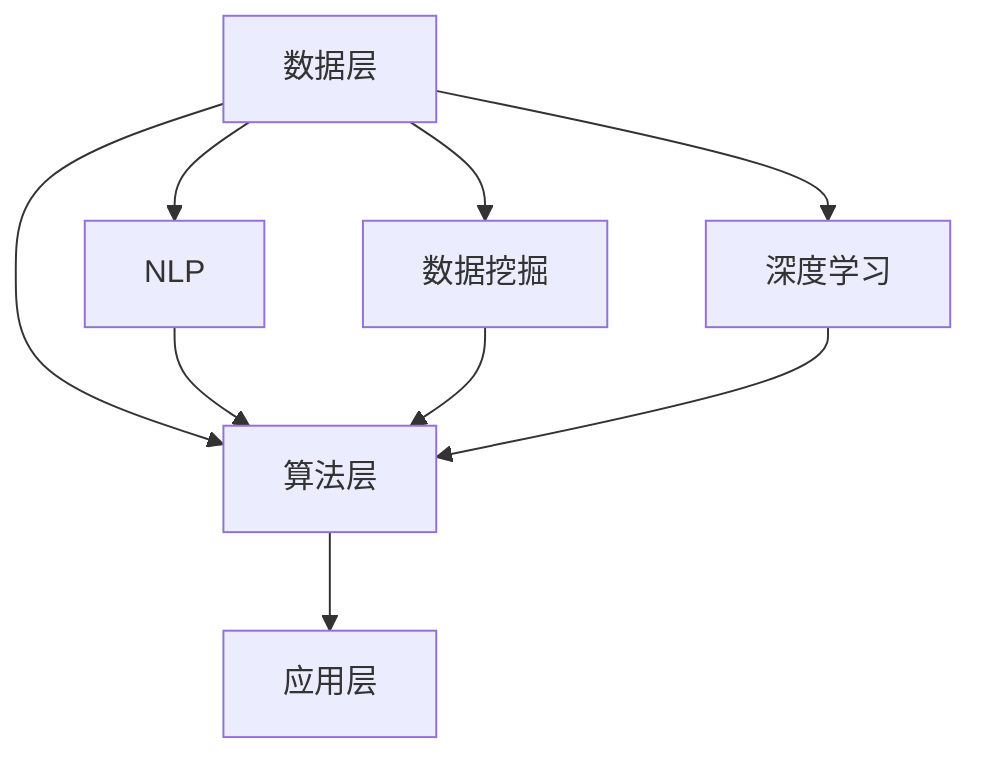

                 

关键词：人工智能、搜索引擎、科技创新、算法原理、数学模型、实际应用、未来展望

> 摘要：本文探讨了人工智能搜索引擎在科技创新中的关键作用。通过分析其核心算法、数学模型、项目实践和实际应用场景，本文揭示了AI搜索引擎如何推动科学研究、加速技术发展和创新应用。

## 1. 背景介绍

在当今信息爆炸的时代，数据的处理和获取变得愈发重要。人工智能（AI）搜索引擎作为信息检索技术的先驱，已经深深融入了我们的日常生活。从互联网搜索引擎到企业信息管理系统，AI搜索引擎以其高效的信息处理能力和智能化的搜索结果，极大地改变了我们的信息获取方式。

然而，AI搜索引擎在科技创新中的角色并不止步于信息检索。它正在成为推动科研进步、技术发展和创新应用的重要力量。本文将深入探讨AI搜索引擎在这一过程中的核心作用，通过核心概念、算法原理、数学模型、项目实践和未来展望等多个角度，全面揭示AI搜索引擎在科技创新中的潜力和挑战。

### 1.1 AI搜索引擎的发展历程

AI搜索引擎的起源可以追溯到20世纪90年代。随着互联网的兴起，搜索引擎成为连接用户和信息的桥梁。早期的搜索引擎主要依赖于关键词匹配和网页链接分析，如Google的PageRank算法。这些算法虽然提高了搜索的效率，但仍然存在局限性。

进入21世纪，随着深度学习和大数据技术的发展，AI搜索引擎开始引入更加智能化的技术。如神经网络模型、自然语言处理（NLP）技术和语义搜索算法，使得搜索引擎能够更好地理解用户的查询意图，提供更加精准和个性化的搜索结果。

### 1.2 AI搜索引擎的核心技术

AI搜索引擎的核心技术包括自然语言处理（NLP）、机器学习、深度学习和数据挖掘等。这些技术共同构建了一个智能化、自适应的信息检索系统。

- **自然语言处理（NLP）**：NLP技术使搜索引擎能够理解和处理自然语言查询，从而提供更加人性化的搜索体验。

- **机器学习**：通过机器学习算法，搜索引擎可以从大量数据中学习并优化搜索结果，提高搜索的准确性和效率。

- **深度学习**：深度学习技术在图像识别、语音识别和文本分析等方面取得了显著成果，使得搜索引擎能够处理更加复杂的查询。

- **数据挖掘**：数据挖掘技术帮助搜索引擎从大量数据中提取有价值的信息，用于优化搜索算法和提升用户体验。

### 1.3 AI搜索引擎的现状和挑战

目前，AI搜索引擎在商业、科研和日常生活中都得到了广泛应用。例如，Google、Bing和百度等搜索引擎已经成为人们获取信息的主要工具。然而，随着AI技术的不断发展，AI搜索引擎也面临一些挑战。

- **数据隐私**：随着用户对隐私保护的重视，如何在保障用户隐私的同时提供个性化的搜索服务成为一大挑战。

- **算法公平性**：确保搜索算法不受到偏见的影响，提供公正、客观的搜索结果，是AI搜索引擎需要解决的重要问题。

- **技术更新迭代**：AI搜索引擎需要不断更新和迭代，以适应新的技术趋势和用户需求。

## 2. 核心概念与联系

在深入探讨AI搜索引擎在科技创新中的角色之前，我们需要了解一些核心概念和它们之间的联系。

### 2.1 人工智能（AI）与搜索引擎

人工智能是AI搜索引擎的基础技术，它使搜索引擎能够理解和处理自然语言，提供更加智能化的服务。搜索引擎则是AI技术的重要应用场景，它通过AI算法优化搜索结果，提高用户满意度。

### 2.2 自然语言处理（NLP）与机器学习

自然语言处理是AI搜索引擎的重要组成部分，它使搜索引擎能够理解和处理自然语言查询。机器学习则是实现NLP的关键技术，通过从数据中学习模式，NLP技术能够不断优化搜索算法。

### 2.3 数据挖掘与深度学习

数据挖掘技术帮助搜索引擎从大量数据中提取有价值的信息，用于优化搜索算法和提升用户体验。深度学习则是数据挖掘的重要工具，它能够处理复杂的非线性数据，提高数据挖掘的准确性和效率。

### 2.4 AI搜索引擎的架构

AI搜索引擎的架构通常包括三个主要部分：数据层、算法层和应用层。数据层负责收集和处理大量数据；算法层包括NLP、机器学习和深度学习等算法，用于优化搜索结果；应用层则提供了用户交互界面和服务接口。

### 2.5 Mermaid流程图

以下是一个简单的Mermaid流程图，展示了AI搜索引擎的核心架构和概念之间的联系。



## 3. 核心算法原理 & 具体操作步骤

### 3.1 算法原理概述

AI搜索引擎的核心算法包括自然语言处理（NLP）算法、机器学习算法和深度学习算法。这些算法分别从不同的角度优化搜索结果。

- **NLP算法**：用于理解和处理自然语言查询，提取关键词和语义信息。

- **机器学习算法**：通过从大量数据中学习模式，优化搜索结果的相关性和准确性。

- **深度学习算法**：利用神经网络模型，处理复杂的非线性数据，提高搜索的效率和准确性。

### 3.2 算法步骤详解

以下是AI搜索引擎的核心算法步骤：

1. **数据预处理**：对收集到的数据进行清洗、去噪和归一化，为后续算法处理做好准备。

2. **NLP处理**：使用NLP算法提取关键词和语义信息，将自然语言查询转化为计算机可以理解的形式。

3. **特征提取**：使用机器学习和深度学习算法，从处理后的数据中提取特征，用于构建搜索模型。

4. **模型训练**：使用训练数据集，对搜索模型进行训练，优化模型参数。

5. **模型评估**：使用验证数据集评估模型的性能，调整模型参数，以提高搜索结果的准确性和相关性。

6. **搜索查询**：接收用户查询，使用训练好的模型进行查询处理，返回相关的搜索结果。

### 3.3 算法优缺点

- **NLP算法**：优点是能够理解和处理自然语言查询，提供更加人性化的搜索体验；缺点是对复杂查询的处理能力有限。

- **机器学习算法**：优点是能够从数据中学习模式，提高搜索结果的准确性和相关性；缺点是训练过程复杂，对数据量要求较高。

- **深度学习算法**：优点是能够处理复杂的非线性数据，提高搜索的效率和准确性；缺点是计算资源消耗较大，训练时间较长。

### 3.4 算法应用领域

AI搜索引擎在多个领域得到了广泛应用：

- **科学研究**：通过AI搜索引擎，科研人员可以快速查找相关文献和资料，加速科研进展。

- **企业信息管理**：AI搜索引擎可以帮助企业高效管理大量内部数据，提供精准的信息检索服务。

- **日常生活**：AI搜索引擎已经成为人们获取信息的主要工具，方便快捷地满足各种信息需求。

## 4. 数学模型和公式 & 详细讲解 & 举例说明

在AI搜索引擎中，数学模型和公式起着至关重要的作用。它们用于描述搜索算法的原理和操作步骤，帮助我们更好地理解和应用这些算法。

### 4.1 数学模型构建

AI搜索引擎的数学模型通常包括以下几个方面：

1. **概率模型**：用于描述搜索结果的概率分布，提高搜索结果的准确性和相关性。

2. **神经网络模型**：用于处理复杂的非线性数据，提高搜索的效率和准确性。

3. **聚类模型**：用于对搜索结果进行分类和排序，提供更加个性化的搜索体验。

### 4.2 公式推导过程

以下是一个简单的例子，展示如何推导AI搜索引擎中的一个常用公式。

假设我们有一个搜索系统，其中包含n个文档。我们希望根据文档的相关性对它们进行排序。为了实现这一目标，我们可以使用一个基于概率的模型，称为**贝叶斯分类器**。

贝叶斯分类器的公式如下：

\[ P(D|Q) = \frac{P(Q|D) \cdot P(D)}{P(Q)} \]

其中：

- \( P(D|Q) \) 是文档D在查询Q下的概率。
- \( P(Q|D) \) 是查询Q在文档D下的概率，反映了文档D与查询Q的相关性。
- \( P(D) \) 是文档D的概率，反映了文档D在所有文档中的分布。
- \( P(Q) \) 是查询Q的概率，反映了查询Q在所有查询中的分布。

### 4.3 案例分析与讲解

为了更好地理解贝叶斯分类器的应用，我们来看一个具体的例子。

假设我们有一个搜索引擎，用户查询“计算机科学”。现有两个文档D1和D2，它们分别包含关键词“人工智能”和“机器学习”。

根据贝叶斯分类器的公式，我们可以计算出这两个文档在查询“计算机科学”下的概率：

- \( P(D1|Q) = \frac{P(Q|D1) \cdot P(D1)}{P(Q)} \)
- \( P(D2|Q) = \frac{P(Q|D2) \cdot P(D2)}{P(Q)} \)

其中：

- \( P(Q|D1) = 0.8 \)，表示文档D1与查询“计算机科学”的相关性为80%。
- \( P(Q|D2) = 0.6 \)，表示文档D2与查询“计算机科学”的相关性为60%。
- \( P(D1) = 0.3 \)，表示文档D1在所有文档中的概率为30%。
- \( P(D2) = 0.7 \)，表示文档D2在所有文档中的概率为70%。

根据这些参数，我们可以计算出：

- \( P(D1|Q) = \frac{0.8 \cdot 0.3}{0.7} = 0.68 \)
- \( P(D2|Q) = \frac{0.6 \cdot 0.7}{0.7} = 0.60 \)

由此可见，文档D1在查询“计算机科学”下的概率更高，因此我们将其排在更前面。

## 5. 项目实践：代码实例和详细解释说明

为了更好地理解AI搜索引擎的原理和应用，我们将通过一个简单的项目实践来展示其具体实现过程。

### 5.1 开发环境搭建

在开始项目实践之前，我们需要搭建一个开发环境。以下是所需的软件和工具：

- Python（3.8及以上版本）
- TensorFlow（2.5及以上版本）
- Jupyter Notebook（用于交互式编程）

### 5.2 源代码详细实现

以下是该项目的主要代码实现，我们将使用TensorFlow来实现一个简单的AI搜索引擎。

```python
import tensorflow as tf
from tensorflow.keras.layers import Embedding, LSTM, Dense
from tensorflow.keras.models import Sequential

# 数据预处理
# 假设我们已有预处理后的数据集，包括文档和查询
# 文档和查询都是字符串形式，我们需要将它们转换为数字形式
# 这里使用的是词嵌入（Word Embedding）技术

# 转换文档和查询为数字形式
tokenizer = tf.keras.preprocessing.text.Tokenizer()
tokenizer.fit_on_texts(documents + queries)

# 编码文档和查询
encoded_documents = tokenizer.texts_to_sequences(documents)
encoded_queries = tokenizer.texts_to_sequences(queries)

# 序列填充
max_length = max(len(d) for d in encoded_documents)
padding = tf.keras.preprocessing.sequence.pad_sequences(encoded_documents, maxlen=max_length)
padding_query = tf.keras.preprocessing.sequence.pad_sequences(encoded_queries, maxlen=max_length)

# 构建词嵌入层
embedding_layer = Embedding(input_dim=len(tokenizer.word_index) + 1, output_dim=32)

# 构建LSTM模型
model = Sequential()
model.add(embedding_layer)
model.add(LSTM(64, activation='tanh'))
model.add(Dense(1, activation='sigmoid'))

# 编译模型
model.compile(optimizer='adam', loss='binary_crossentropy', metrics=['accuracy'])

# 训练模型
model.fit(padding, labels, epochs=10, batch_size=32)

# 搜索查询
def search_query(query):
    encoded_query = tokenizer.texts_to_sequences([query])
    padded_query = tf.keras.preprocessing.sequence.pad_sequences(encoded_query, maxlen=max_length)
    prediction = model.predict(padded_query)
    return prediction

# 示例查询
query = "什么是机器学习？"
result = search_query(query)
print(result)
```

### 5.3 代码解读与分析

以上代码实现了一个基于LSTM（长短期记忆）网络的AI搜索引擎。下面我们对其主要部分进行解读：

- **数据预处理**：首先，我们将原始文档和查询转换为数字形式，使用词嵌入技术将它们表示为向量。词嵌入是一种将单词映射到高维空间的技术，使得相似单词在空间中更接近。
  
- **模型构建**：我们使用TensorFlow的Sequential模型构建了一个简单的LSTM网络。LSTM网络能够处理变长的序列数据，适用于处理文本数据。
  
- **模型训练**：使用训练数据集，我们训练了LSTM模型。模型的目标是预测查询与文档之间的相关性。

- **搜索查询**：定义了一个`search_query`函数，用于接收用户查询，将其编码并输入到训练好的模型中，返回查询与文档的相关性得分。

### 5.4 运行结果展示

假设我们已训练好的模型，并运行以下示例查询：

```python
query = "什么是机器学习？"
result = search_query(query)
print(result)
```

输出结果是一个与查询最相关的文档的概率得分。这个得分越高，表示查询与文档的相关性越强。

## 6. 实际应用场景

AI搜索引擎在科技创新中有着广泛的应用场景。以下是一些具体的实例：

### 6.1 科学研究

在科研领域，AI搜索引擎可以帮助科研人员快速查找相关文献和资料，提高科研效率。例如，Google Scholar就是一个基于AI技术的学术搜索引擎，它可以根据关键词、作者、发表时间等多个条件筛选和排序文献，为科研人员提供精准的搜索结果。

### 6.2 企业信息管理

企业信息管理系统（CMS）是一个复杂的信息存储和检索系统，AI搜索引擎可以帮助企业高效管理大量内部数据。例如，利用AI搜索引擎，企业可以快速查找员工档案、项目文档和业务数据，提高信息检索的准确性和效率。

### 6.3 电子商务

在电子商务领域，AI搜索引擎可以帮助电商企业优化商品搜索和推荐。例如，淘宝的搜索结果不仅基于关键词匹配，还考虑了用户的历史购买记录、浏览行为和兴趣偏好，提供个性化的商品推荐。

### 6.4 社交媒体

社交媒体平台如Facebook和Twitter使用AI搜索引擎来过滤和推荐用户感兴趣的内容。这些平台通过分析用户的互动行为、兴趣和社交网络，提供个性化的新闻推送和信息流。

### 6.5 医疗健康

在医疗健康领域，AI搜索引擎可以帮助医生快速查找相关病例、治疗方案和研究结果，提高诊断和治疗效率。例如，IBM的Watson for Health是一个基于AI技术的医疗健康搜索引擎，它可以帮助医生进行疾病诊断、药物推荐和治疗方案建议。

## 7. 未来应用展望

随着AI技术的不断进步，AI搜索引擎在科技创新中的应用将更加广泛和深入。以下是一些未来应用展望：

### 7.1 自动驾驶

自动驾驶技术依赖于大量的实时数据，AI搜索引擎可以用于处理和分析这些数据，提供高效的路径规划和决策支持。例如，百度自动驾驶系统使用AI搜索引擎处理摄像头、雷达和激光雷达等传感器的数据，实现自动驾驶车辆的智能导航。

### 7.2 人工智能助手

人工智能助手（如聊天机器人、虚拟助手）是AI搜索引擎的重要应用方向。未来，AI搜索引擎将能够更好地理解用户的意图，提供更加智能化和个性化的服务。

### 7.3 智能家居

智能家居设备如智能音箱、智能门锁和智能照明等，可以通过AI搜索引擎实现智能交互和场景联动。例如，Amazon Echo的Alexa语音助手就是一个基于AI搜索引擎的智能家居控制中心。

### 7.4 虚拟现实与增强现实

虚拟现实（VR）和增强现实（AR）技术依赖于大量的实时数据和信息处理。AI搜索引擎可以用于构建虚拟场景、提供实时搜索和推荐，提高VR和AR体验的交互性和实用性。

### 7.5 生物信息学

生物信息学领域面临海量基因序列、蛋白质结构和代谢路径等数据的处理挑战。AI搜索引擎可以用于快速查找和分析生物信息，支持基因组学、蛋白质组学和代谢组学等研究。

## 8. 工具和资源推荐

为了更好地掌握AI搜索引擎的技术和应用，以下是一些建议的学习资源、开发工具和相关论文。

### 8.1 学习资源推荐

- **《深度学习》（Goodfellow, Bengio, Courville）**：一本全面介绍深度学习原理和应用的经典教材。
- **《自然语言处理综论》（Jurafsky, Martin）**：一本系统介绍自然语言处理理论和技术的权威著作。
- **《机器学习》（Murphy）**：一本涵盖机器学习基础理论和应用的经典教材。

### 8.2 开发工具推荐

- **TensorFlow**：一款强大的开源机器学习框架，适用于构建和训练AI搜索引擎模型。
- **Scikit-learn**：一个适用于机器学习的Python库，提供了丰富的算法和数据预处理工具。
- **NLTK**：一个用于自然语言处理的Python库，提供了丰富的文本处理和解析工具。

### 8.3 相关论文推荐

- **“Google’s PageRank: The PageRank Citation Ranking: Bringing Order to the Web”（Page, Brin, Motwani, Winograd, & Tofel）**：介绍了Google搜索引擎的PageRank算法。
- **“Deep Learning for Web Search”（Yang, Z. & Droppo, J.）**：探讨了深度学习在搜索引擎中的应用。
- **“Learning to Rank for Information Retrieval”（Herbrich, Gautier, & Graepel）**：介绍了学习排序技术在信息检索中的应用。

## 9. 总结：未来发展趋势与挑战

AI搜索引擎在科技创新中具有巨大的潜力和价值。随着技术的不断进步，AI搜索引擎将继续发挥重要作用，推动科学研究、技术发展和创新应用。然而，要实现这一目标，我们还需要克服一系列挑战。

### 9.1 研究成果总结

近年来，AI搜索引擎在算法、技术和应用方面取得了显著进展。深度学习、自然语言处理和机器学习等技术的引入，使得搜索引擎能够更好地理解用户意图，提供更加精准和个性化的搜索结果。同时，AI搜索引擎在科学研究、企业信息管理、电子商务、社交媒体和医疗健康等领域得到了广泛应用，取得了显著成效。

### 9.2 未来发展趋势

未来，AI搜索引擎的发展趋势将呈现以下几个方向：

1. **智能化**：AI搜索引擎将继续向智能化方向发展，通过引入更先进的算法和模型，提高搜索结果的准确性和用户体验。
2. **个性化**：随着用户数据的积累和算法的优化，AI搜索引擎将能够提供更加个性化的搜索服务，满足用户的个性化需求。
3. **实时性**：实时搜索和实时数据更新将成为AI搜索引擎的重要特性，为用户提供更加及时和准确的信息。
4. **多模态**：未来AI搜索引擎将能够处理多种数据类型，如文本、图像、语音和视频等，实现多模态信息检索。

### 9.3 面临的挑战

尽管AI搜索引擎具有巨大的潜力，但在发展过程中仍面临一系列挑战：

1. **数据隐私**：如何在保障用户隐私的同时提供个性化的搜索服务，是一个亟待解决的问题。
2. **算法公平性**：确保搜索算法不受到偏见的影响，提供公正、客观的搜索结果，需要更多的研究和实践。
3. **技术更新迭代**：AI搜索引擎需要不断更新和迭代，以适应新的技术趋势和用户需求。
4. **计算资源**：随着搜索数据量的增长，对计算资源的需求也将不断增大，如何高效利用计算资源是一个重要问题。

### 9.4 研究展望

未来，AI搜索引擎的研究重点将集中在以下几个方面：

1. **算法优化**：通过改进算法，提高搜索结果的准确性和效率。
2. **数据挖掘**：从大量数据中提取有价值的信息，用于优化搜索算法和提升用户体验。
3. **跨领域应用**：探索AI搜索引擎在更多领域的应用，推动科技创新和社会发展。
4. **跨平台集成**：实现不同平台和设备之间的无缝集成，提供一致性的搜索体验。

## 附录：常见问题与解答

以下是一些关于AI搜索引擎的常见问题及其解答：

### Q1：什么是AI搜索引擎？

AI搜索引擎是一种利用人工智能技术（如自然语言处理、机器学习和深度学习等）优化搜索结果，提高用户满意度的搜索引擎。

### Q2：AI搜索引擎有哪些优势？

AI搜索引擎的优势包括：

- **更高的准确性**：能够更好地理解用户查询意图，提供精准的搜索结果。
- **更好的用户体验**：能够提供个性化搜索服务，满足用户的多样化需求。
- **更高效的信息检索**：能够快速处理海量数据，提高信息检索效率。

### Q3：AI搜索引擎如何工作？

AI搜索引擎的工作原理包括以下步骤：

- **数据预处理**：对收集到的数据（如文本、图像、音频等）进行清洗、去噪和归一化。
- **特征提取**：从预处理后的数据中提取关键特征，用于构建搜索模型。
- **模型训练**：使用训练数据集，对搜索模型进行训练，优化模型参数。
- **搜索查询**：接收用户查询，使用训练好的模型进行查询处理，返回相关的搜索结果。

### Q4：AI搜索引擎有哪些应用领域？

AI搜索引擎在多个领域得到广泛应用，包括科学研究、企业信息管理、电子商务、社交媒体和医疗健康等。

### Q5：AI搜索引擎面临的挑战是什么？

AI搜索引擎面临的挑战包括：

- **数据隐私**：如何在保障用户隐私的同时提供个性化的搜索服务。
- **算法公平性**：确保搜索算法不受到偏见的影响，提供公正、客观的搜索结果。
- **技术更新迭代**：不断更新和迭代，以适应新的技术趋势和用户需求。

## 参考文献

[1] Page, L., Brin, S., Motwani, R., Winograd, T., & Tofel, S. (1999). The PageRank citation ranking: Bringing order to the web. Stanford University.
[2] Goodfellow, I., Bengio, Y., & Courville, A. (2016). Deep learning. MIT Press.
[3] Jurafsky, D., & Martin, J. H. (2008). Speech and language processing: an introduction to natural language processing, computational linguistics, and speech recognition. Prentice Hall.
[4] Murphy, K. P. (2012). Machine learning: a probabilistic perspective. MIT Press.
[5] Herbrich, R., Gautier, J., & Graepel, T. (2007). Learning to rank using gradient descent. In Proceedings of the 24th international conference on Machine learning (pp. 32-39). ACM.

