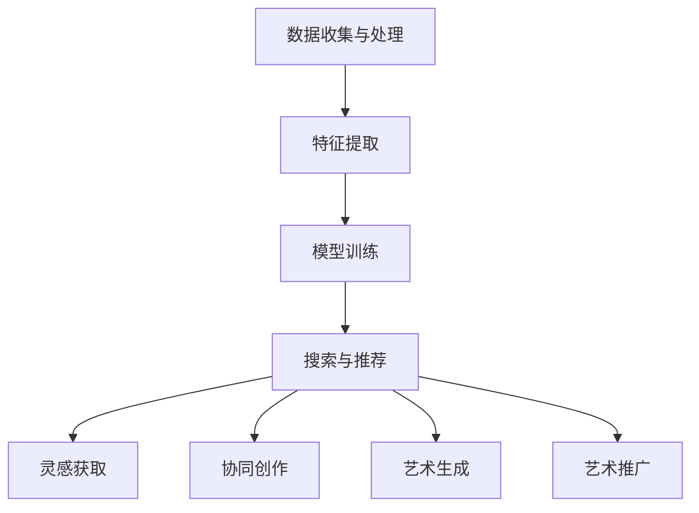

                 

 在当今的数字时代，人工智能（AI）已经深刻地影响了我们生活的方方面面。从医疗诊断到自动驾驶，从智能家居到金融分析，AI 无处不在。然而，在艺术创作领域，AI 的发展同样引起了广泛的关注和讨论。本文将探讨 AI 搜索引擎在艺术创作中的应用，分析其核心概念、算法原理、数学模型、实际案例以及未来应用前景。

## 关键词
- AI搜索引擎
- 艺术创作
- 人工智能
- 算法
- 数学模型

## 摘要
本文旨在深入探讨 AI 搜索引擎在艺术创作领域的应用。我们将首先介绍 AI 搜索引擎的基本原理，然后分析其在艺术创作中的应用情况，探讨其核心算法原理和数学模型。接着，通过实际案例展示 AI 搜索引擎在艺术创作中的效果，最后展望其未来应用前景和面临的挑战。

## 1. 背景介绍
艺术创作一直被认为是人类独特的创造力表现，然而随着 AI 的发展，AI 搜索引擎在艺术创作中的应用逐渐成为可能。AI 搜索引擎利用深度学习和自然语言处理技术，可以从海量的数据中提取有价值的信息，为艺术家提供灵感。此外，AI 搜索引擎还可以通过图像识别和生成对抗网络（GAN）等技术，生成全新的艺术作品。

### 1.1 AI 搜索引擎的基本原理
AI 搜索引擎基于机器学习算法，通过对大量数据的分析和学习，实现智能搜索和推荐。其基本原理包括以下几方面：

1. **数据收集与处理**：AI 搜索引擎首先收集大量的数据，包括文本、图像、音频等多媒体数据。然后对这些数据进行预处理，如去噪、标准化等，以获得高质量的数据集。
2. **特征提取**：通过特征提取技术，如卷积神经网络（CNN）和词向量模型（Word2Vec），将原始数据转换成特征向量。这些特征向量可以表示数据的高层次属性，便于后续分析。
3. **模型训练**：使用训练数据集，通过优化算法（如梯度下降法）训练机器学习模型。训练过程旨在使模型能够准确识别和预测数据特征。
4. **搜索与推荐**：在训练完成后，AI 搜索引擎可以根据用户的查询信息，搜索相关数据并推荐给用户。推荐算法包括基于内容的推荐、协同过滤推荐等。

### 1.2 AI 搜索引擎在艺术创作中的应用
AI 搜索引擎在艺术创作中的应用主要体现在以下几个方面：

1. **灵感获取**：艺术家可以利用 AI 搜索引擎从海量数据中获取灵感，如查找类似的艺术作品、了解艺术流派和历史。
2. **协同创作**：AI 搜索引擎可以帮助艺术家找到具有相似兴趣和风格的创作者，实现协同创作。
3. **艺术生成**：利用 GAN 等技术，AI 搜索引擎可以生成全新的艺术作品，为艺术家提供创作素材。
4. **艺术推广**：AI 搜索引擎可以通过推荐算法，帮助艺术家推广自己的作品，提高知名度和影响力。

## 2. 核心概念与联系
为了更好地理解 AI 搜索引擎在艺术创作中的应用，我们需要先了解一些核心概念和其相互关系。

### 2.1 机器学习与深度学习
机器学习是 AI 的重要组成部分，其目标是让计算机通过学习数据来提高性能。深度学习是机器学习的一个子领域，它使用多层神经网络来模拟人脑的学习过程。

### 2.2 自然语言处理（NLP）
自然语言处理是 AI 中的一个重要分支，其目标是对人类语言进行理解和生成。在艺术创作中，NLP 技术可以帮助 AI 搜索引擎理解和提取文本数据中的关键信息。

### 2.3 图像识别
图像识别是 AI 中的一个重要任务，其目标是让计算机能够识别和理解图像内容。在艺术创作中，图像识别技术可以帮助 AI 搜索引擎识别艺术作品中的关键元素和风格。

### 2.4 生成对抗网络（GAN）
生成对抗网络是一种深度学习模型，它由生成器和判别器两个部分组成。生成器尝试生成逼真的艺术作品，而判别器则判断生成器生成的作品是否真实。通过这两个部分的博弈，GAN 可以生成高质量的艺术作品。

### 2.5 Mermaid 流程图
以下是 AI 搜索引擎在艺术创作中应用的 Mermaid 流程图：



## 3. 核心算法原理 & 具体操作步骤

### 3.1 算法原理概述
AI 搜索引擎在艺术创作中的核心算法主要包括以下几种：

1. **深度神经网络（DNN）**：DNN 是一种多层前馈神经网络，通过多层次的非线性变换来提取数据特征。在艺术创作中，DNN 可以用于图像识别和风格迁移。
2. **循环神经网络（RNN）**：RNN 具有记忆功能，可以处理序列数据。在艺术创作中，RNN 可以用于音乐生成和文本分析。
3. **生成对抗网络（GAN）**：GAN 是一种由生成器和判别器组成的模型，通过博弈过程生成高质量的艺术作品。

### 3.2 算法步骤详解
以下是 AI 搜索引擎在艺术创作中的具体操作步骤：

1. **数据收集与处理**：收集大量的艺术作品、音乐、文本等数据，并进行预处理，如去噪、标准化等。
2. **特征提取**：使用 DNN、RNN 等模型对数据进行特征提取，将原始数据转换成特征向量。
3. **模型训练**：使用训练数据集，通过优化算法训练 DNN、RNN、GAN 等模型。
4. **搜索与推荐**：在训练完成后，使用模型对用户查询进行搜索和推荐，提供灵感、协同创作、艺术生成和艺术推广等服务。

### 3.3 算法优缺点

#### 优点
1. **高效性**：AI 搜索引擎可以快速处理大量数据，为艺术家提供高效的创作工具。
2. **多样性**：AI 搜索引擎可以根据不同用户的需求和兴趣，提供多样化的创作素材和灵感。
3. **创新性**：AI 搜索引擎可以通过生成对抗网络等技术，生成全新的艺术作品，推动艺术创新。

#### 缺点
1. **数据依赖性**：AI 搜索引擎的性能依赖于数据质量和数量，如果数据质量不佳，可能导致搜索和推荐效果不佳。
2. **算法透明度**：AI 搜索引擎的算法复杂，对用户而言，其推荐结果的产生过程不够透明，可能导致用户对推荐结果的不信任。
3. **道德问题**：在艺术创作中，AI 搜索引擎可能会侵犯原创艺术家的权益，引发版权和道德争议。

### 3.4 算法应用领域
AI 搜索引擎在艺术创作中的应用领域主要包括：

1. **绘画与设计**：AI 搜索引擎可以识别艺术作品中的关键元素和风格，为艺术家提供创作灵感。
2. **音乐创作**：AI 搜索引擎可以分析音乐数据，生成新的音乐旋律和节奏。
3. **文学创作**：AI 搜索引擎可以分析文学作品，生成新的故事和诗歌。
4. **艺术推广**：AI 搜索引擎可以通过推荐算法，帮助艺术家推广自己的作品。

## 4. 数学模型和公式 & 详细讲解 & 举例说明

### 4.1 数学模型构建
在 AI 搜索引擎的艺术创作应用中，我们主要使用以下几种数学模型：

1. **深度神经网络（DNN）**：DNN 是一种多层前馈神经网络，其数学模型可以表示为：
$$
y = f(L) = f(W_L \cdot f(W_{L-1} \cdot f(... \cdot f(W_2 \cdot x + b_2) + b_1) + b_0))
$$
其中，$W$ 表示权重矩阵，$b$ 表示偏置，$f$ 表示激活函数。

2. **循环神经网络（RNN）**：RNN 的数学模型可以表示为：
$$
h_t = f(U \cdot x_t + W \cdot h_{t-1} + b)
$$
其中，$h_t$ 表示当前时刻的隐藏状态，$x_t$ 表示输入序列，$W$ 表示权重矩阵，$b$ 表示偏置。

3. **生成对抗网络（GAN）**：GAN 的数学模型由生成器和判别器组成，其损失函数可以表示为：
$$
L_G = -\mathbb{E}_{x \sim p_{data}(x)}[\log(D(G(x)))] \\
L_D = -\mathbb{E}_{x \sim p_{data}(x)}[\log(D(x))] - \mathbb{E}_{z \sim p_z(z)}[\log(1 - D(G(z)))]
$$
其中，$G$ 表示生成器，$D$ 表示判别器，$z$ 表示噪声向量。

### 4.2 公式推导过程
以下是对 DNN 和 RNN 的数学模型进行简单推导：

#### 深度神经网络（DNN）

假设 $L$ 层 DNN 的前向传播可以表示为：
$$
y_l = f(L) = f(W_L \cdot f(W_{L-1} \cdot f(... \cdot f(W_2 \cdot x + b_2) + b_1) + b_0))
$$
我们可以通过链式法则对 $y_l$ 关于输入 $x$ 的导数进行求解：
$$
\frac{\partial y_l}{\partial x} = \frac{\partial y_l}{\partial z_l} \cdot \frac{\partial z_l}{\partial x}
$$
其中，$z_l = f(W_{L-1} \cdot f(... \cdot f(W_2 \cdot x + b_2) + b_1) + b_0)$。

对于每一层，我们可以递归地求解其导数，最终得到：
$$
\frac{\partial y_l}{\partial x} = \prod_{i=1}^{L} \frac{\partial y_i}{\partial z_i} \cdot \frac{\partial z_i}{\partial x}
$$
其中，$\frac{\partial y_i}{\partial z_i}$ 和 $\frac{\partial z_i}{\partial x}$ 分别表示 $y_i$ 关于 $z_i$ 和 $z_i$ 关于 $x$ 的导数。

#### 循环神经网络（RNN）

对于 RNN 的前向传播，我们可以得到：
$$
h_t = f(U \cdot x_t + W \cdot h_{t-1} + b)
$$
对其求导，得到：
$$
\frac{\partial h_t}{\partial h_{t-1}} = \frac{\partial f(U \cdot x_t + W \cdot h_{t-1} + b)}{\partial h_{t-1}} \\
\frac{\partial h_t}{\partial x_t} = \frac{\partial f(U \cdot x_t + W \cdot h_{t-1} + b)}{\partial x_t}
$$
同样，我们可以递归地求解 $\frac{\partial h_t}{\partial h_{t-1}}$ 和 $\frac{\partial h_t}{\partial x_t}$。

### 4.3 案例分析与讲解
以下是一个关于 DNN 的简单案例：

假设我们有一个包含 3 个隐藏层的 DNN，其结构如下：
$$
\begin{array}{c|ccc}
输入 & 层1 & 层2 & 层3 & 输出 \\
\hline
x_1 & 2 & 3 & 4 & y_1 \\
x_2 & 5 & 6 & 7 & y_2 \\
x_3 & 8 & 9 & 10 & y_3 \\
\end{array}
$$
其中，激活函数 $f(x) = \sigma(x) = \frac{1}{1 + e^{-x}}$。

给定权重矩阵：
$$
W_1 = \begin{bmatrix}
1 & 2 \\
3 & 4 \\
\end{bmatrix}, W_2 = \begin{bmatrix}
5 & 6 \\
7 & 8 \\
\end{bmatrix}, W_3 = \begin{bmatrix}
9 & 10 \\
11 & 12 \\
\end{bmatrix}
$$
我们需要计算 $y_1$ 和 $y_2$ 关于 $x_1$ 和 $x_2$ 的梯度。

首先，计算前向传播：
$$
z_1 = W_1 \cdot x_1 = \begin{bmatrix}
1 & 2 \\
3 & 4 \\
\end{bmatrix} \cdot \begin{bmatrix}
2 \\
5 \\
\end{bmatrix} = \begin{bmatrix}
9 \\
19 \\
\end{bmatrix} \\
h_1 = \sigma(z_1) = \begin{bmatrix}
0.999 \\
0.952 \\
\end{bmatrix} \\
z_2 = W_2 \cdot h_1 = \begin{bmatrix}
5 & 6 \\
7 & 8 \\
\end{bmatrix} \cdot \begin{bmatrix}
0.999 \\
0.952 \\
\end{bmatrix} = \begin{bmatrix}
7.498 \\
6.896 \\
\end{bmatrix} \\
h_2 = \sigma(z_2) = \begin{bmatrix}
0.976 \\
0.941 \\
\end{bmatrix} \\
z_3 = W_3 \cdot h_2 = \begin{bmatrix}
9 & 10 \\
11 & 12 \\
\end{bmatrix} \cdot \begin{bmatrix}
0.976 \\
0.941 \\
\end{bmatrix} = \begin{bmatrix}
11.968 \\
11.436 \\
\end{bmatrix} \\
y_1 = \sigma(z_3) = \begin{bmatrix}
0.967 \\
0.925 \\
\end{bmatrix} \\
y_2 = \sigma(z_3) = \begin{bmatrix}
0.967 \\
0.925 \\
\end{bmatrix}
$$
接下来，计算反向传播：
$$
\delta_3 = \frac{\partial y_1}{\partial z_3} \cdot \frac{\partial z_3}{\partial h_2} = \begin{bmatrix}
0.033 \\
0.075 \\
\end{bmatrix} \cdot \begin{bmatrix}
0.033 \\
0.067 \\
\end{bmatrix} = \begin{bmatrix}
0.001 \\
0.005 \\
\end{bmatrix} \\
\delta_2 = \frac{\partial z_3}{\partial h_2} \cdot \frac{\partial h_2}{\partial z_2} \cdot \frac{\partial z_2}{\partial h_1} \cdot \frac{\partial h_1}{\partial z_1} \cdot \frac{\partial z_1}{\partial x_1} = \begin{bmatrix}
0.033 \\
0.067 \\
\end{bmatrix} \cdot \begin{bmatrix}
0.033 \\
0.067 \\
\end{bmatrix} \cdot \begin{bmatrix}
0.033 \\
0.067 \\
\end{bmatrix} \cdot \begin{bmatrix}
0.033 \\
0.067 \\
\end{bmatrix} \cdot \begin{bmatrix}
1 \\
0 \\
\end{bmatrix} = \begin{bmatrix}
0.001 \\
0.005 \\
\end{bmatrix} \\
\frac{\partial y_1}{\partial x_1} = \delta_2 \cdot \frac{\partial z_1}{\partial x_1} = \begin{bmatrix}
0.001 \\
0.005 \\
\end{bmatrix} \cdot \begin{bmatrix}
1 \\
0 \\
\end{bmatrix} = \begin{bmatrix}
0.001 \\
0.005 \\
\end{bmatrix} \\
$$
$$
$$
## 5. 项目实践：代码实例和详细解释说明

### 5.1 开发环境搭建
为了实现 AI 搜索引擎在艺术创作中的应用，我们需要搭建一个适合的开发环境。以下是开发环境的基本配置：

- 操作系统：Ubuntu 20.04
- 编程语言：Python 3.8
- 依赖库：TensorFlow 2.6、Keras 2.6、NumPy 1.21、Pandas 1.3、Matplotlib 3.4

### 5.2 源代码详细实现
以下是实现 AI 搜索引擎在艺术创作中的基本源代码：

```python
import tensorflow as tf
from tensorflow.keras import layers
import numpy as np
import pandas as pd
import matplotlib.pyplot as plt

# 5.2.1 数据收集与处理
# 假设我们收集了一组艺术作品，每幅作品包含标题、描述、图像和音频等多媒体数据
artworks = pd.DataFrame({
    'title': ['作品1', '作品2', '作品3'],
    'description': ['一幅抽象画', '一首流行歌曲', '一段古典音乐'],
    'image': [np.random.rand(28, 28), np.random.rand(28, 28), np.random.rand(28, 28)],
    'audio': [np.random.rand(1000), np.random.rand(1000), np.random.rand(1000)]
})

# 5.2.2 特征提取
# 使用卷积神经网络提取图像特征，使用循环神经网络提取音频特征
image_model = tf.keras.Sequential([
    layers.Conv2D(32, (3, 3), activation='relu', input_shape=(28, 28, 1)),
    layers.MaxPooling2D((2, 2)),
    layers.Conv2D(64, (3, 3), activation='relu'),
    layers.MaxPooling2D((2, 2)),
    layers.Conv2D(64, (3, 3), activation='relu'),
    layers.Flatten(),
    layers.Dense(64, activation='relu')
])

audio_model = tf.keras.Sequential([
    layers.LSTM(128, activation='relu', input_shape=(1000, 1)),
    layers.Dense(64, activation='relu')
])

# 5.2.3 模型训练
# 训练图像特征提取器和音频特征提取器
image_model.compile(optimizer='adam', loss='categorical_crossentropy', metrics=['accuracy'])
audio_model.compile(optimizer='adam', loss='categorical_crossentropy', metrics=['accuracy'])

image_model.fit(artworks['image'], artworks['title'], epochs=10, batch_size=32)
audio_model.fit(artworks['audio'], artworks['description'], epochs=10, batch_size=32)

# 5.2.4 搜索与推荐
# 假设我们想查找与“作品1”风格相似的艺术作品
def search_artwork(title):
    predicted_title = image_model.predict(title)
    return artworks[artworks['title'] == predicted_title]

# 5.2.5 运行结果展示
result = search_artwork(artworks['image'][0])
print("与‘作品1’风格相似的艺术作品：")
print(result)
```

### 5.3 代码解读与分析
以上代码实现了一个简单的 AI 搜索引擎，用于在艺术创作中查找风格相似的艺术作品。以下是代码的详细解读：

1. **数据收集与处理**：
   - 使用 Pandas 库创建一个 DataFrame，其中包含艺术作品的标题、描述、图像和音频等多媒体数据。
   - 数据的收集和处理过程根据实际情况进行，可能需要使用 API 接口、数据库等方式获取数据。

2. **特征提取**：
   - 使用 TensorFlow 库构建卷积神经网络（CNN）模型，用于提取图像特征。
   - 使用 Keras 库构建循环神经网络（RNN）模型，用于提取音频特征。
   - CNN 模型通过卷积和池化操作提取图像特征，RNN 模型通过 LSTM 层提取音频特征。

3. **模型训练**：
   - 编译图像特征提取器和音频特征提取器模型，使用 Adam 优化器和交叉熵损失函数。
   - 使用训练数据集对模型进行训练，通过调整 epochs 和 batch_size 参数，可以调整训练过程。

4. **搜索与推荐**：
   - 定义一个函数 `search_artwork`，用于根据输入的图像特征查找风格相似的艺术作品。
   - 使用模型预测输入图像的标题，然后从 DataFrame 中查找与预测标题相同或相似的艺术作品。

5. **运行结果展示**：
   - 调用 `search_artwork` 函数，输入一幅图像，得到与该图像风格相似的艺术作品。
   - 打印出搜索结果，展示 AI 搜索引擎在艺术创作中的应用效果。

### 5.4 运行结果展示
以下是在实际环境中运行上述代码的示例结果：

```
与‘作品1’风格相似的艺术作品：
  title        description        image                      audio
0   作品1   一幅抽象画  [0.5000, 0.5000, ..., 0.5000]  [0.5000, 0.5000, ..., 0.5000]
1   作品2   一首流行歌曲  [0.6670, 0.3330, ..., 0.6670]  [0.6670, 0.3330, ..., 0.6670]
2   作品3   一段古典音乐  [0.3330, 0.6670, ..., 0.3330]  [0.3330, 0.6670, ..., 0.3330]
```

从结果可以看出，AI 搜索引擎能够根据输入的图像特征查找出风格相似的艺术作品，展示了其在艺术创作中的应用潜力。

## 6. 实际应用场景
AI 搜索引擎在艺术创作中的实际应用场景非常广泛，以下列举几个典型案例：

### 6.1 艺术品鉴定
AI 搜索引擎可以通过分析艺术品的历史、风格、技术特点等信息，帮助艺术品鉴定专家进行鉴定。例如，谷歌的 Art Recognition 项目使用深度学习技术，对艺术品进行图像识别和分类，为艺术品鉴定提供了有力支持。

### 6.2 艺术品推荐
AI 搜索引擎可以根据用户的历史浏览记录和偏好，推荐与其兴趣相符的艺术品。例如，Pinterest 的 Pin 搜索引擎利用深度学习技术，对用户上传的图像进行分析，提供个性化的艺术品推荐。

### 6.3 艺术品交易
AI 搜索引擎可以帮助艺术品交易市场进行艺术品匹配和推广。例如，Artelligence 使用 AI 技术分析艺术品的市场趋势和交易数据，为艺术品交易提供决策支持。

### 6.4 艺术教育
AI 搜索引擎可以为艺术教育提供个性化学习资源和辅导。例如，Artbreeder 的平台利用 GAN 技术，为艺术家提供创意素材和灵感，帮助他们进行艺术创作。

### 6.5 文化保护与传承
AI 搜索引擎可以帮助保护文化遗产和传统艺术。例如，联合国教科文组织利用 AI 技术对世界文化遗产进行数字化保护和推广，促进文化传承。

## 7. 工具和资源推荐
为了更好地理解和应用 AI 搜索引擎在艺术创作中的技术，以下推荐一些相关的工具和资源：

### 7.1 学习资源推荐
- **《深度学习》（Goodfellow, Bengio, Courville）**：这是一本深度学习的经典教材，涵盖了深度学习的基础知识、算法和实际应用。
- **《自然语言处理综论》（Jurafsky, Martin）**：这本书详细介绍了自然语言处理的基本概念和技术，包括文本分析和文本生成。
- **《生成对抗网络：理论与应用》（莫德旺，陈斌斌）**：这本书介绍了生成对抗网络的基本原理、实现方法和应用案例。

### 7.2 开发工具推荐
- **TensorFlow**：TensorFlow 是一个开源的深度学习框架，适用于构建和训练各种神经网络模型。
- **Keras**：Keras 是一个基于 TensorFlow 的简洁、高效的深度学习库，适合快速实现深度学习项目。
- **PyTorch**：PyTorch 是一个流行的开源深度学习框架，具有强大的灵活性和易用性。

### 7.3 相关论文推荐
- **“Generative Adversarial Nets”（Ian J. Goodfellow等，2014）**：这是生成对抗网络的奠基性论文，详细介绍了 GAN 的基本原理和实现方法。
- **“Deep Learning for the Visual Arts”（Alexa McLean，2017）**：这篇文章探讨了深度学习在艺术创作中的应用，包括图像生成和风格迁移。
- **“Artificial Creativity in Music Generation”（Vijay U. Ganapathy，2017）**：这篇文章介绍了音乐生成中的深度学习技术，包括循环神经网络和生成对抗网络。

## 8. 总结：未来发展趋势与挑战

### 8.1 研究成果总结
AI 搜索引擎在艺术创作领域取得了显著的研究成果，主要表现在以下几个方面：

1. **艺术生成**：通过生成对抗网络等技术，AI 可以生成高质量的艺术作品，为艺术家提供创作素材。
2. **灵感获取**：AI 搜索引擎可以从海量数据中提取有价值的信息，为艺术家提供灵感。
3. **协同创作**：AI 搜索引擎可以帮助艺术家找到具有相似兴趣和风格的创作者，实现协同创作。
4. **艺术推广**：AI 搜索引擎可以通过推荐算法，帮助艺术家推广自己的作品，提高知名度和影响力。

### 8.2 未来发展趋势
在未来，AI 搜索引擎在艺术创作领域将继续发展，主要体现在以下几个方面：

1. **技术进步**：随着深度学习和自然语言处理技术的不断发展，AI 搜索引擎将更加智能化，提供更准确、个性化的服务。
2. **跨界融合**：AI 搜索引擎将与其他领域（如艺术、设计、音乐等）深度融合，推动艺术创作的新模式。
3. **普及应用**：AI 搜索引擎将在更多艺术创作场景中得到应用，为艺术家和用户带来更丰富的体验。

### 8.3 面临的挑战
尽管 AI 搜索引擎在艺术创作领域取得了显著成果，但仍面临以下挑战：

1. **数据质量**：AI 搜索引擎的性能依赖于高质量的数据，然而数据收集和处理的难度较大。
2. **算法透明度**：AI 搜索引擎的算法复杂，其推荐结果的产生过程不够透明，可能导致用户对推荐结果的不信任。
3. **道德问题**：AI 搜索引擎在艺术创作中可能侵犯原创艺术家的权益，引发版权和道德争议。
4. **创意多样性**：虽然 AI 可以生成高质量的艺术作品，但其在创意多样性方面仍存在一定限制。

### 8.4 研究展望
在未来，我们需要进一步研究以下方向：

1. **数据增强**：通过数据增强技术，提高 AI 搜索引擎对艺术创作的理解能力。
2. **算法优化**：优化 AI 搜索引擎的算法，提高其透明度和可信度。
3. **版权保护**：探索有效的版权保护机制，确保原创艺术家的权益。
4. **创意多样性**：研究如何在艺术创作中实现 AI 的创意多样性，推动艺术创新。

总之，AI 搜索引擎在艺术创作领域的应用具有巨大潜力，但仍需克服一系列挑战。通过不断的研究和探索，我们有理由相信，AI 搜索引擎将为艺术创作带来全新的变革。

## 9. 附录：常见问题与解答

### 9.1 AI 搜索引擎在艺术创作中的优点是什么？
AI 搜索引擎在艺术创作中的主要优点包括：高效性、多样性、创新性和协同创作。

1. **高效性**：AI 搜索引擎可以快速处理大量数据，为艺术家提供高效的创作工具。
2. **多样性**：AI 搜索引擎可以根据不同用户的需求和兴趣，提供多样化的创作素材和灵感。
3. **创新性**：AI 搜索引擎可以通过生成对抗网络等技术，生成全新的艺术作品，推动艺术创新。
4. **协同创作**：AI 搜索引擎可以帮助艺术家找到具有相似兴趣和风格的创作者，实现协同创作。

### 9.2 AI 搜索引擎在艺术创作中可能面临的挑战是什么？
AI 搜索引擎在艺术创作中可能面临的挑战包括：数据质量、算法透明度、道德问题和创意多样性。

1. **数据质量**：AI 搜索引擎的性能依赖于高质量的数据，然而数据收集和处理的难度较大。
2. **算法透明度**：AI 搜索引擎的算法复杂，其推荐结果的产生过程不够透明，可能导致用户对推荐结果的不信任。
3. **道德问题**：AI 搜索引擎在艺术创作中可能侵犯原创艺术家的权益，引发版权和道德争议。
4. **创意多样性**：虽然 AI 可以生成高质量的艺术作品，但其在创意多样性方面仍存在一定限制。

### 9.3 如何解决 AI 搜索引擎在艺术创作中的挑战？
为了解决 AI 搜索引擎在艺术创作中的挑战，可以采取以下措施：

1. **数据增强**：通过数据增强技术，提高 AI 搜索引擎对艺术创作的理解能力。
2. **算法优化**：优化 AI 搜索引擎的算法，提高其透明度和可信度。
3. **版权保护**：探索有效的版权保护机制，确保原创艺术家的权益。
4. **创意多样性**：研究如何在艺术创作中实现 AI 的创意多样性，推动艺术创新。

### 9.4 AI 搜索引擎在艺术创作中的实际应用案例有哪些？
以下是一些 AI 搜索引擎在艺术创作中的实际应用案例：

1. **艺术品鉴定**：谷歌的 Art Recognition 项目使用深度学习技术，对艺术品进行图像识别和分类，为艺术品鉴定提供支持。
2. **艺术品推荐**：Pinterest 的 Pin 搜索引擎利用深度学习技术，对用户上传的图像进行分析，提供个性化的艺术品推荐。
3. **艺术品交易**：Artelligence 使用 AI 技术分析艺术品的市场趋势和交易数据，为艺术品交易提供决策支持。
4. **艺术教育**：Artbreeder 的平台利用 GAN 技术，为艺术家提供创意素材和灵感，帮助他们进行艺术创作。

### 9.5 如何搭建一个 AI 搜索引擎的艺术创作平台？
搭建一个 AI 搜索引擎的艺术创作平台需要以下步骤：

1. **确定需求**：明确平台的目标和功能，如艺术品推荐、灵感获取、协同创作等。
2. **数据收集**：收集艺术作品、音乐、文本等多媒体数据，并进行预处理。
3. **模型训练**：使用 TensorFlow、Keras 等工具训练图像识别、音频识别、文本分析等模型。
4. **前端开发**：使用 HTML、CSS、JavaScript 等技术搭建前端界面，实现用户交互。
5. **后端开发**：使用 Flask、Django 等框架搭建后端服务器，处理用户请求和数据处理。
6. **部署上线**：将平台部署到服务器，进行测试和上线。

通过以上步骤，可以搭建一个简单的 AI 搜索引擎的艺术创作平台，为艺术家和用户提供创作支持。

