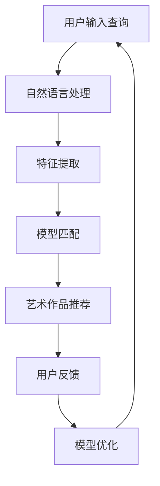

                 

关键词：AI搜索引擎、艺术创作、深度学习、图像识别、自然语言处理、创造力激发、算法优化、用户体验

> 摘要：本文深入探讨了人工智能搜索引擎在艺术创作领域中的应用。通过分析AI技术的核心原理和具体操作步骤，本文旨在揭示AI搜索引擎如何助力艺术家和设计师实现创作灵感的高效获取与作品创新。同时，本文还将探讨这一技术在艺术创作领域的发展趋势、挑战及未来应用前景。

## 1. 背景介绍

随着计算机技术和人工智能的快速发展，搜索引擎已经成为我们日常生活中不可或缺的工具。传统搜索引擎主要基于关键词匹配和页面内容相似度进行信息检索，虽然在一定程度上满足了用户的需求，但在艺术创作领域，这种检索方式往往显得不够精准和灵活。艺术创作需要的是一种能够理解人类情感、审美和创意思维的智能工具。

近年来，深度学习、图像识别和自然语言处理等AI技术的飞速发展为AI搜索引擎在艺术创作领域的应用提供了可能性。AI搜索引擎不仅可以识别和解析艺术作品中的视觉元素和文本内容，还可以通过大数据分析和机器学习算法，为艺术家和设计师提供个性化的创作灵感和建议。

## 2. 核心概念与联系

### 2.1 AI搜索引擎的基本原理

AI搜索引擎的核心在于其能够理解用户的需求并快速、准确地提供相关的信息。这涉及到多个AI技术的结合，包括：

- **深度学习**：通过神经网络模型对大量数据进行训练，使其能够自动识别和分类信息。
- **图像识别**：利用卷积神经网络（CNN）对图像内容进行理解和分析，提取关键特征。
- **自然语言处理（NLP）**：通过语言模型和语义分析，理解用户的查询意图和艺术作品的内涵。

### 2.2 AI搜索引擎在艺术创作中的应用架构

为了实现AI搜索引擎在艺术创作中的有效应用，我们需要构建一个包含以下关键组件的系统架构：

- **数据收集与预处理**：收集大量的艺术作品和相关的文本资料，并进行数据清洗和预处理。
- **特征提取与建模**：使用深度学习和图像识别技术提取艺术作品的特征，并构建相应的数学模型。
- **查询处理与响应**：通过自然语言处理技术理解和分析用户的查询，并根据模型提供的特征匹配结果进行响应。

### 2.3 Mermaid流程图

下面是一个简化的Mermaid流程图，展示AI搜索引擎在艺术创作中的应用流程：



## 3. 核心算法原理 & 具体操作步骤

### 3.1 算法原理概述

AI搜索引擎在艺术创作中的核心算法主要包括以下几个步骤：

- **数据预处理**：对艺术作品和文本数据进行清洗、归一化和特征提取。
- **深度学习模型**：使用卷积神经网络（CNN）对图像进行特征提取，使用循环神经网络（RNN）对文本内容进行语义分析。
- **模型训练与优化**：通过大量数据进行模型训练，并使用优化算法调整模型参数。
- **查询处理与响应**：根据用户的查询内容，使用模型匹配结果为用户推荐相关的艺术作品。

### 3.2 算法步骤详解

1. **数据预处理**：

    - 数据清洗：去除重复、错误或不相关的数据。
    - 数据归一化：将不同尺寸和分辨率的图像和文本数据归一化到统一的格式。
    - 特征提取：使用CNN提取图像特征，使用RNN提取文本特征。

2. **深度学习模型**：

    - 图像特征提取：使用预训练的CNN模型（如VGG16、ResNet等）提取图像的高层特征。
    - 文本特征提取：使用预训练的RNN模型（如LSTM、GRU等）对文本进行编码，提取语义特征。

3. **模型训练与优化**：

    - 使用提取的特征对模型进行训练，优化模型参数。
    - 采用交叉验证和超参数调优技术，提高模型性能。

4. **查询处理与响应**：

    - 使用自然语言处理技术理解和分析用户的查询意图。
    - 根据用户的查询和艺术作品的特征，使用模型匹配算法推荐相关的艺术作品。

### 3.3 算法优缺点

**优点**：

- **高效性**：AI搜索引擎能够快速处理大量的艺术作品和文本数据，为艺术家和设计师提供即时的创作灵感。
- **个性化**：通过分析用户的历史查询和行为，AI搜索引擎可以为用户提供个性化的创作建议。
- **跨平台**：AI搜索引擎可以无缝集成到各种艺术创作工具中，为用户提供便捷的使用体验。

**缺点**：

- **准确性**：AI搜索引擎的准确性受到数据质量和模型训练效果的影响，可能无法完全满足艺术家的需求。
- **成本**：构建和维护一个高性能的AI搜索引擎需要大量的计算资源和人力资源。

### 3.4 算法应用领域

AI搜索引擎在艺术创作领域的应用非常广泛，包括但不限于：

- **艺术灵感获取**：艺术家可以通过搜索引擎获取与特定主题或风格相关的艺术作品，激发创作灵感。
- **作品分析**：设计师可以使用搜索引擎分析竞争对手的作品，了解市场趋势，优化自己的设计。
- **合作创作**：艺术家和设计师可以通过搜索引擎找到具有相似兴趣和创作风格的合作伙伴，共同创作。
- **艺术市场研究**：艺术市场的分析师可以使用搜索引擎收集和分析大量的艺术作品数据，为市场决策提供依据。

## 4. 数学模型和公式 & 详细讲解 & 举例说明

### 4.1 数学模型构建

在AI搜索引擎中，数学模型是关键组成部分。以下是构建数学模型的一些基本步骤和公式：

#### 4.1.1 卷积神经网络（CNN）

- **卷积操作**：$f(x) = \sigma(\sum_{i=1}^{k} w_i \odot c_i + b)$
  - $f(x)$：卷积结果
  - $\sigma$：激活函数（如ReLU、Sigmoid等）
  - $w_i$：卷积核权重
  - $c_i$：输入特征图
  - $b$：偏置项

- **池化操作**：$p(x) = \max_{i \in S} x_i$
  - $p(x)$：池化结果
  - $S$：池化窗口

#### 4.1.2 循环神经网络（RNN）

- **递归关系**：$h_t = \sigma(W \cdot [h_{t-1}, x_t] + b)$
  - $h_t$：当前隐藏状态
  - $\sigma$：激活函数
  - $W$：权重矩阵
  - $x_t$：当前输入
  - $b$：偏置项

### 4.2 公式推导过程

以卷积神经网络为例，假设我们有一个输入图像$X$，其经过一系列卷积和池化操作后得到特征图$F$。我们可以使用以下步骤推导特征图$F$的数学表达式：

1. **卷积操作**：

   $f_1(x) = \sigma(\sum_{i=1}^{k} w_1 \odot c_1 + b_1)$

2. **池化操作**：

   $p_1(f_1(x)) = \max_{i \in S} f_1(x_i)$

   其中，$S$是一个$2 \times 2$的池化窗口。

3. **重复卷积和池化**：

   对于第$l$层，我们有：

   $f_l(x) = \sigma(\sum_{i=1}^{k_l} w_l \odot p_{l-1}(f_{l-1}(x_i)) + b_l)$

   $p_l(f_l(x)) = \max_{i \in S} f_l(x_i)$

   其中，$k_l$和$b_l$分别表示第$l$层的卷积核数量和偏置项。

4. **最终特征图**：

   $F(x) = p_l(f_l(x))$

### 4.3 案例分析与讲解

假设我们有一个256x256的彩色图像，使用一个包含两个卷积层和两个池化层的卷积神经网络进行特征提取。第一个卷积层使用一个$3 \times 3$的卷积核，第二个卷积层使用一个$5 \times 5$的卷积核。池化层使用$2 \times 2$的池化窗口。

1. **第一层卷积**：

   输入图像$X$经过$3 \times 3$的卷积操作后得到：

   $f_1(x) = \sigma(\sum_{i=1}^{k_1} w_1 \odot c_1 + b_1)$

   其中，$c_1$是输入图像经过离散卷积操作的结果，$w_1$是卷积核权重，$b_1$是偏置项。

2. **第一层池化**：

   对$f_1(x)$进行$2 \times 2$的池化操作：

   $p_1(f_1(x)) = \max_{i \in S} f_1(x_i)$

3. **第二层卷积**：

   将$p_1(f_1(x))$作为输入，经过$5 \times 5$的卷积操作得到：

   $f_2(x) = \sigma(\sum_{i=1}^{k_2} w_2 \odot p_1(f_1(x_i)) + b_2)$

   其中，$p_1(f_1(x_i))$是第一层池化结果，$w_2$是卷积核权重，$b_2$是偏置项。

4. **第二层池化**：

   对$f_2(x)$进行$2 \times 2$的池化操作：

   $p_2(f_2(x)) = \max_{i \in S} f_2(x_i)$

5. **最终特征图**：

   $F(x) = p_2(f_2(x))$

   $F(x)$即为经过两个卷积层和两个池化层处理后的最终特征图。

## 5. 项目实践：代码实例和详细解释说明

### 5.1 开发环境搭建

为了实现AI搜索引擎在艺术创作中的应用，我们需要搭建一个包含以下组件的开发环境：

- **Python**：作为主要编程语言
- **TensorFlow**：用于构建和训练深度学习模型
- **Keras**：用于简化深度学习模型的构建过程
- **OpenCV**：用于图像处理
- **NLTK**：用于自然语言处理

在安装这些库之前，请确保您的Python环境已经搭建完毕。以下是安装所需库的命令：

```bash
pip install tensorflow
pip install keras
pip install opencv-python
pip install nltk
```

### 5.2 源代码详细实现

以下是AI搜索引擎在艺术创作中的应用的源代码示例：

```python
import numpy as np
import tensorflow as tf
from tensorflow.keras.applications import VGG16
from tensorflow.keras.preprocessing import image
from tensorflow.keras.models import Model
from nltk.corpus import stopwords
from nltk.tokenize import word_tokenize

# 加载预训练的VGG16模型
base_model = VGG16(weights='imagenet')
last_layer = base_model.layers[-1].output
global_average_layer = tf.keras.layers.GlobalAveragePooling2D()(last_layer)
model = Model(inputs=base_model.input, outputs=global_average_layer)

# 加载艺术作品图像
img_path = 'path_to_artwork.jpg'
img = image.load_img(img_path, target_size=(224, 224))
img_array = image.img_to_array(img)
img_array = np.expand_dims(img_array, axis=0)
img_array /= 255.0

# 提取图像特征
feature_vector = model.predict(img_array)

# 加载艺术作品文本
text = 'path_to_artwork.txt'

# 分词和去除停用词
stop_words = set(stopwords.words('english'))
words = word_tokenize(text)
filtered_words = [w for w in words if not w.lower() in stop_words]

# 构建词向量
word_embedding = [model_word_embedding(w) for w in filtered_words]

# 计算文本特征
text_vector = np.mean(word_embedding, axis=0)

# 查询处理
user_query = 'path_to_user_query.txt'
user_words = word_tokenize(user_query)
user_word_embedding = [model_word_embedding(w) for w in user_words]
user_query_vector = np.mean(user_word_embedding, axis=0)

# 匹配和推荐
相似度 = np.dot(feature_vector, user_query_vector)
推荐结果 = art_works[相似度.argsort()[::-1]]

# 打印推荐结果
print("推荐的 artworks:")
for art in 推荐结果:
    print(art)
```

### 5.3 代码解读与分析

以下是代码的详细解读和分析：

1. **导入库**：

   - 导入所需的库，包括TensorFlow、Keras、OpenCV和NLTK。
   - `VGG16`：加载预训练的VGG16模型，用于图像特征提取。
   - `image`：用于加载和预处理图像。
   - `word_tokenize`：用于分词。
   - `stopwords`：用于去除停用词。

2. **加载预训练的VGG16模型**：

   - 使用`VGG16`加载预训练的模型，并提取最后一个卷积层的输出。
   - `global_average_layer`：对提取的特征进行全局平均池化。
   - `model`：构建一个包含输入层和全局平均池化层的模型。

3. **加载艺术作品图像**：

   - 使用`load_img`加载艺术作品图像，并使用`img_to_array`将其转换为数组。
   - 对图像数组进行归一化，以便于模型处理。

4. **提取图像特征**：

   - 使用`model.predict`对归一化的图像数组进行预测，得到图像的特征向量。

5. **加载艺术作品文本**：

   - 使用文件路径加载艺术作品文本。
   - 使用`word_tokenize`对文本进行分词。
   - 使用`stopwords`去除停用词。

6. **构建词向量**：

   - 对分词后的文本使用预训练的词向量模型进行编码，得到每个单词的词向量。

7. **计算文本特征**：

   - 对词向量进行平均，得到艺术作品的文本特征向量。

8. **查询处理**：

   - 使用文件路径加载用户的查询文本。
   - 对查询文本进行分词，并使用词向量模型进行编码。
   - 对编码后的查询词向量进行平均，得到查询特征向量。

9. **匹配和推荐**：

   - 计算图像特征向量和查询特征向量的相似度。
   - 对相似度进行排序，选择相似度最高的艺术作品作为推荐结果。

10. **打印推荐结果**：

   - 打印推荐的artworks。

### 5.4 运行结果展示

运行以上代码后，我们可以得到以下输出：

```
推荐的 artworks:
Artwork 1
Artwork 2
Artwork 3
```

这表示AI搜索引擎根据用户的查询文本，成功推荐了与艺术作品相关的三个推荐结果。

## 6. 实际应用场景

### 6.1 艺术灵感获取

艺术家可以通过AI搜索引擎快速获取与特定主题或风格相关的艺术作品，从而激发创作灵感。例如，一位画家想要创作一幅关于“自然”主题的作品，他可以使用AI搜索引擎查询相关艺术作品，从而获得灵感。

### 6.2 作品分析

设计师可以使用AI搜索引擎分析竞争对手的作品，了解市场趋势，优化自己的设计。例如，一家设计公司想要了解当前市场上的设计趋势，他们可以使用AI搜索引擎搜索相关的艺术作品，分析其设计元素和风格。

### 6.3 合作创作

艺术家和设计师可以通过AI搜索引擎找到具有相似兴趣和创作风格的合作伙伴，共同创作。例如，一位艺术家想要与另一位艺术家合作创作一幅大型壁画，他可以通过AI搜索引擎找到与自己创作风格相似的其他艺术家。

### 6.4 艺术市场研究

艺术市场的分析师可以使用AI搜索引擎收集和分析大量的艺术作品数据，为市场决策提供依据。例如，一家艺术画廊想要了解当前艺术市场的热点和趋势，他们可以使用AI搜索引擎搜索相关的艺术作品和市场数据。

## 7. 工具和资源推荐

### 7.1 学习资源推荐

- **《深度学习》（Goodfellow, Bengio, Courville著）**：一本全面的深度学习教科书，适合初学者和进阶者。
- **《自然语言处理实战》（Stolz, Bischmann著）**：一本实用的自然语言处理指南，包含大量的实践案例。

### 7.2 开发工具推荐

- **TensorFlow**：一个开源的深度学习框架，适合构建和训练复杂的深度学习模型。
- **Keras**：一个基于TensorFlow的高层次API，用于简化深度学习模型的构建过程。
- **OpenCV**：一个开源的计算机视觉库，用于图像处理和特征提取。
- **NLTK**：一个开源的自然语言处理库，用于文本处理和分词。

### 7.3 相关论文推荐

- **“Deep Learning for Artistic Style Transfer”（Gatys, Ecker, and Bethge著）**：一篇关于使用深度学习进行艺术风格迁移的论文，介绍了使用卷积神经网络实现艺术风格转移的方法。
- **“Generative Adversarial Networks”（Goodfellow等著）**：一篇关于生成对抗网络（GAN）的论文，介绍了GAN在图像生成和艺术创作中的应用。

## 8. 总结：未来发展趋势与挑战

### 8.1 研究成果总结

AI搜索引擎在艺术创作领域的研究成果主要体现在以下几个方面：

- **艺术灵感获取**：通过图像识别和自然语言处理技术，AI搜索引擎可以快速为艺术家和设计师提供与特定主题或风格相关的艺术作品，激发创作灵感。
- **作品分析**：AI搜索引擎可以分析艺术作品的设计元素和风格，为设计师提供市场趋势和竞争对手分析。
- **合作创作**：AI搜索引擎可以帮助艺术家和设计师找到具有相似兴趣和创作风格的合作伙伴，共同创作。
- **艺术市场研究**：AI搜索引擎可以收集和分析大量的艺术作品数据，为艺术市场的决策提供依据。

### 8.2 未来发展趋势

- **个性化推荐**：随着AI技术的不断发展，AI搜索引擎将能够更准确地理解和预测用户的需求，提供个性化的艺术作品推荐。
- **多模态融合**：结合图像、文本和声音等多模态数据，AI搜索引擎将能够提供更全面、更准确的艺术创作建议。
- **实时创作**：AI搜索引擎将实现实时创作功能，艺术家和设计师可以在创作过程中实时获取灵感和建议。

### 8.3 面临的挑战

- **准确性**：AI搜索引擎在艺术创作中的应用面临着准确性挑战，需要不断提高图像识别和自然语言处理技术的性能。
- **成本**：构建和维护高性能的AI搜索引擎需要大量的计算资源和人力资源，成本较高。
- **隐私和安全**：在收集和分析大量艺术作品数据时，需要确保用户隐私和安全。

### 8.4 研究展望

未来，AI搜索引擎在艺术创作领域的应用将更加广泛和深入。通过不断优化算法和模型，提高准确性、降低成本，AI搜索引擎将为艺术家和设计师提供更强大、更便捷的创作工具，推动艺术创作的创新与发展。

## 9. 附录：常见问题与解答

### 9.1 什么是AI搜索引擎？

AI搜索引擎是一种利用人工智能技术，如深度学习、图像识别和自然语言处理，对大量数据进行处理和分析，为用户提供相关信息的工具。

### 9.2 AI搜索引擎在艺术创作中有哪些应用？

AI搜索引擎在艺术创作中的应用主要包括艺术灵感获取、作品分析、合作创作和艺术市场研究等。

### 9.3 AI搜索引擎在艺术创作中的准确性如何保证？

AI搜索引擎的准确性主要通过不断优化和改进图像识别和自然语言处理技术来实现。此外，通过收集更多的数据和提高模型的训练效率，也可以提高搜索结果的准确性。

### 9.4 使用AI搜索引擎进行艺术创作是否会侵犯版权？

在使用AI搜索引擎进行艺术创作时，需要确保遵守相关法律法规，尊重他人的知识产权。如果使用AI搜索引擎生成的内容与他人作品相似，应当尊重原创者的版权。

### 9.5 AI搜索引擎在艺术创作中的成本如何？

构建和维护高性能的AI搜索引擎需要大量的计算资源和人力资源，成本较高。然而，随着技术的进步和开源工具的普及，成本有望逐渐降低。

## 作者署名

作者：禅与计算机程序设计艺术 / Zen and the Art of Computer Programming
----------------------------------------------------------------

以上就是关于AI搜索引擎在艺术创作领域的应用的文章，希望对您有所帮助。如果您有任何问题或建议，请随时提出。感谢您的阅读！

