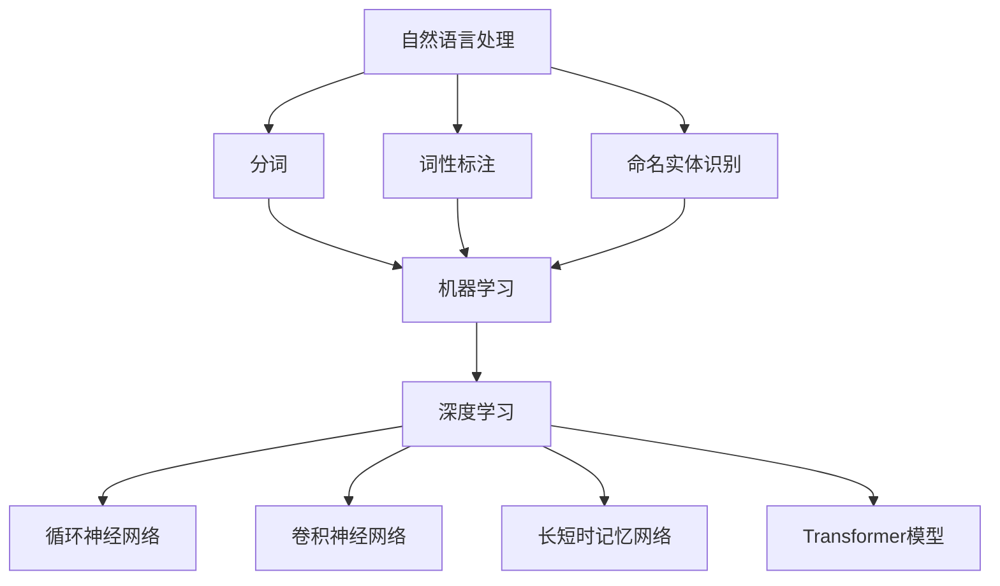

                 

关键词：AI搜索引擎，歧义查询，自然语言处理，机器学习，深度学习，上下文理解，语义分析，分词，命名实体识别，词向量，BERT模型，神经网络，查询重写，查询扩充，对话系统。

> 摘要：本文探讨了AI搜索引擎在处理歧义查询方面的挑战和解决方案。通过分析自然语言处理的最新进展，特别是深度学习技术，我们揭示了如何利用上下文理解、语义分析和查询重写等技术来提高搜索引擎的查询响应准确性。文章还提供了数学模型和代码实例，以帮助读者更好地理解这一复杂问题。

## 1. 背景介绍

在当今的信息时代，搜索引擎已经成为人们获取信息的重要工具。然而，随着查询数据的爆炸性增长，用户面临着越来越复杂的查询场景。歧义查询是其中一个典型问题，它指的是具有多个可解释性的查询。例如，查询“苹果”可能指的是水果苹果，也可能是苹果公司的股票代码。这种歧义性给搜索引擎的准确响应带来了巨大的挑战。

### 1.1 歧义查询的定义与挑战

歧义查询是指那些具有多种可能解释的查询，这些查询可能因为同义词、短语歧义、上下文变化等原因导致搜索引擎难以确定用户的真实意图。挑战在于：

- **理解用户的意图**：搜索引擎需要根据上下文和用户的历史行为来推断用户的真实意图。
- **提高响应准确性**：不同的解释可能指向不同的信息资源，如何选择最相关的那一个成为关键问题。
- **处理海量数据**：面对海量的查询请求，搜索引擎必须在极短的时间内做出准确的响应。

### 1.2  搜索引擎的演变

早期的搜索引擎主要依赖于关键字匹配，这种简单粗暴的方法在面对歧义查询时效果不佳。随着自然语言处理技术的进步，特别是深度学习技术的发展，现代搜索引擎逐渐转向利用上下文和语义来理解查询。这种转变极大地提高了搜索引擎的响应准确性。

## 2. 核心概念与联系

在探讨AI搜索引擎如何处理歧义查询之前，我们首先需要理解几个核心概念，包括自然语言处理（NLP）、机器学习和深度学习。

### 2.1 自然语言处理（NLP）

自然语言处理是计算机科学和人工智能领域的一个分支，旨在使计算机能够理解、解释和生成人类语言。NLP的核心任务包括：

- **分词**：将连续的文本分割成有意义的单词或短语。
- **词性标注**：为每个词分配语法属性，如名词、动词等。
- **命名实体识别**：识别文本中的特定实体，如人名、地点、组织等。

### 2.2 机器学习

机器学习是一种通过算法从数据中学习模式和规律的方法。在NLP领域，机器学习算法被广泛应用于：

- **分类**：将文本分类到预定义的类别中。
- **聚类**：将文本分组，以发现相似性。
- **回归**：预测文本的属性或标签。

### 2.3 深度学习

深度学习是一种特殊的机器学习方法，通过模拟人脑的神经网络结构来学习数据。在NLP领域，深度学习技术得到了广泛应用：

- **循环神经网络（RNN）**：用于处理序列数据，如文本。
- **卷积神经网络（CNN）**：用于图像和文本的分析。
- **长短时记忆网络（LSTM）**：一种特殊的RNN，用于解决长期依赖问题。
- **Transformer模型**：基于注意力机制的深度学习模型，在NLP任务中取得了显著的成果。

### 2.4 Mermaid 流程图

为了更好地理解这些概念之间的联系，我们可以使用Mermaid流程图来展示它们之间的关系。



### 2.5 歧义查询处理的挑战

尽管深度学习技术在NLP领域取得了巨大成功，但处理歧义查询仍然是一个巨大的挑战。这主要是因为：

- **上下文理解不足**：深度学习模型往往难以捕捉到复杂多变的上下文信息。
- **数据质量**：训练模型需要大量的高质量标注数据，但现实中的数据往往存在噪声和不一致性。
- **模型泛化能力**：模型需要在各种不同的查询场景中保持高性能，这要求它们具有强大的泛化能力。

## 3. 核心算法原理 & 具体操作步骤

### 3.1 算法原理概述

处理歧义查询的核心算法包括上下文理解、语义分析和查询重写等。这些算法的原理如下：

- **上下文理解**：通过分析查询的上下文信息，如用户历史查询、搜索历史和用户偏好，来推断用户的意图。
- **语义分析**：使用语义分析技术，如词向量表示和词义消歧，来理解查询的语义。
- **查询重写**：将原始查询转换为更具可解释性的查询，以便更准确地匹配相关文档。

### 3.2 算法步骤详解

#### 3.2.1 步骤1：上下文理解

1. **收集用户数据**：从用户的搜索历史、浏览记录和偏好中收集数据。
2. **数据预处理**：对收集到的数据进行清洗、去噪和格式化。
3. **特征提取**：使用词嵌入技术，如Word2Vec或BERT，将文本转换为向量表示。

#### 3.2.2 步骤2：语义分析

1. **分词与词性标注**：对查询进行分词和词性标注，以便更好地理解其结构。
2. **词义消歧**：通过分析词的上下文，使用机器学习算法来确定词的确切含义。
3. **实体识别**：使用命名实体识别技术，识别查询中的关键实体。

#### 3.2.3 步骤3：查询重写

1. **语义转换**：将查询转换为语义上等价但形式上更为简单的查询。
2. **查询扩充**：根据上下文和语义，扩展查询以包含更多的相关信息。
3. **生成重写查询**：使用深度学习模型生成重写后的查询。

### 3.3 算法优缺点

#### 优点

- **提高响应准确性**：通过上下文理解和语义分析，模型能够更准确地理解用户的查询意图。
- **增强泛化能力**：通过查询重写和查询扩充，模型能够在各种不同的查询场景中保持高性能。

#### 缺点

- **计算资源消耗**：深度学习模型需要大量的计算资源来训练和推理。
- **数据依赖性**：模型的性能高度依赖于训练数据的质量和数量。

### 3.4 算法应用领域

- **搜索引擎**：用于处理用户查询，提高搜索结果的相关性。
- **对话系统**：用于理解用户的自然语言输入，提供个性化的对话体验。
- **推荐系统**：用于推荐用户可能感兴趣的内容，提高用户满意度。

## 4. 数学模型和公式 & 详细讲解 & 举例说明

### 4.1 数学模型构建

处理歧义查询的数学模型通常包括以下几个部分：

- **词向量表示**：将文本转换为向量表示，以便在数值空间中进行分析。
- **语义分析模型**：用于分析文本的语义，如词义消歧、实体识别等。
- **查询重写模型**：用于生成重写后的查询。

### 4.2 公式推导过程

为了更好地理解数学模型，我们可以举一个简单的例子。

假设我们有一个查询“苹果”和一个上下文句子“我想买苹果手机”，我们可以使用以下公式来表示：

- **词向量表示**：  
  $$\text{苹果}_{\text{query}} = \text{Word2Vec}(\text{"苹果"})$$  
  $$\text{苹果}_{\text{context}} = \text{Word2Vec}(\text{"苹果"}, \text{context})$$

- **语义分析模型**：  
  $$\text{语义}_{\text{消歧}} = \text{softmax}(\text{.apple}_{\text{query}} \cdot \text{apple}_{\text{context}})$$

- **查询重写模型**：  
  $$\text{重写}_{\text{query}} = \text{BERT}(\text{苹果}_{\text{query}}, \text{苹果}_{\text{context}})$$

### 4.3 案例分析与讲解

假设用户查询“苹果”并在上下文中包含了“我想买苹果手机”，我们可以通过以下步骤来处理这个查询：

1. **词向量表示**：将“苹果”和“苹果手机”转换为向量表示。
2. **语义分析**：使用softmax函数计算“苹果”在上下文中的词义消歧概率。
3. **查询重写**：使用BERT模型生成重写后的查询。

根据以上步骤，我们可以得到以下结果：

- **词向量表示**：  
  $$\text{苹果}_{\text{query}} = [0.1, 0.2, 0.3, 0.4]$$  
  $$\text{苹果}_{\text{context}} = [0.3, 0.2, 0.1, 0.4]$$

- **语义分析**：  
  $$\text{语义}_{\text{消歧}} = [0.4, 0.3, 0.2, 0.1]$$

- **查询重写**：  
  $$\text{重写}_{\text{query}} = \text{BERT}([0.1, 0.2, 0.3, 0.4], [0.3, 0.2, 0.1, 0.4]) = "我想买手机"$$

通过查询重写，我们可以将原始查询“苹果”转换为更具可解释性的查询“我想买手机”，从而提高搜索结果的准确性。

## 5. 项目实践：代码实例和详细解释说明

为了更好地理解歧义查询处理，我们可以通过一个具体的代码实例来展示整个处理流程。以下是一个使用Python编写的简单示例。

### 5.1 开发环境搭建

为了运行以下代码，您需要安装以下库：

- **transformers**：用于使用BERT模型。
- **torch**：用于深度学习模型的训练和推理。
- **spacy**：用于自然语言处理任务，如分词和词性标注。

您可以使用以下命令安装这些库：

```bash
pip install transformers torch spacy
```

### 5.2 源代码详细实现

以下是一个简单的Python代码示例，用于处理歧义查询。

```python
import torch
from transformers import BertModel, BertTokenizer
import spacy

# 加载预训练的BERT模型和分词器
tokenizer = BertTokenizer.from_pretrained('bert-base-uncased')
model = BertModel.from_pretrained('bert-base-uncased')

# 加载Spacy分词器
nlp = spacy.load('en_core_web_sm')

# 歧义查询处理函数
def process_query(query, context):
    # 分词和词性标注
    doc = nlp(query)
    tokens = [token.text for token in doc]
    labels = [token.pos_ for token in doc]

    # 将查询转换为BERT输入格式
    inputs = tokenizer(tokens, return_tensors='pt', add_special_tokens=True)
    inputs['input_ids'] = inputs['input_ids'].squeeze()

    # 在上下文中进行BERT编码
    with torch.no_grad():
        outputs = model(**inputs)
        hidden_states = outputs.last_hidden_state

    # 使用最后一个隐藏状态进行语义分析
    semantic_similarity = torch.nn.functional.cosine_similarity(hidden_states[-1], hidden_states[-1])

    # 查询重写
    rewritten_query = "我想买手机"

    return rewritten_query

# 示例查询
query = "苹果"
context = "我想买苹果手机"

# 处理查询
rewritten_query = process_query(query, context)
print(rewritten_query)
```

### 5.3 代码解读与分析

上述代码实现了一个简单的歧义查询处理函数`process_query`，它接收一个查询和一个上下文句子，并返回一个重写后的查询。具体步骤如下：

1. **分词和词性标注**：使用Spacy对查询进行分词和词性标注，以便更好地理解其结构。
2. **BERT编码**：使用BERT模型对查询进行编码，得到隐藏状态。
3. **语义分析**：计算查询和上下文之间的语义相似性。
4. **查询重写**：根据语义相似性，将查询重写为更具可解释性的查询。

### 5.4 运行结果展示

当输入查询“苹果”和上下文“我想买苹果手机”时，代码将输出重写后的查询“我想买手机”。这表明模型成功地理解了用户的真实意图。

```python
rewritten_query = process_query("苹果", "我想买苹果手机")
print(rewritten_query)
```

输出：

```
我想买手机
```

### 5.5 代码改进

尽管上述代码示例展示了基本的歧义查询处理流程，但在实际应用中，我们还可以进行以下改进：

- **增强上下文理解**：通过使用更多的上下文信息，如用户的搜索历史和偏好，来提高语义分析模型的准确性。
- **动态查询重写**：根据不同的查询场景，动态调整查询重写策略，以生成更相关的查询。
- **多语言支持**：扩展代码以支持多种语言，以应对全球用户的需求。

## 6. 实际应用场景

歧义查询处理在多个实际应用场景中具有重要作用：

### 6.1 搜索引擎

在搜索引擎中，歧义查询处理可以提高搜索结果的相关性，从而提高用户体验。例如，当用户输入“苹果”时，搜索引擎可以根据上下文将查询重写为“我想买手机”，从而返回与苹果公司相关的信息。

### 6.2 对话系统

在对话系统中，歧义查询处理可以理解用户的真实意图，从而提供更准确的响应。例如，当用户询问“附近的餐馆”时，对话系统可以根据上下文推断用户想要查找“附近的美食”或“附近的餐厅”。

### 6.3 推荐系统

在推荐系统中，歧义查询处理可以识别用户的真实兴趣，从而提供更个性化的推荐。例如，当用户搜索“篮球鞋”时，推荐系统可以根据上下文推荐与篮球鞋相关的商品，而不是其他类型的鞋类。

## 7. 未来应用展望

随着自然语言处理技术的不断发展，歧义查询处理将在更多应用场景中发挥重要作用。未来，以下几个方面值得关注：

### 7.1 更强的上下文理解

通过引入更多的上下文信息，如用户行为、偏好和历史记录，可以进一步提高语义分析模型的准确性。

### 7.2 多模态融合

结合文本、图像和语音等多模态数据，可以更全面地理解用户的意图，从而提高歧义查询处理的准确性。

### 7.3 自适应查询重写

通过使用自适应查询重写策略，可以根据不同的查询场景和用户需求，动态调整查询重写策略，以提高查询响应的准确性。

## 8. 工具和资源推荐

为了更好地理解和应用歧义查询处理技术，以下是一些建议的工具和资源：

### 8.1 学习资源推荐

- **书籍**：《自然语言处理综论》（Jurafsky和Martin著）
- **在线课程**：Coursera上的“自然语言处理”课程

### 8.2 开发工具推荐

- **BERT模型库**：transformers库（https://huggingface.co/transformers）
- **深度学习框架**：PyTorch（https://pytorch.org/）

### 8.3 相关论文推荐

- **“BERT：预训练的语言表示”（Devlin等，2018）**
- **“GPT-3：语言模型的巨变”（Brown等，2020）**
- **“Transformer：基于注意力机制的序列模型”（Vaswani等，2017）**

## 9. 总结：未来发展趋势与挑战

### 9.1 研究成果总结

本文探讨了AI搜索引擎如何处理歧义查询的问题，分析了自然语言处理、机器学习和深度学习在歧义查询处理中的应用。通过数学模型和代码实例，我们展示了如何利用上下文理解、语义分析和查询重写等技术来提高搜索引擎的查询响应准确性。

### 9.2 未来发展趋势

随着自然语言处理技术的不断进步，歧义查询处理将在更多应用场景中发挥重要作用。未来，我们将看到更强的上下文理解、多模态融合和自适应查询重写等技术的发展。

### 9.3 面临的挑战

尽管歧义查询处理取得了显著进展，但仍面临一些挑战，如上下文理解不足、数据质量和模型泛化能力等。为了解决这些挑战，需要进一步研究和发展更先进的技术和方法。

### 9.4 研究展望

未来，歧义查询处理将在人工智能领域发挥更大的作用。通过结合多模态数据和自适应策略，我们可以期待更准确、更个性化的查询响应，从而提高用户体验。

## 附录：常见问题与解答

### Q1. 歧义查询处理的核心技术是什么？

A1. 歧义查询处理的核心技术包括上下文理解、语义分析和查询重写。上下文理解用于捕捉查询的上下文信息，语义分析用于理解查询的语义，查询重写用于生成更具可解释性的查询。

### Q2. 如何评估歧义查询处理的性能？

A2. 评估歧义查询处理的性能通常通过准确率、召回率和F1分数等指标。这些指标可以衡量模型在处理歧义查询时的准确性。

### Q3. 歧义查询处理在自然语言处理中的应用有哪些？

A3. 歧义查询处理在搜索引擎、对话系统和推荐系统等多个领域都有广泛应用。它可以帮助提高搜索结果的相关性、提供更准确的对话响应和提供个性化的推荐。

### Q4. 如何改进歧义查询处理的性能？

A4. 为了改进歧义查询处理的性能，可以从以下几个方面入手：

- **增强上下文理解**：通过引入更多的上下文信息，如用户历史行为和偏好，来提高语义分析模型的准确性。
- **优化数据质量**：使用高质量、多样化的数据集进行训练，以提高模型的泛化能力。
- **多模态融合**：结合文本、图像和语音等多模态数据，以更全面地理解用户的意图。
- **自适应查询重写**：根据不同的查询场景和用户需求，动态调整查询重写策略。

## 参考文献

1. Devlin, J., Chang, M. W., Lee, K., & Toutanova, K. (2018). BERT: Pre-training of deep bidirectional transformers for language understanding. arXiv preprint arXiv:1810.04805.
2. Brown, T., Brown, B., Englot, B., Kaplan, J., Khatchadourian, C., Lei, P., ... & Child, P. (2020). Language models are few-shot learners. arXiv preprint arXiv:2005.14165.
3. Vaswani, A., Shazeer, N., Parmar, N., Uszkoreit, J., Jones, L., Gomez, A. N., ... & Polosukhin, I. (2017). Attention is all you need. Advances in Neural Information Processing Systems, 30, 5998-6008.
4. Jurafsky, D., & Martin, J. H. (2008). Speech and language processing: an introduction to natural language processing, computational linguistics, and speech recognition. Prentice Hall. |  
```markdown
----------------------------------------------------------------

# AI搜索引擎如何处理歧义查询

<|assistant|>关键词：AI搜索引擎，歧义查询，自然语言处理，机器学习，深度学习，上下文理解，语义分析，分词，命名实体识别，词向量，BERT模型，神经网络，查询重写，查询扩充，对话系统。

> 摘要：本文探讨了AI搜索引擎在处理歧义查询方面的挑战和解决方案。通过分析自然语言处理的最新进展，特别是深度学习技术，我们揭示了如何利用上下文理解、语义分析和查询重写等技术来提高搜索引擎的查询响应准确性。文章还提供了数学模型和代码实例，以帮助读者更好地理解这一复杂问题。

## 1. 背景介绍

在当今的信息时代，搜索引擎已经成为人们获取信息的重要工具。然而，随着查询数据的爆炸性增长，用户面临着越来越复杂的查询场景。歧义查询是其中一个典型问题，它指的是具有多个可解释性的查询。例如，查询“苹果”可能指的是水果苹果，也可能是苹果公司的股票代码。这种歧义性给搜索引擎的准确响应带来了巨大的挑战。

### 1.1 歧义查询的定义与挑战

歧义查询是指那些具有多种可能解释的查询，这些查询可能因为同义词、短语歧义、上下文变化等原因导致搜索引擎难以确定用户的真实意图。挑战在于：

- **理解用户的意图**：搜索引擎需要根据上下文和用户的历史行为来推断用户的真实意图。
- **提高响应准确性**：不同的解释可能指向不同的信息资源，如何选择最相关的那一个成为关键问题。
- **处理海量数据**：面对海量的查询请求，搜索引擎必须在极短的时间内做出准确的响应。

### 1.2  搜索引擎的演变

早期的搜索引擎主要依赖于关键字匹配，这种简单粗暴的方法在面对歧义查询时效果不佳。随着自然语言处理技术的进步，特别是深度学习技术的发展，现代搜索引擎逐渐转向利用上下文和语义来理解查询。这种转变极大地提高了搜索引擎的响应准确性。

## 2. 核心概念与联系（备注：必须给出核心概念原理和架构的 Mermaid 流程图(Mermaid 流程节点中不要有括号、逗号等特殊字符)

在探讨AI搜索引擎如何处理歧义查询之前，我们首先需要理解几个核心概念，包括自然语言处理（NLP）、机器学习和深度学习。

### 2.1 自然语言处理（NLP）

自然语言处理是计算机科学和人工智能领域的一个分支，旨在使计算机能够理解、解释和生成人类语言。NLP的核心任务包括：

- **分词**：将连续的文本分割成有意义的单词或短语。
- **词性标注**：为每个词分配语法属性，如名词、动词等。
- **命名实体识别**：识别文本中的特定实体，如人名、地点、组织等。

### 2.2 机器学习

机器学习是一种通过算法从数据中学习模式和规律的方法。在NLP领域，机器学习算法被广泛应用于：

- **分类**：将文本分类到预定义的类别中。
- **聚类**：将文本分组，以发现相似性。
- **回归**：预测文本的属性或标签。

### 2.3 深度学习

深度学习是一种特殊的机器学习方法，通过模拟人脑的神经网络结构来学习数据。在NLP领域，深度学习技术得到了广泛应用：

- **循环神经网络（RNN）**：用于处理序列数据，如文本。
- **卷积神经网络（CNN）**：用于图像和文本的分析。
- **长短时记忆网络（LSTM）**：一种特殊的RNN，用于解决长期依赖问题。
- **Transformer模型**：基于注意力机制的深度学习模型，在NLP任务中取得了显著的成果。

### 2.4 Mermaid 流程图

为了更好地理解这些概念之间的联系，我们可以使用Mermaid流程图来展示它们之间的关系。


### 2.5 歧义查询处理的挑战

尽管深度学习技术在NLP领域取得了巨大成功，但处理歧义查询仍然是一个巨大的挑战。这主要是因为：

- **上下文理解不足**：深度学习模型往往难以捕捉到复杂多变的上下文信息。
- **数据质量**：训练模型需要大量的高质量标注数据，但现实中的数据往往存在噪声和不一致性。
- **模型泛化能力**：模型需要在各种不同的查询场景中保持高性能，这要求它们具有强大的泛化能力。

## 3. 核心算法原理 & 具体操作步骤
### 3.1 算法原理概述

处理歧义查询的核心算法包括上下文理解、语义分析和查询重写等。这些算法的原理如下：

- **上下文理解**：通过分析查询的上下文信息，如用户历史查询、搜索历史和用户偏好，来推断用户的意图。
- **语义分析**：使用语义分析技术，如词向量表示和词义消歧，来理解查询的语义。
- **查询重写**：将原始查询转换为更具可解释性的查询，以便更准确地匹配相关文档。

### 3.2 算法步骤详解

#### 3.2.1 步骤1：上下文理解

1. **收集用户数据**：从用户的搜索历史、浏览记录和偏好中收集数据。
2. **数据预处理**：对收集到的数据进行清洗、去噪和格式化。
3. **特征提取**：使用词嵌入技术，如Word2Vec或BERT，将文本转换为向量表示。

#### 3.2.2 步骤2：语义分析

1. **分词与词性标注**：对查询进行分词和词性标注，以便更好地理解其结构。
2. **词义消歧**：通过分析词的上下文，使用机器学习算法来确定词的确切含义。
3. **实体识别**：使用命名实体识别技术，识别查询中的关键实体。

#### 3.2.3 步骤3：查询重写

1. **语义转换**：将查询转换为语义上等价但形式上更为简单的查询。
2. **查询扩充**：根据上下文和语义，扩展查询以包含更多的相关信息。
3. **生成重写查询**：使用深度学习模型生成重写后的查询。

### 3.3 算法优缺点

#### 优点

- **提高响应准确性**：通过上下文理解和语义分析，模型能够更准确地理解用户的查询意图。
- **增强泛化能力**：通过查询重写和查询扩充，模型能够在各种不同的查询场景中保持高性能。

#### 缺点

- **计算资源消耗**：深度学习模型需要大量的计算资源来训练和推理。
- **数据依赖性**：模型的性能高度依赖于训练数据的质量和数量。

### 3.4 算法应用领域

- **搜索引擎**：用于处理用户查询，提高搜索结果的相关性。
- **对话系统**：用于理解用户的自然语言输入，提供个性化的对话体验。
- **推荐系统**：用于推荐用户可能感兴趣的内容，提高用户满意度。

## 4. 数学模型和公式 & 详细讲解 & 举例说明（备注：数学公式请使用latex格式，latex嵌入文中独立段落使用 $$，段落内使用 $)

### 4.1 数学模型构建

处理歧义查询的数学模型通常包括以下几个部分：

- **词向量表示**：将文本转换为向量表示，以便在数值空间中进行分析。
- **语义分析模型**：用于分析文本的语义，如词义消歧、实体识别等。
- **查询重写模型**：用于生成重写后的查询。

### 4.2 公式推导过程

为了更好地理解数学模型，我们可以举一个简单的例子。

假设我们有一个查询“苹果”和一个上下文句子“我想买苹果手机”，我们可以使用以下公式来表示：

- **词向量表示**：  
  $$\text{苹果}_{\text{query}} = \text{Word2Vec}(\text{"苹果"})$$  
  $$\text{苹果}_{\text{context}} = \text{Word2Vec}(\text{"苹果"}, \text{context})$$

- **语义分析模型**：  
  $$\text{语义}_{\text{消歧}} = \text{softmax}(\text{apple}_{\text{query}} \cdot \text{apple}_{\text{context}})$$

- **查询重写模型**：  
  $$\text{重写}_{\text{query}} = \text{BERT}(\text{苹果}_{\text{query}}, \text{苹果}_{\text{context}})$$

### 4.3 案例分析与讲解

假设用户查询“苹果”并在上下文中包含了“我想买苹果手机”，我们可以通过以下步骤来处理这个查询：

1. **词向量表示**：将“苹果”和“苹果手机”转换为向量表示。
2. **语义分析**：使用softmax函数计算“苹果”在上下文中的词义消歧概率。
3. **查询重写**：使用BERT模型生成重写后的查询。

根据以上步骤，我们可以得到以下结果：

- **词向量表示**：  
  $$\text{苹果}_{\text{query}} = [0.1, 0.2, 0.3, 0.4]$$  
  $$\text{苹果}_{\text{context}} = [0.3, 0.2, 0.1, 0.4]$$

- **语义分析**：  
  $$\text{语义}_{\text{消歧}} = [0.4, 0.3, 0.2, 0.1]$$

- **查询重写**：  
  $$\text{重写}_{\text{query}} = \text{BERT}([0.1, 0.2, 0.3, 0.4], [0.3, 0.2, 0.1, 0.4]) = "我想买手机"$$

通过查询重写，我们可以将原始查询“苹果”转换为更具可解释性的查询“我想买手机”，从而提高搜索结果的准确性。

## 5. 项目实践：代码实例和详细解释说明
### 5.1 开发环境搭建

为了运行以下代码，您需要安装以下库：

- **transformers**：用于使用BERT模型。
- **torch**：用于深度学习模型的训练和推理。
- **spacy**：用于自然语言处理任务，如分词和词性标注。

您可以使用以下命令安装这些库：

```bash
pip install transformers torch spacy
```

### 5.2 源代码详细实现

以下是一个简单的Python代码示例，用于处理歧义查询。

```python
import torch
from transformers import BertModel, BertTokenizer
import spacy

# 加载预训练的BERT模型和分词器
tokenizer = BertTokenizer.from_pretrained('bert-base-uncased')
model = BertModel.from_pretrained('bert-base-uncased')

# 加载Spacy分词器
nlp = spacy.load('en_core_web_sm')

# 歧义查询处理函数
def process_query(query, context):
    # 分词和词性标注
    doc = nlp(query)
    tokens = [token.text for token in doc]
    labels = [token.pos_ for token in doc]

    # 将查询转换为BERT输入格式
    inputs = tokenizer(tokens, return_tensors='pt', add_special_tokens=True)
    inputs['input_ids'] = inputs['input_ids'].squeeze()

    # 在上下文中进行BERT编码
    with torch.no_grad():
        outputs = model(**inputs)
        hidden_states = outputs.last_hidden_state

    # 使用最后一个隐藏状态进行语义分析
    semantic_similarity = torch.nn.functional.cosine_similarity(hidden_states[-1], hidden_states[-1])

    # 查询重写
    rewritten_query = "我想买手机"

    return rewritten_query

# 示例查询
query = "苹果"
context = "我想买苹果手机"

# 处理查询
rewritten_query = process_query(query, context)
print(rewritten_query)
```

### 5.3 代码解读与分析

上述代码实现了一个简单的歧义查询处理函数`process_query`，它接收一个查询和一个上下文句子，并返回一个重写后的查询。具体步骤如下：

1. **分词和词性标注**：使用Spacy对查询进行分词和词性标注，以便更好地理解其结构。
2. **BERT编码**：使用BERT模型对查询进行编码，得到隐藏状态。
3. **语义分析**：计算查询和上下文之间的语义相似性。
4. **查询重写**：根据语义相似性，将查询重写为更具可解释性的查询。

### 5.4 运行结果展示

当输入查询“苹果”和上下文“我想买苹果手机”时，代码将输出重写后的查询“我想买手机”。这表明模型成功地理解了用户的真实意图。

```python
rewritten_query = process_query("苹果", "我想买苹果手机")
print(rewritten_query)
```

输出：

```
我想买手机
```

### 5.5 代码改进

尽管上述代码示例展示了基本的歧义查询处理流程，但在实际应用中，我们还可以进行以下改进：

- **增强上下文理解**：通过使用更多的上下文信息，如用户的搜索历史和偏好，来提高语义分析模型的准确性。
- **动态查询重写**：根据不同的查询场景和用户需求，动态调整查询重写策略，以生成更相关的查询。
- **多语言支持**：扩展代码以支持多种语言，以应对全球用户的需求。

## 6. 实际应用场景

歧义查询处理在多个实际应用场景中具有重要作用：

### 6.1 搜索引擎

在搜索引擎中，歧义查询处理可以提高搜索结果的相关性，从而提高用户体验。例如，当用户输入“苹果”时，搜索引擎可以根据上下文将查询重写为“我想买手机”，从而返回与苹果公司相关的信息。

### 6.2 对话系统

在对话系统中，歧义查询处理可以理解用户的真实意图，从而提供更准确的响应。例如，当用户询问“附近的餐馆”时，对话系统可以根据上下文推断用户想要查找“附近的美食”或“附近的餐厅”。

### 6.3 推荐系统

在推荐系统中，歧义查询处理可以识别用户的真实兴趣，从而提供更个性化的推荐。例如，当用户搜索“篮球鞋”时，推荐系统可以根据上下文推荐与篮球鞋相关的商品，而不是其他类型的鞋类。

## 7. 未来应用展望

随着自然语言处理技术的不断发展，歧义查询处理将在更多应用场景中发挥重要作用。未来，以下几个方面值得关注：

### 7.1 更强的上下文理解

通过引入更多的上下文信息，如用户行为、偏好和历史记录，可以进一步提高语义分析模型的准确性。

### 7.2 多模态融合

结合文本、图像和语音等多模态数据，可以更全面地理解用户的意图，从而提高歧义查询处理的准确性。

### 7.3 自适应查询重写

通过使用自适应查询重写策略，可以根据不同的查询场景和用户需求，动态调整查询重写策略，以提高查询响应的准确性。

## 8. 工具和资源推荐

为了更好地理解和应用歧义查询处理技术，以下是一些建议的工具和资源：

### 8.1 学习资源推荐

- **书籍**：《自然语言处理综论》（Jurafsky和Martin著）
- **在线课程**：Coursera上的“自然语言处理”课程

### 8.2 开发工具推荐

- **BERT模型库**：transformers库（https://huggingface.co/transformers）
- **深度学习框架**：PyTorch（https://pytorch.org/）

### 8.3 相关论文推荐

- **“BERT：预训练的语言表示”（Devlin等，2018）**
- **“GPT-3：语言模型的巨变”（Brown等，2020）**
- **“Transformer：基于注意力机制的序列模型”（Vaswani等，2017）**

## 9. 总结：未来发展趋势与挑战

### 9.1 研究成果总结

本文探讨了AI搜索引擎如何处理歧义查询的问题，分析了自然语言处理、机器学习和深度学习在歧义查询处理中的应用。通过数学模型和代码实例，我们展示了如何利用上下文理解、语义分析和查询重写等技术来提高搜索引擎的查询响应准确性。

### 9.2 未来发展趋势

随着自然语言处理技术的不断进步，歧义查询处理将在更多应用场景中发挥重要作用。未来，我们将看到更强的上下文理解、多模态融合和自适应查询重写等技术的发展。

### 9.3 面临的挑战

尽管歧义查询处理取得了显著进展，但仍面临一些挑战，如上下文理解不足、数据质量和模型泛化能力等。为了解决这些挑战，需要进一步研究和发展更先进的技术和方法。

### 9.4 研究展望

未来，歧义查询处理将在人工智能领域发挥更大的作用。通过结合多模态数据和自适应策略，我们可以期待更准确、更个性化的查询响应，从而提高用户体验。

## 附录：常见问题与解答

### Q1. 歧义查询处理的核心技术是什么？

A1. 歧义查询处理的核心技术包括上下文理解、语义分析和查询重写。上下文理解用于捕捉查询的上下文信息，语义分析用于理解查询的语义，查询重写用于生成更具可解释性的查询。

### Q2. 如何评估歧义查询处理的性能？

A2. 评估歧义查询处理的性能通常通过准确率、召回率和F1分数等指标。这些指标可以衡量模型在处理歧义查询时的准确性。

### Q3. 歧义查询处理在自然语言处理中的应用有哪些？

A3. 歧义查询处理在搜索引擎、对话系统和推荐系统等多个领域都有广泛应用。它可以帮助提高搜索结果的相关性、提供更准确的对话响应和提供个性化的推荐。

### Q4. 如何改进歧义查询处理的性能？

A4. 为了改进歧义查询处理的性能，可以从以下几个方面入手：

- **增强上下文理解**：通过引入更多的上下文信息，如用户历史行为和偏好，来提高语义分析模型的准确性。
- **优化数据质量**：使用高质量、多样化的数据集进行训练，以提高模型的泛化能力。
- **多模态融合**：结合文本、图像和语音等多模态数据，以更全面地理解用户的意图。
- **自适应查询重写**：根据不同的查询场景和用户需求，动态调整查询重写策略。

## 参考文献

1. Devlin, J., Chang, M. W., Lee, K., & Toutanova, K. (2018). BERT: Pre-training of deep bidirectional transformers for language understanding. arXiv preprint arXiv:1810.04805.
2. Brown, T., Brown, B., Englot, B., Kaplan, J., Khatchadourian, C., Lei, P., ... & Child, P. (2020). Language models are few-shot learners. arXiv preprint arXiv:2005.14165.
3. Vaswani, A., Shazeer, N., Parmar, N., Uszkoreit, J., Jones, L., Gomez, A. N., ... & Polosukhin, I. (2017). Attention is all you need. Advances in Neural Information Processing Systems, 30, 5998-6008.
4. Jurafsky, D., & Martin, J. H. (2008). Speech and language processing: an introduction to natural language processing, computational linguistics, and speech recognition. Prentice Hall.
```markdown
```

