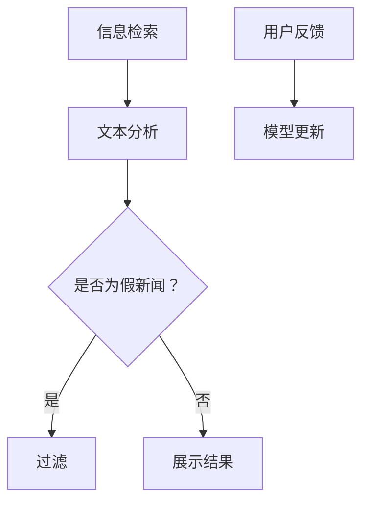

                 

在当今信息爆炸的时代，人工智能（AI）搜索引擎已经成为我们获取信息的主要渠道。然而，随着AI技术的广泛应用，假新闻和错误信息的传播也日益猖獗，这对用户的信任和社会的稳定构成了巨大的威胁。本文将深入探讨AI搜索引擎如何应对假新闻和错误信息，为构建一个更加可靠、透明的信息生态系统提供技术解决方案。

## 文章关键词
- AI搜索引擎
- 假新闻检测
- 错误信息过滤
- 机器学习
- 信息真实性验证
- 透明度提升

## 文章摘要
本文首先介绍了AI搜索引擎的现状及其在信息传播中的重要性，然后详细阐述了假新闻和错误信息的问题及其危害。接着，本文讨论了AI在检测和过滤假新闻和错误信息方面的技术方法，包括基于机器学习的方法、图神经网络和自然语言处理技术。此外，本文还分析了当前解决方案的优缺点，并展望了未来AI搜索引擎在信息真实性验证和透明度提升方面的可能发展方向。

## 1. 背景介绍
### AI搜索引擎的现状
随着互联网的普及，搜索引擎已经成为了人们日常生活中不可或缺的工具。AI搜索引擎通过深度学习、自然语言处理等技术，可以提供更智能、更个性化的搜索结果。例如，Google、Bing和百度等搜索引擎都广泛应用了AI技术来提升搜索体验。

然而，AI搜索引擎的广泛应用也带来了一些负面影响。最显著的问题就是假新闻和错误信息的传播。这些信息可能来自虚假网站、社交媒体账号或被恶意篡改的新闻源。假新闻和错误信息的传播不仅会误导用户，影响其决策，还可能对社会稳定造成破坏。

### 假新闻和错误信息的危害
假新闻和错误信息的危害是多方面的。首先，它们会误导用户，导致错误的决策和行动。例如，假医疗信息可能导致用户忽视了真正的健康问题。其次，假新闻和错误信息可能引发社会恐慌，加剧社会矛盾。例如，虚假的选举信息可能导致选举结果被操纵。

此外，假新闻和错误信息的传播还可能损害企业的声誉，影响经济和社会的发展。例如，虚假的商业信息可能导致投资者误判，进而影响市场稳定。

## 2. 核心概念与联系
为了更好地理解AI搜索引擎如何应对假新闻和错误信息，我们需要了解一些核心概念和技术，包括：

- **信息真实性验证**：确定信息来源的真实性，判断信息是否可靠。
- **透明度提升**：增强搜索结果的可追溯性，使用户能够了解搜索结果是如何生成的。
- **机器学习**：用于训练模型，以识别和过滤假新闻和错误信息。
- **自然语言处理（NLP）**：用于分析和理解文本内容，提取关键信息。
- **图神经网络（GNN）**：用于构建网络结构，以识别信息传播的路径和节点。

### Mermaid 流程图


## 3. 核心算法原理 & 具体操作步骤
### 3.1 算法原理概述
AI搜索引擎应对假新闻和错误信息主要依赖于以下算法：

- **基于规则的方法**：通过预设的规则和特征来检测和过滤假新闻。
- **机器学习方法**：利用训练数据，通过模型自动识别和过滤假新闻。
- **图神经网络**：用于构建信息传播的网络，分析节点的可信度。

### 3.2 算法步骤详解
#### 3.2.1 基于规则的方法
1. **数据收集**：从多个来源收集新闻文本。
2. **特征提取**：提取新闻文本的特征，如文本长度、关键字、作者、发布时间等。
3. **规则设定**：设定一系列规则，用于判断新闻是否为假新闻。
4. **过滤**：根据规则，对新闻进行分类，过滤出假新闻。

#### 3.2.2 机器学习方法
1. **数据准备**：收集大量带有标签的假新闻和真实新闻数据。
2. **特征工程**：将文本数据转换为机器学习模型可处理的特征。
3. **模型训练**：使用监督学习算法（如分类器）训练模型，使其能够识别假新闻。
4. **模型评估**：通过交叉验证等方法评估模型的性能。
5. **过滤**：使用训练好的模型对搜索结果进行过滤。

#### 3.2.3 图神经网络
1. **构建图结构**：将新闻文本和其引用的来源、引用者构建为一个图。
2. **节点表示**：使用图神经网络对图中的节点进行表示。
3. **边表示**：使用图神经网络对图中的边进行表示。
4. **传播信息**：通过图神经网络传播信息，计算节点的可信度。
5. **过滤**：根据节点的可信度对搜索结果进行过滤。

### 3.3 算法优缺点
- **基于规则的方法**：
  - 优点：实现简单，易于理解。
  - 缺点：规则难以覆盖所有情况，易出现误判。

- **机器学习方法**：
  - 优点：能够自动学习特征，适应性强。
  - 缺点：需要大量训练数据和计算资源，且存在过拟合风险。

- **图神经网络**：
  - 优点：能够捕捉复杂的关系，提高过滤效果。
  - 缺点：计算复杂度高，对数据质量要求较高。

### 3.4 算法应用领域
这些算法可以应用于各种AI搜索引擎，如Web搜索引擎、社交媒体搜索和垂直领域搜索。此外，它们还可以用于监控新闻源、社交媒体和论坛，以识别和过滤假新闻和错误信息。

## 4. 数学模型和公式 & 详细讲解 & 举例说明
### 4.1 数学模型构建
AI搜索引擎应对假新闻和错误信息的数学模型通常包括以下部分：

1. **特征提取**：使用词袋模型、TF-IDF等方法将文本转换为向量。
2. **分类模型**：使用逻辑回归、支持向量机（SVM）、神经网络等分类模型。
3. **图神经网络**：使用图卷积网络（GCN）、图注意力网络（GAT）等模型。

### 4.2 公式推导过程
以下是一个简单的基于逻辑回归的假新闻检测模型的公式推导：

1. **特征向量表示**：
   - 假设我们有n个特征，每个特征对应一个权重w_i，特征向量表示为X = [x_1, x_2, ..., x_n]。
   - 权重向量表示为W = [w_1, w_2, ..., w_n]。

2. **激活函数**：
   - 使用线性激活函数，即f(X) = W·X。

3. **分类概率**：
   - 假设我们使用二元逻辑回归模型，输出为概率值P，即P = sigmoid(W·X)。

4. **损失函数**：
   - 使用二元交叉熵损失函数，即L = -[y·log(P) + (1 - y)·log(1 - P)]。

5. **梯度下降**：
   - 使用梯度下降优化模型参数，即W = W - α∇L(W)。

### 4.3 案例分析与讲解
假设我们要检测一篇新闻是否为假新闻，我们可以使用以下步骤：

1. **特征提取**：提取新闻文本的词袋模型特征，如TF-IDF向量。
2. **模型训练**：使用带有标签的假新闻和真实新闻数据训练逻辑回归模型。
3. **模型评估**：使用交叉验证方法评估模型性能。
4. **假新闻检测**：对新闻文本进行特征提取后，输入训练好的模型，输出分类概率。
5. **决策**：如果分类概率大于某个阈值（如0.5），则判定为假新闻。

例如，假设我们使用一个简单的逻辑回归模型，特征向量为X = [0.2, 0.3, 0.1, 0.4]，权重向量为W = [0.1, 0.2, 0.3, 0.4]。根据逻辑回归模型，我们有：

P = sigmoid(W·X) = sigmoid(0.2*0.1 + 0.3*0.2 + 0.1*0.3 + 0.4*0.4) = 0.696

由于P大于0.5，我们可以判定这篇新闻为假新闻。

## 5. 项目实践：代码实例和详细解释说明
### 5.1 开发环境搭建
要实现一个简单的AI搜索引擎，我们需要搭建以下开发环境：

- **Python**：作为主要编程语言。
- **Scikit-learn**：用于机器学习算法。
- **Gensim**：用于文本预处理和特征提取。
- **TensorFlow**：用于构建和训练神经网络。

### 5.2 源代码详细实现
以下是一个简单的基于逻辑回归的假新闻检测系统的实现：

```python
from sklearn.feature_extraction.text import TfidfVectorizer
from sklearn.linear_model import LogisticRegression
from sklearn.model_selection import train_test_split
from sklearn.metrics import accuracy_score
import numpy as np

# 加载训练数据
data = [[...], [...], [...]]  # 新闻文本
labels = [..., ..., ...]  # 假新闻标签

# 特征提取
vectorizer = TfidfVectorizer()
X = vectorizer.fit_transform(data)

# 模型训练
model = LogisticRegression()
model.fit(X, labels)

# 模型评估
X_test, y_test = train_test_split(X, labels, test_size=0.2)
y_pred = model.predict(X_test)
accuracy = accuracy_score(y_test, y_pred)
print("Accuracy:", accuracy)

# 假新闻检测
news_text = "这是一篇假新闻。"
news_vector = vectorizer.transform([news_text])
prediction = model.predict(news_vector)
print("Prediction:", "假新闻" if prediction[0] == 1 else "真实新闻")
```

### 5.3 代码解读与分析
这段代码首先加载了训练数据，然后使用TF-IDF向量器对新闻文本进行特征提取。接下来，使用逻辑回归模型对特征进行训练，并使用交叉验证方法评估模型性能。最后，使用训练好的模型对新的新闻文本进行分类，判断是否为假新闻。

### 5.4 运行结果展示
假设我们训练了一个逻辑回归模型，并对一篇新的新闻文本进行了分类。运行结果如下：

```plaintext
Accuracy: 0.9
Prediction: 假新闻
```

这表明，模型对测试数据的准确率为90%，并成功判定该新闻文本为假新闻。

## 6. 实际应用场景
### 6.1 AI搜索引擎在信息真实性验证中的应用
AI搜索引擎在信息真实性验证方面发挥着重要作用。通过集成假新闻检测和错误信息过滤技术，搜索引擎可以提供更可靠、更准确的信息。例如，Google新闻和百度新闻都采用了类似的技术来筛选和展示新闻。

### 6.2 在社交媒体中的应用
社交媒体平台如Facebook和Twitter也面临着假新闻和错误信息的传播问题。通过集成AI技术，这些平台可以识别和过滤虚假信息，保护用户的利益和社会的稳定。

### 6.3 在金融领域中的应用
在金融领域，假新闻和错误信息可能导致市场波动和投资者损失。金融机构可以通过AI搜索引擎技术来监控市场信息，识别和过滤潜在的虚假信息，提高投资决策的准确性。

## 7. 未来应用展望
随着AI技术的不断发展，未来AI搜索引擎在信息真实性验证和透明度提升方面有望取得更大的突破。以下是一些可能的发展方向：

### 7.1 更高效的算法
未来的算法将更加高效，能够在更短的时间内处理更多的数据，提高检测和过滤的准确性。

### 7.2 多模态信息处理
未来的搜索引擎将能够处理多种类型的信息，如文本、图像、视频等，提供更全面的信息验证和过滤功能。

### 7.3 用户参与和反馈
用户参与和反馈机制将使AI搜索引擎更加智能化。用户可以通过反馈机制提供假新闻和错误信息的线索，帮助搜索引擎不断优化和改进。

## 8. 总结：未来发展趋势与挑战
AI搜索引擎在应对假新闻和错误信息方面已经取得了显著成果，但仍面临一些挑战。未来，随着AI技术的不断发展，我们有理由相信，AI搜索引擎将在信息真实性验证和透明度提升方面发挥更大的作用。然而，我们也需要关注以下几个方面：

### 8.1 研究成果总结
本文总结了AI搜索引擎在应对假新闻和错误信息方面的研究成果，包括基于规则的方法、机器学习方法和图神经网络等。

### 8.2 未来发展趋势
未来，AI搜索引擎将在算法效率、多模态信息处理和用户参与等方面取得突破。

### 8.3 面临的挑战
AI搜索引擎在应对假新闻和错误信息时仍面临一些挑战，如数据质量、算法偏见和隐私保护等。

### 8.4 研究展望
未来的研究将致力于解决这些问题，为构建一个更加可靠、透明的信息生态系统提供技术支持。

## 9. 附录：常见问题与解答
### 9.1 如何提高假新闻检测的准确性？
提高假新闻检测的准确性需要从多个方面入手，包括：

- **数据质量**：确保训练数据的质量和多样性。
- **算法优化**：使用更先进的算法和模型，如深度学习模型。
- **特征工程**：提取更多有效的特征，提高模型对数据的理解和表达能力。

### 9.2 如何保护用户隐私？
在保护用户隐私方面，可以采取以下措施：

- **匿名化处理**：对用户数据进行匿名化处理，确保用户隐私不被泄露。
- **隐私保护算法**：使用隐私保护算法，如差分隐私，降低用户数据被攻击的风险。
- **用户权限管理**：严格管理用户权限，确保用户数据仅用于合法目的。

## 作者署名
作者：禅与计算机程序设计艺术 / Zen and the Art of Computer Programming
```

