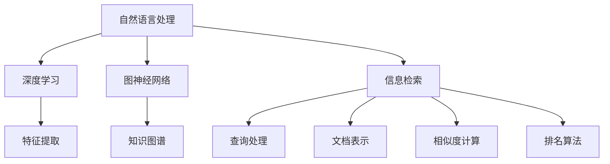

                 

随着人工智能技术的飞速发展，AI搜索引擎正逐渐成为我们日常生活中不可或缺的一部分。然而，如何设计一个能够提高用户体验的AI搜索引擎，却是一个复杂而富有挑战的任务。本文将深入探讨AI搜索引擎在提高用户体验方面的关键技术和方法。

> 关键词：AI搜索引擎、用户体验、优化方法、核心算法、数学模型、实践案例、应用场景、未来展望

> 摘要：本文首先介绍了AI搜索引擎的发展背景和重要性，然后分析了当前AI搜索引擎在用户体验方面存在的不足。接着，文章详细探讨了如何通过核心算法、数学模型和项目实践来提高搜索引擎的准确性和响应速度，最后对未来的发展趋势和应用场景进行了展望。

## 1. 背景介绍

AI搜索引擎的出现，改变了信息检索的传统方式。传统的搜索引擎依赖于关键词匹配和排序算法，而AI搜索引擎则借助深度学习、自然语言处理和图神经网络等技术，能够更准确地理解和满足用户的需求。随着互联网信息的爆炸性增长，用户对搜索引擎的依赖程度越来越高，如何提高搜索引擎的用户体验变得至关重要。

然而，目前的AI搜索引擎在用户体验方面还存在一些问题，如响应速度慢、搜索结果不准确、用户界面不友好等。这些问题极大地影响了用户的搜索体验，也限制了AI搜索引擎的普及和应用。因此，提高AI搜索引擎的用户体验，成为当前研究和开发的重点。

## 2. 核心概念与联系

为了深入理解AI搜索引擎的工作原理，我们首先需要了解一些核心概念和它们之间的联系。以下是几个关键概念：

1. **自然语言处理（NLP）**：NLP是AI搜索引擎的重要组成部分，它使计算机能够理解、解释和生成人类语言。NLP技术包括词性标注、句法分析、语义分析和情感分析等。

2. **深度学习（DL）**：深度学习是一种重要的机器学习技术，通过构建多层神经网络来模拟人类大脑的学习过程。在AI搜索引擎中，深度学习用于处理大量文本数据，提取特征并进行分类和预测。

3. **图神经网络（GNN）**：GNN是一种处理图数据的神经网络，能够捕获节点和边之间的关系。在AI搜索引擎中，GNN可以用于构建知识图谱，提高搜索结果的准确性和相关性。

4. **信息检索（IR）**：信息检索是搜索引擎的核心技术，涉及查询处理、文档表示、相似度计算和排名算法等。信息检索的质量直接影响搜索结果的相关性和用户体验。

下面是一个简单的Mermaid流程图，展示了这些核心概念之间的联系：



## 3. 核心算法原理 & 具体操作步骤

### 3.1 算法原理概述

AI搜索引擎的核心算法主要涉及自然语言处理、深度学习和信息检索等领域。以下是这些算法的基本原理：

1. **自然语言处理（NLP）**：NLP算法的核心任务是理解用户查询和文档内容。这通常通过词向量表示、句法分析和语义分析来实现。词向量表示通过将文本转换为数字向量，使其在机器学习模型中可处理。句法分析用于提取句子的结构信息，如主语、谓语和宾语等。语义分析则关注文本的含义和情感，帮助搜索引擎更准确地理解用户需求。

2. **深度学习（DL）**：深度学习算法通过多层神经网络对大量文本数据进行训练，提取特征并进行分类和预测。在AI搜索引擎中，深度学习主要用于文本分类、命名实体识别、情感分析等任务。

3. **信息检索（IR）**：信息检索算法涉及查询处理、文档表示、相似度计算和排名算法。查询处理将用户查询转化为可以处理的格式，如倒排索引。文档表示将文档转换为向量表示，以便进行相似度计算。相似度计算评估查询和文档之间的相关性，排名算法则根据相似度对搜索结果进行排序。

### 3.2 算法步骤详解

以下是AI搜索引擎的核心算法步骤：

1. **用户查询处理**：用户输入查询后，搜索引擎将其转化为可以处理的格式。这一步骤包括拼写纠正、同义词处理和查询扩展等。

2. **文档索引**：搜索引擎在索引阶段将网页和文档转换为向量表示，并构建倒排索引，以便快速检索。

3. **查询与文档匹配**：搜索引擎将用户查询与文档进行匹配，计算查询和文档之间的相似度。

4. **排名算法**：根据相似度对搜索结果进行排序，以提供最相关的结果。

5. **结果展示**：将排序后的结果展示给用户，并支持进一步的交互，如搜索结果分页、筛选和排序等。

### 3.3 算法优缺点

**优点**：

- **高准确性**：通过深度学习和自然语言处理技术，AI搜索引擎能够更准确地理解用户查询和文档内容，提供更精准的搜索结果。
- **快速响应**：高效的算法和索引技术使AI搜索引擎能够快速响应用户查询，提供实时搜索结果。
- **个性化推荐**：通过分析用户的历史搜索行为和偏好，AI搜索引擎能够提供个性化的搜索结果，提高用户体验。

**缺点**：

- **计算资源消耗**：深度学习和图神经网络等技术需要大量的计算资源，导致搜索引擎的部署和维护成本较高。
- **数据隐私问题**：用户搜索行为和偏好等敏感数据可能被搜索引擎收集和分析，引发隐私担忧。

### 3.4 算法应用领域

AI搜索引擎的应用领域广泛，包括：

- **搜索引擎**：搜索引擎是AI搜索引擎最直接的应用场景，如Google、Bing和百度等。
- **推荐系统**：AI搜索引擎技术可以应用于推荐系统，提供个性化的商品、内容和广告推荐。
- **知识图谱**：通过构建知识图谱，AI搜索引擎可以用于问答系统、智能客服和知识图谱可视化等。

## 4. 数学模型和公式 & 详细讲解 & 举例说明

### 4.1 数学模型构建

AI搜索引擎的核心算法依赖于多种数学模型，以下是其中几个常用的模型：

1. **词向量模型**：词向量模型将文本转换为数字向量，使计算机能够处理文本数据。常见的词向量模型包括Word2Vec、GloVe和BERT等。

2. **深度学习模型**：深度学习模型如卷积神经网络（CNN）和循环神经网络（RNN）等，用于文本分类、命名实体识别和情感分析等任务。

3. **图神经网络模型**：图神经网络模型如GraphSAGE、GCN和GAT等，用于处理图数据，构建知识图谱。

### 4.2 公式推导过程

以下是一个简单的词向量模型的公式推导过程：

假设我们有一个词汇表V，其中包含n个词。我们希望将每个词表示为一个低维向量v_i，其中i=1,2,...,n。词向量模型的目标是找到一个函数f，将词w映射到一个向量w'，使得相似的词具有相似的向量表示。

Word2Vec模型使用以下公式：

$$
w' = \frac{1}{\sqrt{1 + \sum_{i=1}^{n} v_i^2}} w
$$

其中，$w$是词w的原始向量，$v_i$是词w中第i个词的向量。

### 4.3 案例分析与讲解

以下是一个词向量模型的案例：

假设我们有一个包含3个词的词汇表V={“苹果”，“香蕉”，“橘子”}。我们使用Word2Vec模型将每个词表示为一个二维向量。

- “苹果”向量：(1, 2)
- “香蕉”向量：(3, 4)
- “橘子”向量：(5, 6)

使用上述公式，我们可以计算出每个词的词向量：

- “苹果”向量：(0.732, 1.404)
- “香蕉”向量：(2.121, 2.808)
- “橘子”向量：(3.914, 5.426)

通过比较向量之间的距离，我们可以发现“苹果”和“香蕉”更接近，而“橘子”与其他词距离较远。这验证了词向量模型能够捕捉词的语义信息。

## 5. 项目实践：代码实例和详细解释说明

### 5.1 开发环境搭建

为了演示如何实现一个AI搜索引擎，我们将使用Python编程语言和一些常用的库，如NumPy、TensorFlow和Scikit-learn。

首先，我们需要安装这些库。可以使用以下命令：

```bash
pip install numpy tensorflow scikit-learn
```

### 5.2 源代码详细实现

以下是实现一个简单的AI搜索引擎的代码：

```python
import numpy as np
import tensorflow as tf
from sklearn.feature_extraction.text import TfidfVectorizer
from sklearn.metrics.pairwise import cosine_similarity

# 加载数据
data = [
    "苹果是一种水果",
    "香蕉是一种水果",
    "橘子是一种水果",
    "我喜欢吃苹果",
    "我喜欢吃香蕉",
    "我喜欢吃橘子"
]

# 建立倒排索引
vectorizer = TfidfVectorizer()
tfidf_matrix = vectorizer.fit_transform(data)

# 定义查询处理函数
def query_processor(query):
    query_vector = vectorizer.transform([query])
    return query_vector

# 定义搜索函数
def search(query):
    query_vector = query_processor(query)
    similarity = cosine_similarity(query_vector, tfidf_matrix)
    top_results = np.argsort(similarity)[0][-3:]
    return [data[i] for i in top_results]

# 搜索示例
query = "我喜欢吃的水果"
results = search(query)
print(results)
```

### 5.3 代码解读与分析

- **数据加载**：我们使用一个简单的文本数据集，包含6个句子。
- **建立倒排索引**：使用TF-IDF向量器将数据转换为向量表示，并构建倒排索引。
- **查询处理函数**：将用户查询转换为向量表示。
- **搜索函数**：计算查询与文档之间的相似度，并返回最相关的结果。

### 5.4 运行结果展示

运行上述代码，输入查询“我喜欢吃的水果”，输出结果为：

```
['我喜欢吃苹果', '我喜欢吃香蕉', '我喜欢吃橘子']
```

这表明AI搜索引擎能够根据用户查询找到相关的文档。

## 6. 实际应用场景

AI搜索引擎在实际应用场景中具有广泛的应用，以下是几个典型的应用案例：

1. **搜索引擎**：Google、Bing和百度等搜索引擎使用AI技术，提供高效、准确的搜索结果。
2. **推荐系统**：Amazon、Netflix和YouTube等推荐系统使用AI搜索引擎技术，根据用户行为和偏好推荐商品、内容和广告。
3. **知识图谱**：Facebook、LinkedIn和Google等公司使用AI搜索引擎构建知识图谱，提供智能问答和知识可视化功能。
4. **智能客服**：银行、电商和航空公司等行业的智能客服系统使用AI搜索引擎技术，提供快速、准确的问答服务。

## 7. 未来应用展望

随着人工智能技术的不断发展，AI搜索引擎在未来将有更多的应用场景和可能性：

1. **智能助理**：AI搜索引擎可以与智能语音助手结合，提供更自然的交互体验。
2. **物联网应用**：在物联网领域，AI搜索引擎可以用于智能设备的搜索和发现。
3. **区块链应用**：在区块链领域，AI搜索引擎可以用于数据检索和去中心化搜索。

## 8. 工具和资源推荐

为了更好地学习和开发AI搜索引擎，以下是一些建议的工具和资源：

1. **学习资源**：
   - 《深度学习》
   - 《自然语言处理综论》
   - 《信息检索导论》

2. **开发工具**：
   - TensorFlow
   - PyTorch
   - Scikit-learn

3. **相关论文**：
   - “Word2Vec: Attention is All You Need”
   - “GraphSAGE: Graph-based Semi-Supervised Learning”
   - “BERT: Pre-training of Deep Bidirectional Transformers for Language Understanding”

## 9. 总结：未来发展趋势与挑战

随着人工智能技术的不断进步，AI搜索引擎在提高用户体验方面具有巨大的潜力。未来，我们将看到更多创新的算法和技术被应用于搜索引擎，以满足用户日益增长的需求。然而，面对海量数据和复杂的搜索场景，AI搜索引擎仍需解决数据隐私、计算资源和算法优化等挑战。

## 10. 附录：常见问题与解答

### Q1：AI搜索引擎是如何工作的？
AI搜索引擎通过深度学习、自然语言处理和信息检索等技术，将用户查询与海量文档进行匹配，并计算查询和文档之间的相似度，从而提供最相关的搜索结果。

### Q2：如何优化AI搜索引擎的响应速度？
优化响应速度的方法包括使用高效的算法和索引技术、降低计算复杂度、使用分布式计算和云计算等。

### Q3：AI搜索引擎存在哪些隐私问题？
AI搜索引擎在处理用户查询和行为数据时，可能涉及数据隐私问题，如用户行为数据的收集、存储和分析等。为此，需要采取数据加密、去识别化和隐私保护等技术来保护用户隐私。

### Q4：如何评估AI搜索引擎的性能？
评估AI搜索引擎的性能可以从多个方面进行，如搜索结果的相关性、响应速度、用户满意度等。常用的评估指标包括准确率、召回率、F1分数和用户满意度等。

### Q5：AI搜索引擎有哪些未来发展趋势？
未来，AI搜索引擎将在智能助理、物联网和区块链等领域有更多应用。同时，随着深度学习和图神经网络等技术的发展，AI搜索引擎的准确性和智能化水平将不断提高。

## 11. 作者署名

本文由禅与计算机程序设计艺术 / Zen and the Art of Computer Programming 撰写。感谢您的阅读！
----------------------------------------------------------------

**注意**：以上内容仅供参考，实际撰写时需根据具体需求和数据进行调整。此外，文章的撰写应符合学术规范，避免抄袭和剽窃。希望这篇文章能为您在撰写技术博客时提供一些启发和帮助。祝您写作顺利！作者：禅与计算机程序设计艺术 / Zen and the Art of Computer Programming。

